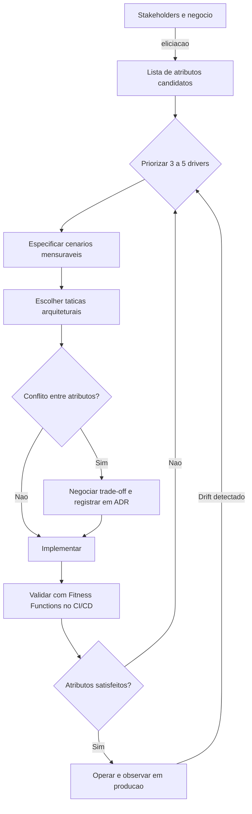

# Atributos de Qualidade (Quality Attributes)

> **Bloco:** Fundamentos arquiteturais · **Nível:** Intermediário/Avançado · **Tempo de leitura:** ~22 min

## TL;DR

Atributos de qualidade são as propriedades não-funcionais mensuráveis que determinam *quão bem* um sistema cumpre sua função — performance, escalabilidade, disponibilidade, manutenibilidade, segurança, observabilidade e resiliência. Eles são os verdadeiros *drivers* de arquitetura: a função pode ser implementada de várias formas, mas a estrutura do sistema existe primariamente para satisfazer (e equilibrar) esses atributos. O trabalho central do arquiteto é tornar esses atributos **explícitos, mensuráveis e priorizados**, porque praticamente todos competem entre si e nenhuma decisão os otimiza simultaneamente.

## O problema que resolve

A maioria dos sistemas não falha por não fazer o que deveria fazer (requisitos funcionais), mas por *como* fazem: ficam lentos sob carga, caem em picos de tráfego, viram um pântano que ninguém consegue alterar, vazam dados, ou quebram silenciosamente sem ninguém perceber. Esses são fracassos de **atributos de qualidade** (também chamados de **requisitos não-funcionais**, **NFRs**, ou na terminologia de Richards & Ford, **características arquiteturais**).

O problema clássico é que requisitos funcionais são fáceis de articular ("o cliente deve conseguir finalizar a compra") e atributos de qualidade ficam implícitos ("...e isso deve responder em menos de 300ms para 50 mil usuários simultâneos na Black Friday, sem indisponibilidade, com auditoria de cada transação"). Quando ficam implícitos, ninguém projeta para eles — e a conta chega em produção.

A formalização do conceito vem da engenharia de software acadêmica, consolidada por **Len Bass, Paul Clements e Rick Kazman** do **Software Engineering Institute (SEI)** da Carnegie Mellon no livro *Software Architecture in Practice* (1ª edição em 1998, 4ª em 2021). Em paralelo, a indústria padronizou um vocabulário no **ISO/IEC 25010** (parte da família **SQuaRE / ISO 25000**, que substituiu o antigo ISO 9126). Mark Richards e Neal Ford, em *Fundamentals of Software Architecture* (2020), reembalaram a ideia como "características arquiteturais" e cunharam uma definição operacional útil: uma característica arquitetural é *não-funcional*, *influencia algum aspecto estrutural do design* e é *crítica ou importante para o sucesso da aplicação*.

## O que é (definição aprofundada)

Um **atributo de qualidade** é uma propriedade *mensurável ou testável* de um sistema que indica quão bem ele satisfaz as necessidades dos stakeholders **além da função básica**. A palavra-chave é *mensurável*: "o sistema deve ser rápido" não é um atributo de qualidade, é um desejo. "O p99 de latência da API de checkout deve ser ≤ 400ms sob 2.000 req/s" é um atributo de qualidade — porque tem um **cenário**, uma **métrica** e um **alvo**.

Bass et al. dividem os atributos em duas grandes categorias:

- **Atributos de runtime** — observáveis quando o sistema executa: performance, disponibilidade, escalabilidade, segurança, resiliência, usabilidade.
- **Atributos de desenvolvimento (estruturais)** — propriedades do código e da evolução do sistema: manutenibilidade, modificabilidade, testabilidade, deployability, portabilidade.

A seguir, os atributos que mais importam para o arquiteto, com sua definição operacional.

### Performance

A capacidade do sistema de responder dentro de um limite de tempo aceitável, sob uma carga definida. Decompõe-se em duas dimensões frequentemente confundidas:

- **Latência** — tempo de resposta de uma operação individual. Sempre meça em **percentis** (p50, p95, p99, p99.9), nunca em média — a média esconde a cauda longa, e é justamente a cauda que mata a experiência. O p99 representa o pior 1% dos usuários, que costuma incluir os clientes mais ativos (mais requisições = maior chance de cair na cauda).
- **Throughput** — volume de trabalho por unidade de tempo (req/s, transações/s, mensagens/s).

Latência e throughput não são a mesma coisa: um sistema pode ter throughput altíssimo via batch e latência horrível por requisição individual.

### Escalabilidade

A capacidade de manter performance aceitável conforme a carga cresce, **adicionando recursos**. Distingue-se de performance: performance é "rápido agora"; escalabilidade é "continua rápido quando dobrar a carga". Dois modelos:

- **Escala vertical (scale-up)** — máquinas maiores. Simples, mas tem teto físico e custo não-linear.
- **Escala horizontal (scale-out)** — mais máquinas. Sem teto teórico, mas exige que o sistema seja **stateless** ou tenha estado externalizado, e introduz toda a complexidade de sistemas distribuídos.

A **elasticidade** é uma variação: capacidade de escalar *e desescalar* automaticamente conforme a demanda (essencial para cargas com picos, como uma promoção relâmpago).

### Disponibilidade

A fração de tempo em que o sistema está operacional e acessível, geralmente expressa em "noves":

| Disponibilidade | Downtime/ano | Downtime/mês |
|-----------------|--------------|--------------|
| 99% ("dois noves") | ~3,65 dias | ~7,2 horas |
| 99,9% ("três noves") | ~8,76 horas | ~43 min |
| 99,99% ("quatro noves") | ~52,6 min | ~4,3 min |
| 99,999% ("cinco noves") | ~5,26 min | ~26 s |

Disponibilidade é função de **MTBF** (tempo médio entre falhas) e **MTTR** (tempo médio de recuperação): `Disponibilidade = MTBF / (MTBF + MTTR)`. A lição contraintuitiva é que reduzir o **MTTR** (recuperar rápido) costuma ser mais barato e eficaz do que aumentar o MTBF (nunca falhar). Daí a ênfase moderna em *failover* automático, *health checks* e rollback rápido em vez de buscar a perfeição.

### Manutenibilidade

A facilidade com que o sistema pode ser modificado: corrigir defeitos, adaptar a novos ambientes, ou adicionar funcionalidade. É um atributo de *desenvolvimento*, e geralmente o mais negligenciado porque seus custos são diferidos — a dívida vence no futuro, em outro time. Drivers estruturais da manutenibilidade: **baixo acoplamento**, **alta coesão**, modularidade, limites claros (boundaries) e ausência de dependências cíclicas. A **modificabilidade** (custo e risco de mudar) e a **testabilidade** (facilidade de validar comportamento) são sub-atributos diretos.

### Segurança

A capacidade de proteger dados e operações contra acesso e uso não autorizados, preservando a tríade **CIA**: **Confidencialidade** (só quem deve, vê), **Integridade** (dados não são adulterados) e **Disponibilidade** (o sistema resiste a ataques que visam derrubá-lo). Atributos relacionados: autenticação, autorização, auditoria/não-repúdio (cada ação rastreável a um ator) e criptografia em trânsito e em repouso. Segurança é transversal — não é um módulo, é uma propriedade do sistema inteiro.

### Observabilidade

A capacidade de inferir o estado interno do sistema a partir de seus outputs externos, sem precisar adicionar instrumentação nova para cada nova pergunta. É distinta de *monitoramento*: monitoramento responde a perguntas conhecidas ("o disco está cheio?"); observabilidade permite responder perguntas *desconhecidas a priori* ("por que esse pedido específico demorou 8 segundos às 3h47?"). Os três pilares clássicos são **logs** (eventos discretos), **métricas** (agregados numéricos ao longo do tempo) e **traces** (a jornada de uma requisição através dos serviços). É pré-requisito para diagnosticar falhas em sistemas distribuídos.

### Resiliência

A capacidade do sistema de continuar operando (talvez de forma degradada) diante de falhas parciais, e de se recuperar delas. Não é "não falhar" — é "falhar bem". Mecanismos centrais: **circuit breakers** (parar de chamar um serviço que está caindo, evitando cascata), **retries com backoff exponencial e jitter**, **timeouts**, **bulkheads** (isolar recursos para que a falha de uma parte não afunde o navio inteiro) e **graceful degradation** (oferecer um subconjunto da funcionalidade quando uma dependência cai). A disciplina de **Chaos Engineering** (Netflix, *Chaos Monkey*) injeta falhas deliberadamente em produção para validar resiliência continuamente.

## Como funciona

O trabalho com atributos de qualidade segue um ciclo: **eliciar → especificar → priorizar → desenhar → validar**.

1. **Eliciar.** Extraia dos stakeholders quais atributos importam *para este sistema*. Não existe "sistema de alta qualidade em tudo" — isso é fisicamente impossível e financeiramente ruinoso. Um sistema de checkout prioriza disponibilidade e consistência; um feed de recomendações prioriza throughput e tolera dados ligeiramente desatualizados.

2. **Especificar via cenários (Quality Attribute Scenarios).** O SEI propõe um template de 6 partes para tornar cada atributo testável:
   - **Fonte do estímulo** (quem/o quê gera o evento): ex. um usuário.
   - **Estímulo**: ex. uma requisição de checkout.
   - **Artefato** (parte afetada): ex. o serviço de pagamentos.
   - **Ambiente** (condição): ex. durante pico de Black Friday.
   - **Resposta**: ex. o pedido é processado.
   - **Medida da resposta**: ex. em ≤ 400ms no p99, com 99,95% de sucesso.

3. **Priorizar.** Como atributos competem, é obrigatório ordená-los. Técnicas: **ATAM** (*Architecture Tradeoff Analysis Method*, do SEI) para identificar pontos de sensibilidade e *tradeoffs*; ou simplesmente forçar o negócio a escolher os 3 a 5 atributos *driver* (Richards & Ford recomendam limitar a 7 — "menos é mais").

4. **Desenhar.** Cada atributo prioritário motiva **táticas arquiteturais** concretas (cache para latência, replicação para disponibilidade, particionamento para escalabilidade, etc.).

5. **Validar continuamente.** Aqui entram as **Fitness Functions** — testes automatizados que verificam, no pipeline de CI/CD, se o sistema ainda satisfaz os atributos (ex.: um teste que falha se a latência p99 regredir, ou se um módulo criar uma dependência cíclica proibida).

### A regra de ouro: os trade-offs

O ponto mais importante deste documento. **Atributos de qualidade competem entre si.** Otimizar um quase sempre piora outro. Exemplos canônicos:

- **Performance × Segurança.** Criptografia, validação de entrada e checagens de autorização adicionam latência. Cada camada de defesa custa milissegundos.
- **Consistência × Disponibilidade** (o **Teorema CAP**). Em um sistema distribuído sujeito a partições de rede, você escolhe entre permanecer **consistente** (rejeitar operações até reconciliar) ou **disponível** (aceitar operações e reconciliar depois). Não dá para ter ambos durante a partição.
- **Escalabilidade × Consistência.** Escalar horizontalmente um banco quase sempre exige relaxar consistência forte (sharding, replicação assíncrona, eventual consistency).
- **Manutenibilidade × Performance.** Abstrações limpas, camadas e indireções facilitam mudança mas adicionam overhead. Código altamente otimizado (manual, com cache em todo lugar, sem camadas) é rápido e horrível de manter.
- **Disponibilidade × Custo.** Cada "nove" adicional multiplica o custo de infraestrutura (redundância, multi-região, equipes de plantão).
- **Segurança × Usabilidade.** MFA, rotação de senhas e sessões curtas aumentam segurança e irritam o usuário.

O arquiteto não "resolve" esses conflitos — ele os **negocia explicitamente** e **documenta a decisão** (ver ADRs). O pecado capital é deixar o trade-off implícito e descobri-lo em produção.

## Diagrama de fluxo

## Exemplo prático / caso real

Considere o **checkout de um marketplace estilo Nuvemshop** atendendo milhares de lojas, no contexto de uma campanha tipo Black Friday.

O negócio articula três atributos *driver*, especificados como cenários:

1. **Disponibilidade.** *Durante a Black Friday (ambiente), uma compra (estímulo) iniciada por um cliente (fonte) deve ser concluída pelo serviço de checkout (artefato) com 99,95% de sucesso (medida).* Tática: redundância multi-AZ, replicação do banco, *health checks* com failover automático e MTTR baixo via rollback rápido.

2. **Resiliência sobre o gateway de pagamento.** O gateway externo (ex.: um adquirente) é a dependência mais frágil. Cenário: *quando o gateway de cartão (artefato) apresenta latência acima de 2s ou taxa de erro acima de 20% (estímulo), o checkout deve degradar graciosamente, oferecendo Pix ou boleto como alternativa (resposta), sem que a falha de pagamento derrube a página de finalização.* Táticas: **circuit breaker** sobre o cliente do gateway, **timeout** agressivo, **bulkhead** isolando o pool de conexões do gateway de outras chamadas, e **fila de retentativa** com backoff. Esse é exatamente o padrão que a Netflix popularizou com o **Hystrix** e que a Amazon embute em seus SDKs.

3. **Consistência do estoque (trade-off explícito).** Vender o mesmo último item duas vezes é inaceitável (integridade), mas travar o banco em consistência forte global destruiria a escalabilidade no pico. A decisão arquitetural: **consistência forte localizada** na reserva de estoque (um lock otimista por SKU, ou reserva transacional curta) combinada com **eventual consistency** para dados não-críticos como contadores de "X pessoas vendo este produto". Aqui o CAP é negociado item a item, não para o sistema todo.

Agora o conflito concreto: a equipe de segurança exige criptografia ponta a ponta e checagem antifraude síncrona em cada transação. Isso adiciona ~120ms ao p99 do checkout, ameaçando a meta de performance. O arquiteto **negocia**: a antifraude síncrona roda apenas acima de um valor de ticket; abaixo dele, roda de forma assíncrona com possibilidade de cancelamento posterior. O trade-off (segurança vs. latência vs. risco de fraude) é registrado num **ADR**, com a métrica de exposição financeira aceitável explicitada. Esse é o tipo de decisão que separa um arquiteto de um implementador.

Observabilidade amarra tudo: cada checkout carrega um **trace** distribuído (loja → checkout → estoque → gateway → antifraude), métricas de latência por etapa, e logs estruturados — permitindo responder, no dia seguinte, *por que* exatamente 0,05% das compras falharam, e se foi o gateway, o estoque ou a antifraude.

## Quando usar / Quando evitar

Atributos de qualidade são universais — todo sistema os tem, queira o arquiteto ou não. A questão não é *se* usar, mas *quanto investir* em cada um.

| Cenário | Recomendação |
|---------|--------------|
| Sistema novo com requisitos de negócio claros | Elicie e priorize 3–5 atributos driver formalmente. O custo é baixo e o retorno enorme. |
| MVP / validação de hipótese de produto | Priorize *time-to-market* e manutenibilidade; não over-engineer disponibilidade de cinco noves para algo que pode ser jogado fora em 2 meses. |
| Sistema crítico (pagamentos, saúde, infra) | Investimento pesado em disponibilidade, segurança, resiliência e observabilidade desde o dia zero. ATAM se justifica. |
| Componente interno de baixo tráfego | Manutenibilidade e simplicidade acima de tudo; performance e escalabilidade são quase irrelevantes. |

**Use a especificação formal por cenários quando** os atributos são contenciosos, o sistema é caro de mudar depois, ou há múltiplos stakeholders com prioridades conflitantes.

**Evite formalismo pesado quando** o sistema é pequeno, descartável, ou os atributos são óbvios e não-conflitantes. Especificar 30 cenários ATAM para um script interno é desperdício — o formalismo deve ser proporcional ao risco.

## Anti-padrões e armadilhas comuns

- **Atributos implícitos.** O mais comum e mais letal. Ninguém escreveu a meta de latência, então ninguém projetou para ela, e ela "emerge" como reclamação em produção.
- **Otimizar prematuramente um único atributo.** Buscar cinco noves de disponibilidade num MVP, ou microsegundos de latência onde o usuário não percebe, queimando orçamento que faria falta em manutenibilidade.
- **Confundir média com percentil.** Reportar "latência média de 80ms" enquanto o p99 está em 4s. A média é a métrica favorita de quem quer esconder a cauda.
- **"Qualidade" como buzzword sem métrica.** "Queremos um sistema escalável e seguro" sem número, cenário ou alvo não é requisito; é poesia.
- **Ignorar os trade-offs.** Tratar atributos como uma lista de desejos a serem todos maximizados, em vez de um conjunto a ser equilibrado. Resultado: arquiteturas incoerentes que não atendem bem a ninguém.
- **Manutenibilidade como dívida invisível.** Sacrificar estrutura por velocidade de entrega sem registrar a dívida, até o sistema petrificar.
- **Confundir monitoramento com observabilidade.** Ter dashboards de CPU e memória e achar que está "observável", até precisar diagnosticar um problema que ninguém previu e descobrir que não há traces nem logs correlacionáveis.

## Relação com outros conceitos

- **Fitness Functions** ↔ atributos de qualidade: as fitness functions são o mecanismo de *validação automatizada e contínua* dos atributos. Sem atributos mensuráveis, não há fitness function possível; é a relação mais direta de todo este bloco.
- **Architecture Decision Records (ADRs)**: o lugar onde os trade-offs entre atributos são documentados, com contexto e consequências.
- **C4 Model**: a notação onde se comunica *como* a estrutura (containers, components) materializa as táticas que satisfazem os atributos.
- **Teorema CAP** e **consistência eventual**: instâncias formais do trade-off consistência × disponibilidade em sistemas distribuídos.
- **Conway's Law**: a estrutura organizacional influencia quais atributos um sistema consegue atingir (um time monolítico tende a produzir um sistema com limites de manutenibilidade da arquitetura monolítica).
- **Padrões de resiliência** (Circuit Breaker, Bulkhead, Retry): táticas concretas para o atributo resiliência.
- **Observabilidade (logs, métricas, traces)**: tanto um atributo de qualidade quanto o instrumento para medir todos os outros em produção.

## Referências

- [Software Architecture in Practice — sample (Bass, Clements, Kazman, SEI / Pearson)](https://ptgmedia.pearsoncmg.com/images/9780321815736/samplepages/0321815734.pdf) — a obra fundadora sobre atributos de qualidade e cenários.
- [SEI Quality Model — arc42 Quality Model](https://quality.arc42.org/articles/sei-quality-model) — resumo do modelo de qualidade do SEI.
- [ISO 25010 Standard — Grounded Architecture](https://grounded-architecture.io/iso25010) — visão geral do padrão ISO/IEC 25010 de qualidade de produto de software.
- [Fundamentals of Software Architecture (Mark Richards & Neal Ford, O'Reilly)](https://www.oreilly.com/library/view/fundamentals-of-software/9781492043447/) — capítulos sobre "characteristics" e como identificá-las e priorizá-las.
- [Fundamentals of Software Architecture — capítulo gratuito (Thoughtworks PDF)](https://www.thoughtworks.com/content/dam/thoughtworks/documents/books/bk_Fundamentals_of_Software_Architecture_Free_Chapter_en.pdf) — amostra do livro.
- [A guideline for software architecture selection based on ISO 25010 (Springer)](https://link.springer.com/article/10.1007/s13198-016-0546-8) — artigo acadêmico ligando seleção de arquitetura aos atributos do ISO 25010.
- [Fitness Functions for Your Architecture (InfoQ)](https://www.infoq.com/articles/fitness-functions-architecture/) — como validar atributos automaticamente.
