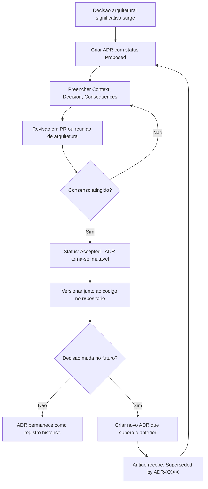

# Architecture Decision Records (ADRs)

> **Bloco:** Fundamentos arquiteturais · **Nível:** Intermediário/Avançado · **Tempo de leitura:** ~18 min

## TL;DR

Um **Architecture Decision Record (ADR)** é um documento curto e imutável que registra **uma** decisão arquitetural significativa: o contexto que a motivou, a decisão tomada e suas consequências. ADRs versionados junto ao código formam um **log de decisões** que preserva o *porquê* das escolhas — a informação que mais se perde com o tempo e a rotatividade de equipe. O formato foi popularizado por **Michael Nygard em 2011**, e o princípio central é: capture o raciocínio, não apenas o resultado.

## O problema que resolve

Todo sistema com algum tempo de vida acumula decisões cujo motivo ninguém mais lembra. *Por que usamos filas aqui em vez de chamada síncrona? Por que esse serviço fala com aquele banco diretamente, contra todas as nossas regras? Por que escolhemos PostgreSQL e não DynamoDB?* O conhecimento mora na cabeça de pessoas que saíram da empresa, em threads de Slack arquivadas, ou simplesmente evaporou.

Michael Nygard capturou a dor em uma frase que não envelheceu, no ensaio *Documenting Architecture Decisions* (2011):

> "Uma pessoa nova chegando ao projeto pode ficar perplexa, confusa, encantada ou furiosa com alguma decisão passada. Sem entender o raciocínio ou as consequências, ela tem apenas duas escolhas: aceitar cegamente a decisão ou mudá-la cegamente."

As duas escolhas são igualmente perigosas. Aceitar cegamente perpetua decisões que talvez não façam mais sentido. Mudar cegamente reintroduz os problemas que a decisão original resolveu — a clássica "cerca de Chesterton": não derrube uma cerca antes de entender por que ela foi erguida.

Documentação tradicional de arquitetura falha nesse ponto por dois motivos: ou é pesada demais (um documento Word de 80 páginas que ninguém atualiza e que descreve o *o quê*, não o *porquê*), ou inexistente. Nygard propôs um meio-termo deliberadamente **leve**, alinhado a processos ágeis: documentos de uma a duas páginas, focados na decisão e em seu raciocínio, versionados como código.

## O que é (definição aprofundada)

Um **ADR** captura **uma única decisão arquitetural** — daí a importância do singular. Não é um documento de design abrangente; é um registro atômico. O conjunto de todos os ADRs de um projeto forma o **Architecture Decision Log (ADL)**, normalmente uma pasta `doc/adr/` ou `docs/decisions/` no próprio repositório.

Três propriedades definem um bom ADR:

- **Imutabilidade.** Uma vez aceito, um ADR não é editado para refletir mudança de rumo. Se a decisão mudar, cria-se um *novo* ADR que **supera** (supersedes) o anterior, e o antigo é marcado como "Superseded by ADR-00XX". Isso preserva a *trilha histórica* — você consegue reconstruir não só o estado atual, mas a evolução do raciocínio. Essa é a diferença filosófica entre um ADR e uma página de wiki.
- **Foco no porquê.** O valor não está em registrar *que* se escolheu PostgreSQL, mas em registrar *por que* — quais alternativas foram consideradas, quais forças (atributos de qualidade, restrições de prazo, expertise da equipe) pesaram, e o que se aceitou abrir mão.
- **Significância.** ADRs documentam decisões **arquiteturalmente significativas** — aquelas custosas de reverter, com impacto estrutural amplo, ou que afetam atributos de qualidade. A heurística de Fowler/ThoughtWorks: registre decisões que afetam a estrutura, dependências, interfaces ou técnicas de construção; não registre o nome de uma variável.

### O template de Nygard

O formato original de Nygard, ainda o mais usado, tem cinco seções:

1. **Título** — curto, descritivo, numerado: `ADR-0007: Usar mensageria assíncrona entre checkout e fulfillment`.
2. **Status** — `Proposed`, `Accepted`, `Deprecated`, `Superseded by ADR-XXXX`. O ciclo de vida da decisão.
3. **Context** — as forças em jogo: o problema, os requisitos, as restrições, os atributos de qualidade pressionando a decisão. Aqui se descreve a situação de forma neutra, sem ainda decidir.
4. **Decision** — a decisão, em voz ativa e afirmativa: "Nós vamos usar...". Curta e inequívoca.
5. **Consequences** — o que decorre da decisão, **tanto positivo quanto negativo**. Esta seção é a que mais distingue ADRs bons de medíocres: um ADR honesto admite os trade-offs e os custos assumidos, não só os benefícios.

Existem variações ricas (MADR — *Markdown ADR*, com seções de "Considered Options" e "Decision Drivers"; o template de Tyree & Akerman, mais detalhado), mas o de Nygard vence pela economia. A regra é: o template deve ser leve o suficiente para que as pessoas realmente o usem.

## Como funciona

O fluxo de vida de um ADR no dia a dia de uma equipe:

1. **Disparo.** Alguém percebe que uma decisão significativa está prestes a ser (ou foi) tomada. Pode emergir de um RFC, de uma discussão de design, ou de um Pull Request controverso.
2. **Rascunho (Proposed).** Cria-se um novo arquivo Markdown numerado sequencialmente na pasta de ADRs, com status `Proposed`. O autor preenche Context, Decision e Consequences.
3. **Revisão.** O ADR vira o artefato central da discussão — em PR, em reunião de arquitetura, ou em RFC. A discussão estrutura-se em torno do documento, não de threads dispersas. Isso por si só melhora a qualidade do debate.
4. **Decisão (Accepted).** Atingido consenso (ou a decisão de quem tem a autoridade), o status muda para `Accepted`. A partir daqui, o documento é **imutável**.
5. **Evolução.** Se mais tarde a decisão for revertida ou substituída, **não se edita** o ADR antigo. Cria-se um novo ADR que documenta a nova decisão e referencia o anterior; o antigo recebe `Superseded by ADR-XXXX`.

A ferramenta `adr-tools` (de Nat Pryce) automatiza isso via linha de comando (`adr new "título"`, `adr supersede`), mas a prática funciona perfeitamente com arquivos Markdown criados à mão. O ponto crucial é manter os ADRs **junto ao código** (no mesmo repositório), versionados com Git, para que evoluam no mesmo ritmo do sistema e fiquem visíveis em code review.

### Numeração e organização

ADRs são numerados sequencialmente e *nunca* renumerados (a numeração é uma identidade estável para referências cruzadas). Um índice (`README.md` na pasta de ADRs, ou geração automática) facilita a navegação. Em organizações grandes, ADRs podem viver em três níveis: por equipe/serviço (a maioria), por domínio, e organizacionais (decisões transversais, ex.: "todo serviço expõe métricas no formato X").

## Diagrama de fluxo

## Exemplo prático / caso real

Cenário: uma **fintech de pagamentos** precisa decidir como o serviço de checkout comunica a confirmação de pagamento ao serviço de fulfillment (geração de comprovante, notificação ao lojista, baixa de estoque). A equipe debate entre chamada síncrona REST e mensageria assíncrona. Eis o ADR resultante:

---

**ADR-0012: Comunicação assíncrona entre checkout e fulfillment via fila**

**Status:** Accepted

**Context:** O serviço de checkout, após aprovar um pagamento, precisa disparar quatro ações no fulfillment: emitir comprovante, baixar estoque, notificar o lojista e atualizar o painel de vendas. Hoje isso é feito por uma cadeia de chamadas REST síncronas dentro da transação de checkout. Em picos de tráfego (campanhas), observamos que a latência do checkout (p99 de 1,8s, meta de 400ms) é dominada por essas chamadas downstream, e uma falha transitória no fulfillment derruba a confirmação do pagamento — pior cenário possível, pois o cliente foi cobrado mas vê erro. O atributo de qualidade prioritário aqui é **resiliência** do checkout sobre **consistência imediata** das ações de fulfillment, que toleram alguns segundos de atraso.

**Decision:** O checkout publicará um evento `PaymentApproved` em uma fila (RabbitMQ) imediatamente após aprovar o pagamento, e retornará sucesso ao cliente. Os consumidores do fulfillment processarão o evento de forma assíncrona, cada um com sua própria fila e política de retry com backoff exponencial. A entrega segue o modelo *at-least-once*, e os consumidores serão **idempotentes** (deduplicação por `payment_id`).

**Consequences:**

- *Positivo:* a latência do checkout passa a depender apenas da aprovação do pagamento (esperado p99 < 400ms). Uma falha transitória no fulfillment não afeta a confirmação ao cliente — o evento permanece na fila e será reprocessado. Os consumidores escalam independentemente.
- *Negativo:* introduzimos **consistência eventual** — há uma janela (segundos, possivelmente minutos sob retry) entre o pagamento e a baixa de estoque. Precisamos de **observabilidade** sobre o lag da fila e uma *dead-letter queue* para eventos que falham repetidamente. A complexidade operacional sobe: agora há um broker para monitorar. Idempotência vira requisito obrigatório, não opcional.
- *Risco aceito:* o comprovante pode chegar ao lojista com alguns segundos de atraso. O negócio aceitou esse trade-off em troca da resiliência do checkout.

---

Dois anos depois, a equipe migra de RabbitMQ para Kafka por motivos de retenção e replay. Em vez de editar o ADR-0012, cria-se o **ADR-0034: Migrar mensageria de checkout para Kafka**, que referencia e **supera** o 0012. O 0012 recebe `Superseded by ADR-0034` mas permanece no repositório — um engenheiro futuro que se pergunte "por que começamos com RabbitMQ?" encontra a resposta completa, incluindo o contexto da época.

ADRs são prática difundida: **ThoughtWorks** os promoveu no seu *Technology Radar* (status "Adopt"), e times de Amazon, Google e Spotify usam variações internamente. A **GDS (Government Digital Service do Reino Unido)** publica seus padrões de ADR abertamente.

## Quando usar / Quando evitar

| Use ADRs quando | Evite / não exagere quando |
|-----------------|----------------------------|
| A decisão é custosa de reverter (escolha de banco, protocolo de comunicação, limites de serviço) | A decisão é trivial ou facilmente reversível (nome de variável, formatação de log) |
| A decisão afeta atributos de qualidade ou múltiplas equipes | O "porquê" é óbvio e universalmente compartilhado |
| Há mais de uma opção razoável e o trade-off precisa ser registrado | Tentar documentar *toda* decisão — vira burocracia e ninguém lê |
| A equipe tem rotatividade ou o sistema terá vida longa | Protótipo descartável de duas semanas |
| Você quer estruturar uma discussão de design em torno de um artefato concreto | A decisão já está em outro registro vivo e adequado (ex.: schema versionado) |

A heurística prática: se daqui a um ano um novo engenheiro fosse provavelmente perguntar "por que diabos fizeram assim?", escreva um ADR.

## Anti-padrões e armadilhas comuns

- **Editar ADRs aceitos.** Destrói a trilha histórica, que é o valor central. Decisão mudou? Novo ADR que supera o antigo.
- **Documentar o "o quê" e não o "porquê".** Um ADR que só diz "usamos PostgreSQL" sem contexto nem alternativas consideradas é quase inútil. As seções Context e Consequences são onde o valor mora.
- **ADRs gigantes.** Se o documento passa de duas páginas, provavelmente está misturando várias decisões. Quebre. Um ADR = uma decisão.
- **Consequências só positivas.** Um ADR que só lista benefícios é marketing, não engenharia. A honestidade sobre custos e riscos assumidos é o que torna o registro confiável.
- **ADRs separados do código.** Guardados num wiki ou Confluence distante, eles desincronizam do sistema e ninguém os atualiza. Versione-os no repositório.
- **Burocratizar.** Exigir ADR para cada PR mata a adoção. O processo deve ser leve e proporcional à significância da decisão.
- **Nunca marcar como superseded.** O log acumula ADRs contraditórios sem indicar qual está vigente, e perde a confiabilidade.

## Relação com outros conceitos

- **Atributos de qualidade**: as "forças" descritas na seção Context de um ADR são tipicamente atributos de qualidade em conflito; o ADR documenta como o trade-off foi resolvido.
- **C4 Model**: ADRs e diagramas C4 são complementares — o C4 mostra *como* o sistema está estruturado (o resultado), os ADRs explicam *por que* está assim (o raciocínio). Juntos formam documentação de arquitetura completa.
- **RFCs (Request for Comments)**: ADRs frequentemente nascem de RFCs; o RFC é o processo de proposta e debate, o ADR é o registro consolidado da decisão.
- **Fitness Functions**: uma decisão registrada num ADR ("nenhum módulo de domínio depende de infraestrutura") pode ser *aplicada* automaticamente por uma fitness function, transformando o registro passivo em guardrail ativo.
- **Conway's Law**: decisões sobre limites de serviço registradas em ADRs frequentemente refletem (ou tentam moldar) a estrutura organizacional.
- **arc42**: framework de documentação de arquitetura que incorpora ADRs em sua seção 9 (Architecture Decisions).

## Referências

- [bliki: Architecture Decision Record (Martin Fowler)](https://martinfowler.com/bliki/ArchitectureDecisionRecord.html) — visão de Fowler sobre ADRs e ADLs.
- [Architectural Decision Records (adr.github.io)](https://adr.github.io/) — site de referência com templates, ferramentas e exemplos.
- [Template de Michael Nygard (joelparkerhenderson/architecture-decision-record)](https://github.com/joelparkerhenderson/architecture-decision-record/blob/main/locales/en/templates/decision-record-template-by-michael-nygard/index.md) — o template original.
- [Why you should be using architecture decision records (Red Hat)](https://www.redhat.com/en/blog/architecture-decision-records) — argumentação prática a favor de ADRs.
- [Documenting architecture decisions (The GDS Way, UK Government)](https://gds-way.digital.cabinet-office.gov.uk/standards/architecture-decisions.html) — padrão de ADRs em uma organização real de grande porte.
- [Architecture decision records (ADRs) — IcePanel](https://icepanel.io/blog/2023-03-29-architecture-decision-records-adrs) — guia abrangente sobre formatos e práticas.
- [Example Decision: Use ADRs in Nygard format (arc42)](https://docs.arc42.org/examples/decision-use-adrs/) — exemplo de ADR dentro do framework arc42.
