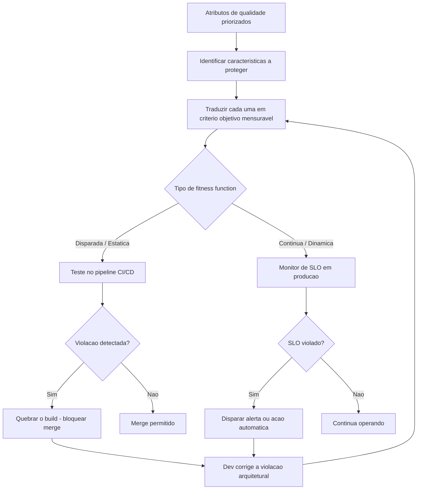

# Fitness Functions

> **Bloco:** Fundamentos arquiteturais · **Nível:** Intermediário/Avançado · **Tempo de leitura:** ~20 min

## TL;DR

Uma **Fitness Function** (função de aptidão arquitetural) é qualquer mecanismo que fornece uma **avaliação objetiva de integridade** de uma ou mais características arquiteturais. Em termos práticos: são "testes para a arquitetura" — verificações automatizadas que rodam continuamente para garantir que atributos de qualidade (latência, acoplamento, segurança, dependências permitidas) não regridam conforme o sistema evolui. O conceito é a peça central da **Arquitetura Evolutiva**, formulado por **Neal Ford, Rebecca Parsons e Patrick Kua** em *Building Evolutionary Architectures* (O'Reilly, 2017). A ideia: não basta desenhar uma boa arquitetura — é preciso *proteger* suas propriedades de forma executável.

## O problema que resolve

Toda arquitetura **degrada com o tempo**. Você desenha um sistema com camadas limpas, baixo acoplamento e latência aceitável; seis meses e quarenta pull requests depois, alguém criou um atalho de dependência entre módulos que não deviam se conhecer, o p99 subiu 40% sem ninguém notar, e o serviço de domínio passou a importar diretamente o driver do banco. Esse fenômeno tem nome: **architectural drift** (deriva arquitetural) ou **erosão arquitetural**.

O problema fundamental é que atributos de qualidade são, por natureza, **propriedades globais e emergentes** — não estão localizados num arquivo. Um teste unitário verifica uma função; nada verifica "este sistema continua tendo baixo acoplamento" ou "nenhum módulo de UI fala direto com o banco". Code review *deveria* pegar isso, mas humanos cansam, esquecem as regras, e a vigilância manual não escala nem é consistente.

Antes das fitness functions, a arquitetura era protegida por:
- **Documentação** — que ninguém lê e que desincroniza do código.
- **Revisões manuais de arquitetura** — caras, esporádicas, subjetivas.
- **Boa vontade e disciplina da equipe** — que não sobrevive à pressão de prazo.

Neal Ford e colegas, na **ThoughtWorks**, perceberam que o mesmo princípio que revolucionou a qualidade funcional — automatizar a verificação e rodá-la continuamente (testes + CI/CD) — podia ser aplicado às **características arquiteturais**. Tomaram o termo emprestado da computação evolutiva (algoritmos genéticos, onde uma *fitness function* mede quão perto uma solução candidata está do objetivo) e o adaptaram para arquitetura.

## O que é (definição aprofundada)

A definição oficial do livro:

> "Uma **fitness function arquitetural** fornece uma avaliação objetiva de integridade de alguma(s) característica(s) arquitetural(is)."

Três palavras carregam o peso:

- **Objetiva** — o resultado não depende de opinião. A função produz um veredito mensurável: passou/falhou, ou um número comparável a um limiar. "O acoplamento aferente do módulo X está dentro do limite" é objetivo; "o código está bem estruturado" não é.
- **Integridade** — verifica se a característica *permanece* dentro dos parâmetros desejados, não se ela existe num instante.
- **Característica arquitetural** — performance, escalabilidade, segurança, modularidade, dependências, conformidade legal, etc. (ver o documento de atributos de qualidade).

Crucialmente, fitness function **não é um tipo único de ferramenta** — é um *conceito guarda-chuva*. Pode ser implementada como: um teste unitário (ArchUnit), uma métrica coletada em produção (latência p99), um log analisado, um *health check*, um linter, uma checagem de chaos engineering, uma regra de segurança no pipeline. O que une todos é a função de **proteger uma característica arquitetural de forma objetiva**.

### Taxonomia das fitness functions

O livro classifica fitness functions em vários eixos, e dominar essa taxonomia é o que distingue o uso casual do uso maduro:

**Atômicas vs. Holísticas**
- **Atômica** — verifica uma única característica isoladamente. Ex.: "nenhuma dependência cíclica entre pacotes".
- **Holística** — verifica a interação de várias características em conjunto, porque elas se influenciam. Ex.: medir simultaneamente segurança e escalabilidade, já que adicionar criptografia (segurança) afeta throughput (escalabilidade). Holísticas são mais difíceis, mas capturam os trade-offs reais.

**Disparada (Triggered) vs. Contínua (Continual)**
- **Disparada** — executa em resposta a um evento, tipicamente um build/deploy no pipeline de CI/CD. Ex.: rodar testes ArchUnit a cada PR.
- **Contínua** — monitora constantemente em produção. Ex.: um agente medindo latência e disparando alerta/ação quando o p99 ultrapassa o SLO.

**Estática vs. Dinâmica**
- **Estática** — resultado fixo binário (passa/falha): há ou não há ciclos de dependência.
- **Dinâmica** — o resultado aceitável depende do contexto. Ex.: latência aceitável pode ser maior sob alta carga; a função ajusta o limiar conforme as condições.

**Automatizada vs. Manual**
- A esmagadora maioria deve ser **automatizada** (no pipeline ou monitoramento). Algumas características genuinamente exigem julgamento humano (ex.: conformidade com uma regulação ambígua), e essas viram fitness functions **manuais** — uma revisão estruturada e agendada. O ideal é minimizar as manuais.

**Temporal**
- Fitness functions ligadas ao tempo. Ex.: uma regra que dispara um alerta quando uma biblioteca de criptografia tem atualização de segurança disponível há mais de 30 dias, forçando a evolução.

### Características que a fitness function protege

No vocabulário do livro, cada característica arquitetural protegida é uma **dimensão evolutiva**. O processo é: identifique as dimensões que importam para o sistema (técnica, dados, segurança, operacional...), defina fitness functions para cada uma, e use práticas de mudança incremental (deployment pipelines) para verificá-las automaticamente a cada mudança.

## Como funciona

O ciclo de adoção, na prática:

1. **Identifique as características arquiteturais a proteger.** Derivam diretamente dos atributos de qualidade priorizados. Não tente proteger tudo — proteja o que é crítico e propenso a erodir.

2. **Traduza cada característica em um critério objetivo e mensurável.** "Manutenibilidade" é vago; "nenhum módulo de domínio importa pacotes de infraestrutura" e "complexidade ciclomática por método ≤ 15" são fitness functions.

3. **Implemente a verificação** com a ferramenta apropriada ao eixo (estática/dinâmica, disparada/contínua):
   - Dependências e estrutura de código → **ArchUnit** (Java/Kotlin), `import-linter` (Python), dependency-cruiser (JS), NetArchTest (.NET).
   - Performance/latência → testes de carga no pipeline + monitoramento de SLO em produção.
   - Segurança → SAST, scanners de dependência (CVE), políticas como código.
   - Acoplamento/coesão → métricas de código (ferramentas como SonarQube, jQAssistant).

4. **Integre ao pipeline de CI/CD** para as disparadas, e ao **observability stack** para as contínuas. O ponto inegociável: a fitness function precisa **quebrar o build** ou **disparar uma ação** quando violada. Uma verificação que só gera um relatório que ninguém lê não é uma fitness function eficaz — é teatro.

5. **Trate fitness functions como cidadãs de primeira classe.** Versione-as com o código, revise-as, evolua-as. Quando um atributo muda de prioridade, ajuste a função correspondente — idealmente via um ADR que documenta a mudança.

A analogia mental correta: assim como testes automatizados deram aos times **coragem para refatorar** o comportamento sem medo de quebrar, fitness functions dão **coragem para evoluir a arquitetura** sem medo de erodi-la. Elas criam um "scaffolding protetor e testável" ao redor das partes críticas.

## Diagrama de fluxo



## Exemplo prático / caso real

Cenário: uma plataforma de **e-commerce estilo Nuvemshop**, organizada em módulos por domínio (`catalogo`, `checkout`, `pagamentos`, `estoque`), evoluiu para um modular monolith caminhando rumo a microsserviços. A arquitetura tem três invariantes que a equipe quer proteger contra erosão:

**1. Isolamento de domínios (fitness function atômica, estática, disparada).**

Regra: o módulo `pagamentos` não pode ser importado diretamente por `catalogo` — toda comunicação entre domínios deve passar por interfaces públicas explícitas, nunca por classes internas. Implementação com **ArchUnit** num teste JUnit que roda a cada PR:

```java
// pseudocódigo / esboço de regra ArchUnit
classes().that().resideInAPackage("..catalogo..")
    .should().onlyDependOnClassesThat()
    .resideOutsideOfPackage("..pagamentos.internal..");
```

Se um desenvolvedor, sob pressão de prazo, criar um atalho importando `pagamentos.internal.GatewayClient` dentro de `catalogo`, o build **quebra** no CI antes do merge. Sem essa fitness function, o atalho passaria no code review num dia corrido, e em seis meses os domínios estariam emaranhados, inviabilizando a futura extração em microsserviços.

**2. Latência do checkout (fitness function contínua, dinâmica).**

Regra: o p99 da API de checkout deve permanecer ≤ 400ms sob carga normal. Implementada como um monitor de SLO sobre os traces de produção. Quando o p99 ultrapassa o limiar por mais de 5 minutos, dispara alerta; quando ultrapassa um limiar crítico, pode acionar autoscaling. É *dinâmica* porque o alvo se ajusta: durante uma campanha programada (Black Friday), o sistema aceita um p99 de até 600ms temporariamente.

**3. Conformidade de segurança (fitness function disparada, de segurança).**

Regra: nenhuma dependência com CVE de severidade alta pode chegar à produção. Um scanner de dependências roda no pipeline; encontrou CVE crítico, **bloqueia o deploy**. Complementada por uma fitness function **temporal**: alerta se uma atualização de segurança da biblioteca de criptografia está disponível há mais de 30 dias, forçando evolução proativa.

A **ThoughtWorks** colocou o **ArchUnit** em seu Technology Radar justamente como instrumento de fitness functions estruturais. A **Netflix** é o exemplo canônico de fitness functions contínuas/dinâmicas levadas ao extremo via **Chaos Engineering** (o *Chaos Monkey* é, em essência, uma fitness function para o atributo *resiliência*: injeta falhas em produção e valida que o sistema sobrevive). A combinação dessas três categorias dá à equipe a confiança de evoluir a arquitetura continuamente sem regredir.

## Quando usar / Quando evitar

| Use fitness functions quando | Evite / pondere quando |
|------------------------------|------------------------|
| O sistema tem vida longa e evoluirá por muitas mãos | Protótipo descartável de curtíssimo prazo |
| Há características arquiteturais críticas propensas a erodir (dependências, latência, segurança) | A característica não é objetivamente mensurável (vira teatro de métrica) |
| A equipe é grande ou tem rotatividade (a regra precisa ser executável, não tribal) | Há overhead de manter funções que ninguém respeita — primeiro construa cultura |
| Você quer evoluir a arquitetura com segurança (refatorar, extrair serviços) | A função demoraria tanto no pipeline que travaria o fluxo (otimize ou mova para noturno) |
| Há um pipeline de CI/CD e observabilidade onde plugar as verificações | Não há pipeline nem ninguém para reagir quando a função quebra |

Princípio guia: a fitness function deve ter **dono e ação**. Uma que ninguém mantém ou que ninguém corrige quando falha é pior que nada — gera ruído e erode a confiança no próprio mecanismo.

## Anti-padrões e armadilhas comuns

- **Métrica que não quebra nada.** Coletar dados de acoplamento num dashboard que ninguém olha não é fitness function — é decoração. A função precisa de consequência: bloquear merge, disparar ação, ou exigir aprovação.
- **Proteger o que não importa, ignorar o que importa.** Vinte fitness functions sobre convenções de nomenclatura e nenhuma sobre a latência crítica do checkout. Derive as funções dos atributos de qualidade *priorizados*.
- **Fitness functions frágeis (flaky).** Testes de arquitetura que falham intermitentemente por timing ou ambiente treinam a equipe a ignorá-los (o "boy who cried wolf"). Mate ou conserte os flaky.
- **Pipeline lento demais.** Empilhar funções pesadas no caminho crítico do PR até o pipeline levar 40 minutos faz a equipe buscar atalhos. Separe rápidas (por PR) de lentas (noturnas).
- **Confundir fitness function com teste de unidade comum.** Um teste que verifica `soma(2,2)==4` não é fitness function; um que verifica "nenhum ciclo de dependência" é. A distinção é o alvo: comportamento *vs.* característica arquitetural.
- **Não evoluir as funções.** A arquitetura muda; uma fitness function que protege uma regra obsoleta vira um obstáculo. Trate-as como código vivo, revisado e versionado.
- **"Big bang" de fitness functions num sistema legado já erodido.** Ligar 50 regras de uma vez num código que já viola todas gera centenas de falhas e paralisa. Adote incrementalmente, congelando o débito existente e bloqueando novas violações.

## Relação com outros conceitos

- **Atributos de qualidade** ↔ fitness functions: relação mãe-filha. Os atributos definem *o que* proteger; as fitness functions *como* protegê-lo de forma executável e contínua. Sem atributos mensuráveis, não há fitness function possível.
- **Arquitetura Evolutiva (Evolutionary Architecture)**: o conceito-pai. Fitness functions são o mecanismo que torna a evolução *guiada* em vez de *à deriva*.
- **CI/CD e Deployment Pipelines**: o substrato de execução das funções disparadas; o livro chama as práticas de mudança incremental de pré-requisito.
- **ADRs**: uma decisão registrada num ADR ("módulos de domínio não dependem de infraestrutura") pode ser *aplicada* por uma fitness function, transformando registro passivo em guardrail ativo.
- **Chaos Engineering**: fitness functions contínuas para o atributo resiliência (Netflix Chaos Monkey).
- **Observabilidade**: fornece os dados (métricas, traces) que alimentam as fitness functions contínuas/dinâmicas em produção.
- **Conway's Law**: fitness functions de dependência ajudam a manter os limites de serviço alinhados aos limites de equipe pretendidos.

## Referências

- [nealford.com • Building Evolutionary Architectures (Neal Ford)](https://nealford.com/books/buildingevolutionaryarchitectures.html) — página oficial do livro que cunhou o conceito.
- [Fitness Functions for Your Architecture (InfoQ)](https://www.infoq.com/articles/fitness-functions-architecture/) — artigo de referência sobre a taxonomia e o uso prático.
- [Building Evolutionary Architectures (Goodreads)](https://www.goodreads.com/book/show/35755822-building-evolutionary-architectures) — ficha do livro de Ford, Parsons e Kua.
- [ArchUnit — Unit test your Java architecture](https://www.archunit.org/) — a ferramenta de referência para fitness functions estruturais em Java/Kotlin.
- [TNG/ArchUnit (GitHub)](https://github.com/TNG/ArchUnit) — repositório e documentação da biblioteca.
- [ArchUnit (Thoughtworks Technology Radar)](https://www.thoughtworks.com/radar/tools/archunit) — avaliação da ferramenta no Radar.
- [Introduction to ArchUnit (Baeldung)](https://www.baeldung.com/java-archunit-intro) — tutorial prático de implementação de fitness functions estruturais.
- [Evolutionary Architecture and Fitness Functions (NFJS Blog)](http://blog.nofluffjuststuff.com/2018/01/24/evolutionary-architecture/) — visão geral do conceito pelos autores.
