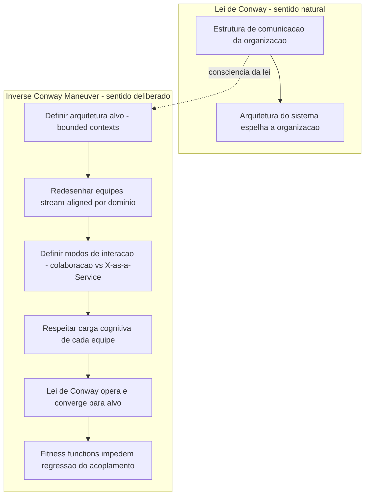

# Conway's Law e Inverse Conway Maneuver

> **Bloco:** Fundamentos arquiteturais · **Nível:** Intermediário/Avançado · **Tempo de leitura:** ~20 min

## TL;DR

A **Lei de Conway** (Melvin Conway, 1968) afirma que qualquer organização que projeta um sistema produzirá um design cuja estrutura é uma **cópia da estrutura de comunicação** da própria organização. Ou seja: a arquitetura do software espelha o organograma. O **Inverse Conway Maneuver** (cunhado por Jonny LeRoy e Matt Simons, 2010) inverte a lógica: em vez de sofrer com esse espelhamento, você **molda deliberadamente as equipes e seus canais de comunicação** para induzir a arquitetura desejada. É a base intelectual do movimento de microsserviços e do livro *Team Topologies*.

## O problema que resolve

Times de arquitetura repetidamente desenham diagramas elegantes — serviços bem isolados, limites limpos, baixo acoplamento — e meses depois encontram um sistema que não se parece em nada com o desenho: módulos emaranhados, dependências atravessando todos os limites, um "monolito distribuído". Por que o software teima em divergir do design pretendido?

Em 1968, **Melvin Conway** publicou o artigo *How Do Committees Invent?* e propôs a explicação que viria a levar seu nome. A formulação original:

> "Organizations which design systems are constrained to produce designs which are copies of the communication structures of these organizations."

A intuição é mecânica: para dois módulos de software se integrarem, as pessoas que os constroem precisam se comunicar e negociar a interface. Se duas equipes raramente falam (estão em departamentos diferentes, fusos diferentes, prédios diferentes), a interface entre seus componentes tende a ser pobre, rígida ou contornada por gambiarras. Inversamente, dentro de uma mesma equipe, a comunicação é alta, então o código que ela produz tende a ser internamente coeso e fortemente acoplado. **A topologia de comunicação humana vaza para a topologia do software** — inevitavelmente, porque a interface de software *é* um artefato de negociação humana.

O problema, então, é duplo: (1) ignorar a Lei de Conway leva a arquiteturas que lutam contra a organização e perdem; (2) reconhecê-la abre uma alavanca poderosíssima — se a estrutura organizacional *determina* a arquitetura, então estruturar as equipes corretamente é um *ato de design arquitetural*.

## O que é (definição aprofundada)

### Lei de Conway

A **Lei de Conway** não é uma lei física, mas uma observação empírica robusta, confirmada por pesquisa posterior (notavelmente o estudo de Microsoft Research e da Harvard Business School sobre "socio-technical congruence", que encontrou correlação forte entre estrutura organizacional e qualidade/modularidade do código). O ponto a interiorizar:

- A unidade relevante **não é o organograma formal**, mas a **estrutura real de comunicação** — quem efetivamente fala com quem, com que frequência e largura de banda. Duas equipes no mesmo "box" do organograma mas que nunca conversam vão produzir componentes desconectados; duas equipes formalmente separadas mas que pareiam diariamente produzirão componentes fortemente acoplados.
- A lei opera nos dois sentidos como **restrição**: a organização *constrange* o espaço de designs possíveis. Você não consegue produzir um design que sua estrutura de comunicação não suporta.
- A lei é **homomórfica**: há um mapeamento estrutura-a-estrutura entre organização e sistema. Equipes ↔ componentes; canais de comunicação ↔ interfaces.

Uma consequência prática frequentemente citada: se você tem **quatro equipes** trabalhando num compilador, vai acabar com um **compilador de quatro passes** — não porque seja o melhor design, mas porque é o design que a estrutura de comunicação favorece.

### Inverse Conway Maneuver

Se a organização molda a arquitetura, então — em vez de aceitar passivamente o espelhamento — pode-se **inverter a seta causal de propósito**. O **Inverse Conway Maneuver** (também grafado *manoeuvre*) consiste em **redesenhar as equipes e seus modos de interação para que a Lei de Conway, operando normalmente, produza a arquitetura que você quer**.

O termo foi cunhado por **Jonny LeRoy e Matt Simons** num artigo de dezembro de 2010 no *Cutter IT Journal*, e tornou-se central no discurso de microsserviços. A lógica: quer serviços autônomos, independentemente deployáveis e fracamente acoplados? Então organize **equipes autônomas, pequenas, de vida longa, centradas em capacidade de negócio (business-capability-centric)**, cada uma com todas as habilidades para entregar valor ponta a ponta. A Lei de Conway fará o resto — equipes autônomas tendem a produzir serviços autônomos.

A **ThoughtWorks** mantém o Inverse Conway Maneuver em seu Technology Radar há anos, e o **livro Team Topologies** (Matthew Skelton e Manuel Pais, 2019) é essencialmente um manual operacional para aplicá-lo de forma sistemática.

### A ponte com Team Topologies

*Team Topologies* operacionaliza a manobra propondo quatro tipos fundamentais de equipe e três modos de interação:

- **Stream-aligned team** — alinhada a um fluxo de valor de negócio (ex.: "time de checkout"). É o tipo dominante; as outras existem para servi-la.
- **Platform team** — fornece serviços internos (infra, observabilidade) como produto, reduzindo a carga cognitiva das stream-aligned.
- **Enabling team** — ajuda outras equipes a adquirir capacidades que lhes faltam (ex.: especialistas em segurança que capacitam, sem assumir o trabalho).
- **Complicated-subsystem team** — cuida de uma parte que exige conhecimento especializado profundo (ex.: motor de cálculo de frete, antifraude).

E os modos de interação: **Collaboration** (alta comunicação, para descoberta), **X-as-a-Service** (consumo com mínima comunicação, para previsibilidade) e **Facilitating** (uma equipe ajudando outra). O insight de Conway aqui: ao definir **conscientemente** quem colabora intensamente com quem e quem só consome serviços, você está desenhando os limites de acoplamento do software.

Um conceito-chave correlato é a **carga cognitiva (cognitive load)**: o limite da manobra é que uma equipe só consegue manter coeso um software cujo escopo cabe na sua capacidade cognitiva. Limites de serviço devem respeitar esse teto.

## Como funciona

A manobra inversa, passo a passo:

1. **Defina a arquitetura-alvo.** Quais são os limites de serviço/módulo desejados? Tipicamente derivados de **bounded contexts** do DDD — domínios de negócio coesos.

2. **Mapeie a organização atual.** Como as equipes estão divididas hoje? Quem fala com quem? Onde estão os gargalos de comunicação? Frequentemente se descobre que a estrutura atual já está, via Conway, produzindo a arquitetura indesejada.

3. **Redesenhe as equipes para espelhar a arquitetura-alvo.** Crie equipes stream-aligned, cada uma dona de um bounded context, idealmente alinhada uma-a-uma com um serviço. Dote-as de autonomia e de todas as habilidades necessárias.

4. **Projete os modos de interação.** Defina explicitamente onde haverá colaboração intensa (que vai gerar acoplamento) e onde haverá consumo X-as-a-Service (que vai gerar interfaces limpas e desacopladas). Extraia capacidades transversais para platform teams.

5. **Respeite a carga cognitiva.** Se um bounded context é grande demais para uma equipe, ou é complexo demais (vira complicated-subsystem team), o limite precisa ser repensado.

6. **Deixe a Lei de Conway operar.** Com as equipes e canais estruturados, o software tende, ao longo dos meses, a convergir para a arquitetura-alvo — naturalmente, porque é o caminho de menor resistência da comunicação.

7. **Use fitness functions para evitar regressão.** Regras automatizadas de dependência (ArchUnit etc.) impedem que atalhos entre serviços recriem o acoplamento que a manobra tentou eliminar.

### A advertência crítica

Martin Fowler e a ThoughtWorks são explícitos: **a manobra não é mágica e não é instantânea**. Se você já tem um sistema legado com arquitetura rígida e reorganiza as equipes esperando que o código se reorganize sozinho, o resultado provável no curto prazo é um **descasamento (mismatch)** entre desenvolvedores e código que *adiciona fricção*. As equipes novas herdam código que não respeita seus limites e passam a pisar no terreno umas das outras. A reorganização precisa vir **acompanhada** de trabalho de refatoração e migração arquitetural; ela cria o *incentivo* e o *espaço* para a arquitetura certa, mas não a constrói por decreto.

## Diagrama de fluxo

## Exemplo prático / caso real

Cenário: um **marketplace estilo iFood** começou como um monolito construído por uma única equipe de engenharia de 25 pessoas. Pela Lei de Conway, o resultado é exatamente o esperado: **um grande monolito fortemente acoplado**, onde a lógica de restaurante, entregador, pagamento e busca vivem entrelaçadas, porque toda a comunicação acontece dentro de uma equipe sem fronteiras internas. Deploys são arriscados, qualquer mudança exige coordenação de todos, e o time de pagamentos não consegue evoluir sem medo de quebrar a busca.

A liderança decide migrar para microsserviços. O erro ingênuo seria: contratar uma consultoria para desenhar 30 microsserviços perfeitos e tentar implementá-los com a *mesma* equipe monolítica de 25 pessoas. A Lei de Conway sabota isso — a estrutura de comunicação única vai recriar acoplamento entre os "serviços", produzindo um **monolito distribuído** (o pior dos dois mundos: a complexidade operacional de microsserviços sem o desacoplamento).

A abordagem correta é o **Inverse Conway Maneuver**:

1. Identificam-se os **bounded contexts**: `Restaurantes`, `Pedidos`, `Pagamentos`, `Logística/Entregadores`, `Busca/Recomendação`.

2. Reorganizam-se as 25 pessoas em **cinco equipes stream-aligned**, uma por contexto, cada uma com backend, frontend e ownership ponta a ponta de seus serviços. A equipe de Pagamentos passa a ser dona do serviço de pagamentos — e só dele.

3. Cria-se uma **platform team** que fornece, como serviço interno, a infraestrutura comum: deploy, observabilidade, mensageria, gateways. Isso reduz a carga cognitiva das equipes de produto, que não precisam reinventar infra.

4. A antifraude, por exigir matemática e modelos especializados, vira uma **complicated-subsystem team**, consumida via X-as-a-Service pelos Pedidos e Pagamentos.

5. Definem-se os modos de interação: Pedidos e Pagamentos colaboram intensamente durante a fase de descoberta da integração (gerando, propositalmente, uma interface bem desenhada), depois passam a consumir um do outro via API estável (X-as-a-Service), travando o desacoplamento.

Ao longo de 12 a 18 meses — com refatoração ativa, não só reorg — o sistema **converge** para a arquitetura de microsserviços alinhada aos contextos, porque agora a comunicação humana favorece esses limites. Fitness functions de dependência garantem que ninguém crie atalhos.

Casos reais que seguiram esse padrão: a **Amazon** com suas "two-pizza teams" (equipes pequenas o suficiente para serem alimentadas por duas pizzas), cada uma dona de um serviço — a estrutura organizacional foi deliberadamente projetada para produzir a arquitetura orientada a serviços. **Spotify** com seu modelo de squads/tribes alinhados a features. **Netflix** com equipes autônomas donas de seus microsserviços ponta a ponta. Em todos, a estrutura organizacional foi tratada como *decisão arquitetural*.

## Quando usar / Quando evitar

| Use o Inverse Conway Maneuver quando | Evite / cuidado quando |
|--------------------------------------|------------------------|
| Você está iniciando um sistema ou uma migração arquitetural grande | Espera resultado instantâneo de uma reorg sem investir em refatoração |
| A arquitetura atual luta contra a organização (sintoma: monolito distribuído, integração difícil) | A organização é pequena (1 equipe) e a arquitetura cabe na carga cognitiva dela — não force microsserviços |
| Você quer microsserviços de verdade (autônomos), não só "serviços" acoplados | Reorganizar é politicamente caro demais e a dor atual não justifica |
| Os bounded contexts de negócio são razoavelmente claros (DDD ajuda) | Os domínios ainda são incertos — reorganizar com base em limites errados cristaliza limites errados |
| A liderança trata estrutura de time como decisão de engenharia, não só de RH | A cultura trata reorganizações como exercícios de organograma desconectados da arquitetura |

## Anti-padrões e armadilhas comuns

- **Reorganizar e esperar mágica.** Mudar o organograma sem trabalho ativo de refatoração gera o *mismatch* que Fowler alerta — desenvolvedores donos de código que não respeita seus novos limites, adicionando fricção em vez de removê-la.
- **Ignorar a Lei de Conway ao desenhar arquitetura.** Projetar microsserviços lindos para uma equipe monolítica única produz monolito distribuído. A arquitetura precisa ser *suportada* pela estrutura de comunicação.
- **Limites de serviço que não respeitam carga cognitiva.** Uma equipe responsável por mais software do que cabe em sua capacidade cognitiva produz código de baixa qualidade nas bordas, recriando acoplamento.
- **Confundir organograma formal com estrutura real de comunicação.** O que importa é quem *realmente* fala com quem. Equipes formalmente separadas que pareiam diariamente produzirão acoplamento; a manobra precisa endereçar a comunicação real.
- **Microsserviços por moda, não por necessidade organizacional.** Aplicar a manobra para impor microsserviços onde um modular monolith atenderia melhor adiciona complexidade distribuída sem benefício.
- **Limites de equipe instáveis.** Reorganizações frequentes impedem que a arquitetura convirja para qualquer coisa — a Lei de Conway precisa de equipes *de vida longa* para operar.
- **Esquecer as platform e enabling teams.** Sem elas, cada equipe stream-aligned reinventa infraestrutura, a carga cognitiva explode, e a autonomia vira sobrecarga.

## Relação com outros conceitos

- **Bounded Contexts (DDD)**: a fonte preferencial dos limites de serviço que a manobra inversa tenta induzir; equipe ↔ bounded context ↔ serviço é o alinhamento ideal.
- **Microsserviços**: a arquitetura que a Inverse Conway Maneuver mais frequentemente busca produzir; a manobra é considerada pré-requisito organizacional para microsserviços de sucesso.
- **Team Topologies (Skelton & Pais)**: o manual operacional da manobra — tipos de equipe, modos de interação e carga cognitiva.
- **Atributos de qualidade**: a estrutura organizacional limita quais atributos (especialmente manutenibilidade e deployability independente) o sistema consegue atingir.
- **Fitness Functions**: usadas para impedir que a arquitetura, depois de alinhada às equipes, regrida e recrie acoplamento entre serviços.
- **Monolito Distribuído**: o anti-padrão clássico que surge quando a Lei de Conway é ignorada numa migração para microsserviços.

## Referências

- [bliki: Conway's Law (Martin Fowler)](https://martinfowler.com/bliki/ConwaysLaw.html) — explicação de Fowler sobre a lei e suas implicações, incluindo a advertência sobre a manobra inversa.
- [Inverse Conway Maneuver (Thoughtworks Technology Radar)](https://www.thoughtworks.com/radar/techniques/inverse-conway-maneuver) — verbete oficial da técnica no Radar.
- [Inverse-Conway-Maneuver: How to speed up product development teams (Thoughtworks)](https://www.thoughtworks.com/insights/blog/customer-experience/inverse-conway-maneuver-product-development-teams) — aplicação prática da manobra.
- [Reckoning with the force of Conway's Law (Thoughtworks Podcast, com Fowler e Lewis)](https://www.thoughtworks.com/en-us/insights/podcasts/technology-podcasts/reckoning-with-the-force-conways-law) — discussão aprofundada sobre como (e como não) aplicar a lei.
- [Microservice Premium (Martin Fowler)](https://martinfowler.com/bliki/MicroservicePremium.html) — sobre quando o custo organizacional dos microsserviços compensa.
- [Microservices and the inverse Conway manoeuvre (GOTO Copenhagen 2015)](https://gotocon.com/cph-2015/presentation/Microservices%20and%20the%20inverse%20Conway%20manoeuvre) — palestra sobre a relação entre a manobra e microsserviços.
- *Team Topologies* (Matthew Skelton, Manuel Pais — IT Revolution, 2019) — o livro de referência sobre estruturação de equipes para arquitetura. [Resenha em jacobian.org](https://jacobian.org/2021/jul/5/book-review-team-topologies/)
