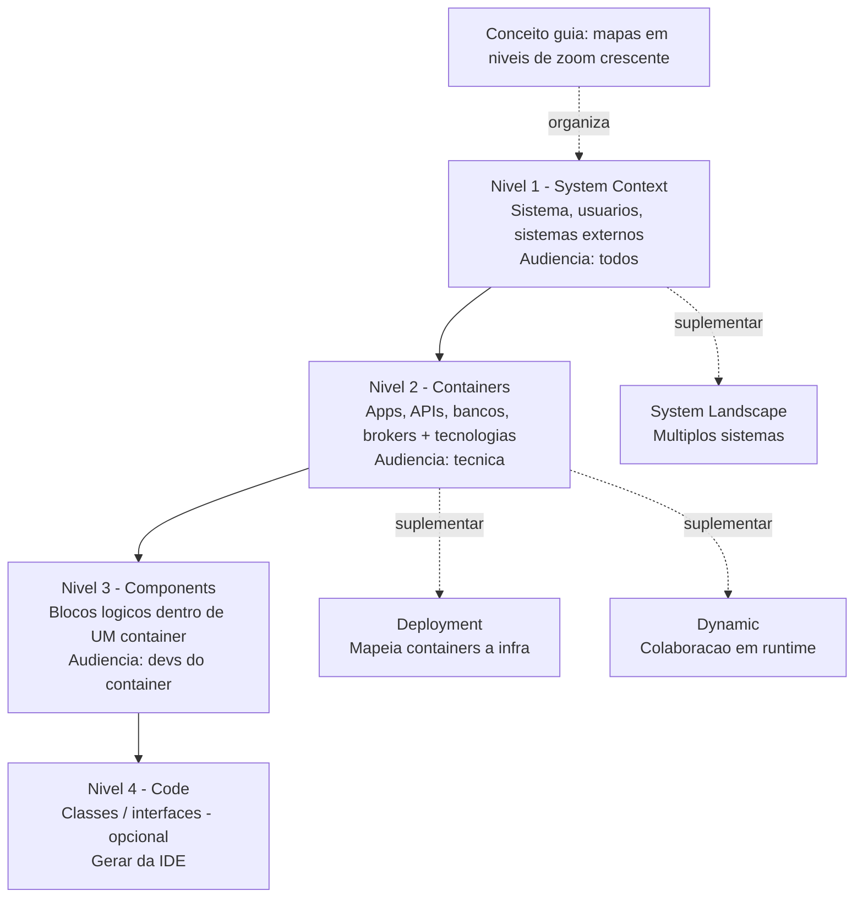

# C4 Model (Context, Container, Component, Code)

> **Bloco:** Fundamentos arquiteturais · **Nível:** Intermediário/Avançado · **Tempo de leitura:** ~20 min

## TL;DR

O **C4 Model** é uma técnica leve para visualizar a arquitetura de software através de **quatro níveis de abstração hierárquicos** — **Context** (sistema no seu ambiente), **Container** (aplicações e armazenamentos executáveis), **Component** (blocos lógicos dentro de um container) e **Code** (classes/interfaces, opcional) — como um conjunto de "mapas" em zoom crescente. Criado por **Simon Brown** (consolidado entre 2006 e 2011), o C4 resolve a bagunça dos diagramas "caixinhas e setas" sem semântica, oferecendo uma notação independente de ferramenta e de notação gráfica, com o conceito-guia de "mapas em diferentes níveis de zoom".

## O problema que resolve

Diagramas de arquitetura na maioria das empresas são um desastre de comunicação. Você abre o "diagrama da arquitetura" e encontra um amontoado de retângulos, nuvens e setas onde ninguém sabe o que é cada caixa (uma aplicação? um servidor? uma classe? um conceito abstrato?), o que uma seta significa (chamada HTTP? dependência? fluxo de dados? "fala com"?), nem em que nível de abstração o diagrama está. Some-se a isso o UML — poderoso mas pesado, com 14 tipos de diagrama que poucos dominam e quase ninguém quer ler — e o resultado é que arquitetura raramente é comunicada de forma eficaz.

**Simon Brown** diagnosticou que o problema central é a **falta de uma abstração compartilhada e de níveis claros**. Equipes misturam num mesmo diagrama coisas de granularidades incompatíveis e usam vocabulário ambíguo. Ele propôs, entre 2006 e 2011, partindo das raízes do **UML** e do modelo de visões **"4+1"** de Kruchten, uma abordagem deliberadamente minimalista. A analogia que organiza tudo: pense em **mapas geográficos com diferentes níveis de zoom** — você começa vendo o mundo, dá zoom num país, depois numa cidade, depois numa rua. Cada nível tem detalhe apropriado e some o que não importa naquela escala. Software deveria ser visualizado da mesma forma.

O C4 ganhou tração após a publicação do site oficial sob licença Creative Commons e de artigos em 2018, tornando-se hoje uma das técnicas de documentação de arquitetura mais adotadas, justamente por ser **simples, hierárquica e independente de ferramenta**.

## O que é (definição aprofundada)

C4 é um acrônimo dos quatro níveis de diagrama, do mais abstrato ao mais detalhado. Antes dos níveis, é preciso entender o **vocabulário compartilhado** que o modelo impõe — cinco elementos básicos para os níveis 1 a 3:

- **Person** — um usuário humano do sistema (cliente, admin, operador).
- **Software System** — a unidade de maior abstração; algo que entrega valor. Pode ser o sistema que você está construindo ou um sistema externo do qual você depende.
- **Container** — *não* é Docker. No C4, um **container** é uma unidade **executável ou de armazenamento** separadamente deployável e que roda processos ou guarda dados: uma aplicação web, uma API, um app mobile, um banco de dados, um message broker, um serverless function. É algo que precisa estar rodando para o sistema funcionar.
- **Component** — um agrupamento lógico de funcionalidades relacionadas dentro de um container, com uma interface bem definida (ex.: um "controller de pagamentos", um "repositório de pedidos"). Não é deployável sozinho; vive dentro de um container.
- **Relationship** — uma seta com **descrição em linguagem natural** e, idealmente, a tecnologia/protocolo: "Envia pedidos para [JSON/HTTPS]". A seta tem semântica explícita, ao contrário das setas ambíguas dos diagramas tradicionais.

### Os quatro níveis (o "zoom")

**Nível 1 — System Context Diagram.** O mapa do mundo. Mostra **o seu sistema como uma única caixa** no centro, cercado pelos **usuários (persons)** e pelos **sistemas externos** com que interage. Não mostra nada interno. Audiência: **todos** — incluindo gente não-técnica (negócio, gestores). Responde: "o que é esse sistema, quem usa e com o que ele conversa?"

**Nível 2 — Container Diagram.** Zoom na caixa do sistema. Mostra os **containers** que compõem o sistema (web app, API, banco, broker, app mobile), suas responsabilidades, as principais tecnologias de cada um e como se comunicam entre si e com os sistemas externos. Audiência: **técnica** (arquitetos, devs, ops). É o nível mais útil no dia a dia — mostra a topologia de alto nível e as decisões tecnológicas. Responde: "quais são as peças móveis executáveis e como elas se falam?"

**Nível 3 — Component Diagram.** Zoom em **um** container específico. Mostra os **componentes** internos daquele container, suas responsabilidades e relações. Audiência: **desenvolvedores e arquitetos** daquele container. Responde: "como esse container está estruturado por dentro?"

**Nível 4 — Code Diagram.** Zoom em **um** componente, mostrando classes/interfaces (essencialmente um diagrama de classes UML). **Opcional e raramente recomendado** — Brown explicitamente desencoraja desenhá-lo à mão, porque desincroniza do código instantaneamente; se necessário, gere-o automaticamente da IDE. A maioria das equipes para no nível 2 ou 3.

### Diagramas suplementares

Além dos quatro níveis, o C4 define diagramas de apoio:

- **System Landscape** — visão macro de *múltiplos* sistemas numa organização (acima do nível 1).
- **Dynamic Diagram** — mostra a colaboração em **tempo de execução** para um cenário específico (similar a um diagrama de sequência simplificado), com setas numeradas indicando ordem.
- **Deployment Diagram** — mapeia containers para a **infraestrutura** real (nós, ambientes, instâncias) — onde cada coisa roda.

### Princípios de notação

Pontos que definem a filosofia do C4:

- **Notação-independente e ferramenta-independente.** O C4 *não prescreve* cores, formas ou estilos. Você pode desenhar no quadro branco, no PowerPoint, ou gerar com ferramentas. O que importa é a estrutura de abstração, não a estética.
- **Cada elemento deve ter título, tipo, tecnologia e descrição.** Nada de caixas anônimas.
- **Toda seta tem descrição.** Relacionamentos são explícitos.
- **Inclua sempre uma legenda.** Como o modelo não impõe notação, a legenda torna cada diagrama autoexplicativo.
- **"Diagrams as code".** Ferramentas como **Structurizr** (do próprio Brown), **PlantUML (C4-PlantUML)**, **Mermaid (C4 syntax)** e **Likec4** permitem definir o modelo em texto/código e gerar todos os níveis a partir de uma única fonte de verdade — combatendo a desincronização.

## Como funciona

O fluxo de criação típico, de cima para baixo:

1. **Comece pelo Context (nível 1).** Identifique o sistema, seus usuários e os sistemas externos. Mantenha-o limpo o suficiente para mostrar a um diretor.

2. **Detalhe os Containers (nível 2).** Decomponha o sistema nas suas unidades executáveis e de armazenamento. Anote tecnologias. Este é o diagrama que você mais vai manter e mostrar.

3. **Faça Component diagrams (nível 3) seletivamente.** Apenas para os containers que valem o esforço (os mais complexos ou críticos). Não documente todos os containers no nível 3 — seria custo sem retorno.

4. **Pule o nível 4 quase sempre.** Gere automaticamente da IDE se realmente precisar.

5. **Adicione suplementares conforme a necessidade.** Deployment diagram para conversar com ops; dynamic diagram para explicar um fluxo crítico (ex.: o caminho de um pagamento).

6. **Mantenha como código.** Idealmente, modele em Structurizr DSL ou C4-PlantUML, versionado junto ao repositório, para que os diagramas evoluam com o sistema e não apodreçam.

O ganho operacional: como é **hierárquico**, cada diagrama tem uma audiência e um propósito claros, e você pode dar "zoom" de uma conversa de negócio (nível 1) até uma conversa de implementação (nível 3) usando o **mesmo vocabulário** e mantendo a consistência entre níveis.

## Diagrama de fluxo

## Exemplo prático / caso real

Cenário: documentar a arquitetura de uma **loja online estilo Nuvemshop** para diferentes audiências.

**Nível 1 — System Context.** Uma caixa central, "Plataforma de E-commerce". Ao redor: o **Cliente** (person, compra produtos), o **Lojista** (person, gerencia a loja), e os sistemas externos — **Gateway de Pagamento** (processa cartões/Pix), **Transportadora** (calcula frete e rastreia), **Serviço de E-mail** (envia confirmações). Setas: "Cliente faz pedidos na [Plataforma]", "Plataforma cobra via [Gateway de Pagamento, HTTPS]". É isso. Esse diagrama vai numa apresentação para a diretoria e qualquer pessoa entende.

**Nível 2 — Container.** Zoom dentro da "Plataforma de E-commerce". Agora aparecem:
- **Loja Web** (SPA React) — usada pelo Cliente.
- **App Admin** (aplicação web) — usado pelo Lojista.
- **API de Catálogo** (Node.js) — serve produtos.
- **API de Checkout** (Java/Spring) — orquestra pedidos e pagamentos.
- **Banco de Pedidos** (PostgreSQL) — persiste pedidos.
- **Cache** (Redis) — cache de catálogo.
- **Message Broker** (RabbitMQ) — eventos assíncronos.

As setas mostram protocolos: "Loja Web chama [API de Catálogo, JSON/HTTPS]", "API de Checkout publica eventos no [Broker, AMQP]", "API de Checkout cobra via [Gateway de Pagamento, HTTPS]". Esse diagrama é o pão com manteiga das conversas de engenharia: novos devs entendem a topologia em minutos.

**Nível 3 — Component (apenas para a API de Checkout, o container mais crítico).** Zoom dentro da API de Checkout, revelando: **CheckoutController** (recebe requisições), **OrderService** (orquestra), **PaymentGatewayAdapter** (fala com o gateway externo), **InventoryClient** (reserva estoque), **OrderRepository** (persiste). Não se faz nível 3 para o Redis ou para a Loja Web — só onde o detalhe paga o custo.

**Suplementar — Dynamic Diagram** para o fluxo "processar pagamento": setas numeradas mostrando Cliente → API Checkout → reserva estoque → cobra gateway → publica evento `PaymentApproved` no broker. Esse diagrama explica em uma página o que um texto levaria três para descrever.

**Suplementar — Deployment Diagram** para conversar com ops: a API de Checkout roda em 3 instâncias atrás de um load balancer na AWS us-east-1, o PostgreSQL é um RDS multi-AZ, o Redis é um ElastiCache.

O C4 é adotado amplamente na indústria — é a técnica padrão de visualização de arquitetura recomendada por consultorias e usada internamente em muitas empresas de tecnologia, justamente porque qualquer engenheiro a aprende em uma hora e ela escala da apresentação executiva ao detalhe de implementação.

## Quando usar / Quando evitar

| Use C4 quando | Evite / pondere quando |
|---------------|------------------------|
| Precisa comunicar arquitetura para audiências mistas (negócio + técnica) | O sistema é trivial — um único container, sem integrações; um diagrama basta |
| Onboarding de novos engenheiros (o "mapa" acelera muito) | Você precisa de toda a expressividade do UML para um caso muito específico (modelagem formal detalhada) |
| Documentar um sistema distribuído com vários serviços e integrações | A equipe não vai manter os diagramas — diagrama desatualizado mente, é pior que nenhum |
| Quer diagramas hierárquicos e consistentes entre níveis | Você quer um padrão de notação rígido e prescritivo (C4 é deliberadamente flexível, o que alguns acham insuficiente) |
| Quer "diagrams as code" versionado e gerável de fonte única | — |

## Anti-padrões e armadilhas comuns

- **Misturar níveis de abstração.** Colocar uma classe (nível 4) ao lado de um sistema externo (nível 1) no mesmo diagrama. O valor do C4 está justamente em manter cada nível coerente.
- **Confundir "container" com Docker container.** No C4, container = unidade executável/de armazenamento deployável. Um banco PostgreSQL é um container C4 mesmo que não esteja em Docker; cinco contêineres Docker de réplicas da mesma app são *um* container C4.
- **Diagramas sem legenda.** Como o C4 não impõe notação, omitir a legenda torna o diagrama ambíguo — exatamente o problema que ele veio resolver.
- **Setas sem descrição.** "Caixa A → Caixa B" sem dizer o quê/como recria a ambiguidade dos diagramas tradicionais. Toda relação precisa de texto e, idealmente, tecnologia.
- **Desenhar o nível 4 à mão.** Desincroniza do código no primeiro commit. Gere da IDE ou pule.
- **Documentar todos os containers no nível 3.** Custo enorme, retorno baixo. Faça nível 3 só para containers complexos/críticos.
- **Diagramas que apodrecem.** O maior risco de qualquer documentação de arquitetura. Mitigação: "diagrams as code" (Structurizr, C4-PlantUML) versionado com o sistema.
- **Tratar C4 como UML pesado.** A intenção é ser leve. Encher de estereótipos e formalismo derrota o propósito.

## Relação com outros conceitos

- **ADRs**: complementares — o C4 mostra *como* o sistema está estruturado (o resultado); os ADRs explicam *por que* (o raciocínio). Juntos formam documentação de arquitetura completa. Um diagrama de container frequentemente referencia os ADRs que justificam suas escolhas tecnológicas.
- **Atributos de qualidade**: o diagrama de containers e o de deployment comunicam *como* a estrutura materializa táticas para atributos (réplicas para disponibilidade, cache para latência, broker para resiliência).
- **UML e o modelo "4+1" de Kruchten**: as raízes intelectuais do C4; ele é uma simplificação pragmática dessas tradições.
- **Bounded Contexts (DDD)**: containers e sistemas no C4 frequentemente correspondem a bounded contexts; o C4 é uma boa ferramenta para visualizar limites de DDD.
- **Conway's Law**: o diagrama de containers frequentemente espelha a estrutura das equipes — útil para verificar visualmente o alinhamento (ou desalinhamento) entre organização e arquitetura.
- **arc42**: framework de documentação que pode usar diagramas C4 em suas seções de visão de blocos de construção e runtime.
- **Microsserviços**: o C4 é especialmente útil para visualizar arquiteturas distribuídas, onde a quantidade de peças móveis torna o "mapa em zoom" indispensável.

## Referências

- [Home | C4 model (c4model.com — Simon Brown)](https://c4model.com/) — site oficial, a fonte canônica do modelo.
- [FAQ | C4 model](https://c4model.com/faq) — esclarece pontos comuns de confusão (ex.: o que é um "container").
- [The C4 model for visualising software architecture (Simon Brown, PDF)](https://static.simonbrown.je/pth2024-c4.pdf) — material de apresentação do autor.
- [C4 model for visualising software architecture (Leanpub — livro de Simon Brown)](https://leanpub.com/visualising-software-architecture) — livro gratuito/pague-quanto-quiser do criador.
- [The C4 Model (O'Reilly)](https://www.oreilly.com/library/view/the-c4-model/9798341660113/) — edição em livro do modelo.
- [C4 model (Wikipedia)](https://en.wikipedia.org/wiki/C4_model) — histórico (criação 2006–2011, raízes em UML e 4+1) e visão geral.
- [Simon Brown's C4 model — Intro (Samman Coaching)](https://sammancoaching.org/learning_hours/architecture/simon_brown_4c_context.html) — introdução didática.
