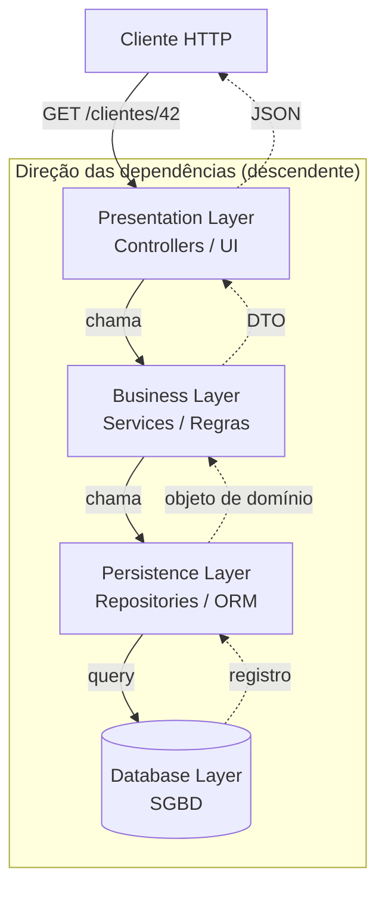

# Layered / N-Tier Architecture

> **Bloco:** Estilos e padrões arquiteturais · **Nível:** Intermediário/Avançado · **Tempo de leitura:** ~22 min

## TL;DR

A arquitetura em camadas (Layered, também chamada de N-Tier) organiza o sistema em camadas horizontais de responsabilidade técnica — tipicamente apresentação, negócio, persistência e banco de dados — onde cada camada só conversa com a camada imediatamente abaixo. É o estilo *de facto* da indústria por ser simples, barato e familiar, mas degenera com facilidade em monólitos acoplados, no anti-padrão *architecture sinkhole* e em domínios anêmicos. Entender suas armadilhas é pré-requisito para apreciar Hexagonal, Clean e Onion, que nascem justamente como reação aos seus problemas.

## O problema que resolve

Antes da formalização das camadas, o software de informação tendia ao *big ball of mud*: lógica de UI, regras de negócio e SQL misturados no mesmo arquivo, frequentemente no mesmo método. Qualquer mudança em uma parte arriscava quebrar todas as outras, testar era inviável e a base de código se tornava ilegível em poucos meses.

A separação em camadas é uma das ideias mais antigas e disseminadas da engenharia de software. Martin Fowler, em *Patterns of Enterprise Application Architecture* (2002), já consolidava a tríade **presentation / domain / data source** como padrão de organização. A motivação central é a **separação de responsabilidades** (*separation of concerns*): isolar a lógica de UI da lógica de negócio e da lógica de acesso a dados, de modo que cada preocupação possa evoluir, ser entendida e ser testada com relativa independência.

O termo **N-Tier** (N-camadas) costuma se referir à dimensão de *deployment* físico (tiers separados em máquinas/processos distintos — cliente, servidor de aplicação, servidor de banco), enquanto **Layered** se refere à organização lógica do código (layers dentro do mesmo deployable). A confusão entre os dois termos é comum e tem consequências: trocar uma camada lógica por outra é refatoração; trocar um tier físico envolve rede, latência e protocolos. Manter essa distinção clara é parte do trabalho do arquiteto.

## O que é (definição aprofundada)

A arquitetura em camadas particiona o sistema em **camadas horizontais**, cada uma com um papel técnico bem definido. A configuração canônica de quatro camadas:

- **Presentation Layer (Apresentação):** lida com a interface com o usuário e a comunicação com o browser/cliente. Recebe requisições, traduz para o formato interno, devolve respostas (HTML, JSON, etc.). Não contém regra de negócio.
- **Business Layer (Negócio / Domínio):** executa as regras de negócio associadas à requisição. É onde, em tese, deveria viver o coração da aplicação.
- **Persistence Layer (Persistência):** abstrai o acesso aos dados, mapeia objetos para o esquema relacional (ORM, repositories, DAOs), encapsula queries.
- **Database Layer (Banco de Dados):** o SGBD propriamente dito.

O conceito central que governa o estilo é o de **camadas fechadas** (*closed layers*): uma requisição que desce precisa atravessar **todas** as camadas em sequência, sem pular nenhuma. A presentation não acessa diretamente a persistence; ela obrigatoriamente passa pela business. Isso é o que Mark Richards e Neal Ford, em *Fundamentals of Software Architecture*, chamam de **layers of isolation** (camadas de isolamento): mudanças internas de uma camada não devem propagar impacto para camadas não adjacentes, desde que o contrato entre elas seja preservado.

O oposto é uma **camada aberta** (*open layer*): a requisição pode pular sobre ela. Um exemplo clássico é uma camada de *services* compartilhados (utilitários, mappers) que pode ser acessada de várias camadas. A decisão de abrir ou fechar uma camada é deliberada e arquitetural — abrir camadas ganha conveniência, mas enfraquece o isolamento.

Cada camada normalmente possui **dois tipos de componente**: componentes de *interface/contrato* (o que a camada expõe para a camada acima) e componentes de *implementação* (como ela faz o trabalho, geralmente delegando para a camada abaixo).

## Como funciona

### Regra de dependência

A regra é **unidirecional e descendente**: cada camada depende (em tempo de compilação e em tempo de execução) da camada imediatamente inferior. A presentation conhece a business; a business conhece a persistence; a persistence conhece o banco. O fluxo de controle desce, e os dados sobem de volta.

Note o ponto crucial que distingue este estilo dos que vieram depois: **a camada de domínio depende da camada de persistência**. O domínio "sabe" que existe um banco de dados abaixo dele. Essa direção de dependência é exatamente o que Onion, Hexagonal e Clean vão inverter, colocando o domínio no centro e a persistência na borda.

### Fluxo de uma requisição

Considere uma requisição HTTP `GET /clientes/42`:

1. A **Presentation Layer** (um controller REST) recebe a requisição, valida o formato, extrai o id `42`.
2. Chama um método na **Business Layer** (ex.: `ClienteService.buscarPorId(42)`), que aplica regras (verifica autorização, aplica políticas).
3. A business chama a **Persistence Layer** (ex.: `ClienteRepository.findById(42)`), que monta a query e mapeia o resultado.
4. A persistence executa contra o **Database**, recebe o registro, mapeia para um objeto de domínio.
5. O objeto sobe de volta: persistence → business (que pode enriquecer/transformar) → presentation (que serializa em JSON).

Cada degrau é uma fronteira de tradução. O custo dessa travessia completa é o que gera tanto o isolamento desejável quanto o anti-padrão indesejável descrito adiante.

## Diagrama de fluxo



O diagrama deixa explícito o ponto que mais dói neste estilo: as setas de dependência apontam **para baixo, em direção ao banco**. O domínio (Business) depende da infraestrutura (Persistence/Database). Os estilos da família "domínio no centro" invertem essas setas.

## Exemplo prático / caso real

Considere um **e-commerce** brasileiro de médio porte processando o caso de uso "finalizar pedido". A organização adotou Layered porque o time conhecia bem o padrão MVC do framework (Spring, .NET, Rails — o estilo é agnóstico).

Estrutura de pastas típica organizada por camada técnica:

```
src/
  controllers/   -> PedidoController, PagamentoController
  services/      -> PedidoService, EstoqueService, FreteService
  repositories/  -> PedidoRepository, EstoqueRepository
  entities/      -> Pedido, Item, Cliente
```

Fluxo de "finalizar pedido" (`POST /pedidos/{id}/finalizar`):

```
PedidoController.finalizar(id)
  -> PedidoService.finalizar(id)
       -> EstoqueService.reservar(itens)      // regra: não vender sem estoque
            -> EstoqueRepository.decrementar()
       -> FreteService.calcular(endereco)     // regra: frete por CEP
       -> PagamentoService.autorizar(valor)   // integração com gateway
       -> PedidoRepository.salvar(pedido)
  <- devolve confirmação JSON
```

O problema aparece com o crescimento. A pasta `services/` vira um depósito: `PedidoService` acumula 2.000 linhas porque "regra de pedido vai em service de pedido". A separação por camada técnica **espalha** uma única funcionalidade de negócio (finalizar pedido) por quatro pastas diferentes — para implementar um novo requisito de checkout, o dev mexe em controller, service, repository e entity, em diretórios distantes. Isso é o oposto da **alta coesão por funcionalidade** que estilos como Vertical Slice perseguem.

Adotantes reais: a esmagadora maioria das aplicações corporativas (ERPs, sistemas bancários legados, intranets) nasceu Layered. Frameworks como Spring MVC, ASP.NET MVC e Ruby on Rails empurram fortemente para esse modelo por convenção. É também o estilo de partida de quase todo monólito que mais tarde é quebrado — como observa Fowler em *MonolithFirst*.

### Domínio anêmico

Um sintoma frequente em fintechs e e-commerces que crescem sob Layered: as entidades (`Pedido`, `Cliente`) viram **sacos de getters e setters sem comportamento** (o *Anemic Domain Model*, anti-padrão batizado por Fowler). Toda a regra mora nos services. O resultado é programação procedural disfarçada de orientação a objetos — exatamente o que DDD e os estilos de domínio-no-centro combatem.

## Quando usar / Quando evitar

**Quando usar:**

- Aplicações pequenas a médias, CRUD-centradas, com regras de negócio modestas.
- Times com pouca experiência arquitetural — a familiaridade reduz o custo de onboarding (é o estilo que todo dev já viu).
- Provas de conceito, MVPs e protótipos onde *time-to-market* importa mais do que evolutibilidade de longo prazo.
- Orçamento e prazo apertados: é o estilo de menor custo inicial.

**Quando evitar:**

- Domínios ricos, com muita regra de negócio e invariantes complexas — o domínio anêmico vai te morder.
- Sistemas que precisam de alta testabilidade do domínio isolado da infraestrutura (banco, framework).
- Quando se espera substituir tecnologias de borda (trocar SGBD, trocar de REST para mensageria) — a dependência do domínio na persistência torna isso caro.
- Quando *deployability* e *escalabilidade granular* são *drivers* — Layered tende a ser monolítico e a escalar como um bloco.

**Trade-offs explícitos:** Layered tem nota alta em **simplicidade**, **custo** e **testabilidade básica de unidade por camada**, mas nota baixa em **agility** (mudanças atravessam muitas camadas), **deployability**, **escalabilidade** e **fault tolerance**. Richards e Ford classificam essas características de forma detalhada e mostram por que o estilo, apesar de onipresente, raramente é a melhor escolha técnica — é a escolha de menor resistência.

## Anti-padrões e armadilhas comuns

- **Architecture Sinkhole Anti-Pattern (anti-padrão do ralo):** o problema mais citado. Uma requisição desce camada por camada como *simples pass-through*, sem que nenhuma camada agregue lógica de negócio real. O controller só repassa para o service, que só repassa para o repository. Cada degrau adiciona latência, código e indireção sem entregar valor. Richards e Ford propõem a **regra 80/20**: é tolerável se ~20% das requisições forem sinkholes (CRUDs triviais sempre serão); se ~80% forem, o estilo está errado para aquele domínio.

- **Domínio anêmico:** entidades sem comportamento, lógica toda nos services. Leva a procedural disfarçado e perda dos benefícios de OO/DDD.

- **God Service / Fat Service:** services que acumulam milhares de linhas porque a organização por camada não dá um lar natural para a coesão funcional.

- **Vazamento de camadas (*leaky layers*):** o controller importa o repository e fala direto com o banco "para ser rápido", furando a camada de negócio. Mata o isolamento e cria acoplamento traiçoeiro.

- **Confundir layer com tier:** assumir que separar em camadas lógicas dá escalabilidade física. Não dá — um monólito Layered continua sendo um único deployable; você escala o bloco inteiro, não a camada gargalo.

- **Camadas demais:** adicionar camadas "por boa prática" (mappers sobre mappers, façades sobre façades) sem necessidade, multiplicando o sinkhole.

- **Acoplamento ao ORM/framework no domínio:** anotações de persistência (`@Entity`, `@Column`) nas classes de negócio amarram o domínio à infraestrutura — o oposto do que Hexagonal/Clean/Onion pregam.

## Relação com outros conceitos

A Layered Architecture é o **ponto de partida histórico** contra o qual praticamente todos os estilos de "domínio no centro" se definem. A diferença essencial está na **direção da regra de dependência**:

- **Layered:** dependências apontam para baixo, em direção ao banco. O domínio depende da persistência. Acoplamento à infraestrutura é estrutural.
- **Hexagonal (Ports & Adapters):** inverte a borda — o domínio define **portas** (interfaces) e a infraestrutura implementa **adapters**. O domínio não conhece o banco; o adapter de persistência depende do domínio.
- **Onion:** generaliza Layered em **anéis concêntricos** onde toda dependência aponta para o centro (o domínio). É, em essência, Layered "dobrado para dentro" com Inversão de Dependência.
- **Clean Architecture:** a síntese de Uncle Bob que unifica Hexagonal, Onion e outras sob a **Dependency Rule** (dependências só apontam para dentro), formalizando entities, use cases e adapters.
- **Vertical Slice:** ataca o eixo ortogonal — em vez de cortar o sistema horizontalmente por camada técnica, corta verticalmente por **funcionalidade**, agrupando tudo que uma feature precisa. É a resposta direta à fragmentação que Layered causa.

Martin Fowler, em *PresentationDomainDataLayering*, faz a ressalva fundamental: **as camadas técnicas não deveriam ser os módulos de topo do sistema** — os módulos de topo deveriam ser os *bounded contexts*/domínios, com as camadas existindo *dentro* de cada um. Ignorar isso é a raiz da maior parte da dor com Layered em sistemas grandes, e é o elo conceitual que conecta este estilo ao Modular Monolith.

Em resumo: Layered não é "errado"; é o piso. Os estilos seguintes são tentativas de preservar a separação de responsabilidades **sem** pagar o preço de acoplar o domínio à infraestrutura e **sem** fragmentar a coesão funcional.

## Referências

- [bliki: PresentationDomainDataLayering — Martin Fowler](https://martinfowler.com/bliki/PresentationDomainDataLayering.html) — por que camadas técnicas não devem ser os módulos de topo.
- [Fundamentals of Software Architecture — Mark Richards & Neal Ford (O'Reilly)](https://www.oreilly.com/library/view/fundamentals-of-software/9781492043447/) — capítulo sobre Layered Architecture, sinkhole e a regra 80/20.
- [Fundamentals of Software Architecture — resumo e notas (Christian B. B. Houmann)](https://bagerbach.com/books/fundamentals-of-software-architecture/) — síntese das características arquiteturais do estilo.
- [bliki: MonolithFirst — Martin Fowler](https://martinfowler.com/bliki/MonolithFirst.html) — o monólito Layered como ponto de partida.
- [Introduction to Layered Architecture — Morteza Tavakoli (Medium)](https://medium.com/@mortezatavakoli/introduction-to-layered-architecture-6aa940ad839a) — visão didática das quatro camadas e do conceito de camadas fechadas/abertas.
- [Patterns of Enterprise Application Architecture — Martin Fowler](https://martinfowler.com/books/eaa.html) — origem da tríade presentation/domain/data source.
