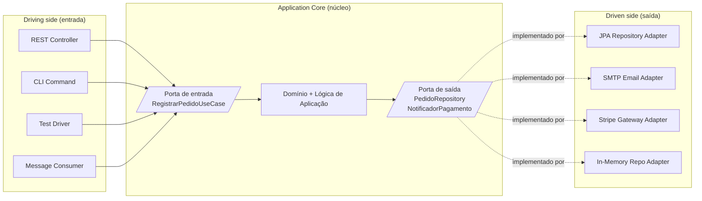

# Hexagonal Architecture (Ports and Adapters)

> **Bloco:** Estilos e padrões arquiteturais · **Nível:** Intermediário/Avançado · **Tempo de leitura:** ~24 min

## TL;DR

Hexagonal Architecture, ou **Ports and Adapters**, é um estilo criado por Alistair Cockburn que isola o núcleo da aplicação (regras de negócio) de tudo que é externo — UI, banco, mensageria, testes — por meio de **portas** (interfaces definidas pelo núcleo) e **adapters** (implementações que conectam tecnologias concretas a essas portas). O objetivo declarado: permitir que a aplicação seja igualmente acionada por usuários, programas, testes automatizados ou scripts em lote, e seja desenvolvida e testada em isolamento de seus dispositivos e bancos de execução. O hexágono não tem seis lados por significado — é só um desenho que dá espaço para múltiplas portas e contrasta com a metáfora linear de camadas.

## O problema que resolve

Cockburn nomeou o padrão em **1998**, mas só em **2005** entendeu o que os lados do hexágono significavam e publicou o artigo definitivo *Hexagonal Architecture* (também chamado *Ports and Adapters*), originalmente discutido no Portland Pattern Repository wiki. Em 2005 ele renomeou o padrão de "Hexagonal" para "Ports and Adapters" para enfatizar a mecânica em vez do desenho.

O problema-alvo é uma patologia recorrente das aplicações em camadas: o **vazamento da lógica de negócio para as bordas**. A regra de negócio escapa para dentro do código de UI (validações no controller, lógica no JavaScript) e para dentro do código de persistência (regras embutidas em queries, *stored procedures*, *triggers*). As consequências:

1. Impossível **testar** as regras sem subir a UI ou o banco.
2. Impossível **trocar** uma tecnologia de borda (de UI web para CLI, de Oracle para Postgres, de chamada síncrona para fila) sem reescrever regra de negócio.
3. Impossível **automatizar** o sistema (acioná-lo por script/teste) com a mesma facilidade com que um humano o aciona pela tela.

A insight de Cockburn foi reconhecer que **não importa se o ator que aciona a aplicação é um humano, outro programa ou um teste** — todos deveriam falar com o núcleo pela mesma porta. E não importa se a aplicação está falando com um banco real, um mock ou um arquivo — todos deveriam ser plugáveis pela mesma porta. As bordas viram **simétricas e substituíveis**.

## O que é (definição aprofundada)

O sistema é desenhado como um **hexágono** com o **núcleo da aplicação** (*application core*) no centro e tudo externo do lado de fora. Os elementos:

- **Application Core (núcleo):** contém o domínio e a lógica da aplicação. É a única parte que importa do ponto de vista de negócio. **Não conhece** nenhuma tecnologia externa — não sabe se é chamado por HTTP, se persiste em SQL ou se publica em Kafka.

- **Ports (portas):** são **interfaces** que definem como o mundo externo conversa com o núcleo (ou como o núcleo conversa com o mundo externo). Uma porta é um **contrato** expresso na linguagem do domínio, **definido pelo núcleo**. É o conceito central. Há dois tipos:
  - **Driving ports / primary ports (portas de entrada / direcionadoras):** o que o núcleo **oferece** ao mundo. Definem os casos de uso da aplicação. São acionadas pelos atores que *dirigem* a aplicação (usuário, controller, scheduler, teste).
  - **Driven ports / secondary ports (portas de saída / dirigidas):** o que o núcleo **precisa** do mundo. Definem dependências que o núcleo exige (persistir um agregado, enviar e-mail, cobrar pagamento). São implementadas por adapters que o núcleo *dirige*.

- **Adapters (adaptadores):** implementações concretas que conectam uma tecnologia específica a uma porta. Dois tipos, espelhando as portas:
  - **Driving adapters / primary adapters:** traduzem um estímulo externo (requisição HTTP, mensagem de fila, comando CLI, caso de teste) em chamadas a uma porta de entrada. Exemplos: `RestController`, `KafkaConsumer`, `CliCommand`.
  - **Driven adapters / secondary adapters:** implementam uma porta de saída usando tecnologia concreta. Exemplos: `JpaClienteRepository` (implementa a porta `ClienteRepository`), `SmtpEmailSender`, `StripePaymentGateway`.

A regra geométrica: **lado esquerdo do hexágono = portas/adapters de entrada (driving); lado direito = portas/adapters de saída (driven)**. Mas Cockburn é explícito: o número seis é arbitrário, escolhido apenas para dar espaço visual a múltiplas portas e para romper com a conotação "de cima para baixo" do diagrama de camadas.

A peça técnica que faz tudo funcionar é a **Inversão de Dependência (DIP)**: as portas de saída são interfaces declaradas **dentro** do núcleo; os adapters de saída, que vivem **fora**, dependem dessas interfaces. Assim, a dependência de código aponta de fora para dentro, mesmo quando o fluxo de controle vai de dentro para fora.

## Como funciona

### Regra de dependência

Todas as dependências de código apontam **para o núcleo**. O núcleo não importa nada de infraestrutura. Os adapters importam o núcleo (para implementar suas portas ou para acioná-las). Frameworks, drivers de banco, clientes HTTP — tudo isso vive nos adapters, nunca no core.

Para a saída, o truque é a inversão: o núcleo define `interface NotificadorDePagamento { void notificar(...); }` (uma porta de saída). O adapter `EmailNotificador` no anel externo implementa essa interface e é **injetado** no núcleo em tempo de composição (no *composition root* / startup da aplicação). O núcleo chama a interface sem nunca saber que por trás existe SMTP.

### Fluxo de uma requisição

Caso de uso "registrar pedido", acionado por HTTP:

1. Um **driving adapter** (`PedidoRestController`) recebe `POST /pedidos`, desserializa o JSON, valida formato.
2. Chama uma **porta de entrada** (`RegistrarPedidoUseCase.executar(comando)`) — uma interface do núcleo.
3. O **núcleo** executa a lógica: monta o agregado `Pedido`, aplica invariantes, calcula totais.
4. Para persistir, o núcleo chama uma **porta de saída** (`PedidoRepository.salvar(pedido)`) — outra interface do núcleo.
5. Em tempo de execução, quem responde por essa interface é o **driven adapter** `JpaPedidoRepository`, injetado na inicialização. Ele traduz o agregado para entidades JPA e grava.
6. O resultado sobe: núcleo → porta de entrada → driving adapter, que serializa a resposta HTTP.

O mesmo caso de uso, em um **teste de integração**, é acionado por um *driving adapter* de teste que chama `RegistrarPedidoUseCase` diretamente, e a porta de saída é satisfeita por um `PedidoRepositoryEmMemoria` — sem HTTP, sem banco. Essa **simetria** é o ganho central.

## Diagrama de fluxo



As setas sólidas mostram o **fluxo de controle** (entra pela esquerda, sai pela direita). As setas tracejadas do lado direito mostram que os adapters **implementam** as portas — ou seja, a **dependência de código** aponta de fora para dentro (DIP). Esse descompasso entre fluxo de controle e direção de dependência é a essência do estilo.

## Exemplo prático / caso real

Cenário **fintech**: uma carteira digital que precisa processar "transferência PIX". O núcleo expressa o caso de uso sem saber nada de Banco Central, banco de dados ou filas.

Núcleo (puro, sem framework):

```
// porta de ENTRADA
interface RealizarTransferenciaUseCase {
    Comprovante executar(ComandoTransferencia cmd);
}

// portas de SAÍDA (interfaces no núcleo)
interface ContaRepository { Conta carregar(Id id); void salvar(Conta c); }
interface ProvedorPix { ResultadoPix enviar(OrdemPix ordem); }
interface PublicadorEventos { void publicar(EventoDominio e); }

// implementação do caso de uso (núcleo)
class RealizarTransferencia implements RealizarTransferenciaUseCase {
    // recebe as portas de saída por injeção
    Comprovante executar(ComandoTransferencia cmd) {
        Conta origem = contas.carregar(cmd.origem);
        origem.debitar(cmd.valor);          // invariante: saldo suficiente (no domínio)
        ResultadoPix r = pix.enviar(...);    // porta de saída
        contas.salvar(origem);
        eventos.publicar(new TransferenciaRealizada(...));
        return new Comprovante(r.id);
    }
}
```

Adapters no anel externo:

- **Driving:** `PixRestController` (HTTP), `PixViaWhatsAppBot` (chatbot), `TesteAceitacaoTransferencia` (teste). Todos chamam `RealizarTransferenciaUseCase`.
- **Driven:** `ContaRepositoryPostgres` implementa `ContaRepository`; `ProvedorPixBacen` implementa `ProvedorPix` falando com o SPI do Banco Central; `PublicadorKafka` implementa `PublicadorEventos`.

Ganhos concretos: para testar a regra "não permitir transferência sem saldo", o time roda o caso de uso com `ContaRepositoryEmMemoria` e um `ProvedorPix` fake — milissegundos, sem rede. Quando o regulador exigiu trocar o provedor PIX, criou-se um novo driven adapter sem tocar uma linha do núcleo.

**Adotantes e ecossistema:** o padrão é base de inúmeras aplicações Spring/Quarkus/.NET orientadas a DDD. A documentação de boas práticas da AWS (*Prescriptive Guidance*) lista Hexagonal como padrão de design recomendado. É também o esqueleto sobre o qual Onion e Clean Architecture foram construídos — ambos reconhecem a dívida com Cockburn.

## Quando usar / Quando evitar

**Quando usar:**

- Domínios com regras de negócio relevantes que valem ser testadas em isolamento (fintechs, logística, seguros, faturamento).
- Sistemas que precisam suportar **múltiplos atores de entrada** (REST + fila + CLI + cron) sobre a mesma lógica.
- Quando se antecipa **troca de tecnologias de borda** (banco, gateway de pagamento, provedor de e-mail) ao longo da vida do sistema.
- Bases de código com vida longa onde a proteção do núcleo contra *churn* de frameworks compensa o custo de indireção.

**Quando evitar:**

- CRUDs anêmicos sem regra de negócio: a quantidade de interfaces e mapeamentos vira cerimônia pura (sinkhole, só que com mais arquivos).
- MVPs e protótipos descartáveis onde a velocidade inicial domina.
- Times sem maturidade em DIP/injeção de dependência — Hexagonal mal feito vira "interfaces com uma única implementação para sempre", custo sem benefício.

**Trade-offs explícitos:** você paga em **número de artefatos** (portas + adapters + mappers), em **indireção** (achar quem implementa uma porta exige navegar pela árvore de DI) e em **mapeamento** (domínio ↔ entidade de persistência ↔ DTO). Em troca recebe **testabilidade**, **independência de framework** e **substituibilidade de bordas**. A pergunta de arquiteto é: o domínio é rico o suficiente para que esse núcleo protegido valha o overhead?

## Anti-padrões e armadilhas comuns

- **Adapter anêmico / lógica no adapter:** colocar regra de negócio dentro do driving adapter (controller) ou do driven adapter (repository). Isso re-vaza a lógica para a borda — exatamente o que Hexagonal existe para impedir.

- **Portas demais / "interface por classe":** criar uma porta para cada classe do sistema, inclusive as que jamais terão segunda implementação. Gera cerimônia sem ganho. Portas devem existir onde há uma **fronteira real de substituição**.

- **Vazar tipos de infraestrutura no núcleo:** a porta de saída devolver um `ResultSet`, um `HttpResponse` ou uma entidade anotada com `@Entity`. A porta deve falar a **linguagem do domínio**, não a da tecnologia.

- **Modelo de domínio = modelo de persistência:** usar a mesma classe anotada com JPA como agregado de domínio. Acopla o núcleo ao ORM e mata a independência. O preço de separar é o mapeamento; pagá-lo é parte do estilo.

- **Confundir lado driving com driven:** implementar uma porta de entrada como se fosse de saída (ou vice-versa), invertendo o sentido das dependências e perdendo a simetria.

- **God use case:** um único caso de uso que faz tudo, acumulando responsabilidades — o equivalente hexagonal do fat service.

- **Composition root espalhado:** fiação de DI feita em vários lugares em vez de um ponto único de composição, dificultando entender quem pluga o quê.

## Relação com outros conceitos

Hexagonal é o **ancestral direto** de Onion e Clean — os três compartilham o princípio "domínio no centro, dependências apontam para dentro, infraestrutura na borda via DIP". As diferenças:

- **Hexagonal vs Onion:** Onion (Palermo) organiza o interior em **anéis concêntricos** explícitos (Domain Model → Domain Services → Application Services → infra) e dá ênfase a camadas internas nomeadas. Hexagonal não prescreve a estrutura interna do núcleo — só define a fronteira (portas/adapters). Hexagonal é mais sobre a **borda**; Onion, sobre a **estratificação interna**.

- **Hexagonal vs Clean:** Clean (Uncle Bob) é uma **síntese** que generaliza Hexagonal, Onion, DCI e BCE sob a **Dependency Rule** única, e nomeia anéis (Entities, Use Cases, Interface Adapters, Frameworks & Drivers). Os "Interface Adapters" de Clean são essencialmente os adapters de Cockburn; as "Boundaries" de Clean são as portas. Clean é mais prescritivo quanto aos quatro anéis; Hexagonal é mais minimalista (núcleo + portas + adapters). Na prática, muitos times usam os termos de forma intercambiável.

- **Hexagonal vs Layered:** Layered tem dependência **descendente** rumo ao banco (domínio depende da persistência). Hexagonal **inverte** a borda de saída via DIP, libertando o domínio. Hexagonal é, em parte, a resposta de Cockburn à dependência indevida do domínio sobre a infraestrutura no estilo em camadas.

- **Hexagonal + DDD:** o casamento é natural — o núcleo hexagonal é o lar dos *aggregates*, *value objects* e *domain services* do DDD tático; as portas de saída são frequentemente os *repositories* do DDD; os *bounded contexts* delimitam vários hexágonos.

- **Hexagonal + CQRS/Eventos:** portas de entrada podem ser separadas em *commands* e *queries*; portas de saída de eventos publicam para mensageria sem o núcleo conhecer o broker.

A frase de Cockburn resume tudo: a aplicação deve poder ser "igualmente acionada por usuários, programas, testes automatizados ou scripts em lote, e ser desenvolvida e testada em isolamento de seus dispositivos e bancos de execução de produção".

## Referências

- [hexagonal-architecture — Alistair Cockburn (artigo original/canônico)](https://alistair.cockburn.us/hexagonal-architecture) — a fonte primária, com a definição de portas, adapters e o objetivo do padrão.
- [Hexagonal architecture (software) — Wikipedia](https://en.wikipedia.org/wiki/Hexagonal_architecture_(software)) — histórico (1998 nomeação, 2005 renomeação para Ports and Adapters) e visão geral.
- [Hexagonal architecture pattern — AWS Prescriptive Guidance](https://docs.aws.amazon.com/prescriptive-guidance/latest/cloud-design-patterns/hexagonal-architecture.html) — aplicação do padrão em arquitetura cloud.
- [Hexagonal Architecture — QWAN (Marc Evers)](https://www.qwan.eu/2020/08/20/hexagonal-architecture.html) — leitura prática do padrão com exemplos de driving/driven.
- [Resources — Hexagonal Me (Juan Manuel Garrido de Paz)](https://jmgarridopaz.github.io/content/resources.html) — coletânea de recursos e a entrevista com Cockburn.
- [Interview with Alistair Cockburn — Hexagonal Me](https://jmgarridopaz.github.io/content/interviewalistair.html) — esclarecimentos do próprio autor sobre intenções e mal-entendidos do padrão.
- [Hexagonal Architecture — site dedicado](https://www.hexagonalarchitecture.org/) — material de referência consolidado sobre o estilo.
