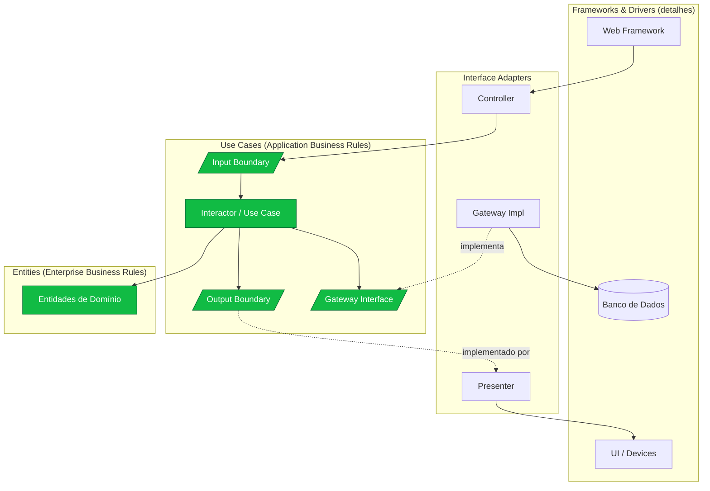

# Clean Architecture

> **Bloco:** Estilos e padrões arquiteturais · **Nível:** Intermediário/Avançado · **Tempo de leitura:** ~26 min

## TL;DR

Clean Architecture é a síntese proposta por Robert C. Martin (Uncle Bob) em 2012 que unifica Hexagonal, Onion, BCE e DCI sob uma única lei: a **Dependency Rule** — dependências de código só podem apontar **para dentro**, em direção às políticas de mais alto nível. O sistema é desenhado em anéis concêntricos (Entities → Use Cases → Interface Adapters → Frameworks & Drivers), com o domínio no centro independente de UI, banco e frameworks. O objetivo é uma arquitetura **testável, independente de framework, independente de UI, independente de banco e independente de qualquer agência externa**. Frameworks viram detalhes plugáveis, não fundações.

## O problema que resolve

Em agosto de **2012**, Uncle Bob publicou *The Clean Architecture* em seu blog (blog.cleancoder.com), mais tarde expandido no livro *Clean Architecture: A Craftsman's Guide to Software Structure and Design* (2017). O artigo abre constatando que vários estilos da década anterior — **Hexagonal Architecture** (Cockburn), **Onion Architecture** (Palermo), **BCE** (Boundary-Control-Entity, de Jacobson), **DCI** (Data, Context and Interaction) — apesar de diferenças de detalhe, **convergem para a mesma ideia**. Clean Architecture é a tentativa de extrair o princípio comum e dar-lhe nome.

O problema de fundo é o **acoplamento da lógica de negócio a detalhes voláteis**: frameworks, ORMs, bancos, protocolos de UI, bibliotecas. Uncle Bob argumenta que esses elementos são **detalhes**, não a essência do sistema. Quando o domínio depende deles, qualquer troca (migrar de Spring para Quarkus, de Oracle para Postgres, de web para mobile) força mudanças no coração do sistema. Pior: o domínio fica **impossível de testar** sem subir toda a infraestrutura.

A tese central é uma inversão de prioridades arquiteturais: **o banco é um detalhe, a web é um detalhe, o framework é um detalhe**. O que importa são as **regras de negócio**, e a arquitetura deve protegê-las, mantendo as decisões sobre detalhes adiáveis e reversíveis. "Uma boa arquitetura permite que você adie decisões sobre frameworks, bancos de dados e servidores web."

## O que é (definição aprofundada)

Clean Architecture estrutura o sistema em **círculos concêntricos**, do mais interno (políticas, mais estável) ao mais externo (detalhes, mais volátil). Os quatro anéis canônicos:

- **Entities (Entidades) — anel mais interno:** encapsulam as **Enterprise Business Rules**, as regras de negócio mais gerais e de mais alto nível, que existiriam mesmo sem aplicação. Podem ser objetos com métodos, estruturas de dados ou funções. São as menos propensas a mudar quando algo externo muda.

- **Use Cases (Casos de Uso):** contêm as **Application Business Rules** — a lógica específica da aplicação. Orquestram o fluxo de dados de e para as entidades, dirigindo-as a satisfazer os objetivos do caso de uso. Mudanças nesta camada não afetam as entidades; mudanças em UI ou banco não afetam os casos de uso.

- **Interface Adapters (Adaptadores de Interface):** um conjunto de adaptadores que **convertem dados** do formato mais conveniente para use cases/entities para o formato mais conveniente para agências externas (banco, web). Aqui moram **Controllers, Presenters e Gateways**, e tipicamente a estrutura MVC de uma GUI. Nenhum código mais interno deve saber nada sobre o banco.

- **Frameworks & Drivers — anel mais externo:** onde vivem os **detalhes** — o framework web, o banco de dados, a UI, dispositivos externos. Geralmente é só código de cola apontando para dentro. "Tudo termina aqui."

A **Dependency Rule** é a lei que faz tudo funcionar: *source code dependencies can only point inwards* — dependências de código-fonte só apontam para dentro. Nada de um círculo interno pode saber **qualquer coisa** sobre um círculo externo. Nomes declarados num círculo externo (uma classe, função, variável) **não podem ser mencionados** por código de um círculo interno. Isso inclui formatos de dados: estruturas usadas em uma borda externa não devem ser usadas por círculos internos.

Para cruzar fronteiras sem violar a regra, Uncle Bob prescreve o **DIP + Boundaries**: quando o fluxo de controle precisa ir de dentro para fora (um use case precisa gravar no banco), o use case chama uma **interface (Boundary/Port) que ele mesmo define**, e o código externo implementa essa interface. Assim o fluxo de controle vai para fora, mas a dependência de código aponta para dentro. Para transportar dados através da fronteira, usam-se **DTOs / structs simples e isolados**, nunca entidades de banco ou objetos do framework.

Componente recorrente em Clean: o **Presenter** e o **View Model**. O use case não devolve dados formatados para a tela; ele entrega um *output* a um *output boundary*, e um presenter o transforma em um *view model* que a view só renderiza burramente. Isso mantém a formatação fora do núcleo.

## Como funciona

### Regra de dependência

Uma só, e absoluta: **dependências apontam para dentro**. Entities não conhecem Use Cases; Use Cases não conhecem Interface Adapters; Interface Adapters não conhecem Frameworks & Drivers. Quando o controle precisa fluir contra essa direção, inverte-se com interfaces declaradas no anel interno e implementadas no externo (DIP).

A consequência prática: o banco, a web e o framework podem ser **trocados ou removidos** sem tocar Entities e Use Cases. O número de anéis não é sagrado — Uncle Bob diz explicitamente que pode haver mais de quatro; o que é inviolável é a Dependency Rule.

### Fluxo de uma requisição (cruzando as fronteiras)

Caso de uso "cadastrar cliente" via web:

1. **Frameworks & Drivers:** o framework web recebe `POST /clientes` e entrega ao controller.
2. **Interface Adapters (Controller):** o controller monta um **request model** (DTO simples) e chama o **Input Boundary** (interface do use case).
3. **Use Cases:** o interactor `CadastrarClienteUseCase` executa a Application Business Rule, cria/valida a entidade `Cliente` (Entity), e para persistir chama um **Output Boundary / Gateway interface** (`ClienteGateway.salvar`) — interface definida no anel de use cases.
4. **Interface Adapters (Gateway impl) → Frameworks & Drivers:** a implementação concreta (`ClienteGatewayJpa`) traduz para o ORM e grava no banco. A dependência aponta para dentro (implementa a interface do use case), embora o controle vá para fora.
5. **Volta:** o use case entrega um **response model** ao **Presenter** (Interface Adapters), que monta um **view model**; a view (Frameworks & Drivers) renderiza.

Repare: o use case nunca menciona JPA, HTTP ou JSON. Ele fala apenas com boundaries definidos por ele mesmo.

## Diagrama de fluxo



As setas de chamada vão de fora para dentro na entrada e voltam via boundaries na saída. As setas "implementa/implementado por" mostram a **inversão**: Gateway Impl e Presenter (anéis externos) implementam interfaces definidas no anel de Use Cases (interno). É isso que mantém toda dependência de código apontando para dentro.

## Exemplo prático / caso real

Cenário **marketplace**: caso de uso "publicar anúncio de produto". Regras: vendedor precisa estar verificado; produto não pode ter palavra proibida; preço acima de um teto exige aprovação manual.

Camadas:

- **Entities:** `Produto`, `Anuncio`, `Vendedor` — com regras de negócio puras. `Anuncio.podeSerPublicado()` aplica invariantes que valem para a empresa toda, independentemente de existir um app web.

- **Use Cases:** `PublicarAnuncioUseCase` (interactor) implementa `PublicarAnuncioInputBoundary`. Orquestra: carrega vendedor via `VendedorGateway`, valida com a entidade, chama `ModeracaoGateway` para a checagem de conteúdo, e ou publica via `AnuncioGateway` ou enfileira para aprovação manual. Entrega o resultado a `PublicarAnuncioOutputBoundary`.

```
// Use Cases layer — interfaces definidas AQUI
interface PublicarAnuncioInputBoundary { void executar(PublicarAnuncioRequest req); }
interface AnuncioGateway { void salvar(Anuncio a); }
interface ModeracaoGateway { ResultadoModeracao avaliar(String texto); }
interface PublicarAnuncioOutputBoundary { void apresentar(PublicarAnuncioResponse resp); }

class PublicarAnuncioUseCase implements PublicarAnuncioInputBoundary {
    void executar(PublicarAnuncioRequest req) {
        Vendedor v = vendedores.carregar(req.vendedorId);   // gateway
        Anuncio a = new Anuncio(v, req.produto, req.preco);  // Entity
        if (!a.podeSerPublicado()) { presenter.apresentar(rejeitado); return; }
        if (moderacao.avaliar(req.descricao).reprovado) { ... }
        anuncios.salvar(a);                                  // gateway
        presenter.apresentar(publicado);                     // output boundary
    }
}
```

- **Interface Adapters:** `AnuncioController` (recebe HTTP, monta o request model), `AnuncioPresenter` (implementa o output boundary, monta o view model), `AnuncioGatewayJpa` e `ModeracaoGatewayHttp` (implementam as interfaces de gateway).

- **Frameworks & Drivers:** Spring/Quarkus, Postgres, o serviço externo de moderação.

Ganho: para validar todas as regras de publicação, o time testa `PublicarAnuncioUseCase` com gateways fake, sem subir banco nem servidor de moderação. Para trocar o serviço de moderação, cria-se outro `ModeracaoGateway` sem tocar no use case.

**Adoção:** Clean Architecture é amplamente usada em Android (Google a referencia em guias de arquitetura), .NET (templates Clean Architecture de Jason Taylor são populares), Flutter, e em backends Java/Kotlin orientados a DDD. O livro é leitura quase obrigatória em trilhas de formação de arquitetos.

## Quando usar / Quando evitar

**Quando usar:**

- Sistemas de **vida longa** com regras de negócio substanciais, onde proteger o núcleo do *churn* tecnológico paga seu custo ao longo dos anos.
- Quando **testabilidade do domínio** sem infraestrutura é um *driver* forte (regulados, financeiros, healthcare).
- Quando há expectativa real de **trocar detalhes** (banco, framework, canal de entrega) ou suportar múltiplos (web + mobile + API + batch sobre os mesmos use cases).
- Times com maturidade em DIP, injeção de dependência e separação de modelos.

**Quando evitar:**

- CRUDs simples, microsserviços pequenos e descartáveis, scripts: a estrutura de quatro anéis, boundaries, presenters e mapeamentos vira **overhead cerimonial** desproporcional.
- MVPs sob pressão extrema de prazo onde a evolutibilidade futura é incerta.
- Times sem disciplina para sustentar as fronteiras — Clean meia-boca degenera em "Layered com mais pastas", herdando o custo sem o benefício.

**Trade-offs:** o preço é **muitos artefatos** (boundaries, DTOs, presenters, gateways, mappers), **indireção** (rastrear quem implementa cada boundary) e **mapeamento triplo** (entity ↔ DTO ↔ view model / entity ↔ persistence model). O retorno é **independência, testabilidade e adiabilidade de decisões**. Críticos (há posts notórios contestando o livro) argumentam que, fora de domínios ricos, o ganho não compensa — uma crítica legítima que o arquiteto deve pesar caso a caso.

## Anti-padrões e armadilhas comuns

- **Violar a Dependency Rule "só dessa vez":** o use case importa uma classe de framework ou uma entidade JPA "para ser prático". Um único vazamento corrói toda a garantia — a regra é binária.

- **Entidade de domínio = entidade de persistência:** reusar a classe anotada com `@Entity`/`@Document` como entidade de domínio. Acopla o núcleo ao ORM. O custo de mapear é o preço do estilo.

- **Use cases anêmicos / lógica nos controllers ou gateways:** regra de negócio escapando para Interface Adapters. Re-cria o problema que Clean veio resolver.

- **Presenter ausente / núcleo formatando saída:** o use case devolvendo strings já formatadas, datas em formato de tela, HTML. Formatação é detalhe e pertence a Interface Adapters.

- **DTOs que vazam tipos externos:** o request/response model carregando `JsonNode`, `ResultSet` ou entidades do ORM através da fronteira. Os dados que cruzam boundaries devem ser estruturas simples e isoladas.

- **"Clean Architecture" como justificativa para over-engineering:** aplicar os quatro anéis a um serviço CRUD trivial. Uncle Bob nunca disse "use sempre"; disse "proteja as regras de negócio onde elas existem".

- **Boundaries demais:** criar input/output boundary, presenter e view model para cada operação trivial, multiplicando indireção sem retorno. Pragmatismo: aplique a separação onde há complexidade que a justifique.

## Relação com outros conceitos

Clean Architecture é, por confissão do próprio autor, uma **generalização** de estilos anteriores:

- **Clean vs Hexagonal (Ports & Adapters):** os *Interface Adapters* de Clean correspondem aos *adapters* de Cockburn; os *Input/Output Boundaries* correspondem às *ports*. Clean adiciona uma estrutura interna nomeada (Entities vs Use Cases) e o aparato de Presenter/View Model. Hexagonal é mais minimalista quanto ao interior; Clean é mais prescritivo.

- **Clean vs Onion:** ambos usam anéis concêntricos com dependência para o centro. Onion (Palermo) nomeia Domain Model → Domain Services → Application Services → Infrastructure. Clean nomeia Entities → Use Cases → Interface Adapters → Frameworks & Drivers. São quase isomórficos; Clean é mais explícito sobre o mecanismo de cruzamento de fronteira (boundaries + presenters) e absorve Onion como caso particular.

- **Clean vs Layered:** Layered tem dependência **descendente para o banco** (domínio depende da persistência). Clean **inverte** tudo via Dependency Rule + DIP, libertando o domínio. É a antítese arquitetural do Layered tradicional.

- **Clean vs Vertical Slice:** Clean corta por **camada técnica** (anéis horizontais que atravessam todo o sistema). Vertical Slice corta por **funcionalidade**. Jimmy Bogard critica explicitamente Clean por favorecer um eixo de organização (técnico) que espalha cada feature por todas as camadas; VSA propõe agrupar tudo de uma feature junto. Não são mutuamente exclusivos: pode-se ter um slice que internamente respeita a Dependency Rule.

- **Clean + DDD:** as Entities de Clean são o lar dos *aggregates* e *value objects* do DDD tático; os Use Cases hospedam *application services*; os Gateways são os *repositories*; *bounded contexts* delimitam o todo. A combinação é o padrão de fato em sistemas DDD modernos.

A linha de Uncle Bob que sintetiza o estilo: a arquitetura deve ser **independente de frameworks, testável, independente de UI, independente de banco de dados e independente de qualquer agência externa** — as regras de negócio simplesmente não sabem nada sobre o mundo lá fora.

## Referências

- [The Clean Architecture — Robert C. Martin (Clean Coder Blog, 2012)](https://blog.cleancoder.com/uncle-bob/2012/08/13/the-clean-architecture.html) — o artigo original com a Dependency Rule e os quatro anéis.
- [Clean Architecture: A Craftsman's Guide to Software Structure and Design — Robert C. Martin (Amazon)](https://www.amazon.com/Clean-Architecture-Craftsmans-Software-Structure/dp/0134494164) — o livro que expande o artigo (2017).
- [Summary of Clean Architecture by Robert C. Martin (GitHub gist)](https://gist.github.com/ygrenzinger/14812a56b9221c9feca0b3621518635b) — resumo capítulo a capítulo, útil para revisão.
- [Book review: Clean Architecture by Robert C. Martin — Schneide Blog](https://schneide.blog/2018/01/08/book-review-clean-architecture-by-robert-c-martin/) — resenha crítica e equilibrada do livro.
- [Why I can't recommend Clean Architecture by Robert C. Martin — DEV Community](https://dev.to/bosepchuk/why-i-cant-recommend-clean-architecture-by-robert-c-martin-ofd) — visão crítica; importante para pesar os trade-offs sem dogmatismo.
- [Demystifying "Clean Architecture" by Robert C. Martin — Badr (Medium)](https://medium.com/@badr.t/demystifying-clean-architecture-by-robert-c-martin-a-software-developers-guide-ea132c22faf6) — guia prático de implementação das camadas.
