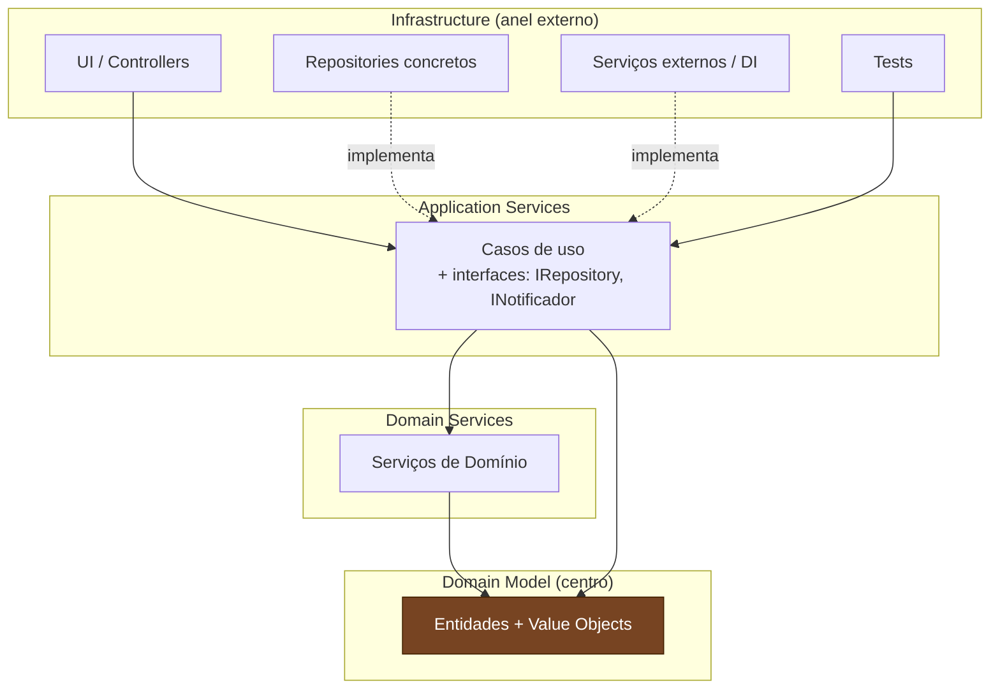

# Onion Architecture

> **Bloco:** Estilos e padrões arquiteturais · **Nível:** Intermediário/Avançado · **Tempo de leitura:** ~22 min

## TL;DR

Onion Architecture é um estilo apresentado por Jeffrey Palermo em julho de 2008 que organiza o sistema em **anéis concêntricos** com o **Domain Model** no centro e a **infraestrutura na borda externa**. A regra única e definidora: **todo acoplamento aponta para o centro** — código pode depender de anéis mais internos, nunca de anéis mais externos. Foi formulado explicitamente como cura para os males da arquitetura em camadas tradicional, onde o domínio depende da infraestrutura. Persistência, UI e serviços externos viram detalhes plugáveis na casca da cebola, conectados ao núcleo por interfaces que o próprio núcleo define.

## O problema que resolve

Em **julho de 2008**, Jeffrey Palermo publicou a série *The Onion Architecture* (partes 1 a 4) em seu blog. A motivação foi direta e nominal: atacar os problemas da **Layered Architecture / N-Tier tradicional**. Palermo argumentava que, embora o estilo em camadas pregue separação de responsabilidades, ele falha no ponto crucial — **a camada de negócio depende da camada de acesso a dados**, que depende do banco. O domínio, que deveria ser a parte mais estável e valiosa, fica acoplado à parte mais volátil (o esquema do banco, o ORM).

O sintoma que Palermo descreve: aplicações em camadas acumulam **acoplamento ao banco** que torna a base frágil e difícil de manter ao longo do tempo. Trocar de tecnologia de persistência, testar regras sem banco, ou simplesmente evoluir o domínio sem medo de quebrar SQL — tudo vira caro. A premissa central da Onion é **controlar o acoplamento**, e o mecanismo é inverter a direção das dependências: em vez de o domínio depender da infraestrutura, a infraestrutura passa a depender do domínio.

Palermo posicionou a Onion como parte de uma família que ele chamava de **arquiteturas baseadas em portas** (*port-based architectures*), reconhecendo parentesco com o Hexagonal de Cockburn — a diferença sendo a ênfase da Onion na **estratificação interna em anéis**.

## O que é (definição aprofundada)

A Onion estrutura o sistema em **camadas concêntricas** (a "cebola"), do centro para fora:

- **Domain Model (Modelo de Domínio) — centro absoluto:** representa a combinação de estado e comportamento que modela a verdade da organização. São as entidades e *value objects* do negócio, sem nenhuma dependência externa. É o coração: tudo gira em torno dele.

- **Domain Services (Serviços de Domínio):** lógica de domínio que não pertence naturalmente a uma única entidade. Operações que coordenam múltiplos objetos de domínio. Ainda totalmente dentro do mundo do negócio.

- **Application Services (Serviços de Aplicação):** orquestram casos de uso, coordenando objetos de domínio para realizar tarefas da aplicação. Definem as **interfaces** das dependências que o sistema precisa (repositories, serviços externos) — mas não as implementam.

- **Infrastructure / Outer Ring (Infraestrutura — anel externo):** UI, persistência (repositories concretos), acesso a serviços externos, testes, dependency injection. Tudo que é "tecnologia" e "detalhe" mora aqui, na casca.

A peça conceitual essencial da Onion: **interfaces no centro, implementações na borda**. As interfaces dos repositories e de qualquer dependência externa são **declaradas nas camadas internas** (tipicamente em Application Services ou no próprio domínio). As implementações concretas (que falam com o banco, com APIs) vivem na **Infrastructure**, no anel externo. Isso é a **Inversão de Dependência (DIP)** aplicada como princípio organizador de toda a arquitetura.

A regra de Palermo, na sua formulação original: **todo código pode depender de camadas mais centrais, mas nenhum código pode depender de camadas mais externas** — *all coupling is toward the center*. As camadas externas podem usar qualquer camada interna; as internas não conhecem as externas.

Onion também enfatiza que a aplicação é construída em torno de um **modelo de objetos independente** (o domínio), e não em torno do banco de dados — uma inversão filosófica em relação ao "database-first" comum em sistemas em camadas.

## Como funciona

### Regra de dependência

Direção única: **rumo ao centro**. Infrastructure depende de Application Services, que dependem de Domain Services, que dependem de Domain Model. O Domain Model não depende de nada. Nenhuma seta de dependência de código jamais aponta para fora.

Para que o domínio "use" o banco sem depender dele, o domínio/aplicação **define a interface** (`IPedidoRepository`) e a Infrastructure **a implementa** (`PedidoRepositorySql`). Em tempo de execução, o container de DI (que vive na borda externa) injeta a implementação concreta. Fluxo de controle vai do centro para a borda; dependência de código vai da borda para o centro.

### Fluxo de uma requisição

Caso de uso "aprovar empréstimo" em um sistema de crédito:

1. A **Infrastructure** (controller web) recebe `POST /emprestimos/{id}/aprovar` e chama um **Application Service** (`AprovarEmprestimoService`).
2. O Application Service carrega o agregado via interface `IEmprestimoRepository` (interface interna, implementação externa).
3. Aplica a regra usando **Domain Services** e o **Domain Model** (`Emprestimo.aprovar()`, política de risco em um domain service).
4. Persiste de volta via `IEmprestimoRepository` — cuja implementação concreta na Infrastructure grava no banco.
5. Eventual notificação via `INotificador` (interface interna, implementação SMTP/SMS na borda).
6. Resposta sobe ao controller, que serializa.

O Application Service nunca menciona SQL, ORM ou HTTP. Ele fala com interfaces declaradas no interior.

## Diagrama de fluxo



As setas de chamada (sólidas) descem da Infrastructure para o centro. As setas "implementa" (tracejadas) mostram que os repositories concretos do anel externo **implementam interfaces definidas em Application Services** — a dependência de código aponta para dentro, mesmo quando o controle flui para fora. Esse é o cerne da Onion.

## Exemplo prático / caso real

Cenário **e-commerce/logística**: caso de uso "calcular e reservar frete" para um pedido. Regras: peso e dimensões determinam a faixa; CEP de destino seleciona transportadora; clientes premium têm desconto de frete.

Organização em projetos (típica em .NET, onde a Onion popularizou):

```
Solucao/
  Dominio/              -> Pedido, Item, Frete (Domain Model)
  Dominio.Servicos/     -> CalculadoraFrete (Domain Service)
  Aplicacao/            -> ReservarFreteService + IFreteRepository, ITransportadoraGateway
  Infraestrutura/       -> FreteRepositorySql, CorreiosGateway, JadlogGateway, DI
  Web/                  -> FreteController (Infrastructure de entrega)
```

```
// Aplicacao — interface DECLARADA aqui
interface ITransportadoraGateway { Cotacao cotar(Pacote p, Cep destino); }
interface IFreteRepository { void salvar(Frete f); }

class ReservarFreteService {
    Frete reservar(PedidoId id) {
        Pedido p = pedidos.carregar(id);                  // interface interna
        Pacote pacote = p.montarPacote();                 // Domain Model
        Cotacao c = transportadora.cotar(pacote, p.cep);  // interface interna
        Frete f = calculadora.aplicar(c, p.cliente);      // Domain Service: desconto premium
        fretes.salvar(f);                                 // interface interna
        return f;
    }
}
```

Na Infraestrutura, `CorreiosGateway` e `JadlogGateway` implementam `ITransportadoraGateway`. Trocar de transportadora, ou adicionar uma terceira, é um novo adaptador na casca — o `ReservarFreteService` e o `CalculadoraFrete` (domínio) não mudam.

Ganho: o time testa toda a política de frete (faixas, desconto premium, seleção de transportadora) com gateways e repositórios fake, sem rede e sem banco. O domínio é construído em torno do modelo de objetos, não do esquema do banco.

**Adoção:** a Onion teve enorme tração na comunidade **.NET/C#** (Palermo é figura do ecossistema .NET), sendo base de muitos templates corporativos e do raciocínio que mais tarde alimentou os templates de Clean Architecture em .NET. É também citada por Uncle Bob como uma das fontes que Clean Architecture generaliza.

## Quando usar / Quando evitar

**Quando usar:**

- Domínios ricos, orientados a DDD, onde o **modelo de objetos** deve liderar e o banco é consequência, não causa.
- Sistemas de vida longa onde **controlar o acoplamento ao banco** é prioridade — exatamente o problema que motivou Palermo.
- Quando se quer **testabilidade** do domínio e dos casos de uso sem infraestrutura.
- Times .NET/Java com cultura de DIP e DI já estabelecida.

**Quando evitar:**

- CRUDs simples e *data-driven*: se a aplicação é essencialmente "telas sobre tabelas", a inversão e a separação de projetos viram cerimônia. Aqui um Layered honesto (ou até CRUD direto) é mais barato.
- MVPs e protótipos sob pressão de prazo.
- Times sem maturidade em inversão de dependência, que acabarão criando interfaces inúteis (uma implementação para sempre) ou furando os anéis.

**Trade-offs:** custo em **número de projetos/módulos**, **interfaces** e **mapeamentos** entre modelo de domínio e modelo de persistência. Em troca, **independência do banco**, **testabilidade** e um domínio que evolui sem o peso da infraestrutura. O risco específico da Onion é a **proliferação de anéis e interfaces** quando aplicada a problemas que não pedem tanto — disciplina arquitetural é pré-requisito.

## Anti-padrões e armadilhas comuns

- **Domínio dependendo da infraestrutura "só um pouco":** importar um tipo do ORM, um cliente HTTP ou uma anotação de persistência no Domain Model. Viola a regra fundamental (acoplamento só para o centro) e desfaz todo o propósito.

- **Modelo de domínio = modelo de persistência:** a clássica armadilha de reusar a entidade anotada do ORM como entidade de domínio. Acopla o centro à borda. Onion pede separação e mapeamento.

- **Application Services anêmicos / lógica nos controllers:** regra de negócio escapando para a Infrastructure (controllers, repositories). Re-cria o vazamento que a Onion combate.

- **Interfaces sem propósito:** criar `IServicoX` para toda classe, inclusive as que nunca terão segunda implementação nem precisam ser invertidas. Inflação de indireção sem ganho.

- **Anemic Domain Model no centro:** entidades só com getters/setters, lógica toda nos services. Onion preserva a separação física, mas sem comportamento no domínio você só tem um Layered disfarçado de cebola.

- **DI mal posicionado:** colocar a fiação de injeção de dependência fora do anel externo, ou espalhada, em vez de concentrada na borda de composição (a casca). Confunde quem implementa o quê.

- **Confundir Onion com "muitas camadas":** adicionar anéis "por boa prática" sem que correspondam a fronteiras reais de responsabilidade. Mais anéis ≠ mais limpo.

## Relação com outros conceitos

Onion pertence à mesma família de **"domínio no centro, dependências para dentro"** que Hexagonal e Clean. As distinções:

- **Onion vs Layered:** é a relação genética mais importante. Palermo desenhou a Onion **explicitamente para corrigir** o Layered — a inovação é inverter a dependência domínio↔persistência. Onde Layered faz o domínio depender do banco, Onion faz o banco (via implementação de interfaces) depender do domínio. Em certo sentido, Onion é "Layered dobrado para dentro" com DIP.

- **Onion vs Hexagonal:** ambos usam interfaces no núcleo e implementações na borda (DIP). Hexagonal (Cockburn) enfatiza a **fronteira simétrica** (portas de entrada e saída, driving/driven) e não prescreve a estrutura interna do núcleo. Onion enfatiza a **estratificação interna em anéis** (Domain Model → Domain Services → Application Services). Hexagonal fala mais da borda; Onion, do miolo. Palermo reconhece o parentesco, classificando Onion como uma arquitetura "baseada em portas".

- **Onion vs Clean:** quase isomórficos. Os anéis de Clean (Entities, Use Cases, Interface Adapters, Frameworks & Drivers) mapeiam de perto para (Domain Model, Application Services, Infrastructure-adapters, Infrastructure-drivers) da Onion. Uncle Bob cita a Onion como uma das fontes que Clean **generaliza** sob a única *Dependency Rule*. Clean adiciona o aparato de boundaries/presenters; Onion é um pouco mais enxuta e mais ligada ao vocabulário de DDD.

- **Onion + DDD:** o casamento é íntimo — Domain Model e Domain Services são vocabulário DDD direto; os repositories (interface no centro, impl na borda) são o padrão Repository do DDD. Onion é frequentemente a "forma física" de um *bounded context* implementado com DDD tático.

- **Onion vs Vertical Slice:** eixos ortogonais. Onion corta horizontalmente em anéis técnicos; VSA corta verticalmente por feature. A crítica de Bogard ao excesso de camadas se aplica também à Onion quando ela vira fim em si mesma.

Síntese para o arquiteto: Onion é a resposta de Palermo, em 2008, à pergunta "como manter a separação de responsabilidades do Layered sem deixar o domínio refém do banco?". A resposta — *all coupling toward the center* — é a mesma intuição que Cockburn (portas) e Martin (Dependency Rule) expressam com vocabulários diferentes.

## Referências

- [The Onion Architecture: part 1 — Jeffrey Palermo (Programming with Palermo, 2008)](https://jeffreypalermo.com/2008/07/the-onion-architecture-part-1/) — o artigo original que introduz o conceito e a crítica ao Layered.
- [The Onion Architecture: part 2 — Jeffrey Palermo](https://jeffreypalermo.com/2008/07/the-onion-architecture-part-2/) — aprofunda as camadas internas e a estratificação.
- [The Onion Architecture: part 3 — Jeffrey Palermo](https://jeffreypalermo.com/2008/08/the-onion-architecture-part-3/) — detalha implementação e organização de projetos.
- [tag onion-architecture — Programming with Palermo](https://jeffreypalermo.com/tag/onion-architecture/) — índice de toda a série pelo autor.
- [Onion Architecture — Herberto Graça (The Software Architecture Chronicles, Medium)](https://medium.com/the-software-architecture-chronicles/onion-architecture-79529d127f85) — análise comparativa da Onion no contexto histórico dos estilos.
- [Original Onion Architecture example — repositório (GitHub, fork do original)](https://github.com/Jordiag/Jeffrey-Palermo-Onion-Architecture) — código de exemplo derivado do repositório original de Palermo.
- [Sliced Onion Architecture — Oliver Drotbohm](https://odrotbohm.github.io/2023/07/sliced-onion-architecture/) — reflexão moderna combinando Onion com fatiamento vertical.
