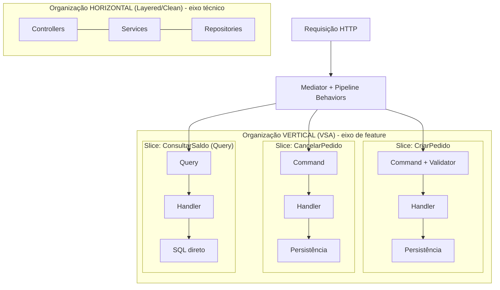

# Vertical Slice Architecture

> **Bloco:** Estilos e padrões arquiteturais · **Nível:** Intermediário/Avançado · **Tempo de leitura:** ~22 min

## TL;DR

Vertical Slice Architecture (VSA), popularizada por Jimmy Bogard em 2018, abandona o eixo de organização **horizontal por camada técnica** (controllers, services, repositories) e adota o eixo **vertical por funcionalidade**: cada *slice* encapsula tudo que uma requisição precisa, da borda de entrada à persistência, num único lugar coeso. O princípio fundador é **maximizar a coesão dentro de um slice e minimizar o acoplamento entre slices**. Cada slice pode escolher livremente como se implementar — desde um *transaction script* simples até DDD pleno — refatorando conforme a complexidade real emerge. É frequentemente implementada com CQRS e mediadores (como MediatR no .NET).

## O problema que resolve

VSA nasceu em **2018**, a partir de um post no blog de Jimmy Bogard (o criador do AutoMapper e do MediatR) e de uma palestra na NDC. O alvo da crítica são as **arquiteturas em camadas e suas descendentes** (Layered, Clean, Onion) quando aplicadas como organização *de topo* do código.

O problema que Bogard identifica: ao organizar por **camada técnica horizontal**, uma única funcionalidade de negócio fica **espalhada por todas as camadas**. Para implementar "cadastrar produto", o dev toca o controller (camada de apresentação), o service (camada de negócio), o repository (camada de persistência) e a entidade — cada um em uma pasta/projeto diferente, distante dos outros. As consequências:

1. **Baixa coesão funcional:** o que muda junto não vive junto. Entender uma feature exige saltar entre arquivos espalhados.
2. **Alto acoplamento por compartilhamento:** todas as features compartilham os mesmos services e repositories. Mudar um service para atender a feature A arrisca quebrar as features B, C e D que também o usam. O medo de efeitos colaterais cresce com o tamanho da base.
3. **Abstrações pelo menor denominador comum:** services e repositories genéricos viram "canivetes suíços" que servem a todas as features mal, em vez de servir a cada uma bem.

A observação de Bogard é que **a maioria das mudanças de software é por funcionalidade, não por camada**. Raramente você "muda toda a camada de persistência"; com frequência você "adiciona/muda uma feature". Logo, o eixo de organização deveria ser a funcionalidade. A diferença mais imediata entre VSA e Clean Architecture, nas próprias palavras dele: Clean favorece camadas onde cada camada é uma preocupação técnica; VSA favorece features onde cada feature é uma preocupação de negócio.

## O que é (definição aprofundada)

VSA organiza o sistema em **fatias verticais** (*vertical slices*), uma por requisição/funcionalidade. Cada slice corta através de todas as preocupações técnicas que aquela funcionalidade requer — entrada, validação, regra de negócio, persistência, resposta — e as mantém **juntas, coesas, no mesmo lugar** (mesma pasta/namespace/módulo).

Conceitos-chave:

- **Slice (fatia):** a unidade de organização. Tipicamente corresponde a um caso de uso ou *request* (ex.: `CriarPedido`, `CancelarPedido`, `ConsultarSaldo`). Contém tudo que aquela operação precisa.

- **Coesão alta intra-slice, acoplamento baixo inter-slice:** o invariante de design. Dentro de um slice, tudo que muda junto está junto. Entre slices, o compartilhamento é minimizado deliberadamente — o que cada slice faz é problema dele.

- **Liberdade de implementação por slice:** este é o ponto mais subversivo. Cada slice **escolhe sua própria abordagem**. Um slice CRUD trivial pode ir direto ao banco (*transaction script*); um slice com regra complexa pode usar agregados de DDD, *value objects* e *domain services*. Não há obrigação de uniformidade arquitetural entre slices. Você começa simples e **refatora para os padrões que emergem** dos *code smells* observados na lógica daquele slice específico.

- **CQRS como companheiro natural:** VSA combina muito bem com a separação de **Commands** (escrita, mudam estado) e **Queries** (leitura, não mudam estado). Cada command/query é um slice. Queries podem ir direto ao banco com SQL otimizado, sem passar por agregados; commands aplicam as regras. Isso elimina o "modelo único forçado" que atrapalha tanto leitura quanto escrita.

- **Mediador / pipeline:** na implementação .NET, é comum usar **MediatR**: cada slice define um `Request` (command/query) e um `Handler`; um mediador despacha o request ao handler correto. *Cross-cutting concerns* (validação, logging, transação, autorização) entram como **behaviors no pipeline**, aplicados a todos os slices sem código repetido.

Diferente de Layered/Clean/Onion, VSA **não prescreve** uma estrutura interna fixa. Ela prescreve um **eixo de organização** (vertical, por feature) e um **valor** (coesão sobre reuso prematuro).

## Como funciona

### Regra de organização (não de dependência)

VSA não é primariamente sobre direção de dependência (como a Dependency Rule de Clean); é sobre **eixo de modularização**. A regra prática: agrupe código por **feature**, não por **tipo técnico**. Cada slice é o mais autossuficiente possível.

Internamente, um slice individual *pode* aplicar inversão de dependência, portas/adapters ou DDD se a complexidade pedir — VSA não proíbe; ela só não obriga. Slices simples permanecem simples; slices complexos ganham estrutura sob demanda. Essa é a filosofia "*write the code you need, refactor when it hurts*".

### Fluxo de uma requisição

Caso de uso "criar pedido" com CQRS + mediador:

1. A borda (controller/endpoint) recebe `POST /pedidos`, monta um `CriarPedidoCommand` e o envia ao **mediador**.
2. O mediador roteia para `CriarPedidoHandler` — que vive na mesma pasta `Features/Pedidos/CriarPedido/` junto com o command, o validator e o response.
3. O pipeline aplica *behaviors* transversais: `ValidationBehavior` (valida o command), `LoggingBehavior`, `TransactionBehavior`.
4. O `CriarPedidoHandler` faz **tudo que esse slice precisa**: aplica a regra (pode usar o agregado `Pedido` se for complexo, ou montar direto se for simples), persiste (via EF/Dapper, como aquele slice preferir), monta o response.
5. O response volta pelo mediador ao endpoint, que serializa.

Repare: não há um `PedidoService` compartilhado entre `CriarPedido`, `CancelarPedido` e `ConsultarPedido`. Cada um é seu próprio slice. Mudar `CriarPedido` não pode quebrar `CancelarPedido`, porque eles não compartilham implementação.

## Diagrama de fluxo



O contraste é o ponto: a organização horizontal corta o sistema por preocupação técnica (uma feature atravessa todos os blocos); a organização vertical agrupa por feature (cada slice é autossuficiente). O mediador + pipeline injeta os *cross-cutting concerns* sem forçar camadas compartilhadas.

## Exemplo prático / caso real

Cenário **fintech / conta digital**. Funcionalidades: realizar transferência (regra rica), consultar extrato (leitura pesada), atualizar perfil (CRUD simples).

Estrutura por feature:

```
src/Features/
  Transferencias/
    RealizarTransferencia/
      RealizarTransferenciaCommand.cs
      RealizarTransferenciaValidator.cs
      RealizarTransferenciaHandler.cs   // usa agregado Conta, DDD pleno
      RealizarTransferenciaResponse.cs
  Extratos/
    ConsultarExtrato/
      ConsultarExtratoQuery.cs
      ConsultarExtratoHandler.cs        // Dapper + SQL otimizado, sem agregado
  Perfil/
    AtualizarPerfil/
      AtualizarPerfilCommand.cs
      AtualizarPerfilHandler.cs          // EF direto, transaction script trivial
```

Note a **heterogeneidade deliberada**:

- `RealizarTransferenciaHandler` é complexo: carrega o agregado `Conta`, aplica invariantes (saldo, limite diário antifraude), publica evento de domínio. Vale DDD aqui.
- `ConsultarExtratoHandler` é uma query: vai direto ao banco com SQL paginado e projeções, sem instanciar agregados. Forçá-lo a passar por repository de domínio seria desperdício.
- `AtualizarPerfilHandler` é CRUD: mapeia o command para a entidade e salva. Cerimônia mínima.

```
class RealizarTransferenciaHandler {
    Response handle(RealizarTransferenciaCommand cmd) {
        Conta origem = repo.carregar(cmd.origem);   // agregado DDD
        origem.transferirPara(cmd.destino, cmd.valor); // invariantes no domínio
        repo.salvar(origem);
        return new Response(origem.saldoAtual());
    }
}
```

Ganho concreto: adicionar a feature "agendar transferência" significa **criar uma nova pasta** com seus próprios command/handler — sem tocar o código de transferência imediata, sem medo de regressão. Bogard resume: novas features só **adicionam** código; você não está mudando código compartilhado e se preocupando com efeitos colaterais.

**Adoção:** VSA é forte no ecossistema **.NET** (Bogard, MediatR), com o site dedicado *verticalslicearchitecture.com* e cursos do próprio autor. O padrão tem migrado para Java (Spring + mediator), Node e Go, sempre que o time prioriza coesão por feature.

## Quando usar / Quando evitar

**Quando usar:**

- Aplicações com **muitas features distintas** que evoluem independentemente — produtos de negócio ricos, SaaS, sistemas internos grandes.
- Times que sofrem com o "medo de mudar o service compartilhado": VSA isola o blast radius por feature.
- Quando se quer **pragmatismo heterogêneo** — features simples ficam simples, features complexas ganham DDD, sem dogma uniforme.
- Bases que combinam bem com **CQRS** (leitura e escrita com necessidades distintas).
- Times que valorizam *onboarding* rápido por feature (tudo de uma feature num lugar só).

**Quando evitar:**

- Domínios onde há **muita lógica genuinamente compartilhada** entre features (regras transversais densas) — VSA pode levar a duplicação real, não só aparente.
- Sistemas muito pequenos, onde nem o problema de fragmentação por camada existe.
- Times que confundem "liberdade por slice" com "cada dev faz como quer" sem governança — vira inconsistência caótica.
- Quando a organização exige forte padronização técnica entre todas as operações (alguns contextos regulados).

**Trade-offs:** VSA troca **reuso máximo** por **coesão e baixo acoplamento**. Aceita-se **alguma duplicação** entre slices (consciente, não acidental) em nome da independência — uma escolha que contraria o instinto DRY de muitos desenvolvedores. A disciplina necessária é saber distinguir duplicação *boa* (coincidência) de duplicação *ruim* (mesma regra de negócio repetida, que deveria ser extraída).

## Anti-padrões e armadilhas comuns

- **Slices que viram camadas disfarçadas:** criar dentro de cada feature uma microestrutura controller/service/repository, recriando o problema horizontal dentro de cada pasta. VSA não é "Clean por feature obrigatório".

- **DRY prematuro / extrair tudo:** ao ver duas linhas parecidas em dois slices, extrair imediatamente um helper compartilhado. Isso re-cria o acoplamento entre features que VSA evita. Espere o padrão *emergir* de verdade.

- **God handler:** um handler que tenta resolver várias responsabilidades por achar "está no mesmo slice". Coesão não significa amontoar.

- **Duplicação ruim não percebida:** o oposto do DRY prematuro — repetir a **mesma regra de negócio** em N slices. Quando é regra de domínio genuína, ela pertence ao modelo de domínio compartilhado, não copiada por slice.

- **Mediador como religião:** achar que VSA *exige* MediatR ou qualquer biblioteca específica. O mediador é uma conveniência de implementação, não a arquitetura. VSA é sobre o eixo de organização.

- **Ausência de governança transversal:** sem *behaviors*/políticas comuns (validação, transação, autorização), cada slice reimplementa o transversal de um jeito, gerando inconsistência operacional.

- **Confundir VSA com microsserviços:** slice não é serviço. VSA é organização *interna* de código (cabe perfeitamente num monólito); microsserviços são fronteiras de deployment e processo.

## Relação com outros conceitos

- **VSA vs Clean / Onion / Hexagonal:** o contraste fundamental é o **eixo de corte**. Clean/Onion/Hexagonal cortam **horizontalmente** por camada técnica (anéis/portas atravessam todas as features). VSA corta **verticalmente** por feature. Bogard articula isso diretamente: arquiteturas em camadas favorecem o eixo técnico; VSA favorece o eixo de negócio. Não são necessariamente inimigos — um slice complexo *pode internamente* respeitar a Dependency Rule de Clean. Mas a organização de topo é oposta.

- **VSA vs Layered:** VSA é uma reação ao mesmo problema que Onion/Clean atacam (acoplamento, baixa testabilidade do Layered), mas pela via da **coesão por feature** em vez da inversão de dependência. Onde Onion conserta a *direção* das dependências, VSA conserta o *agrupamento* do código.

- **VSA + CQRS:** parceria quase inseparável. Cada command e query vira um slice; a separação leitura/escrita do CQRS materializa-se na separação física de slices, permitindo que queries usem SQL cru e commands usem agregados ricos.

- **VSA + DDD:** compatíveis e complementares. Slices complexos hospedam agregados, *value objects* e *domain services*; slices simples dispensam tudo isso. VSA dá a liberdade de aplicar DDD *onde dói*, evitando o DDD cerimonial em CRUDs.

- **VSA vs Modular Monolith:** operam em níveis diferentes e combinam bem. Modular Monolith fatia o sistema em **módulos/bounded contexts** de alto nível (fronteiras com encapsulamento forte); dentro de cada módulo, VSA pode organizar o código por feature. Um é macro (fronteiras de módulo), o outro é micro (organização intra-módulo).

A tese de Bogard, em uma frase: como a maior parte da mudança chega por funcionalidade e não por camada, organizar por funcionalidade maximiza coesão e minimiza o raio de impacto das mudanças — *high cohesion, low coupling*, mas com o eixo girado em 90 graus em relação ao layering tradicional.

## Referências

- [Vertical Slice Architecture — Jimmy Bogard (jimmybogard.com)](https://www.jimmybogard.com/vertical-slice-architecture/) — o post de referência do criador do estilo.
- [Vertical Slice Architecture — site dedicado](https://verticalslicearchitecture.com/) — material consolidado, exemplos e padrões.
- [My thoughts on Vertical Slices, CQRS, Semantic Diffusion — Architecture Weekly (Oskar Dudycz)](https://www.architecture-weekly.com/p/my-thoughts-on-vertical-slices-cqrs) — análise crítica e relação com CQRS e DDD.
- [Jimmy Bogard on Vertical Slice Architecture and MediatR — David Giard](https://davidgiard.com/jimmy-bogard-on-vertical-slice-architecture-and-mediatr) — entrevista com o autor sobre a motivação e o uso do mediador.
- [Architecture tag — Jimmy Bogard](https://www.jimmybogard.com/tag/architecture/) — índice dos posts de arquitetura do autor.
- [Upcoming Training on Modern .NET with Vertical Slice Architecture — Jimmy Bogard](https://www.jimmybogard.com/upcoming-training-on-vertical-slice-architecture/) — visão de como o autor ensina o estilo na prática.
