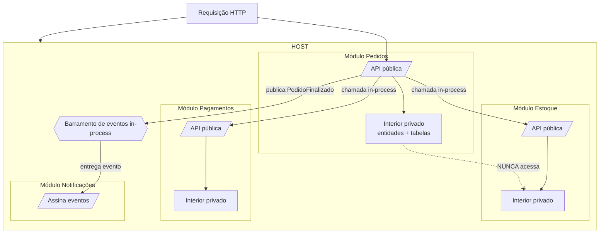

# Modular Monolith

> **Bloco:** Estilos e padrões arquiteturais · **Nível:** Intermediário/Avançado · **Tempo de leitura:** ~25 min

## TL;DR

Modular Monolith é um estilo que entrega o sistema como **uma única unidade de deployment** (um monólito), mas internamente o organiza em **módulos fortemente encapsulados e autônomos**, alinhados a *bounded contexts*, com fronteiras explícitas e comunicação controlada entre eles. É a alternativa pragmática à corrida prematura por microsserviços: você ganha a **modularidade lógica** (separação de domínios, baixo acoplamento, alta coesão) sem pagar o **custo operacional da distribuição** (rede, consistência distribuída, observabilidade complexa, *devops* pesado). Sintetizado e popularizado por Kamil Grzybek, ecoa o "monolith first" de Martin Fowler, o "majestic monolith" de DHH e o aforismo de Simon Brown: "se você não consegue construir um monólito bem estruturado, o que faz você pensar que microsserviços são a resposta?".

## O problema que resolve

A partir de meados dos anos 2010, a indústria adotou **microsserviços** como bala de prata. Equipes pequenas, sem necessidade de escala independente, sem maturidade de *devops*, fatiaram sistemas em dezenas de serviços. O resultado, em muitos casos, foi o **monólito distribuído**: o pior dos dois mundos — o acoplamento de um monólito somado à complexidade operacional da distribuição (latência de rede, falhas parciais, transações distribuídas, *deploy* coordenado, debugging através de tracing).

Kamil Grzybek, na série *Modular Monolith* (notadamente o post fundador *Modular Monolith: A Primer*), argumenta que a indústria deu um "*false start*" ao adotar microsserviços como remédio para todos os problemas dos monólitos. O ponto dele: o problema real dos monólitos ruins **não é serem monólitos** — é serem **não-modulares** (*big balls of mud*). A solução, portanto, não precisa ser distribuir; pode ser **modularizar**.

Martin Fowler, em *MonolithFirst*, dá o argumento empírico: quase todas as histórias de sucesso com microsserviços começaram com um monólito que cresceu demais e foi quebrado; quase todas as histórias de fracasso começaram tentando microsserviços do zero. A modularidade do monólito (nas fronteiras de API e na forma de armazenar dados) é o que torna a eventual extração possível — e adia a decisão até haver informação suficiente.

DHH cunhou o **"Majestic Monolith"** para Basecamp: para um time focado, a sobrecarga operacional dos microsserviços é puro desperdício. E Simon Brown cristalizou a crítica: *"if you can't build a well-structured monolith, what makes you think microservices are the answer?"* — microsserviços não corrigem fronteiras mal desenhadas; eles transformam violações de fronteira em chamadas de rede.

## O que é (definição aprofundada)

Modular Monolith combina duas propriedades que normalmente se pensa em oposição:

- **Monolítico no deployment:** todo o sistema é **uma única unidade de deploy**, um único processo/executável (ou alguns poucos). Não há rede entre os módulos; chamadas entre módulos são chamadas em memória (in-process). Há uma transação local possível, um único *runtime*, um único pipeline de deploy.

- **Modular na estrutura:** internamente, o código é dividido em **módulos** — partes independentes e intercambiáveis, cada uma contendo tudo necessário para executar **um aspecto** da funcionalidade. Grzybek define modularidade como a técnica de design que enfatiza separar a funcionalidade em módulos independentes e intercambiáveis. A modularidade aqui não é cosmética (não é só "pastas"); é **encapsulamento real e governado**.

Os atributos que definem um módulo de verdade:

- **Fronteiras explícitas (boundaries):** cada módulo tem uma fronteira clara. Idealmente alinhada a um **bounded context** do DDD — uma fatia de negócio coesa (ex.: Catálogo, Pedidos, Pagamentos, Estoque).

- **Encapsulamento forte:** o interior do módulo (entidades, regras, tabelas) é **privado**. Outros módulos não acessam o banco interno de um módulo, nem suas classes internas. O módulo expõe apenas uma **API pública** (interface, contrato) bem definida. Isso é o que distingue um Modular Monolith de um monólito em camadas: o encapsulamento é por **domínio**, não por **camada técnica**.

- **Comunicação controlada entre módulos:** módulos se comunicam por contratos explícitos. Os dois estilos principais (Grzybek detalha em *Integration Styles*): **chamadas síncronas in-process** via interface pública, e **comunicação assíncrona via eventos** (mensagens publicadas num barramento in-process / *outbox*), que reduz o acoplamento e prepara terreno para eventual extração.

- **Dados encapsulados por módulo:** o anti-padrão clássico do monólito é o **banco compartilhado** onde todos leem/escrevem todas as tabelas. No Modular Monolith maduro, cada módulo "possui" seu esquema (schema separado, ou ao menos tabelas privadas), e ninguém acessa as tabelas de outro módulo diretamente — só pela API pública. Pode ser um banco físico só, mas com **separação lógica rígida**.

- **Enforcement das fronteiras:** modularidade só sobrevive se for **forçada por ferramenta**, não por boa vontade. Grzybek enfatiza o *architecture enforcement* — testes de arquitetura (ArchUnit, NetArchTest), análise estática, ou separação em projetos/módulos de build que impedem fisicamente que o módulo A importe o interior do módulo B.

A definição é, em essência: **a modularidade dos microsserviços, sem a distribuição dos microsserviços**.

## Como funciona

### Regra de dependência e isolamento

A regra central é o **encapsulamento por módulo**: cada módulo só pode ser acessado por sua API pública; seu interior é invisível para os demais. As dependências entre módulos devem ser **explícitas, mínimas e idealmente unidirecionais** (evitar ciclos). Tipicamente:

- Um módulo expõe um *contracts*/*public API* (interfaces, DTOs, comandos, eventos).
- Outros módulos dependem **apenas** desses contratos, nunca da implementação interna.
- Comunicação preferencialmente por **eventos assíncronos** para acoplamento fraco; síncrona in-process quando há necessidade de resposta imediata.

Dentro de cada módulo, você pode usar **qualquer estilo interno** — Layered, Hexagonal, Clean, Onion ou Vertical Slice. O Modular Monolith governa as **fronteiras entre módulos**; a organização *intra*-módulo é livre.

### Fluxo de uma operação cruzando módulos

Caso de uso "finalizar pedido" num e-commerce com módulos `Pedidos`, `Estoque`, `Pagamentos`, `Notificacoes`:

1. A requisição entra no módulo **Pedidos** (sua API pública / endpoint).
2. Pedidos precisa reservar estoque: chama a **API pública do módulo Estoque** (in-process, ex.: `IEstoqueModule.reservar(itens)`), **sem** tocar nas tabelas internas de Estoque.
3. Pedidos solicita cobrança ao módulo **Pagamentos** via contrato público.
4. Concluído, Pedidos publica um **evento de domínio** `PedidoFinalizado` num barramento in-process.
5. O módulo **Notificacoes** assina `PedidoFinalizado` e envia o e-mail — sem que Pedidos saiba que Notificacoes existe. Acoplamento mínimo.

Tudo isso roda **no mesmo processo**, numa única transação (ou com *outbox* para os eventos), sem rede. Se amanhã `Pagamentos` precisar escalar sozinho, sua API pública e seus eventos já são o contrato de extração para um microsserviço — a fronteira já existe.

## Diagrama de fluxo



O elemento decisivo: a seta tracejada com X mostra a **proibição** — o interior de Pedidos jamais acessa as tabelas/classes internas de Estoque. Toda comunicação passa pelas APIs públicas e pelo barramento de eventos. Tudo dentro de um único *deployable*.

## Exemplo prático / caso real

Cenário **marketplace** com quatro domínios: `Catalogo`, `Pedidos`, `Pagamentos`, `Avaliacoes`. O time tem 12 engenheiros — número pequeno demais para arcar com o overhead operacional de microsserviços, mas o sistema é complexo o bastante para sofrer com um monólito *big ball of mud*.

Estrutura (módulos como projetos/módulos de build separados, fronteiras forçadas pelo build):

```
src/
  Modulos/
    Catalogo/
      Catalogo.Api/         <- contratos públicos (interfaces, DTOs, eventos)
      Catalogo.Interno/     <- entidades, regras, persistência (PRIVADO)
    Pedidos/
      Pedidos.Api/
      Pedidos.Interno/
    Pagamentos/
      Pagamentos.Api/
      Pagamentos.Interno/
    Avaliacoes/
      Avaliacoes.Api/
      Avaliacoes.Interno/
  Shared/                   <- kernel mínimo: tipos comuns, barramento
  Host/                     <- o ÚNICO deployable que compõe todos os módulos
```

Regras forçadas por testes de arquitetura:

- `Pedidos.Interno` **só pode** referenciar `Catalogo.Api` e `Pagamentos.Api`, nunca `Catalogo.Interno`.
- Nenhum módulo referencia o `*.Interno` de outro. O build quebra se alguém tentar.
- Cada módulo tem seu **schema** no banco (`catalogo.*`, `pedidos.*`); queries cross-schema são proibidas por convenção e revisão.

Fluxo "comprar produto":

```
Pedidos.Interno.CriarPedidoHandler:
    var produto = catalogoApi.obterProduto(id);   // Catalogo.Api (público)
    pedido.adicionar(produto.snapshot);            // guarda snapshot, não FK p/ tabela de Catalogo
    pagamentosApi.cobrar(pedido.total);            // Pagamentos.Api
    bus.publicar(new PedidoCriado(pedido.id));     // evento
// Avaliacoes assina PedidoCriado para liberar avaliação após entrega
```

Quando, dois anos depois, `Pagamentos` precisa de escala e isolamento de PCI-DSS, ele é **extraído como microsserviço** com baixo custo: sua API pública vira uma API REST/gRPC, seus eventos vão para um broker real (Kafka/RabbitMQ), e o resto do sistema quase não muda — porque já falava com `Pagamentos.Api` e nunca com seu interior. **A fronteira já existia.**

**Adotantes e referências reais:** o repositório `modular-monolith-with-ddd` de Kamil Grzybek é a referência canônica de implementação (DDD + Modular Monolith em .NET). Shopify operou por anos um monólito Rails modularizado de grande escala. DHH/Basecamp com o "Majestic Monolith". Há ampla cobertura na InfoQ sobre o tema e sobre a "falsa dicotomia" monólito vs microsserviços.

## Quando usar / Quando evitar

**Quando usar:**

- **Times pequenos e médios** (a maioria), onde o overhead de microsserviços (infra, *devops*, observabilidade distribuída) não se paga.
- **Início de produto / domínio ainda incerto:** as fronteiras de negócio ainda não estão claras. Modular Monolith permite errar e mover fronteiras barato (refatoração in-process) antes de cravá-las em rede. É a materialização do *monolith first*.
- Quando se quer **boa modularidade e baixo acoplamento** sem aceitar latência de rede, consistência eventual forçada e *deploy* coordenado.
- Como **estratégia de transição**: construir modular para, se e quando a escala justificar, extrair módulos específicos como microsserviços com baixo custo.

**Quando evitar / quando ir para microsserviços:**

- Necessidade real de **escalar partes independentemente** com perfis de carga muito diferentes (um módulo consome 90% da CPU).
- **Times grandes** que precisam de autonomia total de deploy (dezenas de squads pisando no mesmo deployable viram gargalo de release).
- Requisitos de **isolamento de falha** forte (um módulo não pode derrubar o processo inteiro) ou de **tecnologias heterogêneas** (um serviço em Python ML, outro em Go).
- Restrições de **compliance/segurança** que exigem isolamento físico (ex.: PCI-DSS para pagamentos).

**Trade-offs:** Modular Monolith troca **autonomia de deploy e escala independente** (que microsserviços dão) por **simplicidade operacional, consistência transacional local e baixa latência interna**. O risco específico é a **erosão das fronteiras**: sem enforcement automatizado, a tentação de "só dessa vez acessar a tabela do outro módulo" transforma o modular monolith de volta em *big ball of mud*. Disciplina + ferramenta de enforcement são inegociáveis.

## Anti-padrões e armadilhas comuns

- **Fronteiras só no papel (sem enforcement):** dividir em pastas/namespaces mas permitir que qualquer módulo importe o interior de outro. Sem testes de arquitetura ou separação de build, a modularidade evapora em meses. Este é o erro número um.

- **Banco compartilhado sem dono:** todos os módulos lendo e escrevendo todas as tabelas. Recria o acoplamento que o estilo deveria eliminar. Cada módulo deve possuir seus dados (schema/tabelas privadas).

- **Foreign keys cruzando módulos:** FKs do banco entre tabelas de módulos diferentes amarram os esquemas e impedem extração futura. Prefira referências por id + snapshot/cópia de dados necessários.

- **Acoplamento via chamadas síncronas em excesso:** todo módulo chamando todos os outros sincronicamente cria uma teia rígida. Prefira **eventos assíncronos** para reduzir acoplamento onde resposta imediata não é necessária.

- **Dependências cíclicas entre módulos:** A depende de B que depende de A. Mata a independência. As dependências devem ser acíclicas e mínimas.

- **Shared kernel inchado:** uma pasta `Shared`/`Common` que vira lixeira de tudo, criando acoplamento global. O kernel compartilhado deve ser minúsculo e estável (tipos primitivos do domínio, contrato de barramento).

- **Confundir camadas com módulos:** organizar em `controllers/services/repositories` (camadas técnicas) e chamar de modular. Modular Monolith é modular por **domínio/bounded context**, não por camada — exatamente a ressalva de Fowler em *PresentationDomainDataLayering*.

- **Microsserviços disfarçados / extração prematura:** introduzir rede e processos separados "porque é modular" antes de a escala justificar. O ponto do estilo é **adiar** a distribuição até haver razão concreta.

## Relação com outros conceitos

- **Modular Monolith vs Microservices:** a comparação central. Ambos buscam **modularidade** (baixo acoplamento, alta coesão, fronteiras de bounded context). Diferem na **topologia de deployment**: microsserviços distribuem os módulos em processos/máquinas separados (autonomia de deploy e escala, ao custo de rede, consistência distribuída, observabilidade complexa); Modular Monolith mantém tudo num processo (simplicidade operacional, transação local, ao custo de deploy acoplado e escala em bloco). A InfoQ chama de **falsa dicotomia**: há um *espectro* entre os extremos, e o Modular Monolith ocupa o meio. Regra prática: **modularize primeiro; distribua só quando um driver concreto (escala, autonomia de time, isolamento) exigir** — e a modularidade prévia torna a extração barata.

- **Modular Monolith vs Monólito tradicional (Layered):** o monólito Layered é modular por **camada técnica**; o Modular Monolith é modular por **domínio**, com encapsulamento forte. É a aplicação da ressalva de Fowler: os módulos de topo devem ser bounded contexts, não camadas. Um monólito em camadas pode ser um big ball of mud; um Modular Monolith bem feito, não.

- **Modular Monolith + DDD:** parceria natural. Cada módulo é (idealmente) um **bounded context**; a comunicação entre módulos segue *context mapping* (eventos, anti-corruption layers); cada módulo é o lar de seus agregados. O repositório de referência de Grzybek é justamente "Modular Monolith *with DDD*".

- **Modular Monolith + estilos internos (Hexagonal/Clean/Onion/VSA):** o Modular Monolith governa as fronteiras *entre* módulos; **dentro** de cada módulo você aplica o estilo que fizer sentido. Um módulo rico pode ser Hexagonal/Clean; um módulo CRUD pode ser Layered; um módulo com muitas features pode usar Vertical Slice. Os níveis são complementares (macro vs micro).

- **Modular Monolith vs Vertical Slice:** VSA organiza *features* dentro de um módulo (micro-organização); Modular Monolith organiza *bounded contexts* (macro-organização). Combinam: módulos por domínio, slices por feature dentro de cada módulo.

Para o arquiteto, a lição estratégica é a de Fowler, Brown e Grzybek convergindo: **a dificuldade não é monólito vs microsserviço; é desenhar boas fronteiras**. O Modular Monolith é a opção que permite acertar as fronteiras barato, mantendo aberta a porta para distribuir depois — em vez de pagar antecipadamente o imposto da distribuição sobre fronteiras que você ainda nem entende.

## Referências

- [Modular Monolith: A Primer — Kamil Grzybek](https://www.kamilgrzybek.com/blog/posts/modular-monolith-primer) — o post fundador da série, com a definição e a crítica ao "false start" dos microsserviços.
- [Modular Monolith: Integration Styles — Kamil Grzybek](https://www.kamilgrzybek.com/blog/posts/modular-monolith-integration-styles) — estilos de comunicação entre módulos (síncrono in-process vs eventos).
- [Modular Monolith: Domain-Centric Design — Kamil Grzybek](https://www.kamilgrzybek.com/blog/posts/modular-monolith-domain-centric-design) — alinhamento dos módulos a bounded contexts e DDD.
- [modular-monolith-with-ddd — Kamil Grzybek (GitHub)](https://github.com/kgrzybek/modular-monolith-with-ddd) — implementação de referência completa em .NET.
- [bliki: MonolithFirst — Martin Fowler](https://martinfowler.com/bliki/MonolithFirst.html) — o argumento empírico para começar pelo monólito modular.
- [The False Dichotomy of Monolith vs. Microservices — InfoQ](https://www.infoq.com/articles/monolith-versus-microservices/) — o espectro entre os extremos e por que a dicotomia é falsa.
- [Modular Monolith — Simon Brown](https://simonbrown.je/modular-monolith/) — a visão de Brown e o argumento "if you can't build a monolith...".
- [Modular Monolith — coletânea de artigos (InfoQ)](https://www.infoq.com/modular-monolith/) — agregador de conteúdo sobre o tema.
