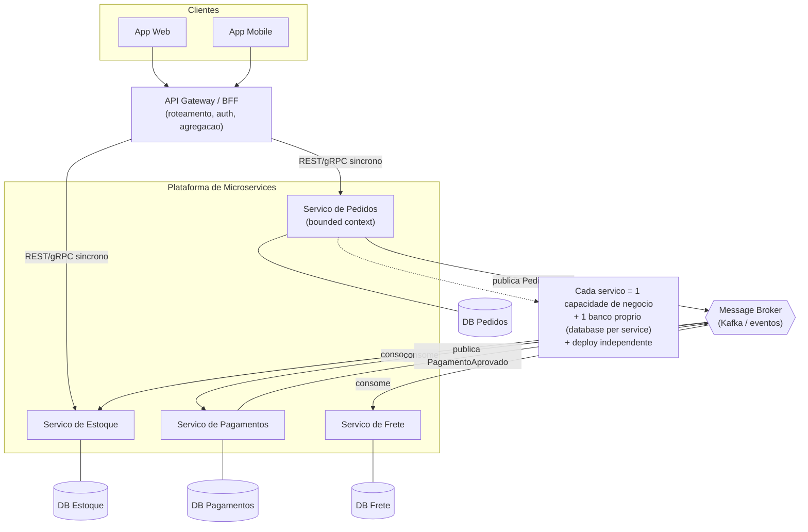

# Microservices

> **Bloco:** Estilos e padrões arquiteturais · **Nível:** Intermediário/Avançado · **Tempo de leitura:** ~28 min

## TL;DR

Microservices é um estilo arquitetural distribuído no qual a aplicação é estruturada como um conjunto de **serviços pequenos, independentemente deployáveis**, organizados em torno de **capacidades de negócio (business capabilities)** e operados por times autônomos. Cada serviço tem seu próprio ciclo de vida, seu próprio runtime e — crucialmente — **seu próprio banco de dados** (padrão *database per service*). A promessa central não é "performance" nem "ser cloud-native"; é **desacoplamento de deploy e organizacional**: permitir que dezenas de times entreguem em ritmos independentes sem coordenação cara.

O ganho vem com um custo brutal: você troca complexidade *interna* (de código) por complexidade *operacional e de dados distribuídos* (consistência eventual, latência de rede, falhas parciais, observabilidade distribuída, sagas no lugar de transações ACID). O anti-padrão dominante é o **distributed monolith** — você pagou todo o custo de distribuição mas não comprou nenhuma das vantagens, porque os serviços continuam acoplados em deploy, em dados ou em runtime.

Regra de arquiteto: microservices é uma resposta a um problema **organizacional e de escala de entrega**, não um default técnico. Se você não tem o problema, não compre a solução.

## O problema que resolve

O termo "microservice" cristalizou-se por volta de **2011–2012** (um workshop de arquitetos em maio de 2011 perto de Veneza adotou o nome) e foi formalizado para o grande público no artigo seminal de **James Lewis e Martin Fowler, "Microservices" (março de 2014)**. Sam Newman publicou *Building Microservices* (O'Reilly, 1ª ed. 2015, 2ª ed. 2021) e Chris Richardson consolidou o vocabulário de padrões em *Microservices Patterns* (Manning, 2018) e no site microservices.io.

O problema concreto era a **escala da organização de engenharia**, não apenas do tráfego. Um monolito grande (a "big ball of mud" deployável) sofre de:

- **Acoplamento de deploy:** qualquer mudança, mesmo trivial, exige rebuild e redeploy de toda a aplicação. Centenas de engenheiros disputam a mesma pipeline e a mesma janela de release. O lead time de mudança cresce de forma superlinear com o número de times.
- **Acoplamento de tecnologia:** todo o sistema vive na mesma stack, mesma versão de runtime, mesmo modelo de concorrência. Adotar uma linguagem ou banco novo exige migrar tudo.
- **Escala acoplada:** se só o módulo de busca precisa de mais CPU, você é forçado a escalar a aplicação inteira (mesma unidade de deploy = mesma unidade de escala).
- **Raio de falha amplo:** um memory leak ou um loop infinito em um módulo periférico derruba o processo inteiro, inclusive o checkout.

Os casos canônicos ilustram bem essa motivação organizacional:

- **Netflix:** em 2008 uma falha de banco no datacenter monolítico causou dias de indisponibilidade. Isso motivou a migração para AWS e a decomposição em microservices a partir de 2009 — hoje mais de mil serviços, com infraestrutura própria que virou referência (Zuul, Eureka, Hystrix, Conductor).
- **Amazon:** fez a transição da loja monolítica para serviços por volta de 2001–2002. A decisão veio acompanhada da famosa regra organizacional dos *two-pizza teams* e do mandato de comunicação exclusivamente via APIs entre times.
- **Uber:** documentou sua evolução para ~2.200 serviços e a posterior consolidação em **DOMA (Domain-Oriented Microservice Architecture)** para domar a complexidade que a proliferação de serviços trouxe.

A observação-chave que conecta tudo isso é a **Lei de Conway**: a estrutura técnica do sistema tende a refletir a estrutura de comunicação da organização que o constrói.

Microservices é, no fundo, uma manobra de **Conway reverso (Inverse Conway Maneuver)** — você desenha deliberadamente as fronteiras dos serviços para que correspondam às fronteiras dos times, comprando autonomia de entrega. Se a sua organização não tem múltiplos times que precisam dessa autonomia, o argumento central de microservices simplesmente não se aplica a você.

## O que é (definição aprofundada)

Microservices é um estilo arquitetural que estrutura uma aplicação como um conjunto de serviços com as seguintes propriedades, destiladas do artigo de Lewis/Fowler e dos padrões de Richardson:

- **Componentização via serviços, não via bibliotecas.** A unidade de modularidade é um serviço que roda em seu próprio processo e se comunica por mecanismos *out-of-process* (HTTP/gRPC, mensageria). Isso força fronteiras explícitas — você não pode "alcançar" o estado interno de outro serviço chamando uma função.
- **Organizado em torno de business capabilities.** O serviço encapsula uma capacidade de negócio coesa (Catálogo, Pagamentos, Estoque, Frete), não uma camada técnica (não existe "serviço de DAO" nem "serviço de UI"). Isso deriva diretamente do **Domain-Driven Design**: idealmente cada serviço corresponde a um ou poucos **bounded contexts**.
- **Independentemente deployável.** Esta é a propriedade definidora. Sam Newman é enfático: se você não consegue fazer deploy de um serviço **sem coordenar** o deploy de outro, você não tem microservices — tem um distributed monolith. Deployabilidade independente exige **contratos versionados** e **backward compatibility**.
- **Descentralização de dados (*database per service*).** Cada serviço é dono exclusivo do seu schema/banco. Nenhum outro serviço acessa essa base diretamente; o acesso é sempre via API do dono. Isso elimina o acoplamento por banco compartilhado — o pior dos acoplamentos invisíveis — mas implica abandonar transações ACID distribuídas em favor de **consistência eventual** e **sagas**.
- **Descentralização de governança e tecnologia.** Cada time escolhe a stack que melhor resolve seu problema (poliglotismo de linguagem e de persistência). A governança vira "guidelines, não gates".
- **Produtos, não projetos; "you build it, you run it".** O time é dono do serviço em produção, incluindo on-call. Isso fecha o loop de feedback de qualidade operacional.
- **Design for failure.** Como a rede é não confiável, cada chamada remota pode falhar, ter timeout ou degradar. O serviço precisa ser projetado com **timeouts, retries com backoff, circuit breakers, bulkheads e fallbacks**.
- **Inteligência nos endpoints, dumb pipes.** Diferentemente de SOA com ESB, a lógica de roteamento e orquestração não vive em um barramento central inteligente; vive nos serviços. O transporte (HTTP, broker de mensagens) é "burro".

### Granularidade: a decisão mais difícil

**Granularidade** é a decisão de design mais difícil de microservices e a mais frequentemente mal-feita. "Micro" não é uma medida de linhas de código nem um número mágico de endpoints. A pergunta não é "quão pequeno?", mas "onde está a fronteira correta?".

A heurística sólida é que a fronteira correta de um serviço é aquela que:

- **(a)** corresponde a um **bounded context** coeso do domínio (DDD);
- **(b)** tem **alta coesão funcional interna** e **baixo acoplamento externo** — tudo que muda junto fica junto, tudo que muda por razões diferentes fica separado;
- **(c)** muda por **uma única razão de negócio** — é o **Single Responsibility Principle** aplicado em escala de serviço;
- **(d)** pode ser **deployado independentemente** sem coordenar com outros serviços;
- **(e)** pertence a **um único time** (alinhamento com a Lei de Conway).

Os dois extremos são patológicos. Granularidade **fina demais** ("nanoservices") explode o custo de comunicação (cada caso de uso vira uma cascata de chamadas remotas), o custo operacional (mais runtimes, mais deploys) e o acoplamento de fato (serviços que só funcionam juntos). Granularidade **grossa demais** recria o monolito dentro de um único serviço, perdendo a autonomia.

Na dúvida, **comece mais grosso**: é muito mais barato dividir um serviço grande depois (quando as fronteiras ficaram claras) do que juntar dois serviços que foram separados cedo demais.

## Como funciona

Os componentes operacionais típicos de uma plataforma de microservices:

- **API Gateway / BFF (Backend for Frontend):** ponto único de entrada para os clientes. Faz roteamento, agregação de respostas (composition), autenticação de borda, rate limiting, terminação TLS. Evita que o cliente conheça a topologia interna. Na Netflix esse papel histórico foi do **Zuul**. Um BFF é um gateway especializado por tipo de cliente (mobile, web, parceiro).
- **Service Discovery:** como os serviços têm instâncias efêmeras e endereços dinâmicos, é preciso um registro. **Eureka** (Netflix) é o exemplo clássico de *client-side discovery*; em Kubernetes o discovery é *server-side* via DNS interno e Services.
- **Comunicação:**
  - **Síncrona** (request/response): REST/HTTP ou **gRPC**. Simples, mas cria acoplamento temporal — o chamador fica bloqueado e a falha do callee se propaga.
  - **Assíncrona** (event/message): via broker (Kafka, RabbitMQ, SQS/SNS). Desacopla temporalmente, melhora resiliência e habilita o estilo event-driven. É a forma preferida para integração entre bounded contexts.
- **Gestão de dados distribuída:**
  - **Saga:** sequência de transações locais coordenadas por eventos (choreography) ou por um orquestrador. Cada passo tem uma **transação compensatória** para desfazer logicamente em caso de falha. Substitui o 2PC distribuído.
  - **Outbox / Transactional Outbox + CDC:** garante atomicidade entre "gravar no meu banco" e "publicar o evento", evitando dual-write. O evento é gravado na mesma transação local em uma tabela `outbox` e depois relayed para o broker (frequentemente via Change Data Capture, ex.: Debezium).
  - **CQRS:** separa o modelo de escrita do de leitura; útil para montar *read models* que agregam dados de vários serviços sem acoplar bancos.
  - **API Composition:** para queries que cruzam serviços, o gateway/serviço de composição consulta cada dono e junta — alternativa simples ao CQRS quando a query não é crítica em performance.
- **Resiliência:** circuit breaker (Hystrix historicamente, hoje Resilience4j / sidecars de service mesh), retries idempotentes, timeouts agressivos, bulkheads para isolar pools de recursos.
- **Observabilidade distribuída:** uma requisição atravessa N serviços, então logs locais não bastam. É obrigatório **distributed tracing** (OpenTelemetry/Jaeger/Zipkin) com *correlation id* propagado, métricas (RED: Rate, Errors, Duration) e logs estruturados centralizados.
- **Plataforma de deploy:** containers (Docker) + orquestração (Kubernetes, ou Titus na Netflix), CI/CD por serviço, e frequentemente um **service mesh** (Istio/Linkerd) que move retries, mTLS e tracing para sidecars, tirando essa responsabilidade do código de aplicação.

Fluxo típico de uma operação cross-service (ex.: criar pedido):

1. O gateway autentica e roteia a requisição para o serviço de Pedidos.
2. O serviço de Pedidos grava o pedido em estado `PENDENTE` (transação local no seu próprio banco) e publica `PedidoCriado`.
3. Os serviços de Estoque, Pagamento e Frete reagem ao evento, executam suas transações locais e publicam seus próprios eventos.
4. Uma saga (coreografada ou orquestrada) conduz o pedido a `CONFIRMADO` ou dispara compensações em caso de falha.

Repare que em **nenhum momento** existe uma transação distribuída abrangendo os quatro serviços. A atomicidade local de cada passo, somada às compensações, é o que substitui o ACID global — essa é a essência do trade-off de dados de microservices.

## Diagrama de fluxo



O diagrama mostra os dois eixos da decomposição: **comunicação síncrona** de borda (cliente → gateway → serviço) e **comunicação assíncrona** entre serviços via broker, com cada serviço estritamente dono do seu banco.

## Exemplo prático / caso real

**Cenário:** um marketplace brasileiro de moda (pense em algo como Dafiti ou um lojista de grande porte numa plataforma como a Nuvemshop) cujo monolito Rails/Java começou como uma única aplicação. Com o crescimento, o time de Catálogo, o de Checkout e o de Logística passaram a se atropelar: um deploy do time de Catálogo travava o release de uma correção urgente no Checkout em plena Black Friday.

**Decomposição por capacidade de negócio:** identificam-se os bounded contexts: `Catálogo`, `Carrinho`, `Pedidos`, `Pagamentos`, `Estoque`, `Frete/Logística`, `Identidade`. Cada um vira um serviço com banco próprio. O `Catálogo` (alto volume de leitura, picos sazonais) passa a escalar independentemente e até troca de Postgres para uma stack com cache + Elasticsearch, sem impactar `Pagamentos`.

**Fluxo de checkout com saga coreografada (pseudocódigo leve):**

```text
# Servico de Pedidos
def criar_pedido(carrinho):
    pedido = salvar(estado="PENDENTE")        # transacao local
    publicar("PedidoCriado", pedido)          # via outbox
    return pedido

# Servico de Estoque (consumidor)
on "PedidoCriado":
    if reservar(itens):
        publicar("EstoqueReservado", pedido_id)
    else:
        publicar("EstoqueIndisponivel", pedido_id)   # dispara compensacao

# Servico de Pagamentos (consumidor)
on "EstoqueReservado":
    if cobrar(pedido):
        publicar("PagamentoAprovado", pedido_id)
    else:
        publicar("PagamentoRecusado", pedido_id)      # compensacao -> liberar estoque

# Servico de Pedidos (consumidor)
on "PagamentoAprovado": atualizar(pedido_id, "CONFIRMADO")
on "EstoqueIndisponivel" | "PagamentoRecusado": atualizar(pedido_id, "CANCELADO")
```

Note que **não há transação distribuída**: a consistência é eventual e cada falha tem uma compensação. O `pedido` fica temporariamente `PENDENTE` — o cliente vê "processando pagamento". Isso é um trade-off de UX deliberado.

**Adotantes reais:** Netflix (Zuul, Eureka, Hystrix, Conductor; mais de 1.000 serviços), Amazon (two-pizza teams; serviços desde ~2002), Uber (~2.200 serviços, depois DOMA), Spotify (modelo de squads/tribes alinhado a Conway), Nubank (núcleo de microservices em Clojure/Scala sobre Kafka). Em e-commerce, eBay e Zalando são casos públicos de migração de monolito para serviços.

## Quando usar / Quando evitar

**Quando usar:**

- A organização tem **múltiplos times** que precisam entregar de forma independente e a coordenação de deploy virou o gargalo dominante.
- Há **necessidade real de escala diferenciada**: partes do sistema com perfis de carga muito distintos (catálogo lê muito, pagamento é crítico e de baixo volume).
- Os **bounded contexts são claros e estáveis** — você entende o domínio o suficiente para desenhar fronteiras corretas (idealmente o monolito já te ensinou onde elas estão).
- Existe **maturidade operacional**: CI/CD, containers/orquestração, observabilidade distribuída, cultura de on-call. Sem isso, microservices é um amplificador de dor.
- Requisitos de **resiliência por isolamento de falha** (raio de explosão pequeno) são de primeira ordem.

**Quando evitar:**

- **Startup / produto novo com domínio incerto.** As fronteiras vão mudar muito; refatorar fronteiras *entre serviços* é ordens de magnitude mais caro do que dentro de um monolito. A recomendação consolidada (Fowler, Newman) é **"monolith first"** ou *modular monolith* — comece monolítico e bem modularizado, extraia serviços quando a dor justificar.
- **Time pequeno** (um ou dois times). O custo de coordenação que microservices resolve simplesmente não existe; você só adiciona overhead operacional.
- **Baixa maturidade de plataforma/DevOps.** Sem automação de deploy, tracing e gestão de configuração, a operação de N serviços é inviável.
- **Domínio fortemente transacional com consistência forte obrigatória** (ex.: certos núcleos contábeis/financeiros) onde sagas e consistência eventual introduzem complexidade e risco inaceitáveis.

**Trade-offs explícitos.** Você ganha *deployability* independente, *fault isolation*, escala granular, autonomia de time e poliglotismo.

Você paga com *complexidade operacional*, *consistência de dados distribuída* (sem ACID cross-service), *latência e falha de rede*, *debugging distribuído*, *custo de infraestrutura* (mais runtimes, mais rede) e *complexidade cognitiva* de raciocinar sobre um sistema emergente.

Em *Fundamentals of Software Architecture*, Richards/Ford pontuam microservices **baixo em simplicidade e custo**, e **altíssimo em escalabilidade, elasticidade, deployability e fault tolerance**. É uma troca consciente: você compra propriedades de runtime e de organização ao preço de complexidade de operação e de dados.

| Eixo | Monolito (modular) | Microservices |
| --- | --- | --- |
| Unidade de deploy | A aplicação inteira | Cada serviço, independentemente |
| Unidade de escala | A aplicação inteira | Cada serviço, granularmente |
| Dados | Banco compartilhado, transações ACID | Banco por serviço, consistência eventual / saga |
| Comunicação interna | Chamada de função (in-process) | Rede (REST/gRPC/eventos) |
| Raio de falha | Processo inteiro | Isolado por serviço |
| Custo operacional | Baixo | Alto (orquestração, observabilidade, mesh) |
| Acoplamento organizacional | Times disputam a mesma base | Times autônomos por serviço |
| Quando faz sentido | Time único, domínio incerto, início | Muitos times, escala de entrega, domínio maduro |

## Anti-padrões e armadilhas comuns

### Acoplamento (recriando o monolito)

- **Distributed Monolith (o anti-padrão soberano).** Você quebrou em serviços, mas eles continuam acoplados: ou compartilham banco, ou precisam ser deployados juntos (mudança em A exige mudança e deploy simultâneo em B), ou se chamam sincronicamente em cadeias longas que falham juntas. Resultado: toda a complexidade da distribuição **mais** toda a rigidez do monolito, e nenhum benefício. Sintomas clássicos: "release train" coordenado, schema de banco compartilhado, contratos quebrados a cada release. Sam Newman é direto: sem *strong code ownership* e contratos versionados, uma arquitetura de microservices **degenera** em distributed monolith.
- **Banco de dados compartilhado.** Dois serviços lendo/escrevendo a mesma tabela. É o acoplamento mais perverso porque é invisível no diagrama de serviços. Mata a deployability independente (mudar o schema quebra ambos) e a propriedade de dados.
- **Comunicação síncrona em cadeia (chatty + acoplamento temporal).** A → B → C → D síncrono: latências somam, e a indisponibilidade de D derruba a cadeia inteira. Sem circuit breaker, vira **falha em cascata**. Prefira assíncrono entre contextos.

### Granularidade

- **Entity services / decomposição por substantivo técnico.** Criar "serviço de Usuário", "serviço de Produto" como CRUDs anêmicos, em vez de capacidades de negócio. Gera serviços que não fazem nada sozinhos e exigem chatty calls para qualquer operação útil.
- **Nanoservices / granularidade excessiva.** Serviços tão pequenos que o custo de comunicação e operação supera qualquer ganho de coesão. Cada caso de uso vira uma cascata de 8 chamadas remotas.

### Dados e consistência

- **Saga sem compensação / sem idempotência.** Consumidores que não tratam mensagens duplicadas (brokers entregam *at-least-once*) corrompem estado. Toda operação de consumidor deve ser idempotente.
- **Dual write.** Gravar no banco e publicar no broker em duas operações não-atômicas. Se uma falha, estado e eventos divergem silenciosamente. Resolva com **Transactional Outbox**.

### Operação e evolução

- **Ausência de observabilidade distribuída.** Sem tracing correlacionado, diagnosticar um problema que cruza 10 serviços é arqueologia. Não é opcional — é pré-requisito.
- **Versionamento de contrato negligenciado.** Mudar um contrato de forma breaking e deployar sem coordenação quebra consumidores. Exige *consumer-driven contracts*, versionamento e tolerância (lei de Postel).
- **Reescrita "big bang" do monolito.** Tentar substituir tudo de uma vez é o caminho mais comum para o fracasso. Use o padrão **Strangler Fig** (Fowler): estrangule o monolito incrementalmente, extraindo capacidades uma a uma e roteando o tráfego gradualmente.

## Relação com outros conceitos

- **SOA (Service-Oriented Architecture):** microservices é frequentemente descrito como "SOA feito certo" ou uma especialização do estilo de serviços. A diferença prática: SOA enterprise tipicamente usa um **ESB inteligente** (smart pipes) e tende a banco compartilhado; microservices usa **dumb pipes** e *database per service*, com governança e dados descentralizados. Ver o arquivo de SOA neste bloco.
- **Domain-Driven Design (DDD):** é a ferramenta para encontrar fronteiras de serviço. **Bounded context ≈ candidato a serviço**; *context mapping* informa as integrações. Sem DDD (ou pelo menos análise de capacidades de negócio), a decomposição vira chute.
- **Event-Driven Architecture (EDA):** EDA é o estilo de comunicação que melhor desacopla microservices. Sagas coreografadas, outbox, CDC e CQRS são todos manifestações de microservices + EDA. Ver `09-event-driven-architecture-eda.md`.
- **Mensageria:** Kafka/RabbitMQ/SQS são a espinha dorsal da comunicação assíncrona. Garantias de entrega (at-least-once), ordenação e idempotência são tópicos centrais.
- **Lei de Conway / Team Topologies:** as fronteiras dos serviços devem espelhar (ou moldar, via "Inverse Conway Maneuver") as fronteiras dos times. *Stream-aligned teams* são donos de serviços; *platform teams* provêm a plataforma de runtime.
- **Modular Monolith:** a alternativa pragmática e ponto de partida recomendado. Mesma disciplina de fronteiras (módulos = bounded contexts) sem o custo de distribuição. Extrai-se serviços a partir dele quando necessário.
- **Service Mesh & Kubernetes:** a infraestrutura que torna a operação de microservices em escala viável (discovery, mTLS, retries, tracing como capacidade de plataforma).

## Referências

- [Microservices — James Lewis & Martin Fowler (martinfowler.com)](https://martinfowler.com/articles/microservices.html) — artigo seminal de 2014 que definiu as 9 características do estilo.
- [Microservices Guide — Martin Fowler](https://martinfowler.com/microservices/) — coletânea curada de artigos sobre o tema, incluindo MonolithFirst.
- [Pattern: Microservice Architecture — microservices.io (Chris Richardson)](https://microservices.io/patterns/microservices.html) — definição do padrão e linguagem de padrões associada.
- [Pattern: Decompose by business capability — microservices.io](https://microservices.io/patterns/decomposition/decompose-by-business-capability.html) — padrão de decomposição por capacidade de negócio.
- [Pattern: Decompose by subdomain — microservices.io](https://microservices.io/patterns/decomposition/decompose-by-subdomain.html) — decomposição guiada por DDD/bounded contexts.
- [Pattern: Database per service — microservices.io](https://microservices.io/patterns/data/database-per-service.html) — propriedade descentralizada de dados.
- [Pattern: Saga — microservices.io](https://microservices.io/patterns/data/saga.html) — gestão de consistência distribuída sem 2PC.
- [Monolith to Microservices — Sam Newman](https://samnewman.io/books/monolith-to-microservices/) — padrões evolutivos e discussão do distributed monolith.
- [Introducing Domain-Oriented Microservice Architecture — Uber Engineering Blog](https://www.uber.com/us/en/blog/microservice-architecture/) — DOMA, a consolidação da Uber após ~2.200 serviços.
- [Principles for Microservice Design: Think IDEALS — InfoQ](https://www.infoq.com/articles/microservices-design-ideals/) — princípios de design (IDEALS) específicos para serviços distribuídos.
- [Microservices Patterns — Chris Richardson (Manning)](https://www.manning.com/books/microservices-patterns) — livro de referência sobre os padrões.
