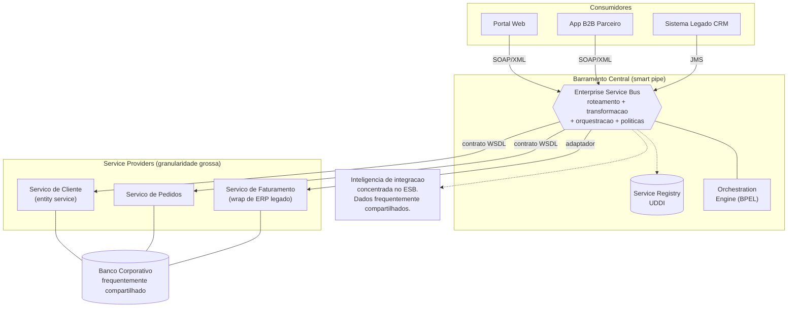

# Service-Oriented Architecture (SOA)

> **Bloco:** Estilos e padrões arquiteturais · **Nível:** Intermediário/Avançado · **Tempo de leitura:** ~24 min

## TL;DR

SOA é um estilo arquitetural corporativo (dominante nos anos 2000) que estrutura sistemas como uma coleção de **serviços de negócio reutilizáveis, com contratos formais e baixo acoplamento**, integrados tipicamente por um **Enterprise Service Bus (ESB)** que centraliza roteamento, transformação de mensagens e orquestração. O foco de SOA é **reuso e integração de sistemas heterogêneos no nível da empresa** (consolidar silos, expor capacidades legadas como serviços), não autonomia de deploy de times.

A diferença prática para microservices se resume a três eixos: **SOA centraliza inteligência no barramento (smart pipes)** enquanto microservices usa *dumb pipes*; **SOA tende a compartilhar dados e modelos canônicos** enquanto microservices isola dados (*database per service*); e **SOA otimiza para reuso/integração corporativa** enquanto microservices otimiza para *deployability* independente e velocidade de entrega de times autônomos. Microservices é frequentemente chamado de "SOA feito certo" — herda os princípios de serviço, descarta o ESB monolítico e a governança pesada.

Regra de arquiteto: se alguém propõe "SOA com ESB" hoje em greenfield, questione. O legado de SOA permanece valioso conceitualmente (contratos, loose coupling, composição), mas o ESB como hub central virou anti-padrão na maioria dos contextos modernos.

## O problema que resolve

SOA emergiu no fim dos anos 1990 e dominou a primeira metade dos anos 2000, num contexto corporativo muito específico: grandes empresas com **dezenas de sistemas legados heterogêneos** (mainframe COBOL, ERPs, aplicações cliente-servidor) que precisavam se integrar. O problema central era **integração ponto-a-ponto explosiva**: com N sistemas, integrá-los todos dois a dois gera O(N²) conexões frágeis e proprietárias — a "spaghetti integration".

**Thomas Erl** formalizou o cânone com *Service-Oriented Architecture: Concepts, Technology, and Design* (Prentice Hall, 2005), definindo os princípios de orientação a serviço. **IBM, Microsoft, Oracle, SAP** e o consórcio **OASIS** empurraram a stack de padrões WS-* (SOAP, WSDL, UDDI, WS-Security, BPEL). O objetivo declarado era **alinhar TI ao negócio** expondo capacidades como serviços reutilizáveis e governados, reduzindo a integração de O(N²) para O(N) ao plugar tudo num barramento comum.

A promessa de marketing era ambiciosa — "agilidade do negócio via reuso de serviços". Na prática, muitas iniciativas SOA naufragaram em governança pesada, ESBs que viraram monolitos centrais e gargalos, e *canonical data models* que ninguém conseguia evoluir. Esse fracasso parcial é justamente o pano de fundo contra o qual microservices se definiu por volta de 2014.

## O que é (definição aprofundada)

SOA, segundo a definição consolidada (IBM/Erl): uma coleção de serviços que se comunicam entre si, passando dados ou coordenando uma atividade, expostos por **interfaces de serviço (service contracts)** baseadas em padrões comuns, de modo que possam ser **reutilizados e recombinados** em novas aplicações.

Os princípios de orientação a serviço (Erl) — termos-chave:

- **Service Contract (contrato de serviço):** serviços expõem um contrato formal e padronizado (historicamente **WSDL** descrevendo operações e tipos), independente de implementação.
- **Loose Coupling (baixo acoplamento):** serviços minimizam dependências e conhecem-se apenas pelo contrato.
- **Abstraction:** o serviço esconde sua lógica e tecnologia internas atrás do contrato.
- **Reusability (reusabilidade):** o serviço é projetado para ser reutilizado por múltiplos consumidores — este é o valor central de SOA, mais até que autonomia.
- **Autonomy:** o serviço controla a lógica que encapsula (autonomia *lógica*, não necessariamente de deploy).
- **Statelessness:** preferência por não reter estado entre invocações, delegando-o quando possível.
- **Discoverability:** serviços são descritos e registrados (historicamente **UDDI**) para serem descobertos.
- **Composability:** serviços podem ser compostos em serviços de maior granularidade e em processos de negócio (orquestração via **BPEL**).

**Tipos/granularidades de serviço** comuns em SOA enterprise: *task services* (lógica de um processo específico, baixo reuso), *entity services* (centrados em entidades de negócio como Cliente, Produto — alto reuso), e *utility/infrastructure services* (logging, notificação — agnósticos de negócio). A granularidade tende a ser **mais grossa** que em microservices: um serviço SOA pode encapsular um subsistema inteiro.

**Enterprise Service Bus (ESB):** o componente que define o sabor "clássico" de SOA. É um middleware de integração que provê: roteamento baseado em conteúdo, **transformação/mediação de mensagens** (ex.: traduzir um formato XML de um sistema para outro), adaptadores de protocolo (JMS, HTTP, FTP, conectores de ERP), orquestração de processos e, frequentemente, segurança e monitoramento. A ideia é "smart pipes": a inteligência de integração vive no barramento, não nos endpoints. É exatamente esse ponto que microservices inverte.

Note: SOA *pode* existir sem ESB (REST/microservices são tecnicamente "SOA"). Mas o estereótipo histórico — e o que se contrasta com microservices — é SOA-com-ESB, WS-*, governança centralizada e modelo canônico de dados.

## Como funciona

Topologia típica de SOA enterprise:

- **Service Providers** expõem capacidades via contrato (WSDL/SOAP, ou REST em SOA mais moderno).
- **Service Consumers** invocam serviços. Não conhecem a implementação, apenas o contrato.
- **Service Registry (UDDI):** catálogo onde serviços são publicados e descobertos. Promove reuso e descoberta dinâmica (na prática, o registro dinâmico raramente foi usado; o registro virou mais documentação/governança).
- **ESB:** intermediário central por onde passam as mensagens. Faz roteamento, mediação/transformação, e orquestração. Aplica políticas (segurança, throttling, logging) de forma centralizada.
- **Orchestration Engine (BPEL):** motor que executa processos de negócio de longa duração compondo múltiplos serviços segundo um fluxo definido (uma forma de orquestração explícita).
- **Canonical Data Model (CDM):** um esquema de dados comum para o qual o ESB traduz as mensagens, evitando que cada par de sistemas precise conhecer o formato do outro. Na teoria reduz acoplamento; na prática vira um artefato gigante, difícil de evoluir e que todos passam a depender.

Fluxo de uma operação: o consumidor envia uma mensagem (SOAP/XML) ao ESB → o ESB autentica, aplica políticas, transforma do formato do consumidor para o CDM, roteia ao provider correto, possivelmente orquestra uma sequência de chamadas a vários providers (BPEL), agrega a resposta, transforma de volta e devolve. A inteligência do fluxo está concentrada no barramento.

**Governança** é parte integral e pesada de SOA: um *SOA Center of Excellence* tipicamente define padrões de contrato, versionamento, políticas de segurança, e aprova novos serviços. Essa governança centralizada — útil para consistência corporativa — é também a principal fonte de lentidão, e o que microservices descentraliza deliberadamente.

## Diagrama de fluxo



Compare mentalmente com o diagrama de microservices (arquivo 07): lá o broker é *dumb* e cada serviço tem banco próprio; aqui o ESB é *smart* e o banco tende a ser compartilhado.

## Exemplo prático / caso real

**Cenário:** um banco de varejo brasileiro de grande porte, anos 2008–2012, com sistemas em silos: core bancário em mainframe, CRM, sistema de cartões, internet banking, e um novo app mobile. Cada novo canal precisava integrar com vários backends, e as integrações ponto-a-ponto estavam virando um inferno de manutenção.

**Solução SOA:** o banco implanta um ESB (ex.: IBM WebSphere ESB ou Oracle Service Bus). Cada backend é "embrulhado" e exposto como serviço de negócio: `ConsultarSaldo`, `TransferirFundos`, `ConsultarLimiteCartao`. O internet banking e o app mobile passam a consumir esses serviços via o ESB, sem conhecer o mainframe por baixo. Um processo de "abertura de conta" é orquestrado via BPEL, encadeando `ValidarCPF` → `ConsultarBureau` → `CriarConta` → `EmitirCartao`, com compensação se algum passo falhar.

**Pseudocódigo de uma orquestração BPEL (conceitual):**

```text
processo AberturaDeConta:
    receber(dadosCliente)
    invocar ServicoCadastro.validarCPF(dadosCliente)
    invocar ServicoBureau.consultarScore(dadosCliente.cpf)
    se score >= minimo:
        contaId = invocar ServicoCore.criarConta(dadosCliente)   # mainframe via adaptador
        invocar ServicoCartoes.emitirCartao(contaId)
        responder(SUCESSO, contaId)
    senao:
        responder(RECUSADO)
```

**Ganho:** reuso real — o serviço `ConsultarSaldo` é construído uma vez e consumido pelo internet banking, app, URA telefônica e parceiros. **Custo:** o ESB virou um ponto central crítico (e político); evoluir o modelo canônico exigia reuniões de governança; e o time de integração virou gargalo para todos os outros.

**Adotantes/contexto real:** a era de ouro de SOA foi puxada por IBM, Oracle e SAP em grandes corporações (bancos, telecom, governo, varejo de grande porte). Muitas dessas implementações ainda existem em produção. O próprio artigo de Lewis/Fowler sobre microservices dedica uma seção a posicionar microservices em relação a SOA, reconhecendo a herança e marcando as diferenças.

## Quando usar / Quando evitar

**Quando SOA (com ESB) ainda faz sentido:**

- **Integração de muitos sistemas legados heterogêneos** numa grande corporação, onde o problema dominante é mediação de protocolos/formatos e exposição de capacidades legadas. O ESB resolve mediação melhor que código espalhado.
- **Forte necessidade de governança centralizada e padronização corporativa** (setores regulados, onde políticas de segurança e auditoria precisam ser aplicadas uniformemente).
- **Reuso de serviços de granularidade grossa** entre muitos canais é o objetivo de negócio primário.
- Você já tem o investimento em uma plataforma de integração e o ROI de migrar não se justifica.

**Quando evitar / preferir microservices:**

- **Greenfield orientado a velocidade de entrega de times autônomos.** Para isso, microservices entrega *deployability* independente que SOA-com-ESB não dá (o ESB e o CDM reacoplam tudo).
- Quando o ESB se tornaria um **gargalo de performance e organizacional** — um único componente central por onde tudo passa e que um único time governa.
- Quando você quer **propriedade descentralizada de dados** e poliglotismo — SOA enterprise tende ao banco e ao modelo canônico compartilhados.
- Quando a sobrecarga da stack WS-* (SOAP/WSDL/BPEL) não se justifica frente a REST/gRPC/eventos mais leves.

**Trade-offs explícitos.** SOA entrega *reuso*, *integração de heterogêneos* e *governança consistente*.

Paga com *acoplamento ao barramento central*, *gargalo no ESB*, *governança lenta*, e *deployment não-independente* — o reuso intenso reacopla os serviços e o CDM acopla todos os schemas.

Em essência, SOA otimiza para **reuso e integração**; microservices, ao recusar o ESB e não compartilhar nada, otimiza para **autonomia e velocidade** — e aceita pagar com duplicação e consistência eventual.

### SOA vs Microservices: quadro comparativo

| Eixo | SOA (clássico, com ESB) | Microservices |
| --- | --- | --- |
| Comunicação / "pipes" | ESB inteligente (*smart pipes*) | Broker/HTTP "burro" (*dumb pipes*) |
| Lógica de roteamento e orquestração | Centralizada no barramento | Distribuída nos endpoints |
| Dados | Banco e modelo canônico compartilhados | Banco por serviço (*database per service*) |
| Governança | Centralizada (CoE, gates) | Descentralizada (guidelines) |
| Objetivo primário | Reuso e integração corporativa | Deployability independente e autonomia |
| Granularidade | Grossa (subsistemas) | Fina (capacidade de negócio / bounded context) |
| Protocolos típicos | SOAP/WSDL/BPEL (WS-*) | REST/gRPC/eventos |
| Acoplamento de deploy | Alto (reuso + CDM reacoplam) | Baixo (contratos versionados) |
| Tecnologia | Padronizada corporativamente | Poliglota por time |

## Anti-padrões e armadilhas comuns

- **ESB como monolito central / "God ESB".** Lógica de negócio migra para dentro do barramento. O ESB cresce, vira crítico, é mantido por um único time e bloqueia todos os demais. Vira um monolito disfarçado de integração — o oposto do "dumb pipes" de microservices.
- **Canonical Data Model gigante e ossificado.** O CDM tenta modelar "o cliente verdadeiro da empresa inteira", vira enorme, e qualquer mudança quebra muitos consumidores. Acopla globalmente o que deveria estar isolado.
- **Banco de dados compartilhado entre serviços.** Comum em SOA, mas é o mesmo acoplamento perverso já discutido em microservices: mata a evolução independente.
- **Governança como gate burocrático.** O "SOA CoE" vira um comitê que aprova cada serviço; a fricção mata a agilidade que SOA prometia entregar.
- **"Reuso" forçado gerando acoplamento.** Reusar um serviço por toda parte cria um nó de dependência: mudá-lo afeta dezenas de consumidores, e ele acumula responsabilidades conflitantes. Reuso e autonomia estão em tensão — SOA escolheu reuso, microservices escolhe autonomia.
- **Confundir "ter SOAP/WSDL" com fazer SOA.** SOA é sobre princípios de design (contrato, loose coupling, composição), não sobre a stack WS-*. Expor um CRUD anêmico em SOAP não é orientação a serviço.
- **Chamar microservices de "SOA porque tem serviços".** Embora microservices seja tecnicamente um tipo de arquitetura orientada a serviços, equiparar os dois ignora as diferenças deliberadas (dumb pipes, dados isolados, governança descentralizada) e leva a recriar o ESB sob outro nome.

## Relação com outros conceitos

- **Microservices:** a relação central deste arquivo. Microservices descende de SOA e compartilha os princípios de serviço (contrato, loose coupling, composição), mas inverte três decisões: pipes *dumb* em vez de ESB *smart*; dados/governança *descentralizados* em vez de centralizados; otimização para *deployability/autonomia* em vez de *reuso*. Sam Newman e Fowler tratam microservices como "uma forma específica e disciplinada de SOA". Ver `07-microservices.md`.
- **Enterprise Integration Patterns (Hohpe/Woolf):** o vocabulário de mediação, roteamento e transformação que o ESB implementa vem dos EIP. Padrões como *Message Router*, *Message Translator*, *Content-Based Router* e **Pipes and Filters** são o tecido conceitual do ESB. Ver `11-pipes-and-filters.md`.
- **Event-Driven Architecture:** SOA é predominantemente *request/response* síncrono (RPC sobre o ESB), enquanto EDA é assíncrono e orientado a eventos. SOA moderna pode incorporar eventos, mas o estereótipo clássico é comando/consulta síncronos. Ver `09-event-driven-architecture-eda.md`.
- **API Gateway:** funcionalmente, o API Gateway de microservices herda *parte* do papel do ESB (auth de borda, roteamento, agregação), mas deliberadamente **não** carrega lógica de negócio nem orquestração pesada — é mais "fino" que um ESB.
- **Orchestration vs Choreography:** SOA com BPEL é o arquétipo da **orquestração centralizada**. Microservices/EDA frequentemente preferem **coreografia** para evitar o acoplamento ao orquestrador. Ver a discussão em EDA.
- **Domain-Driven Design:** SOA tradicional raramente usava DDD para definir fronteiras (decompunha por sistema/entidade técnica); microservices adota bounded contexts. Essa é uma das razões pelas quais fronteiras SOA tendem a ser grossas e centradas em entidades.

## Referências

- [What is Service-Oriented Architecture (SOA)? — IBM](https://www.ibm.com/think/topics/soa) — definição corporativa de referência de SOA.
- [Service-oriented architecture — IBM Documentation (WebSphere)](https://www.ibm.com/docs/en/was/8.5.5?topic=ws-service-oriented-architecture) — visão de SOA na stack de integração da IBM.
- [Microservices — James Lewis & Martin Fowler (martinfowler.com)](https://martinfowler.com/articles/microservices.html) — inclui a seção que contrasta microservices com SOA.
- [Thomas Erl — Wikipedia](https://en.wikipedia.org/wiki/Thomas_Erl) — autor que formalizou os princípios de orientação a serviço.
- [Service-Oriented Architecture: Concepts, Technology, and Design — Thomas Erl (Google Books)](https://books.google.com/books/about/Service_oriented_Architecture.html?id=GN1QAAAAMAAJ) — obra seminal de SOA (2005).
- [Microservices in a Nutshell — Thoughtworks](https://www.thoughtworks.com/insights/blog/microservices-nutshell) — comparação prática entre microservices e SOA/ESB.
- [Enterprise Integration Patterns — Gregor Hohpe](https://www.enterpriseintegrationpatterns.com/gregor.html) — padrões de integração que sustentam o ESB.
- [Pattern: Microservice Architecture — microservices.io (Chris Richardson)](https://microservices.io/patterns/microservices.html) — para contrastar o estilo de serviço de microservices com SOA.
- [Fundamentals of Software Architecture — O'Reilly (Richards & Ford)](https://www.oreilly.com/library/view/fundamentals-of-software/9781492043447/) — capítulos sobre o estilo orientado a serviços e suas variantes.
