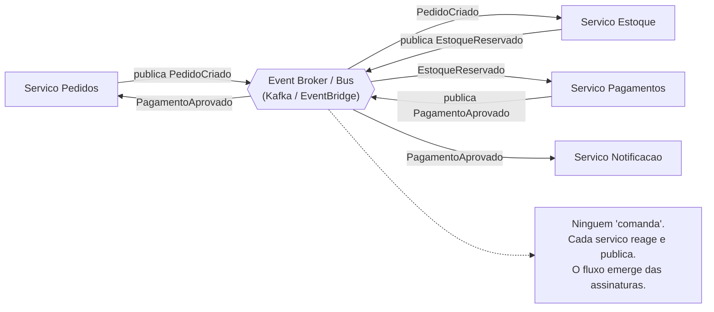
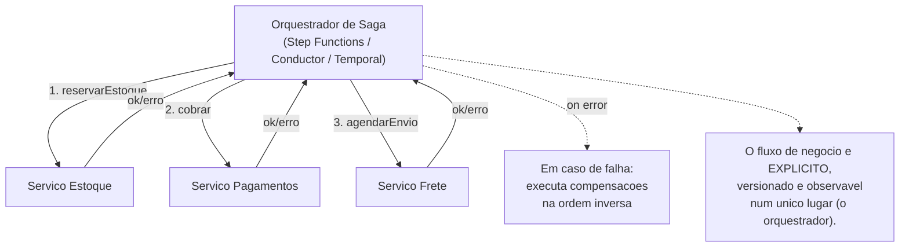

# Event-Driven Architecture (EDA)

> **Bloco:** Estilos e padrões arquiteturais · **Nível:** Intermediário/Avançado · **Tempo de leitura:** ~30 min

## TL;DR

EDA é um estilo arquitetural no qual componentes se comunicam **produzindo e reagindo a eventos** — registros imutáveis de algo que *aconteceu* (`PedidoCriado`, `PagamentoAprovado`) — mediados por um **broker** (event router), em vez de chamarem uns aos outros diretamente. A propriedade definidora é o **desacoplamento temporal e referencial**: o produtor não sabe quem consome, não espera resposta e não precisa que o consumidor esteja disponível agora.

A decisão de design mais importante dentro de EDA é **choreography vs orchestration**:

- **Coreografia (choreography):** não há maestro. Cada serviço reage a eventos e publica os seus; o fluxo emerge das reações encadeadas. Máximo desacoplamento, mas o fluxo de negócio fica *implícito e disperso* — difícil de visualizar e debugar.
- **Orquestração (orchestration):** um **orquestrador** central comanda explicitamente cada passo, invocando serviços e tratando falhas. Fluxo visível e controlável, ao custo de acoplamento ao orquestrador e de um ponto de centralização.

Não é "um ou outro" dogmático: a regra prática (AWS, Newman) é **coreografar entre bounded contexts, orquestrar dentro de um workflow crítico/complexo**. EDA paga o desacoplamento com **consistência eventual, complexidade de debugging, ordenação e entrega de mensagens (at-least-once/idempotência), e dificuldade de raciocinar sobre o fluxo global**.

## O problema que resolve

A comunicação síncrona request/response (REST/RPC) cria **acoplamento temporal**: A chama B e fica bloqueado esperando; se B está lento ou caído, A degrada ou falha junto. Em cadeias (A→B→C→D), latências somam e falhas se propagam em cascata. Além disso, há **acoplamento referencial**: A precisa conhecer B, seu endereço e seu contrato. Quando um novo consumidor precisa reagir a "pedido criado" (ex.: um novo serviço de antifraude), você é obrigado a modificar o produtor para chamá-lo — viola Open/Closed em escala de sistema.

EDA inverte a direção do conhecimento. O produtor apenas **anuncia que algo aconteceu** e segue sua vida. Quem se importa, escuta. Adicionar um consumidor novo não toca o produtor. Isso desacopla times, habilita extensibilidade e melhora resiliência (o broker absorve picos e indisponibilidades temporárias dos consumidores).

A ideia tem raízes antigas (sistemas de mensageria, *pub/sub*, *event notification* dos anos 1990–2000; o livro *Enterprise Integration Patterns* de **Gregor Hohpe e Bobby Woolf, 2003**, codificou o vocabulário). **Martin Fowler** ajudou a desambiguar o termo no influente "What do you mean by 'Event-Driven'?" (2017), distinguindo quatro padrões frequentemente confundidos sob o guarda-chuva "event-driven": *Event Notification*, *Event-Carried State Transfer*, *Event Sourcing* e *CQRS*. O estilo ganhou tração massiva com a popularização do **Apache Kafka** (LinkedIn, ~2011) e dos serviços gerenciados de eventos na nuvem (AWS EventBridge/SNS/SQS/Kinesis, Azure Event Grid/Service Bus, Google Pub/Sub).

## O que é (definição aprofundada)

Os três elementos canônicos de EDA (definição AWS):

- **Event producer (produtor):** detecta uma mudança de estado de negócio e publica um **evento**.
- **Event router/broker (roteador):** recebe, filtra, persiste (durabilidade) e entrega eventos aos consumidores interessados. É o desacoplador.
- **Event consumer (consumidor):** reage ao evento executando lógica própria, podendo por sua vez produzir novos eventos.

Termos-chave:

- **Event (evento):** fato imutável no passado. Nomeado no **past tense** (`OrderPlaced`, não `PlaceOrder`). Carrega um *id*, timestamp, e payload. Não é um comando — não diz "faça X", diz "X aconteceu". Essa distinção semântica (event vs command) é central.
- **Command (comando):** mensagem direcionada que *solicita* uma ação a um destinatário específico, geralmente esperando que ele aja (e às vezes responda). Comandos acoplam; eventos desacoplam.
- **Topic / Stream:** canal lógico onde eventos de um tipo são publicados. Consumidores se inscrevem (subscribe).
- **Pub/Sub vs Filas:** em *publish/subscribe* (tópico), N consumidores independentes recebem cada um sua cópia do evento (fan-out). Em *filas* (queue), uma mensagem é consumida por *um* worker de um grupo (load balancing/competing consumers). Kafka unifica os dois via *consumer groups*.
- **Garantias de entrega:** *at-most-once* (pode perder), *at-least-once* (pode duplicar — o default robusto) e *exactly-once* (caro, frequentemente uma ilusão sem idempotência). Como o normal é *at-least-once*, **idempotência no consumidor é obrigatória**.
- **Ordenação:** brokers garantem ordem apenas dentro de uma partição/chave. Projetar a chave de particionamento (ex.: por `pedido_id`) é o que preserva a ordem onde importa.

Padrões de EDA (taxonomia de Fowler), que mudam o quanto o evento carrega e o que o consumidor precisa fazer:

- **Event Notification:** o evento avisa "algo mudou" com payload mínimo (só um id). O consumidor, se precisar de detalhes, faz um *callback* síncrono ao produtor. Desacopla, mas reintroduz acoplamento na hora de buscar dados.
- **Event-Carried State Transfer (ECST):** o evento carrega *todos os dados* necessários. O consumidor mantém uma réplica local e não precisa chamar o produtor de volta. Máximo desacoplamento e resiliência, ao custo de duplicação de dados e eventos maiores.
- **Event Sourcing:** o estado é derivado de um **log append-only de eventos**, não armazenado como snapshot mutável. O estado atual é a *projeção* (fold) dos eventos. Dá auditoria total, *time travel* e *replay*, mas é complexo (versionamento de eventos, snapshots, *projections*).
- **CQRS (Command Query Responsibility Segregation):** separa o modelo de escrita (commands) do de leitura (queries), frequentemente alimentando *read models* a partir dos eventos. Casa naturalmente com Event Sourcing e EDA.

## Como funciona

O fluxo geral: um produtor executa uma transação local e publica um evento no broker. O broker persiste o evento (durabilidade) e o entrega aos consumidores inscritos, segundo o modelo (fan-out pub/sub ou competing consumers). Cada consumidor processa de forma assíncrona, idempotente, e confirma (ack) o processamento — em caso de falha, o broker reentrega; após N tentativas, a mensagem vai para uma **Dead Letter Queue (DLQ)** para inspeção.

Para que o produtor não sofra de *dual write* (gravar no banco e publicar no broker como duas operações que podem divergir), usa-se o **Transactional Outbox**: o evento é gravado na *mesma* transação local, numa tabela `outbox`, e um relay (frequentemente via **Change Data Capture**, ex.: Debezium) publica do log do banco para o broker, garantindo atomicidade.

**Choreography vs Orchestration — o eixo central:**

Numa **saga coreografada**, não há coordenador. O serviço de Pedidos publica `PedidoCriado`; Estoque escuta, reserva e publica `EstoqueReservado`; Pagamentos escuta isso, cobra e publica `PagamentoAprovado`; Pedidos escuta e confirma. Falhas disparam eventos de compensação (`EstoqueLiberado`). O fluxo de negócio **não existe em lugar nenhum como artefato explícito** — ele emerge das assinaturas. Vantagem: desacoplamento máximo, fácil adicionar consumidores. Desvantagem: difícil entender o fluxo end-to-end, dependências cíclicas escondidas, debugging requer reconstituir a sequência via tracing.

Numa **saga orquestrada**, um **orchestrator** (ex.: AWS Step Functions, Netflix Conductor, Temporal, Camunda) detém a definição do workflow. Ele invoca Estoque, aguarda resultado, invoca Pagamentos, e em caso de falha executa as compensações na ordem certa. O fluxo é **explícito, versionável e observável** num único lugar; a lógica de erro/retry é centralizada. Desvantagem: o orquestrador é um ponto de acoplamento e de centralização (e potencial *smart pipe* se você não tomar cuidado), e os serviços podem virar "anêmicos" (só executam o que o maestro manda).

Heurística consolidada (AWS Prescriptive Guidance, Sam Newman): **dentro de um único bounded context/serviço, prefira coreografia** (você controla as dependências); **ao cruzar fronteiras de serviços num fluxo de negócio complexo e crítico** (onde precisa de visibilidade, SLA e tratamento de erro robusto), **prefira orquestração**. E os dois compõem: um Step Functions pode emitir eventos para o EventBridge integrar com o resto do mundo de forma coreografada.

## Diagrama de fluxo

**Coreografia (choreography)** — fluxo emergente, sem maestro:



**Orquestração (orchestration)** — maestro central comanda:



## Exemplo prático / caso real

**Cenário:** uma fintech brasileira de pagamentos (pense num PSP no estilo Stone/PagSeguro, ou no núcleo de uma conta digital como Nubank) processa transações de cartão. Cada transação aprovada precisa disparar: atualização de saldo, registro contábil, antifraude, programa de cashback, notificação push e relatório regulatório. Fazer isso sincronamente no caminho da transação seria lento e frágil.

**Com EDA (coreografia para os reativos):** o serviço de Transações publica `TransacaoAprovada`. Cada capability escuta de forma independente:

```text
# Servico de Transacoes (produtor)
def aprovar_transacao(tx):
    persistir(tx)                         # transacao local
    publicar("TransacaoAprovada", tx)     # via outbox -> Kafka
    # nao espera por ninguem; responde ao cliente imediatamente

# Consumidores independentes (fan-out), cada um idempotente:
on "TransacaoAprovada":  ServicoSaldo.creditar(tx)          # consumer group 1
on "TransacaoAprovada":  ServicoCashback.acumular(tx)        # consumer group 2
on "TransacaoAprovada":  ServicoNotificacao.enviarPush(tx)   # consumer group 3
on "TransacaoAprovada":  ServicoRegulatorio.registrar(tx)    # consumer group 4
```

Adicionar amanhã um serviço de "insights de gastos" é só inscrever um novo consumer group em `TransacaoAprovada` — **zero mudança no produtor**. Essa extensibilidade é o superpoder de EDA.

**Onde entra orquestração:** o fluxo de *liquidação* (settlement) D+1, que envolve passos sequenciais com compensação e SLA regulatório (debitar adquirente → creditar lojista → emitir comprovante → conciliar), é modelado como uma **saga orquestrada** num motor como Temporal, onde cada passo, retry e compensação é explícito e auditável.

**Adotantes reais:** Netflix usa eventos massivamente e abriu o **Conductor** justamente para orquestração de workflows entre microservices. Uber processa eventos de viagens em larga escala via Kafka. LinkedIn criou o Kafka para EDA em escala de logs. Na nuvem, AWS posiciona EventBridge/SNS/SQS/Step Functions exatamente sobre o eixo coreografia/orquestração.

## Quando usar / Quando evitar

**Quando usar:**

- **Desacoplamento e extensibilidade** são valiosos: vários consumidores reagem ao mesmo fato, e você quer adicionar reatores sem tocar produtores.
- **Picos e cargas assíncronas:** o broker absorve rajadas (buffer), suavizando picos (ex.: Black Friday) e protegendo consumidores lentos.
- **Resiliência por desacoplamento temporal:** um consumidor cair não derruba o produtor; ele processa o backlog ao voltar.
- **Workflows de longa duração / sagas** entre serviços (orquestração) ou reações distribuídas a fatos (coreografia).
- **Auditoria/replay** (Event Sourcing) ou **modelos de leitura otimizados** (CQRS).
- Fundação de **microservices** que precisam integrar sem acoplamento síncrono.

**Quando evitar:**

- **Fluxos que exigem resposta síncrona imediata e forte consistência** (ex.: validar e responder um login, checar saldo *antes* de autorizar) — request/response é mais simples e correto.
- **Sistemas simples / CRUD** onde a complexidade de broker, idempotência, DLQ e tracing não se paga.
- **Times sem maturidade** para lidar com consistência eventual, debugging assíncrono e operação de mensageria — o custo cognitivo é alto.
- Quando a **rastreabilidade ponta-a-ponta** é crítica e você não tem distributed tracing maduro: fluxos coreografados ficam opacos.

**Trade-offs explícitos:** EDA entrega *desacoplamento*, *escalabilidade*, *resiliência* e *extensibilidade*. Paga com *consistência eventual* (não há "agora" global), *complexidade operacional* (broker, DLQ, replay), *debugging difícil* (o fluxo é distribuído no tempo e no espaço), *duplicação de mensagens* (idempotência obrigatória) e *raciocínio mais difícil* sobre o estado global. Coreografia maximiza desacoplamento mas dispersa o fluxo; orquestração recupera visibilidade e controle ao custo de centralização.

## Anti-padrões e armadilhas comuns

- **Eventos que são comandos disfarçados.** Publicar `CobrarCartao` num tópico e ter exatamente um consumidor obrigado a agir é um *command* travestido de evento. Isso recria acoplamento ponto-a-ponto com a complexidade do broker e sem o desacoplamento. Eventos descrevem o passado; comandos pedem ação futura.
- **Coreografia para fluxos complexos (lógica de negócio dispersa).** Quando um workflow de 8 passos vive como reações encadeadas em 8 serviços, ninguém entende o fluxo, dependências cíclicas surgem, e mudar a ordem exige arqueologia distribuída. Para fluxos complexos/críticos, orquestre.
- **Orquestrador com lógica de negócio demais ("God orchestrator").** O maestro acumula regras de negócio e os serviços viram CRUDs anêmicos. O orquestrador deve coordenar *o fluxo*, não *conter* o domínio. Risco de virar um novo ESB.
- **Dual write.** Gravar no banco e publicar no broker em operações separadas; se uma falha, estado e eventos divergem silenciosamente. Resolva com **Transactional Outbox + CDC**.
- **Consumidor não-idempotente.** Como a entrega é *at-least-once*, processar a mesma mensagem duas vezes (ex.: cobrar duas vezes) é catastrófico. Toda operação de consumidor precisa de chave de idempotência/deduplicação.
- **Ignorar ordenação e particionamento.** Assumir ordem global de eventos quando o broker só garante ordem por partição. Eventos de um mesmo agregado precisam ir para a mesma partição (chave = id do agregado).
- **Sem DLQ nem estratégia de poison message.** Uma mensagem que sempre falha trava o consumo ou é reentregue infinitamente. É preciso DLQ + alerta + retry com backoff e limite.
- **Acoplamento por schema de evento.** Mudar o formato do evento de forma breaking quebra todos os consumidores. Use **schema registry**, versionamento e compatibilidade (forward/backward) — eventos são contratos.
- **"Eventos por toda parte" (over-engineering).** Tornar tudo assíncrono quando uma chamada síncrona resolveria, introduzindo consistência eventual onde o negócio exigia consistência forte (ex.: mostrar ao usuário um dado que ainda não propagou). Consistência eventual é uma decisão de produto, não só técnica.

## Relação com outros conceitos

- **Microservices:** EDA é o estilo de comunicação que melhor desacopla microservices entre bounded contexts. Sagas (coreografadas/orquestradas), Outbox, CDC e CQRS são a intersecção microservices ∩ EDA. Ver `07-microservices.md`.
- **Mensageria e Streaming:** EDA é o *estilo arquitetural*; mensageria (Kafka, RabbitMQ, SQS/SNS, Pub/Sub) é a *tecnologia de transporte* que o realiza. Garantias de entrega, ordenação, partições e consumer groups são tópicos do bloco de mensageria. EDA sobre um *log* (Kafka) habilita replay e event sourcing; sobre filas tradicionais, não.
- **SOA / Orquestração via ESB-BPEL:** a orquestração de SOA (BPEL no ESB) é a ancestral da orquestração de sagas; a diferença é que motores modernos (Temporal/Conductor/Step Functions) são descentralizados em relação ao barramento. Ver `08-service-oriented-architecture-soa.md`.
- **CQRS & Event Sourcing:** padrões frequentemente construídos sobre EDA; o log de eventos alimenta read models. (Bloco de dados/persistência aprofunda.)
- **Saga Pattern:** o mecanismo de consistência distribuída que usa eventos/comandos com transações compensatórias; existe nos dois sabores (choreography/orchestration) discutidos aqui.
- **Serverless / FaaS:** funções são, por natureza, *event handlers* — EDA é o paradigma natural do serverless (Lambda acionada por SQS/SNS/EventBridge/Kinesis). Ver `12-serverless-faas.md`.
- **Observabilidade:** EDA *exige* distributed tracing (correlation id propagado nos eventos) para tornar fluxos assíncronos diagnosticáveis. Sem isso, coreografia é uma caixa-preta.

## Referências

- [What do you mean by "Event-Driven"? — Martin Fowler](https://martinfowler.com/articles/201701-event-driven.html) — desambiguação dos quatro padrões (notification, ECST, event sourcing, CQRS).
- [Orchestration and choreography patterns — AWS Prescriptive Guidance](https://docs.aws.amazon.com/prescriptive-guidance/latest/cloud-design-patterns/orchestration-choreography.html) — quando coreografar vs orquestrar.
- [Choreography — AWS Prescriptive Guidance](https://docs.aws.amazon.com/prescriptive-guidance/latest/modernization-integrating-microservices/choreography.html) — detalhamento do padrão de coreografia.
- [Choosing your coordination approach — AWS Prescriptive Guidance](https://docs.aws.amazon.com/prescriptive-guidance/latest/modernization-integrating-microservices/choosing-approach.html) — heurística de escolha entre os dois.
- [Event-Driven Architecture — AWS](https://aws.amazon.com/event-driven-architecture/) — produtor/roteador/consumidor e serviços gerenciados.
- [Choreography and orchestration — Serverless Land (AWS)](https://serverlessland.com/event-driven-architecture/choreography-and-orchestration) — padrões aplicados em arquiteturas serverless/EDA.
- [Netflix Conductor: A microservices orchestrator — Netflix TechBlog](https://netflixtechblog.com/netflix-conductor-a-microservices-orchestrator-2e8d4771bf40) — caso real de orquestração de workflows entre serviços.
- [Pattern: Saga — microservices.io (Chris Richardson)](https://microservices.io/patterns/data/saga.html) — sagas coreografadas e orquestradas com compensação.
- [Saga Orchestration for Microservices Using the Outbox Pattern — InfoQ](https://www.infoq.com/articles/saga-orchestration-outbox/) — orquestração + Transactional Outbox/CDC.
- [Enterprise Integration Patterns — Gregor Hohpe](https://www.enterpriseintegrationpatterns.com/gregor.html) — vocabulário de mensageria assíncrona que fundamenta EDA.
