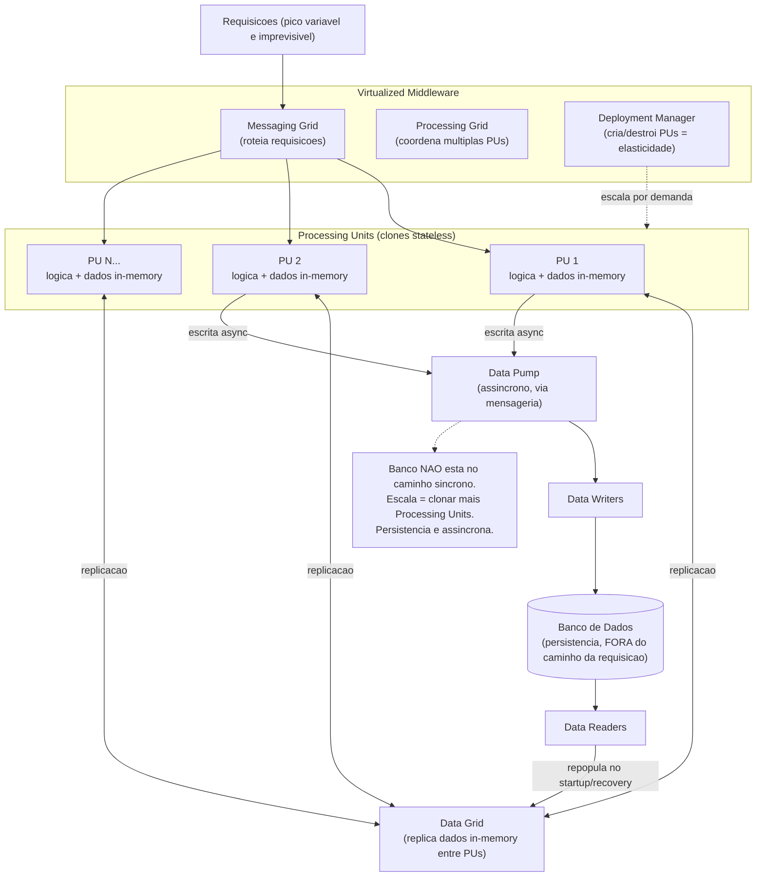

# Space-Based Architecture

> **Bloco:** Estilos e padrões arquiteturais · **Nível:** Avançado · **Tempo de leitura:** ~26 min

## TL;DR

Space-Based Architecture (SBA) é um estilo arquitetural projetado especificamente para **altíssima escalabilidade, elasticidade e concorrência sob carga variável e imprevisível**. A ideia central é **remover o banco de dados do caminho síncrono da requisição** — a maior fonte de gargalo de escala — substituindo-o por **dados em memória replicados** dentro de cada unidade de processamento. O nome vem de **tuple space** (Linda, Gelernter & Carriero, 1986): memória compartilhada distribuída como mecanismo de coordenação.

A aplicação roda em **processing units** stateless e clonáveis, cada uma carregando uma réplica in-memory dos dados que precisa (data grid). Quando a carga sobe, você simplesmente instancia mais processing units — escala quase linear, porque não há um banco central disputado. A persistência para o banco "real" acontece **assincronamente**, fora do caminho da requisição, via um *data pump* e *data writers*. Um conjunto de **virtualized middleware** (messaging, data, processing e deployment grids) coordena replicação, roteamento e ciclo de vida das unidades.

O custo é alto: complexidade de **replicação de cache** e janelas de inconsistência, dificuldade de garantir consistência forte, e operação sofisticada. SBA brilha em cenários de pico extremo e imprevisível (ingressos, leilões, flash sales, trading) e é mal aplicado em sistemas com consistência transacional forte ou carga modesta e previsível.

## O problema que resolve

A abordagem padrão de escala — adicionar mais servidores de aplicação atrás de um load balancer — esbarra invariavelmente no **banco de dados central como ponto único de contenção**. Por mais que você escale a camada de aplicação horizontalmente, todas as instâncias convergem para o mesmo banco, que tem limites de conexões, locks, IOPS e throughput de escrita. Sob carga extrema e *imprevisível* (um pico de 10x em segundos), o banco satura, as filas de conexão estouram, a latência dispara e o sistema sofre **colapso funcional**: quanto mais usuários chegam, mais lento fica, num espiral de morte.

Técnicas paliativas (réplicas de leitura, sharding, cache na frente do banco) ajudam mas não eliminam a contenção fundamental de escrita nem o acoplamento ao banco no caminho crítico. E sharding/réplicas adicionam complexidade operacional e ainda assumem que a carga é razoavelmente previsível.

SBA foi catalogado e popularizado por **Mark Richards** em *Software Architecture Patterns* (O'Reilly, 1ª ed. 2015; 2ª ed. 2022, capítulo 7) e detalhado em *Fundamentals of Software Architecture* (Richards & Ford, 2020). Suas raízes técnicas vêm do modelo de **tuple space / Linda** dos anos 1980 e da indústria de **In-Memory Data Grids (IMDG)** — produtos como GigaSpaces (que cunhou boa parte do vocabulário "space-based"), Oracle Coherence, Hazelcast, Apache Ignite e Tarantool. O insight: se os dados de que a requisição precisa estão *em memória, ao lado do processamento, e replicados*, então não há banco central para saturar — a escala vira "clone mais processing units".

O domínio-alvo clássico: aplicações de **volume concorrente alto, variável e imprevisível** onde o pico não pode ser provisionado de antemão e onde latência baixa importa muito — venda de ingressos para shows, leilões online, sistemas de reserva, *flash sales* de e-commerce, plataformas de trading, jogos online.

## O que é (definição aprofundada)

Componentes do estilo (terminologia de Richards/Ford):

- **Processing Unit (unidade de processamento):** a peça que contém a lógica de aplicação **e** uma réplica in-memory dos dados (um *data grid* embarcado). É **stateless do ponto de vista de afinidade** (não guarda sessão de usuário fixa) e **clonável**: para escalar, instancia-se mais cópias idênticas. Toda a requisição é atendida lendo/escrevendo na memória local — sem ir ao banco.
- **Virtualized Middleware (middleware virtualizado):** a camada que coordena as processing units. Composta de quatro "grids":
  - **Messaging Grid:** gerencia requisições de entrada e sessão; faz o roteamento/balanceamento das requisições para as processing units disponíveis (papel de load balancer ciente do espaço).
  - **Data Grid:** o coração do estilo. Responsável por **replicar os dados em memória** entre as processing units, de modo que cada unidade tenha uma cópia consistente (ou consistente-eventual) dos dados que precisa. É a substituição funcional do banco no caminho da requisição.
  - **Processing Grid:** coordena requisições que envolvem múltiplos tipos de processing unit (orquestração interna entre unidades quando uma transação cruza tipos de dados).
  - **Deployment Manager / Grid:** gerencia o ciclo de vida das processing units — startup/shutdown dinâmico baseado em carga. É o que viabiliza a **elasticidade** (criar/destruir unidades conforme a demanda).
- **Data Pump:** mecanismo **assíncrono** que envia atualizações dos dados em memória para o banco de dados persistente. As escritas saem do caminho da requisição: a processing unit atualiza a memória, responde ao usuário, e o pump propaga para o banco depois (tipicamente via mensagens).
- **Data Writers:** processos/serviços que consomem do data pump e efetivamente escrevem no banco persistente. Desacoplam o formato da memória do schema do banco.
- **Data Readers:** processos que leem do banco para **popular/repopular** o data grid em memória — usados no startup das processing units e na recuperação de falhas (quando todas as réplicas em memória caem, é preciso recarregar do banco).

Conceitos-chave:

- **Tuple Space:** abstração de memória compartilhada distribuída na qual os processos coordenam lendo e escrevendo "tuplas". Inspira o modelo de dados replicados em memória compartilhada do data grid.
- **In-Memory Data Grid (IMDG):** a tecnologia concreta que implementa o data grid (Hazelcast, Apache Ignite, GigaSpaces, Coherence). Provê replicação, particionamento e, frequentemente, computação *near data*.
- **Replicação vs Particionamento de cache:** os dados podem ser totalmente replicados em cada unidade (rápido para ler, caro para sincronizar escritas e limitado pelo tamanho que cabe em memória) ou particionados (cada unidade dona de um subconjunto — escala mais em volume, mas requer roteamento por chave). A escolha de *cache replication model* é uma decisão central de design.
- **Consistência eventual entre réplicas:** como os dados são replicados de forma assíncrona entre processing units e para o banco, há janelas em que diferentes réplicas e o banco divergem. SBA aceita isso por design — é parte do contrato.

## Como funciona

Caminho de uma requisição em SBA:

1. A requisição chega ao **messaging grid**, que a roteia para uma processing unit disponível (qualquer uma, pois são clones stateless).
2. A processing unit atende a requisição **inteiramente em memória**: lê e escreve no seu data grid local. Nenhuma ida ao banco no caminho síncrono. Latência baixíssima e previsível.
3. Se a requisição alterou dados, o **data grid** replica a mudança para as outras processing units (síncrona ou assincronamente, conforme o modelo) para manter as réplicas coerentes.
4. A mudança também é enviada ao **data pump** (assíncrono, via mensageria) para eventual persistência.
5. A processing unit **responde imediatamente** ao usuário — sem esperar a escrita no banco.
6. Em paralelo, **data writers** consomem do pump e gravam no banco persistente, no seu próprio ritmo. O banco deixa de ser gargalo porque saiu do caminho crítico e recebe escritas em lote/assíncronas.

**Escala e elasticidade:** quando a carga sobe, o **deployment manager** instancia novas processing units; o data grid replica os dados para elas; o messaging grid passa a rotear para o pool maior. Como não há banco central disputado, a escala é aproximadamente **linear** — dobrar processing units dobra a capacidade. Quando a carga cai, unidades são desligadas. Isso é elasticidade real, ativada por demanda.

**Recuperação de falha:** se uma processing unit cai, suas requisições vão para as outras (os dados estão replicados). Se *todo* o data grid for perdido (improvável, mas catastrófico), os **data readers** repopulam a memória a partir do banco — aceitando perder o que ainda não foi persistido pelo pump (a janela de perda é o "lag" do pump, uma decisão de risco explícita).

O trade-off de consistência é o cerne: o usuário enxerga o estado em memória (rápido, mas pode estar à frente do banco), e o banco converge depois. Para a maioria dos domínios-alvo (ex.: contagem de ingressos disponíveis), a consistência forte é negociada por escala — e mecanismos de reconciliação tratam os casos de borda (ex.: overselling tratado com compensação).

## Diagrama de fluxo



## Exemplo prático / caso real

**Cenário:** uma plataforma brasileira de venda de ingressos (pense em algo como Sympla ou Ingresso.com) precisa vender ingressos para um show de grande artista. No instante em que as vendas abrem, **centenas de milhares de pessoas** chegam simultaneamente, todas tentando comprar nos primeiros segundos. A carga vai de praticamente zero a um pico massivo em instantes, e some logo depois. Provisionar um banco para o pico seria absurdamente caro e ainda assim ele seria o gargalo: todo mundo disputando as mesmas linhas de "ingressos disponíveis por setor".

**Com SBA:** o inventário de ingressos por setor vive **em memória**, replicado no data grid entre dezenas/centenas de processing units. Cada compra é processada em memória (decrementar contador do setor, reservar assento), respondendo em milissegundos. O data grid mantém as réplicas coerentes; o data pump envia as vendas, assincronamente, para o banco persistente. Quando o pico chega, o deployment manager sobe mais processing units em segundos — a capacidade escala linearmente porque ninguém está esperando o banco.

**Pseudocódigo conceitual da compra:**

```text
# Dentro da Processing Unit (tudo em memoria)
def comprar_ingresso(setor, usuario):
    disponiveis = data_grid.get(setor)         # leitura in-memory, ~microssegundos
    if disponiveis > 0:
        data_grid.decrement(setor)             # escrita in-memory + replicacao
        reserva = criar_reserva(setor, usuario)
        data_pump.send(reserva)                # async -> banco, fora do caminho
        return CONFIRMADO(reserva)             # responde JA, sem esperar o banco
    else:
        return ESGOTADO
```

**Tratamento de borda:** a concorrência sobre o contador em memória é resolvida por operações atômicas do IMDG (compare-and-set / locks distribuídos no data grid). A janela de inconsistência com o banco é aceita; a reconciliação periódica e a idempotência dos data writers garantem que o banco convirja corretamente.

**Adotantes/contexto real:** o estilo é a base de produtos da **GigaSpaces** (que cunhou o termo "space-based") e tem uso histórico em **trading financeiro de baixa latência**, **reservas de viagens/companhias aéreas**, **leilões** e **gaming**, justamente os domínios de concorrência extrema. **Hazelcast, Apache Ignite, Oracle Coherence** e **Tarantool** são os IMDGs que materializam o data grid. Casos públicos de e-commerce de alto pico (flash sales no estilo de plataformas asiáticas) e de telecom usam variações desse padrão para aguentar picos que matariam uma arquitetura banco-cêntrica.

## Quando usar / Quando evitar

**Quando usar:**

- **Carga concorrente alta, variável e imprevisível** que não pode ser provisionada antecipadamente: flash sales, venda de ingressos, leilões, picos sazonais extremos.
- **Necessidade de elasticidade real e quase instantânea** — escalar e desescalar em segundos conforme a demanda.
- **Baixa latência** é requisito de primeira ordem e o banco é o gargalo comprovado.
- O domínio **tolera consistência eventual** entre a visão em memória e o banco persistente (com reconciliação para os casos de borda).
- Volume de dados "quentes" que **cabe em memória** (replicado ou particionado).

**Quando evitar:**

- **Consistência forte / transacional obrigatória** (núcleos financeiros contábeis estritos, onde cada escrita precisa ser ACID e durável imediatamente). A janela de persistência assíncrona é inaceitável.
- **Carga modesta e previsível.** Se você não tem o problema de pico extremo, SBA é overengineering caríssimo — uma arquitetura em camadas com banco e cache resolve com muito menos complexidade.
- **Datasets enormes que não cabem em memória** de forma econômica e cujo padrão de acesso não permite particionamento eficiente.
- **Time sem expertise em IMDG / dados distribuídos em memória.** A operação (replicação, split-brain, recovery, tuning de GC sob grandes heaps) é avançada.
- Quando a **durabilidade imediata** é crítica e perder a janela do data pump em um crash é inaceitável.

**Trade-offs explícitos:** SBA entrega *escalabilidade quase linear*, *elasticidade*, *altíssima concorrência* e *baixa latência*, removendo o banco do caminho crítico. Paga com *complexidade altíssima* (replicação de cache, grids, recovery), *consistência eventual* (janela de divergência memória↔banco), *risco de perda de dados* na janela do pump em falhas catastróficas, *custo de memória* e *expertise operacional rara*. Em *Fundamentals of Software Architecture*, SBA pontua máximo em escalabilidade e elasticidade, e mínimo em simplicidade e (relativa) testabilidade — é uma ferramenta especializada, não um default.

## Anti-padrões e armadilhas comuns

- **Usar SBA sem ter o problema de escala.** O erro mais comum: adotar o estilo por modismo ou "à prova de futuro" quando a carga é previsível e modesta. Você paga toda a complexidade sem colher nenhum benefício — é o oposto de YAGNI aplicado a arquitetura.
- **Assumir consistência forte que o estilo não dá.** Tratar a visão em memória como se fosse imediatamente durável e globalmente consistente. Overselling de ingressos, dupla reserva e saldos divergentes nascem daqui. A consistência eventual precisa ser desenhada no produto, com reconciliação.
- **Replicação total quando o dataset não cabe / não escala.** Replicar tudo em cada processing unit limita o volume ao que cabe em uma instância e torna cada escrita cara (propagar para todas). Para grandes volumes, é preciso **particionar** o data grid, com roteamento por chave.
- **Subestimar o recovery.** Se todo o data grid cair, a recuperação depende dos data readers recarregarem do banco — e tudo que estava na fila do data pump e não foi persistido **se perde**. Não dimensionar essa janela de risco (e não testar o recovery) é receita para perda de dados em produção.
- **Data pump como gargalo escondido.** Se a taxa de escrita em memória excede cronicamente a capacidade dos data writers de drenar para o banco, o backlog cresce sem limite, a janela de perda aumenta e a divergência explode. O pump precisa ser dimensionado e monitorado.
- **Ignorar split-brain.** Em partições de rede, diferentes subconjuntos de processing units podem divergir e ambos acharem-se "donos" do estado. IMDGs têm estratégias de split-brain protection/merge — não configurá-las leva a corrupção silenciosa.
- **Sessão com afinidade (sticky) quebrando a clonabilidade.** Guardar estado de sessão local na processing unit reintroduz afinidade e mata a propriedade de "qualquer unidade atende qualquer requisição", prejudicando escala e failover. O estado de sessão, se necessário, deve viver no data grid.
- **GC pauses sob heaps gigantes.** Processing units com dezenas de GB de heap sofrem pausas de garbage collector que arruínam a latência. Requer tuning específico (off-heap storage, GCs apropriados) — frequentemente ignorado até estourar em produção.

## Relação com outros conceitos

- **Caching distribuído / In-Memory Data Grid:** SBA é, em essência, a elevação do *cache distribuído* ao posto de fonte primária de verdade no caminho da requisição, com o banco rebaixado a *backing store* assíncrono. Hazelcast/Ignite/Coherence são a tecnologia; SBA é o estilo. (Bloco de performance/escalabilidade aprofunda caching.)
- **Tuple Space / Linda:** a raiz teórica do "space" — memória compartilhada distribuída para coordenação, de Gelernter & Carriero (1986).
- **CQRS & Event-Driven:** o data pump assíncrono é, conceitualmente, um fluxo de eventos de mudança de estado; a separação leitura-em-memória / escrita-no-banco rima com CQRS. SBA frequentemente se apoia em mensageria. Ver `09-event-driven-architecture-eda.md`.
- **Microservices:** SBA é ortogonal — uma processing unit *pode* ser um microservice, mas SBA é uma decisão sobre *como escalar dados+processamento*, não sobre *como decompor o domínio*. É comum aplicar SBA a um subconjunto crítico (o "hot path" de alta concorrência) dentro de uma arquitetura maior.
- **Escalabilidade vs Elasticidade:** SBA é o estilo de referência quando *ambas* são requisitos extremos; ele desacopla a escala do limite do banco. (Bloco de performance discute a distinção formal.)
- **Consistência eventual / Teorema CAP:** SBA escolhe deliberadamente disponibilidade e desempenho sobre consistência forte no caminho crítico, aceitando convergência posterior — uma manifestação prática das escolhas de CAP/PACELC. (Bloco de sistemas distribuídos.)

## Referências

- [7. Space-Based Architecture — Software Architecture Patterns, 2nd Edition (O'Reilly, Mark Richards)](https://www.oreilly.com/library/view/software-architecture-patterns/9781098134280/ch07.html) — capítulo dedicado ao estilo (componentes, grids, data pump).
- [Software Architecture Patterns — O'Reilly (report gratuito, Mark Richards)](https://www.oreilly.com/content/software-architecture-patterns/) — visão geral dos estilos, incluindo space-based.
- [Fundamentals of Software Architecture — O'Reilly (Richards & Ford)](https://www.oreilly.com/library/view/fundamentals-of-software/9781492043447/) — capítulo de space-based com as características arquiteturais pontuadas.
- [Software Architecture Patterns — Mark Richards (Google Books)](https://books.google.com/books/about/Software_Architecture_Patterns.html?id=AtF2nQAACAAJ) — ficha bibliográfica da obra.
- [Software architecture patterns: Layered, Event-driven, Microkernel, Microservices, Space-based and CQRS — marabesi.com](https://marabesi.com/software-architecture/software-architecture-patterns.html) — resumo comparativo dos padrões do livro de Richards.
