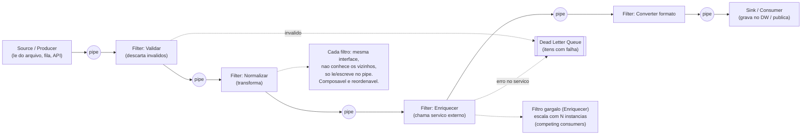

# Pipes and Filters

> **Bloco:** Estilos e padrões arquiteturais · **Nível:** Intermediário · **Tempo de leitura:** ~22 min

## TL;DR

Pipes and Filters é um estilo arquitetural que decompõe um processamento maior em uma **sequência de etapas independentes (filters)** conectadas por **canais (pipes)**, onde a saída de um filtro é a entrada do próximo. Cada filtro tem uma interface uniforme — recebe dados pelo pipe de entrada, transforma e emite no pipe de saída — e **não conhece os vizinhos**. Isso dá **composabilidade** (rearranjar/adicionar/remover filtros sem tocar nos outros), **reuso** (o mesmo filtro serve em vários pipelines) e **escala/deploy independentes** por etapa.

A intuição canônica é o **pipe do Unix** (`cat arquivo | grep erro | sort | uniq -c`): cada comando é um filtro, o `|` é o pipe. Em escala arquitetural, o padrão aparece em **pipelines de dados/ETL, processamento de mídia, compiladores, e fluxos de mensageria** (codificado por Gregor Hohpe & Bobby Woolf em *Enterprise Integration Patterns*, 2003).

O custo: cada estágio adiciona **latência e overhead de transporte** (serialização entre pipes), o que o torna ruim para operações de baixa latência interativa; e fluxos com forte estado compartilhado ou transações cruzadas não se encaixam bem. Filtros em pipelines distribuídos precisam ser **idempotentes** (mensagens podem se repetir).

## O problema que resolve

Considere um processamento de transformação de dados em várias etapas: validar → normalizar → enriquecer → transformar formato → entregar. Se você escreve isso como uma única função/módulo monolítico, surgem problemas: (a) **baixa reusabilidade** — a lógica de "normalizar" fica presa àquele fluxo; (b) **baixa testabilidade** — testar uma etapa exige rodar todo o bloco; (c) **acoplamento** — mudar a ordem das etapas ou inserir uma nova exige editar o monólito; (d) **escala acoplada** — se "enriquecer" é caro (chama serviço externo) e "validar" é barato, você não pode escalá-los separadamente.

Pipes and Filters resolve isso impondo uma **decomposição por etapa de transformação** com uma **interface uniforme**. Como todos os filtros falam o mesmo "protocolo de pipe", eles viram peças de Lego: combináveis em diferentes ordens e pipelines sem alterar o código de cada um. É a aplicação do princípio de **composição sobre uma interface comum**.

A linhagem é antiga e ilustre. O conceito foi articulado por **Doug McIlroy** nos **pipes do Unix** (Bell Labs, ~1972–1973) — a filosofia de "programas pequenos que fazem uma coisa bem e se compõem via streams de texto". Foi formalizado como estilo arquitetural na literatura de software architecture (Garlan & Shaw, *An Introduction to Software Architecture*, 1993) e como **padrão de integração de mensageria** por **Gregor Hohpe & Bobby Woolf** em *Enterprise Integration Patterns* (Addison-Wesley, 2003), de onde vem boa parte do vocabulário usado hoje em ferramentas como **Apache Camel**, **Spring Integration** e os pipelines de nuvem (Azure Functions/Service Bus, AWS Step Functions/SQS).

## O que é (definição aprofundada)

Componentes e termos-chave:

- **Filter (filtro):** um componente de processamento que executa **uma transformação coesa** sobre os dados que recebe. Idealmente é **sem estado compartilhado** (stateless) em relação a outros filtros, com a interface uniforme: *lê do pipe de entrada → processa → escreve no pipe de saída*. Tipos de filtro:
  - **Producer / Source:** origem do fluxo (só saída). Ex.: lê de um arquivo, fila, banco.
  - **Transformer:** transforma cada item (map). Ex.: normalizar, enriquecer, converter formato.
  - **Tester / Filter (no sentido estrito):** decide passar ou descartar itens (predicado). É o sentido literal de "filtrar".
  - **Consumer / Sink:** destino final (só entrada). Ex.: grava no banco, publica em fila, chama API.
- **Pipe (cano/canal):** o conector que transporta dados de um filtro ao próximo. Define o **acoplamento mínimo**: os filtros conhecem apenas o pipe, não uns aos outros. Em implementações:
  - In-process: streams de memória, generators, observables, buffers.
  - Distribuído: **filas de mensagens** (channels) — cada filtro consome de uma fila e produz na próxima. É o modelo de EIP/Camel.
- **Interface uniforme:** a propriedade que viabiliza a composabilidade. Como todos os filtros têm a mesma "forma" de entrada/saída, qualquer filtro pode ser plugado em qualquer pipe. Quebrar essa uniformidade destrói o estilo.
- **Pipeline:** a composição linear de filtros conectados por pipes. Pode ser **linear** (cadeia simples) ou ramificar/juntar (com filtros de roteamento e agregação, embora ramificações complexas já tendam a outro padrão).

Modos de processamento:

- **Batch (lote):** cada filtro processa o conjunto inteiro antes de passar adiante. Simples, mas alta latência ponta-a-ponta (espera o dataset completo a cada etapa).
- **Stream (fluxo):** os itens fluem pelo pipeline conforme chegam; filtros processam em paralelo, cada um trabalhando em itens diferentes ao mesmo tempo (pipelining). Mais eficiente e o modo natural em mensageria/streaming.

Propriedades arquiteturais resultantes: **alta modularidade**, **reuso**, **composabilidade**, **testabilidade por etapa**, **escala e deploy independentes por filtro**. É frequentemente classificado como um sub-estilo do **dataflow architecture**.

## Como funciona

O fluxo é deliberadamente simples e essa simplicidade é a virtude. Dados entram pela fonte; cada filtro consome do seu pipe de entrada, executa sua transformação isolada e emite no pipe de saída; o pipe entrega ao próximo filtro; e assim sucessivamente até o sink.

A mecânica que importa:

- **Desacoplamento via pipe:** o filtro A não sabe que existe o filtro B. Ele só escreve no pipe. Isso significa que você pode (a) inserir um filtro C entre A e B sem mudar nenhum dos dois, (b) reordenar, (c) reusar A em outro pipeline. O pipe é o contrato.
- **Pipelining e paralelismo:** em modo stream, enquanto o filtro 3 processa o item N, o filtro 2 já processa o item N+1 e o filtro 1 o item N+2. Isso aumenta o throughput (como uma linha de montagem). Além disso, cada filtro pode ter **múltiplas instâncias** consumindo do mesmo pipe (competing consumers), escalando o estágio gargalo independentemente.
- **Backpressure:** se um filtro é mais lento que o anterior, o pipe (especialmente quando é uma fila) acumula. É preciso tratar **backpressure** — limitar o produtor, bufferizar com limite, ou escalar o consumidor. Ignorar isso leva a estouro de memória (in-process) ou crescimento ilimitado de fila (distribuído).
- **Idempotência (distribuído):** quando pipes são filas com entrega *at-least-once*, um filtro pode receber a mesma mensagem duas vezes. Cada filtro precisa ser **idempotente** ou o pipeline precisa deduplicar (a Microsoft Azure explicitamente recomenda filtros idempotentes e detecção de duplicatas).
- **Tratamento de erro:** um item que falha em um filtro não deve travar o pipeline. Estratégias: descartar com log, rotear para uma **Dead Letter Queue**, ou enviar a um pipe de erro paralelo. A granularidade do padrão facilita isolar onde a falha ocorreu.
- **Heterogeneidade e localização:** como os filtros só compartilham a interface, podem ser implementados em **linguagens diferentes** e rodar em **máquinas/datacenters diferentes** (a Azure destaca que filtros não precisam estar no mesmo datacenter). Um filtro CPU-bound roda em hardware potente; um leve, em hardware barato.

Implementações concretas: o **pipe do Unix** (in-process, streams de bytes); **Apache Camel / Spring Integration** (pipeline de endpoints conectados, modelo EIP); **pipelines de CI/CD** (cada stage é um filtro); **compiladores** (lexer → parser → semantic analysis → optimizer → codegen é o exemplo clássico de pipeline); **streaming de dados** (Kafka Streams, Flink: operadores encadeados); **processamento de mídia** (decode → resize → watermark → encode); e na nuvem **Azure Functions encadeadas por Service Bus/Event Grid** ou **Lambda + SQS**.

## Diagrama de fluxo



Em modo stream, os filtros operam **em paralelo** sobre itens diferentes (pipelining tipo linha de montagem); o filtro gargalo (`Enriquecer`, que faz I/O externo) é escalado horizontalmente sem tocar nos demais.

## Exemplo prático / caso real

**Cenário:** um marketplace brasileiro precisa ingerir, todo dia, **catálogos de produtos de milhares de sellers** em formatos heterogêneos (CSV, XML, JSON, planilhas), normalizá-los, enriquecê-los (categorização automática, validação de NCM/fiscal, busca de imagem), e carregá-los no catálogo de busca (Elasticsearch) e no banco operacional. Escrever isso como um job monolítico seria um pesadelo de manutenção e impossível de escalar por etapa.

**Com Pipes and Filters (pipeline de ingestão):**

```text
# Cada filtro consome de uma fila (pipe) e produz na proxima
Source         -> le arquivo do seller do bucket S3        -> pipe:itens_brutos
Filter Validar -> consome itens_brutos; descarta/loga       -> pipe:validos  (invalidos -> DLQ)
Filter Normalizar -> consome validos; padroniza campos      -> pipe:normalizados
Filter Enriquecer -> consome normalizados; chama servico     -> pipe:enriquecidos
                     de categorizacao + valida NCM (I/O caro)
Filter Imagem  -> consome enriquecidos; busca/redimensiona   -> pipe:prontos
Sink Indexar   -> consome prontos; grava no Elasticsearch    -> (fim)
Sink Persistir -> consome prontos; grava no banco operacional-> (fim)
```

**Pseudocódigo de um filtro genérico:**

```text
def filtro_normalizar(pipe_in, pipe_out):
    for item in pipe_in.consume():           # le do pipe de entrada
        try:
            normalizado = padronizar(item)    # transformacao coesa, isolada
            pipe_out.publish(normalizado)     # escreve no pipe de saida
            pipe_in.ack(item)                 # confirma processamento
        except Erro:
            dlq.publish(item)                 # erro nao trava o pipeline
            pipe_in.ack(item)
    # nao conhece quem produziu nem quem vai consumir o pipe_out
```

**Ganhos concretos:** o filtro `Enriquecer` (lento, I/O-bound, chama serviço externo) roda com 20 instâncias em paralelo (competing consumers na fila), enquanto `Validar` (rápido) roda com 2 — escala independente do gargalo. Quando o time precisa adicionar um passo de "detecção de produto proibido", basta inserir um novo filtro entre `Normalizar` e `Enriquecer` — **zero mudança nos filtros existentes**. Cada filtro é testado isoladamente com entradas conhecidas.

**Adotantes/contexto real:** o padrão é onipresente em **pipelines de dados/ETL** (Apache Beam, Spark, Flink, Kafka Streams são todos dataflow/pipes-and-filters), em **CI/CD** (Jenkins/GitHub Actions stages), em **processamento de logs** (Logstash: input → filter → output é literalmente pipes-and-filters), em **compiladores** (LLVM), e nas nuvens via **Azure (Functions + Service Bus/Event Grid)** e **AWS (Lambda + SQS/Step Functions)**. **Apache Camel** e **Spring Integration** o implementam diretamente como construção de primeira classe (EIP).

## Quando usar / Quando evitar

**Quando usar:**

- **Processamento em múltiplas etapas sequenciais e bem definidas** que transformam dados (ETL, ingestão, enriquecimento, processamento de mídia, parsing).
- **Reuso e composabilidade** importam: as mesmas etapas servem a vários fluxos, e você quer rearranjar/estender sem reescrever.
- **Etapas com perfis de carga diferentes** que se beneficiam de **escala independente** (um filtro caro de I/O vs filtros baratos de CPU).
- **Heterogeneidade**: etapas implementadas em linguagens/tecnologias diferentes, possivelmente em locais diferentes.
- **Throughput via pipelining/paralelismo** é desejável e a latência ponta-a-ponta de cada item não é crítica.
- Cenários de **streaming** onde itens fluem continuamente.

**Quando evitar:**

- **Baixa latência interativa ponta-a-ponta** (request/response síncrono que precisa responder em milissegundos): o overhead de transporte entre pipes e a soma das etapas mata a latência.
- **Forte estado compartilhado / transações que cruzam etapas:** se as etapas precisam de uma transação ACID conjunta ou de muito estado compartilhado, o desacoplamento do padrão atrapalha mais do que ajuda.
- **Fluxos altamente ramificados/condicionais e não-lineares** com muita lógica de orquestração: aí um orquestrador explícito (saga/workflow engine) modela melhor que um pipeline linear forçado.
- **Processamento trivial de uma única etapa:** não há o que decompor; o padrão só adiciona cerimônia.
- Quando o **overhead de serialização** entre filtros (especialmente distribuídos) domina o custo do processamento real.

**Trade-offs explícitos:** Pipes and Filters entrega *modularidade*, *reuso*, *composabilidade*, *testabilidade por etapa*, *escala e deploy independentes* e *paralelismo via pipelining*. Paga com *latência adicional* (cada pipe é um salto), *overhead de transporte/serialização*, *complexidade de tratar backpressure e idempotência* (no caso distribuído), e *dificuldade com estado compartilhado e transações cruzadas*. É um estilo de **alta coesão por etapa e baixo acoplamento por interface uniforme** — exatamente o que o torna excelente para dataflow e ruim para fluxos transacionais de baixa latência.

## Anti-padrões e armadilhas comuns

- **Filtros com efeitos colaterais ocultos / estado compartilhado.** Se um filtro modifica estado global ou depende de estado de outro filtro fora do pipe, você quebra a composabilidade e o isolamento — o filtro deixa de ser plugável e testável isoladamente. Filtros devem ser, idealmente, funções puras sobre o stream.
- **Quebrar a interface uniforme.** Filtros com contratos de entrada/saída divergentes não se compõem; você acaba com adaptadores ad-hoc por toda parte e perde o benefício central. A uniformidade é o que faz o Lego funcionar.
- **Filtro fazendo demais (baixa coesão).** Um "filtro" que valida, normaliza e enriquece de uma vez é um mini-monolito disfarçado. Cada filtro deve ter **uma responsabilidade**. O oposto — filtros granulares demais — adiciona overhead de pipe sem ganho; há um ponto ótimo.
- **Ignorar backpressure.** Produtor mais rápido que consumidor → fila/buffer cresce sem limite → OOM (in-process) ou explosão de fila (distribuído). É obrigatório limitar/throttle/escalar.
- **Filtros não-idempotentes em pipelines distribuídos.** Entrega at-least-once reentrega mensagens; um filtro que "incrementa um contador" ou "cobra" sem idempotência corrompe o resultado em reentregas.
- **Sem tratamento de poison message / DLQ.** Um item que sempre falha num filtro trava o estágio ou é reprocessado infinitamente. Precisa de DLQ e limite de tentativas.
- **Latência por excesso de estágios distribuídos.** Cada pipe distribuído adiciona um salto de rede + serialização. Pipelines com dezenas de filtros remotos para um processamento que poderia ser in-process introduzem latência absurda. Avalie quando manter filtros no mesmo processo.
- **Forçar fluxo não-linear no padrão.** Tentar modelar ramificações condicionais complexas, joins e loops como pipes-and-filters lineares gera um emaranhado. Quando a topologia vira um grafo complexo com lógica de coordenação, use um motor de workflow/orquestração.
- **Acoplamento de schema entre filtros.** Embora desacoplados em código, os filtros se acoplam pelo **formato do dado** que trafega no pipe. Mudar o schema do item quebra filtros a jusante. Versione o contrato de dados do pipe.

## Relação com outros conceitos

- **Enterprise Integration Patterns (Hohpe/Woolf):** Pipes and Filters é o **padrão fundacional** do livro — a base sobre a qual os demais padrões de mensageria (Message Router, Translator, Splitter, Aggregator) são compostos. Cada um desses é, em essência, um tipo de filtro. Ver `08-service-oriented-architecture-soa.md` (o ESB implementa EIP).
- **Event-Driven Architecture / Mensageria:** quando os pipes são filas/tópicos, Pipes and Filters vira uma realização concreta de EDA — filtros são consumidores/produtores de mensagens. Garantias de entrega, idempotência e DLQ são compartilhadas. Ver `09-event-driven-architecture-eda.md`.
- **Streaming / Dataflow:** Kafka Streams, Flink, Spark e Beam são frameworks de dataflow que generalizam pipes-and-filters para grafos de operadores com janelas, joins e estado gerenciado. (Bloco de mensageria e streaming aprofunda.)
- **Serverless / FaaS:** funções encadeadas por filas/eventos (Lambda+SQS, Azure Functions+Service Bus) são pipes-and-filters serverless — cada função é um filtro, escalando a zero e por demanda. Ver `12-serverless-faas.md`.
- **Unix Philosophy:** a encarnação original e mais influente — "faça uma coisa bem, componha via streams". É a prova de que o estilo escala da linha de comando à arquitetura de sistemas.
- **Microservices:** um pipeline de ingestão pode ser implementado como microservices encadeados; o padrão informa *como* compor serviços de transformação. Mas Pipes and Filters é sobre *fluxo de transformação de dados*, não sobre *decomposição de domínio de negócio*.
- **MapReduce:** uma especialização restrita (map → shuffle → reduce) do paradigma de dataflow/pipes-and-filters para processamento distribuído de grandes volumes.

## Referências

- [Pipes and Filters — Enterprise Integration Patterns (Gregor Hohpe & Bobby Woolf)](https://www.enterpriseintegrationpatterns.com/patterns/messaging/PipesAndFilters.html) — definição canônica do padrão em mensageria.
- [Pipes and Filters pattern — Azure Architecture Center (Microsoft Learn)](https://learn.microsoft.com/en-us/azure/architecture/patterns/pipes-and-filters) — padrão de design em nuvem, considerações de escala e idempotência.
- [Pipes and Filters — Apache Camel (Apache Software Foundation)](https://cwiki.apache.org/confluence/display/CAMEL/Pipes+and+Filters) — implementação como construção de roteamento de mensagens.
- [Pipes and Filters — Apache Camel Development Guide (Red Hat Documentation)](https://docs.redhat.com/en/documentation/red_hat_jboss_fuse/6.3/html/apache_camel_development_guide/msgsys-pipes) — detalhes de implementação (Java DSL, In/Out exchange).
- [Cloud Design Patterns — Azure Architecture Center (Microsoft Learn)](https://learn.microsoft.com/en-us/azure/architecture/patterns/) — catálogo onde o padrão se insere entre outros padrões de nuvem.
- [Enterprise Integration Patterns — Gregor Hohpe](https://www.enterpriseintegrationpatterns.com/gregor.html) — contexto e origem do catálogo de padrões.
