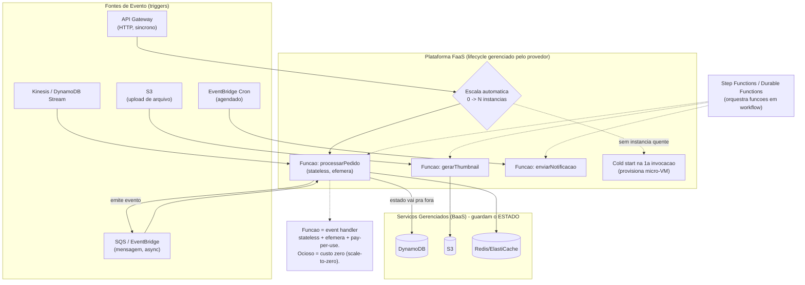

# Serverless / FaaS Architecture

> **Bloco:** Estilos e padrões arquiteturais · **Nível:** Intermediário/Avançado · **Tempo de leitura:** ~28 min

## TL;DR

Serverless é um modelo arquitetural em que você **não gerencia servidores**: o provedor de nuvem provisiona, escala e cobra a computação **por demanda e por uso real** (até granularidade de milissegundos), incluindo **scale-to-zero** (custo zero quando ocioso). O termo agrupa duas categorias (definição de Mike Roberts em martinfowler.com): **BaaS (Backend as a Service)** — serviços gerenciados de terceiros (auth, banco, storage, notificações) que substituem backend custom — e **FaaS (Functions as a Service)** — código custom rodando em **containers efêmeros e stateless**, disparado por **eventos** (AWS Lambda, Azure Functions, Google Cloud Functions / Cloud Run functions).

A unidade do FaaS é a **função: stateless, event-driven, efêmera, com lifecycle gerenciado pelo provedor**. Por isso serverless e **Event-Driven Architecture** são quase inseparáveis — funções *são* event handlers. Você ganha **operação quase nula, elasticidade automática, custo proporcional ao uso e velocidade de entrega**. Paga com **cold starts** (latência da primeira invocação), **statelessness forçada** (estado vai para fora — DB/cache/storage), **limites de execução** (tempo, memória, payload), **vendor lock-in** e **complexidade de observabilidade/debugging distribuído**.

Regra de arquiteto: serverless é excelente para cargas **espasmódicas, event-driven, com paralelismo embaraçoso e baixo acoplamento de estado**. É ruim para cargas constantes de alto volume (fica caro), workloads de longa duração, baixa latência consistente e forte estado em memória.

## O problema que resolve

A trajetória de abstração da computação: **bare metal → VMs (IaaS) → containers → PaaS → serverless**. Cada degrau removeu uma classe de responsabilidade operacional. Mesmo com containers/Kubernetes, você ainda **provisiona capacidade**, paga por servidores que ficam ociosos (super-provisionamento para aguentar picos), gerencia escalonamento, patches de SO, e capacidade reservada para tráfego que talvez não venha.

Os problemas concretos que serverless ataca:

- **Custo de capacidade ociosa.** Você paga 24/7 por servidores dimensionados para o pico, mesmo que o uso real seja esporádico. Serverless cobra **só pela execução** — scale-to-zero significa custo zero sem tráfego.
- **Toil operacional.** Provisionar, escalar, fazer patch, monitorar fleets de servidores consome tempo de engenharia que não agrega valor de negócio. Serverless transfere isso ao provedor ("NoOps" no caso ideal).
- **Escalonamento manual/lento.** Escalar Kubernetes ou auto-scaling groups tem latência (minutos) e exige tuning. FaaS escala de zero a milhares de execuções concorrentes **em segundos**, automaticamente.
- **Time-to-market.** Para cargas event-driven e glue code, escrever uma função e plugá-la a um trigger é dramaticamente mais rápido que montar serviço + deploy + infra.

A linhagem: AWS lançou o **Lambda** em **2014** (re:Invent), inaugurando o FaaS mainstream; seguiram **Azure Functions** e **Google Cloud Functions** (2016). O conceito de **BaaS** vinha de antes (Parse, Firebase). **Mike Roberts** escreveu o artigo de referência "Serverless Architectures" no site de **Martin Fowler** (2016, atualizado 2018), que definiu o vocabulário. A **CNCF Serverless Working Group** (2016) publicou um whitepaper formalizando: serverless é construir e rodar aplicações que não exigem gerenciamento de servidor, num modelo de deploy de granularidade fina onde aplicações empacotadas como funções são executadas, escaladas e cobradas em resposta à demanda.

## O que é (definição aprofundada)

Termos-chave e taxonomia (Roberts/CNCF):

- **Serverless (guarda-chuva):** modelo onde o provedor gerencia integralmente a infraestrutura; você raciocina em termos de código e eventos, não de servidores. Inclui BaaS e FaaS.
- **BaaS (Backend as a Service):** serviços de backend gerenciados consumidos via API: autenticação (Cognito, Auth0, Firebase Auth), bancos gerenciados (DynamoDB, Firestore), storage (S3), filas/notificações (SQS, SNS), busca, etc. Você substitui código de backend por serviços de terceiros. Uma SPA que fala direto com DynamoDB + Cognito é "serverless BaaS".
- **FaaS (Functions as a Service):** plataforma que executa **funções** custom em resposta a eventos, sem você gerenciar runtime. É o "compute serverless". Exemplos: AWS Lambda, Azure Functions, Google Cloud Functions / Cloud Run functions, Cloudflare Workers.

A **função** — a unidade do FaaS — tem propriedades definidoras:

- **Event-driven:** invocada por um **trigger/evento**. Tipos de invocação (CNCF): *síncrona* (HTTP via API Gateway — request/response), *assíncrona* (evento de SQS/SNS/EventBridge), *stream* (poll de Kinesis/Kafka/DynamoDB Streams). Google distingue *HTTP functions* e *event-driven functions* (background/CloudEvent).
- **Stateless:** a função **não mantém estado** entre invocações. Qualquer estado vai para fora — banco, cache (Redis/ElastiCache), storage (S3). A instância pode ser destruída a qualquer momento. Isso é uma restrição, não uma escolha.
- **Efêmera (ephemeral):** roda em um container/micro-VM provisionado sob demanda e descartado depois de um período de ociosidade. AWS roda Lambdas em micro-VMs **Firecracker** isoladas.
- **Lifecycle gerenciado:** o provedor cuida de provisionar, escalar (concorrência), e destruir instâncias. Você não toca em servidores.
- **Pay-per-use:** cobrança por **número de invocações × duração × memória alocada**, medida em frações de segundo. Ocioso = grátis.
- **Limites:** tempo máximo de execução (ex.: 15 min na Lambda), memória máxima, tamanho de payload, e **concorrência** (limite de execuções simultâneas, com possibilidade de throttling).

**Cold start vs warm start:** quando não há instância "quente" disponível, o provedor precisa provisionar uma nova (baixar o código, iniciar o runtime, inicializar) — isso adiciona latência de centenas de ms a segundos, o **cold start**. Invocações subsequentes reusam a instância "quente" (warm), sem essa penalidade. O cold start é a característica mais discutida do FaaS e influencia fortemente onde ele é (in)adequado. Mitigações: *provisioned concurrency*, runtimes leves, manter instâncias quentes, e escolher linguagens de startup rápido.

## Como funciona

Fluxo de uma aplicação serverless FaaS:

1. Uma **fonte de evento** dispara: uma requisição HTTP chega ao **API Gateway**; um arquivo é enviado ao **S3**; uma mensagem chega ao **SQS/EventBridge**; um registro muda no **DynamoDB Stream**; um agendamento (cron) dispara.
2. O provedor **roteia o evento à função** correspondente. Se há instância quente, reusa; senão, provisiona uma nova (cold start) — baixa o artefato, inicializa o runtime e o *init code*.
3. A função **executa**: recebe o evento, processa (lendo/escrevendo em serviços externos para qualquer estado), e retorna (no caso síncrono) ou apenas finaliza (assíncrono).
4. O provedor **escala automaticamente**: se chegam 5.000 eventos concorrentes, ele cria até N instâncias paralelas (sujeito ao limite de concorrência). Cada instância processa um evento por vez (no modelo Lambda).
5. Após processar, a instância fica **quente** por um tempo (reaproveitável) e depois é **destruída** se ociosa.
6. Cobrança: soma de (invocações + GB-segundo de execução). Sem tráfego, sem custo.

**Composição:** aplicações serverless raramente são uma função só. São **muitas funções pequenas orquestradas/coreografadas por eventos**, intercaladas com serviços BaaS:

- **Coreografia:** função A processa um upload no S3 e emite um evento; função B reage, e assim por diante (pipes-and-filters serverless). Desacoplado, mas o fluxo fica disperso.
- **Orquestração:** **AWS Step Functions** (ou Azure Durable Functions, Google Workflows) define explicitamente um workflow de estados que invoca funções em sequência, com tratamento de erro, retry e paralelismo — resolve o problema de orquestrar funções stateless e de longa duração lógica.

**Padrões arquiteturais serverless comuns:**

- **API + Lambda + DynamoDB:** API Gateway → função por endpoint → banco gerenciado. Backend de API sem servidor.
- **BFF/SPA + BaaS:** front-end fala direto com BaaS (auth, DB) e chama funções só para lógica custom.
- **Pipeline event-driven:** S3/SQS/Kinesis → função → próximo serviço (ingestão, ETL, processamento de mídia).
- **Fan-out:** um evento (SNS) dispara N funções em paralelo.
- **Scheduled jobs:** EventBridge cron → função (substitui cron servers).

**Frameworks/ferramentas:** Serverless Framework, AWS SAM, AWS CDK, Terraform — para definir funções, triggers e permissões como código (IaC), já que serverless é fortemente acoplado à plataforma.

## Diagrama de fluxo



## Exemplo prático / caso real

**Cenário:** um marketplace brasileiro recebe **upload de fotos de produtos** pelos sellers. Cada foto precisa virar thumbnails em vários tamanhos, ter watermark aplicada, ser analisada por moderação de conteúdo, e ter os metadados gravados. O volume é **espasmódico**: zero durante a madrugada, picos quando sellers cadastram lotes. Manter servidores de processamento de imagem 24/7 seria desperdício; dimensioná-los para o pico, caro e ocioso a maior parte do tempo.

**Com serverless (event-driven, pay-per-use):**

```text
# Trigger: upload no bucket S3 dispara a funcao automaticamente
S3 (foto_original) --evento ObjectCreated--> Lambda gerarThumbnails

def gerarThumbnails(evento):                  # stateless, efemera
    foto = s3.get(evento.bucket, evento.key)  # estado vem de fora (S3)
    for tamanho in [pequeno, medio, grande]:
        thumb = redimensionar(foto, tamanho)
        thumb = aplicar_watermark(thumb)
        s3.put(bucket_thumbs, thumb)           # estado vai pra fora (S3)
    sns.publish("FotoProcessada", evento.key)  # emite evento -> fan-out

# Fan-out: outras funcoes reagem em paralelo, desacopladas
SNS "FotoProcessada" --> Lambda moderarConteudo   # chama API de moderacao
SNS "FotoProcessada" --> Lambda gravarMetadados   # escreve no DynamoDB
```

Durante a madrugada, **custo zero** (scale-to-zero). Quando um seller sobe 500 fotos de uma vez, a Lambda escala automaticamente para centenas de execuções concorrentes em segundos, processa o lote, e desescala — sem nenhum servidor para gerenciar. A cobrança é exatamente as 500 execuções × duração.

**Onde NÃO usar aqui:** o serviço de **busca de catálogo** (alto tráfego constante, latência crítica, sensível a cold start) **não** vai para FaaS — fica num serviço containerizado sempre quente. Serverless é aplicado ao **processamento espasmódico de eventos**, não ao caminho quente de baixa latência.

**Adotantes/contexto real:** a própria **AWS** descreve Lambda como FaaS/serverless e o integra nativamente a SQS, SNS, Kinesis, MSK/Kafka, S3 e DynamoDB Streams. **Google Cloud Functions / Cloud Run functions** se integra a 125+ fontes de evento via Eventarc, com billing por 100ms. Casos públicos: **Coca-Cola** (vending machines serverless), **iRobot** (backend IoT em Lambda), **Netflix** (encoding e automação operacional em Lambda), **Nubank** e diversas fintechs usam funções para glue code e processamento event-driven. **A Cloud Guru / iRobot** são casos clássicos citados pela AWS. Plataformas de e-commerce usam serverless para webhooks, processamento de imagens, ETL e jobs agendados.

## Quando usar / Quando evitar

**Quando usar:**

- **Cargas espasmódicas / event-driven:** tráfego irregular, picos imprevisíveis, ou baixo volume médio com rajadas. O scale-to-zero e o pay-per-use brilham aqui.
- **Glue code / integrações:** reagir a eventos (upload, mensagem, mudança em DB), webhooks, automação operacional.
- **Paralelismo embaraçoso (embarrassingly parallel):** processar N itens independentes (fan-out) — imagens, registros, mensagens.
- **Jobs agendados (cron):** substituir servidores de cron por funções agendadas.
- **Backends de API com tráfego moderado/variável** onde NoOps e velocidade de entrega importam mais que custo por requisição em alta escala.
- **Protótipos e MVPs:** velocidade de ir do código à produção sem montar infra.

**Quando evitar:**

- **Carga constante de alto volume.** Acima de um certo throughput sustentado, FaaS fica **mais caro** que containers/VMs reservadas (o pay-per-use perde para capacidade comprometida). Há um ponto de cruzamento de custo.
- **Latência baixa e consistente é crítica.** Cold starts introduzem caudas de latência (p99) imprevisíveis. Inadequado para caminhos quentes sensíveis (ex.: autorização de pagamento no checkout) sem provisioned concurrency.
- **Workloads de longa duração** (> limite de tempo, ex.: 15 min na Lambda) ou que precisam de estado em memória persistente entre etapas.
- **Forte estado em memória / conexões persistentes** (ex.: pools de conexão a banco mal se encaixam com escala explosiva de funções — esgotam o banco; exige RDS Proxy ou similar).
- **Necessidade de evitar vendor lock-in.** Serverless é fortemente acoplado à plataforma (triggers, formato de evento, BaaS). Portar entre nuvens é caro.
- **Workloads que precisam de controle fino de hardware** (GPU específica, tuning de SO, runtimes customizados pesados).

**Trade-offs explícitos:** serverless entrega *operação quase nula (NoOps)*, *elasticidade automática e instantânea*, *custo proporcional ao uso (scale-to-zero)*, *velocidade de entrega* e *resiliência gerenciada*. Paga com *cold starts* (latência de cauda), *statelessness forçada* (estado externalizado, complexidade de conexões), *limites de execução* (tempo/memória/payload), *vendor lock-in*, *custo crescente em alto volume constante*, e *observabilidade/debugging distribuído mais difícil* (muitas funções pequenas, fluxo disperso). Mike Roberts é explícito: o ganho é "redução de custo operacional, complexidade e lead time" ao custo de "maior dependência de fornecedor e serviços de suporte comparativamente imaturos".

## Anti-padrões e armadilhas comuns

- **Lambda Pinball / função-monolito distribuído.** Decompor demais em micro-funções que se chamam em cadeias longas (A invoca B invoca C invoca D), criando um "distributed monolith serverless" com latência somada, custo de invocação multiplicado e debugging infernal. Equilibre granularidade: às vezes uma função maior (ou um container) é melhor.
- **Lambda síncrona chamando Lambda síncrona.** Você paga **duas** durações simultâneas (a chamadora fica ociosa esperando a chamada) e ainda soma cold starts. Para encadear funções, use eventos/filas (assíncrono) ou orquestração (Step Functions), não invocação síncrona aninhada.
- **Ignorar cold starts no caminho crítico.** Colocar FaaS sem provisioned concurrency num endpoint sensível à latência e descobrir caudas p99 horríveis em produção. Meça e, se necessário, mantenha concorrência provisionada — ou não use FaaS ali.
- **Esgotamento de conexões de banco.** Cada instância de função abre conexões; sob escala explosiva, milhares de instâncias abrem milhares de conexões e derrubam o banco. Use connection pooling externo (RDS Proxy) ou bancos serverless (DynamoDB, Aurora Serverless).
- **Assumir estado entre invocações.** Guardar estado em variável global esperando que persista — funciona por acaso em instâncias quentes e quebra silenciosamente quando a instância é reciclada. Cache em variável global é otimização *oportunista*, nunca garantia.
- **Funções não-idempotentes com invocação at-least-once.** Triggers assíncronos (SQS/SNS) podem reentregar; uma função que "cobra" ou "incrementa" sem idempotência duplica efeitos. Sempre idempotente.
- **Funções gordas / cold start agravado.** Pacotes enormes (dependências pesadas, runtimes lentos) aumentam o tempo de cold start. Minimize o artefato e o init code; escolha runtimes de startup rápido onde a latência importa.
- **Negligenciar observabilidade.** Sem distributed tracing (X-Ray/OpenTelemetry) e correlation ids, diagnosticar um fluxo que atravessa 8 funções e 3 serviços BaaS é arqueologia. Logs por função não bastam.
- **Custo descontrolado em alta escala.** Migrar uma carga de altíssimo volume constante para FaaS por modismo e tomar um susto na fatura. Faça a conta do ponto de cruzamento (FaaS vs container reservado) antes.
- **Tudo serverless ("serverless-washing").** Forçar todo workload em FaaS, inclusive os mal-adequados (longa duração, alta latência constante, estado pesado). Serverless é uma ferramenta no portfólio, não a única.

## Relação com outros conceitos

- **Event-Driven Architecture:** serverless e EDA são quase sinônimos na prática — **funções são event handlers**. Triggers são fontes de evento; coreografia e orquestração de funções são EDA aplicada. Quase tudo de EDA (idempotência, at-least-once, DLQ, choreography vs orchestration) vale aqui. Ver `09-event-driven-architecture-eda.md`.
- **FaaS vs Serverless:** FaaS é o **compute** dentro do guarda-chuva serverless; serverless inclui também BaaS. Nem todo serverless é FaaS (uma SPA + Firebase é serverless sem função custom), e FaaS é uma forma específica de serverless.
- **Microservices:** funções podem implementar microservices ("nanoservices"), mas FaaS é uma decisão de *modelo de execução/billing*, não de decomposição de domínio. Cuidado com a granularidade — funções demais recriam o distributed monolith. Ver `07-microservices.md`.
- **Pipes and Filters:** pipelines serverless (S3 → função → fila → função) são pipes-and-filters realizados com FaaS — cada função é um filtro, escalando a zero. Ver `11-pipes-and-filters.md`.
- **BaaS vs PaaS:** PaaS (Heroku, App Engine clássico) ainda pensa em "apps rodando"; serverless pensa em "funções/serviços disparados", com scale-to-zero e billing por uso — granularidade mais fina.
- **Containers / Kubernetes (Knative, Cloud Run):** a fronteira está borrando — **Cloud Run** e **Knative** trazem scale-to-zero e billing por uso para containers, oferecendo "serverless de container" sem os limites/cold-start agudos do FaaS puro. É frequentemente o meio-termo certo entre Lambda e Kubernetes tradicional.
- **Orquestração (Step Functions / Durable Functions):** resolve a coordenação de funções stateless de longa duração lógica, trazendo a discussão de orchestration vs choreography para o mundo serverless.

## Referências

- [Serverless Architectures — Mike Roberts (martinfowler.com)](https://martinfowler.com/articles/serverless.html) — artigo de referência que define BaaS vs FaaS, benefícios e drawbacks.
- [bliki: Serverless — Martin Fowler](https://martinfowler.com/bliki/Serverless.html) — verbete curto de definição do termo.
- [AWS Lambda — Serverless Function, FaaS (AWS)](https://aws.amazon.com/lambda/) — página oficial do FaaS de referência (event-driven, scaling, billing).
- [AWS Lambda Documentation](https://docs.aws.amazon.com/lambda/) — documentação técnica: triggers, concorrência, lifecycle.
- [Cloud Run functions (Google Cloud)](https://cloud.google.com/functions) — FaaS do Google: HTTP vs event-driven functions, pay-per-use, Eventarc.
- [CNCF Serverless Whitepaper — cncf/wg-serverless (GitHub)](https://github.com/cncf/wg-serverless/blob/master/whitepapers/serverless-overview/README.md) — definição formal de serverless, tipos de invocação e lifecycle.
- [Event-Driven Architecture — AWS](https://aws.amazon.com/event-driven-architecture/) — como serverless se encaixa no paradigma event-driven.
- [Serverless — Google Cloud](https://cloud.google.com/serverless) — visão de portfólio serverless (functions, Cloud Run) do GCP.
- [Choreography and orchestration — Serverless Land (AWS)](https://serverlessland.com/event-driven-architecture/choreography-and-orchestration) — coordenação de funções serverless.
