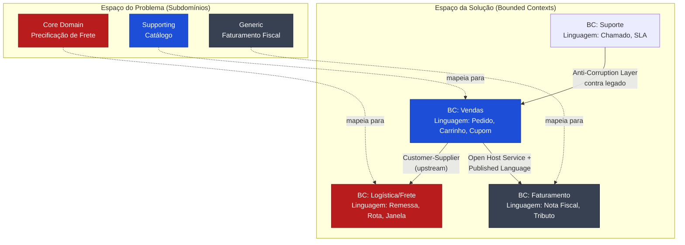

# DDD Estratégico: Bounded Contexts, Context Mapping e Ubiquitous Language

> **Bloco:** Design tático (DDD e correlatos) · **Nível:** Intermediário/Avançado · **Tempo de leitura:** ~22 min

## TL;DR

O **Domain-Driven Design (DDD)** se divide em duas grandes frentes: o **design estratégico**, que trata de como decompor um sistema grande em modelos coesos e de como esses modelos se relacionam; e o **design tático**, que trata dos blocos de construção (Aggregates, Entities, Value Objects etc.). Este documento cobre a frente estratégica, que é onde o DDD entrega o maior retorno arquitetural.

Os três pilares estratégicos são:

- **Ubiquitous Language (Linguagem Ubíqua):** um vocabulário rigoroso e compartilhado entre especialistas de domínio e desenvolvedores, refletido diretamente no código e no modelo. Não é jargão técnico nem "linguagem de negócio" solta — é a mesma linguagem usada em conversas, documentos e classes.
- **Bounded Context (Contexto Delimitado):** a fronteira explícita dentro da qual um modelo (e sua linguagem) é internamente consistente. Fora dela, os mesmos termos podem significar coisas diferentes. É a unidade fundamental de modularização estratégica e, frequentemente, a fronteira candidata a um microsserviço.
- **Context Mapping (Mapeamento de Contextos):** a documentação explícita das relações técnicas e organizacionais entre os Bounded Contexts (quem depende de quem, quem traduz o quê, quem dita os contratos).

A tese central de Evans é que **a unificação total do modelo de domínio de um sistema grande não é viável nem custo-efetiva**. Em vez de lutar contra essa realidade com um "Big Ball of Mud" de um modelo único, você reconhece múltiplos modelos, delimita cada um e mapeia as interações entre eles.

## O problema que resolve

À medida que se tenta modelar um domínio maior, fica progressivamente mais difícil construir um modelo único e unificado. Grupos diferentes de pessoas usam vocabulários sutilmente diferentes em partes diferentes de uma organização grande, e a precisão da modelagem rapidamente esbarra nisso, gerando confusão.

O exemplo clássico é a palavra **"Cliente"** (Customer). Em uma grande varejista:

- No contexto de **Vendas**, "Cliente" é alguém com histórico de compras, segmentação, score de propensão.
- No contexto de **Suporte**, "Cliente" é o titular de um chamado, com SLA e histórico de tickets.
- No contexto de **Faturamento**, "Cliente" é uma entidade fiscal com CNPJ/CPF, condições de pagamento e limite de crédito.
- No contexto de **Logística**, "Cliente" é praticamente um endereço de entrega com janela de recebimento.

Se você tentar criar uma única classe `Cliente` que sirva a todos esses contextos, ela vira um monstro: dezenas de campos, a maioria nula na maior parte dos casos, regras de negócio conflitantes, e mudanças em um contexto quebrando os outros. Isso é o que Evans chama de um modelo que tenta ser tudo para todos e acaba não servindo bem a ninguém.

A origem formal está em **Eric Evans, _Domain-Driven Design: Tackling Complexity in the Heart of Software_ (2003)** — o "Blue Book". Evans observou que projetos de software complexos falhavam não por limitações técnicas, mas por uma desconexão entre o modelo mental dos especialistas de domínio e o modelo implementado no código. Os termos de negócio se perdiam em traduções sucessivas (analista → documento → desenvolvedor → código), e o modelo resultante não capturava o conhecimento real do domínio.

**Vaughn Vernon**, em _Implementing Domain-Driven Design_ (2013) — o "Red Book" — e _Domain-Driven Design Distilled_ (2016), reposicionou a ênfase: durante anos a comunidade tratou DDD como sinônimo dos padrões táticos (Aggregates, Repositories), e Vernon argumentou que **o design estratégico é a parte mais importante** e mais frequentemente negligenciada. Bounded Contexts mal definidos condenam qualquer modelagem tática subsequente.

Em resumo, o design estratégico resolve:

1. **Ambiguidade de linguagem** entre stakeholders e times.
2. **Acoplamento acidental** entre subdomínios que deveriam evoluir independentemente.
3. **Falta de fronteiras claras** para times, deploys e propriedade de código.
4. **Erosão do modelo** quando conceitos de um contexto vazam para outro.

## O que é (definição aprofundada)

### Ubiquitous Language

A **Ubiquitous Language** é a prática de construir uma linguagem comum e rigorosa entre desenvolvedores e usuários/especialistas de domínio. Essa linguagem deve ser baseada no **Domain Model** usado no software — daí a necessidade de ser rigorosa, já que software não lida bem com ambiguidade.

Pontos centrais:

- A linguagem é **ubíqua** porque aparece em todos os lugares: nas conversas, nos requisitos, nos testes (especialmente em estilo BDD/Gherkin), nos nomes de classes, métodos, eventos e até nos schemas de banco.
- Ela é **viva**: quando o entendimento do domínio muda, a linguagem muda, e o código deve mudar junto. Se os especialistas falam "apólice em vigência" mas o código tem `policy.status == 3`, há uma desconexão que é dívida de modelagem.
- Ela é **delimitada por contexto**. Não existe uma Ubiquitous Language global para a empresa inteira — existe uma por Bounded Context. "Apólice" em Subscrição e "Apólice" em Sinistros podem ter modelos distintos.

A Ubiquitous Language não é documentação morta; é o mecanismo pelo qual o conhecimento de domínio flui sem perda para o código.

### Bounded Context

O **Bounded Context** é o padrão central do design estratégico do DDD. É a fronteira explícita (linguística, conceitual e geralmente também física/de deploy) dentro da qual um determinado modelo de domínio se aplica e é internamente consistente.

Propriedades:

- **Cada Bounded Context tem seu próprio modelo e sua própria Ubiquitous Language.** O mesmo termo pode existir em vários contextos com significados diferentes (conceitos **polissêmicos**, como "Cliente" acima), e isso é aceito e gerenciado, não combatido.
- Bounded Contexts podem ter **conceitos não relacionados** (um "ticket de suporte" só existe no contexto de Suporte) e **conceitos compartilhados** (produtos, clientes) que aparecem em vários contextos com modelos diferentes, exigindo mecanismos de tradução e mapeamento para integração.
- A fronteira é **explícita e protegida**. Internamente, o modelo é livre para ser tão rico quanto o domínio exigir. Nas bordas, há contratos, traduções e proteção contra a entrada de conceitos estranhos.

É crucial distinguir **Subdomínio** de **Bounded Context**:

- **Subdomínio (subdomain)** é um conceito do **espaço do problema** (problem space): uma área do negócio. Subdomínios se classificam em:
  - **Core Domain (domínio central):** onde está a vantagem competitiva, onde vale investir os melhores engenheiros e a modelagem mais cuidadosa.
  - **Supporting Subdomain (subdomínio de apoio):** necessário, mas não diferenciador; pode ser desenvolvido com menos rigor.
  - **Generic Subdomain (subdomínio genérico):** resolvido por soluções de mercado (ex.: autenticação, faturamento fiscal); compre ou use bibliotecas, não construa.
- **Bounded Context** é um conceito do **espaço da solução** (solution space): como você realmente implementa e delimita os modelos.

O ideal é um mapeamento 1:1 entre subdomínio e Bounded Context, mas a realidade (sistemas legados, restrições organizacionais) frequentemente cria desalinhamentos que o Context Map deve revelar.

### Context Mapping

O **Context Map** é a representação — em diagrama e em prosa — de todos os Bounded Contexts de um sistema e das **relações** entre eles. Ele captura tanto a dimensão **técnica** (quem chama quem, qual o formato dos dados, quem traduz) quanto a **organizacional/política** (quais times são donos, qual a relação de poder entre eles).

Os padrões de relacionamento (Anti-Corruption Layer, Shared Kernel, Customer-Supplier, Conformist, Open Host Service, Published Language, Partnership, Separate Ways) são detalhados no documento [03-ddd-context-mapping-patterns](./03-ddd-context-mapping-patterns-acl-shared-kernel-customer-supplier.md). Aqui basta entender que o Context Map é a **visão arquitetural de alto nível** do sistema sob a ótica do DDD — e que a **Lei de Conway** (a estrutura do software espelha a estrutura de comunicação da organização) está sempre implícita: as fronteiras dos contextos tendem a coincidir com as fronteiras dos times.

## Como funciona

A mecânica do design estratégico não é um algoritmo, mas um processo iterativo e colaborativo:

1. **Descoberta do domínio.** Por meio de conversas profundas com especialistas, frequentemente usando **Event Storming** (workshop colaborativo de Alberto Brandolini onde se mapeiam eventos de domínio em uma parede), você levanta os processos, eventos, comandos, atores e políticas do negócio.

2. **Identificação de subdomínios.** Você segmenta o espaço do problema em Core, Supporting e Generic. Isso direciona onde investir.

3. **Destilação da Ubiquitous Language.** Para cada área, captura-se o vocabulário rigoroso. Onde o mesmo termo aparece com significados conflitantes, isso é um forte sinal de que há mais de um Bounded Context.

4. **Definição das fronteiras dos Bounded Contexts.** Você desenha as fronteiras de forma que, dentro de cada uma, a linguagem seja consistente e o modelo coeso. Heurísticas:
   - Mudança de linguagem → provável fronteira.
   - Mudança de time/propriedade → provável fronteira.
   - Mudança de cadência de evolução → provável fronteira.
   - Coesão funcional alta dentro, acoplamento baixo fora.

5. **Construção do Context Map.** Para cada par de contextos que se integra, classifica-se a relação (upstream/downstream, quem dita o contrato, qual padrão de integração).

6. **Proteção das fronteiras.** Nas integrações, decide-se por traduções (Anti-Corruption Layer), contratos publicados (Published Language), endpoints estáveis (Open Host Service) etc.

7. **Evolução contínua.** O modelo e as fronteiras não são fixos. Refatorações para insights mais profundos (o **"breakthrough"** de Evans) podem redesenhar fronteiras. O Context Map é um documento vivo.

A relação **upstream/downstream** é central: o **upstream** é o contexto que influencia o **downstream** sem ser influenciado por ele na mesma medida. Mudanças no upstream se propagam para baixo. Saber quem é upstream determina quem precisa se proteger (ACL) e quem dita os contratos (Open Host Service).

## Diagrama de fluxo



O diagrama mostra a separação entre espaço do problema (subdomínios classificados por valor) e espaço da solução (Bounded Contexts com suas linguagens próprias), e as relações de integração entre os contextos.

## Exemplo prático / caso real

Considere uma plataforma de e-commerce brasileira de médio porte que cresceu de um monolito. A palavra **"Produto"** se tornou um problema:

- Em **Catálogo**, "Produto" tem título, descrição rica, fotos, atributos de SEO, categorização.
- Em **Estoque**, "Produto" é um SKU com saldo por depósito, reserva e curva ABC.
- Em **Precificação**, "Produto" tem preço base, regras de desconto, margem, e histórico de preços (importante por causa do CDC e do Procon).
- Em **Fiscal**, "Produto" tem NCM, CEST, origem, e regras de ST (substituição tributária) por estado.

Tentar uma classe `Produto` única levou a um pesadelo: o time fiscal não podia mexer em NCM sem coordenar com o time de catálogo; mudanças de SEO disparavam regressões em cálculo de impostos. A decisão arquitetural foi reconhecer **quatro Bounded Contexts**, cada um com seu próprio modelo de "Produto":

```text
BC Catálogo:    Produto { id, titulo, descricao, atributosSeo, fotos[] }
BC Estoque:     Item { sku, saldoPorDeposito{}, reservado, curvaAbc }
BC Precificação: ItemPrecificavel { sku, precoBase, regrasDesconto[], margem }
BC Fiscal:      ProdutoFiscal { sku, ncm, cest, origem, regrasST{} }
```

O elo entre eles é o **SKU**, um identificador estável que funciona como conceito compartilhado. Catálogo é **upstream** de quase todos (cria o produto e seu SKU). A integração se dá por eventos de domínio (`ProdutoCadastrado`, `SkuCriado`) publicados por Catálogo via **Open Host Service** com uma **Published Language** (um schema versionado de evento), e cada contexto downstream traduz esse evento para o seu próprio modelo, frequentemente atrás de uma **Anti-Corruption Layer** quando o modelo interno diverge muito.

A Ubiquitous Language ficou explícita em um glossário por contexto. Em Estoque, ninguém diz "produto" — diz-se "item" e "SKU"; em reuniões, em código (`InventoryItem`), em eventos (`ItemReservado`). Isso eliminou a confusão recorrente de "de qual produto estamos falando?".

O ganho operacional: cada contexto virou um serviço com deploy independente e time dono, e as fronteiras de modelagem coincidiram com as fronteiras de time (Lei de Conway aplicada conscientemente, não por acidente).

## Quando usar / Quando evitar

**Quando usar design estratégico de DDD:**

- Domínios **complexos** e com **regras de negócio ricas** (seguros, finanças, logística, e-commerce com fiscal brasileiro). DDD brilha onde a complexidade é essencial ao negócio, não acidental à tecnologia.
- Sistemas **grandes** que precisam ser quebrados em partes com propriedade clara.
- Múltiplos times trabalhando no mesmo produto, onde fronteiras claras reduzem conflito.
- Migração de monolito para microsserviços — Bounded Contexts são a melhor heurística para definir fronteiras de serviço.

**Quando evitar ou aplicar com parcimônia:**

- **CRUD simples** sem regras de negócio relevantes. Aplicar a maquinaria completa de DDD a um cadastro de tabelas auxiliares é over-engineering.
- Domínios **genéricos** que deveriam ser comprados (não modele seu próprio sistema de autenticação com DDD).
- Times pequenos em produtos pequenos, onde o overhead conceitual não se paga.
- Quando não há **acesso a especialistas de domínio**. Sem a colaboração contínua, a Ubiquitous Language não se forma e o DDD degenera em "DDD-lite" (só os padrões táticos sem o estratégico), perdendo a maior parte do valor.

**Trade-offs explícitos:** o design estratégico tem custo alto de descoberta inicial (workshops, Event Storming, alinhamento entre times) e exige disciplina contínua para manter a linguagem viva. O retorno aparece no médio prazo, via redução de acoplamento e capacidade de evolução independente. Em domínios simples, esse investimento não retorna.

## Anti-padrões e armadilhas comuns

- **DDD-lite (DDD anêmico estratégico):** adotar Entities, Value Objects e Repositories sem nunca fazer o design estratégico. Você ganha a complexidade tática sem o benefício das fronteiras. É o erro mais comum, e Vernon dedica boa parte do _Red Book_ a combatê-lo.
- **Bounded Context = um único modelo gigante:** desenhar um contexto tão grande que ele volta a ter a ambiguidade que se queria evitar. Contextos devem ser coesos.
- **Bounded Context anêmico demais (nano-contextos):** fragmentar excessivamente, criando dezenas de contextos minúsculos com integração custosa. Isso gera "monólito distribuído".
- **Modelo canônico corporativo:** tentar impor um schema/modelo único para toda a empresa ("o Customer canônico"). É a negação do Bounded Context e quase sempre falha.
- **Linguagem ubíqua como documento morto:** criar um glossário no Confluence e nunca mais atualizá-lo, enquanto o código diverge. A linguagem precisa estar no código.
- **Ignorar a Lei de Conway:** desenhar fronteiras de contexto que não correspondem à estrutura dos times leva a atrito constante. Ou ajuste os times, ou ajuste as fronteiras.
- **Confundir Bounded Context com camada técnica:** "o contexto de banco de dados", "o contexto de API" — Bounded Contexts são divisões de **domínio**, não de camadas técnicas.
- **Vazamento de modelo (model leakage):** deixar conceitos de um contexto entrarem em outro sem tradução, corroendo a integridade do modelo. É o que a Anti-Corruption Layer existe para prevenir.

## Relação com outros conceitos

- **Bounded Context ↔ Microsserviços:** um Bounded Context é a melhor candidata a fronteira de microsserviço, mas os conceitos não são idênticos. Um microsserviço pode ser menor que um BC; um BC pode (transitoriamente) abrigar mais de um serviço. A regra de ouro: **nunca** divida um único Bounded Context entre dois serviços de times diferentes — isso cria acoplamento patológico. Microsserviços sem DDD tendem a errar as fronteiras e gerar monólitos distribuídos.
- **Bounded Context ↔ Padrões de Context Mapping:** os padrões (ACL, Shared Kernel, Customer-Supplier etc.) descrevem como dois Bounded Contexts se relacionam. Ver [documento 03](./03-ddd-context-mapping-patterns-acl-shared-kernel-customer-supplier.md).
- **Bounded Context ↔ Design Tático:** dentro de um Bounded Context é que se aplicam Aggregates, Entities, Value Objects e Domain Events. Ver [documento 02](./02-ddd-aggregates-entities-value-objects-domain-events.md). Sem a fronteira estratégica, os blocos táticos não têm contexto coeso onde existir.
- **Ubiquitous Language ↔ Domain Events:** os eventos de domínio (ex.: `PedidoConfirmado`) são parte da linguagem ubíqua e frequentemente os elementos mais estáveis e expressivos do modelo. Event Storming usa eventos como ponto de partida justamente por isso.
- **Context Mapping ↔ Anti-Corruption Layer ↔ migrações de legado:** ao estrangular um sistema legado (padrão **Strangler Fig**), a ACL é o que protege os novos Bounded Contexts da contaminação pelo modelo do legado.
- **DDD estratégico ↔ Lei de Conway / Team Topologies:** as fronteiras de contexto e a estrutura de times são interdependentes; literatura moderna (Team Topologies) formaliza essa coevolução.

## Referências

- [bliki: Bounded Context — Martin Fowler](https://www.martinfowler.com/bliki/BoundedContext.html)
- [bliki: Ubiquitous Language — Martin Fowler](https://martinfowler.com/bliki/UbiquitousLanguage.html)
- [bliki: Domain Driven Design — Martin Fowler](https://martinfowler.com/bliki/DomainDrivenDesign.html)
- [tagged by: domain driven design — Martin Fowler](https://martinfowler.com/tags/domain%20driven%20design.html)
- [Implementing Domain-Driven Design by Vaughn Vernon — dddcommunity.org](https://www.dddcommunity.org/book/implementing-domain-driven-design-by-vaughn-vernon/)
- [Effective Aggregate Design (série de Vaughn Vernon) — dddcommunity.org](https://www.dddcommunity.org/library/vernon_2011/)
- [Anticorruption Layer — DDD Practitioners Guide](https://ddd-practitioners.com/home/glossary/bounded-context/bounded-context-relationship/anticorruption-layer/)
- [bliki: Conway's Law — Martin Fowler](https://martinfowler.com/bliki/ConwaysLaw.html)
