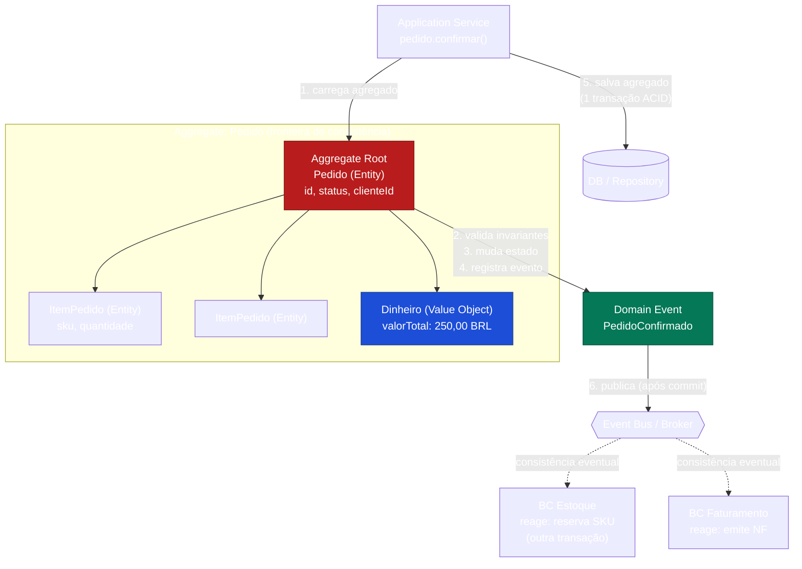

# DDD Tático: Aggregates, Entities, Value Objects e Domain Events

> **Bloco:** Design tático (DDD e correlatos) · **Nível:** Intermediário/Avançado · **Tempo de leitura:** ~24 min

## TL;DR

Os **building blocks táticos** do DDD são os padrões que estruturam o modelo de domínio **dentro** de um Bounded Context. Os quatro mais importantes:

- **Entity (Entidade):** objeto com **identidade** própria e contínua ao longo do tempo. Dois objetos com os mesmos atributos mas IDs diferentes são entidades distintas; o mesmo objeto pode mudar todos os atributos e continuar sendo a mesma entidade (ex.: um `Pedido` muda de status, itens, valor, mas continua sendo o pedido #12345).
- **Value Object (Objeto de Valor):** objeto definido por seus **atributos**, sem identidade própria, **imutável** e intercambiável (ex.: `Dinheiro(100, BRL)`, `CPF`, `Endereco`). Dois value objects com os mesmos valores são iguais e indistinguíveis.
- **Aggregate (Agregado):** um **cluster de entidades e value objects** tratado como uma única unidade de consistência transacional. Tem uma **Aggregate Root** (raiz) que é a única porta de entrada e a guardiã das invariantes. **Transações não devem cruzar fronteiras de agregado.**
- **Domain Event (Evento de Domínio):** registro imutável de algo relevante que **aconteceu** no domínio (ex.: `PedidoConfirmado`), nomeado no passado, parte da Ubiquitous Language. É o principal mecanismo de comunicação entre agregados e entre Bounded Contexts.

A regra de ouro de Vaughn Vernon: **modele agregados pequenos**, **referencie outros agregados por identidade** (não por objeto), **use consistência transacional dentro do agregado e consistência eventual entre agregados** (via domain events).

## O problema que resolve

Dentro de um Bounded Context com um modelo rico, surgem problemas concretos de modelagem orientada a objetos que os blocos táticos endereçam:

1. **Onde ficam as invariantes (regras de consistência)?** Em um modelo anêmico (objetos só com getters/setters e a lógica espalhada em "services"), as regras de negócio vazam para todos os lados e ninguém garante consistência. Os agregados resolvem isso definindo **fronteiras de consistência**.

2. **O que pode ser modificado em uma única transação?** Em sistemas concorrentes, transações grandes geram contenção e deadlocks. Definir o agregado como unidade transacional limita o escopo da transação e do lock.

3. **Igualdade por identidade vs. por valor.** Confundir os dois leva a bugs sutis (ex.: comparar dois `Endereco` por referência quando deveriam ser comparados por valor, ou tratar dois clientes homônimos como o mesmo).

4. **Como propagar mudanças sem acoplar agregados/contextos?** Os domain events permitem que um agregado anuncie "isto aconteceu" sem conhecer quem reage.

A formalização vem de **Eric Evans, _Domain-Driven Design_ (2003)**, que introduziu Entities, Value Objects, Aggregates, Repositories, Factories e Services. **Vaughn Vernon** refinou profundamente o design de agregados em sua série de três artigos **_Effective Aggregate Design_ (2011)**, depois incorporada ao _Implementing Domain-Driven Design_ (2013). Foi Vernon quem destilou as regras práticas (agregados pequenos, referência por ID, consistência eventual entre agregados) que hoje são consenso. **Domain Event** como padrão de primeira classe foi catalogado por **Martin Fowler** (artigo _Domain Event_) e tornou-se central com a ascensão de arquiteturas orientadas a eventos.

## O que é (definição aprofundada)

### Entity

Uma **Entity** é um objeto de domínio cuja característica definidora é a **identidade contínua** (continuity of identity). O que importa não é o conjunto de atributos, mas o fato de ser **aquele** objeto específico, rastreável ao longo de seu ciclo de vida.

- Identidade tipicamente representada por um **ID** estável (UUID, sequência, chave de negócio).
- A igualdade é definida por **identidade**, não por atributos: `pedidoA.equals(pedidoB)` se e somente se têm o mesmo ID.
- É **mutável**: seus atributos mudam ao longo do tempo, mas continua sendo a mesma entidade.
- Exemplos: `Pedido`, `Cliente`, `ContaBancaria`, `Apolice`.

A geração do ID é uma decisão de design importante. Vernon discute estratégias: ID fornecido pela aplicação (UUID gerado em memória, ótimo para sistemas distribuídos), ID gerado pelo banco (sequência), ID de negócio natural, ou ID delegado por outro contexto.

### Value Object

Um **Value Object** é definido inteiramente por seus **atributos** e não possui identidade conceitual.

- **Imutável:** uma vez criado, não muda. Para "mudar", cria-se um novo VO. Isso elimina classes inteiras de bugs de aliasing e torna VOs seguros para compartilhar e usar como chaves.
- **Igualdade por valor:** dois VOs com os mesmos atributos são iguais e intercambiáveis.
- **Sem efeitos colaterais (side-effect-free):** métodos de um VO retornam novos VOs em vez de mutar o estado (ex.: `dinheiro.somar(outro)` retorna um novo `Dinheiro`).
- **Auto-validação e comportamento:** um VO encapsula regras (`CPF` valida dígitos verificadores na construção; `Dinheiro` impede somar moedas diferentes). É aqui que mora boa parte da riqueza do modelo.
- Exemplos: `Dinheiro`, `CPF`, `CNPJ`, `Endereco`, `Periodo(inicio, fim)`, `Quantidade`, `Email`.

Preferir Value Objects a tipos primitivos (combater o anti-padrão **Primitive Obsession**) é uma das alavancas mais poderosas para um modelo expressivo e seguro. `valor: BigDecimal` é frágil; `valor: Dinheiro` carrega moeda, precisão e regras.

### Aggregate e Aggregate Root

Um **Aggregate** é um cluster de objetos de domínio associados (uma ou mais entidades e value objects) que são tratados como **uma única unidade** para fins de mudança de dados e consistência transacional. Um exemplo clássico é um pedido e seus itens (line items): são objetos separados, mas é útil tratar o pedido junto com seus itens como um único agregado.

Princípios fundamentais (de Fowler e Vernon):

- **Aggregate Root (raiz do agregado):** um dos componentes do agregado é eleito a raiz. **Qualquer referência de fora do agregado deve apontar apenas para a raiz.** A raiz garante a integridade do agregado como um todo. Objetos internos só são acessíveis através da raiz.
- **Fronteira de consistência (consistency boundary):** o agregado é a unidade dentro da qual todas as **invariantes** (regras que devem sempre ser verdadeiras) são mantidas de forma **transacionalmente consistente**. Exemplo de invariante: "a soma dos itens de um pedido deve igualar o valor total" ou "um pedido confirmado não pode ter zero itens".
- **Unidade de transferência de persistência:** carrega-se e salva-se o agregado **inteiro**. Repositories operam por agregado (um Repository por Aggregate Root).
- **Transações não devem cruzar fronteiras de agregado.** Uma transação modifica **um único** agregado. Se uma operação de negócio precisa afetar vários agregados, isso vira **consistência eventual** via domain events, não uma transação distribuída.

As **regras de design de agregado** de Vernon (_Effective Aggregate Design_):

1. **Modele invariantes verdadeiras dentro de fronteiras de consistência.** Só coloque junto o que precisa ser consistente no mesmo instante.
2. **Projete agregados pequenos.** Agregados grandes (ex.: `Cliente` contendo todos os seus pedidos) causam contenção, problemas de performance (carregar centenas de objetos) e conflitos de concorrência. Prefira muitos agregados pequenos.
3. **Referencie outros agregados por identidade.** Não embuta um objeto `Cliente` dentro do `Pedido`; armazene apenas `clienteId`. Isso desacopla, mantém os agregados pequenos e permite persistência independente.
4. **Use consistência eventual fora da fronteira.** Quando um agregado muda e outro precisa reagir, publique um domain event e processe-o (possivelmente em outra transação, outro serviço).

### Domain Event

Um **Domain Event** é a representação de algo que **aconteceu** no domínio e que é relevante para os especialistas de negócio.

- **Nomeado no passado:** `PedidoConfirmado`, `PagamentoAprovado`, `EstoqueReservado`. O nome faz parte da Ubiquitous Language.
- **Imutável:** representa um fato consumado; fatos não mudam.
- **Carrega dados relevantes:** o ID do agregado, timestamp, e os dados necessários para os consumidores reagirem (idealmente o mínimo, ou IDs para o consumidor buscar o resto).
- **Disparado pela Aggregate Root** quando uma transição de estado relevante ocorre.

Domain Events são o cimento que liga agregados e Bounded Contexts mantendo baixo acoplamento. Eles são a base de **Event Sourcing**, **CQRS** e arquiteturas orientadas a eventos em geral. Distinção importante:

- **Domain Event interno:** usado dentro do mesmo Bounded Context para coordenar agregados (frequentemente com payload rico, modelo de domínio).
- **Integration Event:** versão publicada para outros contextos/serviços, com schema versionado e estável (Published Language), tipicamente mais magra.

## Como funciona

A mecânica de uma operação de negócio bem modelada com esses blocos:

1. **A aplicação carrega um agregado** pela sua raiz, via Repository (`pedidoRepository.findById(id)`), trazendo o cluster inteiro de objetos consistentes.

2. **Invoca um método de negócio na raiz**, expresso na Ubiquitous Language (`pedido.confirmar()`, não `pedido.setStatus(2)`). A raiz **valida as invariantes** antes e depois de aplicar a mudança. Se a operação violaria uma invariante, ela lança exceção e nada muda.

3. **A raiz aplica a mudança de estado** em si e em seus objetos internos, mantendo tudo consistente.

4. **A raiz registra um ou mais domain events** (`PedidoConfirmado`). Os eventos ficam acumulados no agregado (ou em um coletor) até a transação.

5. **A aplicação persiste o agregado** via Repository, em **uma única transação** (consistência transacional dentro da fronteira).

6. **Após o commit, os domain events são despachados.** Handlers internos podem coordenar outros agregados; integration events podem ser publicados em um broker (idealmente via **Outbox Pattern** para garantir atomicidade entre o commit do agregado e a publicação — ver [documento 07](./07-outbox-e-inbox-pattern.md)).

7. **Outros agregados/contextos reagem** de forma assíncrona, atingindo **consistência eventual**. Ex.: o contexto de Estoque reage a `PedidoConfirmado` reservando estoque em seu próprio agregado e sua própria transação.

O ponto-chave é a separação entre **o que precisa ser consistente já** (dentro do agregado, transação ACID) e **o que pode convergir depois** (entre agregados/contextos, via eventos). Essa distinção é a essência da escalabilidade do modelo.

## Diagrama de fluxo



Observe que a referência ao cliente é por **identidade** (`clienteId`), não um objeto `Cliente` embutido — isso mantém o agregado pequeno. E que as reações em outros contextos acontecem em transações separadas, via eventos.

## Exemplo prático / caso real

Cenário: módulo de **carrinho e pedido** de um e-commerce brasileiro.

**Value Objects** modelados:

```text
Dinheiro { valor: BigDecimal, moeda: Moeda }  // imutável; impede somar BRL com USD
CPF { numero: String }                         // valida dígitos na construção
Endereco { logradouro, numero, cep, uf }       // imutável; igualdade por valor
Quantidade { valor: int }                      // > 0 garantido na construção
```

**Aggregate `Pedido`** com a raiz `Pedido` e itens internos:

```text
Pedido (Aggregate Root)
  - id: PedidoId
  - clienteId: ClienteId        // referência por IDENTIDADE, não objeto Cliente
  - itens: List<ItemPedido>     // internos ao agregado
  - status: StatusPedido
  - enderecoEntrega: Endereco   // Value Object
  - valorTotal: Dinheiro        // derivado, mantido consistente

  + adicionarItem(sku, Quantidade, Dinheiro precoUnit)
  + confirmar()  // invariante: itens não vazio; valorTotal > 0
```

A invariante "a soma dos itens deve igualar `valorTotal`" e "pedido confirmado tem ao menos um item" é mantida **dentro** do agregado, em uma transação. Quando `confirmar()` é chamado:

```text
pedido.confirmar():
  se itens.isEmpty(): lança PedidoVazioException
  se valorTotal.menorQue(Dinheiro.zero()): lança ...
  this.status = CONFIRMADO
  registrarEvento(PedidoConfirmado(this.id, this.clienteId, this.valorTotal))
```

Após o commit, o evento `PedidoConfirmado` é publicado. O **Bounded Context de Estoque** reage reservando os SKUs (em seu agregado `ItemEstoque`, outra transação, podendo falhar e disparar uma **Saga** de compensação — ver [documento 06](./06-saga-pattern.md)). O **Bounded Context de Faturamento** reage emitindo a nota fiscal.

Repare no que **não** foi feito: não se tentou, numa única transação, confirmar o pedido **e** baixar o estoque **e** emitir a NF. Isso cruzaria três agregados (e três contextos), violando a regra de fronteira de consistência. A coordenação é eventual, via eventos.

Por que o agregado `Pedido` **não** contém o agregado `Cliente`? Porque cliente tem seu próprio ciclo de vida, suas próprias invariantes, e pode ter milhares de pedidos. Embutir cliente no pedido inflaria o agregado e criaria contenção. Guarda-se apenas `clienteId`.

## Quando usar / Quando evitar

**Quando usar os blocos táticos:**

- Dentro de um **Bounded Context com domínio rico**, onde existem invariantes reais a proteger.
- Quando há **concorrência** e você precisa controlar o escopo transacional (agregados pequenos = menos contenção).
- Quando o modelo é o **Core Domain** e merece investimento em expressividade.

**Quando evitar / simplificar:**

- **CRUD puro** sem invariantes. Modelar agregados, VOs e eventos para uma tabela de "categorias" é overkill. Use um modelo simples (Active Record, ou só DTOs).
- **Relatórios e leituras complexas.** Agregados são péssimos para queries que cruzam muitos dados. Para o lado de leitura, use modelos de leitura dedicados (**CQRS** — ver [documento 04](./04-cqrs.md)). Não tente servir relatórios a partir do modelo de agregados.
- **Subdomínios genéricos** comprados de terceiros.

**Trade-offs:** modelagem tática rigorosa custa esforço inicial e exige maturidade do time. O retorno é um modelo que resiste à mudança, com regras concentradas e testáveis. Mal aplicada (agregados grandes, modelo anêmico, primitive obsession) ela entrega o custo sem o benefício.

## Anti-padrões e armadilhas comuns

- **Anemic Domain Model (modelo anêmico):** entidades só com getters/setters e a lógica de negócio em "services". É a antítese do DDD tático: você tem as classes mas não o comportamento. Fowler cataloga isso explicitamente como anti-padrão.
- **Agregados grandes demais:** o erro mais comum. Carregar centenas de objetos, locks longos, conflitos de concorrência. Sintoma clássico: `Cliente` contendo todos os `Pedidos`, ou `Produto` contendo todo o histórico de preços.
- **Transações que cruzam agregados:** modificar dois agregados na mesma transação para "garantir consistência". Isso esconde um agregado mal desenhado ou uma necessidade de consistência eventual.
- **Referência por objeto em vez de por ID:** embutir agregados uns nos outros, criando grafos enormes e acoplamento de carga/persistência.
- **Primitive Obsession:** usar `String cpf`, `BigDecimal valor`, `int quantidade` em vez de Value Objects. Perde-se validação, expressividade e segurança de tipos.
- **Value Objects mutáveis:** anula os benefícios (segurança, uso como chave, ausência de aliasing). VO mutável é uma contradição.
- **Domain Events sem nome no passado:** `CriarPedido` (comando) confundido com `PedidoCriado` (evento). Comando é intenção; evento é fato consumado.
- **Eventos com payload gigante (event as state transfer indevido):** carregar o agregado inteiro no evento acopla consumidores ao seu modelo interno. Prefira IDs + dados mínimos, ou um schema de integration event versionado.
- **Repository por entidade não-raiz:** deve haver um Repository por **Aggregate Root**, não um por tabela. Repository de objeto interno quebra a fronteira.

## Relação com outros conceitos

- **Aggregates ↔ Bounded Contexts:** agregados vivem **dentro** de um Bounded Context. As fronteiras estratégicas (ver [documento 01](./01-ddd-bounded-contexts-context-mapping-ubiquitous-language.md)) definem onde os agregados existem; as fronteiras de agregado definem a consistência transacional dentro deles.
- **Domain Events ↔ Event Sourcing:** em Event Sourcing (ver [documento 05](./05-event-sourcing.md)), o estado do agregado **é** a sequência de domain events. O agregado é reconstruído reaplicando seus eventos. Aqui os eventos deixam de ser apenas notificações e passam a ser a fonte da verdade.
- **Domain Events ↔ CQRS:** os eventos publicados pelos agregados (write side) alimentam a construção dos modelos de leitura (read side) em CQRS (ver [documento 04](./04-cqrs.md)).
- **Domain Events ↔ Saga e Outbox:** sagas (ver [documento 06](./06-saga-pattern.md)) são coordenadas por eventos publicados pelos agregados; o Outbox Pattern (ver [documento 07](./07-outbox-e-inbox-pattern.md)) garante que o evento seja publicado se e somente se a transação do agregado for confirmada.
- **Aggregate ↔ Optimistic Concurrency:** como o agregado é a unidade de consistência, o controle de concorrência otimista (campo `version`) é aplicado na raiz do agregado.
- **Value Object ↔ Functional Core:** VOs imutáveis e sem efeitos colaterais aproximam o modelo de um núcleo funcional, facilitando testes e raciocínio.

## Referências

- [bliki: DDD Aggregate — Martin Fowler](https://martinfowler.com/bliki/DDD_Aggregate.html)
- [Domain Event — Martin Fowler](https://martinfowler.com/eaaDev/DomainEvent.html)
- [bliki: Domain Driven Design — Martin Fowler](https://martinfowler.com/bliki/DomainDrivenDesign.html)
- [Effective Aggregate Design Part I: Modeling a Single Aggregate — Vaughn Vernon (PDF, dddcommunity.org)](https://www.dddcommunity.org/wp-content/uploads/files/pdf_articles/Vernon_2011_1.pdf)
- [Effective Aggregate Design Part II: Making Aggregates Work Together — Vaughn Vernon (PDF)](https://www.dddcommunity.org/wp-content/uploads/files/pdf_articles/Vernon_2011_2.pdf)
- [Effective Aggregate Design Part III: Gaining Insight Through Discovery — Vaughn Vernon (PDF)](https://www.dddcommunity.org/wp-content/uploads/files/pdf_articles/Vernon_2011_3.pdf)
- [Implementing Domain-Driven Design by Vaughn Vernon — dddcommunity.org](https://www.dddcommunity.org/book/implementing-domain-driven-design-by-vaughn-vernon/)
