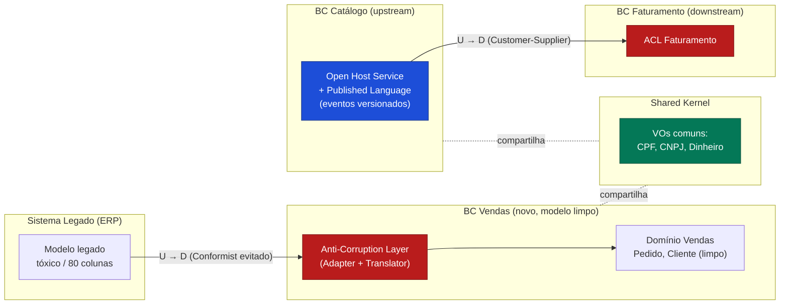

# Padrões de Context Mapping: ACL, Shared Kernel, Customer-Supplier e correlatos

> **Bloco:** Design tático (DDD e correlatos) · **Nível:** Intermediário/Avançado · **Tempo de leitura:** ~23 min

## TL;DR

Quando você tem múltiplos **Bounded Contexts** (ver [documento 01](./01-ddd-bounded-contexts-context-mapping-ubiquitous-language.md)), eles precisam se integrar. Os **padrões de Context Mapping** de Eric Evans catalogam as formas técnicas **e organizacionais** dessas relações. Os principais:

- **Anti-Corruption Layer (ACL):** camada de tradução defensiva que isola seu modelo do modelo de outro contexto (tipicamente legado ou de terceiros), impedindo que conceitos estranhos contaminem o seu domínio. O downstream se protege.
- **Shared Kernel (Núcleo Compartilhado):** dois contextos compartilham deliberadamente um subconjunto pequeno do modelo/código, com forte acordo entre os times. Alto acoplamento, exige coordenação.
- **Customer-Supplier (Cliente-Fornecedor):** relação upstream/downstream onde o downstream (cliente) tem voz nas prioridades do upstream (fornecedor). Há negociação e planejamento conjunto.
- **Conformist (Conformista):** o downstream simplesmente adota o modelo do upstream sem tradução, abrindo mão da independência (quando não tem poder de negociação e o custo da ACL não compensa).
- **Open Host Service (OHS):** o upstream expõe um protocolo/API bem definido e estável para múltiplos consumidores, em vez de integrações ad hoc.
- **Published Language (PL):** uma linguagem/schema bem documentado e versionado para o intercâmbio (ex.: schema de eventos, JSON Schema, contrato OpenAPI). Frequentemente combinado com OHS.
- **Partnership (Parceria):** dois times cujos contextos têm sucesso ou fracasso interdependentes, coordenando-se de igual para igual.
- **Separate Ways (Caminhos Separados):** decisão consciente de **não** integrar — os contextos seguem independentes.

A escolha do padrão é tanto **técnica** quanto **política**: depende de quem é upstream, de quem tem poder organizacional, e de quanto vale proteger seu modelo.

## O problema que resolve

Bounded Contexts não vivem isolados. O contexto de Vendas precisa de dados de Catálogo; o de Faturamento reage a Pedidos; o novo sistema precisa conviver com o ERP legado. Cada integração é uma **fronteira** onde dois modelos diferentes se encontram, e onde podem surgir problemas:

1. **Contaminação de modelo (model corruption):** se você consome diretamente o modelo de outro contexto (especialmente um legado mal modelado), os conceitos estranhos vazam para o seu domínio e o corroem. O exemplo de Evans: integrar com um sistema legado cujo modelo de "Cliente" é uma tabela com 80 colunas e flags mágicas, e deixar isso entrar no seu modelo limpo.

2. **Acoplamento de evolução:** se dois contextos compartilham código sem disciplina, uma mudança em um quebra o outro. Quem pode mudar o quê? Quem precisa avisar quem?

3. **Relações de poder mal resolvidas:** quando um time depende de outro, mas o outro não prioriza suas necessidades, surgem bloqueios. A integração técnica é também uma negociação organizacional.

4. **Integrações ad hoc proliferando:** sem um contrato estável, cada novo consumidor inventa sua própria forma de integrar com o mesmo upstream, gerando N integrações frágeis.

Os padrões de Context Mapping vêm do **Domain-Driven Design (Evans, 2003)**, na parte de design estratégico, e foram refinados por **Vaughn Vernon** (_Implementing Domain-Driven Design_, 2013; _Domain-Driven Design Distilled_, 2016). Eles dão um vocabulário preciso para descrever e decidir conscientemente como cada par de contextos se relaciona — em vez de deixar isso emergir por acidente.

## O que é (definição aprofundada)

Antes dos padrões, dois eixos que estruturam tudo:

- **Upstream / Downstream:** o **upstream** influencia o **downstream**, mas não o contrário (ou muito menos). Mudanças no upstream se propagam rio abaixo. Em diagramas, usa-se a notação **U** (upstream) e **D** (downstream).
- **Grau de controle e acoplamento:** quanto o downstream pode influenciar o upstream, e quanto os modelos estão acoplados.

### Anti-Corruption Layer (ACL)

A **ACL** é um conjunto de padrões defensivos colocado entre o seu modelo de domínio e outro Bounded Context (ou dependência de terceiro/legado). Seu objetivo é **impedir a intrusão de conceitos e modelos estranhos** no seu domínio central. A ACL fornece ao cliente funcionalidade em termos do **seu próprio modelo**.

- Internamente, a ACL **traduz nas duas direções**, conforme necessário, entre os dois modelos.
- A metáfora de Evans é a **Grande Muralha**: uma fronteira clara que mantém o lado de fora do lado de fora.
- Tipicamente implementada com **Adapters**, **Facades** e **Translators**. Não é só um mapper trivial — é uma camada com responsabilidade de proteger a integridade conceitual.
- Benefícios: maior manutenibilidade, testabilidade e redução do acoplamento ao modelo externo. Custo: código e latência adicionais de tradução.

A ACL é a ferramenta-chave em **migrações de legado** (padrão **Strangler Fig**): o novo sistema fala com o legado através de uma ACL, de modo que a feiura do legado nunca toca o modelo novo.

### Shared Kernel

No **Shared Kernel**, dois (ou poucos) times concordam em **compartilhar um subconjunto do modelo de domínio** — código, schema, ou ambos. Esse núcleo compartilhado é mantido em conjunto.

- Reduz duplicação, mas cria **acoplamento forte**: nenhuma mudança no kernel pode ser feita unilateralmente; exige consulta e acordo entre os times.
- Deve ser **mantido pequeno e estável**. Quanto maior o kernel, maior o atrito.
- Apropriado quando dois contextos têm um núcleo genuinamente comum e os times têm comunicação próxima (frequentemente o mesmo time ou times muito alinhados).
- Risco: tende a crescer e virar um ponto de acoplamento patológico se não houver disciplina.

### Customer-Supplier

A relação **Customer-Supplier** é uma relação upstream/downstream onde o **downstream é o cliente (customer)** e o **upstream é o fornecedor (supplier)**, com uma característica importante: o cliente **tem voz** no planejamento do fornecedor.

- Há **negociação**: o downstream apresenta suas necessidades, o upstream as inclui em seu backlog. Os requisitos do downstream entram no planejamento do upstream.
- Funciona quando há **alinhamento organizacional** que dê ao downstream poder de barganha (ambos sob a mesma liderança, OKRs compartilhados).
- Contrato e testes de contrato (consumer-driven contracts) formalizam o acordo.

### Conformist

O **Conformist** é o caso degenerado da relação upstream/downstream: o downstream **adota o modelo do upstream tal como ele é**, sem tradução e sem poder de negociação.

- Escolhido quando o downstream **não tem poder** sobre o upstream (ex.: integrar com uma API pública de um terceiro, ou um time interno politicamente mais forte) e o **custo de uma ACL não se justifica** (o modelo do upstream é "bom o suficiente").
- O downstream **abre mão da independência** do seu modelo naquela área, conformando-se ao do upstream.
- Diferença crucial para a ACL: o Conformist **aceita** o modelo externo; a ACL **traduz e se protege** dele. São escolhas opostas para o mesmo dilema (proteger vs. simplificar).

### Open Host Service (OHS)

O **Open Host Service** é um padrão para o **upstream**: em vez de fazer integrações ponto a ponto e ad hoc com cada consumidor, o upstream define um **protocolo/serviço aberto e estável**, projetado para ser consumido por **múltiplos** downstreams.

- Reduz a explosão de integrações customizadas (N integrações → 1 contrato).
- O upstream assume a responsabilidade de manter o contrato estável e evoluí-lo de forma compatível.
- Tipicamente uma API REST/gRPC pública ou um stream de eventos bem definido.

### Published Language (PL)

A **Published Language** é uma linguagem de intercâmbio **bem documentada e compartilhada**, usada para a comunicação entre contextos. Não é o modelo interno de nenhum dos lados — é um **terceiro modelo**, neutro e versionado, para a fronteira.

- Exemplos: um **schema de eventos** versionado (Avro/Protobuf/JSON Schema), um contrato **OpenAPI**, ou padrões de indústria (ex.: XBRL para finanças, HL7/FHIR para saúde, formatos de NF-e no Brasil).
- Quase sempre combinada com **Open Host Service**: o OHS é o "como" (o canal/serviço), a PL é o "o quê" (a linguagem trafegada).
- Desacopla: cada lado traduz entre seu modelo interno e a PL, sem expor seu modelo interno ao outro.

### Partnership

Na **Partnership**, dois times têm contextos cujos destinos estão **entrelaçados**: se um falha, o outro também. Eles se coordenam **de igual para igual**, com planejamento conjunto e integração coordenada.

- Não há upstream/downstream claro — é uma colaboração bidirecional.
- Exige forte comunicação. É frágil se a comunicação se deteriora; nesse caso, frequentemente migra para Customer-Supplier ou Separate Ways.

### Separate Ways

A decisão de **Separate Ways** é o reconhecimento de que **não vale integrar** dois contextos. Eles seguem caminhos independentes, sem conexão.

- Apropriado quando o custo/benefício da integração é negativo: o ganho de integrar é pequeno e o acoplamento não compensa.
- Às vezes é a decisão mais saudável: duplicar um pouco de funcionalidade é melhor que criar uma dependência custosa e de baixo valor.

## Como funciona

A aplicação dos padrões segue um raciocínio de decisão, feito durante o **Context Mapping** (ver [documento 01](./01-ddd-bounded-contexts-context-mapping-ubiquitous-language.md)):

1. **Identifique cada par de contextos que precisa se integrar** e a direção do fluxo (quem é upstream, quem é downstream).

2. **Avalie a relação organizacional/política:** o downstream tem poder de negociação? Os times se comunicam bem? Estão sob a mesma liderança?

3. **Avalie a necessidade de proteção do modelo:** o modelo do upstream é limpo e compatível com o seu, ou é um legado tóxico que contaminaria seu domínio?

4. **Escolha o padrão** combinando os eixos:
   - Modelo do upstream limpo + você sem poder + custo de ACL alto → **Conformist**.
   - Modelo do upstream tóxico ou muito diferente → **ACL** (proteja-se).
   - Você precisa influenciar o upstream e há alinhamento organizacional → **Customer-Supplier**.
   - Destinos entrelaçados, comunicação forte → **Partnership**.
   - Você é o upstream com muitos consumidores → exponha **Open Host Service** + **Published Language**.
   - Núcleo genuinamente comum, times muito próximos → **Shared Kernel** (com parcimônia).
   - Integração de baixo valor → **Separate Ways**.

5. **Documente no Context Map** com a notação U/D e os padrões em cada aresta. O mapa é vivo e revisado conforme times e prioridades mudam.

Os padrões **não são mutuamente exclusivos** numa aresta: é comum um upstream expor **OHS + Published Language**, enquanto o downstream consome por trás de uma **ACL**. Da mesma forma, uma relação **Customer-Supplier** se concretiza tecnicamente via **OHS/PL**.

## Diagrama de fluxo

O diagrama mostra: ACL protegendo o BC Vendas do ERP legado; Catálogo como upstream expondo OHS + Published Language; uma relação Customer-Supplier para Faturamento; e um Shared Kernel pequeno de Value Objects comuns.

## Exemplo prático / caso real

Cenário: uma fintech brasileira moderniza seu core. Há um **legado COBOL/mainframe** de contas, um novo **BC de Pagamentos Pix**, um **BC de Antifraude**, e integração com a **API do BACEN/Pix**.

- **ACL contra o legado de contas:** o BC de Pagamentos precisa saber o saldo, mas o modelo do mainframe é hostil (campos posicionais, códigos numéricos, COMP-3). Cria-se uma **Anti-Corruption Layer** que expõe ao domínio de Pagamentos um `Saldo` limpo (Value Object `Dinheiro`), traduzindo internamente as estruturas do mainframe. Nenhum código de Pagamentos conhece COBOL.

- **Conformist com a API do Pix/BACEN:** o BACEN dita o protocolo Pix (DICT, mensagens ISO 20022). A fintech **não tem poder** para mudar isso e o modelo é razoavelmente bem definido. Em partes onde o custo de tradução não compensa, o BC de Pagamentos se torna **Conformist** ao modelo do Pix, adotando suas estruturas diretamente. Onde o modelo Pix poluiria conceitos centrais, ainda se usa uma ACL fina.

- **Open Host Service + Published Language no BC de Pagamentos:** Pagamentos é upstream de vários consumidores internos (Extrato, Notificações, Antifraude). Em vez de N integrações, Pagamentos publica eventos `PagamentoIniciado`, `PagamentoLiquidado`, `PagamentoDevolvido` em um stream, com **schema Avro versionado** (Published Language) — o OHS.

- **Customer-Supplier entre Pagamentos (supplier) e Antifraude (customer):** Antifraude precisa de campos específicos nos eventos (geolocalização, device fingerprint). Como ambos estão sob a mesma diretoria, Antifraude negocia e suas necessidades entram no backlog de Pagamentos. Contratos consumer-driven garantem que mudanças não quebrem o consumidor.

- **Shared Kernel mínimo:** Value Objects fundamentais e regulatórios (`CPF`, `CNPJ`, `Dinheiro`, `ChavePix`) ficam em uma biblioteca compartilhada, mantida em conjunto, pequena e estável.

- **Separate Ways:** o sistema de marketing/CRM não se integra ao core de Pagamentos em tempo real — decidiu-se que o valor não justifica o acoplamento; ele consome só um export batch diário.

Resultado: cada fronteira tem uma decisão **consciente e documentada** no Context Map, alinhando o técnico ao organizacional.

## Quando usar / Quando evitar

Aqui a tabela de decisão é o próprio conteúdo:

- **Use ACL** quando o modelo externo é tóxico/legado, quando você precisa proteger um Core Domain, ou em migrações Strangler Fig. **Evite** quando o modelo externo é limpo e a tradução só adiciona latência e código sem benefício (aí, considere Conformist).
- **Use Conformist** quando você não tem poder sobre o upstream e o modelo dele é aceitável. **Evite** quando isso comprometeria seu Core Domain — proteja-o com ACL.
- **Use Customer-Supplier** quando há alinhamento organizacional que dê voz ao downstream. **Evite** (é inviável) quando o upstream não tem incentivo para priorizar você — aí a realidade é Conformist.
- **Use Shared Kernel** com muita parcimônia, só para núcleos pequenos, estáveis e genuinamente comuns, entre times próximos. **Evite** entre times distantes ou para modelos grandes — o acoplamento mata a autonomia.
- **Use OHS + Published Language** quando você é upstream com múltiplos consumidores. **Evite** o esforço de formalizar contrato quando há um único consumidor efêmero.
- **Use Partnership** quando os destinos estão entrelaçados e a comunicação é forte. **Evite** se a comunicação é fraca — vai falhar.
- **Use Separate Ways** quando a integração tem custo/benefício negativo. **Evite** se há realmente necessidade de dados em comum (não duplique fonte de verdade crítica).

## Anti-padrões e armadilhas comuns

- **ACL que vira só um mapper trivial e depois é removida "porque não faz nada":** subestimar o papel da ACL e remover a proteção, deixando o modelo externo vazar quando ele evolui de forma hostil.
- **Shared Kernel que cresce sem controle:** começa pequeno e vira um "núcleo comum" gigante que acopla todos os times — o pior dos mundos (acoplamento de monolito sem os benefícios).
- **Conformist por inércia, não por decisão:** adotar o modelo de um terceiro sem perceber que ele está corroendo seu Core Domain. Conformist deve ser escolha consciente, restrita a áreas não-centrais.
- **Integrações ponto a ponto sem OHS:** cada novo consumidor inventa sua integração, gerando N pontos de quebra. Falta de Published Language faz cada um interpretar os dados à sua maneira.
- **Published Language sem versionamento:** mudar o schema sem versionar/compatibilizar, quebrando todos os consumidores. PL exige disciplina de evolução compatível.
- **"Modelo canônico corporativo" disfarçado de Published Language:** tentar impor um único modelo gigante para toda a empresa como PL. PL é por **fronteira de integração**, magra e versionada — não um esquema universal.
- **Partnership sem comunicação real:** declarar parceria no papel mas sem rituais de coordenação; vira dois times se quebrando mutuamente.
- **Ignorar o eixo organizacional:** escolher o padrão só pela técnica, esquecendo que quem tem poder organizacional determina o que é viável. Um Customer-Supplier sem alinhamento real de prioridades é fantasia.

## Relação com outros conceitos

- **Padrões de Context Mapping ↔ Bounded Contexts:** estes padrões só fazem sentido entre Bounded Contexts; são as arestas do Context Map (ver [documento 01](./01-ddd-bounded-contexts-context-mapping-ubiquitous-language.md)).
- **ACL ↔ Migrações de legado (Strangler Fig):** a ACL é o mecanismo que permite estrangular um legado sem contaminar o novo sistema. Cada nova capability extraída fala com o legado via ACL até o legado ser desligado.
- **OHS + Published Language ↔ Domain/Integration Events:** o canal OHS frequentemente é um stream de integration events, e a Published Language é o schema versionado desses eventos (ver [documento 02](./02-ddd-aggregates-entities-value-objects-domain-events.md)).
- **Context Mapping ↔ Microsserviços:** as relações entre serviços (quem chama quem, contratos, ACLs nos adapters) são, na prática, Context Mapping aplicado. Microsserviços bem desenhados explicitam esses padrões.
- **Published Language ↔ Idempotent Consumer / Inbox:** ao consumir eventos de um OHS, o consumidor usa o Inbox Pattern para deduplicar e processar de forma idempotente (ver [documento 07](./07-outbox-e-inbox-pattern.md)).
- **Customer-Supplier ↔ Consumer-Driven Contracts:** a relação se formaliza tecnicamente com testes de contrato dirigidos pelo consumidor (Pact), garantindo que o supplier não quebre o customer.

## Referências

- [bliki: Bounded Context — Martin Fowler](https://www.martinfowler.com/bliki/BoundedContext.html)
- [Anticorruption Layer — DDD Practitioners Guide](https://ddd-practitioners.com/home/glossary/bounded-context/bounded-context-relationship/anticorruption-layer/)
- [Anti-Corruption Layer — DevIQ](https://deviq.com/domain-driven-design/anti-corruption-layer/)
- [Implementing Domain-Driven Design by Vaughn Vernon — dddcommunity.org](https://www.dddcommunity.org/book/implementing-domain-driven-design-by-vaughn-vernon/)
- [bliki: Domain Driven Design — Martin Fowler](https://martinfowler.com/bliki/DomainDrivenDesign.html)
- [tagged by: domain driven design — Martin Fowler](https://martinfowler.com/tags/domain%20driven%20design.html)
- [bliki: Conway's Law — Martin Fowler](https://martinfowler.com/bliki/ConwaysLaw.html)
