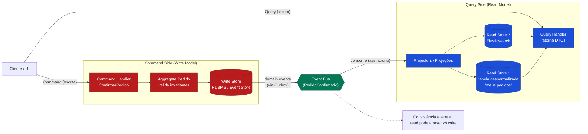

# CQRS — Command Query Responsibility Segregation

> **Bloco:** Design tático (DDD e correlatos) · **Nível:** Intermediário/Avançado · **Tempo de leitura:** ~21 min

## TL;DR

**CQRS (Command Query Responsibility Segregation)** é a noção de que você pode usar um **modelo diferente para atualizar** informação do que o modelo usado para **ler** informação. Em vez de um único modelo que serve tanto a escritas quanto a leituras (o CRUD tradicional), você separa explicitamente:

- O **Command Side (lado de comando / write model):** processa **comandos** (intenções de mudança: `ConfirmarPedido`), valida invariantes, aplica regras de negócio sobre os **Aggregates** e persiste mudanças. Otimizado para consistência e expressividade do domínio.
- O **Query Side (lado de consulta / read model):** serve **queries** (leituras), tipicamente a partir de modelos de leitura **desnormalizados** e pré-computados, otimizados para os casos de uso de leitura. Não tem lógica de domínio.

A ideia foi descrita por **Greg Young** (evoluindo o princípio **Command-Query Separation (CQS)** de Bertrand Meyer, do nível de método para o nível de arquitetura) e popularizada por **Martin Fowler**.

O ponto crítico: **CQRS adiciona complexidade significativa**. Fowler é explícito: para a maioria dos sistemas, CQRS adiciona uma complexidade arriscada. Use-o em partes específicas e justificadas do sistema, raramente no sistema inteiro.

## O problema que resolve

No modelo CRUD tradicional, **o mesmo modelo de dados** é usado para escrever e para ler. Isso funciona bem em domínios simples, mas em domínios complexos surgem tensões:

1. **Conflito de formas (impedance) entre escrita e leitura.** O modelo ideal para **escrever** com integridade (agregados pequenos, normalizado, com invariantes) é frequentemente **péssimo** para **ler** (relatórios exigem joins caros entre muitos agregados/tabelas). Ter o mesmo modelo conceitual para comandos e queries leva a um modelo mais complexo que não faz bem nenhum dos dois em domínios complicados.

2. **Disparidade de carga entre leituras e escritas.** Muitos sistemas leem ordens de magnitude mais do que escrevem (ou vice-versa). Com um modelo único, você não consegue escalar os dois independentemente. CQRS permite **separar a carga** de leitura e escrita, escalando cada lado de forma independente — particularmente útil quando há grande disparidade entre reads e writes.

3. **Modelos de domínio poluídos por necessidades de leitura.** Sem CQRS, agregados acabam carregando campos e métodos que só existem para alimentar telas e relatórios, corrompendo o modelo de domínio.

4. **Concorrência e contenção.** Ler do mesmo store que recebe escritas pesadas gera contenção; separar os stores alivia isso.

A genealogia: **Bertrand Meyer** formulou **CQS** — todo método é ou um **comando** (muda estado, não retorna dado) ou uma **query** (retorna dado, não muda estado), nunca ambos. **Greg Young** elevou esse princípio do método para o **modelo/arquitetura**, cunhando CQRS e documentando-o nos seus **_CQRS Documents_**. **Martin Fowler** o catalogou no bliki, com a ressalva enfática sobre complexidade. CQRS nasceu fortemente associado a **DDD** e a **Event Sourcing**, mas é independente de ambos.

## O que é (definição aprofundada)

**CQRS** segrega a responsabilidade de **comandos** (escritas) da de **queries** (leituras) em **modelos separados**. É importante separar os níveis em que isso pode ocorrer:

- **Separação de modelos (o mínimo):** dois modelos de objetos/código diferentes na mesma aplicação e, possivelmente, no mesmo banco. Já entrega o desacoplamento conceitual.
- **Separação de stores (o nível mais comum em produção):** um **write store** (otimizado para escrita/consistência, ex.: o store dos agregados) e um ou mais **read stores** (desnormalizados, otimizados para leitura, ex.: visões materializadas, índices de busca como Elasticsearch, caches). Os read stores são **projeções** atualizadas a partir das escritas.
- **Separação de serviços/deploys (o nível mais radical):** write side e read side como serviços independentes, escaláveis separadamente.

Conceitos-chave:

- **Command:** um objeto que representa uma **intenção de mudança**, nomeado no imperativo (`CriarPedido`, `CancelarReserva`). É processado por um **Command Handler** que carrega o agregado, aplica a regra e persiste. Comandos **podem ser rejeitados** (violação de invariante).
- **Query:** uma solicitação de leitura, servida por um **Query Handler** que lê diretamente do read model, **sem lógica de domínio**, retornando DTOs/view models prontos para a tela.
- **Read Model (view model / projeção):** estrutura **desnormalizada** modelada por caso de uso de leitura. Pode haver **vários** read models distintos para a mesma informação (um para a tela de listagem, outro para o relatório, outro para a busca).
- **Sincronização write → read:** o read model é atualizado a partir do write model. Pode ser **síncrona** (na mesma transação, mantendo consistência forte mas acoplando os lados) ou, muito mais comum, **assíncrona via eventos** (o write side publica eventos, projeções os consomem e atualizam os read models), resultando em **consistência eventual**.

A **consistência eventual** entre escrita e leitura é a consequência mais importante de CQRS assíncrono: depois de um comando, a leitura pode, por um curto intervalo, ainda refletir o estado antigo. A UI precisa lidar com isso (ver armadilhas).

## Como funciona

Fluxo típico de uma operação com CQRS assíncrono:

1. **Comando chega** (ex.: usuário clica "Confirmar Pedido" → `ConfirmarPedidoCommand`).

2. **Command Handler** carrega o **Aggregate** (`Pedido`) do write store, invoca o método de domínio (`pedido.confirmar()`), que valida invariantes e muda o estado. Se viola invariante, o comando é **rejeitado**.

3. **Persistência no write store** em uma transação. O agregado registra **domain events** (`PedidoConfirmado`).

4. **Publicação dos eventos** (idealmente via **Outbox** — ver [documento 07](./07-outbox-e-inbox-pattern.md) — para garantir atomicidade entre commit e publicação).

5. **Projeções (projectors) consomem os eventos** e atualizam os **read models**: uma projeção atualiza a tabela desnormalizada "meus pedidos", outra indexa o pedido no Elasticsearch, outra incrementa um contador de dashboard. Cada read model é modelado para sua tela.

6. **Queries leem dos read models** diretamente, retornando DTOs prontos, sem tocar nos agregados e sem lógica de domínio.

A separação permite otimizações específicas: o write store pode ser um RDBMS com transações ACID; os read stores podem ser bancos de documentos, motores de busca, ou réplicas de leitura — cada um escalado independentemente. Vários read models diferentes podem coexistir e ser reconstruídos a qualquer momento reprocessando os eventos (sinergia com Event Sourcing).

**CQRS sem Event Sourcing** é possível e comum: os eventos de sincronização podem ser publicados pelo write side de um modelo de estado tradicional (não event-sourced). **Event Sourcing sem CQRS** também existe, mas é raro — quase sempre andam juntos, porque o event store é ótimo para escrever e péssimo para consultar, exigindo read models projetados (ver [documento 05](./05-event-sourcing.md)).

## Diagrama de fluxo

Os comandos fluem para o write model (consistência transacional sobre o agregado); os eventos resultantes alimentam, de forma assíncrona, múltiplos read models otimizados; as queries leem desses read models. A linha de consistência eventual separa os dois lados.

## Exemplo prático / caso real

Cenário: o **dashboard de vendas** de um marketplace brasileiro. O write side processa milhares de pedidos por minuto em horário de pico (Black Friday); o read side serve dashboards, listagens e busca para milhões de visualizações.

**Sem CQRS:** o dashboard de "vendas do dia por categoria" exigiria um `SELECT ... JOIN pedidos JOIN itens JOIN produtos JOIN categorias GROUP BY ...` sobre as mesmas tabelas que estão recebendo a avalanche de escritas de pedidos. Resultado: queries lentas, contenção de lock, e o dashboard derrubando a performance de criação de pedidos.

**Com CQRS:**

- **Write side:** o agregado `Pedido` processa `ConfirmarPedidoCommand`, mantém invariantes, persiste em um RDBMS normalizado. Publica `PedidoConfirmado` via Outbox.

- **Read models (projeções):**
  - `vendas_por_categoria_dia`: tabela desnormalizada, pré-agregada, que um projector incrementa a cada `PedidoConfirmado`. O dashboard lê uma linha, sem joins.
  - `meus_pedidos`: visão por cliente, desnormalizada, para a tela "meus pedidos".
  - Índice no **Elasticsearch** para a busca de pedidos por texto/filtros.

- **Query side:** cada tela tem seu read model dedicado. Leituras são triviais e escalam horizontalmente (réplicas, cache), sem tocar no write side.

**Trade-off enfrentado na prática:** após confirmar um pedido, o cliente vai à tela "meus pedidos" e, por uma fração de segundo, pode não ver o pedido (consistência eventual — a projeção ainda não processou). A solução adotada: a UI exibe otimisticamente o pedido recém-criado a partir da resposta do comando, e/ou mostra um indicador de "processando", reconciliando quando a projeção converge. Esse é exatamente o tipo de complexidade que CQRS impõe e que precisa ser orçada.

Note que CQRS foi aplicado **só** ao subsistema de pedidos/dashboard, onde a disparidade read/write e a complexidade de leitura justificavam. Cadastros administrativos simples continuaram CRUD.

## Quando usar / Quando evitar

**Quando usar CQRS:**

- **Grande disparidade entre cargas de leitura e escrita**, onde escalar os lados independentemente traz ganho real.
- **Modelos de leitura e escrita genuinamente divergentes**: o que é ótimo para escrever (agregados, invariantes) é ruim para ler (relatórios, dashboards, buscas com filtros ricos).
- **Domínios complexos** onde o modelo de escrita precisa ser rico e protegido, e poluí-lo com necessidades de leitura o degradaria.
- **Múltiplas representações de leitura** da mesma informação (tela, relatório, busca, API pública), cada uma melhor servida por um read model próprio.
- Quando você já usa **Event Sourcing** (CQRS é quase obrigatório aí, para servir leituras).

**Quando evitar:**

- **A maioria dos sistemas / domínios simples.** Fowler alerta: para a maior parte dos sistemas, CQRS adiciona complexidade arriscada. CRUD com um único modelo é mais simples e suficiente.
- Quando o time **não está confortável com consistência eventual** e a UI não pode acomodá-la.
- Quando **não há disparidade** de carga nem divergência real entre modelos — você pagaria o custo sem o benefício.
- **No sistema inteiro indiscriminadamente.** CQRS é uma decisão **por Bounded Context / subsistema**, aplicada cirurgicamente.

**Trade-offs explícitos:** CQRS aumenta o número de componentes (handlers, projeções, múltiplos stores), introduz **consistência eventual** (com toda a complexidade de UX e de raciocínio que ela traz), exige infraestrutura de mensageria confiável e código de sincronização. Em troca, oferece escalabilidade independente, modelos otimizados e desacoplamento entre leitura e escrita. É uma troca de **simplicidade por escalabilidade/flexibilidade** que só compensa onde há a necessidade.

## Anti-padrões e armadilhas comuns

- **CQRS no sistema inteiro por modismo:** aplicar a tudo, inclusive a CRUDs triviais, multiplicando complexidade sem retorno. É o erro mais citado por Fowler e Young.
- **Assumir que CQRS exige Event Sourcing:** são independentes. Você pode fazer CQRS com um write model de estado tradicional publicando eventos de sincronização. Acoplar os dois desnecessariamente dobra a complexidade.
- **Ignorar a consistência eventual na UI:** mostrar ao usuário um estado e, em seguida, ele "sumir" porque a projeção ainda não convergiu. Precisa de tratamento explícito (leitura otimista, indicadores, versionamento).
- **Read models que viram um segundo modelo de domínio:** colocar lógica de negócio no query side. O read side deve ser "burro": só projetar e servir DTOs. Regras moram no write side.
- **Projeções não reconstrutíveis:** não conseguir reconstruir um read model do zero (reprocessando eventos). Isso transforma corrupção de read model em incidente irrecuperável. Projeções devem ser idempotentes e recriáveis.
- **Sincronização frágil (sem Outbox):** publicar eventos fora da transação do write store, criando a possibilidade de "escrevi mas não publiquei" (read model nunca atualiza) ou "publiquei mas não escrevi". Use Outbox (ver [documento 07](./07-outbox-e-inbox-pattern.md)).
- **Comandos que retornam dados de domínio:** violar a separação fazendo o comando retornar o objeto completo. Comando idealmente confirma aceitação (e talvez um ID); a leitura subsequente vem do query side.
- **Acoplar todos os read models a um único schema:** perder a vantagem de ter representações otimizadas por caso de uso.

## Relação com outros conceitos

- **CQRS ↔ Event Sourcing:** complementares e frequentemente combinados. Em Event Sourcing (ver [documento 05](./05-event-sourcing.md)) o write store é o log de eventos (ótimo para escrever, ruim para consultar), o que **torna CQRS praticamente necessário** para servir leituras via projeções. Mas cada um existe sem o outro.
- **CQRS ↔ DDD (Aggregates e Domain Events):** o command side é onde vivem os agregados e suas invariantes (ver [documento 02](./02-ddd-aggregates-entities-value-objects-domain-events.md)); os domain events publicados por eles alimentam as projeções do read side.
- **CQRS ↔ CQS (Command-Query Separation):** CQRS é a elevação do princípio CQS de Meyer (nível de método) para o nível de modelo/arquitetura.
- **CQRS ↔ Outbox Pattern:** a sincronização confiável write → read depende do Outbox para garantir que eventos sejam publicados atomicamente com o commit (ver [documento 07](./07-outbox-e-inbox-pattern.md)).
- **CQRS ↔ Materialized View / API Composition:** os read models são, em essência, **materialized views**; em microsserviços, leituras que cruzam serviços podem usar API Composition como alternativa ou complemento.
- **CQRS ↔ Saga:** sagas (ver [documento 06](./06-saga-pattern.md)) coordenam comandos entre serviços; o estado da saga frequentemente é exposto via um read model.

## Referências

- [bliki: CQRS — Martin Fowler](https://martinfowler.com/bliki/CQRS.html)
- [bliki: Command Query Separation — Martin Fowler](https://martinfowler.com/bliki/CommandQuerySeparation.html)
- [CQRS Documents by Greg Young (PDF)](https://cqrs.files.wordpress.com/2010/11/cqrs_documents.pdf)
- [CQRS — Greg Young's Blog](https://gregfyoung.wordpress.com/2012/03/02/cqrs/)
- [CQRS Pattern — Azure Architecture Center, Microsoft Learn](https://learn.microsoft.com/en-us/azure/architecture/patterns/cqrs)
- [Event Sourcing — Martin Fowler](https://martinfowler.com/eaaDev/EventSourcing.html)
- [Documents — CQRS (cqrs.wordpress.com)](https://cqrs.wordpress.com/documents/)
