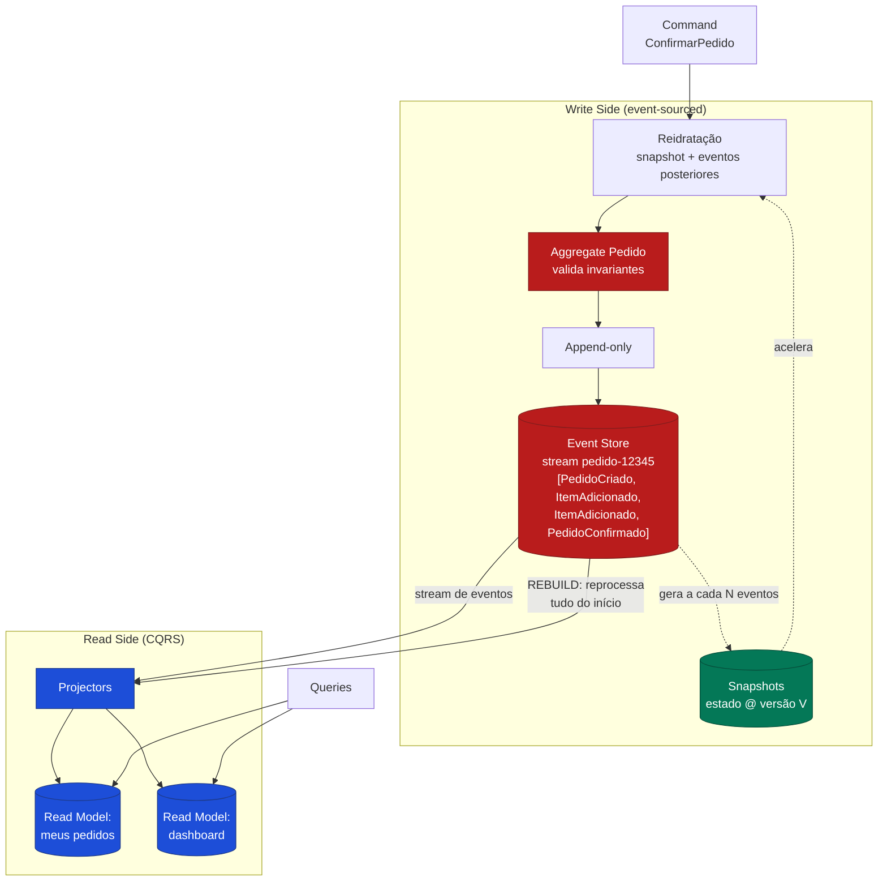

# Event Sourcing

> **Bloco:** Design tático (DDD e correlatos) · **Nível:** Intermediário/Avançado · **Tempo de leitura:** ~24 min

## TL;DR

**Event Sourcing** é o padrão em que, em vez de armazenar o **estado atual** de uma entidade, você armazena a **sequência completa de eventos** que produziram esse estado. O **event store** (log append-only de eventos) torna-se a **fonte única da verdade**, e o estado atual é **derivado** reaplicando os eventos.

Ideia central de **Martin Fowler**: sempre que mudamos o estado de um sistema, registramos essa mudança como um **evento**, e podemos reconstruir com confiança o estado do sistema reprocessando os eventos a qualquer momento no futuro.

Consequências diretas:

- **Auditoria perfeita e gratuita:** todo o histórico de mudanças está preservado por construção.
- **Time travel:** é possível determinar o estado do sistema em **qualquer ponto no tempo**, reprocessando os eventos até ali.
- **Reconstrução total:** dá para recriar todo o estado da aplicação reexecutando os eventos sobre um estado vazio.

Principais custos: **complexidade**, **dificuldade de consulta** (o log não serve queries — exige CQRS/projeções), **versionamento de schema de eventos**, e a necessidade de **snapshotting** para performance em streams longos. Greg Young é a referência central na popularização de Event Sourcing junto com CQRS.

## O problema que resolve

Sistemas tradicionais armazenam o **estado atual** e **descartam a história**. Quando você atualiza `conta.saldo = 1500`, o saldo anterior some. Isso gera limitações:

1. **Perda de informação histórica.** Você sabe *que* o saldo é 1500, mas não *como* chegou lá, nem *quando*, nem *por quê*. Reconstruir o histórico exige logs paralelos, triggers de auditoria, tabelas de histórico — soluções ad hoc, incompletas e divergentes do estado real.

2. **Auditoria como afterthought.** Em domínios regulados (financeiro, saúde, jurídico), a trilha de auditoria é requisito. Bolt-on de auditoria sobre CRUD é frágil e frequentemente diverge da verdade.

3. **Impossibilidade de responder "o que aconteceu?".** Análises temporais, debugging de "como esse registro ficou nesse estado?", reprocessamento de regras antigas — tudo difícil quando só o estado atual sobrevive.

4. **Dificuldade de derivar novas visões do passado.** Se uma nova necessidade de relatório surge, você só tem dados a partir de agora; o passado, descartado, é irrecuperável.

5. **Mismatch com domínios orientados a eventos.** Muitos domínios são **intrinsecamente** sequências de eventos (um carrinho é uma sequência de adições/remoções; uma conta é uma sequência de transações). Modelá-los como estado mutável perde essa natureza.

A origem conceitual remonta a práticas antigas (livros-razão contábeis são event sourcing manual há séculos; logs de transações de bancos de dados são event sourcing interno). **Martin Fowler** catalogou o padrão formalmente no seu artigo _Event Sourcing_ (eaaDev). **Greg Young** o popularizou na comunidade DDD, conectando-o fortemente a **CQRS** (ver [documento 04](./04-cqrs.md)) e construindo ferramentas (EventStoreDB). A natureza dos eventos como **fatos imutáveis no passado** o liga diretamente aos **Domain Events** do DDD (ver [documento 02](./02-ddd-aggregates-entities-value-objects-domain-events.md)).

## O que é (definição aprofundada)

Em Event Sourcing, o modelo de persistência inverte a relação habitual entre estado e história:

- **Event Store:** um armazenamento **append-only** de eventos, organizado por **stream** (tipicamente um stream por agregado, ex.: `pedido-12345`). Eventos nunca são alterados nem deletados — é um log imutável. Cada evento tem um número de sequência dentro do stream.

- **Eventos como fonte da verdade:** o estado atual de um agregado **não é armazenado diretamente**; é uma **função de fold (left fold / reduce)** sobre seus eventos: `estado = eventos.reduce(aplicar, estadoVazio)`. Para `pedido-12345`, você lê todos os seus eventos (`PedidoCriado`, `ItemAdicionado`, `ItemAdicionado`, `PedidoConfirmado`) e os reaplica em ordem para obter o estado corrente.

- **Comandos vs. eventos:** um **comando** (`ConfirmarPedido`) é uma intenção que **pode ser rejeitada**; ao ser aceito, o agregado valida invariantes e **emite um ou mais eventos** (`PedidoConfirmado`) que são **fatos consumados** e imutáveis. Eventos são nomeados no **passado**.

- **Reidratação (rehydration):** carregar um agregado significa ler seu stream e reaplicar os eventos para reconstruir o estado em memória, antes de processar o próximo comando.

- **Otimistic concurrency:** ao gravar novos eventos, verifica-se o número de versão esperado do stream (`expectedVersion`). Se outro processo gravou eventos no meio-tempo, há conflito e o comando é reprocessado/rejeitado. Esse é o mecanismo de controle de concorrência natural do event store.

- **Projeções (read models):** como o log de eventos é péssimo para consultas, deriva-se **read models** (visões materializadas) consumindo os eventos — exatamente o **query side** do CQRS. Por isso Event Sourcing e CQRS quase sempre andam juntos.

### Snapshotting

O grande problema de performance: reaplicar **milhares** de eventos para reidratar um agregado a cada comando é caro. Imagine uma conta com 200.000 transações — ler e reduzir 200 mil eventos a cada operação é inviável.

A solução é o **snapshot**: periodicamente (ex.: a cada N eventos), persiste-se uma **fotografia do estado** do agregado naquele número de versão. Na reidratação, em vez de começar do zero, você:

1. Carrega o snapshot mais recente (estado na versão V).
2. Lê apenas os eventos **posteriores** a V.
3. Reaplica só esses poucos eventos sobre o snapshot.

Propriedades importantes do snapshotting:

- **Snapshots são uma otimização, não a fonte da verdade.** Os eventos continuam sendo a verdade; o snapshot é descartável e reconstruível. Você pode apagar todos os snapshots e o sistema continua correto (só mais lento).
- **Snapshots são versionados** junto ao número de sequência. Se a estrutura do estado mudar, snapshots antigos podem ser invalidados e regerados a partir dos eventos.
- A frequência (cada 50, 100, 500 eventos) é um trade-off entre custo de gerar/armazenar snapshots e custo de reidratação.

## Como funciona

Ciclo de vida de um comando em um sistema event-sourced:

1. **Comando chega** (`ConfirmarPedido(pedidoId)`).

2. **Reidratação do agregado:** o repositório lê o **snapshot** mais recente do stream `pedido-{id}` (se houver) e os **eventos posteriores**, reaplicando-os para reconstruir o estado atual em memória.

3. **Processamento do comando:** o agregado valida invariantes sobre o estado reidratado. Se válido, **emite eventos** (`PedidoConfirmado`); se inválido, **rejeita** o comando.

4. **Append no event store:** os novos eventos são anexados ao stream, com verificação de `expectedVersion` (concorrência otimista). O append é a **única** escrita — atômico e append-only.

5. **Publicação para projeções:** os eventos recém-gravados são entregues aos **projectors**, que atualizam os **read models** (consistência eventual). Em muitos event stores, a leitura do log (catch-up subscriptions) é o mecanismo de entrega; alternativamente, Outbox/CDC.

6. **Snapshot eventual:** se o número de eventos desde o último snapshot ultrapassar o limiar, gera-se um novo snapshot.

7. **Queries** são servidas pelos read models, nunca pelo log diretamente.

**Rebuild (reconstrução):** uma propriedade poderosa. Para criar um read model novo (ou corrigir um corrompido), basta **reprocessar os eventos desde o início** sobre uma projeção vazia. Como os eventos são a verdade imutável, o read model resultante é correto e reproduzível. Isso permite: corrigir bugs em projeções e reprojetar; criar visões retroativas que nem existiam quando os eventos foram gravados; e debugar reproduzindo a história.

## Diagrama de fluxo



O diagrama mostra o append append-only ao event store, a reidratação acelerada por snapshots, e o rebuild dos read models reprocessando o log inteiro.

## Exemplo prático / caso real

Cenário: o **carrinho de compras** e a **conta de carteira digital** de um e-commerce brasileiro — dois casos onde Event Sourcing brilha.

**Carrinho de compras (event-sourced):**

O stream `carrinho-{sessao}` acumula eventos:

```text
CarrinhoCriado(sessao, clienteId, 14:02:01)
ItemAdicionado(sku=ABC, qtd=1, 14:03:10)
ItemAdicionado(sku=DEF, qtd=2, 14:04:55)
ItemRemovido(sku=ABC, 14:06:20)
CupomAplicado(codigo=FRETE10, 14:07:00)
CarrinhoConvertido(pedidoId, 14:09:30)
```

O estado atual do carrinho é o **fold** desses eventos. Mas o valor real está no que normalmente se perderia: o time de **analytics** pode responder "quais itens são mais frequentemente **removidos** do carrinho?" — uma pergunta impossível de responder num CRUD que só guarda o carrinho final. A jornada inteira está preservada. Funis de abandono, A/B de comportamento, tudo deriva do log sem instrumentação extra.

**Conta de carteira digital (event-sourced):**

O stream `conta-{id}` acumula `ContaAberta`, `CreditoRealizado`, `DebitoRealizado`, `EstornoRealizado`. O **saldo nunca é armazenado**; é derivado. Benefícios em domínio regulado:

- **Auditoria perfeita:** cada centavo tem origem rastreável (requisito do BACEN).
- **Time travel:** "qual era o saldo no dia 31/12 às 23:59?" → reaplique eventos até ali.
- **Reprocessamento:** se uma regra de tarifa estava errada, dá para reprocessar e recalcular.

Aqui o **snapshotting** é essencial: uma conta ativa há anos pode ter centenas de milhares de eventos. Configura-se um snapshot a cada 100 eventos; a reidratação lê o último snapshot (saldo na versão 89.700, por exemplo) e só os ~50 eventos posteriores.

**Versionamento de eventos na prática:** quando o evento `DebitoRealizado` precisou ganhar um campo `categoria`, não se podia alterar os eventos antigos (são imutáveis). A solução foi um **upcaster**: ao ler eventos da versão antiga, um tradutor os converte para a versão nova em memória (com `categoria = "nao_classificado"` como default). Eventos novos já nascem com o campo. Esse versionamento é uma das principais fontes de complexidade contínua de Event Sourcing.

## Quando usar / Quando evitar

**Quando usar Event Sourcing:**

- **Domínios onde a auditoria/histórico é requisito de primeira classe:** financeiro, contábil, saúde, jurídico, regulados em geral.
- **Domínios intrinsecamente orientados a eventos:** carrinhos, contas, workflows, sistemas de reservas, rastreamento.
- Quando há valor em **time travel**, reprocessamento e análise temporal do passado.
- Quando você quer **múltiplos read models** derivados e a capacidade de criar novas visões retroativamente.
- Quando já se adota **CQRS** e arquitetura orientada a eventos.

**Quando evitar:**

- **CRUD simples** sem necessidade de histórico. O custo é enorme e injustificado.
- Domínios com **alta necessidade de consultas ad hoc** sobre o estado e baixo valor histórico — a complexidade de manter projeções para tudo não compensa.
- Times **sem maturidade** para lidar com consistência eventual, versionamento de eventos e a inversão mental que Event Sourcing exige. A curva de aprendizado é íngreme.
- Quando regras de **privacidade/LGPD/GDPR** colidem com a imutabilidade do log (o "direito ao esquecimento" é tecnicamente difícil num store append-only — exige estratégias como criptografia por chave descartável, *crypto-shredding*).
- Quando os dados mudam de forma imprevisível e os schemas de evento mudariam constantemente — o versionamento viraria um fardo.

**Trade-offs explícitos:**

- **Vantagens:** auditoria completa, time travel, reconstrução total, read models flexíveis e reconstruíveis, debugging por replay, alinhamento natural com domínios orientados a eventos, e escrita rápida (append-only).
- **Desvantagens:** complexidade alta, log não consultável (exige CQRS), versionamento de eventos contínuo, necessidade de snapshotting para performance, consistência eventual nas leituras, dificuldade com LGPD/exclusão de dados, e curva de aprendizado/operacional significativa. Tooling e expertise de event store são pré-requisitos.

## Anti-padrões e armadilhas comuns

- **Armazenar estado em vez de eventos "para facilitar":** descaracteriza o padrão. Se você guarda o estado e os eventos, o estado pode divergir da verdade. O estado deve ser sempre **derivado**.
- **Eventos com semântica de CRUD (`PedidoAtualizado`):** eventos genéricos de "atualizado" perdem a intenção do negócio. Os eventos devem capturar **o que aconteceu no domínio** (`EnderecoEntregaAlterado`, `PedidoCancelado`), não operações de banco.
- **Não planejar versionamento desde o início:** descobrir tarde que precisa evoluir o schema de eventos e não ter estratégia de upcasting é doloroso. Versionar eventos é inevitável.
- **Esquecer o snapshotting até a performance degradar:** streams longos sem snapshot tornam a reidratação inviável. Planeje snapshots cedo.
- **Tratar snapshot como fonte da verdade:** se a lógica passa a depender do snapshot e não consegue reconstruir só dos eventos, perdeu-se a garantia fundamental.
- **Eventos com lógica/efeitos colaterais:** o `apply(evento)` deve ser uma função pura que só muta estado em memória. Disparar e-mails ou chamadas externas dentro do `apply` quebra o replay (durante um rebuild, você reenviaria tudo).
- **Acoplar consumidores ao formato interno do evento sem Published Language:** integration events para outros contextos devem ter schema versionado e estável, distinto do evento interno (ver [documento 03](./03-ddd-context-mapping-patterns-acl-shared-kernel-customer-supplier.md)).
- **Ignorar LGPD/PII no log imutável:** gravar dados pessoais sensíveis em eventos imutáveis sem estratégia de crypto-shredding cria um problema de conformidade insolúvel depois.
- **Tentar consultar o event store diretamente:** o log não é para queries. Sem CQRS/projeções, você sofre.

## Relação com outros conceitos

- **Event Sourcing ↔ CQRS:** simbiose forte. O event store é o write side (ótimo para escrever, péssimo para ler), o que **torna CQRS praticamente obrigatório** para servir leituras via projeções (ver [documento 04](./04-cqrs.md)). Mas são padrões independentes — você pode ter um sem o outro.
- **Event Sourcing ↔ Domain Events (DDD):** os eventos do event store **são** os domain events dos agregados, agora elevados de notificações a fonte da verdade (ver [documento 02](./02-ddd-aggregates-entities-value-objects-domain-events.md)). O agregado vira a fronteira de consistência e a unidade do stream.
- **Event Sourcing ↔ Outbox/Inbox:** para publicar integration events para outros serviços de forma confiável, combina-se Event Sourcing com Outbox ou CDC; consumidores usam Inbox/Idempotent Consumer (ver [documento 07](./07-outbox-e-inbox-pattern.md)).
- **Event Sourcing ↔ Saga:** sagas podem ser implementadas e auditadas naturalmente sobre eventos; o estado da saga também pode ser event-sourced (ver [documento 06](./06-saga-pattern.md)).
- **Event Sourcing ↔ Event Streaming (Kafka):** Kafka como log distribuído tem afinidade conceitual com event sourcing, mas Kafka **não é** um event store completo por si só (faltam concorrência otimista por stream, leitura eficiente por agregado). Event stores dedicados (EventStoreDB) ou bancos com tabela de eventos são mais adequados ao write side.

## Referências

- [Event Sourcing — Martin Fowler](https://martinfowler.com/eaaDev/EventSourcing.html)
- [bliki: CQRS — Martin Fowler](https://martinfowler.com/bliki/CQRS.html)
- [CQRS Documents by Greg Young (PDF)](https://cqrs.files.wordpress.com/2010/11/cqrs_documents.pdf)
- [CQRS — Greg Young's Blog](https://gregfyoung.wordpress.com/2012/03/02/cqrs/)
- [Domain Event — Martin Fowler](https://martinfowler.com/eaaDev/DomainEvent.html)
- [tagged by: event architectures — Martin Fowler](https://martinfowler.com/tags/event%20architectures.html)
- [Pattern: Event sourcing — microservices.io](https://microservices.io/patterns/data/event-sourcing.html)
