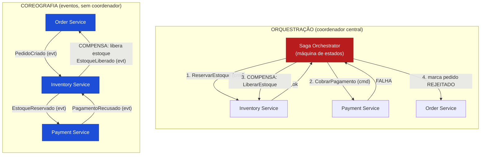

# Saga Pattern: Orquestração vs. Coreografia para Transações Distribuídas

> **Bloco:** Design tático (DDD e correlatos) · **Nível:** Intermediário/Avançado · **Tempo de leitura:** ~24 min

## TL;DR

Em uma arquitetura de **microsserviços** com **database per service** (cada serviço dono do seu banco), uma operação de negócio frequentemente precisa atualizar dados em **vários** serviços. Não há transação ACID distribuída viável (2PC não escala e acopla os serviços). A **Saga** resolve isso:

Uma **saga** é uma **sequência de transações locais**. Cada transação local atualiza o banco de **um** serviço e dispara a próxima etapa. Se uma etapa falha, a saga executa **transações de compensação (compensating transactions)** que **desfazem** o efeito das etapas anteriores.

Há duas formas de coordenar:

- **Coreografia (choreography):** sem coordenador central. Cada serviço publica **eventos** e reage a eventos dos outros. A lógica de coordenação é **descentralizada**.
- **Orquestração (orchestration):** um **orquestrador** central (a saga) comanda cada serviço, dizendo qual operação executar, mantém o estado da saga e decide a próxima etapa.

O preço fundamental: a saga **troca isolamento (a "I" do ACID) por disponibilidade e escalabilidade**. Sem isolamento, surgem anomalias (dirty reads, lost updates) que exigem contramedidas (semantic lock, commutative updates etc.). A referência canônica é **Chris Richardson (microservices.io)**, baseada no paper original de **Garcia-Molina & Salem (1987)**.

## O problema que resolve

Com **database per service**, cada microsserviço tem seu próprio banco e ninguém acessa o banco do outro diretamente. Isso é ótimo para autonomia e desacoplamento, mas cria um problema: **como manter consistência em uma operação que abrange múltiplos serviços?**

Exemplo: confirmar um pedido envolve os serviços de **Pedidos**, **Pagamento**, **Estoque** e **Entrega**, cada um com seu banco. Você precisa: criar o pedido, cobrar o cartão, reservar o estoque, agendar a entrega. Se a cobrança falha, o pedido não pode ficar criado; se o estoque acaba, o pagamento precisa ser estornado.

As alternativas inviáveis:

1. **Transação distribuída com 2PC (Two-Phase Commit):** exige um coordenador transacional e que todos os bancos participem de um protocolo bloqueante. **Não escala** (locks distribuídos longos), **reduz disponibilidade** (se o coordenador ou um participante cai, tudo trava), e muitos bancos NoSQL/brokers nem suportam. 2PC é incompatível com a filosofia de microsserviços.

2. **Ignorar a consistência:** leva a estados inconsistentes (pedido pago sem estoque, estoque reservado sem pagamento).

A **Saga** oferece o meio-termo: **consistência eventual** mantida por uma sequência de transações locais (cada uma ACID no seu serviço) coordenadas, com compensações para lidar com falhas. O padrão vem do paper **"Sagas" de Hector Garcia-Molina e Kenneth Salem (1987)**, originalmente para LLTs (long-lived transactions) em bancos de dados, e foi adaptado para microsserviços por **Chris Richardson**, que o catalogou em **microservices.io** como parte do conjunto de padrões de gerenciamento de dados distribuídos.

## O que é (definição aprofundada)

Uma **saga** implementa uma transação de negócio que abrange múltiplos serviços como uma **sequência de transações locais**, onde cada transação local:

- Atualiza o banco de **um único** serviço (ACID local).
- **Publica um evento** ou **envia um comando** que dispara a próxima transação local da saga.

Se uma transação local falha (por violar uma regra de negócio, não por erro de infra), a saga executa uma série de **transações de compensação** que desfazem as mudanças feitas pelas transações locais anteriores.

Conceitos centrais:

- **Compensating Transaction (transação de compensação):** desfaz **semanticamente** o efeito de uma transação local já confirmada. Como o commit já ocorreu, você **não pode dar rollback** — precisa de uma operação inversa de negócio. O inverso de "cobrar R$ 100" não é apagar a linha, é "estornar R$ 100" (que pode aparecer no extrato do cliente). Compensações precisam ser **idempotentes** e projetadas explicitamente.

- **Tipos de transação na saga (classificação de Richardson):**
  - **Compensável (compensatable):** transações que podem ser desfeitas por uma compensação.
  - **Pivot (ponto de virada):** a transação que decide o destino da saga. Uma vez que o pivot é confirmado, a saga **vai até o fim** (não compensa mais para trás). Pode ser a última compensável ou a primeira retriable.
  - **Retriable (retentável):** transações **após** o pivot, que devem ter sucesso garantido (com retry), pois não há mais como voltar.

- **Falta de isolamento (o ponto crítico):** sagas **sacrificam a isolação (I do ACID)**. Como cada transação local commita imediatamente, outras transações podem **ver estados intermediários** da saga. Isso gera anomalias clássicas:
  - **Lost updates:** uma saga sobrescreve mudança de outra.
  - **Dirty reads:** uma saga lê dado que outra ainda não confirmou (e que pode ser compensado).
  - **Fuzzy/non-repeatable reads:** leituras diferentes em momentos diferentes da saga.

- **Contramedidas (countermeasures)** para a falta de isolamento:
  - **Semantic Lock:** marcar o registro com um status (`PENDENTE`, `LOCKED`, `IN_PROGRESS`) que sinaliza que uma saga está em andamento, impedindo outras sagas/leituras de tratá-lo como final. Combinada com timeout, evita dirty writes.
  - **Commutative Updates:** projetar operações comutativas (a ordem não importa), como créditos/débitos que somam, reduzindo lost updates.
  - **Pessimistic View:** reordenar a saga para minimizar o risco de negócio (ex.: debitar por último).
  - **Reread Value:** reler o valor antes de atualizar para detectar mudanças.
  - **Version File / By Value:** registrar operações para detectar fora de ordem; escolher a estratégia (saga vs. transação distribuída) conforme o risco de negócio da requisição.

### Coreografia vs. Orquestração

**Coreografia (choreography):**

- **Não há coordenador central.** Cada serviço executa sua transação local e **publica eventos**; outros serviços **assinam** esses eventos e reagem.
- A lógica de coordenação é **distribuída** entre os participantes.
- Acoplamento por eventos, fluxo emergente.

**Orquestração (orchestration):**

- Há um **orquestrador** central (a saga, frequentemente uma máquina de estados) que **comanda** cada participante via comandos (`ReservarEstoque`), recebe as respostas, **mantém o estado** da saga e **decide a próxima etapa** (incluindo disparar compensações em caso de falha).
- A lógica de coordenação é **centralizada** no orquestrador.

## Como funciona

**Fluxo de orquestração (caminho feliz + compensação):**

1. O **Order Service** recebe `CriarPedido`, cria o pedido com status `PENDENTE` (semantic lock) e instancia o **Saga Orchestrator**.
2. O orquestrador envia o comando `ReservarEstoque` ao **Inventory Service**. Resposta: sucesso.
3. O orquestrador envia `CobrarPagamento` ao **Payment Service** (este é o **pivot**). Resposta: **falha** (cartão recusado).
4. Como o pivot falhou, o orquestrador dispara as **compensações** em ordem reversa: envia `LiberarEstoque` ao Inventory Service.
5. O orquestrador marca o pedido como `REJEITADO` (libera o semantic lock).

**Fluxo de coreografia (mesmo cenário):**

1. Order Service cria pedido `PENDENTE` e publica `PedidoCriado`.
2. Inventory Service consome `PedidoCriado`, reserva estoque, publica `EstoqueReservado`.
3. Payment Service consome `EstoqueReservado`, tenta cobrar, **falha**, publica `PagamentoRecusado`.
4. Inventory Service consome `PagamentoRecusado` e **compensa** (libera estoque), publica `EstoqueLiberado`.
5. Order Service consome `PagamentoRecusado` (ou `EstoqueLiberado`) e marca o pedido `REJEITADO`.

Pré-requisitos transversais a ambas as formas:

- **Mensageria confiável + atomicidade:** cada serviço deve publicar seu evento/comando **atomicamente** com o commit da transação local — caso contrário, a saga "trava silenciosamente" (commit sem publicação). Isso exige o **Outbox Pattern** (ver [documento 07](./07-outbox-e-inbox-pattern.md)).
- **Idempotência dos consumidores:** com entrega at-least-once, mensagens chegam duplicadas; os handlers (e compensações) devem ser idempotentes (**Inbox / Idempotent Consumer**).
- **Tratamento de timeouts e falhas de infra:** o orquestrador/coreografia precisa lidar com respostas que nunca chegam.

## Diagrama de fluxo

Na orquestração há uma seta central de comando/resposta e compensação explícita disparada pelo orquestrador. Na coreografia, o fluxo emerge da cadeia de eventos publicados/consumidos, e a compensação é uma reação local a um evento de falha.

## Exemplo prático / caso real

Cenário: **checkout de um e-commerce brasileiro** envolvendo Pedidos, Pagamento (gateway + antifraude), Estoque e Entrega (transportadora).

Operação de negócio: confirmar pedido = reservar estoque, cobrar cartão, agendar coleta. Quatro serviços, quatro bancos.

**Modelagem da saga (orquestração escolhida, por ser fluxo complexo):**

1. **Pedido** criado com status `AGUARDANDO_PAGAMENTO` (semantic lock — o pedido não aparece como "concluído" em nenhuma tela enquanto a saga roda).
2. **Reservar Estoque** (compensável) → compensação: `LiberarReservaEstoque`.
3. **Cobrar Pagamento** (este é o **pivot**) → se aprovado, a saga vai até o fim.
4. **Agendar Coleta** na transportadora (retriable — após o pagamento aprovado, tem que dar certo, com retry e fallback).
5. Marcar pedido como `CONFIRMADO` (libera o semantic lock).

**Cenário de falha (estoque some entre etapas, ou pagamento recusado):**

- Se o **pagamento é recusado** (antes do pivot confirmar), o orquestrador dispara `LiberarReservaEstoque` e marca o pedido `CANCELADO_PAGAMENTO`. Importante: a "compensação" do estoque não é deletar a reserva fisicamente sem cuidado — é uma operação de negócio que devolve as unidades ao saldo disponível, idempotente (se chegar duplicada, não libera duas vezes).

- Se a **coleta falha após o pagamento aprovado** (pós-pivot), a saga **não compensa o pagamento automaticamente** — ela faz **retry** do agendamento (retriable). Se esgotar, escala para intervenção (não estorna silenciosamente, pois o cliente já pagou e o produto existe; é uma decisão de negócio).

**Por que semantic lock importa aqui:** durante a saga, o estoque está "reservado mas não confirmado". Sem o lock semântico, outra saga (outro cliente comprando o último item) poderia ler o estoque como disponível e gerar overselling. O status `RESERVADO` impede isso. Com um **timeout** na reserva, evita-se que uma saga travada bloqueie o item para sempre.

**Outbox em ação:** quando o Payment Service confirma a cobrança e precisa avisar o orquestrador, ele grava a resposta na sua tabela outbox **na mesma transação** do registro do pagamento. Um relay publica depois. Assim, nunca acontece "cobrei mas a saga não soube" (que deixaria o pedido eternamente pendente) — ver [documento 07](./07-outbox-e-inbox-pattern.md).

## Quando usar / Quando evitar

**Quando usar Saga:**

- Operações de negócio que **abrangem múltiplos serviços** com **database per service**, onde se precisa de consistência sem transação distribuída.
- Quando **consistência eventual é aceitável** para a operação (a maioria dos fluxos de negócio tolera).
- Quando há **mensageria confiável** e os times dominam idempotência e compensação.

**Orquestração vs. Coreografia — quando escolher cada uma:**

- **Coreografia** para fluxos **simples** (poucas etapas, lógica linear), onde adicionar um orquestrador é overhead. Vantagem: baixo acoplamento, sem ponto central. Desvantagem: o fluxo fica **implícito e espalhado** — difícil de entender e debugar com muitas etapas; risco de **dependências cíclicas** entre serviços e de "ninguém sabe o estado da saga".
- **Orquestração** para fluxos **complexos** (muitas etapas, ramificações, compensações intrincadas). Vantagem: lógica **centralizada e explícita**, fácil de visualizar/monitorar, estado da saga em um lugar. Desvantagem: o orquestrador pode virar um ponto de acoplamento/God Object se acumular lógica de negócio demais; é mais infraestrutura.

**Quando evitar Saga:**

- Quando a operação cabe em **um único serviço/agregado** — use uma transação ACID local, não invente saga.
- Quando o negócio **exige isolamento forte** e não tolera anomalias nem estados intermediários visíveis (sagas sacrificam isolamento).
- Quando **consistência eventual é inaceitável** (raros casos genuínos).
- Em sistemas pequenos/monolíticos onde a complexidade não se paga.

**Trade-offs:** sagas trocam **isolamento por disponibilidade e escalabilidade**. Ganha-se a capacidade de operar sobre múltiplos serviços sem 2PC; paga-se com complexidade de compensação, anomalias de isolamento (e suas contramedidas), e dificuldade de raciocínio/observabilidade do fluxo distribuído.

## Anti-padrões e armadilhas comuns

- **Esquecer as compensações:** modelar só o caminho feliz. Toda transação compensável **precisa** de sua compensação projetada, idempotente e testada. Compensação é cidadã de primeira classe, não afterthought.
- **Achar que compensação é rollback:** o commit já ocorreu; compensar é uma **operação de negócio inversa**, que pode ter efeitos visíveis (estorno aparece no extrato). Não dá para "fazer como se nada tivesse acontecido".
- **Ignorar a falta de isolamento:** não aplicar semantic lock/commutative updates e sofrer overselling, dirty reads, lost updates. A "I" do ACID não existe — você tem que reintroduzir o que precisar manualmente.
- **Saga sem Outbox:** publicar evento/resposta fora da transação local cria a lacuna "commitei mas não publiquei", deixando a saga travada silenciosamente. Use Outbox (ver [documento 07](./07-outbox-e-inbox-pattern.md)).
- **Consumidores não idempotentes:** com at-least-once, mensagens duplicam; processar duas vezes (cobrar duas vezes, compensar duas vezes) é desastroso. Use Inbox/Idempotent Consumer.
- **Coreografia para fluxos complexos:** o fluxo vira uma teia implícita de eventos impossível de seguir, com risco de ciclos. Acima de ~3-4 etapas com ramificações, prefira orquestração.
- **Orquestrador anêmico ou God Object:** ou o orquestrador não tem responsabilidade clara, ou acumula toda a lógica de negócio dos serviços. Ele deve **coordenar**, não conter as regras de domínio dos participantes.
- **Não tratar pivot/retriable:** após o pivot, etapas devem ter sucesso garantido (retry); tentar compensar pós-pivot quebra a semântica. Classifique as transações.
- **Compensação que falha sem plano:** e se a própria compensação falhar? Precisa de retry, dead-letter e, em último caso, escalonamento humano.

## Relação com outros conceitos

- **Saga ↔ Database per Service:** a saga só existe porque cada serviço tem seu banco e não há transação ACID global. É a resposta ao trade-off do database per service.
- **Saga ↔ Outbox Pattern:** dependência prática forte. Cada etapa da saga precisa publicar seu resultado atomicamente com o commit local, o que exige Outbox (ver [documento 07](./07-outbox-e-inbox-pattern.md)). "Saga + Outbox" é uma dupla recorrente.
- **Saga ↔ Inbox / Idempotent Consumer:** os participantes consomem comandos/eventos com entrega at-least-once; precisam deduplicar via Inbox.
- **Saga ↔ Domain Events (DDD):** na coreografia, os eventos que dirigem a saga são domain/integration events publicados pelos agregados (ver [documento 02](./02-ddd-aggregates-entities-value-objects-domain-events.md)).
- **Saga ↔ Bounded Contexts:** cada participante da saga é tipicamente um Bounded Context/serviço distinto; a saga é uma forma de Context Mapping em tempo de execução (ver [documento 01](./01-ddd-bounded-contexts-context-mapping-ubiquitous-language.md)).
- **Saga ↔ Event Sourcing:** o estado da saga e seu progresso podem ser event-sourced, dando auditoria completa do fluxo distribuído (ver [documento 05](./05-event-sourcing.md)).
- **Saga ↔ 2PC:** são as duas respostas opostas para consistência distribuída. 2PC prioriza isolamento/consistência forte ao custo de disponibilidade e escala; Saga prioriza disponibilidade/escala ao custo de isolamento.

## Referências

- [Pattern: Saga — microservices.io (Chris Richardson)](https://microservices.io/patterns/data/saga.html)
- [Pattern: Database per service — microservices.io](https://microservices.io/patterns/data/database-per-service.html)
- [Pattern: Transactional outbox — microservices.io](https://microservices.io/patterns/data/transactional-outbox.html)
- [A pattern language for microservices — microservices.io](https://microservices.io/patterns/)
- [Anti-Corruption Layer pattern — Azure Architecture Center, Microsoft Learn](https://learn.microsoft.com/en-us/azure/architecture/patterns/anti-corruption-layer)
- [Saga Pattern in Microservices: A Mastery Guide — Temporal](https://temporal.io/blog/mastering-saga-patterns-for-distributed-transactions-in-microservices)
