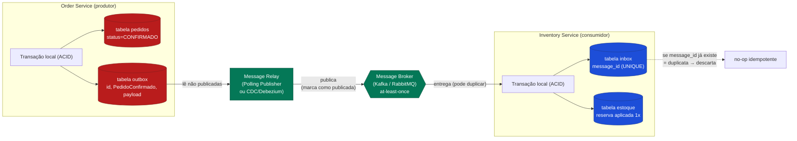

# Outbox Pattern e Inbox Pattern para Consistência Eventual Confiável

> **Bloco:** Design tático (DDD e correlatos) · **Nível:** Intermediário/Avançado · **Tempo de leitura:** ~22 min

## TL;DR

Quando um serviço precisa **atualizar seu banco** E **publicar uma mensagem/evento** como parte da mesma operação de negócio, surge o **problema da dupla escrita (dual write)**: são dois sistemas distintos (o banco e o broker) e não há transação atômica entre eles. Se um falha e o outro não, o sistema fica inconsistente: ou você commitou mas não publicou (consumidores nunca souberam), ou publicou mas não commitou (consumidores reagiram a algo que não aconteceu).

- **Transactional Outbox Pattern (lado do produtor):** em vez de publicar diretamente no broker, o serviço grava o evento em uma **tabela `outbox`** no **mesmo banco e na mesma transação** que a mudança de negócio. Como é uma única transação ACID local, ou as duas escritas acontecem ou nenhuma acontece. Um processo separado — o **Message Relay** — lê a tabela outbox e publica no broker (via polling ou **CDC/Change Data Capture**, ex.: Debezium). Garante que o evento é publicado **se e somente se** a transação local teve sucesso.

- **Inbox Pattern / Idempotent Consumer (lado do consumidor):** como os brokers usam entrega **at-least-once**, o consumidor pode receber a **mesma mensagem mais de uma vez**. O consumidor registra os **IDs das mensagens já processadas** em uma tabela `inbox` (no mesmo banco, na mesma transação do processamento) e **descarta duplicatas**, garantindo **idempotência** no consumo.

Juntos, Outbox (produção confiável) + Inbox (consumo idempotente) formam a espinha dorsal da **consistência eventual confiável** em sistemas distribuídos. Referência canônica: **Chris Richardson (microservices.io)**.

## O problema que resolve

Considere um Order Service que, ao confirmar um pedido, precisa: (1) gravar o pedido como `CONFIRMADO` no seu banco e (2) publicar o evento `PedidoConfirmado` no Kafka para que Estoque, Faturamento e Notificações reajam (uma **Saga** por coreografia — ver [documento 06](./06-saga-pattern.md)).

A tentação ingênua: dentro do método, faça `db.commit()` e depois `kafka.publish()`. Isso é uma **dupla escrita**, e ela falha de duas formas:

1. **Commit OK, publish falha** (broker indisponível, crash do processo entre as duas operações): o pedido está confirmado no banco, mas **nenhum evento foi publicado**. Estoque nunca reserva, Faturamento nunca emite NF. A saga **trava silenciosamente** — nenhum erro visível, só um pedido que nunca progride. Este é o cenário mais perigoso porque é silencioso.

2. **Publish OK, commit falha** (rollback após publicar): consumidores recebem `PedidoConfirmado` e reagem (reservam estoque, emitem NF) a um pedido que, no banco do Order Service, **não foi confirmado**. Inconsistência grave.

Inverter a ordem não resolve — apenas troca qual dos dois cenários ocorre. **Não existe** transação ACID que abranja um RDBMS e um message broker (e 2PC entre eles, além de raramente suportado, traria os problemas de acoplamento e disponibilidade já discutidos na saga).

Do lado do consumidor, há o problema espelhado: brokers garantem **at-least-once delivery** — eles entregam a mensagem, mas podem entregá-la **de novo** (se o ack se perde, se há rebalanceamento, se o consumidor crasha após processar mas antes de confirmar). Processar a mesma mensagem duas vezes pode significar **cobrar o cliente duas vezes**, **reservar estoque em dobro**, **enviar dois e-mails**. O consumidor precisa ser **idempotente**.

Esses padrões foram catalogados por **Chris Richardson** em **microservices.io** (Transactional Outbox, Polling Publisher, Transaction Log Tailing, Idempotent Consumer), no contexto de gerenciamento de dados em microsserviços. O Inbox é frequentemente descrito como a contraparte de consumo do Idempotent Consumer.

## O que é (definição aprofundada)

### Transactional Outbox

A ideia central: transformar a dupla escrita em uma **escrita única local**, aproveitando que o banco do serviço **é** transacional.

- **Tabela `outbox`:** uma tabela no mesmo banco do serviço, contendo as mensagens a publicar: `id` (UUID, será o ID da mensagem), `aggregate_type`, `aggregate_id`, `event_type`, `payload`, `created_at`, e tipicamente um marcador de status/publicação.
- **Escrita atômica:** quando o serviço executa a operação de negócio, ele grava a mudança de negócio **E** a linha na outbox **na mesma transação ACID local**. Ou ambas persistem, ou nenhuma. O dual write desaparece — agora é um single write.
- **Message Relay (publicador):** um processo separado lê as linhas não publicadas da outbox e as **publica no broker**, marcando-as como publicadas (ou removendo-as). Duas implementações:
  - **Polling Publisher:** o relay faz polling periódico (`SELECT ... WHERE published = false ORDER BY created_at`), publica e marca. Simples, mas adiciona latência e carga de polling no banco.
  - **Transaction Log Tailing (CDC):** o relay lê o **log de transações** do banco (binlog do MySQL, WAL do PostgreSQL) via uma ferramenta de **Change Data Capture** como **Debezium**, detectando inserts na tabela outbox e publicando-os. Mais eficiente e de menor latência, sem poluir o banco com polling, mas requer infraestrutura de CDC.

**Garantia resultante:** o evento é publicado **se e somente se** a transação local foi confirmada. A publicação em si ainda é **at-least-once** (o relay pode publicar, crashar antes de marcar como publicado, e republicar na recuperação) — por isso o consumidor **precisa ser idempotente**. Outbox não dá exactly-once de publicação; dá garantia de que nenhum evento se perde e nenhum evento "fantasma" é publicado.

### Inbox Pattern / Idempotent Consumer

A contraparte no consumidor, para lidar com a entrega at-least-once (e com as republicações do próprio relay):

- **Tabela `inbox` (ou `processed_messages`):** registra os **IDs das mensagens já processadas**.
- **Deduplicação atômica:** ao receber uma mensagem, o consumidor, **na mesma transação** em que aplica o efeito de negócio, verifica/insere o ID da mensagem na inbox. Se o ID já existe, é **duplicata** → descarta (ou trata como no-op). Se é novo, processa o efeito de negócio e grava o ID, tudo atomicamente. Assim, mesmo recebendo a mensagem N vezes, o efeito é aplicado **uma única vez**.
- **Idempotência por design (alternativa/complemento):** quando a operação é **naturalmente idempotente** (ex.: `setStatus(CONFIRMADO)` aplicado duas vezes dá o mesmo resultado; ou um upsert por chave), a tabela inbox pode ser desnecessária. Mas para operações com efeito acumulativo (creditar, decrementar estoque, enviar e-mail), a deduplicação explícita via inbox é essencial.

O Inbox também desacopla o **recebimento** do **processamento**: o consumidor pode gravar a mensagem na inbox rapidamente (ack ao broker) e processá-la depois de forma confiável, espelhando o papel do outbox no produtor.

## Como funciona

**Lado produtor (Outbox) — fluxo:**

1. O serviço inicia uma **transação local**.
2. Aplica a mudança de negócio (ex.: `UPDATE pedidos SET status='CONFIRMADO'`).
3. **Na mesma transação**, insere a mensagem na `outbox` (`INSERT INTO outbox (id, event_type, payload, ...) VALUES (...)`).
4. **Commit.** Atômico: ou pedido + outbox, ou nada.
5. O **Message Relay** (polling ou CDC) detecta a nova linha, **publica** no broker.
6. O relay **marca** a linha como publicada (ou a remove). Se crashar entre publicar e marcar, republica na recuperação (at-least-once).

**Lado consumidor (Inbox) — fluxo:**

1. Consumidor recebe a mensagem (com seu `message_id`).
2. Inicia uma **transação local**.
3. Tenta inserir `message_id` na `inbox`. Se viola unicidade → **duplicata**, aborta/descarta (no-op idempotente).
4. Se inserção OK → aplica o **efeito de negócio** (ex.: reserva estoque) **na mesma transação**.
5. **Commit.** O efeito e o registro de processamento são atômicos.
6. **Ack** ao broker. Se o ack se perde e a mensagem é reentregue, o passo 3 a detecta como duplicata.

**Composição com Saga:** em uma saga (ver [documento 06](./06-saga-pattern.md)), cada serviço participante usa **Outbox** para publicar suas respostas/eventos atomicamente com o commit local, e **Inbox** para consumir comandos/eventos de forma idempotente. Sem Outbox, a saga trava silenciosamente; sem Inbox, etapas podem ser executadas em duplicidade (cobrar duas vezes, compensar duas vezes).

**Limpeza:** a tabela outbox precisa de purga (deletar publicadas antigas) e a inbox de retenção controlada (manter IDs por uma janela suficiente para cobrir o atraso máximo de reentrega, depois purgar). Sem isso, as tabelas crescem indefinidamente.

## Diagrama de fluxo



No produtor, a mudança de negócio e a linha de outbox são gravadas na mesma transação. O relay publica de forma assíncrona. No consumidor, o registro na inbox e o efeito de negócio são gravados na mesma transação, deduplicando reentregas.

## Exemplo prático / caso real

Cenário: o **checkout** de um e-commerce brasileiro. O Order Service confirma o pedido e precisa avisar Estoque, Faturamento (emissão de NF-e) e Notificações.

**Sem Outbox (o bug clássico em produção):**

Durante a Black Friday, o Kafka teve um pico de latência. Um pedido foi confirmado no banco (`commit` OK), mas a chamada `kafka.publish("PedidoConfirmado")` deu timeout logo em seguida. O pedido ficou `CONFIRMADO` no Order Service, mas Estoque nunca reservou e a NF-e nunca foi emitida. O cliente pagou, viu "pedido confirmado", e o produto nunca saiu — porque o evento se perdeu na lacuna do dual write. Não houve nenhum erro logado de forma óbvia; o pedido simplesmente "sumiu" do fluxo. Esse é o cenário silencioso e perigoso que justifica o Outbox.

**Com Outbox:**

```text
BEGIN;
  UPDATE pedidos SET status = 'CONFIRMADO' WHERE id = 12345;
  INSERT INTO outbox (id, aggregate_id, event_type, payload, created_at)
    VALUES ('a1b2-uuid', 12345, 'PedidoConfirmado', '{...}', now());
COMMIT;
```

Se o commit falha, **nada** acontece (nem pedido, nem evento). Se o commit tem sucesso, a linha está garantidamente na outbox. O **Debezium** (CDC sobre o WAL do PostgreSQL) detecta o insert e publica no Kafka. Mesmo que o Order Service crashe logo após o commit, o evento será publicado quando o relay processar o log — nunca se perde.

**Com Inbox no Inventory Service:**

O Kafka, sob carga, reentregou `PedidoConfirmado` (UUID `a1b2-uuid`) duas vezes para o Inventory Service. Com a inbox:

```text
BEGIN;
  INSERT INTO inbox (message_id) VALUES ('a1b2-uuid');  -- 2ª vez: viola UNIQUE
  -- só executa se o insert acima passou:
  UPDATE estoque SET reservado = reservado + 1 WHERE sku = 'ABC';
COMMIT;
```

Na segunda entrega, o `INSERT` viola a constraint de unicidade → a transação aborta sem reservar de novo. **O estoque é reservado exatamente uma vez**, apesar da entrega duplicada. Sem isso, o item teria sido reservado duas vezes, causando overselling fantasma.

**Idempotência natural onde possível:** para Notificações, em vez de inbox, o serviço usa uma chave de idempotência no provedor de e-mail (`Idempotency-Key: a1b2-uuid`), que dedupe no lado do provedor. Para Faturamento, a emissão de NF-e usa o `pedidoId` como chave idempotente (uma NF por pedido), evitando notas duplicadas mesmo sem inbox.

## Quando usar / Quando evitar

**Quando usar Outbox:**

- **Sempre** que um serviço precisa atualizar seu banco **e** publicar mensagens como parte da mesma operação de negócio, e a perda/duplicação espúria de eventos é inaceitável. É o padrão padrão (default) para publicação confiável de eventos em microsserviços.
- Em **Sagas**, **CQRS** (sincronização write → read) e **Event Sourcing** (publicação de integration events) — todos dependem de publicação confiável.

**Quando usar Inbox / Idempotent Consumer:**

- **Sempre** que se consome de um broker com entrega at-least-once (praticamente todos) e o processamento tem **efeitos não idempotentes** (cobrança, decremento, envio, contagem).
- Quando não dá para tornar a operação naturalmente idempotente.

**Quando evitar / simplificar:**

- **Outbox:** se o serviço não publica eventos, ou se a publicação pode ser perdida sem consequência (raríssimo), o overhead não se justifica. Em sistemas que já têm um event store com subscriptions confiáveis (Event Sourcing), o mecanismo de leitura do log pode substituir o relay de outbox.
- **Inbox:** se a operação é **naturalmente idempotente** (upsert por chave, set de status, operação comutativa com guarda), a tabela inbox pode ser dispensada — prefira idempotência por design, que é mais simples e barata.
- Quando há **uma única escrita** (só banco, sem publicação) ou **só publicação** (sem estado local) — não há dual write, não precisa de outbox.

**Trade-offs:**

- **Outbox:** adiciona uma tabela, um processo relay (com CDC, mais infra), latência de publicação (especialmente no polling), e necessidade de purga. Em troca: elimina o dual write e garante que eventos não se percam nem sejam fantasmas.
- **Inbox:** adiciona uma tabela e uma verificação por mensagem (custo de escrita/consulta), e retenção/purga de IDs. Em troca: garante idempotência de consumo. Ordem de entrega ainda pode ser um problema separado (Outbox/Inbox cuidam de entrega e duplicação, não de ordenação estrita).

## Anti-padrões e armadilhas comuns

- **Dual write ingênuo:** `db.commit()` seguido de `broker.publish()` (ou vice-versa). É exatamente o que Outbox existe para eliminar. Continua sendo o erro mais comum em sistemas que "evoluíram" para eventos sem o padrão.
- **Publicar dentro da transação de negócio:** chamar o broker antes do commit, dentro da transação — se o commit falhar, o evento já foi publicado (fantasma). A publicação deve ser **após** o commit, e o Outbox a desacopla justamente para evitar essa armadilha.
- **Esquecer a purga da outbox/inbox:** as tabelas crescem indefinidamente, degradando o banco. Precisa de retenção e limpeza.
- **Assumir que Outbox dá exactly-once de publicação:** dá at-least-once. O relay pode republicar. Sem consumidor idempotente, você tem duplicatas processadas. Outbox e Inbox são complementares, não substitutos.
- **Inbox sem atomicidade:** registrar o ID processado em uma transação separada do efeito de negócio. Se crashar entre as duas, você tem o efeito sem o registro (vai reprocessar) ou o registro sem o efeito (vai perder). Ambos na mesma transação local.
- **Confiar em idempotência natural que não existe:** assumir que "processar duas vezes não tem problema" sem analisar. `enviarEmail`, `cobrar`, `incrementarContador` **não** são idempotentes.
- **CDC sem cuidado com schema/ordem:** Transaction Log Tailing publica na ordem do log; mudanças de schema na tabela outbox e configuração de tópicos/particionamento precisam preservar a ordenação por agregado quando ela importa.
- **Ignorar ordenação:** Outbox/Inbox resolvem perda e duplicação, **não** garantem ordenação global. Se a ordem importa, use particionamento por chave de agregado (ex.: partition key = aggregate_id no Kafka) e processamento ordenado por partição.
- **Payload acoplado ao modelo interno:** gravar na outbox o modelo de domínio interno em vez de um integration event versionado (Published Language) acopla consumidores ao seu modelo (ver [documento 03](./03-ddd-context-mapping-patterns-acl-shared-kernel-customer-supplier.md)).

## Relação com outros conceitos

- **Outbox ↔ Saga:** dependência forte. Cada etapa de uma saga (ver [documento 06](./06-saga-pattern.md)) publica seu resultado atomicamente com o commit local via Outbox; sem ele a saga trava silenciosamente. "Saga + Outbox + Inbox" é o tripé da consistência eventual confiável.
- **Outbox ↔ CQRS:** a sincronização write → read em CQRS (ver [documento 04](./04-cqrs.md)) usa Outbox para publicar de forma confiável os eventos que alimentam as projeções dos read models.
- **Outbox ↔ Event Sourcing:** para publicar integration events de um sistema event-sourced (ver [documento 05](./05-event-sourcing.md)), combina-se com Outbox ou se aproveita a leitura do próprio event store.
- **Outbox ↔ Domain Events (DDD):** os eventos gravados na outbox são tipicamente integration events derivados dos domain events dos agregados (ver [documento 02](./02-ddd-aggregates-entities-value-objects-domain-events.md)).
- **Inbox ↔ Idempotent Consumer:** Inbox é a implementação concreta do padrão Idempotent Consumer de Richardson — registrar IDs processados para descartar duplicatas.
- **Outbox ↔ Database per Service:** o padrão pressupõe que cada serviço tem seu próprio banco transacional, onde a outbox vive ao lado dos dados de negócio.
- **Outbox/Inbox ↔ CDC (Change Data Capture):** Transaction Log Tailing via Debezium é a implementação de alta eficiência do Message Relay, conectando o padrão à infraestrutura de streaming.

## Referências

- [Pattern: Transactional outbox — microservices.io (Chris Richardson)](https://microservices.io/patterns/data/transactional-outbox.html)
- [Pattern: Idempotent Consumer — microservices.io](https://microservices.io/patterns/communication-style/idempotent-consumer.html)
- [Handling duplicate messages using the Idempotent consumer pattern — microservices.io](https://microservices.io/post/microservices/patterns/2020/10/16/idempotent-consumer.html)
- [Pattern: Database per service — microservices.io](https://microservices.io/patterns/data/database-per-service.html)
- [Pattern: Saga — microservices.io](https://microservices.io/patterns/data/saga.html)
- [A pattern language for microservices — microservices.io](https://microservices.io/patterns/)
- [Event Patterns: Idempotent Consumer (or Inbox) — Oleg Potapov (Medium)](https://oleg0potapov.medium.com/event-patterns-idempotent-consumer-or-inbox-b2812bf6656a)
