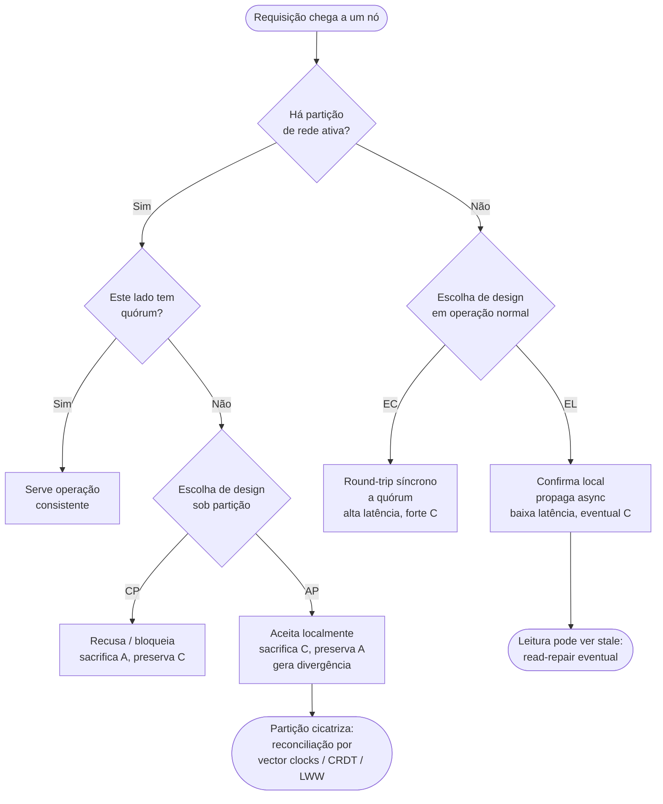
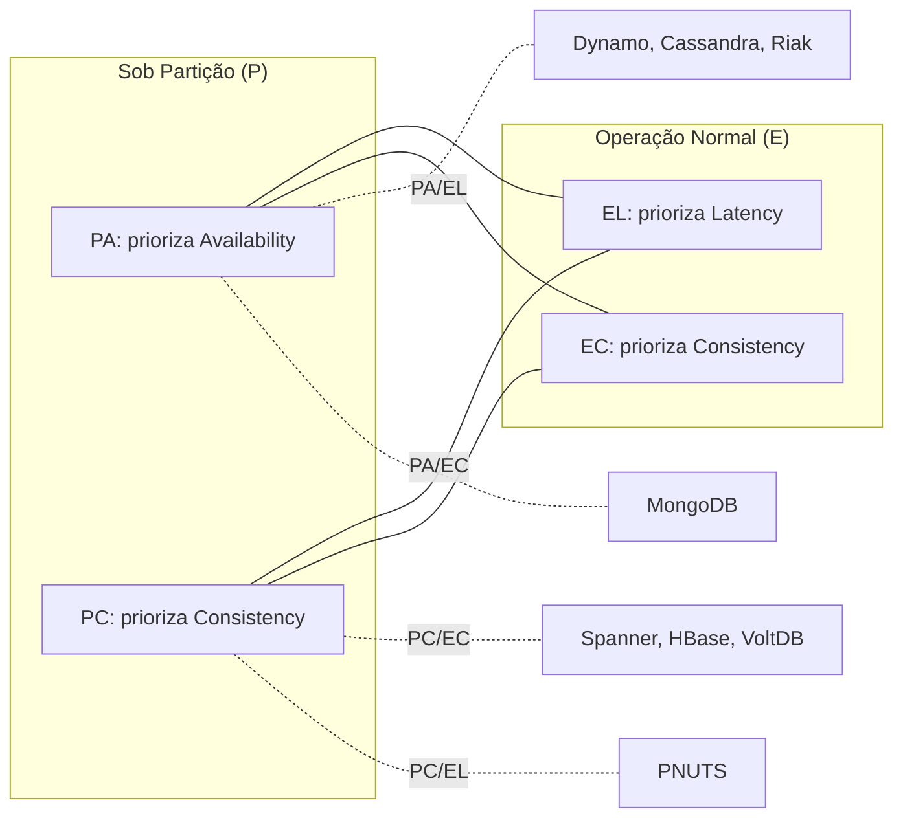

# Teorema CAP e suas nuances (PACELC)

> **Bloco:** Sistemas distribuídos · **Nível:** Avançado · **Tempo de leitura:** ~22 min

## TL;DR

O **Teorema CAP** afirma que um sistema de dados distribuído sujeito a uma **partição de rede** (P) é forçado a escolher entre **consistência** (C) e **disponibilidade** (A); não pode ter ambas simultaneamente enquanto a partição persistir. Isso *não* significa "escolha 2 de 3" como popularmente se repete: partições são um fato da vida em redes assíncronas, não uma opção de design. A escolha real é binária e ocorre apenas **durante** a partição: ou o sistema rejeita/atrasa operações para preservar consistência (CP), ou serve respostas potencialmente desatualizadas para preservar disponibilidade (AP).

O **PACELC** (Abadi, 2012) corrige a maior lacuna do CAP: ele só fala sobre o comportamento durante partições, que são raras. Na ausência de partição (o estado normal, 99,9% do tempo), ainda existe um trade-off fundamental entre **latência** (L) e **consistência** (C). PACELC se lê: *if Partition, then Availability-vs-Consistency; Else, Latency-vs-Consistency*. Sistemas se classificam então em quatro famílias: **PA/EL**, **PC/EC**, **PA/EC**, **PC/EL**.

Para um arquiteto, a lição prática é: CAP isolado é insuficiente para decisões de design. O eixo latência↔consistência (E do PACELC) domina o comportamento operacional do dia a dia e tem impacto direto em SLA, custo e experiência do usuário.

## O problema que resolve

No fim dos anos 1990, a Inktomi (motor de busca por trás de Yahoo!, HotBot, etc.) operava clusters de escala então inédita. **Eric Brewer**, cofundador e CTO, observou empiricamente que o modelo clássico de objetos distribuídos transacionais (ACID, RPC tratado como chamada local) falhava sistematicamente em escala: a rede particionava com frequência, chamadas remotas não se comportavam como chamadas locais, e falhas eram a norma, não a exceção.

Em 19 de julho de 2000, na **keynote do PODC (Principles of Distributed Computing)** intitulada *Towards Robust Distributed Systems*, Brewer formalizou essa observação como a **conjectura CAP**: um sistema de dados compartilhados não pode simultaneamente garantir Consistência, Disponibilidade e tolerância a Partição. Era uma regra prática derivada de operação real, não um teorema matemático.

Em **2002**, **Seth Gilbert** e **Nancy Lynch** (MIT) publicaram uma prova formal para um modelo específico (consistência = linearizabilidade; disponibilidade = toda requisição a um nó não-falho termina), transformando a conjectura no **Teorema CAP**. A prova é quase trivial uma vez enunciada: se dois nós estão particionados e um cliente escreve em um lado, um leitor no outro lado ou recebe o dado antigo (viola C) ou tem a requisição bloqueada/rejeitada (viola A).

O problema é que a divulgação popular do CAP gerou um meme nocivo — "escolha 2 de 3" — que sugere que CA seria uma opção legítima de runtime. Não é: em qualquer sistema que de fato comunica pela rede, partições **vão** ocorrer. Renunciar a P significa apenas que o sistema se comportará mal (perda de dados, indisponibilidade total) quando a partição inevitavelmente acontecer. Brewer reconheceu isso ele próprio em 2012, no artigo *CAP Twelve Years Later: How the "Rules" Have Changed*.

Em **2012**, **Daniel Abadi** (então em Yale) publicou *Consistency Tradeoffs in Modern Distributed Database System Design: CAP is Only Part of the Story* (IEEE Computer, vol. 45, nº 2, pp. 37-42). Sua crítica central: o CAP descreve apenas o regime de partição, que é raro; ignora completamente o trade-off **latência↔consistência** que existe o tempo todo, mesmo sem partições. Esse trade-off vem do fato de que, para garantir forte consistência entre réplicas, é preciso coordenar (esperar quóruns, fazer round-trips síncronos), e coordenação custa latência. Daí o **PACELC**, que unifica os dois regimes numa formulação única.

## O que é (definição aprofundada)

**Consistência (C) no CAP** significa especificamente **linearizabilidade** (também chamada de *atomic consistency* ou *strong consistency*): existe uma ordem total única de todas as operações, consistente com a ordem temporal real, e toda leitura retorna o valor da escrita mais recente nessa ordem. Atenção: o "C" do CAP **não** é o "C" do ACID. No ACID, C é "consistência de integridade" (invariantes de schema/constraints preservados por transação). São conceitos ortogonais que infelizmente compartilham a letra.

**Disponibilidade (A)** no sentido de Gilbert-Lynch: toda requisição recebida por um nó não-falho deve resultar em resposta (não-erro), em tempo finito. É uma definição forte — disponibilidade total, sem timeouts nem erros. Na prática operacional, "disponibilidade" é um espectro (porcentagem de requisições atendidas dentro de um SLA), mas o teorema usa a versão absoluta.

**Tolerância a partição (P)**: o sistema continua operando apesar de mensagens entre nós serem perdidas ou arbitrariamente atrasadas — ou seja, apesar da rede se dividir em sub-redes que não conseguem se comunicar. Numa rede assíncrona real (sem limites garantidos de latência), é impossível distinguir um nó lento de um nó particionado. Por isso **P não é opcional**: você não escolhe ter partições, você escolhe como reagir a elas.

**A reformulação correta do CAP**: na presença de uma partição, escolha entre C e A. Fora da partição, você pode (e deve) ter ambas. Logo:

- **Sistemas CP**: durante a partição, sacrificam disponibilidade para manter consistência. O lado minoritário da partição recusa escritas (e talvez leituras) até a partição cicatrizar. Exemplos: bancos com consenso por quórum (etcd, ZooKeeper, Spanner, HBase, MongoDB em modo majority).
- **Sistemas AP**: durante a partição, sacrificam consistência para manter disponibilidade. Ambos os lados aceitam escritas; conflitos são reconciliados depois (eventual consistency). Exemplos: Dynamo, Cassandra (em níveis baixos), Riak, CouchDB.
- **Sistemas "CA"**: tecnicamente só existem se você assume que partições nunca ocorrem — ou seja, sistemas de nó único ou que param totalmente sob partição. Bancos relacionais monolíticos clássicos são "CA" apenas porque não são distribuídos no sentido relevante.

**PACELC** estende isso com um segundo eixo. A formulação completa:

- **P + A/C**: *se* há **P**artição, escolha entre **A**vailability e **C**onsistency (idêntico ao CAP).
- **E + L/C**: *senão* (**E**lse, operação normal), escolha entre **L**atency e **C**onsistency.

Um sistema é classificado por um par. Exemplos canônicos do paper de Abadi:

- **PA/EL**: Dynamo, Cassandra, Riak. Priorizam disponibilidade sob partição **e** baixa latência em operação normal, ambos ao custo de consistência.
- **PC/EC**: VoltDB/H-Store, BigTable/HBase, sistemas que sempre priorizam consistência. Pagam com indisponibilidade sob partição e com latência maior em operação normal.
- **PA/EC**: MongoDB (configurável). Sob partição prioriza disponibilidade; em operação normal prioriza consistência.
- **PC/EL**: PNUTS (Yahoo!). Sob partição prioriza consistência; em operação normal prioriza latência. É a combinação mais contraintuitiva, mas reflete escolhas reais de design.

O **Spanner** (Google) merece nota: é frequentemente chamado de "CA" ou de "quebra do CAP", mas é honestamente **CP/EC**. Ele atinge linearizabilidade global via **TrueTime** (relógios atômicos + GPS com incerteza limitada) e consenso Paxos. Não viola o CAP: sob partição que impeça quórum, ele fica indisponível. O que o Spanner faz é ter uma rede tão confiável (a rede privada do Google) que partições são raríssimas, e investir pesado em manter EC com latência aceitável.

## Como funciona

O coração do CAP é o **dilema do quórum sob partição**. Considere um dado replicado em N réplicas. Para uma escrita ser "confirmada consistentemente", ela precisa ser reconhecida por um número suficiente de réplicas (W). Para uma leitura ver a escrita mais recente, ela precisa consultar um número suficiente (R). A regra de quórum forte é **W + R > N** — garante que conjuntos de leitura e escrita sempre se interseccionam, então toda leitura "vê" a última escrita.

Agora particione a rede em dois lados, com cada lado contendo menos que o quórum necessário. O sistema enfrenta a escolha:

1. **Caminho CP**: o lado que não tem quórum **recusa** operações (retorna erro ou bloqueia). Garante que nunca há divergência — toda operação aceita é globalmente consistente —, mas a um custo de disponibilidade no lado minoritário.

2. **Caminho AP**: ambos os lados **aceitam** operações localmente, relaxando o requisito de quórum (por exemplo, W=1, R=1). Cada lado evolui independentemente. Quando a partição cicatriza, há **réplicas divergentes** que precisam ser reconciliadas — via *last-write-wins* (perigoso, perde dados), *vector clocks* (detecta conflitos para resolução pela aplicação), ou **CRDTs** (mesclagem automática determinística).

O eixo **E (latência↔consistência) do PACELC** opera mesmo sem partição. Suponha que você queira linearizabilidade com N=3 réplicas geograficamente distribuídas (São Paulo, Virginia, Frankfurt). Para confirmar uma escrita de forma fortemente consistente, o coordenador precisa de um round-trip síncrono a um quórum (2 de 3). Se o coordenador está em SP e o segundo quórum mais próximo está em Virginia, cada escrita paga ~120-150ms de RTT transatlântico/transamericano. Relaxar para consistência eventual (confirma localmente, propaga async) derruba a latência para sub-milissegundo — mas leituras subsequentes em outra réplica podem ver dado stale.

Esse é o ponto cego do CAP que o PACELC ilumina: **a consistência forte custa latência o tempo todo, não apenas sob partição.** Para um arquiteto, isso geralmente importa mais, porque partições são raras (talvez algumas por ano) enquanto cada requisição paga o custo de latência.

A mecânica de **detecção de partição** é central e sutil. Em redes assíncronas, não há como saber com certeza se um nó está particionado ou apenas lento. Sistemas usam **timeouts** como heurística: se um nó não responde dentro de T, presume-se particionado. Isso cria um trade-off adicional — T curto detecta partições rápido mas gera falsos positivos (e indisponibilidade desnecessária em sistemas CP); T longo é tolerante mas reage devagar a partições reais.

## Diagrama de fluxo

Decisão de comportamento sob partição (caminho CP vs AP), seguido do eixo PACELC em operação normal:



Classificação PACELC das quatro famílias:



## Exemplo prático / caso real

**Cenário: plataforma de e-commerce brasileira em pico de Black Friday.**

Você opera um marketplace com data centers em São Paulo e Porto Alegre, mais réplicas de leitura em borda. Diferentes subsistemas exigem escolhas PACELC diferentes — e o erro de arquiteto júnior é aplicar uma política única a tudo.

**1. Saldo financeiro / débito de carteira (PC/EC).** Aqui você *não pode* permitir que o mesmo saldo seja debitado duas vezes em lados particionados. Use um store com consenso por quórum (estilo etcd/Spanner). Sob partição, o lado minoritário **recusa** débitos — o cliente vê "tente novamente" em vez de um saldo negativo. Em operação normal, você aceita a latência extra do quórum síncrono. Consistência > disponibilidade > latência. É o subsistema onde indisponibilidade temporária é preferível a corromper dinheiro.

**2. Carrinho de compras (PA/EL).** O carrinho é o exemplo clássico do paper do **Dynamo** (Amazon). Disponibilidade absoluta: o cliente *sempre* consegue adicionar itens, mesmo durante partições — perder uma venda por "carrinho indisponível" é inaceitável. Use replicação estilo Dynamo/Cassandra com baixa latência. O conflito clássico — itens adicionados em dois lados particionados — é resolvido por **merge** (união dos itens) em vez de descartar. O efeito colateral notório do Dynamo era o "item deletado reaparece no carrinho", consequência aceita do design AP. Latência e disponibilidade > consistência.

**3. Catálogo de produtos / preços (PA/EC).** Leituras massivas, atualizações raras. Em operação normal você quer consistência (preço errado é problema legal/comercial), então escritas vão a quórum. Mas sob partição você prefere servir o catálogo possivelmente desatualizado a derrubar a vitrine inteira.

Esboço de lógica de quórum (pseudocódigo leve, ilustrativo):

```
# Escrita consistente (caminho EC)
def escrever_consistente(chave, valor, N=3, W=2):
    acks = enviar_para_replicas(chave, valor)   # round-trip síncrono
    if contar(acks) >= W:                         # quórum atingido
        return OK                                  # paga latência do RTT
    else:
        return ERRO_QUORUM                         # sob partição, pode falhar (CP)

# Escrita disponível (caminho EL/AP)
def escrever_disponivel(chave, valor):
    gravar_local(chave, valor, vector_clock_incrementado())
    propagar_async(chave, valor)                   # baixa latência
    return OK                                       # sempre aceita; reconcilia depois
```

Sistemas reais que materializam essas escolhas: **DynamoDB** e **Cassandra** (PA/EL, consistência eventual, vector clocks/tunable consistency), **etcd** e **Consul** (PC/EC, Raft), **Spanner** (PC/EC, TrueTime + Paxos), **MongoDB** (PA/EC configurável via *write concern* e *read concern*).

## Quando usar / Quando evitar

**Escolha CP (e EC) quando:**

- Há invariantes que, se violados, causam perda irreversível ou dano legal: saldos financeiros, estoque com overselling proibido, alocação de recursos únicos (assentos, reservas), unicidade (não emitir dois CPFs iguais).
- O domínio tolera indisponibilidade breve melhor que inconsistência. "Sistema fora do ar por 30s" é aceitável; "dois clientes compraram o mesmo ingresso" não é.
- Você precisa de raciocínio simples sobre o estado: linearizabilidade torna o sistema fácil de entender e testar.

**Escolha AP (e EL) quando:**

- Disponibilidade é receita direta: carrinho, catálogo, feed, sessão, contadores aproximados, telemetria.
- Conflitos são reconciliáveis semanticamente (merge de conjuntos, CRDTs) ou raros e de baixo impacto.
- Latência baixa é requisito de UX e a escala/distribuição geográfica torna o quórum síncrono caro.

**Evite tratar CAP como "escolha 2 de 3".** Você nunca escolhe não ter P numa rede real. Evite também aplicar uma política global de consistência ao sistema inteiro — diferentes *bounded contexts* exigem pontos diferentes no espectro PACELC. A granularidade da decisão é por dado/operação, não por sistema.

## Anti-padrões e armadilhas comuns

- **"Vou usar CA porque não preciso de partições."** Numa rede de verdade, isso significa "vou ter perda de dados ou indisponibilidade total quando a partição inevitável ocorrer". CA distribuído é uma ilusão.
- **Confundir o C do CAP com o C do ACID.** Linearizabilidade ≠ integridade de constraints. Um sistema pode ser ACID-consistente (constraints respeitados) e ainda não-linearizável.
- **Achar que o Spanner "quebrou o CAP".** Não quebrou; é CP. Ele apenas opera numa rede com partições raríssimas e investe em manter latência tolerável para a opção EC.
- **Ignorar o eixo E (latência).** Times focam no comportamento sob partição (raro) e esquecem que o custo de latência da consistência forte é pago em *toda* requisição. Em sistemas globais, isso domina a experiência.
- **Aplicar quórum forte onde não é necessário.** Forçar EC em subsistemas que toleram eventual consistency (catálogo, feed) infla latência e custo sem benefício real.
- **Timeout de detecção de partição mal calibrado.** Curto demais gera indisponibilidade por falsos positivos em CP; longo demais atrasa a reação a partições reais.
- **Confiar em *last-write-wins* (LWW) em sistemas AP sem entender a perda de dados.** LWW silenciosamente descarta escritas concorrentes. Use vector clocks ou CRDTs quando os dados importam.

## Relação com outros conceitos

- **Modelos de consistência**: o "C" do CAP é a ponta forte (linearizabilidade) de um espectro inteiro que inclui consistência causal, read-your-writes, monotonic reads e eventual. PACELC é a porta de entrada para entender por que esse espectro existe (latência↔consistência). Ver `02-modelos-de-consistencia.md`.
- **Consenso distribuído**: sistemas CP/EC implementam o caminho consistente via algoritmos de consenso (Paxos, Raft) que garantem quórum e ordem total. A indisponibilidade sob partição é exatamente a recusa de progredir sem maioria. Ver `03-consenso-distribuido-paxos-raft-2pc-3pc.md`.
- **Vector clocks**: a ferramenta dos sistemas AP (Dynamo, Cassandra) para detectar divergência após a partição cicatrizar, distinguindo escritas causalmente ordenadas de concorrentes. Ver `05-vector-clocks-e-lamport-timestamps.md`.
- **CRDTs**: oferecem **strong eventual consistency** — uma forma de AP em que a reconciliação é automática, determinística e livre de conflitos, eliminando a necessidade de LWW ou resolução manual. São a resposta moderna ao dilema AP. Ver `06-crdts.md`.
- **Idempotência**: em sistemas AP/EL com at-least-once delivery, idempotência é o que torna a reconciliação e o reenvio seguros. Ver `04-idempotencia-e-semanticas-de-entrega.md`.

## Referências

- [Towards Robust Distributed Systems (PODC Keynote, 2000) — Eric Brewer (PDF)](https://people.eecs.berkeley.edu/~brewer/cs262b-2004/PODC-keynote.pdf)
- [Consistency Tradeoffs in Modern Distributed Database System Design: CAP is Only Part of the Story — Daniel Abadi (IEEE Xplore)](https://ieeexplore.ieee.org/document/6127847/)
- [A Critique of the CAP Theorem — Martin Kleppmann (arXiv 1509.05393)](https://arxiv.org/pdf/1509.05393)
- [Quantifying and Generalizing the CAP Theorem (arXiv 2109.07771)](https://arxiv.org/pdf/2109.07771)
- [SE Radio 227: Eric Brewer — The CAP Theorem, Then and Now](https://se-radio.net/2015/05/the-cap-theorem-then-and-now/)
- [Key Points from NoSQL Distilled — Martin Fowler](https://martinfowler.com/articles/nosqlKeyPoints.html)
- [Consistency models reference — Jepsen](https://jepsen.io/consistency)
- [Dynamo: Amazon's Highly Available Key-value Store (SOSP 2007, PDF)](https://www.allthingsdistributed.com/files/amazon-dynamo-sosp2007.pdf)
