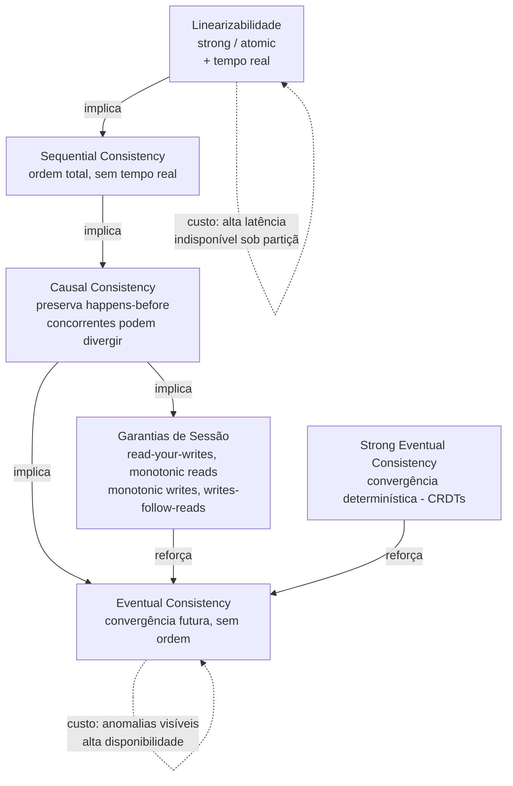
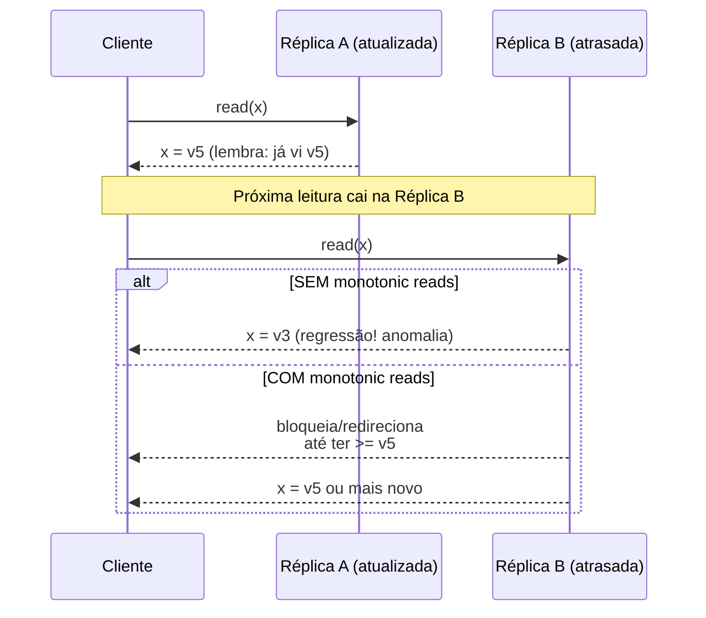

# Modelos de Consistência

> **Bloco:** Sistemas distribuídos · **Nível:** Avançado · **Tempo de leitura:** ~24 min

## TL;DR

Um **modelo de consistência** é um **contrato** entre o sistema de armazenamento distribuído e a aplicação: define quais comportamentos (quais ordens de leituras/escritas) são possíveis e quais são proibidos. Não é uma propriedade booleana ("consistente ou não"), mas um **espectro** que vai da garantia mais forte (linearizabilidade) à mais fraca (eventual consistency), com modelos intermediários úteis no meio.

Os modelos centrais para um arquiteto: **strong consistency / linearizabilidade** (toda operação parece instantânea e atômica numa linha do tempo global única), **sequential consistency** (existe uma ordem total que respeita a ordem de cada cliente, mas não necessariamente o tempo de relógio), **causal consistency** (operações causalmente relacionadas são vistas na mesma ordem por todos; concorrentes podem divergir), e **eventual consistency** (se as escritas pararem, todas as réplicas convergem — sem garantia de quando nem de ordem intermediária).

As **garantias de sessão** são modelos pragmáticos centrados no cliente: **read-your-writes** (você sempre lê suas próprias escritas), **monotonic reads** (você nunca lê uma versão mais antiga do que já viu), **monotonic writes** (suas escritas são aplicadas na ordem em que as emitiu) e **writes-follow-reads** (uma escrita que depende de uma leitura é ordenada depois dela). Elas resolvem as anomalias mais visíveis ao usuário sem exigir consistência forte global.

A lição de arquiteto: garantias mais fortes custam latência e disponibilidade (PACELC); escolha o modelo *mais fraco* que ainda satisfaz os invariantes do domínio, e prefira garantias de sessão para esconder anomalias do usuário a baixo custo.

## O problema que resolve

Num sistema de réplica única, a consistência é trivial: existe um único estado, operações se aplicam em sequência. Assim que você **replica** dados (por disponibilidade, latência geográfica, tolerância a falhas), surge a questão fundamental: quando um cliente lê de uma réplica, **qual versão** dos dados ele deve ver? A mais recente? Qualquer uma? Uma que seja "coerente" com o que ele já viu?

A teoria de modelos de consistência tem raízes na **memória compartilhada multiprocessada**. **Leslie Lamport** definiu **sequential consistency** em 1979 (*How to Make a Multiprocessor Computer That Correctly Executes Multiprocess Programs*) no contexto de caches de CPU. **Maurice Herlihy** e **Jeannette Wing** formalizaram **linearizabilidade** em 1990 (*Linearizability: A Correctness Condition for Concurrent Objects*), a garantia mais forte e composável. Esses conceitos migraram para sistemas distribuídos quase intactos — o problema de coerência de cache entre CPUs é estruturalmente o mesmo de coerência entre réplicas de banco.

A **eventual consistency** ganhou tração com o paper do **Dynamo** (Amazon, SOSP 2007) e com **Werner Vogels** (*Eventually Consistent*, CACM 2009), que popularizou o conceito ao justificar por que a Amazon abria mão de consistência forte em troca de disponibilidade e latência. As **garantias de sessão** (read-your-writes etc.) foram introduzidas no sistema **Bayou** (Terry et al., *Session Guarantees for Weakly Consistent Replicated Data*, 1994) — projetado para computação móvel desconectada.

O problema que tudo isso resolve é alinhar **expectativa de programação** com **realidade física**. A luz não chega instantaneamente de SP a Frankfurt; manter todas as réplicas em lockstep custa round-trips. Modelos de consistência dão ao arquiteto um vocabulário preciso para negociar exatamente quanta "ilusão de instância única" ele compra, e a que custo. **Kyle Kingsbury** (Jepsen) construiu uma taxonomia de referência que mapeia esses modelos num grafo de implicação (modelos mais fortes implicam os mais fracos), e testa empiricamente se bancos reais cumprem o que prometem — frequentemente revelando que não.

## O que é (definição aprofundada)

Os modelos formam uma **hierarquia de força**: um modelo mais forte implica todos os mais fracos abaixo dele. Vamos do mais forte ao mais fraco.

**Linearizabilidade (strong consistency / atomic consistency).** A garantia mais forte para um único objeto. Cada operação parece tomar efeito **instantaneamente** em algum ponto entre seu início e seu término (seu *linearization point*), e essa ordem é consistente com o **tempo real**: se a operação A termina antes de B começar (em tempo de relógio de parede), então A precede B na ordem. Consequência: depois que uma escrita é confirmada, *toda* leitura subsequente (em qualquer réplica) vê esse valor ou um mais novo. É como se houvesse uma única cópia dos dados. Linearizabilidade é **composável**: um sistema feito de objetos linearizáveis é, ele próprio, linearizável. É o "C" do CAP.

**Sequential consistency.** Existe uma **ordem total** de todas as operações tal que (a) ela respeita a ordem-de-programa de cada cliente individualmente, mas (b) **não** precisa respeitar o tempo real entre clientes diferentes. Ou seja, o sistema pode "atrasar" o que um cliente vê das escritas de outro, desde que mantenha uma ordem global coerente. Mais fraca que linearizabilidade (que adiciona a restrição de tempo real). Não é composável. Útil como modelo mental, raramente o alvo direto de sistemas distribuídos modernos.

**Causal consistency.** Operações que estão **causalmente relacionadas** (uma "aconteceu-antes" da outra, no sentido de Lamport — `happens-before`) são vistas na mesma ordem por todos os processos. Operações **concorrentes** (sem relação causal) podem ser vistas em ordens diferentes por réplicas diferentes. Exemplo: se você posta um comentário (escrita C2) *em resposta* a um post (escrita C1) que você leu, todos verão C1 antes de C2. Mas dois comentários independentes podem aparecer em ordens distintas para observadores distintos. Causal consistency é o **modelo de consistência mais forte que ainda é alcançável com disponibilidade total sob partição** (resultado de Mahajan, Alvisi & Dahlin / trabalho de Bailis et al. sobre COPS) — uma fronteira teórica importante. Implementada com **dependências causais** rastreadas por vector clocks ou metadados de versão.

**Eventual consistency.** A garantia mais fraca de uso comum: *se nenhuma nova atualização for feita a um objeto, eventualmente todas as réplicas convergirão para o mesmo valor.* É uma garantia de **liveness** (algo bom acontece no futuro) sem nenhuma garantia de **safety** sobre o que se vê no caminho. Não diz **quando** converge, nem proíbe ler valores antigos, nem proíbe ver valores "fora de ordem" temporariamente. É o regime dos sistemas AP/EL (Dynamo, Cassandra em níveis baixos). **Strong eventual consistency (SEC)** é uma variante mais forte garantida pelos CRDTs: réplicas que receberam o mesmo conjunto de atualizações têm estado idêntico, e a convergência é determinística (sem necessidade de resolução de conflito).

As **garantias de sessão** (centradas no cliente, não no dado global) atacam as anomalias mais perceptíveis:

- **Read-your-writes (read-your-own-writes).** Depois que você escreve um valor, qualquer leitura *sua* subsequente vê esse valor (ou mais novo). Anomalia que previne: você edita seu perfil, recarrega a página e vê os dados antigos porque a leitura caiu numa réplica que ainda não replicou sua escrita.
- **Monotonic reads.** Se você leu uma versão V de um dado, leituras subsequentes *suas* nunca verão uma versão anterior a V. Anomalia que previne: você atualiza a página e o dado "anda para trás" no tempo (vê comentário, recarrega, comentário some, recarrega de novo, comentário volta).
- **Monotonic writes.** Suas escritas são aplicadas na ordem em que você as emitiu (W1 antes de W2). Anomalia que previne: você escreve "passo 1" depois "passo 2", mas as réplicas aplicam fora de ordem.
- **Writes-follow-reads (causal nas suas próprias ações).** Se você leu um valor e então escreveu (presumivelmente baseado no que leu), sua escrita é ordenada **depois** da escrita que você leu. Base da consistência causal aplicada à sessão.

Essas quatro são **independentes** e podem ser combinadas. Read-your-writes + monotonic reads juntas cobrem a maioria das reclamações de "o sistema me mostrou dados velhos".

## Como funciona

A força da consistência é, na prática, função de **como leituras e escritas usam quóruns** e de **quanta coordenação síncrona** o sistema aceita pagar.

**Linearizabilidade via quórum + ordem total.** Para ser linearizável, um sistema replicado tipicamente usa: (1) **quórum estrito** R + W > N para garantir interseção entre conjuntos de leitura e escrita; e (2) um mecanismo de **ordenação total** das escritas — consenso (Raft/Paxos) com um líder que serializa todas as operações, ou *compare-and-set* atômico. Quórum sozinho **não** garante linearizabilidade (leituras concorrentes podem ver versões diferentes durante uma escrita em andamento); por isso sistemas linearizáveis fazem **read-repair síncrono** ou roteiam leituras pelo líder. O custo: cada operação espera round-trips a um quórum, e sob partição o lado sem maioria fica indisponível (CP).

**Causal consistency via rastreamento de dependências.** Cada escrita carrega metadados das escritas das quais depende causalmente (um vector clock ou conjunto de dependências). Uma réplica só **aplica** (torna visível) uma escrita depois que todas as suas dependências já foram aplicadas localmente. Se chega uma escrita cujas dependências ainda não chegaram, ela fica em *buffer*. Isso preserva a ordem causal sem exigir ordem total global — daí ser compatível com alta disponibilidade. Sistemas: COPS, Bayou, e parcialmente MongoDB (causal consistency sessions).

**Eventual consistency via propagação assíncrona + anti-entropia.** Escritas são confirmadas localmente (W baixo) e propagadas em segundo plano. Para garantir convergência, mecanismos de **anti-entropia** reconciliam réplicas: **read-repair** (na leitura, detecta réplicas divergentes e corrige), **hinted handoff** (coordenador guarda escritas destinadas a nós offline e replay depois), **Merkle trees** (comparação eficiente de grandes faixas de dados entre réplicas). A resolução de conflitos usa **last-write-wins** (por timestamp, perde dados), **vector clocks** (detecta concorrência, deixa para a aplicação) ou **CRDTs** (merge automático).

**Garantias de sessão via stickiness + versionamento.** *Read-your-writes* é tipicamente implementado fazendo o cliente lembrar a **versão** (timestamp/token) da sua última escrita e exigir que leituras vejam pelo menos essa versão — ou roteando o cliente sempre para a mesma réplica (*sticky sessions*) que já tem suas escritas. *Monotonic reads* é implementado lembrando a versão mais alta já lida e nunca aceitando uma menor. O custo dessas garantias é baixíssimo comparado a consistência forte global — daí serem o "doce-no-bolso" do arquiteto pragmático.

A ferramenta de validação é o **teste de história**: registra-se a história concorrente real de operações (com timestamps de início/fim) e verifica-se, via *checker* (como o **Knossos/Elle** do Jepsen), se existe alguma ordenação que satisfaça o modelo prometido. É NP-difícil no caso geral, mas tratável na prática para históricos curtos — e revela violações sutis que testes funcionais nunca pegam.

## Diagrama de fluxo

Hierarquia de força entre modelos (modelo de cima implica os de baixo):

Anomalia de monotonic reads (sem a garantia) e como a versão lembrada a previne:

## Exemplo prático / caso real

**Cenário: rede social brasileira com timeline e perfil.**

Você projeta o backend de uma rede social com réplicas geodistribuídas. Aplicar consistência forte a tudo seria caro e desnecessário; aplicar eventual consistency cega geraria bugs visíveis. A decisão é por feature.

**1. Edição de perfil — read-your-writes obrigatório.** O usuário troca a foto/bio e recarrega. Se a leitura cai numa réplica atrasada e mostra a foto antiga, ele acha que "não salvou" e refaz tudo. Solução: após a escrita, o cliente guarda o token de versão e exige que leituras subsequentes do *próprio perfil* vejam pelo menos essa versão (ou usa sticky session para a réplica que recebeu a escrita). Não precisa de consistência forte global — só da garantia de sessão. Custo baixíssimo, elimina a reclamação nº 1 de suporte.

**2. Timeline / feed — eventual consistency + monotonic reads.** O feed pode tolerar que um post novo demore segundos para aparecer (eventual). Mas **não** pode "regredir": se o usuário viu 50 posts e ao rolar de volta vê só 47, a UX quebra. Monotonic reads garante que ele nunca vê uma versão mais antiga da que já viu. Combinação ideal: eventual para frescor + monotonic para estabilidade percebida.

**3. Comentários encadeados — causal consistency.** Se Ana posta, Bruno lê e responde, e Carla lê tudo, Carla *deve* ver o post da Ana antes da resposta do Bruno (ordem causal). Dois comentários independentes (de pessoas diferentes, sem um responder ao outro) podem aparecer em ordens distintas para observadores distintos — e ninguém percebe. Implementação: cada comentário carrega a dependência causal do que respondeu; réplicas só exibem após aplicar as dependências.

**4. Contador de likes — eventual consistency com CRDT.** Likes vêm de todo lado, concorrentemente. Usar um **CRDT counter** (PN-Counter) dá strong eventual consistency: cada réplica incrementa localmente, e os merges convergem deterministicamente para a soma correta sem coordenação. Ver `06-crdts.md`.

Sistemas reais: **DynamoDB** oferece leitura *eventually consistent* (padrão, mais barata/rápida) e *strongly consistent* (opcional, mais cara). **Cassandra** tem **tunable consistency**: `ONE`, `QUORUM`, `ALL`, `LOCAL_QUORUM` — você escolhe R e W por operação, e `R + W > N` (ex.: QUORUM/QUORUM) dá consistência forte; valores menores dão eventual com menos latência. **MongoDB** expõe *read concern* (`local`, `majority`, `linearizable`) e *write concern* (`w:1`, `w:majority`), além de **causal consistency sessions**.

## Quando usar / Quando evitar

**Use linearizabilidade quando:**

- Há invariantes que exigem visão única e atual: locks distribuídos, eleição de líder, contadores de unicidade, alocação de recursos únicos, saldos com débito.
- Você precisa de *compare-and-set* atômico.
- O custo de latência/indisponibilidade sob partição é aceitável frente ao custo de uma inconsistência.

**Evite linearizabilidade quando:** o dado é geodistribuído e a latência do quórum síncrono mata a UX, ou quando a disponibilidade é receita direta. Não pague por consistência forte onde garantias de sessão bastam.

**Use causal consistency quando:** você quer a consistência *mais forte possível* mantendo disponibilidade total sob partição — fóruns, comentários, colaboração, qualquer relação de "resposta-a". É frequentemente o sweet spot teórico.

**Use garantias de sessão (read-your-writes, monotonic reads) quase sempre** sobre uma base eventual: custo marginal baixo, elimina as anomalias que o usuário de fato percebe. É o default pragmático.

**Use eventual consistency / SEC (CRDTs) quando:** disponibilidade e latência dominam, e os conflitos são reconciliáveis semanticamente (contadores, conjuntos, carrinhos, presença online, telemetria).

## Anti-padrões e armadilhas comuns

- **Assumir que o banco entrega o que promete sem verificar.** Jepsen repetidamente mostrou bancos que anunciam "strong consistency" e violam linearizabilidade sob partição/clock skew. Teste com cargas adversariais.
- **Tratar consistência como booleano.** "É consistente?" é a pergunta errada. A pergunta é "qual modelo, sob quais falhas?".
- **Esquecer que quórum (R+W>N) não é linearizabilidade.** Quórum garante que leituras *eventualmente* veem a última escrita confirmada, mas leituras concorrentes a uma escrita em andamento podem ver versões diferentes sem read-repair síncrono.
- **Last-write-wins silencioso.** Sob eventual consistency, LWW por timestamp descarta escritas concorrentes sem aviso — e timestamps de relógios desincronizados tornam a "última" arbitrária. Perda de dados invisível.
- **Pular garantias de sessão.** Construir sobre eventual consistency puro e depois passar meses caçando bugs de "dados velhos" que read-your-writes + monotonic reads resolveriam de imediato.
- **Causal consistency sem propagar dependências corretamente.** Se você não rastreia a cadeia causal completa, a garantia vira eventual disfarçada.
- **Consistência forte global como default reflexivo.** Aplicar `majority`/`linearizable` a tudo "por segurança" infla latência e custo, e ainda assim não resolve problemas que são de design de dados.

## Relação com outros conceitos

- **Teorema CAP / PACELC**: o modelo de consistência é exatamente o eixo "C" que o CAP (sob partição) e o PACELC (em operação normal, via latência) forçam você a negociar. Linearizabilidade é o "C" do CAP. Ver `01-teorema-cap-e-pacelc.md`.
- **Consenso distribuído**: linearizabilidade em sistemas replicados é construída sobre consenso (Raft/Paxos) — o líder fornece a ordem total necessária. Ver `03-consenso-distribuido-paxos-raft-2pc-3pc.md`.
- **Vector clocks e Lamport timestamps**: são o mecanismo que materializa a relação `happens-before` necessária para causal consistency e para detectar escritas concorrentes em sistemas eventuais. Ver `05-vector-clocks-e-lamport-timestamps.md`.
- **CRDTs**: entregam strong eventual consistency, a versão "forte" da eventual consistency com convergência determinística. Ver `06-crdts.md`.
- **Idempotência e semânticas de entrega**: em sistemas eventuais, reentrega de mensagens é a norma; idempotência mantém a convergência correta apesar de duplicatas. Ver `04-idempotencia-e-semanticas-de-entrega.md`.

## Referências

- [Consistency models reference — Jepsen (Kyle Kingsbury)](https://jepsen.io/consistency)
- [Eventually Consistent — Werner Vogels (ACM Queue / CACM)](https://queue.acm.org/detail.cfm?id=1466448)
- [Dynamo: Amazon's Highly Available Key-value Store (SOSP 2007, PDF)](https://www.allthingsdistributed.com/files/amazon-dynamo-sosp2007.pdf)
- [Time, Clocks, and the Ordering of Events in a Distributed System — Leslie Lamport (PDF)](https://lamport.azurewebsites.net/pubs/time-clocks.pdf)
- [How are consistent read and write operations handled? — Apache Cassandra / DataStax Docs](https://docs.datastax.com/en/cassandra-oss/3.0/cassandra/dml/dmlAboutDataConsistency.html)
- [How is the consistency level configured? — Cassandra / DataStax Docs](https://docs.datastax.com/en/cassandra-oss/3.0/cassandra/dml/dmlConfigConsistency.html)
- [distsys-class: materiais de aula de sistemas distribuídos — Kyle Kingsbury (GitHub)](https://github.com/aphyr/distsys-class)
- [Key Points from NoSQL Distilled — Martin Fowler](https://martinfowler.com/articles/nosqlKeyPoints.html)
