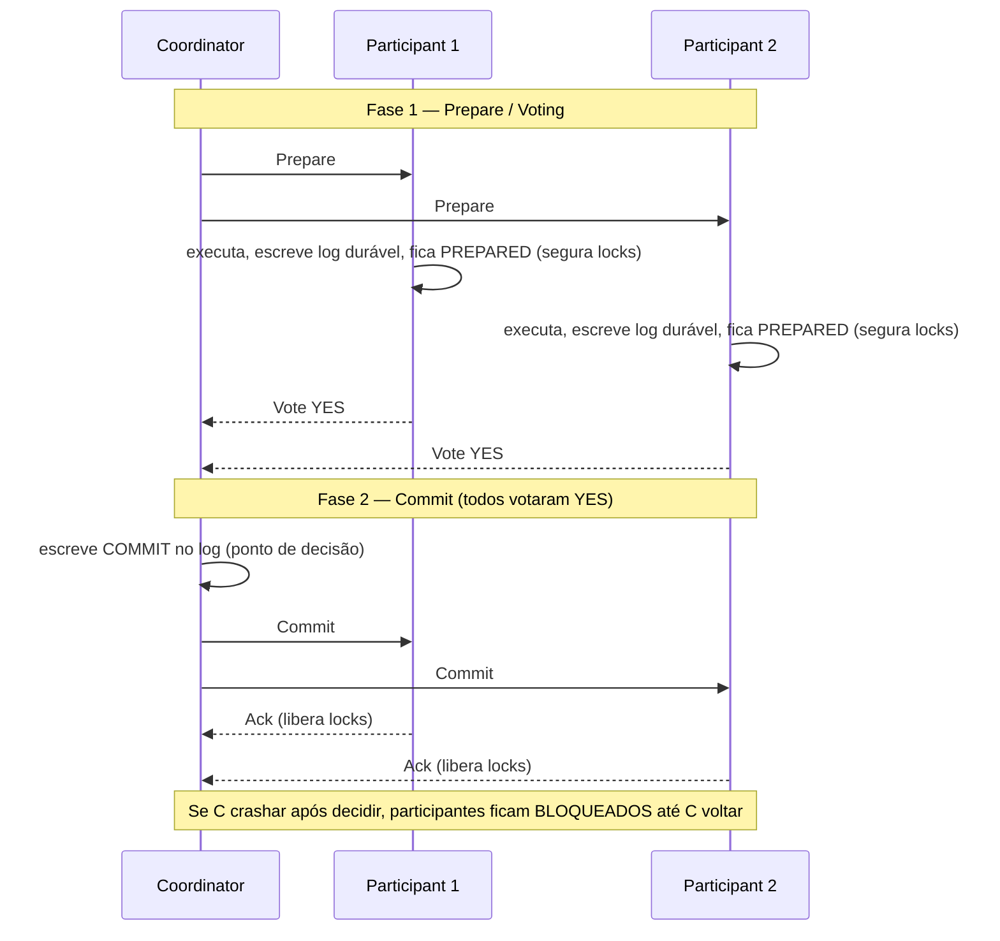
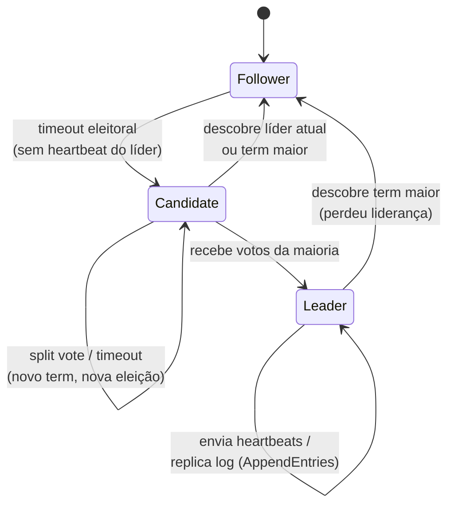

# Consenso Distribuído: Paxos, Raft, Two-Phase Commit, Three-Phase Commit

> **Bloco:** Sistemas distribuídos · **Nível:** Avançado · **Tempo de leitura:** ~28 min

## TL;DR

**Consenso** é o problema de fazer um conjunto de processos concordar num único valor, mesmo com falhas e mensagens atrasadas. É a primitiva fundamental sobre a qual se constroem replicação consistente, eleição de líder, locks distribuídos e bancos linearizáveis. O resultado **FLP (1985)** prova que consenso é *impossível* num sistema totalmente assíncrono se até um processo puder falhar — qualquer algoritmo prático contorna isso assumindo *parcial* sincronia (timeouts) e garantindo **safety sempre, liveness quando a rede coopera**.

**Paxos** (Lamport, 1998) é o algoritmo de consenso seminal, provadamente correto, baseado em maioria (quórum) e em **proposers/acceptors/learners** com números de proposta crescentes. É notoriamente difícil de entender e implementar. **Raft** (Ongaro & Ousterhout, 2014) resolve o mesmo problema com igual eficiência, mas projetado para **inteligibilidade**: decompõe consenso em eleição de líder, replicação de log e segurança, com um líder forte que serializa tudo. É o algoritmo por trás de etcd, Consul e CockroachDB.

**Two-Phase Commit (2PC)** é um protocolo de **commit atômico** (não de consenso geral): um coordenador garante que todos os participantes de uma transação distribuída ou commitam ou abortam juntos. É **bloqueante**: se o coordenador falha na hora errada, participantes ficam presos indefinidamente segurando locks. **Three-Phase Commit (3PC)** (Skeen, 1981) adiciona uma fase para tornar o protocolo não-bloqueante sob falhas de parada — mas falha sob partições de rede e é raramente usado na prática. A tendência moderna substitui 2PC por **sagas** e padrões orientados a eventos.

Lição de arquiteto: consenso (Paxos/Raft) dá ordem total e linearizabilidade ao custo de maioria viva; 2PC dá atomicidade distribuída ao custo de bloqueio; ambos são caros em escala — use-os em escopo pequeno (metadados, coordenação) e prefira eventual consistency/sagas no caminho de dados de alto volume.

## O problema que resolve

Imagine N processos que precisam **concordar** sobre um valor — qual transação commitar, quem é o líder, qual a próxima entrada do log replicado. Num mundo sem falhas e com rede síncrona, é trivial. O problema é o mundo real: processos crasham, mensagens se perdem, atrasam ou chegam fora de ordem, e a rede particiona. Como garantir que todos os processos não-falhos acabem concordando no **mesmo** valor, e que esse valor tenha sido de fato proposto por alguém?

O consenso tem três propriedades formais: **agreement** (todos os processos corretos decidem o mesmo valor), **validity/integrity** (o valor decidido foi proposto por algum processo), e **termination** (todo processo correto eventualmente decide). FLP mostra que as três juntas são impossíveis num modelo assíncrono com falhas.

Em **1985**, **Fischer, Lynch e Paterson** publicaram *Impossibility of Distributed Consensus with One Faulty Process* (JACM) — o **resultado FLP**. A prova: num sistema assíncrono (sem limites de tempo garantidos), é impossível distinguir um processo que crashou de um que está apenas lento. Logo, qualquer protocolo determinístico de consenso tem ao menos uma execução que nunca termina, mesmo com uma única falha de parada. FLP não diz que consenso é inútil — diz que você não pode garantir *termination* sem alguma suposição extra. Os algoritmos práticos garantem **agreement e validity (safety) incondicionalmente**, e obtêm **termination (liveness)** assumindo sincronia parcial: a rede *eventualmente* se comporta bem o suficiente (mensagens chegam dentro de algum limite) por tempo suficiente para decidir. Timeouts são o mecanismo que materializa essa suposição.

**Leslie Lamport** atacou consenso com o **Paxos**, escrito em 1990 mas publicado só em **1998** como *The Part-Time Parliament* (ACM TOCS) — numa alegoria de um parlamento na ilha grega de Paxos que era tão obscura que quase ninguém entendeu. Lamport reescreveu em linguagem simples em **2001**, *Paxos Made Simple*. Paxos virou a base teórica de quase tudo (Chubby do Google, Spanner, ZooKeeper-derivados), mas com fama justa de ser difícil de entender e de transformar num sistema real (o "gap" entre o protocolo de consenso de valor único e o **Multi-Paxos** prático é cheio de detalhes não especificados).

Em **2014**, **Diego Ongaro** e **John Ousterhout** (Stanford) publicaram *In Search of an Understandable Consensus Algorithm* (USENIX ATC, Best Paper), apresentando o **Raft**. A tese: a dificuldade do Paxos não é inerente ao problema, mas ao algoritmo; um consenso equivalente em poder e eficiência, porém **projetado para ser ensinável**, beneficiaria a engenharia. Estudo com alunos confirmou que Raft é mais fácil de aprender. Raft dominou a implementação prática moderna.

Paralelamente, o problema de **commit atômico distribuído** (variante restrita: a decisão é commit/abort, e *qualquer* participante pode forçar abort) era resolvido desde os anos 1970 pelo **Two-Phase Commit**, formalizado por **Jim Gray** (*Notes on Data Base Operating Systems*, 1978) e **Lampson/Sturgis**. **Dale Skeen** mostrou em **1981** (*Nonblocking Commit Protocols*, ACM SIGMOD) que 2PC é bloqueante e propôs o **Three-Phase Commit** para contornar — uma solução teórica importante, mas frágil sob partições.

## O que é (definição aprofundada)

É crucial separar duas famílias frequentemente confundidas:

**Consenso (Paxos, Raft)** — concordar sobre um valor/sequência arbitrária, tolerando falhas de parada de uma **minoria** (até f falhas com N = 2f+1). Garante progresso enquanto a **maioria** está viva e se comunica. É a base de **state machine replication**: se todas as réplicas aplicam o mesmo log de comandos na mesma ordem, todas chegam ao mesmo estado — daí linearizabilidade.

**Commit atômico (2PC, 3PC)** — decidir se uma transação distribuída commita em **todos** os participantes ou em nenhum. Diferença crítica: no commit atômico, **um único** participante votando "abort" (ou falhando) força abort global; exige unanimidade, não maioria. Por isso 2PC não tolera falhas da forma que o consenso tolera — ele *bloqueia*.

**Paxos (consenso de valor único — Single-Decree).** Papéis:

- **Proposers**: propõem valores.
- **Acceptors**: votam; a "memória" do sistema. Decisão = valor aceito por uma **maioria** de acceptors.
- **Learners**: aprendem o valor decidido.

Opera em duas fases com **números de proposta** globalmente únicos e monotonicamente crescentes:

1. **Fase 1 (Prepare/Promise)**: um proposer escolhe um número n e envia `Prepare(n)` aos acceptors. Cada acceptor, se n é maior que qualquer prepare que já viu, **promete** não aceitar propostas com número < n e devolve o valor de maior número que já aceitou (se houver).
2. **Fase 2 (Accept/Accepted)**: se o proposer recebe promessas de uma maioria, envia `Accept(n, v)`, onde v é o valor de maior número retornado pelas promessas (ou seu próprio, se nenhum). Acceptors aceitam se ainda não prometeram a um número maior. Quando uma maioria aceita, o valor está **escolhido**.

A genialidade: a Fase 1 garante que, se algum valor já foi escolhido, qualquer proposta futura vai re-propor *aquele* valor — daí *agreement*. **Multi-Paxos** otimiza a sequência de decisões (um log) elegendo um líder estável que pula a Fase 1 nas decisões subsequentes.

**Raft.** Um líder forte serializa tudo. Cada nó está num de três estados: **follower**, **candidate**, **leader**. O tempo é dividido em **terms** (mandatos) numerados, cada um com no máximo um líder.

- **Leader election**: followers esperam *heartbeats*. Se um timeout (eleitoral, randomizado) expira sem heartbeat, o follower vira candidate, incrementa o term, vota em si e pede votos (`RequestVote`). Quem recebe votos da maioria vira leader. O randomização dos timeouts evita empates (split votes) recorrentes.
- **Log replication**: clientes mandam comandos ao líder, que os anexa ao seu log e replica via `AppendEntries`. Quando uma entrada é replicada numa maioria, ela está **committed** e pode ser aplicada à máquina de estados. O líder informa o índice de commit nos heartbeats.
- **Safety**: regras garantem que um líder só é eleito se tem o log mais atualizado (*Leader Completeness*), e que entradas committed nunca são perdidas. A *Log Matching Property* garante que logs idênticos até um índice têm os mesmos comandos.

Raft é equivalente ao Multi-Paxos em garantias e desempenho, mas com muito menos estados a considerar — daí a inteligibilidade.

**Two-Phase Commit (2PC).** Um **coordenador** e N **participantes**:

1. **Fase 1 (Prepare/Voting)**: coordenador envia `Prepare`. Cada participante executa a transação até o ponto de commit, escreve um registro durável (pode commitar se mandado) e vota `Yes` (prepared) ou `No`. Ao votar Yes, o participante **renuncia ao direito de abortar unilateralmente** — fica em estado *prepared*, segurando locks.
2. **Fase 2 (Commit/Abort)**: se *todos* votaram Yes, o coordenador escreve `Commit` no seu log (ponto de decisão) e manda `Commit` a todos. Se *qualquer um* votou No (ou timeout), manda `Abort`. Participantes aplicam e confirmam.

O problema fatal: entre votar Yes e receber a decisão, se o **coordenador crasha**, o participante fica **bloqueado** — não pode commitar (não sabe se outro abortou) nem abortar (já prometeu commitar), segurando locks indefinidamente. É a janela de incerteza.

**Three-Phase Commit (3PC).** Insere uma fase intermediária para eliminar o bloqueio sob falhas de parada:

1. **CanCommit** (vote): igual à Fase 1 do 2PC.
2. **PreCommit**: se todos votaram Yes, o coordenador manda `PreCommit`; participantes confirmam que estão prontos e *sabem que todos votaram Yes*. Essa fase difunde a informação "a decisão vai ser commit" antes de qualquer commit real.
3. **DoCommit**: coordenador manda `DoCommit`.

A chave: se um participante recebeu `PreCommit`, ele sabe que todos concordaram em commitar; em caso de falha do coordenador, os participantes podem eleger um novo coordenador e decidir com segurança (se alguém recebeu PreCommit, commita; senão, aborta). Isso o torna **não-bloqueante sob falhas de parada (fail-stop)**. Mas 3PC **falha sob partições de rede**: uma partição pode levar os dois lados a decidirem coisas diferentes. Por isso, na prática, 3PC quase não é usado; protocolos baseados em consenso (Paxos/Raft) que sobrevivem a partições são preferidos.

## Como funciona

A mecânica de **Raft em operação** é a mais didática para internalizar consenso prático. Considere 5 nós (tolera f=2 falhas).

Estado estável: um líder envia heartbeats periódicos. Followers reiniciam seus timeouts eleitorais a cada heartbeat. Um cliente envia `set x = 5` ao líder. O líder anexa `{term: 3, index: 7, cmd: "x=5"}` ao seu log e dispara `AppendEntries` aos 4 followers. Quando 2 followers confirmam (o líder + 2 = 3 = maioria de 5), a entrada está committed; o líder aplica `x=5` à sua máquina de estados, responde ao cliente e, no próximo heartbeat, avisa os followers do novo commit index para que apliquem também.

Falha do líder: os followers param de receber heartbeats. Seus timeouts (digamos, randomizados entre 150–300ms) expiram em momentos diferentes. O primeiro vira candidate, incrementa para term 4, vota em si, e pede votos. Como seu log está atualizado, a maioria vota nele. Novo líder eleito; comandos não committed do term anterior são reconciliados pela *Log Matching*. O período de indisponibilidade é o tempo de detecção + eleição — tipicamente sub-segundo.

A **suposição de sincronia parcial** aparece exatamente nos timeouts: se a rede for patologicamente lenta, eleições podem se repetir (liveness comprometida, mas *safety nunca*) — duas máquinas nunca aplicam comandos divergentes, no pior caso o sistema só não progride. Isso é a forma como Raft "contorna" FLP: abdica de garantir progresso sob assincronia adversária, preservando correção.

A mecânica do **2PC em falha** ilustra por que ele é evitado em escala. Suponha coordenador C e participantes P1, P2, P3 num débito distribuído. Todos votam Yes (estão prepared, segurando locks de linha). C escreve Commit e manda para P1 (que commita) — e então **crasha** antes de avisar P2 e P3. P2 e P3 ficam prepared, segurando locks, sem saber a decisão. Eles não podem perguntar uns aos outros com segurança (não sabem se C decidiu commit ou abort). Ficam **bloqueados** até C voltar e ler seu log de decisão. Em escala, com muitas transações distribuídas concorrentes, isso vira *lock contention* catastrófico e cascatas de timeout.

O **consenso resolve o commit atômico melhor** justamente porque não depende de um coordenador único insubstituível: a decisão de commit é registrada num **log replicado por consenso** (Paxos/Raft), então a falha do coordenador é tolerada elegendo outro a partir do log durável e replicado. Spanner, por exemplo, usa 2PC **sobre** grupos Paxos — cada participante do 2PC é, ele próprio, um grupo replicado por Paxos, eliminando o ponto único de bloqueio.

## Diagrama de fluxo

Two-Phase Commit (caminho de commit bem-sucedido):



Raft — máquina de estados de um nó:



## Exemplo prático / caso real

**Cenário: plataforma de pagamentos brasileira coordenando estado de cluster e transações.**

**1. Coordenação de cluster e configuração (Raft via etcd/Consul).** Sua frota de serviços precisa de eleição de líder (qual instância roda o job de fechamento diário), service discovery e feature flags consistentes. Você usa **etcd** (que implementa Raft) ou **Consul** (também Raft). Cada chave gravada vira uma entrada no log replicado por Raft; leituras lineares passam pelo líder. Com 5 nós etcd, você tolera 2 falhas e mantém consistência forte. Quando o nó líder cai, nova eleição em sub-segundo e o cluster segue. Esse é o uso canônico de consenso: **escopo pequeno (metadados/coordenação), valor altíssimo (linearizabilidade), volume baixo**.

**2. Banco distribuído linearizável (CockroachDB / Spanner).** O **CockroachDB** particiona dados em *ranges*, cada um replicado por um grupo Raft próprio. Uma transação que toca múltiplos ranges usa 2PC **sobre** esses grupos Raft — então a falha de um coordenador não bloqueia, porque o estado de decisão está replicado por consenso. O **Spanner** faz o mesmo com Paxos + TrueTime, atingindo linearizabilidade global (PC/EC). É a arquitetura que torna o commit atômico distribuído tolerante a falhas.

**3. Por que evitar 2PC puro no caminho de pagamento.** Suponha que o débito da carteira (serviço A) e o registro do pedido (serviço B) sejam transações distribuídas via 2PC clássico. Em pico de Black Friday, milhares de 2PCs concorrentes seguram locks durante a janela prepared. Um coordenador lento ou caído trava centenas de transações, locks acumulam, timeouts cascateiam, latência explode. A alternativa moderna é uma **saga**: a operação é decomposta em passos locais (débito, criar pedido, confirmar) com **compensações** (estornar débito) se um passo falhar — coordenadas por eventos, sem locks distribuídos nem bloqueio. Você troca atomicidade estrita por consistência eventual + idempotência, mas ganha disponibilidade e escala.

Esboço de eleição Raft (pseudocódigo leve):

```
# Follower com timeout eleitoral
on timeout_eleitoral_expira():
    estado = CANDIDATE
    term += 1
    votos = 1                      # vota em si mesmo
    para cada peer:
        enviar RequestVote(term, meu_ultimo_log_index, meu_ultimo_log_term)

on recebe VoteGranted():
    votos += 1
    if votos > N/2:                # maioria
        estado = LEADER
        enviar_heartbeats()        # afirma liderança
```

Sistemas reais: **etcd**, **Consul** (Raft); **ZooKeeper** (Zab, primo do Paxos/Raft); **Google Chubby/Spanner** (Paxos); **CockroachDB**, **TiKV** (Raft); bancos distribuídos clássicos com XA/2PC (frequentemente fonte de dor operacional).

## Quando usar / Quando evitar

**Use consenso (Raft/Paxos) quando:**

- Precisa de **linearizabilidade** e ordem total: eleição de líder, locks distribuídos, configuração/metadados, log replicado de uma máquina de estados.
- O volume é gerenciável e o conjunto de nós é pequeno e estável (3, 5, 7 nós). Consenso não escala horizontalmente para throughput arbitrário — cada decisão exige round-trip a uma maioria.
- A indisponibilidade do lado minoritário sob partição é aceitável (é um sistema CP).

**Evite consenso no caminho de dados de alto volume**: usar um único grupo Raft para todo o tráfego de um sistema massivo cria gargalo no líder. A solução é **sharding** (muitos grupos de consenso, um por partição), como CockroachDB/Spanner fazem.

**Use 2PC quando:** você precisa de atomicidade entre poucos recursos transacionais (ex.: dois bancos relacionais via XA), o volume é baixo, a janela de bloqueio é tolerável, e idealmente quando os participantes são, eles próprios, replicados por consenso (eliminando o bloqueio).

**Evite 2PC quando:** alta escala, muitos participantes, alta concorrência, ou quando a disponibilidade importa mais que atomicidade estrita. Prefira **sagas** + compensações + idempotência. **Evite 3PC quase sempre**: a complexidade extra não compensa, e ele falha sob partições — onde consenso brilha.

## Anti-padrões e armadilhas comuns

- **Implementar Paxos do zero.** O gap entre o paper e um sistema correto é enorme (Multi-Paxos, reconfiguração de membros, snapshots). Use uma biblioteca/sistema testado. Se for implementar consenso, use Raft.
- **2PC em microsserviços de alta escala.** Locks distribuídos + bloqueio sob falha de coordenador = morte por contention. É o anti-padrão clássico de "transação distribuída ACID entre serviços".
- **Achar que 3PC resolve o problema do 2PC em geral.** Ele só remove bloqueio sob *fail-stop*; sob partição de rede (o caso que mais importa), pode causar inconsistência. Consenso é a resposta certa.
- **Confundir consenso com commit atômico.** Consenso tolera minoria falha (maioria decide); commit atômico exige unanimidade (qualquer um aborta). São problemas diferentes com soluções diferentes.
- **Quórum par.** Com N par, a maioria não tolera mais falhas que N−1 e aumenta a chance de split-brain. Use N ímpar (3, 5, 7).
- **Roteamento de leituras fora do líder em Raft sem cuidado.** Ler de um follower pode retornar dados stale (não linearizável). Para leituras lineares, passe pelo líder ou use *lease reads* / *read index*.
- **Timeouts mal calibrados.** Timeouts eleitorais curtos demais geram eleições espúrias (instabilidade); longos demais aumentam a janela de indisponibilidade. A randomização é essencial para evitar split votes.

## Relação com outros conceitos

- **Modelos de consistência**: consenso é o mecanismo que *implementa* linearizabilidade em sistemas replicados (state machine replication). Sem consenso, não há ordem total. Ver `02-modelos-de-consistencia.md`.
- **Teorema CAP / PACELC**: sistemas de consenso são CP — sacrificam disponibilidade do lado minoritário sob partição para preservar consistência. O custo de latência (round-trip a quórum) é o lado EC do PACELC. Ver `01-teorema-cap-e-pacelc.md`.
- **Idempotência e semânticas de entrega**: sagas (a alternativa moderna ao 2PC) dependem de passos e compensações **idempotentes** para serem seguras sob reentrega. Ver `04-idempotencia-e-semanticas-de-entrega.md`.
- **Vector clocks / Lamport timestamps**: relógios lógicos fornecem a noção de ordem (`happens-before`) sobre a qual o consenso impõe ordem total; o Multi-Paxos/Raft usa números de term/proposta análogos a Lamport timestamps para ordenar tentativas. Ver `05-vector-clocks-e-lamport-timestamps.md`.

## Referências

- [In Search of an Understandable Consensus Algorithm (Extended) — Raft, Ongaro & Ousterhout (PDF)](https://raft.github.io/raft.pdf)
- [The Raft Consensus Algorithm — site oficial](https://raft.github.io/)
- [Raft — visualização interativa (The Secret Lives of Data)](https://thesecretlivesofdata.com/raft/)
- [The Part-Time Parliament — Leslie Lamport (Microsoft Research)](https://www.microsoft.com/en-us/research/publication/part-time-parliament/)
- [Impossibility of Distributed Consensus with One Faulty Process (FLP) — A Brief Tour, The Paper Trail](https://www.the-paper-trail.org/post/2008-08-13-a-brief-tour-of-flp-impossibility/)
- [Three-phase commit protocol — Wikipedia](https://en.wikipedia.org/wiki/Three-phase_commit_protocol)
- [Paxos made simple — The Morning Paper (Adrian Colyer)](https://blog.acolyer.org/2015/03/04/paxos-made-simple/)
- [In Search of an Understandable Consensus Algorithm — USENIX ATC 2014](https://www.usenix.org/conference/atc14/technical-sessions/presentation/ongaro)
