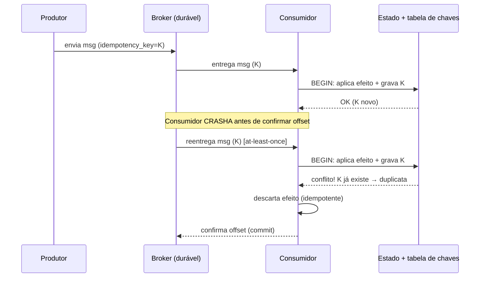
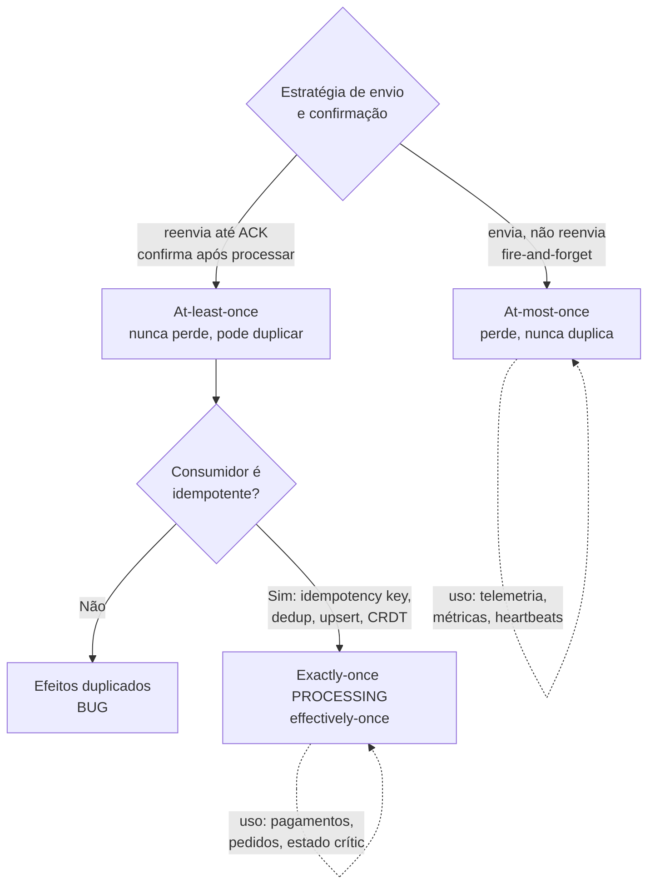

# Idempotência e Semânticas de Entrega

> **Bloco:** Sistemas distribuídos · **Nível:** Avançado · **Tempo de leitura:** ~22 min

## TL;DR

Em sistemas distribuídos com falhas de rede, garantir que uma mensagem seja entregue **exatamente uma vez** é impossível no nível de transporte: o remetente nunca sabe, ao não receber um ACK, se a mensagem se perdeu ou se o ACK se perdeu. Restam três **semânticas de entrega**: **at-most-once** (envia e esquece; pode perder, nunca duplica), **at-least-once** (reenvia até confirmar; nunca perde, pode duplicar) e **exactly-once** — que, no nível de *delivery*, é uma ilusão.

A saída prática é mover o problema da **entrega** para o **processamento**: combinar **at-least-once delivery** (que é alcançável e robusto) com **idempotência** no consumidor — a propriedade de que processar a mesma mensagem N vezes tem o mesmo efeito que processá-la uma vez. Isso entrega **exactly-once *processing* (effectively-once)**, que é o que realmente importa. Kafka, por exemplo, oferece "exactly-once semantics" exatamente assim: produtor idempotente (dedup por sequence number) + transações + offsets atômicos, *não* mágica no fio.

**Idempotência** se obtém por desenho: usar identificadores únicos de operação (idempotency keys), dedup no consumidor, operações naturalmente idempotentes (PUT/set vs. incremento), upserts com chave, e *outbox/inbox patterns*. Para o arquiteto: assuma at-least-once como default da mensageria, projete *todo* consumidor para ser idempotente, e desconfie de qualquer sistema que prometa "exactly-once" sem explicar a idempotência por trás.

## O problema que resolve

O problema nasce do **modelo de falhas da rede assíncrona**: mensagens podem ser perdidas, duplicadas (por retransmissão de protocolos como TCP, ou por reenvio da aplicação), atrasadas arbitrariamente e entregues fora de ordem. Quando um produtor envia uma mensagem e espera um ACK, e o ACK não chega, há ambiguidade fundamental e indistinguível:

- A mensagem se perdeu antes de chegar? (preciso reenviar)
- A mensagem chegou e foi processada, mas o ACK se perdeu? (reenviar duplica)
- O consumidor está apenas lento? (reenviar pode duplicar)

Não há informação local suficiente para distinguir esses casos. Esse é o **problema dos dois generais** disfarçado: nenhuma quantidade finita de mensagens de confirmação garante acordo sobre "a mensagem foi entregue e processada". É um resultado de impossibilidade clássico.

**Tyler Treat** cristalizou isso em 2015 no ensaio *You Cannot Have Exactly-Once Delivery* (e o follow-up *Redux*): no contexto de *delivery* de rede, exactly-once é impossível; o melhor que se tem é at-least-once, que se usa para *simular* exactly-once garantindo idempotência ou eliminando efeitos colaterais. O ponto-chave do Redux: "exactly-once delivery" é um termo ruim — o que de fato se busca é **exactly-once *processing***, uma garantia **fim-a-fim** que envolve o *design da aplicação*, não apenas o transporte.

**Jay Kreps** (Confluent/Kafka) entrou no debate em 2017 (*Exactly-once Support in Apache Kafka* e o post da Confluent *Exactly-Once Semantics Are Possible: Here's How Apache Kafka Does It*) argumentando que "exactly-once é matematicamente impossível" é uma afirmação imprecisa: depende de definir exatamente o modelo de falhas e o que se conta como "uma vez". Kafka entrega exactly-once *semantics* num escopo bem definido (stream processing dentro do Kafka) combinando **produtores idempotentes** (dedup por sequence number por partição), **transações** (escrita atômica multi-partição + commit de offset) e consumo transacional. Treat e Kreps não se contradizem: Treat fala de *delivery* no fio (impossível); Kreps fala de *processing* fim-a-fim com idempotência e transações (alcançável dentro de fronteiras).

A noção de **idempotência** é antiga (matemática: f(f(x)) = f(x); HTTP: métodos idempotentes como PUT, DELETE, GET especificados desde a RFC 2616/7231). Sua aplicação como **a** ferramenta para domar at-least-once é o que torna sistemas de mensageria reais corretos.

## O que é (definição aprofundada)

**Semânticas de entrega** descrevem a garantia que o sistema de mensageria oferece sobre quantas vezes uma mensagem é entregue ao consumidor:

- **At-most-once (no máximo uma vez).** O produtor envia e não reenvia (fire-and-forget); o consumidor processa sem confirmar de forma durável. Se algo falha, a mensagem é **perdida** — mas **nunca duplicada**. Latência mínima, sem overhead de ACK/retry. Adequado a dados onde perda é tolerável: métricas, telemetria de alta frequência, logs amostrados, *heartbeats*.

- **At-least-once (pelo menos uma vez).** O produtor **reenvia** até receber confirmação; o consumidor só confirma (commit do offset/ack) *depois* de processar com sucesso. Garante que nenhuma mensagem é perdida, mas a janela "processou → crashou antes de confirmar → reprocessa" gera **duplicatas**. É a semântica **default e mais robusta** da maioria dos brokers (Kafka, RabbitMQ, SQS) e a base de qualquer sistema sério. O custo é exigir **idempotência** no consumidor.

- **Exactly-once (exatamente uma vez).** Cada mensagem afeta o estado do consumidor **uma única vez** — nem perdida, nem duplicada *em efeito*. No nível de *delivery* puro, é impossível (problema dos dois generais). No nível de *processing*, é alcançável combinando at-least-once + idempotência/transações. Daí a distinção crucial:
  - **Exactly-once delivery** (entrega física única no fio): **ilusão**, não busque.
  - **Exactly-once processing / effectively-once** (efeito único no estado): **alcançável**, é o objetivo real.

**Idempotência.** Uma operação é idempotente se aplicá-la múltiplas vezes produz o mesmo resultado/estado que aplicá-la uma vez. Formalmente, do ponto de vista do *efeito observável*: `processar(m)` seguido de `processar(m)` deixa o sistema no mesmo estado que apenas `processar(m)`. Note que idempotência é sobre **efeito**, não sobre execução: a operação pode rodar várias vezes, desde que o resultado convirja.

Categorias de operações quanto à idempotência:

- **Naturalmente idempotentes**: `set x = 5` (atribuição absoluta), `DELETE recurso/123`, `marcar pedido como pago` (transição para estado terminal). Reaplicar não muda nada.
- **Não-idempotentes por natureza**: `x += 1` (incremento), `inserir nova linha`, `enviar e-mail`, `cobrar cartão`. Reaplicar acumula efeitos. Precisam ser *tornadas* idempotentes.

**Técnicas para tornar idempotente:**

- **Idempotency key**: o produtor anexa um identificador único e estável à operação (UUID, ou chave de negócio determinística). O consumidor mantém um registro das chaves já processadas e ignora repetições. É o padrão usado por APIs de pagamento (Stripe, gateways) via header `Idempotency-Key`.
- **Dedup no consumidor (inbox pattern)**: tabela de mensagens já vistas (por message-id); antes de processar, verifica e descarta duplicatas, atomicamente com o processamento.
- **Upsert com chave de negócio**: em vez de `INSERT`, usa `INSERT ... ON CONFLICT DO UPDATE` (ou MERGE), tornando a escrita idempotente sobre a chave.
- **Conditional update / versionamento (compare-and-set)**: aplica a mudança só se o estado/versão esperado bate, descartando reaplicações.
- **Operações comutativas e idempotentes por design (CRDTs)**: estruturas onde o merge é idempotente e comutativo por construção, eliminando o problema na origem. Ver `06-crdts.md`.

**Outbox pattern**: para garantir at-least-once *na origem* sem perder mensagens nem fazer 2PC entre banco e broker, o produtor grava a mensagem numa tabela *outbox* na **mesma transação** local que muda o estado de negócio; um processo separado lê a outbox e publica no broker (com retry, at-least-once). Combinado com idempotência no consumidor (inbox), entrega effectively-once fim-a-fim.

## Como funciona

A mecânica do **at-least-once** é um loop de retry com ACK. O produtor envia, arma um timer; se não recebe ACK antes do timeout, reenvia (com a mesma idempotency key). O broker persiste a mensagem de forma durável e a entrega ao consumidor. O consumidor processa e **só então** confirma (commit de offset no Kafka, ack manual no RabbitMQ, delete da mensagem no SQS). A janela de duplicação está entre "processei o efeito" e "confirmei": se o consumidor crasha aí, ao reiniciar reprocessa a mesma mensagem.

A mecânica do **dedup com idempotency key**:

1. Mensagem chega com `idempotency_key = K`.
2. Consumidor tenta inserir K numa tabela de chaves processadas, **na mesma transação** que aplica o efeito de negócio.
3. Se K já existe (violação de unicidade) → é duplicata → descarta sem reaplicar o efeito.
4. Se K é novo → aplica efeito + grava K atomicamente → confirma.

A atomicidade entre "aplicar efeito" e "registrar chave" é o que torna isso correto. Se forem passos separados não-atômicos, abre-se uma janela onde o efeito foi aplicado mas a chave não registrada — reabrindo a porta para duplicação.

A mecânica do **Kafka exactly-once semantics (EOS)**:

- **Produtor idempotente**: cada produtor recebe um **Producer ID (PID)** e numera mensagens com um **sequence number** por partição. O broker rastreia o último sequence number por (PID, partição) e **descarta duplicatas** automaticamente — resolvendo a duplicação causada por retries do produtor.
- **Transações**: o produtor pode escrever em múltiplas partições/tópicos e commitar o **offset de consumo** numa **transação atômica** (read-process-write). Consumidores com `isolation.level=read_committed` só veem mensagens de transações commitadas. Assim, o ciclo "consumir → processar → produzir → commitar offset" é atômico: ou tudo acontece, ou nada — sem reprocessar nem perder.

Isso **não** contradiz Tyler Treat: o EOS do Kafka funciona dentro da fronteira do Kafka (Kafka→Kafka via Streams). No momento em que o efeito sai para um sistema externo não-transacional (cobrar um cartão, chamar uma API REST), você volta ao mundo at-least-once + idempotência da aplicação. Por isso o ponto de Treat permanece: exactly-once é uma propriedade **fim-a-fim e da aplicação**, não do transporte.

## Diagrama de fluxo

At-least-once com dedup por idempotency key (caminho com duplicata):



Comparação das três semânticas:



## Exemplo prático / caso real

**Cenário: processamento de pagamentos e pedidos numa plataforma de e-commerce brasileira.**

O serviço de checkout publica um evento `PedidoConfirmado` num broker (Kafka/SQS). Consumidores reagem: o serviço de pagamento cobra o cartão, o de estoque baixa unidades, o de notificação manda e-mail. A mensageria é **at-least-once** — então cada consumidor *vai* receber duplicatas eventualmente (retry após timeout, rebalance de partição, crash-recovery).

**1. Cobrança do cartão (não-idempotente → torne idempotente).** Cobrar duas vezes o cartão do cliente é catastrófico (estorno, chargeback, reputação). A operação "cobrar R$ 200" não é naturalmente idempotente. Solução: o evento carrega uma **idempotency key** determinística (ex.: `pagamento:{pedido_id}`). O serviço de pagamento, antes de chamar o gateway, registra essa chave atomicamente; se já existe, retorna o resultado anterior sem cobrar de novo. Gateways reais (Stripe, Cielo, etc.) expõem `Idempotency-Key` exatamente para isso — você repassa a mesma chave e o gateway garante uma cobrança única.

**2. Baixa de estoque (upsert / conditional update).** Em vez de `estoque -= qtd` (incremento, não-idempotente), modele como uma transição registrada: `aplicar reserva {reserva_id} ao pedido`, com a `reserva_id` única. Reaplicar a mesma reserva é no-op. Ou use uma tabela de "movimentos de estoque" com chave única por evento, e o saldo é derivado da soma dos movimentos distintos.

**3. E-mail de confirmação (at-most-once aceitável? ou dedup leve).** Mandar dois e-mails é irritante mas não catastrófico. Pode-se tolerar (at-most-once no envio) ou aplicar dedup por `(pedido_id, tipo_email)` numa janela de tempo. Decisão de custo/benefício: o esforço de exactly-once aqui raramente compensa.

**4. Outbox na origem.** O checkout precisa publicar `PedidoConfirmado` *e* persistir o pedido atomicamente. Fazer 2PC entre Postgres e Kafka é frágil. Em vez disso, grava o evento numa tabela `outbox` na mesma transação que insere o pedido; um *relay* lê a outbox e publica no Kafka com retry (at-least-once). Garante que nenhum evento é perdido nem publicado sem o pedido existir.

Esboço de consumidor idempotente (pseudocódigo leve):

```
def processar(msg):
    with transacao_db():
        try:
            inserir(tabela_chaves, msg.idempotency_key)   # UNIQUE
        except ViolacaoUnicidade:
            return                                          # duplicata: no-op
        aplicar_efeito_de_negocio(msg)                      # mesma transação
    confirmar_offset(msg)                                   # at-least-once ack
```

Sistemas reais: **Apache Kafka** (EOS: idempotent producer + transactions), **Amazon SQS** (at-least-once padrão; FIFO queues oferecem dedup por `MessageDeduplicationId` em janela de 5 min), **RabbitMQ** (at-least-once com ack manual; dedup é responsabilidade do consumidor), **Stripe** e gateways de pagamento (`Idempotency-Key` header).

## Quando usar / Quando evitar

**Use at-most-once quando:** perda ocasional é tolerável e latência/throughput dominam — telemetria de alta frequência, métricas agregadas, logs amostrados, posições de cursor, heartbeats. Não pague o custo de retry/dedup onde o dado é descartável.

**Use at-least-once + idempotência (o default) quando:** nenhuma mensagem pode ser perdida e o consumidor pode ser tornado idempotente — ou seja, na esmagadora maioria dos casos de negócio. É o padrão correto por default. Sempre projete o consumidor como idempotente, *mesmo* que o broker prometa "exactly-once".

**Use exactly-once processing (transacional) quando:** você está dentro de uma fronteira que suporta transações (ex.: pipelines Kafka→Kafka com Streams) e quer a garantia sem implementar dedup manual. Saiba que isso **não** se estende automaticamente a efeitos colaterais externos.

**Evite confiar em "exactly-once delivery" como recurso de transporte.** Não existe no fio; quem promete está ou redefinindo o termo (processing) ou escondendo idempotência por baixo. **Evite** efeitos colaterais não-idempotentes e não-protegidos em qualquer consumidor at-least-once — é a fonte nº 1 de bugs de duplicação (cobrança dupla, e-mail repetido, estoque negativo).

## Anti-padrões e armadilhas comuns

- **A ilusão do exactly-once.** Achar que ativar uma flag "exactly-once" no broker dispensa idempotência na aplicação. Quando o efeito sai para um sistema externo não-transacional, você está em at-least-once de novo.
- **Aplicar efeito e registrar a chave de dedup em passos separados.** A não-atomicidade reabre a janela de duplicação. Efeito + chave devem ser uma transação só.
- **Idempotency key não-determinística.** Gerar a chave a cada retry (em vez de reusar a mesma) anula o dedup — cada retry parece uma operação nova.
- **Dedup sem TTL/escala.** A tabela de chaves processadas cresce indefinidamente. Defina janela de retenção compatível com o tempo máximo de reentrega; chaves antigas podem ser purgadas.
- **Confundir ordem com unicidade.** At-least-once + idempotência resolve duplicação, mas **não** garante ordem. Se a ordem importa (ex.: aplicar transições de estado), precisa de particionamento por chave + processamento ordenado, ou de operações comutativas.
- **2PC entre banco e broker para "garantir" publicação.** Frágil e bloqueante. Use outbox pattern.
- **Assumir que TCP garante exactly-once.** TCP garante entrega ordenada e sem duplicação *dentro de uma conexão*; reconexões, retries de aplicação e crashes reintroduzem duplicatas. TCP não resolve o problema no nível de aplicação.

## Relação com outros conceitos

- **Consenso distribuído / Sagas**: sagas substituem 2PC decompondo transações em passos locais com compensações; cada passo e cada compensação **precisam ser idempotentes** para sobreviver a reentregas. Ver `03-consenso-distribuido-paxos-raft-2pc-3pc.md`.
- **Modelos de consistência**: at-least-once + idempotência é o mecanismo operacional que torna a **eventual consistency** correta apesar de mensagens duplicadas e fora de ordem. Ver `02-modelos-de-consistencia.md`.
- **CRDTs**: são a forma mais elegante de idempotência — operações comutativas, associativas e idempotentes por construção, de modo que reaplicar/reordenar mensagens converge sem dedup explícito. Ver `06-crdts.md`.
- **Teorema CAP / PACELC**: sistemas AP/EL dependem de propagação assíncrona com reentrega; idempotência é o que permite essa propagação ser segura. Ver `01-teorema-cap-e-pacelc.md`.

## Referências

- [You Cannot Have Exactly-Once Delivery — Tyler Treat (Brave New Geek)](https://bravenewgeek.com/you-cannot-have-exactly-once-delivery/)
- [You Cannot Have Exactly-Once Delivery Redux — Tyler Treat](https://bravenewgeek.com/you-cannot-have-exactly-once-delivery-redux/)
- [Exactly-Once Semantics Are Possible: Here's How Apache Kafka Does It — Confluent](https://www.confluent.io/blog/exactly-once-semantics-are-possible-heres-how-apache-kafka-does-it/)
- [Exactly-once Support in Apache Kafka — Jay Kreps (Medium)](https://medium.com/@jaykreps/exactly-once-support-in-apache-kafka-55e1fdd0a35f)
- [What You Want Is What You Don't: Understanding Trade-Offs in Distributed Messaging — Tyler Treat](https://bravenewgeek.com/what-you-want-is-what-you-dont-understanding-trade-offs-in-distributed-messaging/)
- [The impossibility of exactly-once delivery — Savvas Stephanides](https://blog.bulloak.io/post/20200917-the-impossibility-of-exactly-once/)
- [Dynamo: Amazon's Highly Available Key-value Store (SOSP 2007, PDF)](https://www.allthingsdistributed.com/files/amazon-dynamo-sosp2007.pdf)
