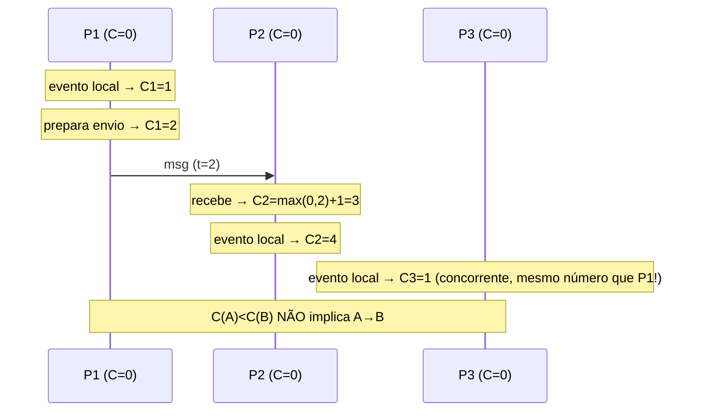

# Vector Clocks e Lamport Timestamps

> **Bloco:** Sistemas distribuídos · **Nível:** Avançado · **Tempo de leitura:** ~24 min

## TL;DR

Em sistemas distribuídos não há um relógio físico global confiável: relógios de parede divergem (clock skew), e a sincronização por NTP tem incerteza. Para **ordenar eventos** sem depender de tempo físico, usam-se **relógios lógicos**. **Lamport timestamps** (Leslie Lamport, 1978) atribuem a cada evento um contador que respeita a relação **happens-before** (→): se A → B, então `C(A) < C(B)`. A implicação é unidirecional — `C(A) < C(B)` **não** garante que A → B; eles podem ser concorrentes. Lamport clocks dão uma **ordem total** (com desempate por ID de processo) útil para algoritmos como exclusão mútua, mas **perdem a informação de concorrência**.

**Vector clocks** corrigem essa limitação: cada processo mantém um vetor com um contador por processo. Comparando dois vetores, você determina exatamente a relação causal: A → B, B → A, ou A ∥ B (**concorrentes**). Essa capacidade de **detectar concorrência** é o que torna vector clocks a ferramenta central de sistemas AP como Dynamo e Riak — eles detectam escritas conflitantes (versões divergentes do mesmo dado) para que a aplicação (ou um CRDT) possa reconciliá-las.

Para o arquiteto: Lamport clocks quando você precisa de ordem total barata e não se importa em distinguir concorrência; vector clocks quando precisa de **detecção de conflito causal** (replicação multi-master, reconciliação eventual). O custo de vector clocks é o tamanho (O(N) por evento) e a poda de entradas antigas. Variantes modernas: **version vectors**, **dotted version vectors** e **hybrid logical clocks (HLC)**, que combinam o melhor do físico e do lógico.

## O problema que resolve

A intuição newtoniana de "tempo absoluto" não sobrevive em sistemas distribuídos. Cada máquina tem seu relógio físico, e eles divergem por *drift* de cristal, latência de sincronização e ajustes do NTP. Pior: NTP pode fazer o relógio **andar para trás**. Logo, **timestamps de parede não são confiáveis para ordenar eventos** entre máquinas — dois eventos podem ter timestamps que invertem a ordem causal real. Usar `wall-clock` para decidir "qual escrita é mais recente" (last-write-wins) é a fonte de perdas de dados silenciosas em sistemas distribuídos.

Mas frequentemente não precisamos de tempo físico — precisamos de **ordem causal**: saber se um evento *poderia ter influenciado* outro. **Leslie Lamport** formalizou isso em **1978** no paper seminal *Time, Clocks, and the Ordering of Events in a Distributed System* (Communications of the ACM, vol. 21, nº 7) — um dos artigos mais citados de toda a ciência da computação, vencedor de prêmios de influência. A contribuição central foi a relação **happens-before** (denotada →), uma **ordem parcial** sobre eventos definida por três regras:

1. Se A e B ocorrem no **mesmo processo** e A vem antes de B, então A → B.
2. Se A é o **envio** de uma mensagem e B é o **recebimento** dessa mesma mensagem, então A → B.
3. **Transitividade**: se A → B e B → C, então A → C.

Se nem A → B nem B → A, os eventos são **concorrentes** (A ∥ B): nenhum pôde influenciar o outro. Lamport mostrou que essa ordem parcial é a única noção de "tempo" que importa para correção em sistemas distribuídos, e propôs os **Lamport logical clocks** para capturá-la numa ordem total consistente. O insight filosófico: o tempo, em sistemas distribuídos, é causalidade, não relógio.

A limitação dos Lamport clocks (não detectar concorrência) motivou os **vector clocks**, desenvolvidos independentemente por **Colin Fidge** e **Friedemann Mattern** em **1988**. Eles fornecem uma caracterização *exata* da relação happens-before — não só "A → B implica C(A) < C(B)", mas o recíproco também vale, permitindo distinguir causal de concorrente.

O paper do **Dynamo** (Amazon, SOSP 2007) levou vector clocks ao mainstream da engenharia: usou-os para versionar objetos e detectar quando duas escritas do mesmo dado eram concorrentes (precisando reconciliação) versus quando uma sucedeu causalmente a outra (a mais nova vence). Riak adotou o mesmo modelo.

## O que é (definição aprofundada)

**Lamport timestamp (logical clock).** Cada processo Pi mantém um contador inteiro `Ci`, atualizado por três regras:

1. **Evento interno ou envio**: antes do evento, `Ci = Ci + 1`.
2. **Envio de mensagem**: a mensagem carrega o timestamp `Ci` (após o incremento).
3. **Recebimento de mensagem com timestamp `t`**: `Ci = max(Ci, t) + 1`.

Propriedade fundamental (**clock condition**): se A → B, então `C(A) < C(B)`. A regra do `max` garante que o recebimento "puxa" o relógio para frente, preservando a causalidade através de mensagens.

A implicação é **unidirecional**: `A → B ⟹ C(A) < C(B)`, mas **`C(A) < C(B)` ⇏ A → B**. Dois eventos concorrentes podem ter qualquer relação de timestamps. Logo, Lamport clocks **não detectam concorrência** — dado apenas os números, você não sabe se há relação causal ou não.

Para obter uma **ordem total** (útil em algoritmos), desempata-se por ID de processo: `(C(A), Pi) < (C(B), Pj)` se `C(A) < C(B)`, ou `C(A) == C(B)` e `Pi < Pj`. Essa ordem total é **consistente** com a ordem parcial causal (nunca a contradiz), mas é parcialmente **arbitrária** (impõe ordem entre eventos genuinamente concorrentes). Lamport usou exatamente isso para construir um algoritmo de **exclusão mútua distribuída** sem coordenador central.

**Vector clock.** Cada processo Pi mantém um **vetor** `V` de tamanho N (número de processos), onde `V[j]` é o conhecimento de Pi sobre o contador lógico de Pj. Regras:

1. **Evento interno ou envio em Pi**: `V[i] = V[i] + 1`.
2. **Envio**: a mensagem carrega uma cópia do vetor `V`.
3. **Recebimento de vetor `Vm`**: para cada k, `V[k] = max(V[k], Vm[k])`; depois `V[i] = V[i] + 1`.

**Comparação de vetores** (a chave):

- `Va ≤ Vb` sse `Va[k] ≤ Vb[k]` para todo k.
- `Va < Vb` (A → B, B sucede causalmente A) sse `Va ≤ Vb` **e** `Va ≠ Vb`.
- A ∥ B (**concorrentes**) sse nem `Va ≤ Vb` nem `Vb ≤ Va` (cada vetor é maior em alguma posição e menor em outra).

A propriedade central — ausente nos Lamport clocks — é a **bicondicional**: `A → B ⟺ Va < Vb`. Isso permite **detecção exata de concorrência**, que é o objetivo prático.

**Version vector** é a especialização usada em **replicação de dados**: em vez de um vetor por processo/evento, mantém-se um vetor por **réplica** associado a cada **versão de um objeto**. Comparando os version vectors de duas réplicas do mesmo objeto, detecta-se se uma domina a outra (atualização simples) ou se são concorrentes (**conflito** a reconciliar).

**Dotted version vectors (DVV)**: refinamento que resolve um problema sutil dos version vectors clássicos — escritas concorrentes pelo *mesmo* cliente/réplica que infla falsamente o vetor (*sibling explosion*). Usados em versões modernas do Riak.

**Hybrid Logical Clocks (HLC)** (Kulkarni et al., 2014): combinam um componente de relógio físico (para legibilidade e proximidade com o tempo real) com um componente lógico (para preservar happens-before), num tamanho O(1) por evento. Resolvem o problema de "Lamport clocks não têm relação com tempo de parede" sem o custo O(N) dos vector clocks. Usados em CockroachDB, MongoDB e YugabyteDB.

## Como funciona

**Lamport clocks em ação.** Três processos P1, P2, P3, todos começando em 0.

- P1 faz um evento local: `C1 = 1`.
- P1 envia msg a P2 carregando `t = 2` (incrementa para 2 antes de enviar).
- P2 (em 0) recebe: `C2 = max(0, 2) + 1 = 3`.
- P2 faz evento local: `C2 = 4`.
- P3 (em 0) faz evento local independente: `C3 = 1`.

Note: o evento de P3 (timestamp 1) e o de P1 (timestamp 1) têm o *mesmo* número apesar de serem concorrentes — Lamport não distingue. E o recebimento em P2 (3) é maior que o envio de P1 (2), preservando a causalidade. Mas se compararmos o evento de P2 com timestamp 4 e o de P3 com timestamp 1, o número diz "P3 antes de P2", embora sejam concorrentes (P3 não influenciou P2). O número total ordena, mas mente sobre causalidade.

**Vector clocks em ação.** Mesma topologia, vetores `[P1, P2, P3]`, todos `[0,0,0]`.

- P1 evento local: `[1,0,0]`.
- P1 envia a P2 carregando `[1,0,0]` (já incrementado).
- P2 recebe: `max([0,0,0],[1,0,0]) = [1,0,0]`, depois incrementa sua posição → `[1,1,0]`.
- P3 evento local independente: `[0,0,1]`.

Agora compare:
- P1 `[1,0,0]` vs P2 `[1,1,0]`: `[1,0,0] ≤ [1,1,0]` e diferentes → **P1 → P2** (causal). Correto.
- P3 `[0,0,1]` vs P2 `[1,1,0]`: P3 é maior na posição 3, P2 é maior nas posições 1 e 2 → **incomparáveis → concorrentes (∥)**. Correto: P3 não influenciou P2.

O vetor capturou exatamente o que os Lamport clocks perderam.

**Detecção de conflito em replicação (o caso Dynamo).** Um objeto (digamos, um carrinho) tem um version vector. Réplica A e réplica B recebem escritas concorrentes durante uma partição:

- Estado inicial: `cart, vv = {A:1, B:1}`.
- Cliente escreve em A (adiciona item X): A produz `vv = {A:2, B:1}`.
- Concorrentemente, cliente escreve em B (adiciona item Y): B produz `vv = {A:1, B:2}`.
- Quando A e B sincronizam, comparam `{A:2,B:1}` e `{A:1,B:2}`: incomparáveis → **conflito**. As duas versões (*siblings*) são mantidas.
- A aplicação (ou um CRDT) reconcilia — no caso do carrinho, **merge por união**: `{X, Y}`, novo `vv = {A:2, B:2}`.

Esse fluxo — detectar siblings via version vector e reconciliar — é o coração da consistência eventual em Dynamo/Cassandra/Riak. Sem vector clocks, o sistema usaria LWW por timestamp físico e **perderia** silenciosamente o item X ou Y.

**O problema da escala.** O tamanho do vector clock cresce com o número de réplicas/escritores. Em sistemas com muitos clientes, o vetor pode explodir. Mitigações: **poda** de entradas antigas (com cuidado, pode reintroduzir falsos conflitos), usar version vectors por réplica (não por cliente), dotted version vectors, ou migrar para HLC quando a detecção exata de concorrência não é estritamente necessária.

## Diagrama de fluxo

Evolução de Lamport timestamps com troca de mensagem (incrementos e regra do max):



Decisão de relação causal via vector clock (comparação de vetores):

```mermaid
flowchart TD
    Start([Comparar Va e Vb]) --> Le1{Va[k] <= Vb[k]<br/>para todo k?}
    Le1 -->|Sim| Eq{Va == Vb?}
    Eq -->|Não| AB[A acontece-antes B<br/>A → B]
    Eq -->|Sim| Same[Mesmo evento/estado]
    Le1 -->|Não| Le2{Vb[k] <= Va[k]<br/>para todo k?}
    Le2 -->|Sim| BA[B acontece-antes A<br/>B → A]
    Le2 -->|Não| Conc[CONCORRENTES<br/>A ∥ B → CONFLITO<br/>reconciliar]
```

## Exemplo prático / caso real

**Cenário: carrinho de compras replicado multi-master numa plataforma de e-commerce brasileira.**

Para garantir disponibilidade (carrinho nunca pode estar offline — é receita direta), o carrinho é replicado em múltiplos data centers com escrita multi-master (modelo Dynamo, PA/EL). Durante uma partição de rede entre SP e Porto Alegre, o mesmo usuário (em redes móveis instáveis) adiciona produtos de dois caminhos que acabam em réplicas diferentes:

- Réplica SP recebe "adicionar Tênis", produz version vector `{SP:2, POA:1}`.
- Réplica POA recebe "adicionar Meia", produz `{SP:1, POA:2}`.

Quando a partição cicatriza e as réplicas sincronizam (via read-repair ou anti-entropia), elas comparam os version vectors. Como são **incomparáveis**, o sistema sabe que houve **escritas concorrentes** — não dá para dizer qual é "a mais nova". Em vez de aplicar last-write-wins (que descartaria Tênis *ou* Meia, frustrando o cliente e perdendo venda), o sistema mantém os dois *siblings* e os reconcilia com a semântica correta do domínio: **união** dos itens → carrinho final `{Tênis, Meia}`, novo vv `{SP:2, POA:2}`.

Esse é exatamente o caso do paper do Dynamo. E é também a razão do efeito colateral notório: como vector clocks detectam conflito mas a reconciliação por união nunca remove, **um item deletado durante uma partição podia "reaparecer"** após o merge — um trade-off aceito do design AP. A solução moderna é modelar o carrinho como um **CRDT** (OR-Set), que resolve remoções concorrentes de forma determinística sem siblings explícitos. Ver `06-crdts.md`.

Esboço de reconciliação (pseudocódigo leve):

```
def reconciliar(versao_a, versao_b):
    rel = comparar_vv(versao_a.vv, versao_b.vv)
    if rel == "A_DOMINA_B":
        return versao_a                       # A sucede B causalmente
    elif rel == "B_DOMINA_A":
        return versao_b
    else:  # CONCORRENTES
        itens = uniao(versao_a.itens, versao_b.itens)   # merge do domínio
        return nova_versao(itens, merge_vv(versao_a.vv, versao_b.vv))
```

Sistemas reais: **DynamoDB** e o **Dynamo** original (vector clocks/version vectors para versionamento), **Riak** (dotted version vectors), **Cassandra** (usa timestamps de escrita + LWW por padrão, *não* vector clocks — uma escolha que troca detecção de conflito por simplicidade, com risco de perda silenciosa), **CockroachDB**/**MongoDB**/**YugabyteDB** (hybrid logical clocks para ordenação consistente com tempo aproximado), **Git** (o DAG de commits é, em essência, um relógio causal — `git merge` reconcilia ramos concorrentes).

## Quando usar / Quando evitar

**Use Lamport timestamps quando:**

- Precisa de uma **ordem total** consistente com causalidade, barata (O(1) por evento), e **não** precisa distinguir eventos concorrentes — ex.: exclusão mútua distribuída, ordenação de eventos num log onde qualquer ordem causal-consistente serve, geração de IDs ordenáveis.

**Use vector clocks / version vectors quando:**

- Precisa **detectar conflitos** (escritas concorrentes) para reconciliação — replicação multi-master, sistemas AP com eventual consistency, sincronização offline-first, editores colaborativos.
- A capacidade de distinguir "causal" de "concorrente" vale o custo O(N) de tamanho.

**Use hybrid logical clocks (HLC) quando:** quer timestamps próximos do tempo físico real (para debugging, TTLs, leitura humana) **e** garantia de happens-before, com tamanho O(1). É o sweet spot moderno para bancos distribuídos.

**Evite vector clocks quando:** o número de escritores é grande e não-limitado (vetores explodem) e você não tem estratégia de poda — considere version vectors por réplica ou HLC. **Evite wall-clock + LWW** para reconciliar dados que importam: clock skew torna a "última escrita" arbitrária e descarta dados silenciosamente.

## Anti-padrões e armadilhas comuns

- **Usar `C(A) < C(B)` de Lamport para inferir causalidade.** A implicação só vale no sentido A→B ⟹ C(A)<C(B). O recíproco é falso. Concluir "A causou B porque tem timestamp menor" é incorreto.
- **Last-write-wins por wall-clock.** Clock skew faz a "última" escrita ser a do relógio mais adiantado, não a temporalmente posterior — perda de dados silenciosa. Use relógios lógicos para detectar concorrência primeiro.
- **Vetor crescendo sem limite (sibling/clock explosion).** Em sistemas com muitos clientes escritores, o vetor incha. Use version vectors por réplica, dotted version vectors, ou HLC; pode entradas com cuidado.
- **Poda agressiva de vector clocks.** Remover entradas antigas demais pode fazer o sistema perder a capacidade de distinguir causal de concorrente, gerando falsos conflitos ou falsas dominâncias.
- **Achar que detectar conflito = resolver conflito.** Vector clocks só *detectam* siblings; a **reconciliação** é responsabilidade do domínio (merge) ou de um CRDT. Detecção sem estratégia de merge não adianta.
- **Confundir Lamport e vector clocks.** Lamport dá ordem total sem detecção de concorrência; vector dá detecção exata de concorrência ao custo de O(N). Escolher o errado custa caro: ordem total onde você precisava de detecção, ou O(N) onde O(1) bastava.
- **Ignorar que NTP pode andar para trás.** Qualquer lógica que assume monotonicidade do relógio físico quebra. HLC e relógios lógicos protegem contra isso.

## Relação com outros conceitos

- **Modelos de consistência**: a relação happens-before de Lamport é *a definição* de causalidade que sustenta a **causal consistency**; vector clocks são o mecanismo que a implementa (rastreio de dependências). Ver `02-modelos-de-consistencia.md`.
- **Teorema CAP / PACELC**: vector clocks são a ferramenta dos sistemas AP para reconciliar divergência após uma partição cicatrizar, viabilizando alta disponibilidade. Ver `01-teorema-cap-e-pacelc.md`.
- **CRDTs**: muitos CRDTs usam version vectors/dots internamente para rastrear causalidade (ex.: OR-Set, delta-CRDTs), e oferecem a reconciliação determinística que vector clocks apenas habilitam. Ver `06-crdts.md`.
- **Consenso distribuído**: os *terms* do Raft e os números de proposta do Paxos funcionam como relógios lógicos monotônicos que ordenam tentativas de liderança/proposta. Ver `03-consenso-distribuido-paxos-raft-2pc-3pc.md`.
- **Idempotência**: reconciliação por merge (sobre siblings detectados por vector clock) deve ser idempotente e comutativa para convergir sob reentrega. Ver `04-idempotencia-e-semanticas-de-entrega.md`.

## Referências

- [Time, Clocks, and the Ordering of Events in a Distributed System — Leslie Lamport, 1978 (PDF oficial)](https://lamport.azurewebsites.net/pubs/time-clocks.pdf)
- [Time, clocks, and the ordering of events in a distributed system — Communications of the ACM (DOI)](https://dl.acm.org/doi/10.1145/359545.359563)
- [Dynamo: Amazon's Highly Available Key-value Store (SOSP 2007, PDF) — vector clocks na seção 4.4](https://www.allthingsdistributed.com/files/amazon-dynamo-sosp2007.pdf)
- [Conflict-free Replicated Data Types (CRDTs) — crdt.tech](https://crdt.tech/)
- [Consistency models reference — Jepsen (causal e happens-before)](https://jepsen.io/consistency)
- [distsys-class: relógios lógicos e vetoriais — Kyle Kingsbury (GitHub)](https://github.com/aphyr/distsys-class)
- [Conflict-free replicated data type — Wikipedia (seção de version vectors)](https://en.wikipedia.org/wiki/Conflict-free_replicated_data_type)
