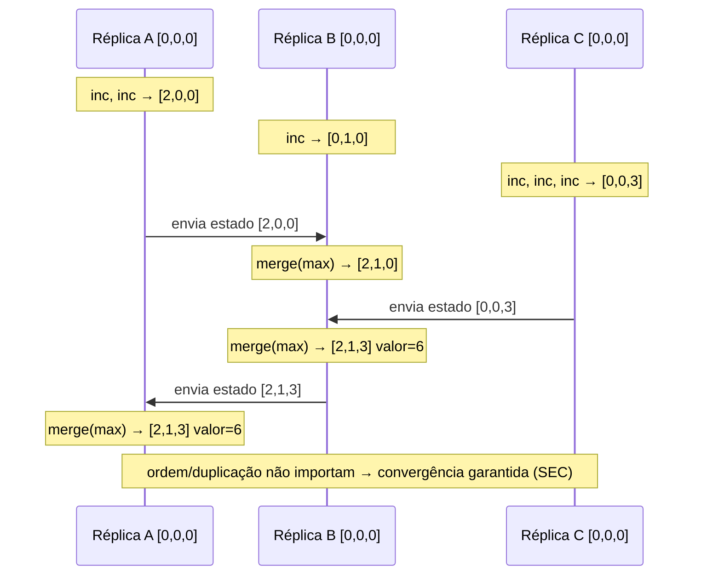
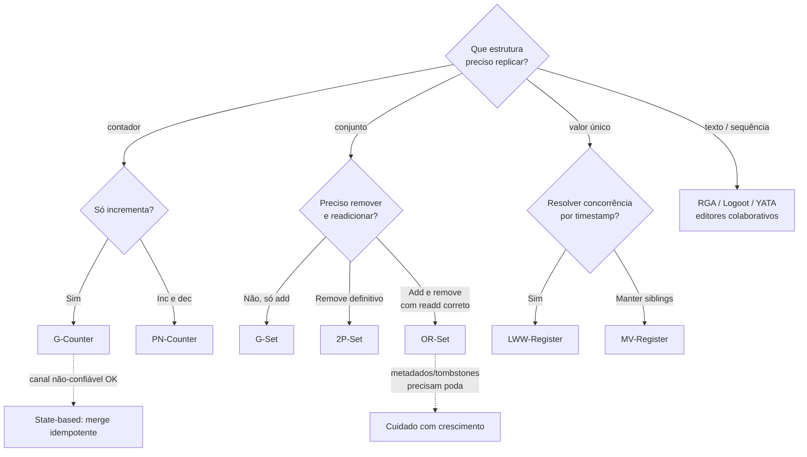

# CRDTs (Conflict-free Replicated Data Types)

> **Bloco:** Sistemas distribuídos · **Nível:** Avançado · **Tempo de leitura:** ~25 min

## TL;DR

**CRDTs** (Conflict-free Replicated Data Types) são estruturas de dados projetadas para replicação em múltiplos nós que **convergem automaticamente** para o mesmo estado, sem coordenação e sem resolução manual de conflitos. Qualquer réplica pode ser modificada localmente (alta disponibilidade, baixa latência), e quando réplicas trocam atualizações, elas chegam deterministicamente ao mesmo resultado. Isso entrega **strong eventual consistency (SEC)**: réplicas que receberam o mesmo conjunto de atualizações têm estado idêntico, garantidamente.

A mágica não é mágica: vem da matemática. CRDTs exigem que o merge seja uma operação **comutativa, associativa e idempotente** — formalmente, que o estado forme um **semilattice join** (semirreticulado), onde o merge é o *join* (supremo). Sob essas condições, a ordem de chegada, a duplicação e a reentrega de atualizações **não importam**: o resultado converge igual. Existem duas famílias: **state-based (CvRDT)**, que propagam o estado inteiro e fazem merge; e **operation-based (CmRDT)**, que propagam operações comutativas.

Tipos comuns: **G-Counter** e **PN-Counter** (contadores), **G-Set**, **2P-Set**, **LWW-Element-Set** e **OR-Set** (conjuntos), **LWW-Register** e **MV-Register** (registradores), e sequências/textos (**RGA**, **Logoot**, **YATA**) para edição colaborativa. Custo: alguns CRDTs acumulam metadados (*tombstones*, version vectors) que crescem; o design precisa lidar com poda e tamanho. Para o arquiteto: CRDTs são a resposta de engenharia ao dilema AP — disponibilidade total + convergência garantida — ideais para colaboração offline-first, contadores distribuídos, presença, carrinhos e edição em tempo real.

## O problema que resolve

Sistemas AP (disponíveis sob partição) permitem escritas concorrentes em réplicas diferentes, gerando **divergência**. A reconciliação tradicional é dolorosa: *last-write-wins* (LWW) **perde dados** silenciosamente; **vector clocks** *detectam* o conflito mas empurram a resolução para a aplicação (siblings que alguém precisa mesclar manualmente, frequentemente com regras ad-hoc e bugosas). A pergunta natural: existe uma classe de tipos de dados onde a reconciliação seja **automática, determinística e provadamente correta**, sem nunca perder atualizações nem exigir consenso?

A resposta é sim, sob condições matemáticas específicas, e o conceito foi formalizado por **Marc Shapiro**, **Nuno Preguiça**, **Carlos Baquero** e **Marek Zawirski** em **2011**, no relatório técnico do Inria *A Comprehensive Study of Convergent and Commutative Replicated Data Types* (RR-7506) e no paper *Conflict-Free Replicated Data Types* (SSS 2011). Eles uniram duas linhas de pesquisa anteriores — tipos *convergentes* (state-based, baseados em merge de estado) e *comutativos* (operation-based, baseados em operações que comutam) — sob o nome CRDT e provaram as condições suficientes para **strong eventual consistency**.

A motivação histórica vem de dois mundos: **edição colaborativa** (o problema de múltiplos usuários editando o mesmo documento, atacado antes por *Operational Transformation* — a técnica do Google Docs, notoriamente difícil de implementar corretamente) e **computação móvel/desconectada** (réplicas que operam offline e sincronizam depois, como no sistema Bayou). CRDTs ofereceram uma fundação mais simples e composável que OT para esses problemas.

O resultado teórico central que CRDTs exploram: se o estado das réplicas forma um **join-semilattice** (conjunto parcialmente ordenado onde todo par tem um supremo / *least upper bound*) e as atualizações são funções monotônicas que só "sobem" no reticulado, então o merge (= join) é comutativo, associativo e idempotente — e a convergência é garantida independentemente de ordem, duplicação ou reentrega. É a tradução de **eventual consistency** (uma garantia fraca de liveness) para **strong eventual consistency** (uma garantia forte: mesmo conjunto de updates ⟹ mesmo estado, sempre).

## O que é (definição aprofundada)

**Strong Eventual Consistency (SEC).** A garantia que CRDTs oferecem: (1) *eventual delivery* — toda atualização chega a todas as réplicas; (2) *convergence* — réplicas que entregaram o mesmo conjunto de atualizações têm estado equivalente; (3) *termination* — todas as execuções de merge terminam. Diferente da eventual consistency comum, SEC **não** precisa de resolução de conflito nem de consenso: a convergência é uma propriedade matemática do tipo de dado.

**Duas famílias.**

- **State-based (Convergent RDT, CvRDT).** Cada réplica mantém um estado completo. Periodicamente, uma réplica envia seu estado inteiro a outra, que faz `merge(estado_local, estado_recebido)`. Para correção, o estado precisa formar um **join-semilattice** e a função merge precisa ser o **join (LUB)**: comutativa (`m(a,b)=m(b,a)`), associativa (`m(m(a,b),c)=m(a,m(b,c))`) e idempotente (`m(a,a)=a`). As atualizações locais devem ser **monotônicas** (nunca "descem" no reticulado). Vantagem: tolera qualquer canal de comunicação (perda, duplicação, reordenação) porque merge é idempotente/comutativo. Desvantagem: propagar o estado inteiro pode ser caro (mitigado por **delta-CRDTs**, que enviam só o "delta" do estado).

- **Operation-based (Commutative RDT, CmRDT).** Réplicas propagam **operações** (não o estado). Cada operação é aplicada localmente e difundida; outras réplicas aplicam a operação ao receber. Para correção, as operações concorrentes precisam **comutar** (a ordem de aplicação não muda o resultado), e o canal precisa garantir **entrega exatamente uma vez, em ordem causal** (ou as operações precisam ser idempotentes). Vantagem: mensagens pequenas (só a operação). Desvantagem: exige garantias mais fortes do middleware de entrega (causal broadcast, sem duplicação). State-based e op-based são **equivalentes em poder expressivo** — qualquer CRDT pode ser expresso nas duas formas.

**Tipos canônicos.**

- **G-Counter (grow-only counter).** Vetor com um contador por réplica; incremento mexe só na própria posição; merge faz `max` posição a posição; valor = soma. Só cresce.
- **PN-Counter (positive-negative).** Dois G-Counters (P para incrementos, N para decrementos); valor = soma(P) − soma(N). Permite decrementar.
- **G-Set (grow-only set).** Conjunto que só admite `add`; merge = união. Idempotente e comutativo trivialmente.
- **2P-Set (two-phase set).** Um G-Set de adicionados e um de removidos (tombstones); um elemento removido **nunca** pode ser readicionado. Simples, mas limitado.
- **LWW-Element-Set.** Cada elemento carrega timestamp de add e de remove; o mais recente vence. Sofre dos problemas de LWW (clock skew).
- **OR-Set (Observed-Remove Set).** O conjunto "certo" para a maioria dos casos: cada `add` gera uma *tag* única; `remove` só apaga as tags *observadas* no momento. Resolve o dilema add-vs-remove concorrente com a semântica intuitiva "add vence sobre remove concorrente" — readicionar funciona, e itens não "reaparecem" indevidamente. É a base de carrinhos e listas colaborativas modernas.
- **LWW-Register / MV-Register (multi-value).** Registrador de valor único: LWW escolhe por timestamp; MV mantém todos os valores concorrentes (siblings) para a aplicação resolver.
- **Sequências/Texto**: **RGA** (Replicated Growable Array), **Logoot**, **Treedoc**, **YATA** (base do Yjs) — para inserções/remoções concorrentes em texto/listas, o problema mais difícil, base de editores colaborativos.

**A propriedade que tudo unifica**: comutatividade + associatividade + idempotência do merge garantem que, dado o mesmo conjunto de atualizações, qualquer ordem de aplicação leva ao mesmo estado. Isso é por que CRDTs dispensam coordenação: não há "conflito" a resolver porque o merge é determinístico por construção. "Conflict-free" não significa "sem escritas concorrentes" — significa "a reconciliação de escritas concorrentes é livre de ambiguidade".

## Como funciona

**G-Counter, passo a passo.** Três réplicas A, B, C, cada uma com vetor `[A,B,C]` inicial `[0,0,0]`.

- A incrementa 2x: `[2,0,0]`. B incrementa 1x: `[0,1,0]`. C incrementa 3x: `[0,0,3]`.
- A e B sincronizam: `merge = [max(2,0), max(0,1), max(0,0)] = [2,1,0]`. Valor = 3.
- Depois todos sincronizam: `[2,1,3]`. Valor = 6.

A ordem dos merges não importa, e re-enviar um estado já visto não muda nada (idempotência do `max`). Mesmo que A receba o estado de B duas vezes, o `max` absorve a duplicata. Esse é o motivo de CRDTs serem robustos a at-least-once delivery e reordenação — eles **transformam o problema de idempotência em propriedade do tipo de dado**.

**OR-Set, o caso interessante — add vs remove concorrente.** Suponha o conjunto `{X}`.

- Réplica A faz `remove(X)`: apaga a tag de X que A observou, digamos `X:tag1`.
- Concorrentemente, réplica B faz `add(X)` de novo: cria nova tag `X:tag2`.
- No merge: A removeu `tag1`, mas `tag2` (a adição concorrente de B) **não foi observada** por A no momento do remove. Logo `tag2` sobrevive → X permanece no conjunto.
- Semântica resultante: **add concorrente vence sobre remove**. Intuitivo e sem "ressurreição" espúria de elementos genuinamente removidos.

Compare com o 2P-Set, onde X removido nunca volta (readicionar é impossível) — semântica frequentemente errada para o usuário. O OR-Set acerta ao custo de manter tags (metadados), que precisam de poda eventual.

**A condição matemática, concretamente.** Para um state-based CRDT ser correto, o conjunto de estados possíveis com a relação de ordem precisa ser um **join-semilattice**, e:

- `merge(a, b) = merge(b, a)` — comutatividade (ordem de chegada irrelevante).
- `merge(merge(a,b), c) = merge(a, merge(b,c))` — associatividade (agrupamento irrelevante).
- `merge(a, a) = a` — idempotência (duplicatas irrelevantes).
- Atualizações locais são monotônicas: o novo estado domina o anterior (`a ≤ update(a)`).

Se essas valem, o estado de cada réplica é o *join* de todas as atualizações que ela viu, e duas réplicas que viram o mesmo conjunto têm o mesmo join → convergem. Não precisa de relógio confiável, consenso ou ordem de mensagens. **Delta-state CRDTs** (Almeida, Shapiro et al.) otimizam o state-based propagando apenas as mudanças incrementais (deltas), mantendo as mesmas garantias com muito menos tráfego.

## Diagrama de fluxo

State-based CRDT: réplicas evoluindo independentemente e convergindo por merge (PN-Counter / G-Counter):



Decisão: qual tipo/família de CRDT usar:



## Exemplo prático / caso real

**Cenário 1: contador de curtidas/visualizações distribuído numa rede social brasileira.**

Curtidas chegam de múltiplas regiões concorrentemente, em altíssimo volume. Coordenar cada incremento via consenso seria suicídio de latência e throughput. Solução: um **PN-Counter** (ou G-Counter, se só incrementa). Cada região incrementa localmente (latência sub-ms, disponível mesmo sob partição) e os estados são mesclados em background por `max` posição a posição. O total converge para a soma correta deterministicamente, sem perder nenhum incremento e sem coordenação. É o uso clássico de CRDT para contadores em escala.

**Cenário 2: carrinho de compras replicado (a evolução do caso Dynamo).**

No paper do Dynamo, o carrinho usava vector clocks + merge por união, com o efeito colateral de itens deletados "ressuscitarem". Modelando o carrinho como um **OR-Set**, esse bug some: `add(item)` e `remove(item)` concorrentes resolvem com semântica correta (add concorrente vence, mas um remove genuíno de um item já observado persiste). O cliente adiciona itens em duas réplicas particionadas; ao sincronizar, o OR-Set converge para a união correta, e remoções funcionam sem ressurreição. Disponibilidade total (PA/EL) + convergência garantida, sem lógica de reconciliação ad-hoc na aplicação.

**Cenário 3: edição colaborativa em tempo real (estilo Google Docs / Figma / Notion).**

Múltiplos usuários editam o mesmo documento simultaneamente, possivelmente offline. CRDTs de sequência (**RGA**/**YATA**) permitem que cada cliente insira/remova caracteres localmente (resposta instantânea, funciona offline) e sincronize quando reconectar, convergindo todos para o mesmo texto sem perder edições nem precisar de servidor coordenador autoritativo. Bibliotecas reais: **Yjs** (YATA) e **Automerge** — ambas amplamente usadas em apps colaborativos e local-first. É a alternativa moderna ao Operational Transformation, mais simples de implementar corretamente.

Esboço de OR-Set (pseudocódigo leve):

```
# add: cria tag única e a associa ao elemento
def add(elem):
    tag = (replica_id, contador_local())
    adds.insere((elem, tag))

# remove: marca como removidas apenas as tags JÁ observadas
def remove(elem):
    tags_observadas = { t for (e, t) in adds if e == elem }
    removes |= tags_observadas

# valor: elemento presente se tem alguma tag adicionada e não removida
def valor():
    return { e for (e, t) in adds if t not in removes }

# merge: união dos adds e dos removes (comutativo, associativo, idempotente)
def merge(outro):
    adds |= outro.adds
    removes |= outro.removes
```

Sistemas reais: **Redis** (tipo `CRDT` no Redis Enterprise / Active-Active geo-replicação baseada em CRDTs), **Riak** (Riak DT: counters, sets, maps, registers CRDT-based), **Azure Cosmos DB** (replicação multi-region com merge automático), **Yjs** e **Automerge** (edição colaborativa local-first), **Figma** e **Linear** (modelos colaborativos inspirados em CRDT), **SoundCloud Roshi** (LWW-element-set CRDT para timelines).

## Quando usar / Quando evitar

**Use CRDTs quando:**

- Você precisa de **alta disponibilidade e baixa latência com escrita multi-master** (AP/EL) e quer convergência **garantida** sem coordenação — contadores, conjuntos, presença online, flags, carrinhos.
- O cenário é **offline-first / local-first**: apps que funcionam desconectados e sincronizam depois (mobile, edge, colaboração).
- **Edição colaborativa em tempo real** de texto/listas/estruturas.
- A semântica de merge do domínio pode ser expressa como uma operação comutativa/associativa/idempotente (a maioria dos casos "naturais" pode).

**Evite CRDTs quando:**

- O domínio exige **invariantes globais** que CRDTs não conseguem manter sem coordenação — ex.: "saldo nunca negativo", "estoque nunca abaixo de zero", unicidade global. CRDTs garantem convergência, **não** invariantes que dependem do estado agregado de todas as réplicas. Para isso você precisa de consenso (CP) ou reservas/bounded counters com escopo coordenado.
- A semântica de conflito do domínio **não** é comutativa/associativa (ordem importa de fato) — forçar um CRDT distorce o significado.
- O custo de metadados (tombstones, tags, version vectors) é proibitivo e você não tem estratégia de poda viável.

**Regra prática**: CRDTs são para **convergência sem coordenação**; consenso é para **invariantes com coordenação**. Escolha pelo que o domínio exige.

## Anti-padrões e armadilhas comuns

- **Esperar que CRDTs mantenham invariantes globais.** Um PN-Counter pode ir abaixo de zero se duas réplicas decrementam concorrentemente além do saldo — CRDTs convergem, mas não impõem "saldo ≥ 0". Invariantes globais exigem coordenação (consenso ou bounded counters como o trabalho de Balegas et al.).
- **Usar LWW-Register/LWW-Set onde dados importam.** LWW herda todos os problemas do last-write-wins: clock skew torna a "última" arbitrária e descarta escritas concorrentes silenciosamente. Prefira OR-Set/MV-Register quando perder dados é inaceitável.
- **2P-Set quando o usuário espera readicionar.** Um item removido nunca pode voltar — quase sempre semântica errada. Use OR-Set.
- **Ignorar o crescimento de metadados.** Tombstones e tags acumulam indefinidamente sem poda; o estado incha e merges ficam caros. Planeje *garbage collection* causal (com cuidado para não reintroduzir bugs).
- **Op-based CRDT sobre canal que não garante o exigido.** Operation-based assume entrega causal e sem duplicação (ou operações idempotentes); rodar sobre um canal at-least-once sem essas garantias quebra a convergência. State-based é mais tolerante.
- **Reinventar OT/CRDT de sequência do zero.** Editores colaborativos corretos são notoriamente difíceis; use Yjs/Automerge em vez de implementar RGA na mão.
- **Achar que CRDT = sem conflito de negócio.** "Conflict-free" é sobre a *reconciliação técnica* ser determinística. Conflitos de *intenção* (dois usuários querem coisas incompatíveis) ainda existem e podem exigir UX de resolução.

## Relação com outros conceitos

- **Modelos de consistência**: CRDTs entregam **strong eventual consistency**, a versão "forte" da eventual consistency — convergência determinística e garantida, sem resolução de conflito. Ver `02-modelos-de-consistencia.md`.
- **Teorema CAP / PACELC**: CRDTs são a materialização mais elegante do lado **AP/EL** — disponibilidade total e baixa latência, com a convergência que o eventual consistency comum não garante de forma determinística. Ver `01-teorema-cap-e-pacelc.md`.
- **Vector clocks / version vectors**: muitos CRDTs (OR-Set, delta-CRDTs) usam *dots* e version vectors internamente para rastrear causalidade das operações; CRDTs vão além ao prover a reconciliação automática que vector clocks apenas habilitam (detectando conflito). Ver `05-vector-clocks-e-lamport-timestamps.md`.
- **Idempotência e semânticas de entrega**: CRDTs são idempotência elevada à propriedade do tipo de dado — merges idempotentes/comutativos tornam at-least-once delivery seguro sem dedup explícito. Ver `04-idempotencia-e-semanticas-de-entrega.md`.
- **Consenso distribuído**: CRDTs e consenso são complementares e opostos no eixo coordenação — CRDTs evitam coordenação (convergência); consenso impõe coordenação (invariantes/ordem total). Sistemas reais combinam ambos por subsistema. Ver `03-consenso-distribuido-paxos-raft-2pc-3pc.md`.

## Referências

- [Conflict-free Replicated Data Types — crdt.tech (portal de referência)](https://crdt.tech/)
- [CRDT Papers — crdt.tech](https://crdt.tech/papers.html)
- [A Comprehensive Study of Convergent and Commutative Replicated Data Types — Shapiro, Preguiça, Baquero, Zawirski (Inria RR-7506)](https://inria.hal.science/inria-00555588/en/)
- [Conflict-free Replicated Data Types (CRDTs) — Preguiça et al. (arXiv 1805.06358)](https://arxiv.org/abs/1805.06358)
- [Conflict-free replicated data type — Wikipedia](https://en.wikipedia.org/wiki/Conflict-free_replicated_data_type)
- [Dynamo: Amazon's Highly Available Key-value Store (SOSP 2007, PDF) — origem do problema de reconciliação](https://www.allthingsdistributed.com/files/amazon-dynamo-sosp2007.pdf)
- [Consistency models reference — Jepsen (strong eventual consistency)](https://jepsen.io/consistency)
