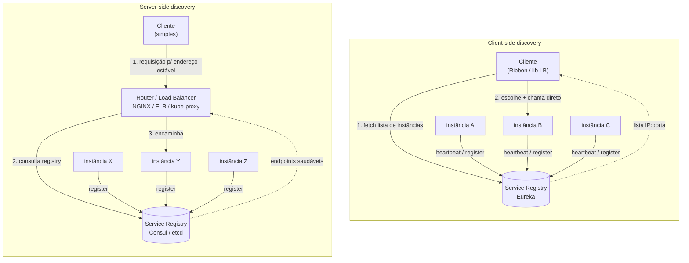
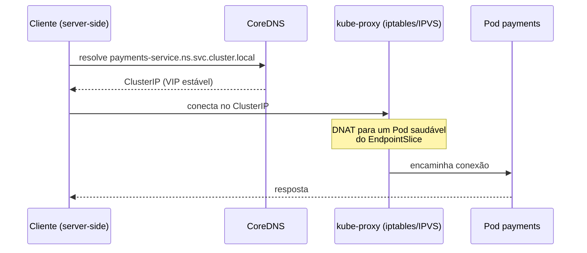

# Service Discovery e Load Balancing

> **Bloco:** Sistemas distribuídos · **Nível:** Avançado · **Tempo de leitura:** ~24 min

## TL;DR

Em arquiteturas de microsserviços rodando sobre infraestrutura dinâmica (containers, autoscaling, instâncias efêmeras), os endereços de rede das instâncias mudam constantemente. **Service Discovery** é o mecanismo que resolve "qual é o conjunto de instâncias saudáveis do serviço X e onde elas estão agora". **Load Balancing** é a decisão complementar: "para qual dessas instâncias eu mando esta requisição". Existem dois grandes modelos de distribuição dessa responsabilidade: **client-side** (o cliente consulta um registry, mantém a lista de instâncias e escolhe ele mesmo o destino — ex.: Netflix Eureka + Ribbon) e **server-side** (o cliente fala com um endereço estável de um balanceador/router que faz a descoberta e o roteamento — ex.: NGINX, AWS ELB, Kubernetes Service + kube-proxy). A escolha tem implicações profundas em latência, acoplamento, suporte multi-linguagem, política de balanceamento e onde mora a complexidade operacional. Service mesh (Istio/Linkerd) é, em essência, uma forma de mover a inteligência de client-side LB para um sidecar, combinando o melhor dos dois mundos.

## O problema que resolve

### Por que a topologia deixou de ser estática

Antes de detalhar, vale fixar a mudança de paradigma que torna o discovery necessário. Três forças tornaram a topologia de rede uma função do tempo:

- **Containerização e orquestração.** Containers são efêmeros por design. Um orquestrador (Kubernetes) cria, mata e recria Pods constantemente — por deploys, por falhas de nó, por reescalonamento. Cada Pod recebe um IP novo de uma rede de overlay. Não há "o servidor de pagamento"; há um conjunto mutável de Pods.
- **Elasticidade / autoscaling.** A capacidade responde à carga em tempo real. O número de instâncias de um serviço é uma variável, não uma constante de configuração.
- **Imutabilidade e entrega contínua.** Em vez de atualizar servidores in-place, sobe-se instâncias novas e derruba-se as antigas (immutable infrastructure). Cada deploy é uma rotação completa de endpoints.

A consequência: a configuração estática (arquivos de propriedades com IPs, DNS de TTL alto) tornou-se incompatível com a realidade operacional. Discovery dinâmico deixou de ser luxo e virou pré-requisito de qualquer arquitetura de microsserviços moderna.

Em arquiteturas monolíticas ou em sistemas distribuídos "clássicos" com topologia estática, a localização dos serviços era trivial: você tinha um número fixo de servidores, com IPs e portas conhecidos, configurados num arquivo de propriedades ou num DNS estável. Um cliente que precisava chamar o serviço de pagamento sabia que ele estava em `10.0.3.12:8443`, e ponto. Quando muito, havia um balanceador de hardware (F5, Citrix NetScaler) na frente, também com endereço fixo.

Esse modelo desmorona com **microsserviços sobre infraestrutura elástica**. Considere o que muda:

- **Endereçamento dinâmico.** Instâncias são criadas e destruídas continuamente por orquestradores (Kubernetes), por autoscaling groups (AWS ASG) ou por deploys. Cada nova instância recebe um IP diferente, frequentemente de um range de rede de sobreposição (overlay network). O IP de ontem não é o IP de hoje.
- **Cardinalidade variável.** O número de instâncias de um serviço varia conforme a carga. Na Black Friday, o serviço de checkout pode ter 200 réplicas; às 4h da manhã, 8. A topologia é uma função do tempo.
- **Falhas parciais.** Instâncias morrem (OOM, crash, node failure) sem aviso. O cliente precisa parar de enviar tráfego para instâncias mortas em segundos, não em minutos.
- **Multiplicidade de consumidores.** Um mesmo serviço é chamado por dezenas de outros serviços, cada um precisando da lista atualizada de endpoints.

A pergunta central que Service Discovery responde é: **"Dado o nome lógico de um serviço (ex.: `payments-service`), qual é o conjunto de endpoints de rede (IP:porta) das instâncias atualmente saudáveis e disponíveis?"** Sem um mecanismo automático, você cairia em alternativas inviáveis: hardcode de IPs (impossível com IPs dinâmicos), reconfiguração manual a cada deploy (não escala) ou DNS round-robin puro (TTL alto demais para topologia dinâmica, sem health checking real, sem controle de política).

O problema de **Load Balancing** é correlato mas distinto: uma vez que você sabe *quais* são as instâncias saudáveis, *qual* delas deve receber a próxima requisição? A escolha errada concentra carga, ignora latência diferencial entre instâncias (algumas em zonas de disponibilidade mais próximas, algumas com GC pause em andamento) e desperdiça capacidade.

A origem prática desses padrões está fortemente ligada à Netflix, que ao migrar para microsserviços na AWS por volta de 2010-2012 construiu o **Eureka** (service registry) e o **Ribbon** (client-side load balancer IPC), tornando-os referência da indústria. O catálogo de padrões de Chris Richardson em microservices.io formalizou a taxonomia client-side vs server-side discovery.

### Os três atores e o ciclo de vida

Antes da definição formal, fixe o vocabulário em três atores e o ciclo que os liga:

- **Provedor (provider):** o serviço cujas instâncias precisam ser encontradas. Ele *aparece* (sobe), *se anuncia* (registra), *prova que está vivo* (heartbeat/probe) e eventualmente *desaparece* (morre ou é desligado).
- **Registry:** o repositório que sabe, a qualquer instante, o conjunto de instâncias do provedor e seu estado de saúde. É a fonte de verdade da topologia.
- **Consumidor (consumer):** o serviço que precisa chamar o provedor. Ele *pergunta* ao registry (ou a um intermediário) onde estão as instâncias e *escolhe* uma (load balancing).

O ciclo de vida que costura tudo: **instância sobe → registra (self ou third-party) → fica healthy → entra no pool servível → recebe tráfego → degrada/morre → é detectada (heartbeat expira ou probe falha) → sai do pool → tráfego para de fluir**. Cada transição tem uma latência (a *staleness*) e um mecanismo (heartbeat, probe, watch). Entender esse ciclo é entender onde estão os riscos: tráfego para uma instância que já morreu mas ainda não saiu do pool, ou tráfego negado para uma que subiu mas ainda não entrou.

### Glossário rápido

- **Service Registry:** banco de dados de instâncias e seu estado de saúde; a fonte de verdade da topologia.
- **Registration:** como instâncias entram no registry (self ou third-party).
- **Lookup / Resolution:** como consumidores obtêm a lista de instâncias.
- **Heartbeat:** sinal periódico de "estou vivo" enviado pela instância (modelo push).
- **Probe / active health check:** sondagem ativa de um endpoint de saúde (modelo pull).
- **Readiness vs Liveness:** pronto para tráfego vs processo vivo (Kubernetes).
- **Staleness:** atraso entre uma mudança real de topologia e sua reflexão na lista usada pelos clientes.
- **Client-side discovery:** o cliente descobre e balanceia (Eureka+Ribbon).
- **Server-side discovery:** um intermediário descobre e balanceia (ELB, kube-proxy).
- **EWMA / P2C:** algoritmos de LB modernos (latência ponderada / power of two choices).

## O que é (definição aprofundada)

**Service Discovery** é o processo pelo qual um cliente (consumidor) descobre, em tempo de execução, a localização de rede das instâncias de um serviço-alvo (provedor). Ele se decompõe em dois subprocessos:

- **Service Registration:** como as instâncias do provedor anunciam sua existência e estado de saúde a um repositório central. Pode ser **self-registration** (a própria instância chama uma API do registry ao subir e envia heartbeats periódicos — modelo do Eureka) ou **third-party registration** (um componente externo, o *registrar*, observa o orquestrador/plataforma e registra/desregistra instâncias em nome delas — ex.: Registrator com Consul, ou o próprio control plane do Kubernetes populando Endpoints).
- **Service Lookup / Resolution:** como o consumidor consulta o registry para obter a lista de instâncias.

O componente central é o **Service Registry**: um banco de dados de instâncias de serviços e seus metadados (IP, porta, status de saúde, versão, zona, peso). Por ser infraestrutura crítica — se ele cai, ninguém acha ninguém — o registry precisa ser **altamente disponível** e tipicamente é construído sobre um sistema de consenso ou replicação: **Consul** e **etcd** usam Raft; **ZooKeeper** usa ZAB; o **Eureka** abdica deliberadamente de consistência forte em favor de disponibilidade (escolha **AP** no espectro CAP), aceitando ler dados potencialmente stale para nunca ficar indisponível.

**Load Balancing** é a política de seleção de uma instância dentre as candidatas. Algoritmos comuns:

- **Round-robin:** distribui sequencialmente. Simples, ignora estado.
- **Weighted round-robin:** instâncias com mais capacidade recebem peso maior.
- **Least connections / least requests:** envia para a instância com menos conexões/requisições ativas. Adapta-se melhor a requisições de duração heterogênea.
- **Latency-aware / EWMA (exponentially weighted moving average):** prioriza instâncias com menor latência observada recentemente — usado pelo Linkerd ("latency-aware load balancing") e pelo Envoy.
- **Power of two choices (P2C):** escolhe duas instâncias aleatórias e fica com a de menor carga. Aproxima o least-connections com custo computacional O(1) e excelente distribuição estatística — padrão moderno em Envoy e Linkerd.
- **Consistent hashing:** mapeia requisições para instâncias de forma estável (usado quando se quer afinidade de sessão ou cache locality — ver documento sobre Consistent Hashing).

A distinção arquitetural central é **onde** a lógica de discovery + LB executa:

### Client-side discovery

O **cliente é responsável** por consultar o service registry, manter (em cache local) a lista de instâncias e aplicar o algoritmo de balanceamento para escolher o destino, fazendo então a chamada direta à instância selecionada. Não há intermediário no caminho de dados (data path).

- **Implementações:** Netflix **Eureka** (registry) + **Ribbon** (LB client lib); Spring Cloud LoadBalancer; gRPC com resolver customizado.
- **Vantagens:** menos um hop de rede (menor latência); o cliente conhece a topologia e pode aplicar balanceamento inteligente e específico (latency-aware por instância); sem ponto único de gargalo no caminho de dados.
- **Desvantagens:** **acoplamento ao registry** e necessidade de uma biblioteca client-side por linguagem/framework (poliglotismo vira problema operacional sério); lógica de discovery duplicada e versionada em todos os consumidores.

### Server-side discovery

O cliente faz a requisição a um **endereço estável de um roteador/balanceador** (DNS bem conhecido, VIP). Esse intermediário consulta o registry, escolhe a instância e encaminha a requisição. O cliente não sabe e não se importa com a topologia.

- **Implementações:** AWS **Elastic Load Balancer (ALB/NLB)**; **NGINX** / NGINX Plus; **Envoy** como edge proxy; **Kubernetes Service** (o `ClusterIP` + kube-proxy/iptables/IPVS faz server-side LB transparente, com o control plane populando os Endpoints como registry de facto).
- **Vantagens:** **agnóstico a linguagem e framework** — qualquer cliente que fale HTTP/TCP funciona; lógica de discovery centralizada e operada por um time de plataforma; cliente trivialmente simples.
- **Desvantagens:** **hop extra** no caminho de dados (latência adicional); o balanceador é infraestrutura adicional que precisa ser altamente disponível e ela mesma escalável (pode virar gargalo); menos visibilidade fim-a-fim para o cliente.

## Como funciona

### Fluxo client-side (Eureka + Ribbon)

1. **Registro.** Ao iniciar, cada instância de `payments-service` chama a API REST do Eureka Server registrando seu IP, porta, e metadados. Em seguida envia **heartbeats** (renovações de lease) a cada 30s (default).
2. **Expiração.** Se o Eureka não recebe heartbeats por um período (default 90s), considera a instância morta e a remove do registry. (Há também o "self-preservation mode": se muitos heartbeats falham de uma vez — sugerindo problema de rede do próprio Eureka, não morte real das instâncias —, ele para de expirar para não derrubar tudo. Comportamento AP clássico.)
3. **Fetch do registry.** O cliente (com Ribbon) baixa periodicamente (default 30s) a lista completa de instâncias e a mantém em cache local. Aqui mora a *staleness*: a lista pode estar até ~30s desatualizada.
4. **Balanceamento e chamada.** Ao chamar `payments-service`, o Ribbon aplica seu algoritmo (round-robin, weighted response time, etc.) sobre o cache local, escolhe um IP:porta e faz a chamada HTTP direta.
5. **Resiliência local.** Se a instância escolhida falhar, o Ribbon pode tentar outra da lista (retry) e marcar a instância como suspeita (circuit breaking local, frequentemente integrado com Hystrix).

### Fluxo server-side (Kubernetes Service)

1. **Registro implícito.** Pods sobem; o kubelet reporta o status ao API server. Quando um Pod fica `Ready` (passa nos readiness probes), o **EndpointSlice controller** adiciona o IP do Pod ao EndpointSlice associado ao Service. O registry aqui é o etcd, populado pelo control plane (third-party registration).
2. **Resolução de nome.** O cliente resolve `payments-service.namespace.svc.cluster.local` via CoreDNS para o `ClusterIP` (um IP virtual estável).
3. **Roteamento.** O tráfego para o ClusterIP é interceptado por **kube-proxy** (modo iptables ou IPVS) no nó de origem, que faz DNAT distribuindo a conexão entre os IPs dos Pods saudáveis (geralmente round-robin/randômico em iptables; algoritmos mais ricos em IPVS).
4. **Health.** Readiness probes que falham fazem o controller remover o Pod do EndpointSlice automaticamente; o tráfego para de fluir em segundos.

### O caso do service mesh

O service mesh (Istio com Envoy, Linkerd) é um modelo híbrido elegante: a inteligência de **client-side LB** (latency-aware, P2C, circuit breaking, retry) executa num **sidecar proxy** colado ao cliente, *fora* do código de aplicação. O control plane (istiod) descobre as instâncias (a partir do registry do Kubernetes) e empurra a configuração de endpoints para os sidecars via xDS. Você obtém o balanceamento inteligente do client-side sem a biblioteca por linguagem — o sidecar é a "biblioteca" universal. Ver o documento sobre Service Mesh para o detalhamento.

### Health checking: o coração da disponibilidade

Discovery sem health checking é discovery quebrado: de nada adianta saber que uma instância *existe* se ela não consegue *servir*. Há três modelos:

- **Heartbeat / push (self-reporting):** a instância envia sinais periódicos ao registry ("estou viva"). É o modelo do Eureka. Barato e escalável (o registry não precisa sondar ninguém), mas detecta apenas "o processo está vivo e consegue falar com o registry" — não garante que ele consegue servir requisições reais. Uma instância com o banco caído pode continuar mandando heartbeats.
- **Active health check / pull (probing):** o registry ou balanceador **sonda ativamente** um endpoint de saúde (`GET /health`) de cada instância. É o modelo de Consul, NGINX e dos health checks de ELB. Detecta melhor a capacidade real de servir (se o `/health` for profundo), mas tem custo de O(instâncias) sondas e adiciona carga.
- **Readiness vs liveness (Kubernetes):** o Kubernetes separa **liveness** (o processo está vivo? se não, reinicia) de **readiness** (está pronto para receber tráfego? se não, remove dos endpoints sem matar). Essa separação é crucial: durante um warm-up (carregar cache, abrir pool de conexões), a instância está *viva* mas *não pronta* — readiness evita mandar tráfego para ela cedo demais.

A profundidade do health check é uma decisão de engenharia delicada. Um check **raso** (porta abre, retorna 200) é barato mas mente — não detecta dependências quebradas. Um check **profundo** (verifica banco, fila, dependências críticas) detecta mais problemas, mas cria **acoplamento de falha**: se o banco fica lento, *todas* as instâncias falham o health check simultaneamente e somem do registry de uma vez, mesmo que ainda conseguissem servir cache. A boa prática é um meio-termo: check que reflita capacidade local de servir, sem propagar a saúde de dependências externas compartilhadas (que devem ser tratadas por circuit breaking, não por remoção do registry).

### O trade-off CAP do service registry

O registry é um sistema distribuído replicado, e portanto sujeito ao teorema CAP. A escolha tem consequências operacionais opostas e contraintuitivas:

- **Registries CP (Consul, etcd, ZooKeeper):** priorizam consistência. Usam consenso (Raft/ZAB) com quórum. Numa partição de rede, a minoria fica **indisponível** (não serve leituras/escritas) para nunca retornar dados divergentes. Implicação: numa partição, parte dos clientes pode não conseguir fazer lookup — discovery para. A vantagem é que você nunca recebe uma lista de instâncias "fantasma" inconsistente.
- **Registries AP (Eureka):** priorizam disponibilidade. Em partição ou falha, **continuam servindo** dados possivelmente stale (instâncias que já morreram ainda na lista, ou que subiram e ainda não apareceram). O Eureka leva isso ao extremo com o **self-preservation mode**: se uma fração grande de heartbeats falha de uma vez (sinal de problema de rede do *próprio* Eureka, não morte real das instâncias), ele **para de expirar** as instâncias — preferindo servir dados potencialmente stale a esvaziar o registry e derrubar tudo. A premissa: é melhor o cliente tentar uma instância morta (e cair no retry/circuit breaker) do que não ter *nenhuma* instância para tentar.

Não há resposta universal. A Netflix escolheu AP (Eureka) porque, na escala deles, uma partição de rede que tornasse o discovery indisponível seria pior que servir dados ocasionalmente stale — e a camada de resiliência (Hystrix/Ribbon) lida com instâncias mortas via retry e circuit breaking. Sistemas que precisam de coordenação forte (eleição de líder, locks) tendem a CP. A regra prática: a *staleness* tolerável do AP precisa ser compensada por resiliência local robusta no cliente.

### Algoritmos de balanceamento em profundidade

A escolha do algoritmo determina como a carga e a latência de cauda (p99) se comportam:

- **Round-robin:** distribui em sequência. Simples e justo *se* as instâncias forem idênticas e as requisições homogêneas. Falha sob heterogeneidade: ignora que uma instância está em GC pause ou numa AZ distante, e mesmo assim manda tráfego para ela, inflando o p99.
- **Least connections / least requests:** envia para quem tem menos trabalho em voo. Adapta-se a requisições de duração variável (uma requisição longa "ocupa" a instância e ela para de receber novas). Requer estado compartilhado ou conhecimento local das conexões.
- **Power of two choices (P2C):** escolhe **duas** instâncias aleatórias e fica com a menos carregada das duas. É o resultado teórico elegante: com custo O(1) e sem coordenação global, P2C aproxima muito bem o least-connections e evita o "efeito manada" do least-connections puro (onde todos correm para a *mesma* instância recém-liberada). Padrão moderno em Envoy e Linkerd.
- **Latency-aware / EWMA:** mantém uma média móvel exponencialmente ponderada da latência observada de cada instância e prioriza as mais rápidas. O Linkerd combina P2C com EWMA: escolhe duas aleatórias e fica com a de menor latência recente. Excelente para conter o p99 quando instâncias degradam temporariamente.
- **Consistent hashing:** rota a mesma chave sempre para a mesma instância (afinidade de sessão, cache locality). Ver documento dedicado.
- **Weighted:** atribui pesos (por capacidade da instância, por versão em canary). Combinável com os anteriores.

Eixo ortogonal: **onde** o algoritmo roda. Em server-side via kube-proxy/iptables, você fica limitado a round-robin/random (iptables é burro); IPVS oferece mais. Em client-side / mesh (Envoy, Linkerd), você acessa P2C e EWMA — outra razão para o mesh ser atraente quando a latência de cauda importa.

## Diagrama de fluxo





## Exemplo prático / caso real

Considere um **marketplace brasileiro** estilo grande varejista, rodando ~120 microsserviços em Kubernetes na AWS, com picos brutais em datas como Black Friday e Dia das Mães.

**Cenário 1 — discovery interno via service mesh (híbrido client-side).** Os serviços de domínio (`catalog`, `pricing`, `cart`, `checkout`, `payments`, `inventory`) se comunicam intra-cluster. O time adota **Linkerd** como mesh. Cada Pod recebe um micro-proxy sidecar. Quando `checkout` chama `inventory`, a chamada sai do container de aplicação, é interceptada pelo proxy de saída do `checkout`, que aplica **latency-aware load balancing (EWMA)** sobre os endpoints de `inventory` descobertos pelo control plane via API do Kubernetes. Durante a Black Friday, algumas réplicas de `inventory` ficam mais lentas por GC pause; o EWMA do Linkerd automaticamente desvia tráfego para as réplicas rápidas — algo que round-robin puro do kube-proxy não faria. O P2C garante distribuição estatisticamente uniforme sem coordenação global.

**Cenário 2 — edge / borda (server-side).** O tráfego externo (apps mobile, web) entra por um **API Gateway** atrás de um **AWS ALB** (Application Load Balancer). O ALB é server-side discovery clássico: endereço DNS estável, health checks ativos, distribuição entre os Pods do gateway. Aqui server-side é a escolha óbvia: os clientes são heterogêneos (apps em Swift, Kotlin, navegadores) e não há como (nem por que) embarcar uma biblioteca de discovery neles.

**Cenário 3 — sistema legado JVM com Eureka.** Um conjunto de serviços mais antigos, todos em Spring Boot/JVM, herdou **Eureka + Ribbon** de uma fase anterior. Como são homogêneos (tudo JVM), o custo de "biblioteca por linguagem" não dói, e o time ganha latência (sem hop extra) e balanceamento integrado com Hystrix para circuit breaking. O incômodo aparece quando o time de dados quer chamar esses serviços a partir de um job em **Python**: agora precisaria reimplementar o cliente Eureka em Python — exatamente a dor do client-side poliglota. A decisão tática foi expor esses serviços também via um Service do Kubernetes (server-side) para consumidores não-JVM.

Pseudocódigo leve do lookup client-side:

```
// Resolução + balanceamento no cliente (estilo Ribbon)
instancias = registryCache.get("payments-service")   // cache atualizado a cada 30s
saudaveis  = instancias.filter(i -> i.status == UP)
alvo       = loadBalancer.choose(saudaveis)           // ex.: P2C ou weighted response time
resposta   = http.get("https://" + alvo.ip + ":" + alvo.porta + "/charge")
```

Ferramentas reais a conhecer: **Consul** e **etcd** (registries baseados em Raft), **Netflix Eureka** (registry AP), **Netflix Ribbon** (client LB, hoje em manutenção/aposentadoria), **Spring Cloud LoadBalancer** (substituto do Ribbon), **NGINX**/**Envoy** (server-side proxies), **CoreDNS** + **kube-proxy** (discovery+LB nativo do Kubernetes), **Istio**/**Linkerd** (mesh).

### Panorama de registries

| Registry | Modelo CAP | Consenso | Registro | Notas |
|---|---|---|---|---|
| **Consul** | CP | Raft | health checks ativos + serviço | Service mesh integrado (Connect), multi-DC, KV store |
| **etcd** | CP | Raft | API/leases | Base do Kubernetes; KV consistente, watches |
| **ZooKeeper** | CP | ZAB | znodes efêmeros | Veterano; coordenação + discovery; usado por Kafka clássico |
| **Eureka** | AP | replicação peer-to-peer | self-registration + heartbeat | Netflix; self-preservation; serve dados stale para nunca cair |
| **Kubernetes (etcd + Endpoints)** | CP (etcd) | Raft | readiness probes (third-party) | Discovery nativo via Service/EndpointSlice + CoreDNS |

A escolha do registry não é só preferência: ela define o comportamento sob partição (CP fica indisponível na minoria; AP serve stale), o modelo de registro (self vs third-party), e o acoplamento operacional. Em Kubernetes, a decisão já está tomada (etcd, CP); fora dele, ela é explícita e consequente.

### Tabela comparativa: client-side vs server-side

| Dimensão | Client-side discovery | Server-side discovery |
|---|---|---|
| Quem descobre/balanceia | O cliente (lib embarcada) | Router/balanceador intermediário |
| Hops no caminho de dados | Direto (sem hop extra) | +1 hop (latência adicional) |
| Suporte poliglota | Difícil (lib por linguagem) | Trivial (qualquer cliente HTTP/TCP) |
| Acoplamento ao registry | Alto (cliente conhece o registry) | Baixo (só o balanceador conhece) |
| Sofisticação de LB possível | Alta (latency-aware por instância) | Limitada (depende do balanceador) |
| Onde mora a complexidade | No cliente (espalhada) | No balanceador (centralizada) |
| Risco de SPOF no data path | Baixo (sem intermediário) | Médio/alto (balanceador no caminho) |
| Exemplos | Eureka+Ribbon, gRPC resolver | ELB, NGINX, kube-proxy |
| Evolução híbrida | — | Service mesh (sidecar = LB client-side poliglota) |

### Considerações operacionais frequentemente esquecidas

- **Topology-aware routing.** Mandar tráfego para uma AZ diferente adiciona latência (round-trip cross-AZ) e custo de transferência de dados na nuvem. Recursos como *topology-aware hints* (Kubernetes) e *locality-weighted LB* (Istio) mantêm o tráfego na mesma zona quando há capacidade local, caindo para outras zonas só sob falha. Ignorar isso pode multiplicar custo de rede e p99.
- **Connection draining / graceful shutdown.** Ao remover uma instância (deploy, scale-down), é preciso parar de mandar *novas* conexões mas **drenar** as em andamento, dando tempo de concluir. Sem isso, requests em voo são abortados a cada deploy. Readiness probes + preStop hooks + draining do balanceador resolvem.
- **Cardinalidade vs custo de propagação.** Em frotas grandes (milhares de instâncias), propagar a lista completa de endpoints a todos os clientes/proxies a cada mudança é caro. Registries e control planes usam atualizações incrementais (xDS delta, watches) em vez de full snapshots. Subestimar isso degrada o control plane sob churn alto (autoscaling agressivo).

### Por que DNS puro não basta (e quando basta)

DNS é tentador como mecanismo de discovery: é universal, simples e já existe. Mas como mecanismo *dinâmico* ele tem armadilhas sérias:

- **Caching além do TTL.** Resolvers de sistema operacional, JVMs (que historicamente cacheavam DNS *para sempre* por padrão) e bibliotecas frequentemente ignoram ou estendem o TTL. Você baixa o TTL para 5s achando que vai propagar mudanças rápido, mas o cliente continua usando o IP antigo por minutos.
- **Sem health checking real.** DNS round-robin devolve uma lista de IPs sem saber quais estão saudáveis. Ele continua devolvendo o IP de uma instância morta até alguém atualizar os registros.
- **Distribuição enviesada.** Muitos clientes usam apenas o **primeiro** registro A retornado, ignorando o round-robin. A "distribuição" colapsa numa instância.
- **Sem controle de política.** Não há least-connections, latency-aware, nem afinidade — só a ordem (cacheável) dos registros.

DNS *basta* como discovery quando: a topologia muda **raramente** (serviços estáveis, não autoescaláveis), você aceita propagação lenta, e o balanceamento round-robin simples é suficiente. É um fallback razoável, não um substituto de registry dinâmico para microsserviços elásticos. Sistemas como Kubernetes usam DNS (CoreDNS) apenas para resolver o **VIP estável** (ClusterIP), delegando o discovery dinâmico real ao control plane + kube-proxy — combinando o melhor dos dois.

### Self-registration vs third-party registration

Dois modelos de como instâncias entram no registry:

- **Self-registration:** a própria instância chama a API do registry ao subir e mantém heartbeats (modelo Eureka). Simples e sem componentes extras, mas acopla a instância ao registry (precisa de código/lib para registrar) e, se a instância trava de forma "suja", pode não se desregistrar (depende da expiração por heartbeat).
- **Third-party registration:** um *registrar* externo observa a plataforma e registra/desregistra instâncias por elas (ex.: Registrator + Consul, ou o controller do Kubernetes populando Endpoints). A instância não precisa saber do registry — desacoplamento limpo — ao custo de um componente a mais e da dependência da plataforma para detectar vida/morte das instâncias.

Em Kubernetes, o modelo é third-party por natureza: o control plane observa readiness probes e atualiza EndpointSlices. Em ambientes sem orquestrador rico, self-registration (Eureka) era a norma.

## Quando usar / Quando evitar

**Use client-side discovery quando:**

- Sua frota é razoavelmente **homogênea em linguagem/framework** (ex.: tudo JVM), de modo que a biblioteca única não cria fardo poliglota.
- **Latência importa muito** e você quer eliminar o hop do balanceador intermediário.
- Você quer **balanceamento sofisticado e específico do cliente** (latency-aware por instância, afinidade) sem montar infraestrutura de proxy.

**Evite client-side discovery quando:** sua frota é poliglota (cada linguagem exigiria reimplementar e manter o cliente), ou quando você não quer acoplar lógica de infraestrutura ao código de aplicação.

**Use server-side discovery quando:**

- Os **clientes são heterogêneos** ou externos (mobile, web, parceiros) — caso quase universal na borda.
- Você quer **centralizar** a lógica de roteamento/balanceamento num time de plataforma e manter os serviços de aplicação simples.
- Você já roda em **Kubernetes**, onde server-side discovery (Service/Endpoints) é nativo e gratuito.

**Evite server-side discovery quando:** o hop adicional é inaceitável para o seu SLA de latência ultra-baixa e a frota é homogênea (aí client-side ou mesh sidecar local podem ser melhores).

**Prefira service mesh quando:** você quer o balanceamento inteligente do client-side, multi-linguagem, com observabilidade e mTLS, e aceita o overhead operacional e de latência do sidecar (ver documento dedicado para trade-offs do mesh).

### Caso real expandido: o que dá errado na prática

Vale aterrissar num incidente concreto comum no marketplace. Numa terça à tarde, um deploy do serviço `inventory` rodou um *rolling update*: réplicas antigas foram derrubadas e novas subiram. O problema: as réplicas novas registravam-se no Eureka **antes** de terminarem o warm-up (carregar caches, abrir pool de conexões com o banco). Durante ~20s, elas estavam "registradas" e recebendo tráfego, mas respondiam com latência altíssima ou erro — porque o health check era raso (só verificava que a porta abriu, não a prontidão real).

O efeito em cascata: o `checkout`, balanceando para essas réplicas frias via Ribbon, viu a latência subir; sem circuit breaking bem calibrado para o `inventory`, as threads do `checkout` começaram a empoçar. A correção teve três frentes: (1) **readiness probe profundo** que só marcava a réplica pronta após o warm-up; (2) atrasar o registro no discovery até a prontidão real; (3) **circuit breaking + outlier detection** no chamador para ejetar réplicas lentas rapidamente. Esse incidente ilustra a tese central: discovery, health checking e resiliência são um único sistema — falhar em qualquer um deles produz o mesmo sintoma (latência/erro no usuário).

Outro padrão de falha: durante uma Black Friday, o autoscaling subiu 150 novas réplicas de `catalog` em 2 minutos. O control plane teve que propagar essas 150 mudanças de endpoint a milhares de proxies/clientes; sem atualização incremental, o full-snapshot a cada mudança quase derrubou o próprio control plane (efeito *thundering herd* de configuração). A lição: discovery em escala precisa de propagação incremental (xDS delta, watches) e de cuidado com o churn de instâncias.

## Anti-padrões e armadilhas comuns

- **DNS round-robin como único mecanismo de discovery+LB.** TTLs de DNS são caprichosos: resolvers e bibliotecas frequentemente fazem cache além do TTL, ignoram TTLs baixos ou usam só o primeiro registro A. Não há health checking real nem remoção rápida de instâncias mortas. Funciona como fallback simples, não como discovery dinâmico sério.
- **Tratar o service registry como não-crítico.** O registry é infraestrutura **tier-0**. Se ele cai ou fica particionado, todo o discovery quebra. Subdimensionar, não monitorar ou não entender o comportamento CAP do seu registry (Eureka é AP e serve dados stale; Consul/etcd são CP e podem ficar indisponíveis numa partição minoritária) leva a outages catastróficos e contraintuitivos.
- **Ignorar staleness do cache client-side.** Com fetch a cada 30s, o cliente pode tentar instâncias já mortas por até 30s. Sem retry + circuit breaking local, isso vira erro para o usuário. Discovery e resiliência (retry, timeout, circuit breaker) são complementares e indissociáveis.
- **Health check raso (só "a porta abriu").** Um TCP check ou um `/health` que só responde 200 sem verificar dependências críticas (banco, fila) faz o LB enviar tráfego para instâncias incapazes de processar. Use readiness probes que reflitam capacidade real de servir.
- **Balanceamento sem latência/carga em workloads heterogêneos.** Round-robin puro ignora que uma instância está em GC pause ou numa AZ distante. P2C ou latency-aware (EWMA) corrigem isso. Round-robin "burro" sob carga heterogênea concentra latência de cauda (p99).
- **Não considerar topology awareness / zona.** Mandar tráfego cross-AZ desnecessariamente adiciona latência e custo de transferência de dados. Recursos como *topology-aware routing* (Kubernetes) ou locality LB (Istio) mantêm o tráfego local quando possível.
- **Balanceador server-side como SPOF não-redundante.** Se há um único NGINX/proxy sem redundância, ele vira ponto único de falha *no caminho de dados* — pior que o registry, pois derruba o tráfego, não só a descoberta.
- **Registro antes da prontidão.** Instâncias que se registram (ou são marcadas Ready) antes de terminar o warm-up recebem tráfego que não conseguem servir. Atrase o registro/readiness até a prontidão real (caches carregados, pools abertos, dependências verificadas).
- **Falta de connection draining.** Remover uma instância do pool sem drenar conexões em andamento aborta requests em voo a cada deploy/scale-down. Use preStop hooks e draining no balanceador.
- **Tráfego cross-AZ desnecessário.** Ignorar topology-aware routing manda tráfego entre zonas sem necessidade, inflando latência e custo de transferência. Mantenha o tráfego local quando há capacidade.
- **Acoplar discovery a um único provedor de nuvem.** Usar primitivas proprietárias de discovery sem abstração dificulta portabilidade e testes locais. Prefira mecanismos padrão (Kubernetes Service, registries open source) quando a portabilidade importa.
- **Confiar em métricas de LB sem observar a cauda.** Olhar só a latência média esconde o p99. Round-robin pode ter média boa e p99 terrível sob heterogeneidade. Monitore percentis altos e a distribuição de carga por instância.

### A interação staleness ↔ resiliência (por que discovery sozinho não basta)

Todo registry tem uma janela de *staleness*: o tempo entre uma instância morrer e essa morte se refletir na lista que os clientes usam. Com Eureka + fetch de 30s, essa janela chega a ~30s; com health checks ativos pode ser de segundos. Durante essa janela, **o cliente vai tentar instâncias mortas**. Isso é inevitável em sistemas AP e aceitável em CP sob certas falhas. A consequência arquitetural é direta: **discovery precisa ser pareado com resiliência local**.

O fluxo robusto: o cliente escolhe uma instância da lista (possivelmente stale), tenta a chamada com **timeout** curto; se falha (connection refused, timeout), faz **retry** em *outra* instância da lista; após N falhas para a mesma instância, marca-a como suspeita localmente (**circuit breaking / outlier detection**) e a evita até ela se provar saudável de novo. Assim, a staleness do registry é absorvida pela resiliência do cliente — o usuário final não vê o erro. Um sistema que confia cegamente na lista do registry, sem retry e sem ejeção de outliers, transforma cada janela de staleness em erros visíveis. Por isso discovery, load balancing e os padrões de resiliência são, na prática, um único assunto (ver documento de Padrões de resiliência).

### Migração de modelo: armadilhas

Migrar de client-side (Eureka/Ribbon) para server-side ou mesh é comum (Ribbon está em manutenção). Pontos de atenção:

- **Comportamento de balanceamento muda.** Sair de "weighted response time" do Ribbon para round-robin do kube-proxy pode piorar o p99 sob heterogeneidade — meça antes/depois.
- **Semântica de health diverge.** Heartbeat (Eureka) vs readiness probe (K8s) detectam coisas diferentes; o que era "saudável" num pode não ser no outro.
- **Coexistência durante a transição.** Ter parte da frota no Eureka e parte só no Service do K8s exige expor os serviços nos *dois* mecanismos temporariamente, com cuidado para não duplicar tráfego ou criar buracos de discovery.

## Relação com outros conceitos

- **Service Mesh & sidecar:** o mesh é a evolução do client-side LB, movendo a inteligência para um sidecar fora do código e tornando-a poliglota. Discovery, LB, retry, circuit breaking e mTLS convergem no data plane do mesh.
- **API Gateway & BFF:** o gateway é tipicamente um consumidor de server-side discovery na borda; ele descobre e balanceia os serviços downstream. BFFs agregam chamadas a serviços descobertos via mesh/discovery interno.
- **Padrões de resiliência:** discovery é a precondição para retry (precisa saber para onde retentar), circuit breaking (precisa marcar instâncias suspeitas) e timeouts. Discovery sem resiliência local é frágil.
- **Consistent Hashing:** uma política de LB específica usada para afinidade de sessão e cache locality (ex.: rotear sempre a mesma chave para a mesma instância de cache). Ver documento dedicado.
- **Sharding & Leader Election:** discovery muitas vezes precisa expor *qual* instância é o líder de um shard ou partição; registries como Consul/etcd servem tanto discovery quanto coordenação/eleição.
- **CAP & consenso:** a escolha CP (Consul/etcd via Raft) vs AP (Eureka) do registry é uma decisão CAP direta com consequências operacionais opostas em partições de rede.

## Modelo mental para o arquiteto

Para fechar, três perguntas que orientam qualquer decisão de discovery + LB:

1. **Onde mora a inteligência?** No cliente (client-side: latência menor, acoplamento de linguagem), num intermediário (server-side: poliglota, hop extra), ou num sidecar (mesh: o melhor dos dois, com custo de recursos)? A resposta depende de homogeneidade da frota, sensibilidade a latência e maturidade operacional.
2. **Qual o comportamento sob partição?** O registry é CP (indisponível na minoria, nunca stale) ou AP (sempre disponível, possivelmente stale)? Essa escolha precisa ser consciente e pareada com resiliência no cliente para absorver staleness.
3. **A resiliência está pareada?** Discovery sozinho não basta: sem timeout, retry e ejeção de outliers, cada janela de staleness ou cada instância fria vira erro para o usuário. Discovery, LB e resiliência são um sistema único.

O fio condutor: discovery resolve *onde estão* as instâncias, LB resolve *para qual ir*, e a resiliência resolve *o que fazer quando a escolhida falha*. Tratar os três isoladamente produz sistemas frágeis; tratá-los como um todo produz sistemas que degradam graciosamente.

## Referências

- [Pattern: Client-side service discovery — microservices.io](https://microservices.io/patterns/client-side-discovery.html)
- [Pattern: Server-side service discovery — microservices.io](https://microservices.io/patterns/server-side-discovery.html)
- [Pattern: Service registry — microservices.io](https://microservices.io/patterns/service-registry.html)
- [Architecture — Linkerd (load balancing, retries, service discovery no proxy)](https://linkerd.io/2-edge/reference/architecture/)
- [Istio / Architecture (data plane Envoy, discovery via control plane)](https://istio.io/latest/docs/ops/deployment/architecture/)
- [Introducing Hystrix for Resilience Engineering — Netflix TechBlog](https://netflixtechblog.com/introducing-hystrix-for-resilience-engineering-13531c1ab362)
- [Timeouts, retries, and backoff with jitter — Amazon Builders' Library](https://aws.amazon.com/builders-library/timeouts-retries-and-backoff-with-jitter/)
