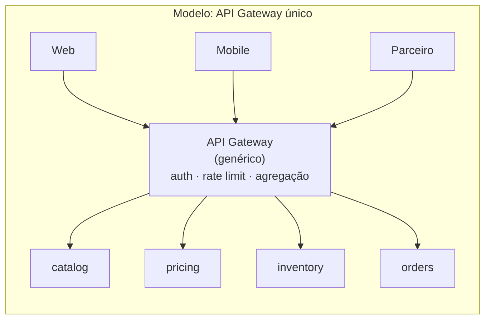
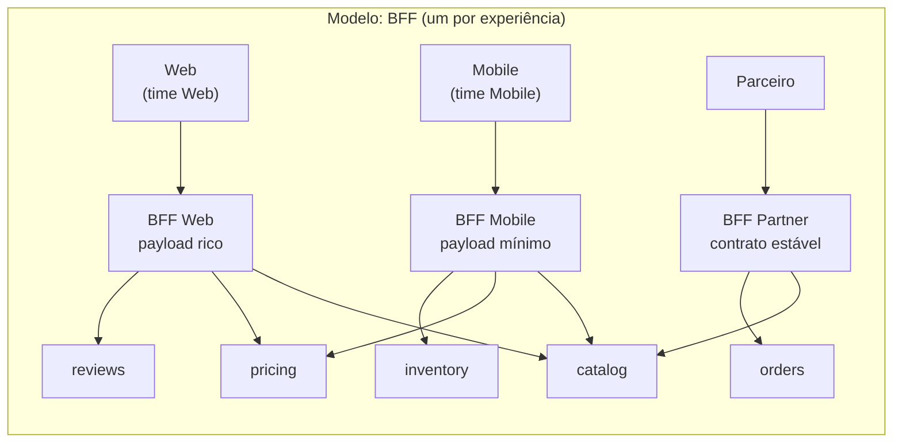
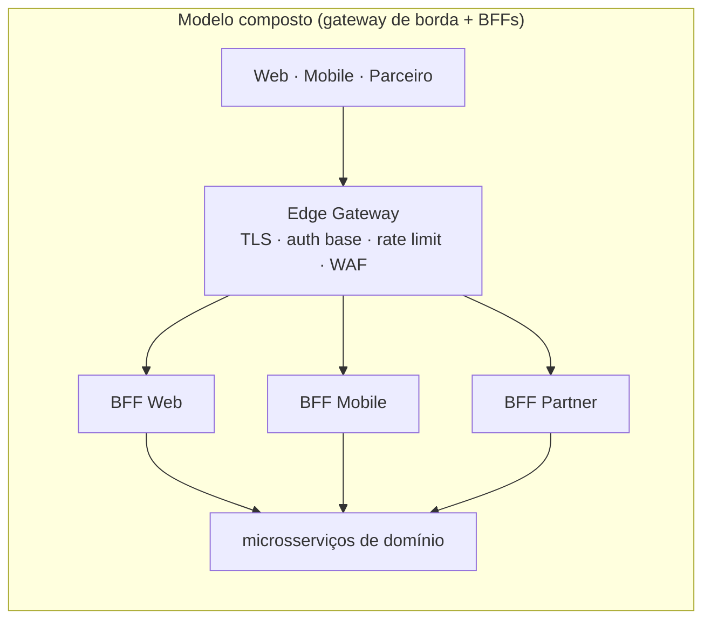

# API Gateway vs Backend for Frontend (BFF)

> **Bloco:** Sistemas distribuídos · **Nível:** Avançado · **Tempo de leitura:** ~27 min

## TL;DR

Quando você quebra um monólito em dezenas de microsserviços, os clientes (web, mobile, parceiros) não deveriam falar diretamente com cada serviço — isso explode o número de chamadas, vaza a topologia interna, espalha autenticação e força os clientes a orquestrar agregações. O **API Gateway** resolve isso sendo o **ponto único de entrada** para o tráfego externo: roteamento, composição de APIs, autenticação/autorização, rate limiting, TLS termination, caching e tradução de protocolo ficam centralizados na borda. O **Backend for Frontend (BFF)**, formalizado por Sam Newman, é uma especialização: em vez de **um** gateway genérico servindo a todos os clientes, você cria **um backend por experiência de usuário** (um BFF para o app iOS, um para o Android, um para a web, um para parceiros), cada um moldado às necessidades específicas daquele frontend e — crucialmente — mantido pelo time daquele frontend. API Gateway e BFF não são mutuamente exclusivos: o padrão moderno comum é um gateway genérico fazendo concerns transversais na borda, com BFFs por trás (ou o BFF como uma variante do gateway). A escolha entre gateway único e múltiplos BFFs é uma decisão sobre acoplamento, autonomia de times e divergência entre clientes.

## O problema que resolve

Numa arquitetura de microsserviços, expor os serviços diretamente aos clientes externos cria uma cascata de problemas:

- **Chattiness / N+1 de rede.** Renderizar uma tela de detalhe de produto num e-commerce pode exigir dados de `catalog`, `pricing`, `inventory`, `reviews`, `recommendations` e `shipping`. Se o app mobile chama cada um diretamente, são 6 round-trips sobre uma rede móvel de alta latência e bateria limitada. A latência percebida desmorona.
- **Acoplamento à topologia interna.** O cliente passa a conhecer e depender da decomposição interna em serviços. Qualquer refatoração de fronteiras de serviço (split/merge) quebra os clientes. Você perde a liberdade de evoluir a arquitetura interna.
- **Concerns transversais espalhados.** Autenticação, autorização, rate limiting, TLS, logging, observabilidade teriam que ser implementados (e mantidos consistentes) em cada serviço ou em cada cliente. Multiplicação de esforço e superfície de erro.
- **Incompatibilidade de granularidade e protocolo.** Os serviços internos podem falar gRPC, exigir payloads grandes ou expor uma granularidade fina inadequada para clientes externos. Um app mobile quer um JSON enxuto e poucas chamadas; um serviço interno expõe entidades normalizadas e verbosas.
- **Necessidades divergentes entre clientes.** O app mobile quer pouca informação, imagens em baixa resolução e payloads mínimos (rede e bateria). A web pode querer payloads ricos. Um parceiro B2B quer um contrato estável e versionado. Servir todos com a *mesma* API força compromissos ruins: ou a API fica inchada para o mobile, ou pobre para a web.

O **API Gateway** ataca os primeiros quatro problemas oferecendo um ponto único de entrada que faz roteamento, composição, segurança e tradução. O problema da **divergência entre clientes** (o quinto) é onde um gateway *único e genérico* começa a sofrer: ele acumula lógica condicional ("se for mobile, faça X; se for web, faça Y"), vira um componente monolítico de propriedade ambígua e gargalo organizacional — vários times de frontend competindo para mudar o mesmo gateway. O **BFF** nasce exatamente daí: a observação, na Netflix e depois articulada por **Sam Newman** (2015), de que tentar ter uma API genérica única que sirva bem a múltiplos tipos de cliente leva a uma API que não serve bem a nenhum. A solução é dar a cada experiência seu próprio backend.

### Tráfego north-south vs east-west: onde o gateway se encaixa

Para situar o gateway/BFF no mapa da arquitetura, é útil a distinção de direção de tráfego:

- **North-south:** tráfego que **cruza a fronteira** do sistema — clientes externos (apps, web, parceiros) entrando, e respostas saindo. É o domínio do API Gateway e do BFF.
- **East-west:** tráfego **interno**, serviço-a-serviço, dentro do perímetro. É o domínio do service mesh.

Gateway/BFF e service mesh são, portanto, **complementares e ortogonais**: um cuida da borda (north-south), o outro do interior (east-west). Muitos meshes oferecem um "ingress gateway" que pode atuar como a camada north-south, e nessa configuração o gateway de borda e o mesh se integram — mas conceitualmente os papéis permanecem distintos. Confundi-los (usar o mesh para resolver agregação de borda, ou o gateway para mTLS interno) leva a designs tortos.

## O que é (definição aprofundada)

**API Gateway** é um serviço que funciona como o **ponto único de entrada** (single entry point) para requisições externas a um sistema de microsserviços. Suas responsabilidades típicas:

- **Request routing:** mapear uma rota externa (`/api/orders/{id}`) para o serviço interno correto.
- **API composition / aggregation:** receber uma requisição do cliente, fazer múltiplas chamadas a serviços downstream e compor a resposta agregada — reduzindo chattiness e round-trips.
- **Protocol translation:** traduzir entre o protocolo externo (HTTP/JSON, GraphQL) e os internos (gRPC, mensageria).
- **Cross-cutting concerns:** autenticação e autorização (validar JWT/OAuth tokens), rate limiting e throttling, TLS termination, caching de respostas, observabilidade (logging, tracing, métricas), e às vezes resposta a falhas (circuit breaking na borda).

O API Gateway pode ser implementado com produtos dedicados — **Kong**, **Amazon API Gateway**, **NGINX** (e NGINX Plus), **Envoy** (frequentemente como base de gateways), **Spring Cloud Gateway**, **Apigee** — ou construído sob medida.

**Backend for Frontend (BFF)** é, nas palavras de Sam Newman, ter **"um backend por experiência de usuário"** (one backend per user experience) em vez de uma API genérica de propósito geral. Conceitos-chave:

- **Acoplamento intencional a uma experiência.** O BFF é deliberadamente **tightly coupled** a um frontend específico. O BFF do app iOS é moldado exatamente para o que aquela tela precisa: agrega só o necessário, no formato exato, com a granularidade ideal.
- **Propriedade pelo time do frontend.** Crucial: o BFF é tipicamente mantido pelo **mesmo time** que mantém aquele frontend. Isso elimina a coordenação entre times de frontend e um time de "API central", removendo gargalo organizacional e dando autonomia. A "API" passa a ser definida e evoluída por quem a consome.
- **Um por classe de experiência, não um por cliente individual.** Tipicamente: um BFF mobile (ou um para iOS e um para Android, se as necessidades divergem bastante), um BFF web, talvez um BFF para parceiros/terceiros. Não se cria um BFF por usuário — a granularidade é a "experiência" / tipo de cliente.

A relação formal, registrada no próprio catálogo de Chris Richardson, é que **BFF é uma variante do padrão API Gateway**: ambos são gateways de borda; o BFF apenas adota a estratégia de *múltiplos gateways especializados por cliente* em vez de *um gateway genérico*. Não há contradição — há um espectro de granularidade e propriedade.

Um eixo importante de comparação é **"shared gateway" vs "BFF":**

| Aspecto | API Gateway único (genérico) | BFF (um por experiência) |
|---|---|---|
| Número de gateways | 1 (compartilhado) | N (um por tipo de cliente) |
| Propriedade | Time de plataforma/central | Time de cada frontend |
| Otimização para o cliente | Compromisso (serve a todos) | Sob medida por cliente |
| Risco de gargalo organizacional | Alto (todos competem pelo mesmo) | Baixo (autonomia por time) |
| Duplicação de lógica | Baixa (centralizada) | Possível (entre BFFs) |
| Concerns transversais | Naturalmente centralizados | Risco de divergência/duplicação |

### A dimensão organizacional: BFF como Lei de Conway aplicada

O ponto mais subestimado do BFF não é técnico, é **organizacional**. A Lei de Conway diz que sistemas espelham a estrutura de comunicação das organizações que os constroem. Um **gateway único compartilhado** força *todos* os times de frontend a coordenarem mudanças no mesmo artefato: o time mobile quer um endpoint novo, mas precisa entrar na fila do time que "dona" o gateway, negociar prioridade, esperar deploy. Isso recria o gargalo que microsserviços queriam eliminar — só que na borda.

O BFF inverte isso deliberadamente: **o time que constrói o frontend constrói e dona o seu BFF**. A "API" daquela experiência passa a ser definida e evoluída por quem a consome, no ritmo de quem a consome, sem coordenação inter-time. É autonomia de produto materializada na arquitetura. Sam Newman é explícito: o BFF é tipicamente mantido pelo mesmo time do frontend, e isso é uma feature, não um detalhe. A consequência é que a escolha entre gateway único e BFFs é tanto uma decisão de **topologia de times** quanto de tecnologia — se você tem um único time servindo todos os canais, um gateway pode bastar; se tem times autônomos por canal, BFFs alinham a arquitetura à organização.

### Glossário rápido

- **API Gateway:** ponto único de entrada para tráfego externo; faz roteamento, composição, segurança, rate limiting.
- **BFF (Backend for Frontend):** um backend por experiência de usuário; variante do gateway, moldado e dono pelo time do frontend.
- **API Composition / Aggregation:** uma requisição do cliente vira N chamadas downstream agregadas numa resposta.
- **North-south:** tráfego cliente↔sistema (domínio do gateway/BFF).
- **East-west:** tráfego serviço↔serviço interno (domínio do service mesh).
- **Edge gateway:** gateway fino na borda para concerns universais (TLS, auth base, rate limit), na frente dos BFFs.
- **Modelo composto:** edge gateway + BFFs por experiência + gateway gerenciado para parceiros.
- **Chattiness:** excesso de round-trips entre cliente e serviços, que a agregação na borda reduz.
- **Token translation / phantom token:** trocar token opaco do cliente por JWT rico interno.

## Como funciona

### Origem histórica: da Netflix ao catálogo de padrões

O BFF não foi inventado num quadro branco — emergiu da prática. A Netflix, ao servir centenas de tipos de dispositivo (TVs, consoles, celulares, navegadores), percebeu que uma API genérica única não atendia bem a nenhum: cada dispositivo tinha capacidades, telas e restrições de rede diferentes. A solução foi dar a cada experiência (ou família de dispositivos) uma camada de adaptação dedicada. **Sam Newman** observou esse padrão em múltiplas organizações e o nomeou e formalizou em 2015, no artigo "Backends For Frontends". **Chris Richardson** o incorporou ao catálogo de microservices.io como uma variante do API Gateway. Entender essa origem ajuda a internalizar o ponto central: o BFF resolve uma tensão *concreta* (servir bem clientes divergentes), não uma elegância teórica — e por isso só vale a pena quando essa divergência é real.

### Fluxo de um API Gateway genérico

1. O cliente envia a requisição para o gateway (endereço único, ex.: `api.loja.com.br`).
2. O gateway termina TLS, valida o token de autenticação (JWT/OAuth), aplica rate limiting por cliente/API key.
3. Com base na rota, o gateway decide: **proxy simples** (encaminha 1:1 a um serviço) ou **composição** (faz fan-out a vários serviços, aguarda, agrega).
4. O gateway traduz protocolo se necessário (HTTP→gRPC), aplica caching, coleta métricas e tracing.
5. Retorna a resposta agregada/transformada ao cliente.

### Fluxo com BFFs

1. Cada classe de cliente fala com **seu** BFF: o app mobile fala com `bff-mobile`, a web com `bff-web`.
2. Cada BFF agrega as chamadas downstream **da forma ótima para aquele cliente**. O `bff-mobile` agrega `catalog`+`pricing`+`inventory` num payload mínimo com URLs de imagem em baixa resolução; o `bff-web` agrega os mesmos serviços mais `reviews`+`recommendations` num payload rico.
3. Concerns verdadeiramente transversais (autenticação base, TLS, rate limiting de borda) **podem** ser feitos por um gateway genérico *na frente* dos BFFs (padrão composto) ou replicados/extraídos para uma biblioteca compartilhada.

### O padrão composto (gateway + BFFs)

Na prática madura, combina-se os dois: um **edge gateway** fino faz os concerns de borda mais universais (TLS, autenticação base, rate limiting global, WAF), e por trás dele ficam os **BFFs** especializados que fazem a agregação e moldagem específica por cliente. Isso evita duplicar segurança em cada BFF e ainda dá autonomia de produto aos times.

A divisão de responsabilidades no modelo composto costuma ficar assim: o **edge gateway** cuida do que é universal e não depende do cliente — terminação TLS, validação base do token (assinatura/expiração), rate limiting global e por API key, WAF, request ID e início do trace, roteamento para o BFF correto. Os **BFFs** cuidam do que é específico da experiência — agregação/composição moldada para a tela, transformação de payload, fallbacks semânticos, autorização fina que depende de contexto de domínio. Essa separação mantém a segurança de borda centralizada (sem duplicação) e a lógica de experiência distribuída (com autonomia), capturando o melhor dos dois modelos sem os piores defeitos de cada um.

### Cuidado com a lógica de domínio

Tanto gateway quanto BFF devem conter **lógica de orquestração e moldagem**, não **lógica de negócio de domínio**. Quando regras de negócio começam a migrar para o BFF, ele vira um novo monólito de borda escondido. A linha é: agregação, transformação e adaptação ao cliente são legítimas; decisões de negócio (cálculo de preço, regras de fraude, máquina de estados de pedido) pertencem aos serviços de domínio.

### Responsabilidades transversais: o que centralizar e o que não

Nem todo concern transversal deve viver no gateway. Vale distinguir:

- **Naturalmente centralizáveis (borda):** TLS termination, autenticação base (validar assinatura/expiração do JWT), rate limiting global, WAF, roteamento, observabilidade de borda (request ID, tracing inicial). Centralizá-los evita duplicação e dá um ponto único de enforcement.
- **Sensíveis a centralizar:** autorização fina (quem pode fazer o quê) frequentemente depende de contexto de domínio que o gateway não tem — tende a vazar regras de negócio para a borda. Muitas arquiteturas fazem autenticação na borda mas **autorização no serviço** (ou via um serviço de política, ex.: OPA), mantendo o gateway "burro" sobre o domínio.
- **A não fazer na borda:** lógica de domínio, validação de regras de negócio, persistência. Isso recria o monólito.

### Agregação síncrona e o problema da disponibilidade composta

Quando o BFF agrega N serviços de forma síncrona e *exige todos*, sua disponibilidade vira o **produto** das disponibilidades. Se cada um dos 5 serviços tem 99,9% de disponibilidade, a agregação que depende de todos tem 0,999^5 ≈ 99,5% — uma degradação material só pela composição. Por isso a distinção entre dependências **críticas** (sem elas a tela não funciona) e **não-críticas** (degradam graciosamente) é central no design de BFF. Use `Promise.allSettled` (ou equivalente) e fallbacks por dependência, não `all`; aplique timeout e circuit breaker por chamada downstream. Um BFF que faz fan-out síncrono ingênuo é tão frágil quanto a soma de todas as suas dependências.

### GraphQL como alternativa/complemento

GraphQL ataca a mesma dor do BFF (chattiness, over/under-fetching, moldagem por cliente) por um caminho diferente: em vez de N backends moldados, expõe **um schema** onde o cliente declara exatamente os campos que quer numa única query, e um *resolver layer* faz o fan-out aos serviços. É, em certo sentido, um "BFF declarativo e auto-servido": o cliente molda a resposta sem precisar de um backend dedicado por experiência. Trade-offs: ganha-se flexibilidade e elimina-se a proliferação de endpoints, mas introduz-se complexidade de schema, dificuldade de caching (queries arbitrárias), risco de queries caras (N+1 nos resolvers, necessidade de *dataloaders*) e desafios de autorização por campo. Muitas casas usam GraphQL *como* a tecnologia do BFF (um gateway GraphQL por experiência), combinando os padrões.

## Diagrama de fluxo







## Exemplo prático / caso real

Considere uma **fintech brasileira** com app de pagamentos, web banking e uma API pública para fintechs parceiras (open finance).

**Sintoma inicial (sem gateway/BFF).** O app mobile, na tela inicial, precisava montar o "resumo" do usuário: saldo (`accounts`), últimas transações (`transactions`), cartões (`cards`), faturas (`invoices`) e ofertas (`offers`). Fazia 5 chamadas diretas. Em rede 4G ruim no interior, a tela levava 4-6s para montar e a bateria sofria. Pior: cada time de serviço expunha contratos diferentes, e mudanças quebravam o app sem aviso.

**Decisão 1 — BFF Mobile.** O time do app criou um **BFF Mobile** (Node.js/TypeScript, próximo da stack do frontend). A tela passou a fazer **uma** chamada (`GET /home-summary`); o BFF faz o fan-out interno (em paralelo, com timeouts e fallbacks por dependência), agrega e devolve um JSON enxuto, já com os campos no formato que a UI consome. Latência percebida caiu para ~800ms. O time do app passou a **ser dono** desse BFF — mudou de contrato sem depender de coordenar com 5 times de backend.

**Decisão 2 — BFF Web separado.** A web banking precisava de muito mais detalhe por transação e de gráficos de gasto. Em vez de inchar o BFF Mobile com `?detail=full`, criaram um **BFF Web** distinto. Cada um evolui no seu ritmo, otimizado para seu canal.

**Decisão 3 — API pública via gateway gerenciado.** Para os parceiros de open finance, a empresa expôs uma API estável e versionada atrás do **Amazon API Gateway** (ou **Kong**), com API keys, rate limiting agressivo por parceiro, contratos OpenAPI versionados e quotas. Aqui faz sentido um gateway genérico gerenciado: o "cliente" é externo, contratual, e os concerns (quota, billing por uso, auth via OAuth client credentials) são clássicos de gateway.

**Decisão 4 — edge gateway comum.** Para não duplicar mTLS de borda, WAF e autenticação base nos três BFFs, colocaram um **edge proxy** (Envoy/Kong) na frente, fazendo TLS termination, validação de JWT base e rate limiting global. Os BFFs ficam por trás, focados em agregação e moldagem.

**O gargalo organizacional que motivou a divisão.** Antes dos BFFs separados, a fintech tinha um único "API backend" servindo mobile e web. Toda vez que o time mobile precisava de um campo novo na resposta da home, abria um ticket para o time que dona o backend, entrava numa fila de prioridades disputada com o time web, e esperava o próximo ciclo de release — semanas para uma mudança trivial de payload. A divisão em BFFs por experiência, cada um dono pelo respectivo time de frontend, eliminou essa fila: o time mobile mudou seu BFF no mesmo PR da mudança do app, no mesmo dia. Foi uma decisão de **autonomia organizacional** materializada na arquitetura (Lei de Conway aplicada de propósito), tão importante quanto o ganho de latência.

Pseudocódigo leve do BFF Mobile (fan-out paralelo com fallback):

```
// BFF Mobile — GET /home-summary
async function homeSummary(userId, token) {
  const [saldo, txs, cards, offers] = await Promise.allSettled([
    accounts.balance(userId),                 // crítico
    transactions.latest(userId, { limit: 5 }),// crítico
    cards.list(userId),                        // crítico
    offers.forUser(userId)                     // não-crítico: degrada
  ]);
  return {
    balance: unwrap(saldo),
    recent:  unwrap(txs).map(toMobileTx),      // moldagem p/ a UI mobile
    cards:   unwrap(cards).map(toCardSummary),
    offers:  offers.status === 'fulfilled' ? offers.value : []  // fallback: lista vazia
  };
}
```

Ferramentas reais: **Kong**, **Amazon API Gateway**, **NGINX/NGINX Plus**, **Envoy**, **Spring Cloud Gateway**, **Apigee** para gateways; BFFs costumam ser serviços comuns na stack do frontend (Node/TypeScript é frequente pela afinidade com o time web/mobile). GraphQL é uma alternativa/complemento frequente ao BFF para resolver a chattiness e a moldagem por cliente.

### Evolução organizacional do exemplo

Vale notar a *sequência* da adoção — ela raramente é big-bang. A fintech começou com clientes chamando serviços diretamente (dor de chattiness e acoplamento), introduziu o **BFF Mobile** primeiro porque a dor de UX no mobile era a mais aguda (rede móvel), depois o **BFF Web** quando a divergência ficou clara, e só então formalizou o **edge gateway** comum para parar de duplicar segurança. A API de parceiros nasceu já num gateway gerenciado por ser um produto contratual com requisitos distintos (billing por uso, versionamento, quotas).

Essa ordem reflete um princípio: **introduza a fronteira de borda quando a dor concreta aparece**, não antecipadamente. Um BFF prematuro (quando há um só cliente e nenhuma divergência) é só um hop e um serviço a mais para operar. A decisão "gateway único vs BFFs" muitas vezes se resolve sozinha pela evolução: começa-se com um gateway/BFF único e, quando ele acumula lógica condicional por cliente e vira gargalo organizacional, divide-se em BFFs por experiência.

### Padrões de borda complementares

Além de roteamento e agregação, gateways/BFFs frequentemente hospedam:

- **Token translation / phantom tokens:** o gateway recebe um token opaco do cliente (sem dados sensíveis) e o troca por um JWT rico para uso interno, mantendo dados sensíveis fora do alcance do cliente. Padrão comum em arquiteturas OAuth maduras.
- **Response caching:** cachear respostas de leitura na borda (com invalidação cuidadosa) reduz carga nos serviços de domínio — natural no gateway, mais delicado no BFF (respostas moldadas por cliente têm chave de cache mais complexa).
- **Request collapsing / deduplication:** colapsar requisições idênticas concorrentes numa só chamada downstream (evita thundering herd no cache miss).
- **Schema/contract enforcement:** validar payloads contra contratos (OpenAPI/JSON Schema) na borda, rejeitando cedo o que é malformado.

### Composição de API: o coração da redução de chattiness

A capacidade que mais justifica um gateway/BFF do ponto de vista de performance é a **API composition** (agregação). O padrão: o cliente faz **uma** requisição lógica ("monte minha home"); o gateway/BFF a expande em **N** chamadas downstream, idealmente **em paralelo**, agrega os resultados e devolve uma resposta única e moldada. Isso elimina N-1 round-trips de rede do cliente — crítico em redes móveis de alta latência, onde cada round-trip custa centenas de milissegundos e bateria.

Pontos de design da composição:

- **Paralelismo, não sequência.** Chamadas independentes devem ser feitas em paralelo (`Promise.allSettled`/`CompletableFuture`/goroutines). Fazer 5 chamadas em série soma 5 latências; em paralelo, paga-se a latência da mais lenta. Sequência só quando há dependência de dados (a saída de A é entrada de B).
- **Crítico vs não-crítico.** Marque cada dependência. As críticas, sem as quais a resposta não faz sentido, têm timeout maior e podem falhar a requisição. As não-críticas (recomendações, banners) têm timeout curto e degradam para vazio/default.
- **Resiliência por chamada.** Cada chamada downstream precisa de timeout, e idealmente circuit breaker e bulkhead próprios (ver documento de resiliência), para que um serviço lento não contamine a agregação inteira.

A composição vive naturalmente na borda (gateway/BFF) porque é ali que se conhece a *intenção do cliente* (qual tela está sendo montada) e pode-se otimizar para ela. Em arquiteturas CQRS, a composição na borda é frequentemente como as leituras juntam dados espalhados por vários serviços sem joins distribuídos.

## Quando usar / Quando evitar

**Use um API Gateway (genérico) quando:**

- Você tem **clientes externos heterogêneos** e precisa de um ponto único para concerns transversais (auth, rate limit, TLS, observabilidade).
- A divergência entre os clientes é **pequena**: uma API genérica bem desenhada atende a todos sem grandes compromissos.
- Você expõe uma **API pública/parceiros** que precisa de contrato estável, versionamento, quotas e billing — território natural de gateways gerenciados.

**Evite (ou refine) o gateway único quando:** ele começa a acumular lógica condicional por tipo de cliente, vira gargalo organizacional (vários times disputando mudanças) ou cresce com regras de domínio. São sinais para migrar a BFF ou modelo composto.

**Use BFF quando:**

- As **necessidades dos clientes divergem significativamente** (mobile com payload mínimo vs web com payload rico vs parceiro com contrato estável).
- Você quer dar **autonomia aos times de frontend** para evoluírem seu backend sem coordenar com um time central — fator organizacional, não só técnico (Lei de Conway aplicada deliberadamente).
- A **chattiness** e a moldagem específica por canal são dores reais de performance/UX.

**Evite BFF quando:**

- Você tem **poucos clientes muito parecidos**: a divergência não justifica o custo de manter N backends.
- O time é pequeno e não consegue arcar com a **duplicação operacional** (cada BFF é mais um serviço para deployar, monitorar, escalar e patchar).
- Há risco real de **lógica de domínio vazar** para os BFFs sem disciplina arquitetural.

### Espectro de granularidade: do gateway único aos micro-BFFs

Não é binário. Há um espectro de granularidade da borda:

1. **Gateway único genérico:** um artefato para todos os clientes. Máxima centralização, mínima duplicação, máximo risco de gargalo.
2. **Gateway com perfis/variantes:** um gateway que aplica transformações diferentes por tipo de cliente (via headers/rotas). Compromisso intermediário, mas tende a acumular lógica condicional.
3. **BFF por classe de experiência:** um BFF para mobile, um para web, um para parceiros. O ponto recomendado por Newman — granularidade na "experiência".
4. **BFF por plataforma:** iOS e Android separados quando suas necessidades divergem materialmente (telas, capacidades nativas, ciclos de release).
5. **Micro-BFFs / BFF por equipe de feature:** granularidade fina demais, geralmente um anti-padrão (explode operação e duplicação).

A granularidade certa equilibra **divergência entre clientes** (mais divergência → mais BFFs) contra **custo operacional** (mais BFFs → mais serviços para deployar, monitorar, escalar, patchar) e **duplicação** (mais BFFs → mais risco de reimplementar concerns). O modelo composto (edge gateway + BFFs) busca o ponto onde concerns transversais ficam centralizados (no edge) e a moldagem fica distribuída (nos BFFs).

### Versionamento e contratos: interno vs externo

Um eixo decisivo frequentemente ignorado: **quem consome a API determina sua disciplina de mudança**.

- **BFFs internos** (consumidos pelo próprio app da casa): podem evoluir com liberdade, pois o time do BFF e o time do frontend são o mesmo (ou coordenados de perto). Deploy do app e do BFF andam juntos. Contratos podem mudar sem versionamento formal — é tudo "in-house".
- **API de parceiros/pública:** consumida por terceiros que você **não controla**. Exige versionamento explícito (`/v1`, `/v2`), políticas de deprecação com prazo, contratos formais (OpenAPI), quotas e billing. Quebrar a API quebra integrações externas e relacionamentos comerciais. Aqui um **gateway gerenciado** (Amazon API Gateway, Apigee, Kong) brilha, com lifecycle de API, developer portal e analytics de uso.

Confundir esses dois mundos — tratar a API de parceiros com a informalidade de um BFF interno — é uma fonte clássica de incidentes externos.

## Anti-padrões e armadilhas comuns

- **Gateway monolítico ("god gateway").** O gateway único acumula roteamento, agregação, lógica condicional por cliente e até regras de negócio, virando um monólito de borda crítico que todos os times precisam mudar. Vira gargalo de deploy e de organização — o oposto do que microsserviços buscavam.
- **Lógica de domínio no gateway/BFF.** Cálculo de preço, regras de fraude, máquina de estados — isso pertence aos serviços de domínio. Quando migra para a borda, você recria o monólito e duplica/dispersa regras críticas.
- **Um BFF por cliente individual em vez de por experiência.** A granularidade certa é "tipo de experiência" (mobile, web, parceiro), não um BFF por app version ou por usuário. Granularidade fina demais explode o número de backends.
- **Duplicação descontrolada entre BFFs.** Sem extrair concerns transversais (auth, observabilidade) para um edge gateway ou biblioteca compartilhada, cada BFF reimplementa segurança — multiplicando bugs e inconsistências. O modelo composto existe para mitigar isso.
- **Gateway como SPOF não-resiliente.** Sendo ponto único de entrada, o gateway/BFF precisa de redundância, timeouts, circuit breaking e graceful degradation nas agregações. Um fan-out sem timeout que espera um serviço lento derruba a tela inteira — agregue com `Promise.allSettled`/fallbacks, não `all`.
- **Agregação síncrona acoplando disponibilidade.** Se o BFF agrega 6 serviços de forma síncrona e *exige* todos, sua disponibilidade vira o produto das disponibilidades (composição multiplica indisponibilidade). Distinga dependências críticas de não-críticas e degrade graciosamente.
- **Versionamento esquecido na API de parceiros.** APIs públicas/parceiros precisam de versionamento e deprecação explícitos; tratá-las como APIs internas (mudança livre) quebra integrações externas.
- **Pass-through 1:1 sem desacoplamento.** Um gateway que só repassa cada rota a um serviço, expondo os contratos internos, não esconde a topologia — os clientes continuam acoplados à decomposição. O valor está em desacoplar contrato externo do interno.
- **Fan-out síncrono com `all` em vez de `allSettled`.** Exigir todas as N dependências numa agregação faz a disponibilidade ser o produto de todas. Distinga crítico de não-crítico e degrade graciosamente.
- **Cache de borda sem invalidação correta.** Cachear respostas no gateway sem estratégia de invalidação serve dado stale; com chave de cache mal pensada (especialmente em BFFs com respostas moldadas por usuário), polui o cache ou vaza dados entre usuários.
- **BFF que cresce para um monólito de borda.** Sem disciplina, o BFF acumula lógica, vira grande e crítico, e perde a leveza que justificava sua existência. Mantenha-o focado em agregação e moldagem.
- **Ignorar a borda no plano de capacidade e SLO.** O gateway/BFF está no caminho de todo o tráfego externo; precisa de redundância, autoscaling e SLOs próprios. Subdimensioná-lo o torna o gargalo e SPOF da plataforma.

### Checklist de decisão na prática

Para arquitetar a camada de borda, percorra estas perguntas em ordem:

1. **Quantos tipos de cliente você tem e quão divergentes são?** Um só cliente, ou vários muito parecidos → gateway único basta. Vários divergentes (mobile minimalista vs web rica vs parceiro contratual) → BFFs.
2. **Há clientes externos/terceiros?** Sim → precisa de gateway gerenciado com versionamento, quotas, billing, developer portal. Trate-os com disciplina de contrato, separados dos BFFs internos.
3. **Os times de frontend são autônomos?** Sim → BFFs alinham a arquitetura à organização (Conway), dando autonomia. Não (um time central serve tudo) → gateway único reduz duplicação.
4. **A chattiness é uma dor real de performance?** Sim → composição/agregação na borda (gateway/BFF ou GraphQL) é prioritária.
5. **Você consegue operar N backends?** Não (time pequeno) → comece com gateway/BFF único; divida quando a dor justificar. Sim → BFFs por experiência.
6. **Os concerns transversais estão duplicando?** Sim → extraia para um edge gateway comum (modelo composto), mantendo a moldagem nos BFFs.

A resposta quase nunca é "gateway OU BFF" pura: o estado maduro comum é **edge gateway (concerns de borda) + BFFs (moldagem por experiência) + gateway gerenciado separado para a API pública**.

### Erros de fronteira que custam caro

- **Vazar a topologia interna mesmo com gateway.** Se o gateway só faz pass-through 1:1 (uma rota externa por serviço interno, expondo os mesmos contratos), você tem um gateway que não esconde nada — os clientes continuam acoplados à decomposição interna. O valor do gateway/BFF está em **desacoplar** o contrato externo do interno.
- **Acoplar o ciclo de release.** Se mudar o app mobile exige sempre redeployar o BFF e vice-versa de forma rígida, sem versionamento nem compatibilidade, cada release vira uma coreografia frágil. BFFs internos toleram acoplamento de deploy (mesmo time), mas vale manter compatibilidade durante transições.
- **Esquecer a borda na conta de capacidade.** O gateway/BFF está no caminho de *todo* o tráfego externo. Subdimensioná-lo ou não torná-lo redundante faz dele o gargalo e o SPOF que derruba tudo — pior que qualquer serviço de domínio individual.

## Relação com outros conceitos

- **Microsserviços:** gateway e BFF existem *por causa* da decomposição em microsserviços — são a fronteira de borda que esconde a topologia interna e reconcilia granularidade.
- **Service Discovery & Load Balancing:** o gateway/BFF é um consumidor de discovery: ele descobre e balanceia os serviços downstream que orquestra (tipicamente server-side discovery na borda, mesh por trás).
- **Padrões de resiliência:** agregação no gateway/BFF exige timeout, retry com backoff, circuit breaker e bulkhead por dependência downstream — senão um serviço lento contamina a borda inteira.
- **API Composition:** o gateway/BFF é onde o padrão de composição de API costuma viver, especialmente em arquiteturas com CQRS onde leituras precisam juntar dados de vários serviços.
- **Lei de Conway:** o BFF é a aplicação deliberada de Conway — o backend espelha a organização (time do frontend é dono do seu BFF), reduzindo coordenação inter-time.
- **Service Mesh:** mesh cuida da comunicação *serviço-a-serviço interna* (east-west); gateway/BFF cuida do tráfego *cliente-para-sistema* (north-south). São complementares; muitos meshes oferecem um "ingress gateway" que pode coexistir com BFFs.

## Modelo mental para o arquiteto

Três ideias para carregar:

1. **Gateway e BFF são pontos num espectro, não opostos.** BFF é uma *variante* do API Gateway (um gateway por experiência, em vez de um genérico). A pergunta real é a granularidade e a propriedade da borda — e a resposta madura quase sempre combina os dois (edge gateway + BFFs + gateway gerenciado para parceiros).
2. **A decisão é técnica e organizacional.** A escolha entre gateway único e BFFs reflete sua topologia de times (Lei de Conway). Times de frontend autônomos → BFFs; time central servindo tudo → gateway. Não decida só pela tecnologia.
3. **A borda esconde a topologia e molda para o cliente — mas não é o domínio.** Agregação, transformação e adaptação ao cliente são legítimas na borda; lógica de negócio não. Vazar domínio para o gateway/BFF recria o monólito que os microsserviços queriam dissolver.

O fio condutor: a borda existe para **desacoplar** os clientes da decomposição interna e **otimizar** a experiência de cada cliente, sem virar um novo ponto de centralização de domínio ou um gargalo organizacional.

## Pontos para fixar (revisão)

- BFF é uma **variante** do API Gateway (um por experiência vs um genérico), não um conceito oposto — Sam Newman é a fonte canônica.
- O diferencial do BFF é tanto técnico (moldagem por cliente, menos chattiness) quanto **organizacional** (time do frontend dona seu BFF — Lei de Conway).
- O estado maduro combina: **edge gateway** (concerns universais) + **BFFs** (moldagem) + **gateway gerenciado** (API de parceiros, versionada).
- Agregação síncrona acopla disponibilidade (produto das disponibilidades) — distinga **crítico de não-crítico**, paralelize e degrade graciosamente.
- Gateway/BFF contém **orquestração e moldagem**, nunca **lógica de domínio** — vazar domínio recria o monólito.
- A borda está no caminho de todo o tráfego externo: trate-a como tier-0 (redundância, SLOs, capacidade).
- GraphQL é uma alternativa/tecnologia para BFF, resolvendo over/under-fetching declarativamente — ao custo de caching e autorização mais complexos.

## Referências

- [Backends For Frontends — Sam Newman (padrão)](https://samnewman.io/patterns/architectural/bff/)
- [Backends For Frontends: A Microservice Pattern — Sam Newman (blog, 2015)](https://samnewman.io/blog/2015/11/23/backends-for-frontends-a-microservice-pattern/)
- [Pattern: API Gateway / Backends for Frontends — microservices.io](https://microservices.io/patterns/apigateway.html)
- [Pattern: API Composition — microservices.io](https://microservices.io/patterns/data/api-composition.html)
- [Backends for Frontends pattern — Azure Architecture Center](https://learn.microsoft.com/en-us/azure/architecture/patterns/backends-for-frontends)
- [Backends for Frontends Pattern — AWS Front-End Web & Mobile Blog](https://aws.amazon.com/blogs/mobile/backends-for-frontends-pattern/)
