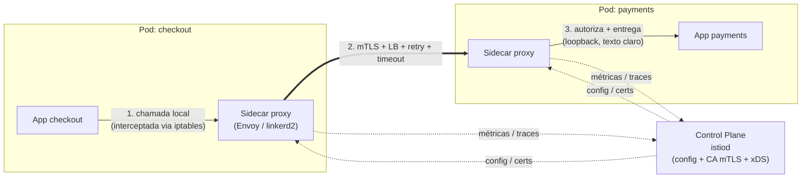
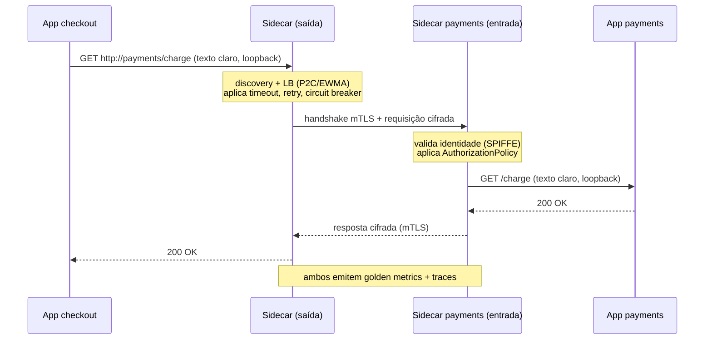

# Service Mesh (Istio, Linkerd) — Sidecar Pattern

> **Bloco:** Sistemas distribuídos · **Nível:** Avançado · **Tempo de leitura:** ~26 min

## TL;DR

À medida que o número de microsserviços cresce, cada serviço precisa lidar com as mesmas preocupações de comunicação: descoberta, balanceamento de carga, retry, timeout, circuit breaking, criptografia mútua (mTLS), métricas, tracing e políticas de autorização. Implementar tudo isso em bibliotecas dentro de cada serviço (modelo Hystrix/Ribbon/Finagle) não escala numa frota poliglota e acopla infraestrutura ao código de negócio. O **Service Mesh** extrai essa lógica para uma camada de infraestrutura dedicada: um **proxy sidecar** (Envoy no Istio, micro-proxy em Rust no Linkerd) é injetado ao lado de cada instância de serviço e **intercepta todo o tráfego de rede** de entrada e saída (via regras de iptables, transparente ao aplicativo). O conjunto desses proxies forma o **data plane**; um **control plane** (istiod no Istio) configura e coordena os proxies, distribuindo políticas de roteamento, certificados mTLS e configuração de resiliência. O resultado: resiliência, segurança (mTLS automático), observabilidade (golden metrics, tracing) e controle de tráfego (canary, traffic splitting) tornam-se capacidades de plataforma, uniformes e independentes de linguagem, sem mexer no código de aplicação. O custo: latência adicional por hop de proxy, consumo de recursos (CPU/memória dos sidecars) e complexidade operacional significativa.

## O problema que resolve

A comunicação serviço-a-serviço em microsserviços (tráfego **east-west**) é cheia de preocupações repetitivas e críticas. Inicialmente, a indústria resolveu isso com **bibliotecas embarcadas**: a Netflix construiu **Hystrix** (circuit breaking, bulkhead), **Ribbon** (client-side LB), **Eureka** (discovery); o Twitter tinha o **Finagle**. Você adicionava essas libs ao seu serviço e ganhava resiliência.

Esse modelo tem limitações estruturais que se agravam com escala e diversidade:

- **Acoplamento de linguagem (poliglotismo).** Hystrix é Java. Se sua frota tem serviços em Go, Python, Node, Rust e JVM, você precisa reimplementar ou portar a biblioteca (e toda a lógica sutil de circuit breaking, backoff, etc.) para cada linguagem — e mantê-las em paridade de comportamento e versão. Inviável na prática para frotas grandes e heterogêneas.
- **Acoplamento ao ciclo de vida da aplicação.** Para corrigir um bug na lógica de retry ou mudar uma política de timeout, você precisa **recompilar, retestar e redeployar todos os serviços**. Mudança de infraestrutura vira mudança de código de aplicação, com todo o risco e fricção associados.
- **Inconsistência.** Versões diferentes das bibliotecas em serviços diferentes significam comportamento de resiliência inconsistente pela frota. Difícil garantir que *todos* têm mTLS, *todos* exportam as mesmas métricas, *todos* têm a mesma política de retry.
- **Mistura de concerns.** O código de negócio fica entremeado com configuração de infraestrutura (anotações de circuit breaker, configuração de pool de conexões), poluindo o domínio.

O **Service Mesh** resolve isso movendo toda essa lógica para fora do processo de aplicação, para um **proxy sidecar** rodando ao lado de cada serviço. Como o proxy intercepta o tráfego de rede transparentemente, ele funciona com **qualquer linguagem** (a "interface" é o protocolo de rede, não uma API de biblioteca), é atualizado **independentemente** do código de aplicação (atualizar o mesh não exige recompilar serviços), e garante **uniformidade** (todos os sidecars rodam a mesma versão de política). A inteligência de comunicação vira uma capacidade da plataforma.

A origem prática: a Lyft criou o **Envoy** (2016) como proxy de borda e sidecar de alto desempenho; Google, IBM e Lyft lançaram o **Istio** (2017) usando Envoy como data plane; a Buoyant criou o **Linkerd** (cunhando o termo "service mesh"), reescrevendo-o em Rust no Linkerd2 para ser ultraleve.

## O que é (definição aprofundada)

**Service Mesh** é uma camada de infraestrutura dedicada que gerencia a comunicação serviço-a-serviço, fornecendo de forma transparente e uniforme: roteamento de tráfego, balanceamento de carga, descoberta, resiliência (retry, timeout, circuit breaking), segurança (mTLS, autorização), e observabilidade (métricas, tracing, logging). Estrutura-se em dois planos:

### Data plane

Conjunto dos **proxies sidecar** que ficam no caminho de todo o tráfego de rede entre serviços. Cada sidecar:

- É um container que roda **no mesmo Pod** (em Kubernetes) que o container de aplicação.
- **Intercepta o tráfego** de entrada (inbound) e saída (outbound) do serviço. Em Kubernetes, isso é feito programando regras de **iptables** (via um init container) que redirecionam todo o tráfego TCP do Pod para o proxy — totalmente transparente para a aplicação, que pensa estar falando direto com o destino.
- Aplica políticas: faz o balanceamento (P2C, latency-aware/EWMA), retries, timeouts, circuit breaking, criptografa/descriptografa mTLS, e emite telemetria.

No **Istio**, o data plane é o **Envoy** (proxy C++ de alto desempenho, configurável via API dinâmica **xDS**). No **Linkerd**, é o **linkerd2-proxy**, um micro-proxy escrito em **Rust**, propositadamente especializado para o caso de uso de mesh (não um proxy de propósito geral), priorizando footprint mínimo e simplicidade. No Linkerd, o proxy de saída (outbound) cuida de discovery, LB, circuit breaking, retries e timeouts; o de entrada (inbound) cuida de enforcement de autorização.

### Control plane

O cérebro que **configura e coordena** os proxies do data plane, sem estar no caminho de dados (não toca o tráfego em si). No Istio, é o **istiod**, que:

- **Descobre** serviços e instâncias (a partir do registry da plataforma, ex.: API do Kubernetes).
- **Traduz** regras de alto nível (VirtualService, DestinationRule) em configuração específica do Envoy e a **distribui** aos sidecars em runtime via xDS.
- Atua como **CA (Certificate Authority)**: emite e rotaciona automaticamente os certificados X.509 que os sidecars usam para o **mTLS** entre si, dando identidade criptográfica (SPIFFE) a cada workload.

### Capacidades entregues

- **Resiliência:** retries, timeouts, circuit breaking, *outlier detection* (ejetar instâncias com taxa de erro alta) — tudo configurável por política, sem código.
- **Segurança:** **mTLS automático** entre todos os serviços (criptografia em trânsito + autenticação mútua por identidade de workload), e **políticas de autorização** (que serviço pode chamar qual).
- **Observabilidade:** as *golden metrics* (taxa de requisições, taxa de erro, latência/distribuição) para *todo* o tráfego, automaticamente; propagação de contexto de tracing; topologia de serviços.
- **Controle de tráfego:** *traffic splitting* (canary, blue-green), roteamento por header, *fault injection* (injetar latência/erros para testes de caos), *mirroring*.

### Sidecar pattern (em geral) e a alternativa sidecarless

O **sidecar pattern** é mais amplo que mesh: é o padrão de empacotar funcionalidade auxiliar (logging, proxy, config sync) num container que compartilha o ciclo de vida e os recursos de rede/disco do container principal, sem acoplá-la ao código. O mesh é a aplicação mais conhecida.

O custo do sidecar — um proxy por Pod, multiplicando consumo de recursos e adicionando latência — motivou modelos **sidecarless / ambient**: o **Istio Ambient Mesh** separa as funções em um componente por-nó (ztunnel, para mTLS/L4) e um por-namespace (waypoint, para L7), reduzindo o overhead de ter um Envoy por Pod. É uma evolução importante a conhecer, mas o modelo sidecar permanece o mais difundido e didático.

### Glossário rápido

- **Service Mesh:** camada de infraestrutura que gerencia comunicação serviço-a-serviço (resiliência, segurança, observabilidade, tráfego).
- **Sidecar:** proxy co-localizado com cada serviço, que intercepta seu tráfego de rede.
- **Data plane:** o conjunto dos sidecars (Envoy/linkerd2-proxy); está no caminho de dados.
- **Control plane:** o cérebro (istiod) que configura os sidecars e emite certificados; fora do caminho de dados.
- **xDS:** API dinâmica pela qual o control plane configura os proxies Envoy em runtime.
- **mTLS:** TLS mútuo automático entre serviços (criptografia + autenticação por identidade).
- **SPIFFE:** padrão de identidade de workload usado nos certificados do mesh.
- **Golden metrics / RED:** Rate, Errors, Duration — métricas emitidas automaticamente pelo mesh.
- **Outlier detection:** ejetar instâncias com taxa de erro/latência anômala.
- **Ambient / sidecarless:** modelo que reduz o overhead do sidecar (ztunnel por-nó + waypoint).

## Como funciona

Passo a passo da interceptação (modelo sidecar, Kubernetes):

1. **Injeção.** Ao criar um Pod num namespace habilitado, um **admission controller** (no Istio, o sidecar injector; no Linkerd, o proxy injector) **muta a especificação do Pod**, adicionando o container do proxy (Envoy/linkerd2-proxy) e um **init container** que configura iptables.
2. **Captura via iptables.** O init container instala regras de iptables que redirecionam **todo** o tráfego de entrada e saída do Pod para o proxy sidecar. A aplicação faz uma chamada HTTP/gRPC normal para o destino; o kernel a redireciona ao proxy local.
3. **Saída (outbound).** O proxy do serviço chamador recebe a chamada interceptada, resolve o destino (discovery via control plane), escolhe a instância (LB latency-aware/P2C), aplica timeout/retry/circuit breaking, **inicia o handshake mTLS** com o proxy do destino e envia a requisição criptografada.
4. **Entrada (inbound).** O proxy do serviço chamado termina o mTLS (autenticando a identidade do chamador), **aplica a política de autorização** (este chamador pode acessar este endpoint?), e entrega a requisição em texto claro ao container de aplicação via loopback.
5. **Telemetria.** Ambos os proxies emitem métricas (latência, status, volume) e propagam o contexto de tracing — sem que a aplicação precise instrumentar nada para as métricas L7.
6. **Configuração dinâmica.** Quando você aplica uma política (ex.: "rote 5% do tráfego de `checkout` para a v2 do `payments`"), o control plane traduz isso e empurra a nova configuração aos proxies relevantes em runtime, **sem reiniciar** as aplicações.

A genialidade do modelo: a aplicação **não sabe que o mesh existe**. Ela faz `http://payments/charge` como se o serviço estivesse ali; o sidecar materializa mTLS, retry, LB e telemetria por baixo.

### mTLS e identidade de workload em detalhe

O mTLS automático é uma das motivações mais fortes para adotar mesh, e merece detalhamento. Em vez de cada serviço ter que gerenciar certificados manualmente:

1. O control plane atua como **CA** (Certificate Authority) interna. No Istio, o istiod emite certificados; pode encadear a uma CA corporativa raiz.
2. Cada workload recebe uma **identidade criptográfica** baseada em **SPIFFE** (Secure Production Identity Framework For Everyone) — um identificador no formato `spiffe://trust-domain/ns/namespace/sa/service-account`, derivado da identidade do Pod (service account no Kubernetes). Não é o IP (efêmero), é a *identidade lógica* do serviço.
3. Os certificados são **rotacionados automaticamente** (curta validade, ex.: 24h), reduzindo a janela de comprometimento sem operação manual.
4. No handshake, cada lado **autentica o outro** (mutual TLS): o proxy de entrada verifica a identidade SPIFFE do chamador, e o de saída verifica a do destino. Isso dá **criptografia em trânsito** + **autenticação de workload** + base para **autorização** ("só `checkout` pode chamar `payments`").

Modos de mTLS (Istio): **PERMISSIVE** (aceita tanto texto claro quanto mTLS — útil durante migração incremental) e **STRICT** (só aceita mTLS — postura zero-trust). A migração típica vai de PERMISSIVE para STRICT à medida que toda a frota entra no mesh.

Ponto crítico: mTLS resolve *transit security* e *identidade*, mas **não substitui** autorização de aplicação (regras de negócio sobre *o quê* o chamador pode fazer com *quais* dados), validação de input, nem gestão de segredos. É uma camada de zero-trust, não o todo.

### Observabilidade automática: as golden metrics

O mesh emite, para *todo* o tráfego L7 interceptado, as chamadas **golden metrics** (também "RED": Rate, Errors, Duration) sem que a aplicação instrumente nada:

- **Taxa de requisições** (RPS) por serviço, par origem-destino e rota.
- **Taxa de erro** (% de respostas 5xx/falhas).
- **Distribuição de latência** (histogramas p50/p95/p99).
- **Topologia de serviços** (quem chama quem), montável a partir dos pares observados.

Isso alimenta **Prometheus** (scraping das métricas dos proxies), **Grafana** (dashboards) e, com propagação de contexto de tracing, **Jaeger**/**Zipkin**/**OpenTelemetry** (traces distribuídos). Caveat importante: o mesh dá o *tracing de rede* automaticamente (spans por hop de proxy), mas a **propagação dos headers de trace** entre chamadas *dentro* da aplicação ainda exige cooperação do código — o sidecar não consegue correlacionar uma requisição de entrada com as de saída se a aplicação não repassar os headers (`traceparent`, `b3`). Logo, mesh reduz mas não elimina a instrumentação de tracing.

### Istio vs Linkerd: o trade-off de poder vs simplicidade

| Dimensão | Istio | Linkerd |
|---|---|---|
| Data plane | Envoy (C++, proxy de propósito geral) | linkerd2-proxy (Rust, especializado p/ mesh) |
| Footprint do sidecar | Maior (Envoy é full-featured) | Mínimo (micro-proxy enxuto) |
| Riqueza de traffic management | Muito alta (VirtualService, fault injection, mirroring, multi-cluster) | Moderada (foco no essencial) |
| Curva de aprendizado / operação | Alta (muitos CRDs, complexidade) | Baixa (opinativo, poucos knobs) |
| Suporte a workloads fora de K8s (VMs) | Sim | Limitado |
| Modo sidecarless | Ambient mesh (ztunnel + waypoint) | — (foco em sidecar leve) |
| Filosofia | Poder e flexibilidade | Simplicidade e baixo overhead |

A regra prática: se você precisa de **mTLS + observabilidade + resiliência básica** com mínimo atrito operacional, Linkerd é o sweet spot. Se precisa de **traffic management sofisticado** (canary automatizado, fault injection para caos, gateways multi-cluster, VMs no mesh), Istio justifica sua complexidade.

### Traffic management: o que o controle de tráfego habilita

Além de resiliência e segurança, o mesh transforma o roteamento de tráfego em algo *programável por configuração*, desacoplado do deploy de código. As capacidades centrais:

- **Traffic splitting (canary / blue-green):** rotear uma fração percentual do tráfego para uma nova versão (ex.: 5% → 25% → 100%), monitorando as golden metrics a cada passo, com rollback instantâneo. Crucialmente, isso é decidido no control plane — os *consumidores* não sabem nem mudam; eles continuam chamando `recommendations` e o mesh decide a versão.
- **Roteamento baseado em conteúdo:** rotear por header, cookie, ou atributo (ex.: usuários internos para a v2, externos para a v1; região X para o cluster Y). Habilita dark launches e testes A/B no nível de infraestrutura.
- **Fault injection:** **injetar deliberadamente** latência ou erros (ex.: 10% das chamadas a `payments` retornam 503, ou +2s de delay) para testar a resiliência do sistema sem quebrar nada de verdade — engenharia de caos controlada. Permite validar que circuit breakers e fallbacks realmente funcionam.
- **Traffic mirroring (shadowing):** espelhar uma cópia do tráfego de produção para uma nova versão *sem* afetar a resposta ao usuário (a resposta da versão espelhada é descartada). Permite testar a v2 com tráfego real antes de servi-lo.
- **Outlier detection:** ejetar automaticamente instâncias que apresentam taxa de erro/latência anômala (uma forma de circuit breaking no nível de instância, complementando o LB).

O ponto comum: tudo isso é **mudança de configuração no control plane**, propagada aos sidecars em runtime, **sem redeployar as aplicações**. Isso desacopla decisões de release/tráfego do ciclo de build/deploy de código — uma das maiores alavancas operacionais do mesh.

### O sidecar pattern além do mesh

O mesh é a aplicação mais famosa do **sidecar pattern**, mas o padrão é mais amplo: empacotar funcionalidade auxiliar num container que compartilha o ciclo de vida, a rede e (opcionalmente) volumes do container principal, sem misturá-la ao código de negócio. Outros usos clássicos:

- **Log shipper:** um sidecar (Fluent Bit/Fluentd) lê os logs do container principal de um volume compartilhado e os envia ao sistema central de logs — sem o app saber.
- **Config sync / secret fetcher:** um sidecar busca configuração ou segredos (de Vault, Consul) e os disponibiliza ao app via arquivo/volume.
- **Adapter / protocol translator:** um sidecar normaliza a saída do app (ex.: expõe métricas num formato que o monitoramento entende, traduzindo o formato proprietário do app).

A força do padrão é a **separação de concerns com co-localização**: a funcionalidade auxiliar evolui independentemente (atualiza o sidecar sem tocar o app), funciona com qualquer linguagem (a interface é rede/arquivo, não API de lib) e é reutilizável entre serviços. O custo é o mesmo do mesh em menor escala: mais um container por Pod, mais consumo de recursos.

## Diagrama de fluxo





## Exemplo prático / caso real

Considere um **marketplace brasileiro** com ~150 microsserviços poliglotas (JVM, Go, Node, Python) em Kubernetes multi-região, com requisitos regulatórios de criptografia em trânsito (LGPD/PCI para dados de pagamento).

**Dor antes do mesh.** Cada time implementava retry/timeout/circuit breaking de um jeito (ou não implementava). Não havia mTLS interno — tráfego entre serviços trafegava em texto claro dentro do cluster, um risco de compliance. Métricas de latência/erro eram inconsistentes (cada serviço instrumentava à sua maneira). Um deploy ruim do `pricing` derrubou `checkout` em cascata porque não havia circuit breaking padronizado.

**Adoção de Linkerd (mesh leve).** O time de plataforma escolheu **Linkerd** pela simplicidade operacional e footprint baixo (proxy em Rust). Ganhos imediatos, sem tocar no código dos 150 serviços:

- **mTLS automático** entre todos os serviços — resolve o requisito de criptografia em trânsito e dá identidade de workload, satisfazendo auditoria.
- **Golden metrics uniformes** (success rate, RPS, latências p50/p95/p99) para todo serviço, no mesmo formato — observabilidade consistente de graça.
- **Latency-aware load balancing (EWMA)**: durante a Black Friday, réplicas de `inventory` com GC pause recebem menos tráfego automaticamente.
- **Retries e timeouts** configurados por política, sem recompilar nada.

**Por que não Istio aqui?** Istio é mais poderoso (Envoy full L7, traffic management rico, fault injection, suporte a VMs fora do Kubernetes, ambient mode), mas mais complexo de operar. O time avaliou que precisava de mTLS + observabilidade + resiliência básica — sweet spot do Linkerd. Em um cenário com necessidade de **traffic splitting sofisticado, canary automatizado, gateways multi-cluster e fault injection para engenharia de caos**, a escolha penderia para **Istio**.

**Caso de controle de tráfego (Istio).** Em outro time, que usava Istio, o lançamento da v2 do serviço de `recommendations` foi feito como **canary**: uma `VirtualService` roteou 5% do tráfego para a v2, monitorou as golden metrics por 30 min, e o time foi subindo para 25%, 50%, 100% — tudo via configuração no control plane, sem deploy de código nos consumidores, com rollback instantâneo se a taxa de erro subisse.

Pseudo-configuração (Istio, traffic split):

```yaml
# VirtualService — canary 5% para v2
http:
  - route:
      - destination: { host: recommendations, subset: v1 }
        weight: 95
      - destination: { host: recommendations, subset: v2 }
        weight: 5
    timeout: 2s
    retries: { attempts: 2, perTryTimeout: 800ms, retryOn: "5xx,connect-failure" }
```

Ferramentas reais: **Istio** (+ **Envoy** como data plane), **Linkerd** (linkerd2-proxy em Rust), **Consul Connect** (mesh da HashiCorp), **Cilium Service Mesh** (baseado em eBPF). Para tracing/métricas: integração com **Prometheus**, **Grafana**, **Jaeger**, **OpenTelemetry**.

### O custo concreto que ninguém conta no início

Adotar mesh em 150 serviços significa, na prática:

- **+150 sidecars** (um por Pod, multiplicado pelas réplicas — facilmente milhares de proxies). Cada um consome CPU e memória; mesmo o micro-proxy do Linkerd, somado a milhares de instâncias, é uma conta material de recursos do cluster.
- **Latência adicional por hop.** Cada chamada agora passa por dois proxies (saída + entrada). Linkerd reporta latência adicional sub-milissegundo no p50, mas o impacto no p99 sob carga deve ser medido, não assumido.
- **Nova superfície de debug.** Um request que falha agora pode falhar no app, no proxy de saída, na rede mTLS, no proxy de entrada, ou na configuração empurrada pelo control plane. Sem familiaridade com `linkerd tap`/`istioctl proxy-config`, logs do Envoy e dashboards, o time fica cego.
- **Operação do control plane.** istiod/linkerd-controller são infraestrutura tier-0: se caem, novos Pods não recebem config/certs e a rotação de certificados para. Precisam de HA e monitoramento próprios.

Esses custos não invalidam o mesh — invalidam adotá-lo *cedo demais* ou *sem maturidade operacional*. São o outro lado da balança do "de graça".

### Sidecar vs sidecarless (ambient): a fronteira em movimento

O modelo sidecar tem um custo estrutural — um proxy por Pod — que motivou alternativas. O **Istio Ambient Mesh** redistribui as funções: um componente **por-nó** (ztunnel) cuida do mTLS e do roteamento L4 para todos os Pods do nó, e um componente **por-namespace/serviço** (waypoint proxy) cuida do L7 *quando necessário*. Resultado: você obtém mTLS e identidade sem um Envoy por Pod, pagando o overhead L7 apenas onde precisa. É a tendência de reduzir o "imposto do sidecar" em frotas grandes. Abordagens baseadas em **eBPF** (Cilium) movem parte da interceptação para o kernel, evitando o desvio para userspace. Conhecer essa direção é importante para decisões de longo prazo, embora o sidecar permaneça o modelo mais difundido e didaticamente claro.

### A evolução histórica: por que o mesh existe

Entender a trajetória ajuda a internalizar o porquê do mesh:

1. **Bibliotecas embarcadas (2011-2015).** Netflix OSS (Hystrix, Ribbon, Eureka), Twitter Finagle. A inteligência de comunicação vivia *dentro* do processo, como dependência. Funcionou bem em frotas homogêneas (tudo JVM), mas o acoplamento de linguagem e de ciclo de vida (recompilar para mudar política) virou gargalo.
2. **Proxies de borda → sidecars (2016).** A Lyft cria o **Envoy** como proxy de alto desempenho, primeiro na borda, depois como sidecar. A ideia-chave: mover a inteligência para *fora* do processo, num proxy co-localizado que intercepta o tráfego — tornando-a poliglota e independente do deploy de código.
3. **Control plane (2017).** Google/IBM/Lyft lançam o **Istio** usando Envoy como data plane, adicionando um control plane que configura e coordena os sidecars centralmente. A Buoyant cunha "service mesh" e cria o **Linkerd**, depois reescrito em Rust (linkerd2-proxy) para footprint mínimo.
4. **Sidecarless / ambient (anos recentes).** A percepção do custo do sidecar (um proxy por Pod) motiva o Istio Ambient e abordagens eBPF, redistribuindo as funções para reduzir o overhead.

A lição arquitetural: cada geração resolveu a dor da anterior. As libs resolveram a resiliência mas acoplaram linguagem; o sidecar desacoplou linguagem mas adicionou custo de recursos; o ambient busca reduzir esse custo. Saber onde você está nessa trajetória orienta a decisão.

### Estratégia de adoção incremental

Adotar mesh não é big-bang. A sequência típica e segura:

1. **Instalar o control plane** e habilitar o mesh em **um namespace de baixo risco** primeiro.
2. **mTLS em modo PERMISSIVE** — os serviços aceitam tanto texto claro quanto mTLS, permitindo que serviços dentro e fora do mesh coexistam durante a migração.
3. **Injetar sidecars gradualmente**, serviço a serviço, medindo impacto em latência e recursos a cada passo.
4. **Validar observabilidade** (golden metrics chegando ao Prometheus, traces correlacionados) antes de confiar no mesh para decisões.
5. **Migrar para mTLS STRICT** só quando toda a frota relevante estiver no mesh.
6. **Introduzir traffic management** (canary, retries via política) depois que o básico (mTLS, métricas) estiver estável.

Pular etapas — especialmente ir direto para STRICT ou configurar retries agressivos antes de entender o comportamento — é a receita para incidentes de adoção.

## Quando usar / Quando evitar

**Use service mesh quando:**

- Você tem uma **frota grande e poliglota** de microsserviços, onde bibliotecas de resiliência por linguagem não escalam.
- Precisa de **mTLS uniforme** e políticas de autorização por workload (requisitos de compliance/zero-trust).
- Quer **observabilidade consistente** (golden metrics, tracing) sem instrumentar cada serviço.
- Precisa de **controle de tráfego avançado** (canary, traffic splitting, fault injection) desacoplado do deploy de código.
- Já roda em **Kubernetes** (onde a injeção de sidecar e a captura via iptables são naturais).

**Evite (ou adie) service mesh quando:**

- Você tem **poucos serviços** (uma dúzia ou menos): o overhead operacional do mesh supera o benefício. Bibliotecas (Resilience4j) ou capacidades nativas do Kubernetes podem bastar.
- O time **não tem maturidade operacional** para rodar e debugar um mesh — ele adiciona uma camada de rede complexa, e debugar problemas que agora passam por dois proxies é não-trivial.
- **Latência ultra-baixa** é crítica e o hop adicional do sidecar (sub-milissegundos a poucos ms, mas existente) é inaceitável.
- O **orçamento de recursos é apertado**: cada sidecar consome CPU/memória; multiplicado por milhares de Pods, é material (motivação do modo ambient/sidecarless).

## Anti-padrões e armadilhas comuns

- **Adotar mesh cedo demais.** Com poucos serviços, o mesh é complexidade prematura. Comece com capacidades nativas (Kubernetes Services, Resilience4j) e adote mesh quando a dor de escala/poliglotismo for real.
- **Subestimar o custo de recursos e latência.** Um sidecar por Pod multiplica consumo de CPU/memória e adiciona latência por hop (dois proxies no caminho de uma chamada). Dimensione os sidecars e meça o impacto no p99 antes de assumir que é "grátis".
- **Confiar só no mTLS do mesh e relaxar o resto.** mTLS criptografa e autentica em trânsito, mas **não substitui** autorização de aplicação, validação de input, segredos bem geridos. Zero-trust é mais que mTLS; o mesh é uma camada, não a solução completa.
- **Circuit breaking / retry mal calibrados via mesh.** Configurar retries agressivos no mesh sem backoff/jitter ou sem orçamento de retry (retry budget) pode causar **retry storm** amplificado por toda a malha. Mesh não dispensa entender os padrões de resiliência (ver documento dedicado).
- **Ignorar a explosão de cardinalidade de métricas.** O mesh emite métricas por par origem-destino-rota; em frotas grandes isso explode a cardinalidade no Prometheus e pode derrubar o sistema de observabilidade. Planeje agregação e retenção.
- **Debug "caixa-preta".** Quando algo falha, agora há dois proxies, iptables e o control plane no caminho. Sem familiaridade com as ferramentas de debug do mesh (tap, logs do proxy, dashboards), o time fica cego. Invista em runbook e treinamento.
- **Misturar responsabilidades north-south e east-west sem clareza.** O mesh é primariamente east-west (serviço-a-serviço); o ingress/API gateway é north-south (borda). Usar o mesh para tudo ou confundir os papéis gera configuração confusa e gargalos.
- **Ir direto para mTLS STRICT.** Habilitar STRICT antes de toda a frota estar no mesh quebra a comunicação com serviços fora dele. Migre via PERMISSIVE e só endureça quando a cobertura estiver completa.
- **Não dimensionar nem monitorar o control plane.** istiod/linkerd-controller são tier-0; sua falha para a propagação de config e a rotação de certificados (que estoura silenciosamente depois). Rode-o em HA e monitore-o como infraestrutura crítica.
- **Sidecars sem requests/limits adequados.** Sidecars subdimensionados viram gargalo (sufocam o tráfego); superdimensionados desperdiçam recursos multiplicados por milhares de Pods. Faça profiling e ajuste por classe de workload.
- **Assumir que mesh dá tracing completo de graça.** O mesh dá spans por hop de proxy, mas a correlação entre requisição de entrada e chamadas de saída exige que a aplicação propague os headers de trace (`traceparent`/`b3`). Sem isso, os traces ficam fragmentados.
- **Adotar mesh sem runbook nem treinamento de debug.** Quando algo falha, o time precisa saber usar `linkerd tap`/`istioctl proxy-config`, ler logs do Envoy e interpretar os dashboards. Sem isso, o mesh vira uma caixa-preta que atrasa a resolução de incidentes.

### Data plane vs control plane: a separação que define tudo

A distinção mais importante para raciocinar sobre mesh é entre os dois planos, porque ela determina onde está o risco e como debugar:

- **Data plane (os sidecars):** está **no caminho de dados** — toca cada byte de cada requisição. Se um sidecar morre, o tráfego daquele Pod para. Por isso o data plane precisa ser ultra-confiável e de baixa latência (motivo do Envoy em C++ e do linkerd2-proxy em Rust). Falhas aqui são imediatas e visíveis (erros de conexão).
- **Control plane (istiod/linkerd-controller):** está **fora do caminho de dados** — configura os sidecars e emite certificados, mas não toca o tráfego. Se o control plane cai, o tráfego **existente continua fluindo** (os sidecars têm a última config em cache), mas novos Pods não recebem config/certs e a rotação de certificados para. Falhas aqui são insidiosas: tudo parece funcionar até um deploy ou uma expiração de certificado.

Essa separação tem consequência operacional direta: o control plane é tier-0 (precisa de HA e monitoramento próprios), mas uma falha sua não é instantaneamente catastrófica como uma falha do data plane. Ao debugar, pergunte sempre: o problema está no data plane (conexão, mTLS, política aplicada errada) ou no control plane (config não propagou, certificado não emitido)?

### O fluxo de uma requisição, byte a byte

Para fixar a mecânica, siga uma chamada `checkout → payments` no detalhe físico:

1. O código do `checkout` faz `POST http://payments/charge`. Para a aplicação, é uma chamada HTTP normal — ela não sabe do mesh.
2. O pacote sai do container de aplicação, mas as **regras de iptables** (instaladas pelo init container na criação do Pod) o redirecionam para a porta do **sidecar de saída**, na mesma rede do Pod (loopback).
3. O sidecar de saída resolve `payments` (endpoints vindos do control plane), aplica LB (P2C/EWMA), verifica circuit breaker e bulkhead, e **inicia o handshake mTLS** com o sidecar de entrada do Pod de destino, apresentando seu certificado SPIFFE.
4. A requisição viaja **cifrada** pela rede entre os dois Pods.
5. O **sidecar de entrada** do `payments` termina o mTLS, **valida a identidade** do chamador (é mesmo o `checkout`?), aplica a `AuthorizationPolicy` (o `checkout` pode chamar `/charge`?), e — se autorizado — entrega a requisição **em texto claro** ao container de aplicação via loopback.
6. O `payments` processa e responde; o caminho inverso recriptografa via mTLS.
7. Ambos os sidecars registram métricas (latência, status) e propagam contexto de trace.

Note: a aplicação recebe a requisição em texto claro no loopback — ela nunca lida com TLS. Toda a criptografia, autenticação e telemetria acontecem nos sidecars, transparentemente.

## Relação com outros conceitos

- **Padrões de resiliência:** o mesh é o veículo de plataforma para retry, timeout, circuit breaking e outlier detection — implementa os padrões do documento de resiliência *fora* do código. Mas exige a mesma disciplina de calibração (backoff, jitter, budgets).
- **Service Discovery & Load Balancing:** o mesh é a forma moderna de client-side LB inteligente sem biblioteca por linguagem; o sidecar de saída faz discovery (via control plane) e LB latency-aware/P2C.
- **Segurança / mTLS / zero-trust:** o mesh provê mTLS automático e identidade de workload (SPIFFE), peça central de arquiteturas zero-trust — uma das motivações mais fortes para adotá-lo.
- **Observabilidade:** golden metrics, tracing distribuído e topologia vêm "de graça" do mesh, alimentando Prometheus/Grafana/Jaeger/OpenTelemetry.
- **API Gateway / BFF:** o gateway cuida do north-south (cliente→sistema); o mesh do east-west (serviço↔serviço). Complementares; muitos meshes têm um ingress gateway integrado.
- **Sidecar pattern (geral):** mesh é a aplicação mais famosa do padrão sidecar, que também cobre logging, config sync e adapters — sempre extraindo concerns auxiliares para um container co-localizado.

## Modelo mental para o arquiteto

Três ideias para carregar:

1. **O mesh move concerns de comunicação do código para a plataforma.** Resiliência, segurança (mTLS), observabilidade e controle de tráfego deixam de ser bibliotecas por linguagem e viram capacidades uniformes e poliglotas, mudáveis em runtime sem redeployar serviços. É a evolução natural das libs (Hystrix/Ribbon) para uma frota heterogênea.
2. **Nada é de graça.** O mesh cobra em latência por hop, recursos por sidecar e complexidade operacional (novo data plane + control plane para operar e debugar). O benefício justifica o custo em frotas grandes, poliglotas, com requisitos de zero-trust e observabilidade — não em sistemas pequenos.
3. **Data plane vs control plane define o risco.** O data plane (sidecars) está no caminho de dados — falha imediata. O control plane está fora — falha insidiosa (config não propaga, certificado expira). Raciocinar nessa separação é a chave para operar e debugar mesh.

O fio condutor: o mesh é a aplicação do **sidecar pattern** para tornar a comunicação serviço-a-serviço (east-west) uma capacidade de infraestrutura — uniforme, segura e observável — ao custo de uma camada de rede adicional que precisa ser operada com maturidade.

## Pontos para fixar (revisão)

- O mesh extrai concerns de comunicação (resiliência, mTLS, observabilidade, tráfego) do código para um **sidecar proxy**, tornando-os poliglotas e mudáveis em runtime.
- A interceptação é **transparente** via iptables: a aplicação não sabe que o mesh existe.
- **Data plane** (sidecars) está no caminho de dados; **control plane** (istiod) está fora — essa separação define onde está o risco e como debugar.
- **mTLS automático** + identidade SPIFFE são a peça de zero-trust mais citada como motivação — mas não substituem autorização de aplicação.
- **Golden metrics (RED)** vêm de graça; tracing distribuído ainda exige propagação de headers pela aplicação.
- **Istio** = poder/flexibilidade (Envoy, traffic management rico); **Linkerd** = simplicidade/footprint baixo (proxy Rust).
- O custo é real: latência por hop, recursos por sidecar (motivação do **ambient/sidecarless**), complexidade operacional. Não adote cedo demais nem sem maturidade.
- Mesh é **east-west** (serviço↔serviço); gateway/BFF é **north-south** (cliente↔sistema) — complementares.

## Referências

- [Istio / Architecture (data plane Envoy, control plane istiod)](https://istio.io/latest/docs/ops/deployment/architecture/)
- [Istio / Sidecar or ambient? (modos de data plane)](https://istio.io/latest/docs/overview/dataplane-modes/)
- [Demystifying Istio's Sidecar Injection Model — Istio Blog](https://istio.io/latest/blog/2019/data-plane-setup/)
- [Architecture — Linkerd (data plane micro-proxy, proxy injector, mTLS)](https://linkerd.io/2-edge/reference/architecture/)
- [Overview — Linkerd](https://linkerd.io/docs/overview/)
- [Introducing Hystrix for Resilience Engineering — Netflix TechBlog](https://netflixtechblog.com/introducing-hystrix-for-resilience-engineering-13531c1ab362)
- [Pattern: Server-side service discovery — microservices.io](https://microservices.io/patterns/server-side-discovery.html)
