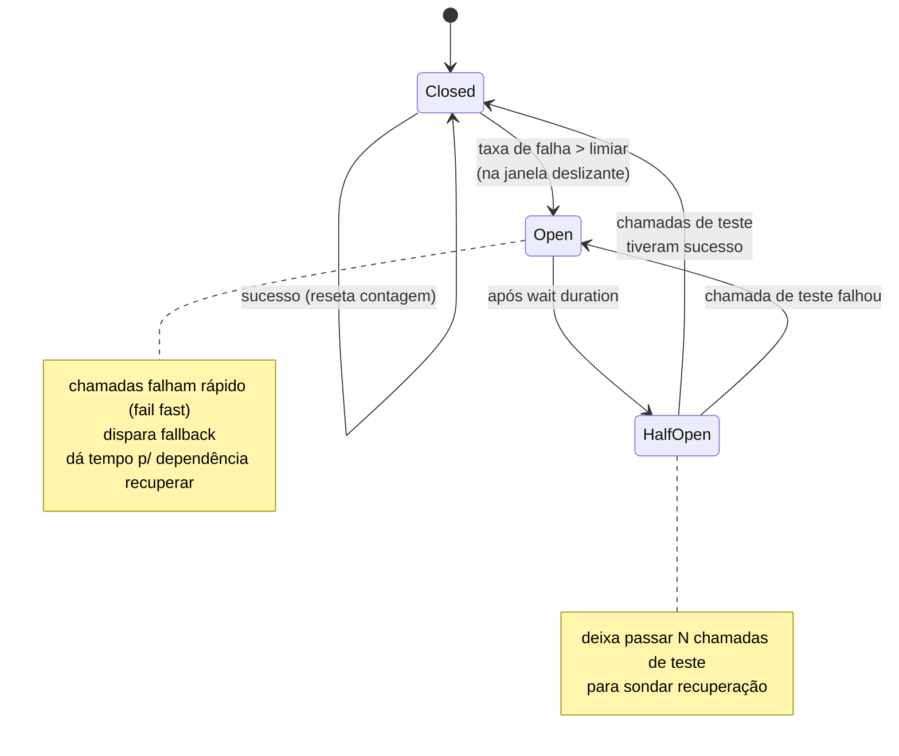
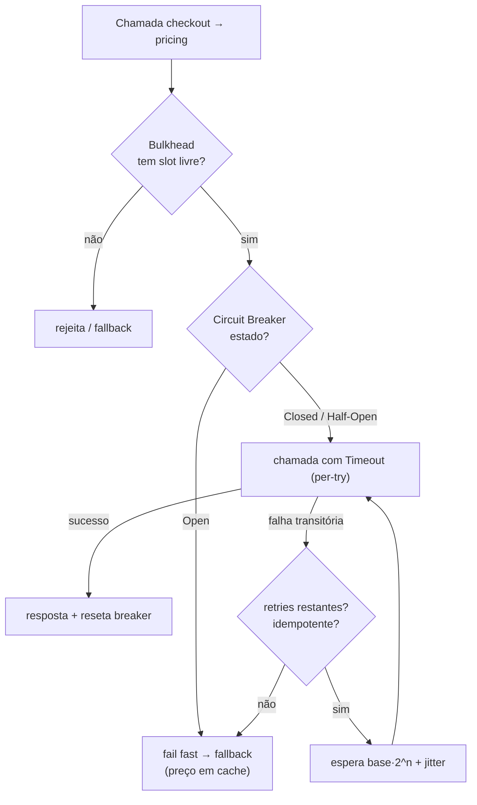
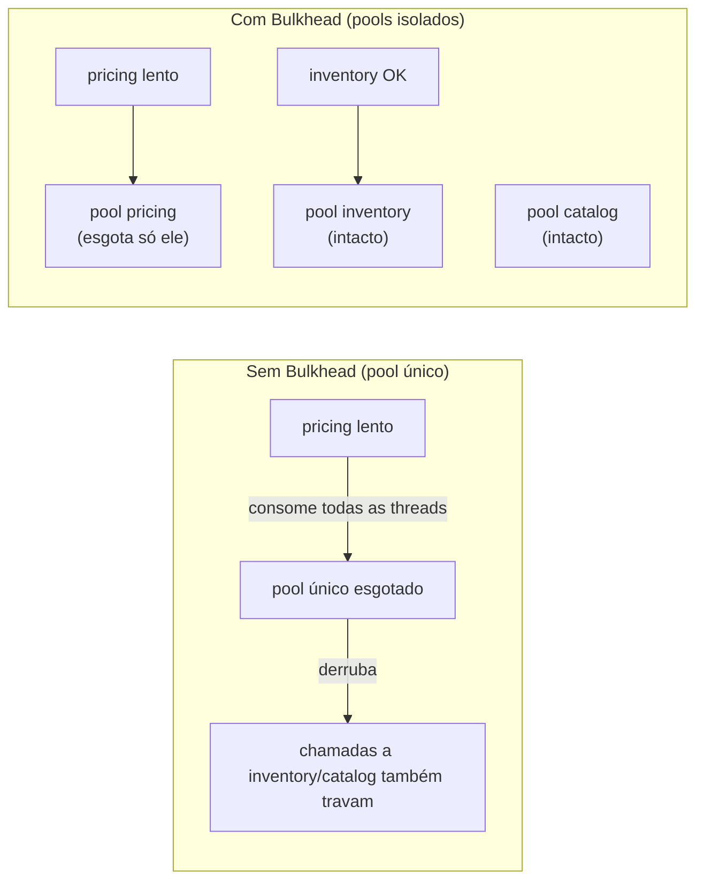

# Padrões de Resiliência: Bulkhead, Circuit Breaker, Retry com Backoff Exponencial, Timeout, Rate Limiting

> **Bloco:** Sistemas distribuídos · **Nível:** Avançado · **Tempo de leitura:** ~34 min

## TL;DR

Em sistemas distribuídos, **falha não é exceção, é regra**: redes particionam, dependências ficam lentas, instâncias morrem. Resiliência não é evitar falhas — é projetar para que falhas parciais **não se propaguem em falhas totais** (falha em cascata). Cinco padrões formam o núcleo da resiliência de comunicação síncrona: **Timeout** (nunca esperar indefinidamente — todo bloqueio precisa de prazo); **Retry com backoff exponencial e jitter** (retentar falhas transitórias, mas com espera crescente e aleatorizada para não causar tempestade de retentativas); **Circuit Breaker** (parar de chamar uma dependência que está falhando, falhando rápido em vez de acumular esperas — máquina de estados closed/open/half-open); **Bulkhead** (isolar recursos — pools de threads/conexões separados — para que a falha de uma dependência não consuma toda a capacidade e afunde o resto, metáfora dos compartimentos estanques de um navio); e **Rate Limiting** (limitar a taxa de requisições aceitas, protegendo o serviço de ser sobrecarregado e dando back-pressure). Esses padrões são complementares e devem ser usados em conjunto — Timeout sem Circuit Breaker ainda acumula latência; Retry sem backoff/jitter vira ataque DDoS contra si mesmo; Circuit Breaker sem Bulkhead ainda permite que uma dependência lenta esgote o pool. Bibliotecas como **Resilience4j** (e o pioneiro **Hystrix**) e service meshes (**Istio/Linkerd/Envoy**) materializam esses padrões.

## O problema que resolve

Michael Nygard, no livro **Release It!**, articulou a observação central: num sistema distribuído, uma **falha parcial** (uma dependência lenta ou indisponível) tende a se transformar em **falha total** por meio de **falhas em cascata** (cascading failures). O mecanismo é insidioso:

Imagine o serviço `checkout` que chama o serviço `pricing` de forma síncrona. Um dia, o `pricing` fica lento (banco sobrecarregado, GC pause, deadlock) e passa a responder em 30s em vez de 50ms. O que acontece com o `checkout`?

1. Cada requisição de checkout que precisa de preço fica **bloqueada por 30s** esperando o `pricing`.
2. Como as requisições não terminam, as **threads** (ou conexões) do `checkout` ficam todas presas, esperando. O pool de threads esgota.
3. Sem threads livres, o `checkout` **para de atender qualquer requisição** — inclusive as que nem precisam do `pricing`. Um serviço lento contaminou e derrubou um serviço inteiro.
4. Os serviços que chamam o `checkout` agora também ficam bloqueados esperando, e o efeito **propaga para cima na cadeia**. Em minutos, metade da plataforma está fora do ar por causa de uma única dependência degradada.

Esse é o cenário que os padrões de resiliência previnem. Como Nygard descreve, o objetivo é **conter o dano**: impedir que recursos críticos (threads, conexões, memória) fiquem amarrados em operações que provavelmente vão falhar, e **falhar rápido** (fail fast) em vez de degradar lentamente.

A pergunta central: **"Como impedir que a degradação de uma dependência consuma os recursos do meu serviço e se propague para o sistema inteiro?"** Cada padrão ataca uma faceta:

- **Timeout:** limita *quanto tempo* um recurso pode ficar preso esperando.
- **Retry:** trata falhas *transitórias* sem desistir prematuramente — mas precisa de disciplina para não amplificar problemas.
- **Circuit Breaker:** *para de tentar* quando a dependência está claramente quebrada, falhando instantaneamente e dando tempo para ela se recuperar.
- **Bulkhead:** *isola* os recursos por dependência, contendo o dano a um compartimento.
- **Rate Limiting:** *protege* o serviço de aceitar mais do que consegue processar, aplicando back-pressure.

A AWS, no Amazon Builders' Library, e a Netflix, com o Hystrix, codificaram a prática industrial desses padrões em larga escala.

Vale enfatizar uma distinção que organiza todo o assunto: o tipo de falha. A dependência que **cai** de forma limpa (connection refused imediato) é o caso *fácil* — você descobre rápido e falha rápido. O caso *difícil e perigoso* é a dependência que fica **lenta** (degradada, mas respondendo): ela não dá erro imediato, então o chamador *espera* — e é essa espera acumulada, multiplicada por milhares de requisições concorrentes, que esgota threads e conexões e produz a cascata. Quase todos os padrões deste documento (timeout, bulkhead, circuit breaker) existem primariamente para conter o cenário da lentidão, não o da queda limpa. Manter isso em mente evita o erro comum de testar resiliência apenas matando instâncias (fácil) e nunca injetando latência (o caso que realmente derruba sistemas).

## O que é (definição aprofundada)

### Timeout

**Timeout** é o limite máximo de tempo que uma operação (chamada de rede, query, aquisição de lock) pode levar antes de ser abortada com erro. Princípio: **toda operação que pode bloquear deve ter um timeout finito**. Sem timeout, uma dependência travada prende o recurso indefinidamente. Tipos:

- **Connection timeout:** tempo para estabelecer a conexão.
- **Request/read timeout (per-try):** tempo para receber a resposta de uma tentativa.
- **Overall/deadline timeout:** orçamento total para a operação inteira, incluindo retries. Sistemas maduros usam **deadlines propagados** (a deadline viaja na chamada; cada serviço downstream sabe quanto tempo resta) — gRPC suporta isso nativamente.

O ajuste do timeout é delicado: curto demais aborta operações legítimas e gera erros/retries; longo demais não protege contra degradação. Deve ser ancorado na **distribuição de latência observada** (ex.: um pouco acima do p99, não na média).

### Retry com backoff exponencial e jitter

**Retry** é reexecutar uma operação que falhou, na expectativa de que a falha era **transitória** (timeout momentâneo, blip de rede, instância que reiniciou). Premissas críticas:

- **Só retentar o que é idempotente** ou seguro de repetir. Retentar um `POST /charge` não-idempotente pode cobrar o cliente duas vezes. Use chaves de idempotência.
- **Só retentar falhas potencialmente transitórias** (5xx, timeouts, connection refused), nunca erros determinísticos (4xx — vão falhar de novo).
- **Backoff exponencial:** o tempo de espera entre tentativas cresce exponencialmente (ex.: 100ms, 200ms, 400ms, 800ms...). Isso dá tempo crescente para a dependência se recuperar e reduz a pressão. Como o backoff exponencial cresce rápido, usa-se **capped exponential backoff** (limite máximo no intervalo).
- **Jitter (aleatorização):** adicionar aleatoriedade ao tempo de espera. Sem jitter, se muitos clientes falham ao mesmo tempo (porque a dependência caiu), todos retentam no **mesmo instante** (thundering herd) — recriando a sobrecarga que causou a falha. O jitter espalha as retentativas no tempo. A AWS, no Builders' Library, demonstra que jitter é essencial e recomenda aplicá-lo a *todos* os timers, jobs periódicos e trabalho atrasado, não só a retries. Variantes incluem **full jitter** (`sleep = random(0, base * 2^n)`) e **equal/decorrelated jitter**.
- **Retry budget / limite de tentativas:** um teto de tentativas (ex.: 3) e/ou um orçamento de retry (no máximo X% das chamadas podem ser retries), para impedir amplificação.

### Circuit Breaker

**Circuit Breaker** (Nygard / Fowler) envolve uma chamada a uma dependência num objeto que **monitora falhas**. Quando as falhas cruzam um limiar, o breaker "abre" e todas as chamadas subsequentes falham **imediatamente** (sem nem tentar a chamada), por um período. Funciona como um disjuntor elétrico. É uma **máquina de estados** com três estados normais:

- **Closed (fechado):** estado normal; as chamadas passam. O breaker conta falhas (por taxa numa janela deslizante ou número consecutivo). Se a taxa de falha cruza o limiar, **transiciona para Open**.
- **Open (aberto):** as chamadas falham instantaneamente (fail fast), sem tocar a dependência. Isso (a) **libera o cliente** de esperar timeouts e (b) **alivia a dependência** já sobrecarregada, dando-lhe espaço para recuperar. Após um *wait duration*, transiciona para Half-Open.
- **Half-Open (semiaberto):** deixa passar um **número limitado de chamadas de teste**. Se elas têm sucesso (a dependência recuperou), volta para **Closed**. Se falham, volta para **Open** e o timer recomeça.

No **Resilience4j**, o CircuitBreaker é exatamente uma máquina de estados finitos com CLOSED, OPEN e HALF_OPEN (mais estados especiais: METRICS_ONLY, DISABLED, FORCED_OPEN), usando janela deslizante (count-based ou time-based) para calcular a taxa de falha. Frequentemente combina-se com um **fallback** (resposta degradada quando o breaker está aberto: valor em cache, default, mensagem amigável).

### Bulkhead

**Bulkhead** (anteparo/compartimento estanque) isola recursos para que a falha de uma parte não afunde o todo — a metáfora vem dos compartimentos estanques do casco de um navio: se um compartimento inunda, os outros mantêm o navio à tona. Aplicado a software: **particionar os recursos (pools de threads, conexões, semáforos) por dependência ou por classe de tráfego**. Assim, se o `pricing` fica lento e esgota *seu* pool, o `checkout` ainda tem pools separados para chamar `inventory`, `catalog`, etc. — a degradação fica contida.

Tipos (Resilience4j):

- **Semaphore bulkhead:** limita o número de chamadas concorrentes via semáforo (a chamada roda na thread do chamador, mas só N podem entrar simultaneamente). Leve.
- **Thread-pool bulkhead:** cada dependência tem seu próprio pool de threads dedicado (modelo Hystrix). Mais isolamento (a chamada roda em thread separada, então timeouts/lentidão não prendem a thread do chamador), mas mais overhead.

### Rate Limiting

**Rate Limiting** limita a taxa de requisições que um serviço aceita num intervalo, protegendo-o de sobrecarga (própria ou de clientes abusivos) e aplicando **back-pressure**. A pergunta que ele responde: "quantas requisições por unidade de tempo este serviço (ou este cliente) pode fazer/sofrer antes de degradar?". É a única defesa deste conjunto que age *a montante* — limitando a entrada de carga em vez de reagir a falhas a jusante. Algoritmos:

- **Token bucket:** um balde acumula tokens a uma taxa fixa; cada requisição consome um token; sem tokens, a requisição é rejeitada (ou enfileirada). Permite **bursts** até a capacidade do balde.
- **Leaky bucket:** requisições saem a uma taxa constante (suaviza bursts).
- **Fixed window / sliding window:** conta requisições por janela de tempo.

Distingue-se **rate limiting** (proteção/contrato, ex.: 1000 req/min por API key) de **throttling/load shedding** (descartar carga adaptativamente sob estresse para preservar a saúde). É frequentemente aplicado no API Gateway (borda) e/ou por serviço.

### Tabela síntese dos cinco padrões

| Padrão | Problema que ataca | Recurso que protege | Mecanismo central | Risco se mal usado |
|---|---|---|---|---|
| **Timeout** | Espera indefinida por dependência travada | Threads/conexões presas | Prazo máximo por operação | Curto demais aborta legítimo; longo demais não protege |
| **Retry (backoff+jitter)** | Falhas transitórias desistidas cedo demais | Disponibilidade percebida | Reexecução com espera crescente e aleatória | Retry storm; duplicidade em não-idempotentes |
| **Circuit Breaker** | Chamar dependência claramente quebrada | Tempo do cliente + saúde da dependência | Máquina de estados closed/open/half-open | Histérico (abre demais) ou dormente (nunca abre) |
| **Bulkhead** | Uma dependência lenta consome todo o pool | Recursos compartilhados (threads/conexões) | Pools/semáforos isolados por dependência | Pools mal dimensionados rejeitam tráfego bom |
| **Rate Limiting** | Aceitar mais carga do que se processa | Capacidade do serviço | Token/leaky bucket, janelas | Limites arbitrários rejeitam tráfego legítimo |

### Anatomia detalhada de uma falha em cascata

Vale dissecar o mecanismo que Nygard descreve, porque ele é a justificativa de *todos* os padrões. A sequência é sempre parecida:

1. **Gatilho:** uma dependência (`pricing`) degrada — não cai, fica **lenta** (o caso mais perigoso, pior que cair). Latência sobe de 50ms para 30s.
2. **Acúmulo de recursos presos:** cada requisição que precisa de `pricing` fica bloqueada esperando. Como não terminam, as threads do chamador (`checkout`) ficam **presas**, uma a uma.
3. **Esgotamento:** o pool de threads/conexões do `checkout` satura. Não há mais threads livres.
4. **Falha total do chamador:** sem threads, o `checkout` para de atender **qualquer** requisição — inclusive as que nem usam `pricing`. Uma dependência lenta derrubou um serviço inteiro.
5. **Propagação para cima:** quem chama `checkout` agora também bloqueia e esgota. O dano sobe pela cadeia. Em minutos, a plataforma inteira está degradada por causa de **uma** dependência lenta.

Onde cada padrão intervém nessa sequência:

- **Timeout** quebra o passo 2: a thread não fica presa 30s, é liberada em (digamos) 1s com erro.
- **Bulkhead** quebra o passo 3-4: mesmo que as threads de `pricing` esgotem, elas estão num pool *isolado*; o `checkout` ainda tem threads para `inventory`/`catalog`. O dano fica contido ao compartimento.
- **Circuit Breaker** quebra o passo 2 de forma mais agressiva: após detectar que `pricing` está quebrado, para de tentar — falha instantaneamente sem nem consumir o timeout, e alivia `pricing` (que estava sobrecarregado), dando-lhe chance de recuperar.
- **Rate Limiting** previne o gatilho a montante: se o `pricing` está limitado, ele rejeita o excesso em vez de aceitar carga que o degradaria.
- **Retry** é o único que pode *piorar* a cascata se mal usado (mais carga sobre algo já caindo) — por isso precisa de backoff, jitter, budget e do circuit breaker como salvaguarda.

### Glossário rápido

- **Cascading failure:** falha parcial (dependência lenta) que se propaga em falha total por esgotamento de recursos.
- **Fail fast:** falhar imediatamente quando a operação está fadada, sem consumir recursos.
- **Timeout:** prazo máximo para uma operação bloqueante.
- **Backoff exponencial:** espera entre retries que cresce exponencialmente (capped).
- **Jitter:** aleatoriedade adicionada à espera para evitar thundering herd / retry storm.
- **Retry budget:** teto percentual de tráfego que pode ser retry, contra amplificação.
- **Circuit Breaker:** máquina de estados (closed/open/half-open) que para de chamar dependência quebrada.
- **Bulkhead:** isolamento de recursos (pools/semáforos) por dependência (metáfora do navio).
- **Rate Limiting:** limite de taxa de requisições aceitas (token/leaky bucket).
- **Load shedding:** descarte adaptativo de carga sob estresse para preservar a saúde.
- **Fallback / graceful degradation:** resposta degradada mas útil quando a dependência falha.
- **Idempotência:** propriedade que torna seguro repetir uma operação (pré-requisito de retry).

## Como funciona

Os padrões se **compõem em camadas** numa única chamada. Considere `checkout → pricing`:

1. **Bulkhead** primeiro: a chamada tenta entrar no pool/semáforo dedicado a `pricing`. Se está cheio (muitas chamadas a `pricing` em voo), rejeita imediatamente — protege as threads do `checkout` de serem todas consumidas por uma dependência lenta.
2. **Circuit Breaker**: se entrou no bulkhead, verifica o estado do breaker. Se **Open**, falha instantaneamente (e dispara fallback). Se **Closed/Half-Open**, prossegue.
3. **Timeout**: a chamada é feita com um per-try timeout. Se estoura, conta como falha (alimenta o breaker).
4. **Retry com backoff+jitter**: se falhou de forma transitória e a operação é idempotente, espera `base * 2^n + jitter` e retenta — respeitando o limite de tentativas e o deadline geral.
5. **Fallback**: se tudo falhou (breaker abriu, retries esgotaram, timeout), retorna uma resposta degradada (preço em cache, valor default, erro amigável).

A ordem importa. Tipicamente: **Bulkhead → CircuitBreaker → RateLimiter → TimeLimiter/Timeout → Retry**, decorando a chamada de fora para dentro (no Resilience4j, via `Decorators.ofSupplier(...).withBulkhead(...).withCircuitBreaker(...).withRetry(...)`). Retentar por dentro do circuit breaker significa que retries contam para abrir o breaker; entender essa interação evita configurações que se anulam.

Por que essa ordem específica? O **bulkhead fica por fora** porque queremos rejeitar cedo (antes de gastar qualquer recurso) quando o compartimento daquela dependência está cheio — não faz sentido avaliar circuit breaker ou tentar a chamada se nem há slot. O **circuit breaker vem em seguida** porque, se a dependência está reconhecidamente quebrada, queremos falhar rápido sem nem consumir o timeout. O **timeout envolve a chamada individual**, e o **retry fica por dentro** envolvendo o timeout, de modo que cada tentativa tem seu próprio prazo e os resultados (sucesso/falha) alimentam o circuit breaker. Inverter essa ordem produz patologias: retry por fora do circuit breaker faz os retries *não* contarem para abrir o breaker (ele nunca protege contra a amplificação); timeout por fora do retry faz o prazo total cortar no meio de uma retentativa de forma imprevisível.

**Interações sutis e perigosas:**

- **Retry + Timeout:** o orçamento total (deadline) deve comportar os retries com seus backoffs. Se cada try tem 2s de timeout, 3 tries com backoff podem somar 8s+ — o cliente upstream pode já ter desistido (timeout dele menor). Use deadlines propagados.
- **Retry + Circuit Breaker:** retries amplificam carga; o breaker é a salvaguarda que para a amplificação quando a dependência está quebrada. Sem breaker, retries em massa contra uma dependência caída são uma tempestade.
- **Retry em camadas (retry amplification):** se cada camada da pilha (cliente → BFF → serviço A → serviço B) retenta 3x independentemente, uma falha em B gera 3×3×3 = 27 chamadas. Em sistemas profundos, **retentar só numa camada** (idealmente a mais próxima da falha) ou usar **retry budgets** evita a explosão multiplicativa.

### Calibração: os números que importam

Resiliência mal calibrada é frequentemente pior que ausência de resiliência (dá falsa segurança). Diretrizes de tuning, ancoradas em dados, não em achismo:

- **Timeout:** ancore na **distribuição de latência observada**, não na média. Um bom ponto de partida é um pouco acima do p99 da operação saudável (ex.: se p99 = 800ms, timeout ~1s). Curto demais aborta operações legítimas (a cauda da distribuição) e gera retries; longo demais não protege. Use **deadlines propagados** para que o orçamento total não seja excedido pela soma dos timeouts em camadas.
- **Retry:** poucas tentativas (2-3, raramente mais). Backoff exponencial com base modesta (100-200ms) e multiplicador 2, **capped** num teto (ex.: 2s) e com **full jitter**. Defina um **retry budget** (ex.: retries não podem exceder 10% do tráfego) para impedir amplificação. Só retente erros transitórios e operações idempotentes.
- **Circuit Breaker:** o limiar de taxa de falha (ex.: 50%) e a janela (deslizante por contagem ou tempo) determinam a sensibilidade. Janela curta demais abre por ruído; longa demais demora a reagir. O *wait duration* em Open (ex.: 30s) deve dar tempo real de recuperação à dependência. O número de chamadas de prova em Half-Open deve ser pequeno (não re-sobrecarregar uma dependência frágil).
- **Bulkhead:** dimensione o pool pela **capacidade real** e pela criticidade. Dependências críticas merecem pools maiores; não-críticas, pools pequenos (contêm o dano e sinalizam saturação cedo). Pool pequeno demais rejeita tráfego legítimo; grande demais não isola (volta a permitir esgotamento).
- **Rate Limiting:** o limite e o tamanho do burst (capacidade do balde) refletem a capacidade sustentável do serviço e o padrão de tráfego. Para APIs de parceiros, é contratual; para o core, prefira **load shedding adaptativo** que reage à saúde real (latência/fila) em vez de um número fixo.

Regra de ouro: **calibre com dados de produção/staging e fault injection, e meça o efeito**. Sem observabilidade dos eventos (quantas vezes o breaker abriu, quantos retries, quanto o bulkhead rejeitou), você não sabe se a configuração ajuda ou atrapalha.

### Onde a resiliência vive: aplicação vs infraestrutura

Os mesmos cinco padrões podem ser implementados em dois lugares, e a escolha (ou a coordenação entre eles) é arquitetural:

- **Na aplicação (bibliotecas):** Resilience4j, Hystrix, Polly. Vantagem: controle fino, contexto de negócio (sabe o que é crítico, tem fallback semântico), funciona fora de Kubernetes. Desvantagem: acoplada à linguagem (lib por stack) e ao deploy de código (mudar política exige redeploy).
- **Na infraestrutura (service mesh / gateway):** Istio/Linkerd/Envoy/Kong implementam timeout, retry, circuit breaking (outlier detection) e rate limiting por configuração, fora do código, poliglota, mudável em runtime. Desvantagem: não tem contexto de negócio (não sabe que recomendação é não-crítica e cobrança é crítica), e fallbacks semânticos ainda precisam de código.

O erro comum é configurar os **dois sem coordenação**: retries no mesh *e* na aplicação se multiplicam; timeouts conflitantes (o mesh aborta antes da app, ou vice-versa); breakers que se anulam. Decida explicitamente: tipicamente, **resiliência de transporte genérica** (timeout de conexão, retry de falha de rede, mTLS) no mesh; **resiliência semântica** (fallback com dado de negócio, distinção crítico/não-crítico) na aplicação.

## Diagrama de fluxo

O primeiro diagrama mostra a máquina de estados do circuit breaker; o segundo, a composição em camadas dos padrões numa única chamada; o terceiro contrasta o esgotamento de pool único (sem bulkhead) com o isolamento por compartimentos (com bulkhead).







## Exemplo prático / caso real

Os exemplos a seguir são cenários compostos de e-commerce/fintech na Black Friday, escolhidos porque o pico de carga é justamente quando os padrões de resiliência são testados ao limite e a diferença entre tê-los bem calibrados ou não vira a diferença entre um incidente contido e um outage de plataforma.

Considere o serviço de **checkout de um e-commerce brasileiro** na Black Friday, que chama síncronamente: `pricing` (cálculo de preço/promoções), `inventory` (reserva de estoque), `payments` (autorização) e `recommendations` (cross-sell — **não-crítico**).

**Incidente clássico evitado.** Às 20h do pico, o serviço `recommendations` degrada (banco de recomendação sob carga). Sem resiliência, o `checkout` ficaria bloqueado esperando recomendações que nem são essenciais para fechar a compra — e travaria a finalização de pedidos por causa de um *nice-to-have*. Com os padrões aplicados via **Resilience4j**:

- **Bulkhead** dá a `recommendations` um pool semáforo pequeno e isolado (ex.: 20 chamadas concorrentes). Quando ele degrada e satura *esse* pool, as chamadas a `pricing`/`inventory`/`payments` (em pools próprios) seguem normais. O dano fica contido.
- **Timeout** curto para `recommendations` (ex.: 300ms — é não-crítico, não vale esperar).
- **Circuit Breaker** em `recommendations`: após a taxa de erro/timeout cruzar 50% na janela, abre; passa a falhar rápido por 30s e usa **fallback** (lista vazia ou recomendações em cache). O checkout continua fechando pedidos normalmente, só sem cross-sell.
- **Retry com backoff+jitter** em `payments` (que é crítico e cujo gateway externo tem blips transitórios): 2 retentativas, base 200ms, full jitter, **com chave de idempotência** para não autorizar a cobrança duas vezes. Erros 4xx (cartão recusado) **não** são retentados.
- **Rate Limiting** na borda (API Gateway / Kong / NGINX): limita req/s por cliente para conter bots de "comprar tudo" e proteger o backend; load shedding adaptativo descarta o excedente preservando a saúde do core.

**Tempestade de retry que NÃO aconteceu.** Quando o gateway de `payments` teve um blip de 5s, milhares de checkouts falharam quase simultaneamente. Sem jitter, todos retentariam no mesmo instante, batendo o gateway recém-recuperado de novo e derrubando-o — um ciclo de **retry storm**. Com **full jitter** e **retry budget** (no máximo 10% das chamadas podem ser retry), as retentativas se espalharam no tempo e a carga de retry ficou limitada; o gateway recuperou sem novo colapso. Esse é exatamente o cenário que a AWS documenta no Builders' Library.

**Bulkhead que salvou o checkout.** Em outro incidente, o serviço `payments` (crítico) ficou lento por causa de um gateway externo. Sem bulkhead, o `checkout` orquestra `pricing`, `inventory`, `payments` e `recommendations` no mesmo pool de threads; as chamadas lentas a `payments` consumiriam todas as threads e o `checkout` pararia de atender *tudo*, inclusive consultas que nem chegam a pagamento (ex.: visualizar o carrinho). Com **bulkhead por dependência**, as chamadas a `payments` esgotaram apenas seu próprio compartimento; o `checkout` continuou servindo navegação do carrinho e cálculo de frete normalmente. Os usuários que tentavam *pagar* viam degradação (mensagem "tente novamente"), mas o serviço como um todo não caiu — exatamente a contenção de dano que a metáfora do navio descreve.

Pseudo-configuração (Resilience4j, composição):

```
// Composição: Bulkhead → CircuitBreaker → Retry, com fallback
decorated = Decorators.ofSupplier(() -> recommendations.forCart(cart))
    .withBulkhead(bulkhead("recs", maxConcurrent=20))
    .withTimeLimiter(timeLimiter("recs", 300ms))
    .withCircuitBreaker(cb("recs", failureRateThreshold=50%, waitOpen=30s, slidingWindow=time(10s)))
    .withRetry(retry("recs", maxAttempts=2, expBackoff(base=100ms, multiplier=2), jitter=full))
    .withFallback(asList(EMPTY_LIST), e -> cachedRecsOrEmpty(cart))
    .decorate();
```

Ferramentas reais: **Resilience4j** (sucessor moderno do Hystrix, baseado em decorators funcionais), **Netflix Hystrix** (pioneiro, hoje em manutenção), **Spring Cloud Circuit Breaker** (abstração), **Polly** (.NET); na camada de infraestrutura, **Envoy/Istio/Linkerd** implementam timeout, retry, circuit breaking/outlier detection e rate limiting por configuração; gateways como **NGINX**, **Kong** e **Envoy** fazem rate limiting na borda.

### Padrões correlatos que completam o arsenal

Os cinco padrões centrais não estão sozinhos. Vale conhecer os companheiros frequentes:

- **Fallback / graceful degradation:** quando uma dependência falha (breaker aberto, timeout), retornar uma resposta *degradada mas útil* em vez de erro — dado em cache, valor default, lista vazia, mensagem amigável. É o que torna o circuit breaker palatável ao usuário: em vez de "erro", a tela mostra o checkout sem as recomendações. Fallback deve degradar *e* alertar, nunca esconder silenciosamente.
- **Load shedding:** sob estresse, **descartar deliberadamente** parte da carga (preferindo as requisições mais valiosas/baratas) para preservar a saúde do serviço para o restante. Diferente do rate limiting contratual: é adaptativo, reage à saúde real (profundidade de fila, latência). Melhor rejeitar 10% rápido do que degradar 100% lentamente.
- **Fail fast:** detectar cedo que uma operação vai falhar (input inválido, breaker aberto, recurso indisponível) e falhar **imediatamente**, sem consumir recursos numa tentativa fadada. É o princípio por trás do estado Open do circuit breaker.
- **Idempotência e chaves de idempotência:** pré-requisito para retry seguro. Uma operação idempotente pode ser repetida sem efeito colateral adicional; uma chave de idempotência permite que o servidor detecte e descarte retentativas duplicadas de operações não-naturalmente-idempotentes (ex.: `POST /charge`).
- **Steady-state / housekeeping:** evitar que recursos cresçam sem limite (logs, conexões, dados temporários) que eventualmente esgotam o serviço — uma forma de resiliência preventiva que Nygard enfatiza em *Release It!*.
- **Health check / readiness:** expor estado de saúde que reflita a capacidade real de servir, permitindo que LB e orquestrador parem de mandar tráfego para instâncias degradadas (conecta com discovery).

Esses padrões se reforçam: circuit breaker + fallback dão degradação graciosa; rate limiting + load shedding dão proteção em camadas; retry + idempotência dão recuperação segura.

## Quando usar / Quando evitar

**Timeout:** sempre. Toda chamada de rede, query, aquisição de lock ou operação bloqueante deve ter timeout. **Não há exceção legítima** para ausência de timeout em sistema distribuído. Ajuste com base na distribuição de latência real.

**Retry:** use para **falhas transitórias** em operações **idempotentes/seguras**. **Evite** para erros determinísticos (4xx), operações não-idempotentes sem chave de idempotência, ou quando o sistema já está sob sobrecarga (retry agrava). Sempre com backoff exponencial + jitter + limite de tentativas.

**Circuit Breaker:** use para dependências remotas que podem falhar/degradar, especialmente onde a falha em cascata é um risco. **Evite/calibre com cuidado** em dependências com falhas raras mas latência alta normal (pode abrir falsamente), ou onde não há fallback razoável (abrir o breaker só converte lentidão em erro — útil para conter cascata, mas avalie). Não faz sentido em chamadas locais in-process.

**Bulkhead:** use quando múltiplas dependências compartilham um pool de recursos e você precisa **conter o dano** de uma dependência lenta. Essencial em serviços que orquestram várias chamadas (BFF, gateway, agregadores). **Evite** thread-pool bulkhead se o overhead de context-switch importa e o semáforo basta; e dimensione os pools (pools pequenos demais rejeitam tráfego legítimo).

**Rate Limiting:** use para proteger serviços de sobrecarga, impor contratos/quotas (APIs públicas/parceiros) e conter abuso. **Evite** limites arbitrários que rejeitam tráfego legítimo; prefira load shedding adaptativo no core e limites contratuais claros na borda.

## Anti-padrões e armadilhas comuns

- **Ausência de timeout.** O pecado original. Uma única chamada sem timeout pode prender threads indefinidamente e derrubar o serviço. Bibliotecas HTTP/clients frequentemente têm timeout *infinito* por default — verifique e configure.
- **Retry storm / thundering herd (retry sem backoff/jitter).** Retentar imediatamente, sem backoff e sem jitter, faz todos os clientes baterem a dependência ao mesmo tempo, recriando a sobrecarga. É o anti-padrão que a AWS Builders' Library destaca como motivação central do jitter.
- **Retry amplification em camadas.** Retentar 3x em cada camada de uma pilha de N serviços gera 3^N chamadas para uma única falha de fundo. Retente numa camada só (próxima da falha) ou use retry budgets.
- **Retry em operações não-idempotentes.** Retentar um `POST` que cria pedido/cobra cartão sem chave de idempotência gera duplicidade. Garanta idempotência antes de retentar.
- **Circuit Breaker mal calibrado.** Limiar/janela errados causam dois males: **breaker histérico** (abre com falhas normais, derrubando uma dependência saudável) ou **breaker dormente** (limiar alto demais, nunca abre, não protege). Calibre com dados reais de taxa de erro e latência; teste em staging com fault injection.
- **Half-open mal dimensionado.** Deixar passar chamadas demais no half-open pode re-sobrecarregar uma dependência ainda frágil; poucas demais demora a fechar. Ajuste o número de chamadas de prova.
- **Bulkhead com pool único disfarçado.** Configurar "bulkheads" que na verdade compartilham o mesmo pool subjacente não isola nada. Garanta pools/semáforos **realmente** separados por dependência.
- **Fallback que esconde o problema.** Fallback que retorna dado silenciosamente errado (ou sempre vazio) sem alertar mascara incidentes. Fallback deve degradar graciosamente *e* emitir métrica/alerta.
- **Configurar resiliência sem observabilidade.** Sem métricas de quantas vezes o breaker abre, quantos retries acontecem, quanto o bulkhead rejeita, você está voando às cegas — não saberá se a configuração está ajudando ou piorando. Exponha os eventos (Resilience4j expõe `/actuator/circuitbreakerevents`, etc.).
- **Tratar resiliência só como código de aplicação OU só como mesh.** Os dois lugares (libs e mesh) implementam os mesmos padrões; configurá-los nos dois sem coordenação leva a retries duplicados, timeouts conflitantes e breakers que se anulam. Decida onde cada padrão vive.
- **Ordem de composição errada.** Retry por fora do circuit breaker faz os retries não contarem para abri-lo (perde a salvaguarda); timeout por fora do retry corta no meio de uma tentativa. A ordem canônica é Bulkhead → CircuitBreaker → RateLimiter → Timeout → Retry (fora para dentro).
- **Testar só matando instâncias.** Validar resiliência apenas com kills (dependência que cai) ignora o caso difícil — a dependência **lenta**, que é a que causa cascatas. Injete latência, não só falhas binárias.
- **Deadline não propagado.** Cada camada com seu próprio timeout, sem propagar a deadline, faz o trabalho continuar a jusante mesmo depois de o cliente upstream ter desistido — desperdício e retries inúteis. Propague a deadline (gRPC suporta nativamente).

### Resiliência síncrona vs assíncrona

Os cinco padrões deste documento atacam primariamente a comunicação **síncrona** (request/response), onde o chamador *espera* a resposta e o risco é prender recursos. Há uma estratégia ortogonal e poderosa: tornar a comunicação **assíncrona**. Em vez de `checkout` chamar `email` síncronamente (e ficar refém da disponibilidade do serviço de email para confirmar o pedido), o `checkout` publica um evento numa fila e segue em frente; o serviço de email consome quando puder. Isso **desacopla a disponibilidade temporal**: o `email` pode estar fora por minutos sem afetar o checkout, e processa o backlog ao voltar.

A assincronia transforma a natureza do problema de resiliência:

- **Back-pressure** (no assíncrono) cumpre o papel do rate limiting/bulkhead (síncrono): a fila absorve picos e o consumo controlado protege o consumidor de sobrecarga.
- **Retry** vira reprocessamento da mensagem (com a fila garantindo durabilidade), tipicamente at-least-once — o que reforça a necessidade de **idempotência** no consumidor.
- **Dead letter queues (DLQ)** capturam mensagens que falham repetidamente, evitando que envenenem o processamento (poison message).

A escolha síncrono vs assíncrono é arquitetural: o assíncrono dá resiliência superior por desacoplamento, mas adiciona complexidade (eventual consistency, ordenação, idempotência, observabilidade de filas). Nem tudo pode ser assíncrono (o usuário precisa do preço *agora*), mas mover o que pode para assíncrono reduz drasticamente a superfície de falha em cascata síncrona. Resiliência madura combina os dois: padrões síncronos onde a resposta é necessária na hora, assincronia onde dá para desacoplar.

### Testar resiliência: chaos engineering

Configurar resiliência sem testá-la é fé, não engenharia. A prática de **chaos engineering** (popularizada pela Netflix com o Chaos Monkey) injeta falhas controladas em produção/staging para validar que os padrões realmente funcionam: derruba instâncias (valida discovery + retry), injeta latência (valida timeouts + circuit breaker), particiona rede (valida comportamento sob partição). O service mesh facilita isso com **fault injection** declarativa (injetar 10% de 503 ou +2s de delay numa dependência) sem tocar código. O ponto: um circuit breaker que nunca foi visto abrir sob falha real é um circuit breaker não-testado — e configuração de resiliência não-testada frequentemente está errada (limiar mal calibrado, fallback quebrado). Inclua cenários de falha nos testes regularmente.

## Relação com outros conceitos

- **Service Mesh:** Istio/Linkerd/Envoy implementam timeout, retry, circuit breaking (outlier detection) e rate limiting *fora* do código, por configuração de plataforma. Mesh é um veículo de entrega desses padrões — mas exige a mesma calibração (backoff, jitter, budgets).
- **Service Discovery & Load Balancing:** resiliência depende de discovery (saber para onde retentar/rotear) e LB (espalhar carga; outlier detection é LB ejetando instâncias ruins). Discovery sem resiliência é frágil.
- **API Gateway / BFF:** o gateway/BFF orquestra várias chamadas downstream e é o lugar natural para timeout por dependência, bulkhead, circuit breaking e rate limiting de borda; agregação síncrona sem esses padrões propaga indisponibilidade.
- **Idempotência & semântica de entrega:** retry só é seguro com idempotência; chaves de idempotência e at-least-once/at-most-once são pré-requisitos para retry correto, conectando com mensageria.
- **Back-pressure & filas:** rate limiting e bulkhead são formas de back-pressure síncrono; em arquiteturas assíncronas, filas e consumo controlado cumprem papel análogo de absorver picos e isolar carga.
- **Observabilidade:** métricas de breaker/retry/bulkhead/rate limit e tracing são essenciais para calibrar e operar os padrões; resiliência sem observabilidade é configuração cega.
- **CAP & consistência:** fallbacks (servir dado em cache/stale quando a fonte está indisponível) são uma escolha consciente de disponibilidade sobre consistência (AP) sob falha.

## Modelo mental para o arquiteto

Três ideias para carregar:

1. **Falha é regra, não exceção.** Em sistemas distribuídos, redes particionam e dependências degradam o tempo todo. Resiliência não é evitar falhas — é impedir que uma falha *parcial* (uma dependência lenta) vire uma falha *total* (cascata). Todo o arsenal existe para conter o dano.
2. **Os padrões são complementares, não substitutos.** Timeout sem circuit breaker ainda acumula latência; retry sem backoff/jitter vira ataque a si mesmo; circuit breaker sem bulkhead ainda permite esgotamento de pool. Use-os em conjunto, em camadas, com a ordem certa.
3. **Configuração não-calibrada e não-testada está provavelmente errada.** Limiares, janelas, timeouts e tamanhos de pool precisam ser ancorados em dados reais (distribuição de latência, capacidade) e validados com fault injection / chaos engineering. Sem observabilidade dos eventos, você voa cego.

O fio condutor, na lição de Nygard: o inimigo não é a dependência que *cai* (isso é fácil — falha rápido), é a que fica *lenta* — porque ela prende recursos silenciosamente até o esgotamento. Os padrões de resiliência existem para detectar e conter exatamente esse cenário insidioso, falhando rápido e isolando o dano.

## Pontos para fixar (revisão)

- O inimigo real é a dependência **lenta** (não a que cai), porque ela prende recursos silenciosamente até o esgotamento e a cascata.
- **Timeout** sempre, em toda operação bloqueante, ancorado na distribuição de latência (acima do p99), com deadlines propagados.
- **Retry** só para falhas transitórias e operações idempotentes, com **backoff exponencial + jitter + retry budget** — sem isso, vira retry storm.
- **Circuit Breaker** = máquina de estados closed/open/half-open; falha rápido quando a dependência está quebrada, aliviando-a; combina com **fallback**.
- **Bulkhead** isola recursos por dependência (pools/semáforos), contendo o dano de uma dependência lenta.
- **Rate Limiting** (contratual, na borda) e **load shedding** (adaptativo, no core) protegem contra sobrecarga.
- Os padrões **se compõem em camadas** (Bulkhead → CircuitBreaker → RateLimiter → Timeout → Retry) e são complementares, não substitutos.
- **Calibre com dados e teste com fault injection / chaos engineering** — configuração não-testada provavelmente está errada.
- Decida **onde** a resiliência vive (lib vs mesh) e coordene — configurá-la nos dois sem alinhamento multiplica retries e anula breakers.
- Onde possível, **assincronia** (filas, back-pressure) dá resiliência superior por desacoplamento temporal.

## Referências

- [bliki: Circuit Breaker — Martin Fowler](https://martinfowler.com/bliki/CircuitBreaker.html)
- [Pattern: Circuit Breaker — microservices.io](https://microservices.io/patterns/reliability/circuit-breaker.html)
- [Timeouts, retries, and backoff with jitter — Amazon Builders' Library (Marc Brooker)](https://aws.amazon.com/builders-library/timeouts-retries-and-backoff-with-jitter/)
- [Exponential Backoff And Jitter — AWS Architecture Blog](https://aws.amazon.com/blogs/architecture/exponential-backoff-and-jitter/)
- [Introducing Hystrix for Resilience Engineering — Netflix TechBlog](https://netflixtechblog.com/introducing-hystrix-for-resilience-engineering-13531c1ab362)
- [CircuitBreaker — Resilience4j (documentação)](https://resilience4j.readme.io/docs/circuitbreaker)
- [Getting Started — Resilience4j (Bulkhead, Retry, RateLimiter, decorators)](https://resilience4j.readme.io/docs/getting-started)
- [Retry with backoff pattern — AWS Prescriptive Guidance](https://docs.aws.amazon.com/prescriptive-guidance/latest/cloud-design-patterns/retry-backoff.html)
