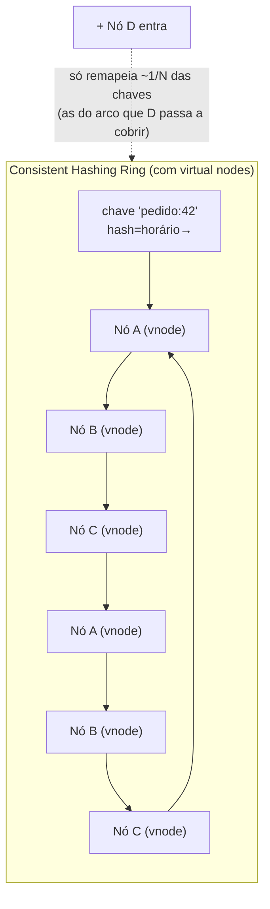
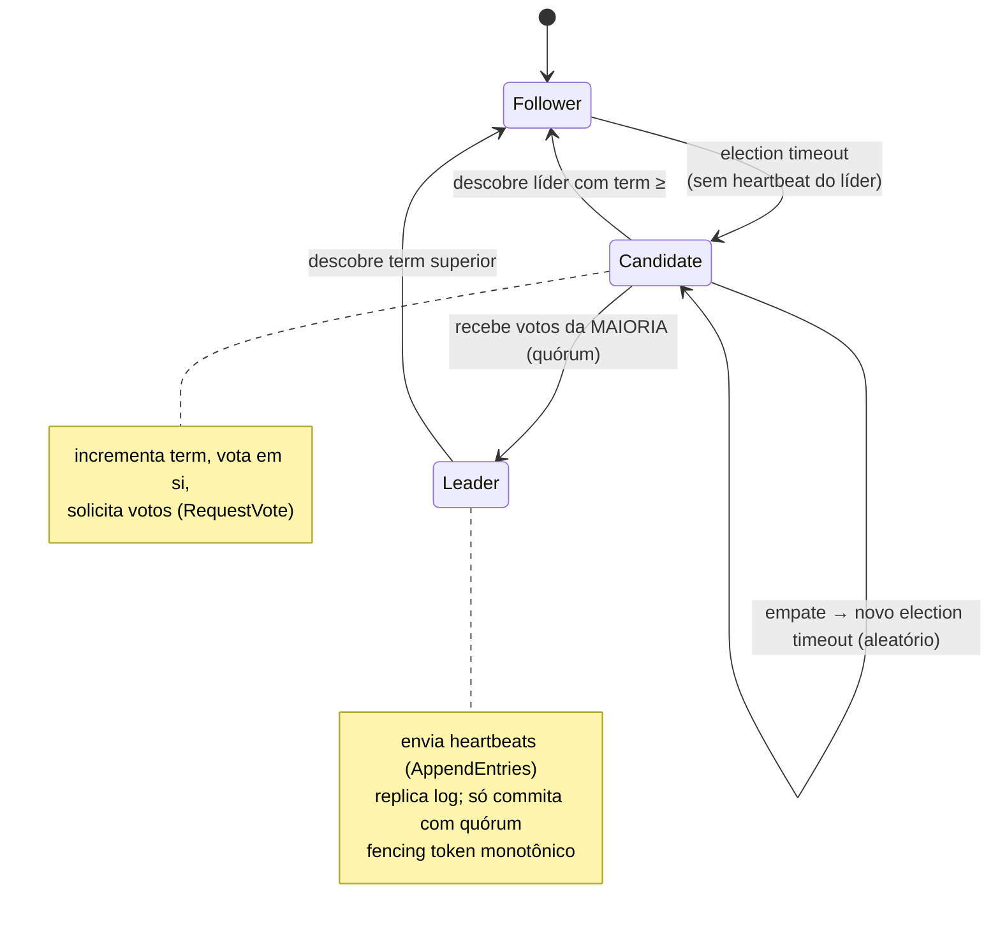
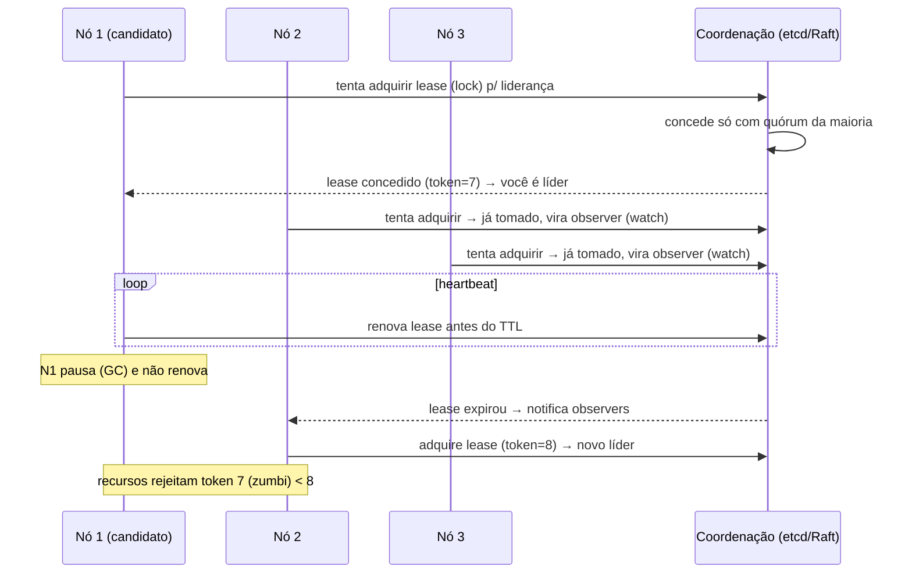

# Leader Election, Sharding e Consistent Hashing

> **Bloco:** Sistemas distribuídos · **Nível:** Avançado · **Tempo de leitura:** ~34 min

## TL;DR

Três técnicas estruturais que aparecem no coração de praticamente todo banco distribuído, cache em escala e sistema de mensageria moderno — e que um arquiteto precisa entender não como caixas-pretas, mas em sua mecânica.

Três técnicas estruturais para coordenar e escalar sistemas distribuídos. **Leader Election** resolve "quem está no comando": elege dinamicamente um único nó coordenador entre réplicas, de modo que apenas um execute uma tarefa que não deve ser concorrente (escrever numa partição, agendar jobs, sequenciar operações), e reelege automaticamente quando o líder falha — implementado sobre algoritmos de consenso como **Raft** (Consul, etcd) ou **ZAB** (ZooKeeper). **Sharding** (particionamento) resolve "como escalar além de uma máquina": divide os dados/carga em partições (shards) distribuídas entre nós, contornando o limite vertical — com estratégias de **key-range** (ordenado, bom para range queries, risco de hotspot) ou **hash** (distribuição uniforme, perde ordenação). **Consistent Hashing** resolve "como distribuir chaves entre nós minimizando remapeamento quando nós entram/saem": mapeia chaves e nós num **anel (ring)** de hash, onde cada chave pertence ao próximo nó no sentido horário; adicionar/remover um nó só remapeia uma fração ~K/N das chaves (não tudo), com **virtual nodes** suavizando a distribuição. Originou-se do paper de **Karger et al. (1997)** para caches web e é a base de DynamoDB, Cassandra, Riak e clientes memcached (**libketama**). Os três se entrelaçam: sharding precisa decidir a qual shard cada chave vai (consistent hashing), e shards replicados precisam de um líder por partição (leader election).

## O problema que resolve

Os três conceitos atacam problemas distintos mas frequentemente coexistentes em qualquer sistema que precise crescer além de uma máquina e coordenar-se sob falhas. Vale separá-los com clareza antes de ver como se entrelaçam.

### Leader Election — o problema da coordenação única

Muitas operações distribuídas exigem que **exatamente um** nó esteja no comando num dado momento:

- **Escrita coordenada numa partição:** em sistemas com replicação líder-seguidor (single-leader), só o líder aceita escritas, garantindo uma ordem única e evitando conflitos.
- **Tarefas que não devem rodar em paralelo:** um job agendado (ex.: fechar o caixa do dia, reprocessar uma fila) que, se rodar em N réplicas simultaneamente, causa duplicidade ou corrupção.
- **Sequenciamento / atribuição de trabalho:** um coordenador que distribui partições entre workers (rebalanceamento), ou gera IDs sequenciais.

Sem eleição automática, você teria duas opções ruins: um líder estático configurado manualmente (se ele cai, ninguém assume — indisponibilidade) ou todos agindo como líder (caos, duplicidade). Leader Election dá um líder **único e dinâmico**: eleito automaticamente, e **reeleito** quando o atual falha. O desafio difícil é fazer isso corretamente sob falhas de rede e partições — onde dois nós podem cada um *achar* que é o líder (**split-brain**), causando corrupção. Por isso, leader election sério é construído sobre **consenso distribuído**.

### Sharding — o problema do limite vertical

Uma única máquina tem teto: CPU, memória, IOPS, throughput de rede. Quando o dataset ou a carga excedem o que um nó aguenta, **scale-up** (máquina maior) chega ao limite físico e econômico. **Sharding** é **scale-out**: dividir os dados em partições e espalhá-las por vários nós, de modo que cada nó cuide de um subconjunto. Assim, dataset e throughput crescem ~linearmente com o número de nós. O problema que isso introduz é: **como dividir** os dados de forma que (a) a carga fique balanceada (sem hotspots), (b) seja possível localizar a qual shard pertence uma chave (request routing), e (c) seja possível **rebalancear** quando se adiciona/remove nós sem mover dados demais nem indisponibilizar o sistema.

### Consistent Hashing — o problema do remapeamento catastrófico

O modo ingênuo de distribuir chaves entre N nós é `nó = hash(chave) mod N`. Funciona — até você mudar N. Se você adiciona ou remove um nó (N muda), **quase todas as chaves remapeiam** para nós diferentes, porque o `mod N` muda para praticamente toda chave. Num cluster de caches, isso significa **invalidar o cache inteiro** de uma vez (cache stampede contra o banco). Richard Jones, então CTO da **Last.fm**, descreveu exatamente isso: ao adicionar/remover servidores do pool de memcached, tudo passava a hashear para servidores diferentes, "efetivamente limpando o cache inteiro".

O paper seminal de **Karger, Lehman, Leighton, Panigrahy, Levine e Lewin (STOC 1997)**, "Consistent Hashing and Random Trees", introduziu o conceito para aliviar *hot spots* na web: uma função de hash **consistente** é aquela que **muda minimamente quando o range da função muda** — adicionar/remover um nó remapeia apenas uma fração das chaves (em média K/N, onde K é o número de chaves e N de nós), não todas. Essa propriedade é a base de virtualmente todo sistema de dados distribuído moderno e de caches em escala.

## O que é (definição aprofundada)

### Leader Election

**Leader Election** é o processo pelo qual um conjunto de nós (réplicas, processos) acorda dinamicamente qual deles é o **líder** (coordenador) — o único autorizado a executar certas operações — e o reelege automaticamente quando o líder falha. Propriedades desejadas:

- **Safety (segurança):** no máximo um líder por *termo*/época. Nunca dois líderes simultâneos com autoridade conflitante (evitar split-brain).
- **Liveness (vivacidade):** eventualmente um líder é eleito (o sistema não fica permanentemente sem líder).

Implementações sérias se apoiam em **consenso distribuído**, que exige um **quórum** (maioria) para tomar decisões — garantindo que uma partição de rede minoritária não consiga eleger um líder rival:

- **Raft** (Diego Ongaro & John Ousterhout, "In Search of an Understandable Consensus Algorithm"): decompõe o problema em **leader election**, **log replication** e **safety**. Nós são *follower*, *candidate* ou *leader*. Um follower que não recebe heartbeat do líder dentro de um *election timeout* (aleatorizado, para evitar empates) vira candidate, incrementa o *term*, vota em si e pede votos. Quem obtém **maioria** vira leader. Usado por **etcd**, **Consul**, CockroachDB, TiKV.
- **ZAB (ZooKeeper Atomic Broadcast):** o protocolo do **ZooKeeper**, conceitualmente próximo do Paxos/Raft.
- **Paxos:** o algoritmo de consenso original (Lamport), notoriamente difícil de entender e implementar — motivo pelo qual Raft foi projetado como alternativa "understandable".

Na prática, times raramente implementam consenso do zero: usam **ZooKeeper**, **etcd** ou **Consul** como serviço de coordenação e fazem leader election via primitivas como **locks distribuídos** ou **leases** (ex.: nó que detém um lease com TTL é o líder; se não renovar, perde a liderança e outro assume). **Fencing tokens** (números monotonicamente crescentes a cada eleição) protegem contra um líder "zumbi" (pausado por GC) que volta achando que ainda manda — recursos rejeitam tokens antigos.

### Raft em detalhe (o consenso por trás da eleição)

Como leader election séria se apoia em consenso, vale entender o Raft — projetado por Ongaro e Ousterhout explicitamente para ser **compreensível** (em contraste com a notória dificuldade do Paxos). Raft decompõe o consenso em três subproblemas independentes:

1. **Leader election:** um nó é *follower*, *candidate* ou *leader*. Followers esperam heartbeats do líder. Se um follower não recebe heartbeat dentro de um **election timeout** (aleatorizado entre, digamos, 150-300ms — a aleatoriedade evita empates simultâneos), ele se torna *candidate*, incrementa o **term** (um contador de épocas que cresce monotonicamente), vota em si mesmo e envia `RequestVote` aos demais. Cada nó vota em no máximo um candidato por term. Quem recebe votos da **maioria** vira *leader*. Se há empate (votos divididos), o term termina sem líder e novos election timeouts (aleatórios) disparam, quase sempre resolvendo na rodada seguinte.
2. **Log replication:** o líder recebe as escritas (comandos), anexa-as ao seu **log** e as replica via `AppendEntries` (que também serve de heartbeat). Uma entrada é **committed** quando replicada na maioria; só então é aplicada à máquina de estados. Isso garante durabilidade: um comando commitado sobrevive a falhas da minoria.
3. **Safety:** regras garantem que um nó com log desatualizado não possa virar líder (a eleição prefere quem tem o log mais completo), e que entradas commitadas nunca sejam perdidas ou reordenadas.

O **term** é a peça que dá segurança contra zumbis no nível do protocolo: mensagens com term antigo são rejeitadas, e um líder que descobre um term superior imediatamente vira follower. Raft é o motor de **etcd**, **Consul**, CockroachDB e TiKV. Saber que "leader election via etcd" significa, por baixo, esse protocolo, é o que diferencia usar a ferramenta de entendê-la.

### Sharding (Particionamento)

**Sharding** é dividir um dataset (ou carga) em **partições/shards** distribuídas entre nós. Kleppmann, em *Designing Data-Intensive Applications*, trata isso no capítulo de **Partitioning**. Estratégias:

- **Particionamento por key-range (faixa de chave):** cada partição possui as chaves de um mínimo a um máximo, mantendo a **ordem**. Vantagem: **range queries eficientes** (ex.: "todos os pedidos de janeiro"). Desvantagem: risco de **hotspot** se o acesso é enviesado por faixa (ex.: chave = timestamp → todas as escritas recentes vão para a mesma partição). Usado por HBase, Bigtable.
- **Particionamento por hash da chave:** aplica `hash(chave)` e a partição possui um range de hashes. Vantagem: **distribuição uniforme** da carga (destrói o enviesamento). Desvantagem: **perde a ordenação** — range queries viram scatter/gather em todas as partições. Usado por Cassandra, DynamoDB.
- **Hot spots residuais:** mesmo com hash, uma única chave muito acessada (ex.: post de uma celebridade) vira hotspot; mitiga-se com **split de chave** (sufixos aleatórios) ou caching.

Sharding precisa resolver:

- **Request routing:** como o cliente sabe a qual nó ir? Opções (Kleppmann): cliente consulta um *routing tier* (proxy), nós sabem redirecionar, ou o cliente conhece o mapa de partições (ex.: via ZooKeeper/gossip).
- **Rebalanceamento:** ao adicionar/remover nós, mover partições com **mínimo deslocamento de dados** e sem indisponibilizar. É aqui que consistent hashing brilha. (Nota: Kleppmann alerta que o "consistent hashing" puro do Karger nem sempre é o usado em bancos — muitos usam um número **fixo de partições** maior que o número de nós, redistribuindo partições inteiras; chamado às vezes de rebalanceamento por partição fixa.)
- **Secondary indexes:** índices locais (document-partitioned: escrita numa partição, leitura espalhada) vs globais (term-partitioned: leitura numa partição, escrita espalhada).

### Consistent Hashing

**Consistent Hashing** mapeia tanto **chaves** quanto **nós** num mesmo espaço de hash circular — o **anel (ring/continuum)**, tipicamente o range de um hash de 32/64/128 bits fechado em círculo (o maior valor se conecta ao menor). Mecânica:

- Cada **nó** é posicionado no anel pelo hash de seu identificador (IP, nome).
- Cada **chave** é posicionada pelo hash da chave.
- A chave pertence ao **primeiro nó encontrado caminhando no sentido horário** a partir da posição da chave.
- **Adicionar um nó** só "rouba" as chaves que ficam entre o nó anterior e o novo nó — uma fração ~1/N. **Remover um nó** transfere suas chaves para o próximo no anel. Em ambos os casos, a **maioria das chaves não se move**.

O problema da versão básica: com poucos nós, a distribuição no anel fica **desigual** (um nó pode pegar uma fatia muito maior do que outro). Solução: **virtual nodes (vnodes) / réplicas no anel**: cada nó físico é representado por **muitos pontos** no anel (a libketama usa 100-200 hashes por servidor). Isso suaviza a distribuição (lei dos grandes números) e, ao remover um nó, espalha suas chaves por **vários** nós em vez de sobrecarregar só o vizinho. Variantes avançadas: **multi-probe consistent hashing**, **rendezvous (HRW) hashing**, **jump consistent hash** (Google) — alternativas com diferentes trade-offs de memória/balanceamento.

A **libketama** (Last.fm, 2007) é a implementação canônica para clientes memcached: hasheia cada servidor em 100-200 inteiros sem sinal, posiciona-os no continuum, e cada chave vai ao próximo servidor no anel — usada por extensões memcached de PHP, Python (pylibmc), Java, etc.

Há variantes modernas que vale conhecer pelo nome, cada uma com um trade-off distinto:

- **Rendezvous hashing (HRW — Highest Random Weight):** para cada chave, calcula `hash(chave, nó)` para *todos* os nós e escolhe o de maior valor. Não precisa de anel nem vnodes; dá balanceamento excelente e remapeamento mínimo, ao custo de O(N) por lookup (mitigável). Usado em alguns sistemas de roteamento e caches.
- **Jump consistent hash (Google):** algoritmo de Lamping e Veach que mapeia uma chave para um de N buckets com distribuição quase perfeita, sem armazenar o anel — apenas alguns saltos aritméticos. Extremamente eficiente em memória e CPU, mas assume buckets numerados de 0 a N-1 (menos flexível para remoção arbitrária de nós no meio).
- **Multi-probe consistent hashing:** reduz a necessidade de muitos vnodes sondando o anel em múltiplos pontos por chave, melhorando o balanceamento com menos memória.

A escolha entre elas depende do padrão de mudança de topologia, do custo de memória aceitável (anel com muitos vnodes vs jump hash sem estado) e da flexibilidade necessária para adicionar/remover nós em posições arbitrárias.

### Por que quórum e o porquê dos números ímpares

O coração da segurança da leader election (e do consenso) é o **quórum de maioria**. Uma decisão só é tomada se mais da metade dos nós concorda. A propriedade matemática crucial: **duas maiorias de um mesmo conjunto sempre se intersectam** em pelo menos um nó. Logo, é impossível duas partições disjuntas formarem maioria simultaneamente — o que torna **impossível** eleger dois líderes legítimos ao mesmo tempo. É assim que o split-brain é prevenido na raiz.

Daí a recomendação de clusters de coordenação **ímpares** (3, 5, 7 nós): um cluster de 3 tolera 1 falha (maioria = 2); um de 5 tolera 2 falhas (maioria = 3). Um número par não melhora a tolerância (4 nós também toleram só 1 falha, pois maioria = 3) e desperdiça um nó — por isso 3 ou 5 são os tamanhos canônicos. O preço da consistência: numa partição, **a minoria fica indisponível** (não consegue formar maioria), priorizando segurança sobre disponibilidade (CP no CAP). Aceitar essa indisponibilidade da minoria é o custo de nunca ter dois líderes.

### Split-brain: o pesadelo e suas defesas

**Split-brain** é a situação em que uma partição de rede (ou uma pausa longa de um nó) faz **dois nós cada um se achar o líder**. Se ambos aceitam escritas, os dados divergem irremediavelmente — corrupção. Há duas classes de defesa:

1. **Prevenção por quórum (na eleição):** como visto, exigir maioria para eleger impede que duas partições elejam líderes simultâneos. Resolve o caso de partição de rede limpa.
2. **Fencing tokens (na escrita):** o caso mais traiçoeiro é o **líder zumbi** — um líder legítimo que sofre uma pausa stop-the-world (GC longo, suspensão de VM), perde o lease (que expira), outro nó assume corretamente, e então o velho líder "acorda" *ainda achando que manda* e tenta escrever. O quórum não pega isso porque não houve duas eleições simultâneas — houve uma sucessão, e o zumbi está atrasado. A defesa é o **fencing token**: cada nova liderança recebe um número **monotonicamente crescente**. O líder inclui o token em toda operação, e o recurso protegido (banco, storage) **rejeita qualquer token menor que o último que viu**. O zumbi, com token antigo, é barrado. Kleppmann detalha exatamente esse cenário e o fencing como a defesa correta — locks distribuídos sem fencing são inseguros.

### Glossário rápido

- **Leader Election:** eleger dinamicamente um nó coordenador único, com reeleição automática sob falha.
- **Consenso:** acordo entre nós sobre um valor/estado, base da eleição (Raft, ZAB, Paxos).
- **Quórum:** maioria necessária para uma decisão; duas maiorias sempre se intersectam (evita split-brain).
- **Term / época:** contador monotônico de períodos de liderança no Raft.
- **Split-brain:** dois nós se achando líder simultaneamente; corrompe dados.
- **Fencing token:** número monotônico por liderança; recursos rejeitam tokens antigos (anti-zumbi).
- **Lease:** lock com TTL; quem o detém e renova é o líder.
- **Sharding / Partitioning:** dividir dados/carga em partições entre nós (scale-out).
- **Shard key:** chave que determina a partição de cada registro; escolha quase irreversível.
- **Key-range vs hash partitioning:** ordenado (range queries, risco de hotspot) vs uniforme (perde ordem).
- **Consistent Hashing:** anel de hash onde adicionar/remover nó remapeia só ~1/N das chaves.
- **Virtual nodes (vnodes):** múltiplos pontos por nó físico no anel, para balanceamento e suavidade.

## Como funciona

### Leader Election (estilo lease sobre etcd/Consul/ZooKeeper)

1. Cada candidato tenta **adquirir um lock/lease** distribuído com TTL no serviço de coordenação (etcd/Consul/ZK).
2. Quem adquire é o **líder**; ele **renova o lease** periodicamente (heartbeat) antes do TTL expirar.
3. Os demais **observam** (watch) o lock; ficam em standby.
4. Se o líder falha ou pausa (não renova), o lease **expira**; o serviço de coordenação notifica os observadores; um novo candidato adquire o lock e vira líder.
5. **Fencing token:** cada nova liderança recebe um número monotonicamente crescente; o líder inclui o token nas operações, e os recursos protegidos rejeitam tokens menores que o último visto — neutralizando um ex-líder "zumbi".

Por baixo, o serviço de coordenação usa **Raft/ZAB**: o lock só é concedido se a **maioria** (quórum) do cluster de coordenação concorda — garantindo que uma partição minoritária não eleja um líder paralelo.

### Sharding + request routing

1. Define-se a função de particionamento (key-range ou hash) e o número de partições.
2. Um **mapa de partições** (qual partição em qual nó) é mantido — frequentemente no ZooKeeper/etcd ou propagado via **gossip** (Cassandra).
3. Na escrita/leitura, o roteador (proxy, cliente coordinator-aware, ou nó que redireciona) calcula a partição da chave e encaminha ao nó certo.
4. Ao **rebalancear** (novo nó), partições são reatribuídas e seus dados migrados em background; o mapa é atualizado atomicamente.

Um detalhe operacional crítico do rebalanceamento: a migração de dados de uma partição para um novo nó consome largura de banda e IO durante o processo. Se isso ocorre durante um pico de carga (justamente quando o autoscaling tende a adicionar nós), a migração compete com o tráfego de produção e pode *piorar* a latência temporariamente. Por isso sistemas maduros oferecem **throttling da migração** e/ou exigem disparo controlado, evitando que o rebalanceamento automático vire um amplificador de incidente. Outro ponto: durante a migração, leituras/escritas para a partição em trânsito precisam de uma estratégia (servir do nó antigo até a migração concluir, ou redirecionar) para não perder dados nem servir stale.

### Consistent Hashing — lookup e rebalanceamento

```
// Construção do anel com virtual nodes
para cada servidor S:
    para i em 1..V (V = vnodes, ex.: 160):
        ponto = hash(S.id + ":" + i)
        anel[ponto] = S
ordenar(anel por ponto)

// Lookup de uma chave
h = hash(chave)
ponto = menor ponto em 'anel' tal que ponto >= h   // busca binária no sentido horário
se nenhum: ponto = primeiro do anel                 // wrap-around (círculo)
servidor = anel[ponto]
```

Ao **adicionar** o servidor `S_novo`: calcula-se seus V pontos e insere-se no anel; apenas as chaves cujos hashes caem nos novos intervalos (entre `S_novo` e o nó anterior em cada ponto) migram para `S_novo`. Ao **remover** `S_old`: removem-se seus V pontos; suas chaves passam a resolver para os próximos nós horários — espalhadas por vários nós graças aos vnodes.

### Rebalanceamento: consistent hashing puro vs partições fixas

Um ponto que Kleppmann faz questão de esclarecer: o "consistent hashing" usado por muitos bancos **não é exatamente** o algoritmo do Karger. Há duas famílias de estratégia de rebalanceamento:

- **Consistent hashing puro (estilo anel/Karger):** nós e chaves no anel; adicionar/remover nó remapeia ~1/N das chaves continuamente. É o que clientes de cache (libketama) e Dynamo/Cassandra (com vnodes) usam. Elegante para topologias muito dinâmicas.
- **Número fixo de partições:** cria-se um número fixo de partições (muito maior que o número de nós, ex.: 1024 partições para 10 nós) **no início**, e cada nó cuida de várias partições. Ao adicionar um nó, ele **rouba algumas partições inteiras** dos nós existentes (movendo dados dessas partições); ao remover, suas partições são redistribuídas. O número de partições **não muda** — só a atribuição partição→nó. É o modelo de Riak, Elasticsearch, Couchbase e (com hash slots) do Redis Cluster. Vantagem: o mapeamento chave→partição é fixo e simples (`hash mod num_partitions`), e só o mapa partição→nó muda — mais previsível que o anel.

Kleppmann alerta que escolher o número de partições é um trade-off: muitas partições têm overhead de gerenciamento; poucas limitam o quanto você pode escalar (não dá para ter mais nós que partições). Alguns sistemas suportam *split* dinâmico de partições (key-range, como HBase), evitando fixar o número.

### Request routing: como o cliente acha o nó certo

Sharding só funciona se algo sabe rotear cada chave ao nó dono. Kleppmann lista três abordagens:

1. **Roteamento via tier dedicado (proxy):** o cliente fala com um proxy/router que conhece o mapa de partições e encaminha (ex.: o mongos do MongoDB). Simples para o cliente; o router precisa do mapa atualizado.
2. **Nós que redirecionam:** o cliente fala com qualquer nó; se ele não tem a chave, redireciona/encaminha ao nó certo (ex.: redirects do Redis Cluster — `MOVED`). Não precisa de proxy, mas o cliente precisa lidar com redirects.
3. **Cliente coordinator-aware:** o cliente conhece o mapa de partições diretamente (via gossip ou um serviço de coordenação como ZooKeeper) e vai direto ao nó certo (estilo Cassandra). Menos hops, mas o cliente fica mais complexo.

Em todos, o desafio é manter o **mapa de partições consistente** conforme nós entram/saem — frequentemente delegado a ZooKeeper/etcd (coordenação) ou propagado via gossip.

## Diagrama de fluxo

Os diagramas a seguir capturam os três conceitos centrais: o anel de consistent hashing (e o efeito de adicionar um nó), a máquina de estados da eleição via Raft, e o fluxo de aquisição/sucessão de liderança via lease com fencing token.







## Exemplo prático / caso real

Os cenários a seguir mostram os três conceitos operando juntos no core de uma fintech/marketplace — desde o particionamento do banco de transações até a coordenação de jobs críticos e a distribuição de chaves no cache. O fio condutor é que, em sistemas reais, eles raramente aparecem isolados.

Considere uma **fintech/marketplace brasileiro** escalando seu core.

**Sharding do banco de transações.** O volume de transações excedeu o que um Postgres único aguenta. O time fez **sharding por hash** do `account_id`: cada conta sempre cai no mesmo shard, distribuindo escritas uniformemente entre 16 shards. Escolheram hash (não key-range por data) justamente porque key-range por timestamp criaria **hotspot** — todas as transações recentes batendo o mesmo shard. O preço: queries de range por data agora são scatter/gather. Para o relatório "transações de janeiro de toda a base", fazem fan-out aos 16 shards e agregam (ou mantêm um índice/data warehouse separado).

**Consistent hashing no cluster de cache.** Na frente do banco, um cluster de **Redis/memcached** com ~12 nós cacheia perfis, saldos e catálogo. Usam **consistent hashing** (libketama no cliente) para distribuir chaves. Quando precisaram **adicionar 4 nós** na Black Friday para aumentar a capacidade de cache, só ~25% das chaves remapearam — em vez dos ~92% que `mod N` causaria. O cache não foi "limpo", o banco não levou um stampede, e o pico foi absorvido. Quando um nó morreu (hardware), graças aos **virtual nodes** suas chaves se redistribuíram por vários nós, não sobrecarregando um único vizinho. Esse é exatamente o problema que o Richard Jones da Last.fm resolveu com a libketama.

**Leader election para jobs e coordenação.** Há um job crítico que **fecha o lote de liquidação** uma vez por minuto e **não pode** rodar em duas réplicas ao mesmo tempo (geraria liquidação duplicada). O serviço roda em 5 réplicas para HA, mas usam **leader election via etcd** (lease com TTL): apenas a réplica líder executa o job; as outras ficam em standby. Se o líder cai, em segundos outra assume o lease e continua. **Fencing tokens** garantem que, se o ex-líder estava só pausado por GC e "acorda" tentando escrever, sua escrita com token antigo é rejeitada — sem split-brain, sem liquidação dupla.

**Onde os três se encontram.** O cluster Cassandra usado para o feed de atividades faz **sharding por hash** com **consistent hashing** (anel com vnodes) para distribuir partições, e cada partição tem réplicas com um esquema de coordenação por réplica. Em sistemas single-leader por shard (como alguns setups de Kafka/bancos sharded), **cada shard tem seu próprio líder** eleito — combinando os três conceitos numa só arquitetura.

**Caso Kafka em detalhe.** O cluster Kafka que transporta os eventos de domínio do marketplace ilustra os três juntos de forma exemplar. Um tópico (`pedidos`) é dividido em **partições** (sharding) — a chave do evento (ex.: `pedido_id`) determina a partição via hash, garantindo que todos os eventos de um mesmo pedido caiam na mesma partição e mantenham ordem. Cada partição tem **réplicas** (replicação para durabilidade/HA), e entre essas réplicas há uma **líder** (leader election) que recebe escritas e leituras; as demais (ISR — in-sync replicas) acompanham. Se o broker que hospeda a líder de uma partição cai, o controller do Kafka **elege uma nova líder** entre as ISRs — failover automático. Assim, num único sistema: sharding (partições) dá throughput horizontal, replicação dá durabilidade, e leader election por partição dá consistência de escrita com failover. Entender essa composição é entender por que Kafka escala e sobrevive a falhas de broker.

**Hot key tratada.** Numa Black Friday, um único `seller_id` (uma grande loja em promoção relâmpago) concentrava 40% das escritas, criando um hotspot que nenhuma estratégia de hash resolvia (a chave era a mesma, ia sempre para o mesmo shard). A solução: **split de chave** — adicionar um sufixo `seller_id:bucket_N` (N aleatório entre 0-9) distribuiu as escritas daquele seller por 10 sub-chaves/partições, aliviando o hotspot, ao custo de ter que agregar os 10 buckets na leitura. É o padrão clássico de mitigação de hot key que Kleppmann descreve.

Ferramentas reais: **etcd**, **Consul**, **ZooKeeper** (coordenação/leader election, Raft/ZAB); **Cassandra**, **DynamoDB**, **Riak** (consistent hashing + sharding nativo); **libketama**/**ketama** (consistent hashing em clientes memcached, ports em PHP/Python/Java); **Redis Cluster** (sharding por hash slots — 16384 slots, variante de partição fixa); **Kafka** (partições = shards, líder por partição via controller).

**O incidente de split-brain que quase aconteceu.** Numa fase inicial, o time tentou implementar o job singleton de liquidação com um lock simples no Redis (sem fencing token), achando que bastava. Num teste de caos, simularam uma pausa de GC de 8s na réplica líder: o lock (TTL de 5s) expirou, outra réplica assumiu e começou a liquidar, e então a réplica original "acordou" — ainda dentro do bloco crítico, com o lock que *achava* ainda válido — e tentou liquidar o mesmo lote. Sem fencing, ambas teriam escrito, gerando liquidação dupla. A correção foi migrar para **etcd com lease + fencing token**: cada liderança recebe um token monotônico, e o serviço de liquidação rejeita qualquer escrita com token menor que o último visto. O teste de caos passou a barrar a réplica zumbi corretamente. Esse episódio é o exemplo vivo do alerta de Kleppmann: locks distribuídos sem fencing são inseguros, por mais que "pareçam" funcionar no caminho feliz.

### A matemática do remapeamento: por que consistent hashing ganha

Vale fazer a conta que justifica o consistent hashing. Com `hash(chave) mod N` e N nós, a chave `k` vai para o nó `hash(k) mod N`. Mude N para N+1 (adicione um nó) e o nó de quase toda chave muda: `hash(k) mod N` raramente é igual a `hash(k) mod (N+1)`. Na prática, **~(N)/(N+1) das chaves remapeiam** — para N=12, cerca de 92%. Num cluster de cache, isso significa invalidar 92% do cache de uma vez: um cache miss massivo que despeja toda a carga represada no banco simultaneamente (cache stampede), frequentemente derrubando-o.

Com consistent hashing, adicionar um nó só afeta as chaves no arco que o novo nó passa a cobrir — em média **~1/N das chaves** (para N=12, ~8%, ou ~25% ao adicionar 4 nós de uma vez). A diferença entre 92% e 8% de remapeamento é a diferença entre um outage e uma operação tranquila. Essa é, literalmente, a propriedade que Karger et al. formalizaram: uma função de hash consistente "muda minimamente quando o range da função muda".

Os **virtual nodes** refinam isso em duas dimensões: (1) **balanceamento** — com 100-200 pontos por nó físico, a lei dos grandes números faz cada nó receber uma fatia próxima de 1/N do anel, em vez da distribuição irregular de poucos pontos; (2) **suavidade na remoção** — quando um nó morre, suas chaves não vão todas para o único vizinho horário (sobrecarregando-o), mas se espalham por *vários* nós, pois os V pontos do nó morto estavam espalhados pelo anel, cada um com um vizinho diferente.

### Tabela síntese dos três conceitos

| Conceito | Pergunta que responde | Mecanismo | Ferramentas | Risco principal |
|---|---|---|---|---|
| **Leader Election** | Quem está no comando? | Consenso/quórum + lease + fencing | etcd, Consul, ZooKeeper (Raft/ZAB) | Split-brain, líder zumbi |
| **Sharding** | Como escalar além de uma máquina? | Particionar dados/carga entre nós | Cassandra, DynamoDB, Redis Cluster, Kafka | Shard key ruim → hotspot; cross-shard queries |
| **Consistent Hashing** | Como distribuir chaves minimizando remapeamento? | Anel de hash + virtual nodes | libketama, Dynamo, Cassandra, Riak | Sem vnodes → distribuição irregular |

## Quando usar / Quando evitar

**Leader Election — use quando:** uma operação precisa de coordenador único (escrita single-leader, job singleton, sequenciador) e você precisa de failover automático. **Evite/cuidado quando:** você pode redesenhar para ser **sem líder** (leaderless, estilo Dynamo) ou totalmente idempotente/comutativo — eliminar a necessidade de líder remove uma classe inteira de complexidade. Nunca implemente consenso "na mão"; use etcd/Consul/ZK. Esteja ciente do custo de latência do quórum e do risco de split-brain se feito sem consenso real.

**Sharding — use quando:** o dataset ou a carga excedem uma máquina e scale-up chegou ao limite; quando você precisa de throughput/armazenamento que cresça com nós. **Evite quando:** os dados cabem confortavelmente em uma máquina (ou com réplicas de leitura) — sharding adiciona complexidade enorme (routing, rebalanceamento, queries cross-shard, transações distribuídas). **Adie o máximo possível**: sharding prematuro é uma das maiores fontes de complexidade acidental. Escolha a chave de shard com extremo cuidado — ela é difícil de mudar depois e define hotspots e capacidade de query.

**Consistent Hashing — use quando:** você distribui chaves entre um conjunto de nós que **muda** (caches, stores distribuídos, balanceamento com afinidade) e precisa minimizar remapeamento. **Evite/considere alternativas quando:** o conjunto de nós é fixo (mod N basta), ou quando você precisa de balanceamento perfeitamente uniforme garantido (consistent hashing tem variância; partição-fixa ou jump hash podem ser melhores) — Kleppmann nota que muitos bancos preferem número fixo de partições ao consistent hashing puro.

Uma heurística de decisão para o trio: comece sempre pela pergunta "eu *preciso* mesmo disso agora?". Coordenação (leader election) e particionamento (sharding) adicionam complexidade substancial — quórum, split-brain, rebalanceamento, queries cross-shard. Se um design sem líder (idempotente, comutativo) ou um banco único com réplicas de leitura resolve, prefira-os. Adote sharding quando o limite vertical for real e iminente, não preventivamente. Adote leader election quando houver uma operação que *genuinamente* não pode ser concorrente e precisa de failover. E, ao adotá-los, não negligencie os detalhes que separam o funcional do correto: virtual nodes no consistent hashing, fencing tokens na eleição, e uma shard key escolhida com base nas queries e na distribuição de acesso reais.

## Anti-padrões e armadilhas comuns

- **Split-brain (dois líderes).** Implementar leader election sem consenso real (ex.: só um lock sem quórum, ou um "líder" decidido por timeout sem fencing) permite que uma partição de rede produza dois líderes que corrompem dados. Sempre quórum + fencing tokens.
- **Líder zumbi (stop-the-world GC).** Um líder pausado por GC longo perde o lease, outro assume, e o velho "acorda" achando que ainda manda. Sem **fencing token**, ele escreve e corrompe. O token monotônico é a defesa canônica (descrita por Kleppmann).
- **`hash(chave) mod N` para clusters dinâmicos.** O anti-padrão clássico: mudar N remapeia quase tudo, limpando caches e causando stampede contra o banco. É exatamente o que consistent hashing existe para resolver.
- **Consistent hashing sem virtual nodes.** Com poucos pontos no anel, a distribuição fica desigual (um nó pega muito mais carga) e a remoção de um nó sobrecarrega só o vizinho. Vnodes (100-200/nó, como na libketama) são essenciais.
- **Chave de shard mal escolhida.** Shardar por algo de baixa cardinalidade ou enviesado (ex.: por `tenant_id` quando um tenant é 80% do tráfego) cria hotspot que aniquila o benefício do sharding. Shardar por timestamp causa hotspot de escrita. A escolha da shard key é quase irreversível — pense nas queries e na distribuição de acesso.
- **Sharding prematuro.** Shardar antes de precisar adiciona complexidade brutal (cross-shard joins, transações distribuídas, rebalanceamento) sem benefício. Esgote scale-up e réplicas de leitura primeiro.
- **Queries cross-shard ignoradas.** Sharding por hash mata range queries e joins entre shards; se a aplicação depende deles, vira scatter/gather caro. Modele as queries *antes* de escolher a estratégia.
- **Ignorar rebalanceamento automático perigoso.** Rebalanceamento que dispara sozinho durante um pico (porque um nó parece "cheio") pode mover dados em massa e piorar a sobrecarga. Kleppmann recomenda rebalanceamento com algum grau de controle humano/limites.
- **Confundir replicação com sharding.** Sharding divide dados *diferentes* entre nós (escala capacidade); replicação copia os *mesmos* dados (HA/leitura). São ortogonais e usados juntos — confundi-los leva a designs errados.
- **Lock distribuído sem fencing token.** Usar um lock distribuído (Redis Redlock, lock em ZK) para garantir exclusão mútua *sem* fencing token é inseguro: um detentor pausado por GC pode voltar e escrever após o lock ter passado a outro. O token monotônico rejeitado pelo recurso é a defesa correta (ponto enfático de Kleppmann).
- **Cluster de coordenação par.** Usar 2, 4 ou 6 nós no cluster de consenso não melhora a tolerância (um par tolera as mesmas falhas que o ímpar imediatamente inferior) e desperdiça recursos. Use 3 ou 5.
- **Número de partições fixado baixo demais.** No modelo de partições fixas, você não pode ter mais nós que partições. Fixar poucas partições limita o teto de escala futuro; muitas adicionam overhead. Dimensione pensando no crescimento.
- **Rebalanceamento automático agressivo.** Rebalanceamento que dispara sozinho durante um pico move dados em massa e pode piorar a sobrecarga. Kleppmann recomenda controle (limites, aprovação humana) sobre quando rebalancear.
- **Hot key não tratada.** Mesmo com hash, uma única chave muito acessada (post viral, conta de um grande seller) vira hotspot que nenhuma estratégia de partição resolve sozinha. Trate com split de chave (sufixos), caching dedicado ou réplicas.

## Relação com outros conceitos

- **Consenso & CAP:** leader election sério é uma aplicação de consenso (Raft/ZAB/Paxos), que escolhe **consistência sobre disponibilidade** (CP) em partições — uma partição minoritária não elege líder, ficando indisponível para preservar a segurança.
- **Sharding ↔ Consistent Hashing:** consistent hashing é uma das técnicas para decidir a qual shard uma chave pertence e para rebalancear com mínimo movimento; sharding é o problema, consistent hashing uma das soluções de distribuição.
- **Consistent Hashing ↔ Caches:** caso de uso fundacional (libketama/memcached) — distribuir chaves entre nós de cache sem invalidar tudo ao mudar a topologia.
- **Service Discovery & Load Balancing:** consistent hashing também é uma *política de LB* (afinidade de sessão, cache locality — rotear a mesma chave sempre à mesma instância); discovery frequentemente expõe qual nó é líder de um shard.
- **Replicação & Mensageria:** sistemas single-leader (bancos, Kafka por partição) combinam sharding (partições) com leader election (líder por partição) e replicação (réplicas/ISR). Kafka é o exemplo canônico dos três juntos.
- **Padrões de resiliência:** failover de líder e rebalanceamento de shards interagem com timeouts e retries; um cliente precisa de retry/redirect quando a liderança muda ou uma partição migra.
- **Idempotência:** quando um job singleton (via leader election) ou uma escrita pode ser reexecutado após failover, idempotência e fencing tokens evitam efeitos duplicados.

## Modelo mental para o arquiteto

Três ideias para carregar:

1. **Cada conceito responde uma pergunta distinta, mas eles se entrelaçam.** Leader Election = "quem coordena?"; Sharding = "como escalo além de uma máquina?"; Consistent Hashing = "como distribuo chaves minimizando remapeamento?". Na prática se combinam: um sistema sharded replicado precisa de líder por partição (eleição), de uma estratégia de distribuição (consistent hashing) e de rebalanceamento. Kafka é o exemplo canônico dos três juntos.
2. **Coordenação é cara e arriscada — evite quando puder.** Leader election introduz quórum (latência), risco de split-brain e dependência de um serviço de coordenação tier-0. Designs leaderless, idempotentes ou comutativos eliminam classes inteiras dessa complexidade. Sharding prematuro é uma das maiores fontes de complexidade acidental. Adote esses mecanismos quando a dor for real, não antecipadamente.
3. **A escolha de chave é quase irreversível e define tudo.** A shard key define hotspots, capacidade de query e facilidade de rebalanceamento — e é dolorosa de mudar depois. Modele as queries e a distribuição de acesso *antes* de escolher. Da mesma forma, consistent hashing sem virtual nodes não balanceia, e leader election sem fencing token não é seguro: os detalhes determinam se o mecanismo funciona ou corrompe.

O fio condutor: esses são os mecanismos que permitem a um sistema **crescer além de uma máquina** (sharding) e **coordenar-se de forma segura sob falhas** (eleição/consenso), com consistent hashing como a cola que distribui dados de forma estável. Dominá-los é a diferença entre usar um banco distribuído como caixa-preta e entender por que ele se comporta como se comporta sob partição, churn e hotspot.

## Pontos para fixar (revisão)

- **Leader Election** séria se apoia em **consenso** (Raft/ZAB) com **quórum de maioria** — duas maiorias sempre se intersectam, impedindo dois líderes (anti-split-brain).
- Clusters de coordenação são **ímpares** (3, 5, 7); a minoria fica indisponível em partição (CP) para preservar segurança.
- O **líder zumbi** (pausa de GC) é o caso traiçoeiro; a defesa é o **fencing token** monotônico rejeitado pelos recursos.
- **Sharding** é scale-out (dividir dados/carga); ortogonal a **replicação** (copiar os mesmos dados para HA/leitura).
- **Key-range** (ordenado, range queries, risco de hotspot) vs **hash** (uniforme, perde ordenação) são as duas estratégias base de particionamento.
- A **shard key** é quase irreversível e define hotspots e capacidade de query — modele as queries antes de escolher.
- **Consistent Hashing** remapeia só ~1/N das chaves ao mudar a topologia (vs ~92% do `mod N`) — base de caches e stores distribuídos.
- **Virtual nodes** são essenciais: dão balanceamento uniforme e espalham a carga de um nó removido por vários.
- Kleppmann distingue consistent hashing **puro** (anel) de **partições fixas** (redistribuir partições inteiras) — muitos bancos usam o segundo.
- Os três se combinam em sistemas reais (ex.: **Kafka** = partições + líder por partição + replicação).

## Referências

- [In Search of an Understandable Consensus Algorithm (Raft) — Ongaro & Ousterhout (PDF)](https://raft.github.io/raft.pdf)
- [Raft Consensus Algorithm — site oficial (visualização, implementações)](https://raft.github.io/)
- [Consistent Hashing and Random Trees — Karger, Lehman, Leighton, Panigrahy, Levine, Lewin (STOC 1997)](https://dlnext.acm.org/doi/10.1145/258533.258660)
- [dblp: Consistent Hashing and Random Trees (registro bibliográfico)](https://dblp.org/rec/conf/stoc/KargerLLPLL97.html)
- [libketama — a consistent hashing algo for memcache clients (Richard Jones, Last.fm)](https://www.metabrew.com/article/libketama-consistent-hashing-algo-memcached-clients)
- [Designing Data-Intensive Applications — Martin Kleppmann (cap. Partitioning) — O'Reilly](https://www.oreilly.com/library/view/designing-data-intensive-applications/9781491903063/)
- [Multi-probe consistent hashing (arXiv, variante moderna)](https://arxiv.org/pdf/1505.00062)
- [Stanford CS168 — Introduction and Consistent Hashing (notas de aula)](https://web.stanford.edu/class/cs168/l/l1.pdf)
