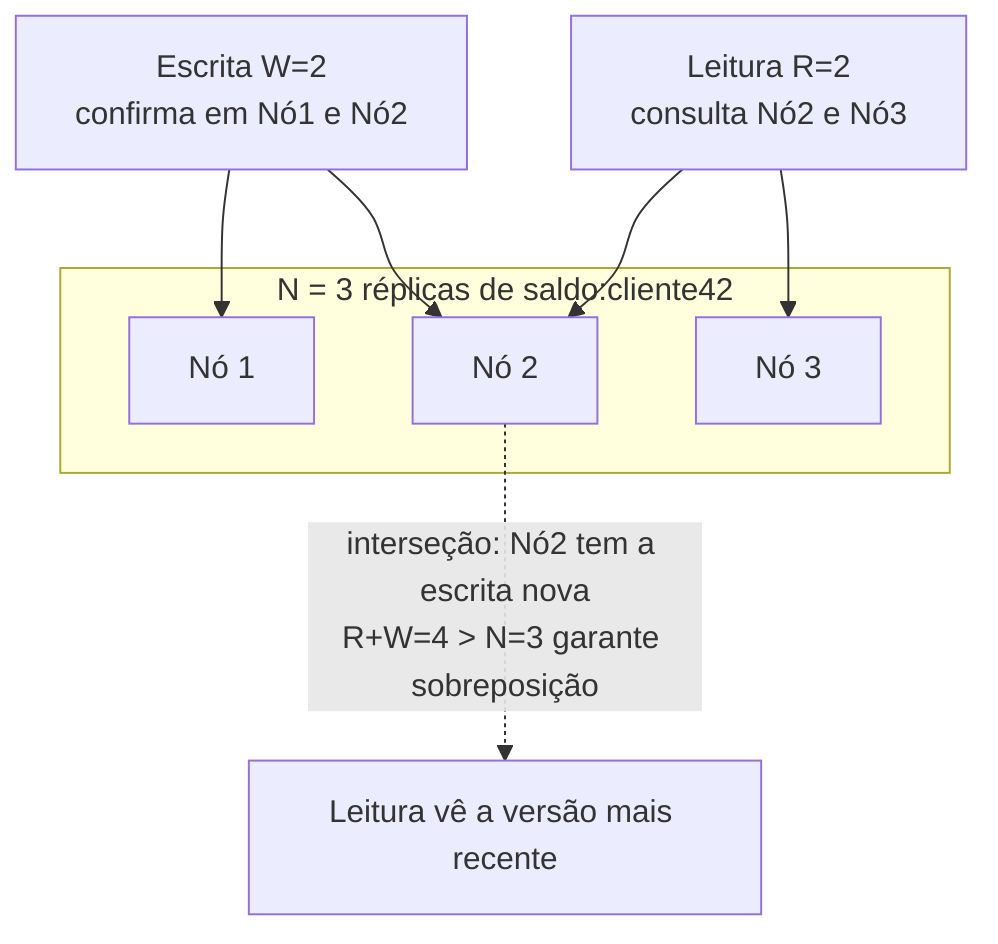
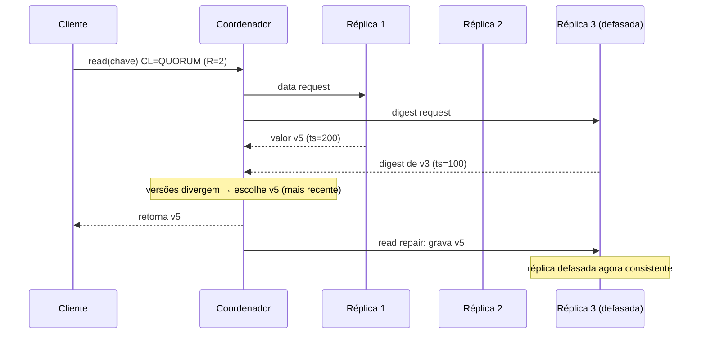
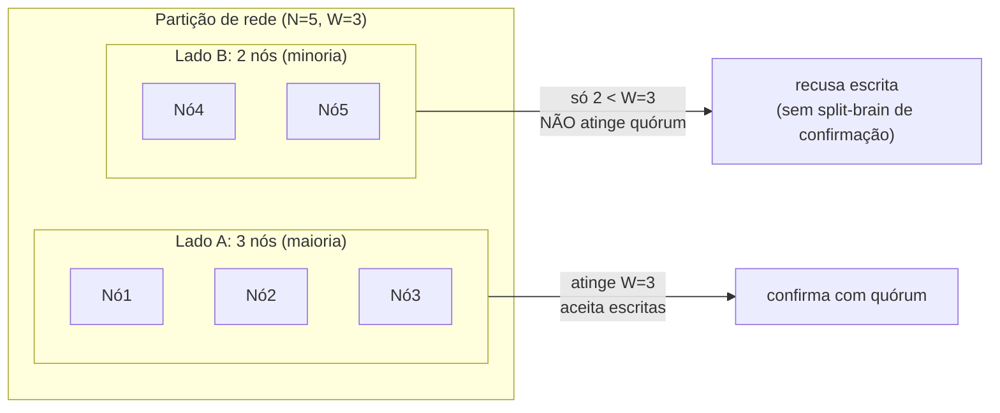

# Quorum Reads/Writes (N, R, W): a regra R + W > N, Sloppy Quorum, Hinted Handoff e Read Repair

> **Bloco:** Sistemas distribuídos · **Nível:** Avançado · **Tempo de leitura:** ~30 min

## TL;DR

Em armazenamentos replicados sem líder (**leaderless replication** — o modelo do **Dynamo**, **Cassandra**, **Riak**, **DynamoDB**, **Voldemort**), cada dado tem **N réplicas**. Em vez de exigir que *todas* respondam (lento e frágil) ou apenas *uma* (rápido mas inconsistente), o cliente espera a confirmação de um **quórum**: **W** réplicas devem confirmar uma escrita e **R** réplicas devem responder uma leitura. A regra de ouro é **R + W > N**: quando ela vale, os conjuntos de réplicas lidas e escritas **necessariamente se sobrepõem em pelo menos uma réplica**, então toda leitura "enxerga" pelo menos uma cópia da escrita mais recente — uma garantia probabilística de **read-your-writes** que aproxima (mas, atenção, **não garante por si só**) consistência forte. Ajustando R e W você desliza no espectro latência × consistência: `W=N, R=1` favorece leituras; `W=1, R=N` favorece escritas; `R=W=quorum=⌊N/2⌋+1` equilibra e tolera falha de uma minoria de réplicas.

Como quórum estrito ficaria **indisponível** durante partições e falhas (não há W nós "certos" disponíveis), o Dynamo introduziu o **sloppy quorum**: aceita a escrita em N nós *saudáveis quaisquer* (não necessariamente os "donos" do dado), priorizando disponibilidade. O **hinted handoff** é o complemento: o nó substituto guarda a escrita com uma *dica* (hint) de quem era o destinatário original e a reenvia quando ele volta. Já o **read repair** conserta divergências detectadas durante leituras (a réplica defasada recebe a versão mais nova), e a **anti-entropy** (Merkle trees) faz a reconciliação em background.

O ponto que separa o sênior do júnior: **quórum sozinho NÃO dá linearizabilidade**. Sloppy quorum quebra a interseção; escritas concorrentes ainda geram conflitos (resolvidos por **vector clocks** ou, perigosamente, por **last-write-wins** via wall clock); e há janelas de corrida. Quórum **limita** o split-brain (impede que dois lados de uma partição confirmem escritas conflitantes com quórum estrito), mas não o elimina sozinho. Para consistência forte de verdade você precisa de **consenso** (Raft/Paxos — ver etcd), não apenas de quórum probabilístico.

## O problema que resolve

Você tem um dado replicado em N nós para sobreviver a falhas e distribuir carga. Surge imediatamente a pergunta: **ao escrever ou ler, quantas réplicas preciso contatar?** Os dois extremos são ruins:

- **Esperar todas as N réplicas** (a cada escrita e a cada leitura) dá a consistência mais forte possível, mas é **lento** (a latência é a do nó mais lento) e **frágil**: se *qualquer* réplica estiver fora (manutenção, GC pause, partição), a operação falha. Disponibilidade péssima.
- **Esperar apenas uma réplica** é rápido e disponível, mas você pode escrever numa réplica e ler de outra que ainda não recebeu a atualização — **lê dado velho** (stale). Consistência péssima.

O problema, então, é: **como obter um meio-termo sintonizável entre consistência e disponibilidade/latência, sem um líder central que serialize tudo?** Sistemas com líder (single-leader, como PostgreSQL com réplicas, ou Kafka) resolvem isso roteando escritas pelo líder; mas isso cria um ponto de coordenação e um gargalo, e a eleição de novo líder após falha tem custo e janela de indisponibilidade.

A replicação **leaderless** (sem líder) — popularizada pelo paper do **Dynamo** (Amazon, SOSP 2007) — responde com **quóruns**: defina N (fator de replicação), e escolha **W** (quantas réplicas confirmam a escrita antes de retornar sucesso) e **R** (quantas respondem a leitura antes de retornar). A *insight* central é puramente combinatória:

> Se **R + W > N**, então o conjunto de R réplicas lidas e o conjunto de W réplicas escritas **não podem ser disjuntos** — pelo princípio da casa dos pombos, eles compartilham **pelo menos uma** réplica. Essa réplica de interseção tem a escrita mais recente, então a leitura *vê* a escrita.

Isso transforma uma propriedade que parecia exigir coordenação global numa simples desigualdade aritmética sobre quantos nós contatar. A pergunta de arquitetura passa a ser **"que valores de N, R e W equilibram a consistência, a latência e a tolerância a falhas que o meu caso de uso exige?"** — e essa é a *tunable consistency* que a documentação da DataStax descreve para o Cassandra.

Vale fixar a distinção que organiza o assunto: o quórum aqui é um mecanismo **probabilístico/de sobreposição** de réplicas — diferente do quórum de **consenso** (Raft/Paxos), onde a maioria vota numa ordem total de operações. Os dois usam a palavra "quórum" e a aritmética da maioria, mas o leaderless quorum (Dynamo-style) **não ordena** operações concorrentes nem decide um valor único — ele apenas garante sobreposição de leitura/escrita e deixa a reconciliação de conflitos para depois. Confundir os dois é a raiz de quase todo mal-entendido sobre "quórum dá consistência forte".

## O que é (definição aprofundada)

### N, R, W

- **N** — **fator de replicação**: quantas cópias de cada dado existem. Cada chave é mapeada (tipicamente por **consistent hashing**, ver `11-leader-election-sharding-consistent-hashing.md`) a uma lista de N nós, a *preference list* no jargão do Dynamo. N é configuração do *keyspace*/tabela, não da operação.
- **W** — **write quorum**: número de réplicas que precisam **confirmar** (persistir e responder OK) uma escrita antes de o coordenador retornar sucesso ao cliente. As escritas vão para *todas* as N réplicas em paralelo; o coordenador só **espera** por W confirmações.
- **R** — **read quorum**: número de réplicas que precisam **responder** uma leitura antes de o coordenador retornar. O coordenador consulta as réplicas e, das R respostas, escolhe a versão mais recente (via timestamp/version vector) — descartando as defasadas.

R e W são parâmetros **por operação** (ou por *consistency level* no Cassandra), o que dá flexibilidade enorme: a mesma base pode servir uma leitura com `R=1` (rápida, pode ser stale) e outra com `R=QUORUM` (consistente).

### A regra R + W > N e o espectro de configurações

A desigualdade **R + W > N** é a condição de **interseção de quórum**. Geometricamente: você está escolhendo W réplicas de N para escrever e R réplicas de N para ler; para garantir que os conjuntos sempre compartilhem ao menos um elemento, a soma dos tamanhos precisa exceder N.

Configurações típicas com **N = 3**:

| Config | R | W | R+W>N? | Caracterização | Tolera |
|---|---|---|---|---|---|
| Leitura forte, escrita lenta | 1 | 3 | sim (4>3) | toda escrita em todas as réplicas; leitura barata | 0 réplicas fora na escrita |
| Escrita forte, leitura lenta | 3 | 1 | sim (4>3) | escrita rápida; leitura precisa de todas | 0 réplicas fora na leitura |
| **Quórum balanceado** | 2 | 2 | sim (4>3) | `QUORUM` no Cassandra; interseção garantida | **1 réplica** fora em cada operação |
| Eventual (rápido) | 1 | 1 | **não** (2<3) | máxima disponibilidade/latência; pode ler stale | 2 réplicas fora |

O ponto de equilíbrio canônico é o **quórum de maioria**: `R = W = ⌊N/2⌋ + 1`. Com N=3, isso dá R=W=2; com N=5, R=W=3. Aí `R + W = N + 1 > N` (interseção garantida) e o sistema tolera a falha de uma **minoria** de réplicas (`N - quorum` = ⌊(N-1)/2⌋): 1 nó com N=3, 2 nós com N=5. É a configuração que a documentação da DataStax chama de `QUORUM` e que oferece o melhor trade-off para a maioria dos casos.

Detalhe importante: **R + W > N não exige que R e W sejam maiorias individualmente**. `N=3, W=3, R=1` satisfaz a regra (4>3) sem que R seja maioria — toda escrita vai a todas as réplicas, então qualquer leitura única já vê o dado. O que a regra exige é apenas a *sobreposição*; como distribuir o "peso" entre leitura e escrita é decisão de workload (sistemas read-heavy preferem R baixo/W alto).

### Por que isso só aproxima — e não garante — consistência forte

A interseção garante que, **na ausência de concorrência e de sloppy quorum**, uma leitura com `R+W>N` enxerga a escrita confirmada mais recente. Mas há buracos conhecidos (Kleppmann, *Designing Data-Intensive Applications*, cap. 5, "Limitations of Quorum Consistency"):

1. **Sloppy quorum quebra a interseção**: se a escrita foi para nós substitutos (fora da preference list) e a leitura consulta os nós originais, os conjuntos podem não se sobrepor — leitura stale mesmo com R+W>N.
2. **Escritas concorrentes** sem ordem total: duas escritas simultâneas na mesma chave precisam ser reconciliadas. O quórum não decide qual "vence"; isso fica para LWW (last-write-wins, perigoso — ver anti-padrões) ou version vectors.
3. **Escrita parcialmente bem-sucedida**: se a escrita confirmou em menos de W nós mas mesmo assim foi aplicada em alguns, leituras subsequentes podem ou não vê-la, sem rollback.
4. **Corridas leitura-escrita**: uma leitura concorrente com uma escrita pode ver o estado antigo ou novo, dependendo do timing nas réplicas.

Por isso o resumo correto é: quórum dá uma forma **probabilística e melhor-esforço** de consistência (frequentemente "consistência forte se nada der errado"), adequada a sistemas **AP/eventualmente consistentes**, mas **não é linearizabilidade**. Para linearizabilidade você precisa de consenso por cima (Raft/Paxos), como faz o **etcd**.

### Sloppy quorum e hinted handoff

Quórum **estrito** (strict quorum) exige que as W/R réplicas sejam exatamente as **N donas** do dado (as primeiras N da preference list). Problema: durante uma partição ou falha, pode não haver W donas disponíveis — a operação **falha**, sacrificando disponibilidade. Para um sistema cujo objetivo é estar *sempre* disponível para escrita (o carrinho da Amazon), isso é inaceitável.

O **sloppy quorum** (Dynamo) relaxa: a escrita vai para as **primeiras N nós saudáveis** encontrados ao caminhar o anel de consistent hashing — que podem **não** ser os donos originais. Assim, mesmo com vários donos fora, a escrita encontra N nós vivos e é aceita (W confirmações de *quaisquer* N saudáveis). Isso aumenta drasticamente a disponibilidade de escrita, ao custo da garantia de interseção (uma leitura pode não tocar o nó substituto).

O **hinted handoff** completa o mecanismo: quando um nó aceita uma escrita que *não* era para ele (porque o dono estava fora), ele guarda essa escrita com uma **dica (hint)** nos metadados — "isto pertence ao nó X". Quando o nó X volta, o substituto **reenvia** (handoff) a escrita acumulada e descarta sua cópia temporária. É a forma de o sistema "se acertar" depois que a falha passa, garantindo durabilidade do que foi escrito durante a janela de indisponibilidade.

### Read repair e anti-entropy

Como réplicas divergem (escritas que não chegaram a todas, hints pendentes, partições), são necessários mecanismos de **reconciliação**:

- **Read repair (reparo na leitura)**: durante uma leitura com `R > 1`, o coordenador compara as versões retornadas pelas réplicas. Se detecta que uma réplica tem versão **defasada**, escreve a versão mais recente de volta nela — *consertando na hora da leitura*. Na documentação da DataStax: o coordenador manda uma requisição de dados a uma réplica e *digest requests* (hashes) às demais; ao comparar, escreve a versão mais nova em qualquer réplica defasada, no **foreground** (antes de responder) quando o CL é maior que ONE. É um reparo **oportunista**: dados muito lidos ficam consistentes rápido; dados raramente lidos podem ficar divergentes por muito tempo.
- **Anti-entropy (entropia reversa) em background**: para consertar dados que *não* são lidos, processos de fundo comparam réplicas inteiras e sincronizam diferenças. Para fazer isso eficientemente (sem transferir tudo), usam-se **Merkle trees** (árvores de hash): compara-se a raiz; se difere, desce-se recursivamente só nos ramos divergentes, transferindo apenas os dados que realmente divergem. O Dynamo e o Cassandra (`nodetool repair`) usam essa técnica.

A combinação **hinted handoff + read repair + anti-entropy** é o que faz um sistema eventualmente consistente *convergir*: hints cobrem falhas curtas, read repair conserta o que é lido, anti-entropy varre o resto.

### Como o quórum limita (mas não elimina) o split-brain

**Split-brain** é a situação em que uma partição de rede divide o cluster em dois (ou mais) grupos que, sem se enxergarem, ambos acham que podem operar — potencialmente aceitando escritas conflitantes que depois não se reconciliam de forma limpa.

Quórum **estrito de maioria** ajuda a conter isso porque **no máximo um lado de uma partição pode formar maioria**. Se N=5 e a rede racha em grupos de 3 e 2, só o grupo de 3 atinge quórum (W=3); o grupo de 2 **não consegue confirmar escritas** com quórum e fica indisponível para escrita. Resultado: não há dois lados confirmando escritas conflitantes *com quórum* ao mesmo tempo — o split-brain de escrita é **prevenido**. Isso é exatamente o que sistemas de consenso (etcd/Raft) exploram: a maioria é única, então só um líder legítimo existe por *term*.

Mas — e aqui está a nuance sênior — isso vale para **quórum estrito**. Com **sloppy quorum**, os dois lados podem aceitar escritas (em nós substitutos) e você *recria* o risco de divergência, que depois precisa ser reconciliada (vector clocks/LWW). Ou seja: o sloppy quorum **troca prevenção de split-brain por disponibilidade**. Além disso, quórum (mesmo estrito) num sistema leaderless não dá *ordem total* — ele impede a divergência por maioria, mas não serializa escritas concorrentes dentro do lado majoritário. Por isso a frase a fixar é: **quórum estrito de maioria previne split-brain de confirmação; quórum não substitui consenso para ordenação forte; sloppy quorum reintroduz divergência conscientemente.**

### Glossário rápido

- **N (replication factor):** número de réplicas de cada dado.
- **W (write quorum):** réplicas que confirmam uma escrita antes do sucesso.
- **R (read quorum):** réplicas que respondem uma leitura antes do retorno.
- **R + W > N:** condição de interseção de quórum (leitura vê a escrita mais recente).
- **Preference list:** os N nós donos de uma chave no anel de hashing.
- **Strict quorum:** quórum sobre os N nós donos (falha se indisponíveis).
- **Sloppy quorum:** quórum sobre N nós saudáveis quaisquer (prioriza disponibilidade).
- **Hinted handoff:** escrita guardada num substituto com dica, reenviada ao dono ao voltar.
- **Read repair:** conserto de réplicas defasadas detectado durante a leitura.
- **Anti-entropy:** reconciliação em background (Merkle trees) de réplicas divergentes.
- **Tunable consistency:** ajustar R/W por operação para deslizar consistência × latência.
- **Split-brain:** partição em que dois lados operam independentemente, arriscando divergência.

## Como funciona

Considere **N = 3** (réplicas Nó1, Nó2, Nó3 para a chave `saldo:cliente42`) e o quórum balanceado **W = 2, R = 2** (`R+W = 4 > 3`). Um nó qualquer atua como **coordenador** da requisição (no Dynamo, qualquer nó pode coordenar; no Cassandra, o coordenador é o nó que recebeu a requisição do driver).

**Escrita (W=2):**

1. O coordenador envia a escrita (com um timestamp/versão) **às três réplicas em paralelo**.
2. Espera **2 confirmações** (W=2). Assim que a segunda chega, retorna **sucesso** ao cliente — sem esperar a terceira.
3. A terceira réplica recebe a escrita de qualquer forma (assincronamente); se estava fora, o mecanismo de hinted handoff/read repair/anti-entropy a atualizará depois.

**Leitura (R=2):**

1. O coordenador consulta as réplicas e espera **2 respostas** (R=2).
2. Compara as versões das 2 respostas (timestamp ou version vector) e retorna a **mais recente** ao cliente.
3. Se as versões divergem, dispara **read repair**: escreve a versão mais nova de volta na réplica defasada.

**Por que isso "vê" a escrita?** A escrita confirmou em pelo menos 2 das 3 réplicas; a leitura consultou 2 das 3. Dois subconjuntos de tamanho 2 num universo de 3 **necessariamente compartilham** ≥ 1 réplica (2+2=4 > 3). Logo, entre as 2 réplicas lidas, **ao menos uma** participou da escrita confirmada e tem a versão nova. O coordenador escolhe a mais recente — e entrega o valor atualizado.

**Tolerância a falha:** com W=2, R=2, N=3, o sistema funciona mesmo com **1 réplica fora**: ainda há 2 vivas para confirmar escrita e 2 para responder leitura. Se 2 caem, escritas e leitas com quórum falham (só resta 1) — a menos que sloppy quorum esteja ativo, caso em que a escrita vai para um nó substituto saudável e segue disponível (perdendo a garantia estrita).

**Reconciliação após partição:** durante uma partição, hinted handoff guarda escritas para nós inalcançáveis. Quando a rede volta, os hints são reenviados; leituras subsequentes disparam read repair; e a anti-entropy em background (Merkle trees) varre e sincroniza o que sobrou. Se houve escritas concorrentes na mesma chave em lados diferentes, version vectors detectam o conflito (siblings) e a aplicação/CRDT reconcilia (ver `05-vector-clocks-e-lamport-timestamps.md` e `06-crdts.md`).

## Diagrama de fluxo

Primeiro diagrama: a interseção de quórum com N=3, W=2, R=2 — a réplica compartilhada que garante a leitura ver a escrita. Segundo: o fluxo de uma escrita/leitura com quórum e read repair. Terceiro: split-brain contido por quórum de maioria.







## Exemplo prático / caso real

**Cenário: leitura consistente de saldo numa carteira digital (fintech brasileira) sobre Cassandra.**

A carteira guarda o saldo dos clientes num cluster **Cassandra** com **N=3** por data center. O time precisa decidir os *consistency levels* de duas operações muito diferentes:

- **Consultar saldo na tela inicial do app** (milhões de vezes/dia, tolera leve atraso): `CL=ONE` (R=1). Rápido e baratíssimo, mas pode mostrar um saldo alguns segundos defasado se a réplica consultada ainda não recebeu a última transação. Aceitável para *exibição*.
- **Validar saldo antes de autorizar um PIX** (precisa da verdade): `CL=QUORUM` na escrita do débito **e** na leitura de validação. Com `W=QUORUM=2` e `R=QUORUM=2` sobre N=3, vale `R+W=4 > 3`: a leitura de validação **enxerga** o débito mais recente confirmado, evitando autorizar um PIX sobre saldo já gasto (double-spend por leitura stale). Esse é o uso clássico de "ler com quórum o que se escreveu com quórum" para obter read-your-writes na operação crítica.

A escolha é **por operação**, não global — exatamente a *tunable consistency* da DataStax. Exibição usa ONE (disponibilidade/latência); decisão financeira usa QUORUM (consistência). Se a fintech quisesse consistência *forte de verdade* (linearizável) no débito, quórum não bastaria — precisaria de transações com isolamento sério (Cassandra LWT/Paxos leve, ou um banco com consenso). O quórum dá "forte o suficiente se nada concorrer", não linearizabilidade.

**Disponibilidade durante manutenção.** Numa janela de upgrade, o Nó3 da preference list de muitas chaves fica fora por 20 minutos. Com `QUORUM` (W=2) e N=3, escritas e leituras **continuam funcionando** com os Nós 1 e 2 — a falha de uma réplica é tolerada. As escritas que "seriam" do Nó3 são guardadas via **hinted handoff** nos nós que as receberam; quando o Nó3 volta, recebe os hints e se atualiza, e read repairs/anti-entropy completam a convergência. Sem quórum tolerante (ex.: exigindo ALL/N), a manutenção de um único nó derrubaria as operações — ilustrando por que `QUORUM` é o default sensato.

**Sloppy quorum num pico.** Numa partição de rede entre racks na Black Friday, vários donos de certas chaves ficam inalcançáveis pelo coordenador. Com **sloppy quorum** habilitado (estilo Dynamo/DynamoDB), as escritas de carrinho seguem sendo aceitas em nós saudáveis substitutos — o carrinho nunca recusa um "adicionar item". O preço: durante a janela, a garantia de interseção R+W>N **não vale** (leituras podem não tocar os substitutos), e escritas concorrentes em lados diferentes geram **siblings** reconciliados depois por version vectors (no DynamoDB/Riak) ou — se mal configurado — perdidos por LWW. Disponibilidade comprada com consistência, conscientemente.

**Contraponto com consenso (etcd).** A mesma fintech usa **etcd** para guardar configuração de *feature flags* e *locks* distribuídos. Aqui *não* se usa quórum probabilístico estilo Dynamo: o etcd usa **Raft**, onde uma escrita só é confirmada após a **maioria** (quórum de `⌊n/2⌋+1`) persistir a entrada no log replicado, e leituras são **linearizáveis** (via ReadIndex, confirmando liderança com o quórum) por padrão. A diferença é categórica: etcd ordena as operações via consenso e oferece linearizabilidade; o quórum Dynamo-style oferece sobreposição de réplicas e consistência eventual sintonizável. Escolher um ou outro depende de precisar de *ordenação forte* (etcd) ou de *alta disponibilidade com reconciliação* (Cassandra/Dynamo).

Pseudocódigo do coordenador (leitura com quórum + read repair):

```
def read_quorum(chave, R):
    respostas = enviar_leitura_paralela(replicas(chave))   # data + digests
    coletadas = esperar(respostas, ate=R)                  # espera R respostas
    mais_recente = max(coletadas, key=lambda v: v.versao)  # ts ou version vector
    for r in coletadas:
        if r.versao < mais_recente.versao:
            read_repair(r.replica, mais_recente)           # conserta defasada
    return mais_recente.valor

def write_quorum(chave, valor, W):
    versao = nova_versao()                                 # timestamp / version vector
    acks = enviar_escrita_paralela(replicas(chave), valor, versao)
    esperar(acks, ate=W)                                   # espera W confirmações
    return SUCESSO                                          # demais réplicas: async + hints
```

Sistemas reais: **Amazon Dynamo** (paper de 2007 — origem de sloppy quorum, hinted handoff, read repair, Merkle anti-entropy), **Amazon DynamoDB** (serviço gerenciado; oferece *eventually consistent* e *strongly consistent reads*), **Apache Cassandra** e **ScyllaDB** (consistency levels `ONE/QUORUM/ALL/LOCAL_QUORUM/EACH_QUORUM`, tunable per-query, read repair), **Riak** (N/R/W configuráveis, dotted version vectors), **Voldemort** (clone open-source do Dynamo). No campo de consenso (quórum de maioria com ordenação): **etcd**, **Consul**, **ZooKeeper** — quórum aqui significa Raft/Zab, não Dynamo-style.

## Quando usar / Quando evitar

**Use quóruns leaderless (Dynamo-style) quando:**

- Você precisa de **alta disponibilidade de escrita e leitura** e tolerância a falhas de réplicas/partições, aceitando **consistência eventual** com reconciliação (carrinhos, feeds, sessões, métricas, catálogos, contadores aproximados).
- O workload se beneficia de **tunable consistency**: poder escolher ONE para leituras baratas e QUORUM para as críticas, por operação.
- A carga é alta e distribuída geograficamente, e um líder único seria gargalo ou ponto de falha.

**Use quórum balanceado (R=W=maioria) quando:** quer o melhor trade-off geral — read-your-writes provável e tolerância à falha de uma minoria de réplicas. É o default sensato (`QUORUM`/`LOCAL_QUORUM`).

**Ajuste R/W assimétrico quando:** o workload é claramente read-heavy (`W` alto, `R` baixo, ex.: W=3,R=1 com N=3 — leituras baratíssimas, escritas caras) ou write-heavy (o inverso). Lembre de manter R+W>N se quiser a interseção.

**Evite / não confie só em quórum quando:**

- Você precisa de **consistência forte/linearizável** (saldos com garantia transacional, locks, sequências únicas, eleição de líder). Quórum probabilístico **não** dá isso — use **consenso** (etcd/ZooKeeper/Raft) ou transações sérias.
- Você liga **sloppy quorum** e ainda assume que R+W>N garante leitura fresca — não garante; sloppy quebra a interseção.
- O conflito de escritas concorrentes não pode ser reconciliado de forma segura e você caiu no **LWW por wall clock** (perda silenciosa — ver anti-padrões).

## Anti-padrões e armadilhas comuns

- **Achar que "R+W>N" = consistência forte/linearizável.** É a confusão número um. A regra dá apenas *sobreposição de réplicas* na ausência de concorrência e de sloppy quorum. Há corridas leitura-escrita, escritas concorrentes não-ordenadas e o efeito do sloppy quorum. Kleppmann lista explicitamente essas limitações. Para linearizabilidade, use consenso.
- **Last-write-wins (LWW) por wall clock para resolver conflitos.** Cassandra resolve conflitos por *write timestamp* (LWW). Se dois nós têm **clock skew** (relógios divergentes), a escrita "vencedora" é a do relógio mais adiantado — **não** a temporalmente posterior. Resultado: **perda de dados silenciosa**. É o anti-padrão clássico (ver `13-relogios-fisicos-clock-skew-ntp-truetime.md`); prefira detecção de conflito por version vectors (Dynamo/Riak) ou CRDTs.
- **Ligar sloppy quorum e continuar raciocinando como quórum estrito.** Sloppy quorum prioriza disponibilidade *quebrando* a interseção; leituras podem não tocar os nós substitutos. Documente que, sob falha, o sistema dá consistência ainda mais fraca — não a garantia R+W>N.
- **`R+W ≤ N` sem perceber.** Configurar R=1, W=1 com N=3 (comum por "performance") **viola** a interseção: você tem consistência puramente eventual. Tudo bem se intencional, péssimo se você *acha* que tem read-your-writes.
- **Confundir quórum de réplica (Dynamo) com quórum de consenso (Raft/Paxos).** São coisas diferentes que usam a mesma palavra. O primeiro não ordena operações; o segundo sim. Dizer "uso quórum, logo tenho consistência forte" mistura os dois.
- **Esquecer LOCAL_QUORUM em multi-DC.** Em Cassandra multi-região, `QUORUM` puro pode exigir réplicas em DCs remotos (latência cross-region altíssima e acoplamento a outra região). `LOCAL_QUORUM` mantém o quórum dentro do DC local — quase sempre o que se quer para latência e isolamento de falha regional.
- **Não operar a anti-entropy.** Read repair só conserta dados *lidos*; dados raramente lidos divergem indefinidamente sem `nodetool repair`/anti-entropy agendado. Esquecer isso leva a "ressurreição de dados deletados" (tombstones que expiram sem repair) e divergência silenciosa.
- **Hinted handoff como garantia de durabilidade.** Hints têm TTL e capacidade limitada; se o nó fica fora além do prazo (ou o nó que guarda o hint cai), o hint é descartado. Hinted handoff é *melhor-esforço*, não substitui repair nem quórum suficiente.
- **Quórum não previne split-brain com sloppy quorum.** Quórum *estrito* de maioria previne confirmação conflitante dos dois lados; com sloppy, os dois lados aceitam escritas e você reintroduz divergência. Saiba qual modo está ativo.
- **N par.** Com N par (ex.: N=4), o quórum de maioria é 3, mas você só tolera 1 falha (igual a N=3) e gasta uma réplica a mais — N ímpar dá melhor relação tolerância/custo. Para consenso (Raft) o problema do N par é ainda mais agudo (sem maioria clara em empate).

## Relação com outros conceitos

- **Teorema CAP / PACELC:** o quórum sintonizável é *a* materialização do trade-off CAP — escolher R/W é escolher onde ficar no espectro consistência × disponibilidade, e (em PACELC) consistência × latência mesmo sem partição. Sistemas Dynamo-style são tipicamente **AP/EL**. Ver `01-teorema-cap-e-pacelc.md`.
- **Modelos de consistência:** `R+W>N` aproxima *read-your-writes* e *monotonic reads*, mas **não** dá linearizabilidade; sloppy quorum e LWW empurram para *eventual consistency*. Entender qual garantia real você obtém é o cerne. Ver `02-modelos-de-consistencia.md`.
- **Vector clocks e Lamport timestamps:** quórum *detecta* que precisa reconciliar, mas é o **version vector** que distingue escritas concorrentes (conflito) de causais (uma sucede a outra) — sem isso, sobra o perigoso LWW. Ver `05-vector-clocks-e-lamport-timestamps.md`.
- **Relógios físicos / clock skew:** LWW por *write timestamp* depende de relógios de parede sincronizados; clock skew corrompe a resolução de conflitos. Ver `13-relogios-fisicos-clock-skew-ntp-truetime.md`.
- **Consenso distribuído (Paxos/Raft/2PC):** quórum de *consenso* (maioria que vota e ordena) dá linearizabilidade — diferente do quórum de *réplica*. etcd/ZooKeeper usam consenso; Cassandra LWT usa Paxos leve por cima do quórum. Ver `03-consenso-distribuido-paxos-raft-2pc-3pc.md`.
- **Leader election, sharding e consistent hashing:** a preference list (quais N nós são donos de uma chave) vem do **consistent hashing** sobre o anel; quórum opera sobre essa lista. Ver `11-leader-election-sharding-consistent-hashing.md`.
- **CRDTs:** uma forma de reconciliar siblings detectados sob quórum/sloppy de modo determinístico, sem LWW nem merge manual. Ver `06-crdts.md`.

## Modelo mental para o arquiteto

Três ideias para carregar:

1. **Quórum é aritmética de sobreposição, não mágica de consistência.** `R+W>N` garante que leitura e escrita compartilham uma réplica — e só isso. É poderoso (read-your-writes provável, tolerância a falha de minoria, tunable por operação), mas tem buracos conhecidos (concorrência, sloppy quorum, corridas). "Forte se nada der errado" ≠ linearizável.
2. **Disponibilidade se compra com garantias.** Sloppy quorum e hinted handoff trocam a interseção estrita por escrita-sempre-disponível; LWW troca preservação de dados por simplicidade. Cada relaxamento é uma decisão consciente de quanto de consistência você abre mão por disponibilidade/latência — e precisa ser documentada e monitorada (repair, métricas de divergência).
3. **Quórum de réplica ≠ quórum de consenso.** Se você precisa de *ordenação forte* (locks, sequências, linearizabilidade), o quórum probabilístico do Dynamo não basta — vá para consenso (etcd/Raft). Se precisa de *alta disponibilidade com reconciliação eventual*, o quórum leaderless é a ferramenta certa. Saber em qual regime você está é metade da decisão de arquitetura.

O fio condutor: quórum estrito de maioria **limita** o split-brain (no máximo um lado confirma com quórum) e **aproxima** consistência forte, mas a aproximação é probabilística e quebra sob sloppy quorum e concorrência. Calibre N, R, W com o workload, escolha conscientemente a estratégia de reconciliação (version vectors > LWW), e suba para consenso quando "forte o suficiente" não for suficiente.

## Pontos para fixar (revisão)

- **N** = réplicas; **W** = confirmações de escrita; **R** = respostas de leitura. R/W são por operação (tunable consistency).
- **R + W > N** garante **interseção** — a leitura vê a escrita mais recente *na ausência* de concorrência e de sloppy quorum. Não é linearizabilidade.
- Quórum balanceado **R=W=⌊N/2⌋+1** (ex.: N=3→2; N=5→3) tolera falha de uma **minoria** de réplicas; é o default sensato (`QUORUM`/`LOCAL_QUORUM`).
- **Sloppy quorum**: aceita escrita em N nós saudáveis quaisquer (prioriza disponibilidade, quebra a interseção). **Hinted handoff**: substituto guarda escrita com dica e reenvia ao dono ao voltar.
- **Read repair** conserta réplicas defasadas durante a leitura; **anti-entropy** (Merkle trees) reconcilia em background — ambos necessários para convergência.
- **Quórum estrito de maioria limita split-brain** (só um lado confirma com quórum); **sloppy quorum reintroduz divergência**; quórum **não substitui consenso** para ordenação forte.
- Anti-padrão crítico: **LWW por wall clock** sob clock skew → perda silenciosa. Prefira version vectors/CRDTs.
- **Quórum de réplica (Dynamo) ≠ quórum de consenso (Raft/etcd):** o segundo ordena operações e dá linearizabilidade; o primeiro, não.

## Referências

- [Dynamo: Amazon's Highly Available Key-value Store (SOSP 2007, PDF) — seções 4.5 (sloppy quorum, hinted handoff) e 4.7 (read repair, Merkle anti-entropy)](https://www.allthingsdistributed.com/files/amazon-dynamo-sosp2007.pdf)
- [Amazon's Dynamo — All Things Distributed (Werner Vogels)](https://www.allthingsdistributed.com/2007/10/amazons_dynamo.html)
- [How is the consistency level configured? — Apache Cassandra / DataStax Docs (QUORUM, R+W>N)](https://docs.datastax.com/en/cassandra-oss/3.0/cassandra/dml/dmlConfigConsistency.html)
- [How are consistent read and write operations handled? — DataStax (tunable consistency)](https://docs.datastax.com/en/cassandra-oss/3.0/cassandra/dml/dmlAboutDataConsistency.html)
- [Read repair: repair during read path — Apache Cassandra / DataStax Docs](https://docs.datastax.com/en/cassandra-oss/3.0/cassandra/operations/opsRepairNodesReadRepair.html)
- [etcd API guarantees — linearizable reads e quórum (Raft)](https://etcd.io/docs/v3.5/learning/api_guarantees/)
- [Consistency models — Jepsen (linearizable, sequential, causal)](https://jepsen.io/consistency)
- [Strong consistency models — Aphyr (Kyle Kingsbury)](https://aphyr.com/posts/313-strong-consistency-models)
- [Designing Data-Intensive Applications — Martin Kleppmann (O'Reilly), cap. 5 (Quorums for reading and writing; Limitations of quorum consistency)](https://www.oreilly.com/library/view/designing-data-intensive-applications/9781491903063/)
