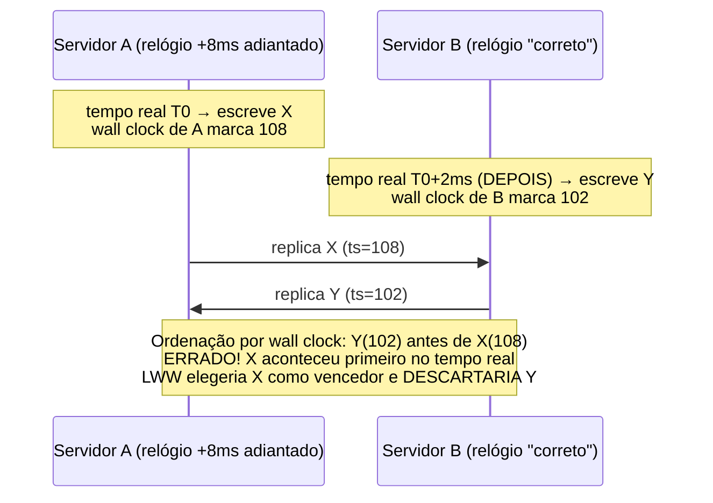
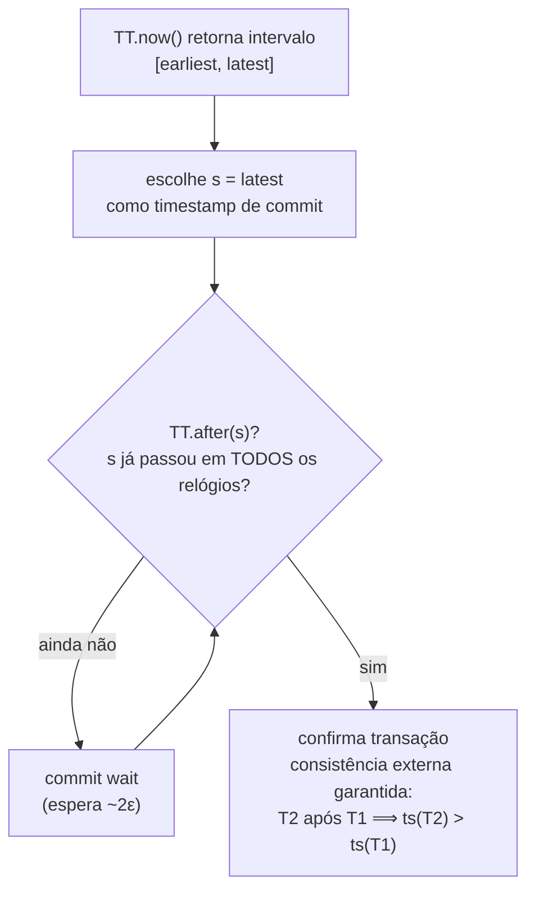
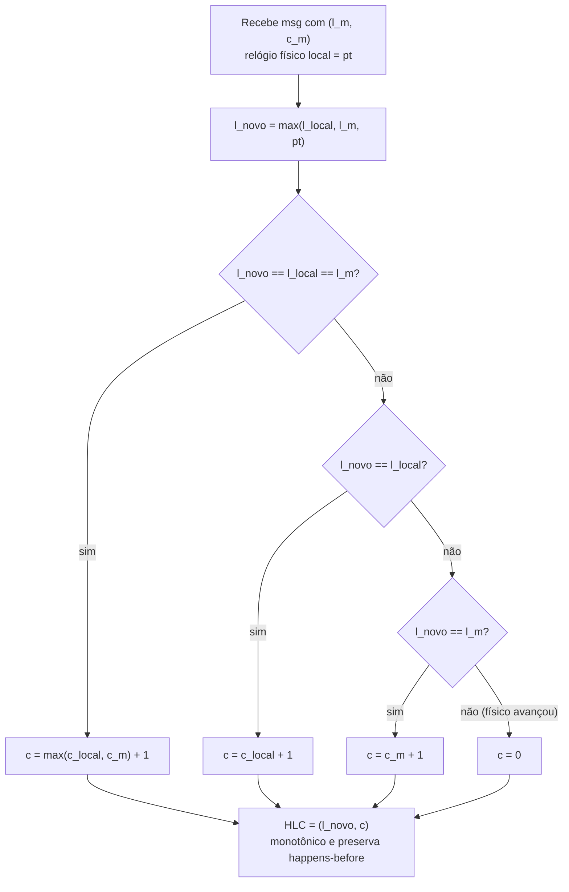

# Relógios Físicos: Clock Skew/Drift, NTP, PTP, TrueTime (Spanner) e Hybrid Logical Clocks

> **Bloco:** Sistemas distribuídos · **Nível:** Avançado · **Tempo de leitura:** ~30 min

## TL;DR

Cada máquina num sistema distribuído tem seu próprio **relógio físico** (wall clock), baseado num oscilador de cristal de quartzo imperfeito. Dois problemas estruturais surgem: **clock drift** (o relógio anda mais rápido ou mais devagar que o tempo real, porque o cristal não é perfeito — tipicamente dezenas de ppm) e **clock skew** (a diferença *instantânea* entre os relógios de duas máquinas num dado momento). A consequência prática é dura: **você não pode confiar em timestamps de wall clock para ordenar eventos entre máquinas** — dois eventos com timestamps `t1 < t2` podem, na realidade física, ter acontecido na ordem inversa, porque os relógios divergem. Pior, a sincronização por **NTP** pode fazer o relógio **andar para trás** (saltos), violando monotonicidade.

**NTP** (Network Time Protocol) sincroniza relógios pela rede com precisão de milissegundos (na internet) a sub-milissegundo (LAN), mas tem incerteza inerente (latência de rede assimétrica). **PTP** (Precision Time Protocol, IEEE 1588) atinge sub-microssegundo a nanossegundo com suporte de hardware, em redes controladas. Mesmo assim, *nenhum* protocolo elimina a incerteza — só a reduz.

O **Google TrueTime** (Spanner, OSDI 2012) faz a jogada conceitual decisiva: em vez de fingir que o relógio é exato, **reifica a incerteza** numa API que retorna um **intervalo** `[earliest, latest]` garantindo que o tempo real está dentro dele (com GPS + relógios atômicos limitando a janela a poucos ms). Spanner então **espera a incerteza passar** (*commit wait*) antes de confirmar uma transação, obtendo **consistência externa** (linearizabilidade global) — paga em latência. Quem não tem hardware de relógio atômico usa **Hybrid Logical Clocks (HLC)**: combinam um componente físico (próximo ao wall clock, legível, bom para TTLs) com um componente lógico (preserva *happens-before*, à la Lamport) em tamanho O(1). É a ponte entre relógios físicos e lógicos, usada por **CockroachDB**, **MongoDB** e **YugabyteDB**, e funciona com NTP comum (drift máximo conhecido), sem hardware especial.

## O problema que resolve

A intuição cotidiana de "que horas são?" pressupõe um tempo absoluto e universal. Em sistemas distribuídos, essa pressuposição **não existe**. Cada nó tem um relógio físico independente, e esses relógios divergem por razões físicas e de protocolo:

- **Clock drift (deriva):** o relógio de hardware é um contador alimentado por um oscilador de cristal de quartzo. Cristais não oscilam exatamente na frequência nominal — variam com temperatura, idade e fabricação. A deriva típica é de **dezenas de partes por milhão (ppm)**; a algumas dezenas de ppm, um relógio pode acumular **milissegundos de erro por segundo** de funcionamento, ou seja, segundos de erro por dia se não corrigido.
- **Clock skew (defasagem):** num instante qualquer, a diferença entre os relógios de duas máquinas. É a manifestação do drift acumulado entre sincronizações. Mesmo com NTP, há sempre skew residual (a sincronização não é perfeita nem instantânea).
- **Saltos de correção:** quando o NTP corrige um relógio que estava adiantado, ele pode **recuá-lo** — o relógio "anda para trás". Código que assume tempo monotônico (`agora2 >= agora1` sempre) quebra: durações negativas, timeouts que nunca disparam, ordenações invertidas.

A consequência central que precisa ficar gravada: **timestamps de wall clock de máquinas diferentes não são comparáveis de forma confiável para ordenar eventos.** Se o serviço A registra um evento com `timestamp=100ms` e o serviço B registra outro com `timestamp=95ms`, você **não** pode concluir que o evento de B aconteceu antes — o relógio de B pode estar 10ms adiantado, e o evento de A pode ter acontecido fisicamente antes. Essa é a fonte de uma classe inteira de bugs distribuídos, sendo o mais notório o **last-write-wins (LWW) por timestamp**: dois nós com clock skew gravam versões do mesmo dado, e a "última escrita" eleita é a do relógio mais adiantado — **não** a temporalmente posterior. Resultado: **perda de dados silenciosa**.

A pergunta de arquitetura, portanto, é: **"como obter alguma noção utilizável de tempo/ordem entre máquinas, sabendo que os relógios físicos mentem?"** Há três famílias de resposta, em ordem crescente de sofisticação:

1. **Sincronizar melhor o relógio físico** (NTP, PTP) — reduz o skew, mas nunca o zera; ainda perigoso confiar nele para ordenação fina.
2. **Reificar a incerteza** (TrueTime/Spanner) — assumir que o relógio é um intervalo, não um ponto, e esperar a incerteza passar onde a ordem importa.
3. **Combinar físico com lógico** (HLC) — usar o tempo físico só como "âncora" legível e o componente lógico para garantir *happens-before*, sem depender da precisão do relógio.

Há ainda uma quarta resposta, ortogonal, já tratada em `05-vector-clocks-e-lamport-timestamps.md`: **abandonar o tempo físico para ordenação** e usar **relógios lógicos** puros (Lamport/vector clocks), que capturam causalidade sem qualquer dependência de wall clock. Este documento cobre os relógios *físicos* e as pontes (TrueTime, HLC) entre o físico e o lógico — sem reabrir relógios lógicos puros.

## O que é (definição aprofundada)

### Time-of-day clock vs monotonic clock

Antes dos protocolos, uma distinção que confunde muita gente e está na raiz de bugs (Kleppmann, DDIA cap. 8):

- **Time-of-day clock (relógio de parede):** retorna data/hora "humana" (epoch Unix, UTC). É sincronizado por NTP e **pode saltar para frente ou para trás**. Serve para *exibir* horários e *carimbar* eventos para humanos. **Não** serve para medir durações nem para garantir monotonicidade.
- **Monotonic clock:** um contador que só **avança** (nunca recua), sem relação com o tempo real — só o *delta* entre duas leituras é significativo. É o relógio correto para **medir durações** (latência, timeout, deadline) dentro de uma máquina. Não é comparável entre máquinas (cada uma tem sua origem arbitrária).

Erro comum: usar o time-of-day clock para medir uma duração (`fim - inicio`); se o NTP recuar o relógio no meio, a duração fica **negativa** ou absurda. Use sempre o monotonic clock para durações.

### Clock drift e clock skew, quantificados

- **Drift rate:** quanto o relógio se desvia do tempo real por unidade de tempo. Especificações de cristais comuns ficam na casa de **alguns a dezenas de ppm**. A 20 ppm, são 20 microssegundos de erro por segundo, ~1,7 segundo por dia — daí a necessidade de re-sincronizar periodicamente.
- **Max clock drift (ε):** o limite *máximo* de deriva que você assume entre duas sincronizações. É um parâmetro **crítico** para algoritmos que dependem de relógio (TrueTime e HLC usam um ε ou bound conhecido). Se a realidade excede o ε assumido (ex.: VM congelada por GC/migração, NTP falhando), as garantias quebram — por isso Spanner e CockroachDB *monitoram* a sincronia e **se recusam a operar** (ou matam o nó) se o skew suspeito excede o limite.
- **Clock skew (offset):** a diferença instantânea entre dois relógios. NTP tenta mantê-lo pequeno, mas latência de rede assimétrica (ida ≠ volta) impede zerá-lo.

### NTP (Network Time Protocol)

O **NTP** sincroniza o relógio de uma máquina com servidores de tempo de referência por uma hierarquia de **stratums** (stratum 0 = fonte de referência como GPS/atômico; stratum 1 = servidores diretamente ligados a ela; e assim por diante). O cliente troca pacotes com o servidor, mede o **round-trip time** e estima o offset, ajustando o relógio. Características:

- **Precisão típica:** ~1–2 ms em LAN bem comportada; **dezenas de ms** pela internet pública, dependendo de jitter e assimetria de rota.
- **Limitação fundamental:** NTP assume que a latência de ida e volta é simétrica para estimar o offset; quando não é (rotas assimétricas, congestionamento), o erro cresce. A incerteza **não pode ser eliminada**, só estimada.
- **Correção suave vs salto:** o NTP pode **escorregar** (*slew*) o relógio (acelerar/desacelerar gradualmente, preservando monotonicidade) ou **saltar** (*step*) quando o erro é grande — e o salto pode ser para trás. Há também o problema do **leap second**, que historicamente causou incidentes (alguns operadores hoje usam *leap smearing* para evitar saltos).

### PTP (Precision Time Protocol, IEEE 1588)

O **PTP** atinge precisão muito maior que o NTP — **sub-microssegundo a dezenas/centenas de nanossegundos** — mas exige **suporte de hardware** (placas de rede com timestamping em hardware, *boundary clocks*/*transparent clocks* nos switches) e uma rede controlada (data center, redes industriais, telecom, finanças de baixa latência). Onde NTP entrega ~1 ms, PTP com boundary/transparent clocks entrega ~20–100 ns. O custo é a infraestrutura especializada; por isso PTP é comum em ambientes que *exigem* sincronização fina (trading, telecom, medição industrial) e raro na nuvem genérica — embora provedores de nuvem venham oferecendo serviços de tempo de alta precisão baseados em PTP.

### Por que ordenar por wall clock é perigoso

Juntando as peças: como os relógios têm skew residual (mesmo com NTP/PTP) e podem saltar, **comparar timestamps de wall clock de máquinas diferentes para decidir "o que aconteceu primeiro" é incorreto**. Em particular:

- A ordem por timestamp pode **contradizer a causalidade real** (um efeito com timestamp menor que sua causa).
- **LWW por wall clock perde dados**: a versão "vencedora" é a do relógio mais adiantado, não a temporalmente posterior.
- Janelas de validade/TTL baseadas em wall clock podem expirar cedo ou tarde sob skew.

A solução não é "sincronizar mais" (sempre sobra incerteza), e sim **reificar a incerteza** ou **usar componente lógico** — o que nos leva a TrueTime e HLC.

### Google TrueTime (Spanner)

O **Spanner** (Google, OSDI 2012) parte de uma premissa honesta: o relógio nunca é exato; então a API de tempo deve **expor a incerteza**. A **TrueTime API** não retorna um instante, mas um **intervalo** `TTinterval = [earliest, latest]`, com a garantia de que o tempo absoluto real `t_abs` está dentro do intervalo. A largura do intervalo (`2ε`) é a incerteza corrente, mantida pequena (tipicamente poucos milissegundos) por uma infraestrutura de **relógios GPS e atômicos** distribuídos por data center, que limitam o drift entre sincronizações.

A operação-chave é `TT.after(t)` / `TT.before(t)`: saber com certeza que um instante já passou (ou ainda não chegou) — possível justamente porque o intervalo é limitado.

Com isso, Spanner implementa **consistência externa** (equivalente a linearizabilidade para transações) via **commit wait**: ao confirmar uma transação, o coordenador escolhe um timestamp de commit `s = TT.now().latest` e **espera explicitamente** até ter certeza de que `s` já passou em *todos* os relógios (`TT.after(s)` verdadeiro), ou seja, espera ~`2ε`. Essa espera garante que, se a transação T2 começa depois que T1 confirmou (no tempo real), então `timestamp(T2) > timestamp(T1)` — a ordem dos timestamps **nunca** contradiz a ordem real. O preço é **latência**: cada commit paga uma espera proporcional à incerteza do relógio. Quanto menor o ε (melhor o hardware/sincronização), menor a espera. TrueTime transforma incerteza de relógio em latência controlada — uma troca explícita e correta.

### Hybrid Logical Clocks (HLC)

Nem todo mundo tem GPS e relógios atômicos em cada data center. As **Hybrid Logical Clocks** (Kulkarni, Demirbas et al., 2014 — *Logical Physical Clocks and Consistent Snapshots in Globally Distributed Databases*) oferecem o melhor dos dois mundos sem hardware especial:

Um timestamp HLC tem **dois componentes**:

- **`l` (físico):** uma leitura do relógio físico (wall clock), mantida próxima ao tempo real — dá legibilidade e permite comparar grosseiramente com o tempo de parede (útil para TTLs, debugging, snapshots aproximados).
- **`c` (lógico):** um contador que **desempata** e **preserva happens-before** quando o componente físico não avança o suficiente (à la Lamport).

As regras (simplificadas) garantem que: (1) HLC nunca recua (monotônico); (2) se A *happens-before* B então `HLC(A) < HLC(B)` (preserva causalidade, como Lamport); (3) `l` permanece próximo do wall clock (a diferença é limitada pelo skew máximo). Tudo em **O(1) por evento** (dois inteiros), sem o custo O(N) dos vector clocks e sem o hardware do TrueTime.

A regra de atualização ao **receber** uma mensagem com timestamp `(l_m, c_m)`, sendo `pt` o relógio físico local:

```
l_novo = max(l_local, l_m, pt)
se l_novo == l_local == l_m:  c = max(c_local, c_m) + 1
senão se l_novo == l_local:   c = c_local + 1
senão se l_novo == l_m:       c = c_m + 1
senão:                        c = 0          # o físico avançou: reseta lógico
(l_local, c_local) = (l_novo, c)
```

O insight: quando o relógio físico anda normalmente, `c` fica em 0 e o HLC é essencialmente o wall clock; quando eventos acontecem "mais rápido que a resolução do relógio" ou chega uma mensagem de um nó adiantado, `c` incrementa para preservar a ordem causal sem depender da precisão física. HLC depende apenas de um **drift máximo conhecido** (NTP comum basta), não de relógios atômicos — por isso é o sweet spot moderno para bancos multi-região em hardware commodity.

### Glossário rápido

- **Wall clock / time-of-day clock:** relógio "humano" (UTC/epoch); pode saltar (inclusive para trás). Bom para exibir; ruim para durações e ordenação entre máquinas.
- **Monotonic clock:** contador que só avança; correto para medir durações dentro de uma máquina.
- **Clock drift:** taxa de desvio do relógio em relação ao tempo real (ppm).
- **Clock skew (offset):** diferença instantânea entre dois relógios.
- **NTP:** protocolo de sincronização por rede; precisão ms; incerteza inerente.
- **PTP (IEEE 1588):** sincronização sub-µs/ns com suporte de hardware em redes controladas.
- **TrueTime:** API do Spanner que expõe o tempo como intervalo `[earliest, latest]` com incerteza limitada por GPS+atômicos.
- **Commit wait:** espera proporcional à incerteza para garantir consistência externa no Spanner.
- **Consistência externa:** linearizabilidade no nível de transações (ordem dos timestamps respeita a ordem real).
- **HLC (Hybrid Logical Clock):** timestamp (físico, lógico) O(1) que preserva happens-before e fica próximo do wall clock.
- **Happens-before (→):** relação de causalidade de Lamport (ver `05-...`).
- **Max drift (ε):** limite assumido de deriva entre sincronizações; se violado, garantias quebram.

## Como funciona

**Clock skew causando ordem errada.** Dois servidores A e B com NTP, mas com skew residual: o relógio de B está **8 ms adiantado** em relação a A. O cliente faz uma escrita em A (relógio de A marca `t=100`) e, **logo depois** (no tempo real), uma escrita relacionada em B (relógio de B marca `t=105`, mas o tempo real correspondente seria `t≈97` no relógio "verdadeiro"). Se um terceiro sistema ordenar os dois eventos por timestamp, dirá "A (100) antes de B (105)" — coincidentemente certo aqui. Mas inverta o skew: se A estivesse 8 ms adiantado, a escrita posterior em B teria timestamp *menor* que a anterior em A, e a ordenação por timestamp inverteria a causalidade. Como você **não sabe** o skew em tempo de comparação, **não pode confiar** na ordem por timestamp entre máquinas. É exatamente esse cenário que arruína o LWW por wall clock.

**TrueTime evitando a inversão (commit wait).** Spanner confirma a transação T1 escolhendo `s1 = TT.now().latest`. Antes de tornar T1 visível, **espera** até `TT.after(s1)` ser verdadeiro — isto é, até ter certeza de que `s1` já passou em todos os relógios (espera ~`2ε`). Quando T2 começa *depois* que T1 ficou visível, `TT.now()` de T2 já está garantidamente além de `s1`, então `s2 > s1`. A ordem dos timestamps **nunca** contradiz a ordem real de commits. A incerteza do relógio virou **latência de commit** — paga-se ε de espera por consistência externa.

**HLC preservando happens-before sem hardware.** Nó A (wall clock 100) gera um evento: HLC = `(100, 0)`. Envia mensagem a B, que tem wall clock atrasado em 100 (marca 90). Ao receber `(100,0)`, B calcula `l_novo = max(90_local, 100_m, 90_pt) = 100`; como `l_novo == l_m` mas `≠ l_local`, faz `c = c_m + 1 = 1` → HLC de B = `(100, 1)`. Note: o relógio físico de B estava *atrasado* (90), mas o HLC dele "pulou" para `(100,1)`, **maior** que `(100,0)` de A — preservando `A → B` apesar do skew. Quando o relógio físico de B finalmente ultrapassa 100, o componente lógico volta a 0. O happens-before é mantido **sem** confiar na precisão do wall clock e em O(1).

## Diagrama de fluxo

Primeiro: linha do tempo mostrando clock skew causando ordenação errada por wall clock. Segundo: TrueTime como intervalo e o commit wait. Terceiro: regra de atualização do HLC ao receber mensagem.







## Exemplo prático / caso real

**Cenário: ordenar transações de uma carteira digital multi-região (fintech brasileira).**

A fintech replica dados entre data centers em São Paulo e em outra região. Cada transação precisa de uma **ordem total consistente** para auditoria e para resolver "qual operação veio antes". A tentação inicial é carimbar cada transação com o `System.currentTimeMillis()` (wall clock) do nó que a processou e ordenar por isso. **Armadilha:** os relógios de SP e da outra região têm skew de alguns ms (NTP comum); duas transações quase simultâneas podem ser ordenadas ao contrário da realidade, e se houver resolução de conflito por **LWW**, uma transação legítima pode ser **silenciosamente descartada** porque o relógio do outro nó estava adiantado. Em domínio financeiro, isso é inaceitável.

**Solução A — HLC (caminho CockroachDB/commodity).** Migrar para um banco que usa **Hybrid Logical Clocks**, como o **CockroachDB**. Cada nó mantém um HLC `(físico, lógico)`; toda escrita e toda mensagem entre nós atualiza o HLC pela regra do `max`. O resultado: timestamps **monotônicos** e que **preservam happens-before** mesmo com clock skew, e que ainda ficam *próximos* do wall clock (úteis para relatórios e TTLs). O CockroachDB não precisa de GPS nem de relógios atômicos — basta NTP com um **drift máximo conhecido** (ele *monitora* o offset entre nós e, se o skew suspeito ultrapassa o limite configurado, **derruba o nó suspeito** para não violar as garantias). É exatamente o trade-off que a CockroachDB Labs descreve no post "Living without atomic clocks": consistência forte sem o hardware do Spanner, ao custo de janelas de incerteza tratadas com cuidado (ex.: *read restarts* dentro da janela de incerteza).

**Solução B — TrueTime (caminho Spanner/hardware).** Se a fintech rodasse no Google Cloud com **Spanner**, obteria **consistência externa** (linearizabilidade global) via **TrueTime + commit wait**: a infraestrutura de GPS e relógios atômicos mantém a incerteza em poucos ms, e cada commit espera essa incerteza passar. Resultado: a ordem dos timestamps de transação **nunca** contradiz a ordem real — duas transferências em regiões diferentes têm ordem total correta sem coordenação explícita por transação. O custo é a **latência de commit** (a espera ε) e a dependência da infraestrutura proprietária do Google.

**O contraste a fixar:** Spanner *compra* precisão de relógio com hardware (atômico/GPS) e *paga* latência de commit (espera a incerteza passar). CockroachDB *evita* o hardware usando HLC e *trata* a incerteza com monitoramento de skew e reinícios de leitura. Os dois resolvem o mesmo problema de fundo — relógios físicos não são confiáveis para ordenar — por caminhos diferentes. Ambos são infinitamente melhores que "ordenar por `currentTimeMillis()` e torcer".

**Bug clássico evitado.** Antes da migração, um relatório de conciliação acusava transações "fora de ordem" e somas que não fechavam após incidentes de rede. A causa-raiz era LWW por wall clock sob skew: durante uma re-sincronização do NTP, o relógio de um nó **recuou** 30 ms, e escritas subsequentes ganharam timestamps *menores* que escritas anteriores — invertendo a ordem e fazendo o LWW descartar a versão "errada". A lição operacional: **medir durações com monotonic clock**, **ordenar eventos com relógio lógico/HLC** (nunca com wall clock entre máquinas), e **monitorar o clock skew** para detectar nós cujo relógio derivou além do tolerável.

Pseudocódigo (geração de timestamp HLC numa escrita local):

```
def hlc_local(pt):                         # pt = leitura do relógio físico agora
    l_novo = max(l_local, pt)
    if l_novo == l_local:
        c = c_local + 1                    # físico não avançou: incrementa lógico
    else:
        c = 0                              # físico avançou: reseta lógico
    (l_local, c_local) = (l_novo, c)
    return (l_novo, c)                     # timestamp monotônico, próximo ao wall clock
```

Sistemas reais: **Google Spanner** (TrueTime + commit wait → consistência externa), **CockroachDB** (HLC, sem relógios atômicos), **MongoDB** (HLC para ordenação de operações no oplog / *cluster time*), **YugabyteDB** (HLC), **Apache Cassandra/ScyllaDB** (LWW por *write timestamp* de wall clock — o anti-padrão clássico, vulnerável a skew). Infraestrutura de tempo: **NTP** (ntpd/chrony) ubíquo, **PTP/IEEE 1588** em data centers e ambientes de baixa latência, serviços gerenciados de tempo de alta precisão na nuvem.

## Quando usar / Quando evitar

**Use o monotonic clock quando:** medir durações, latências, timeouts e deadlines **dentro de uma máquina**. Nunca use o time-of-day clock para isso (pode saltar).

**Use NTP (chrony/ntpd) quando:** precisa de tempo de parede "razoável" para logs, exibição e timestamps humanos — sempre presente, mas **não** confie nele para ordenação fina entre máquinas nem para LWW.

**Use PTP (IEEE 1588) quando:** o domínio exige sincronização sub-microssegundo (trading de baixa latência, telecom, medição industrial) e você controla a rede e tem hardware com timestamping. Não vale o custo na nuvem genérica para a maioria dos casos.

**Use TrueTime/Spanner quando:** precisa de **consistência externa global** (ordem total de transações que respeita o tempo real) com SQL distribuído, e pode pagar latência de commit e a dependência do Google Cloud. É o padrão-ouro quando o orçamento e a plataforma permitem.

**Use HLC quando:** quer ordenação que **preserva happens-before** e fica **próxima do wall clock** (debugging, TTLs, snapshots), em tamanho O(1), rodando em hardware commodity com NTP comum — bancos multi-região em qualquer nuvem (CockroachDB, MongoDB, YugabyteDB). É o sweet spot moderno.

**Evite:** ordenar eventos de máquinas diferentes por **wall clock**; resolver conflitos por **LWW de wall clock** quando os dados importam; assumir que o relógio é **monotônico** (NTP recua); assumir que o skew está **dentro do limite** sem **monitorá-lo** (VM congelada, NTP quebrado). Para detecção de **concorrência** (não só ordem total), prefira **vector clocks** (ver `05-...`).

## Anti-padrões e armadilhas comuns

- **Last-write-wins por wall clock.** O anti-padrão número um. Sob clock skew, a "última" escrita é a do relógio mais adiantado — perda de dados silenciosa. Cassandra faz isso por padrão (LWW por write timestamp); cuidado em escritas concorrentes. Prefira version vectors/CRDTs ou um relógio (HLC) que preserve causalidade.
- **Usar time-of-day clock para medir duração.** `fim - inicio` com `currentTimeMillis()`/`System.now()` pode dar duração **negativa** se o NTP recuar o relógio no meio. Use **monotonic clock** (`System.nanoTime()`, `CLOCK_MONOTONIC`, `time.monotonic()`).
- **Assumir monotonicidade do wall clock.** Timeouts, rate limiters e janelas que comparam `agora > antes` com wall clock quebram quando o relógio salta para trás.
- **Confiar em NTP para ordenação fina.** NTP tem incerteza de ms (mais pela internet). Dois eventos a poucos ms de distância **não** são ordenáveis de forma confiável por timestamp. Não derive correção de ordem da precisão do NTP.
- **Achar que PTP/relógio melhor "resolve".** Mesmo PTP tem incerteza residual (ns, mas não zero). A solução correta não é "sincronizar até zerar" (impossível), e sim **reificar a incerteza** (TrueTime) ou **usar componente lógico** (HLC).
- **Ignorar o limite de drift (ε) na prática.** TrueTime/HLC dependem de um skew máximo *real*. Uma VM congelada por GC pause, *live migration* ou contenção de CPU pode fazer o relógio "parar" e depois saltar, excedendo o ε assumido e violando garantias. Por isso Spanner/CockroachDB **monitoram** e **se recusam a operar** (ou derrubam o nó) quando o skew suspeito ultrapassa o limite. Não monitorar o skew é confiar cegamente.
- **Misturar TrueTime e "achar que é grátis".** Commit wait custa latência proporcional a ε; o benefício (consistência externa) não é de graça. Dimensionar transações sem contar a espera surpreende.
- **Confundir HLC com vector clock.** HLC dá **ordem total** monotônica próxima do tempo real e preserva happens-before em O(1), mas **não detecta concorrência** (não distingue A∥B). Se você precisa *detectar conflito*, use vector clocks (`05-...`); se precisa de ordem total/timestamps legíveis, HLC.
- **Leap second e leap smearing.** Segundos bissextos já causaram travamentos (kernel, aplicações que viram `:60` ou um segundo repetido). Em sistemas sensíveis, prefira fontes de tempo com *leap smearing* (espalham o ajuste) e teste o comportamento.
- **Carimbar logs distribuídos só com wall clock e correlacionar por timestamp.** Em tracing/observabilidade, ordenar spans de serviços diferentes por wall clock pode inverter causa e efeito. Use IDs de correlação e relógios lógicos/HLC quando a ordem importa.

## Relação com outros conceitos

- **Vector clocks e Lamport timestamps:** relógios *lógicos* puros capturam causalidade sem qualquer wall clock; HLC é a **ponte** que adiciona um componente físico legível ao componente lógico (à la Lamport), preservando happens-before. TrueTime, por outro lado, torna o relógio *físico* confiável o bastante (via intervalo) para ordenar. Ver `05-vector-clocks-e-lamport-timestamps.md`.
- **Modelos de consistência:** **consistência externa** do Spanner é linearizabilidade no nível de transações; HLC habilita *snapshots consistentes* e ordenação causal sem hardware. A escolha do relógio determina qual modelo você consegue oferecer. Ver `02-modelos-de-consistencia.md`.
- **Teorema CAP / PACELC:** TrueTime escolhe **consistência** pagando **latência** (commit wait) — uma decisão PACELC explícita (no caso "else/latency", CP/EL). HLC permite consistência forte em commodity, com janelas de incerteza tratadas. Ver `01-teorema-cap-e-pacelc.md`.
- **Quorum reads/writes (N, R, W):** a resolução de conflitos por **LWW de write timestamp** (Cassandra) depende de relógios físicos sincronizados — e por isso é vulnerável a clock skew. Entender relógios físicos é pré-requisito para avaliar o risco do LWW sob quórum. Ver `12-quorum-reads-writes-n-r-w.md`.
- **Consenso distribuído (Paxos/Raft/2PC):** Spanner combina TrueTime com Paxos (por grupo de réplicas) para transações distribuídas; relógios e consenso são complementares (consenso ordena; TrueTime carimba a ordem com tempo real). Ver `03-consenso-distribuido-paxos-raft-2pc-3pc.md`.
- **Leader election, sharding e consistent hashing:** *leases* (concessões temporais) baseadas em tempo dependem de relógios; leases mal calibradas sob clock skew podem permitir **dois líderes** (split-brain) se um nó acha que sua lease ainda vale. Ver `11-leader-election-sharding-consistent-hashing.md`.

## Modelo mental para o arquiteto

Três ideias para carregar:

1. **O relógio físico mente — a única dúvida é quanto.** Drift e skew são inevitáveis; NTP reduz a ms, PTP a ns, mas nunca a zero. Logo, **nunca ordene eventos entre máquinas por wall clock** e **nunca resolva conflitos por LWW de wall clock** quando os dados importam. Para durações dentro da máquina, use o **monotonic clock**.
2. **Há duas saídas honestas para a incerteza.** Ou você a **reifica** (TrueTime: o tempo é um intervalo; espere a incerteza passar — paga em latência, exige hardware), ou você **separa o físico do lógico** (HLC: o físico é só uma âncora legível, o lógico garante happens-before — O(1), roda em commodity com NTP). As duas batem de longe qualquer tentativa de "sincronizar melhor e torcer".
3. **Garantias de relógio têm um ε que precisa ser monitorado e defendido.** TrueTime e HLC valem enquanto o skew real fica dentro do limite assumido. VMs congeladas, NTP quebrado e migrações violam isso — por isso os sistemas sérios **monitoram o offset e se recusam a operar** quando ele estoura. Confiar no relógio sem vigiá-lo é a porta para corrupção silenciosa.

O fio condutor liga este documento ao de relógios lógicos: tempo, em sistemas distribuídos, é primariamente **causalidade**, não relógio de parede. O relógio físico só é útil quando sua incerteza é **explícita e limitada** (TrueTime) ou quando serve apenas de **âncora** para um componente lógico que carrega a causalidade (HLC). Tudo o mais é convite a bugs silenciosos de ordenação.

## Pontos para fixar (revisão)

- **Clock drift** = taxa de desvio (ppm); **clock skew** = diferença instantânea entre dois relógios. Ambos inevitáveis.
- **Time-of-day clock** salta (inclusive para trás, via NTP); use **monotonic clock** para medir durações.
- **Nunca ordene eventos entre máquinas por wall clock**; **LWW por wall clock** sob skew = perda de dados silenciosa.
- **NTP**: precisão ms, incerteza inerente (assimetria de rede). **PTP/IEEE 1588**: sub-µs/ns, exige hardware e rede controlada.
- **TrueTime** (Spanner): expõe o tempo como **intervalo** `[earliest, latest]` com GPS+atômicos; **commit wait** espera a incerteza passar → **consistência externa**, ao custo de latência.
- **HLC**: timestamp `(físico, lógico)` em O(1) que **preserva happens-before** e fica perto do wall clock; roda em commodity com NTP — usado por CockroachDB, MongoDB, YugabyteDB.
- HLC dá **ordem total** mas **não detecta concorrência** (para isso, vector clocks).
- Garantias de TrueTime/HLC dependem de **ε (drift máximo) monitorado**; VM congelada/NTP quebrado violam o limite — sistemas sérios derrubam o nó suspeito.

## Referências

- [Spanner: Google's Globally-Distributed Database (OSDI 2012, PDF) — TrueTime, commit wait, consistência externa](https://research.google.com/archive/spanner-osdi2012.pdf)
- [Spanner: TrueTime and external consistency — Google Cloud Documentation](https://docs.cloud.google.com/spanner/docs/true-time-external-consistency)
- [Living without atomic clocks: Where CockroachDB and Spanner diverge — Cockroach Labs](https://www.cockroachlabs.com/blog/living-without-atomic-clocks/)
- [Clock management in CockroachDB: Good timekeeping is key — Cockroach Labs](https://www.cockroachlabs.com/blog/clock-management-cockroachdb/)
- [Logical Physical Clocks and Consistent Snapshots in Globally Distributed Databases (Kulkarni, Demirbas et al., 2014) — paper HLC (PDF)](https://cse.buffalo.edu/tech-reports/2014-04.pdf)
- [IEEE 1588 Precision Time Protocol (PTP) — NTP.org](https://www.ntp.org/reflib/ptp/)
- [Strong consistency models — Aphyr (Kyle Kingsbury)](https://aphyr.com/posts/313-strong-consistency-models)
- [Designing Data-Intensive Applications — Martin Kleppmann (O'Reilly), cap. 8 ("Unreliable Clocks")](https://www.oreilly.com/library/view/designing-data-intensive-applications/9781491903063/)
