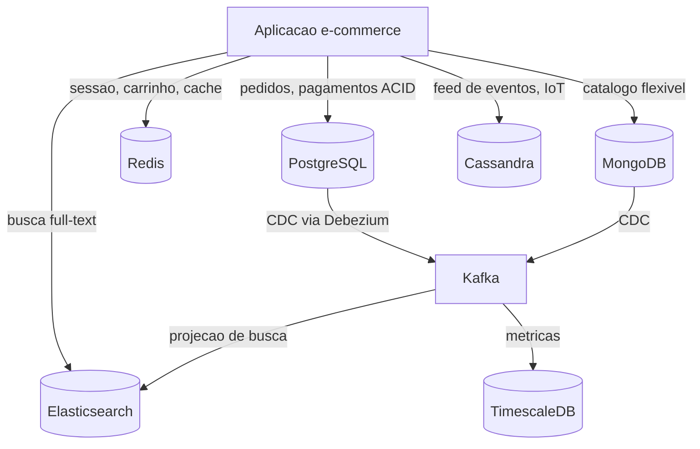

# Polyglot Persistence

> **Bloco:** Dados e persistência · **Nível:** Intermediário/Avançado · **Tempo de leitura:** ~22 min

## TL;DR

**Polyglot Persistence** é a prática de usar múltiplas tecnologias de armazenamento de dados dentro de um mesmo sistema, escolhendo cada uma de acordo com a natureza do dado e do padrão de acesso, em vez de forçar tudo para dentro de um único banco relacional. O termo foi cunhado por **Martin Fowler** e **Pramod Sadalage** por analogia ao *polyglot programming* (usar várias linguagens no mesmo projeto). A ideia central: primeiro pergunte *como você vai manipular o dado*, depois decida *qual tecnologia é a melhor aposta* para aquele caso. O preço é alto — complexidade operacional, consistência distribuída, sincronização entre stores e múltiplas competências no time. Não é um objetivo em si; é uma consequência de decisões locais bem fundamentadas.

## O problema que resolve

Durante décadas, o RDBMS relacional foi a escolha padrão para praticamente qualquer necessidade de persistência. O modelo "uma aplicação, um banco relacional" virou tão dominante que a pergunta nem era feita: você modelava tudo em tabelas normalizadas e resolvia os problemas de acesso depois, com índices, views e otimizações de query. Isso funcionava razoavelmente bem enquanto o volume, a variedade e a velocidade dos dados eram modestos.

O problema é que **dados diferentes têm características de acesso radicalmente diferentes**, e um único modelo de dados não é ótimo para todos eles. Sessões de usuário são efêmeras, acessadas por chave e com TTL curto — um banco relacional com ACID completo é overkill. Um catálogo de produtos com atributos heterogêneos (eletrônicos têm voltagem, roupas têm tamanho) sofre com o schema rígido relacional. Um grafo social de "quem segue quem" exige travessias que geram joins recursivos infernais em SQL. Busca textual full-text com ranking de relevância não é o forte de um `LIKE '%termo%'`. Séries temporais de métricas geram bilhões de linhas que esmagam um RDBMS transacional.

**Martin Fowler** formalizou o conceito em sua bliki ([PolyglotPersistence](https://martinfowler.com/bliki/PolyglotPersistence.html)), inspirado pelo termo *polyglot programming* atribuído a Neal Ford (2006). A tese de Fowler é que "qualquer empresa de tamanho razoável terá uma variedade de tecnologias de armazenamento para diferentes tipos de dados. Ainda haverá grandes quantidades em stores relacionais, mas cada vez mais vamos primeiro perguntar como queremos manipular o dado e só então descobrir qual tecnologia é a melhor aposta". O movimento NoSQL (documentos, chave-valor, colunar, grafo) deu as ferramentas; o polyglot persistence deu a estratégia de quando usar cada uma.

## O que é (definição aprofundada)

Polyglot Persistence é uma decisão de arquitetura na qual você seleciona **mecanismos de persistência heterogêneos** dentro de um mesmo sistema (ou ecossistema de sistemas), guiando a escolha pelas características intrínsecas do dado e pelo padrão de acesso predominante. Os principais arquétipos de store:

- **Relacional (RDBMS)**: PostgreSQL, MySQL. Forte em integridade referencial, transações ACID, consultas ad-hoc complexas com joins. Padrão para dados transacionais críticos (pedidos, pagamentos, contas).
- **Documento**: MongoDB, Couchbase. Schema flexível, dados agregados (um documento representa um agregado completo). Bom para catálogos heterogêneos, perfis, conteúdo.
- **Chave-valor**: Redis, DynamoDB. Acesso O(1) por chave, latência mínima. Sessões, carrinhos, caches, contadores, rate limiting.
- **Colunar wide-column**: Cassandra, ScyllaDB, HBase. Escrita massiva, escala horizontal linear, modelagem orientada a query. Séries temporais, event logs, IoT, feeds.
- **Busca**: Elasticsearch, OpenSearch, Solr. Indexação invertida, full-text com relevância, agregações, facets. Busca de produtos, logs, observabilidade.
- **Grafo**: Neo4j, Amazon Neptune. Travessias de relacionamentos, recomendações, detecção de fraude, grafos sociais.
- **Série temporal**: InfluxDB, TimescaleDB, Prometheus. Ingestão alta de pontos timestamped, downsampling, retenção.

O conceito-chave é **fit-for-purpose**: a tecnologia segue a necessidade, não o contrário. Polyglot persistence é frequentemente confundido com "usar muitos bancos por modismo" — não é. É uma escolha deliberada onde o benefício de um store especializado supera o custo de operá-lo. Importante: **persistência poliglota é diferente de Database per Service**. A primeira fala da heterogeneidade de tecnologias; a segunda, da propriedade exclusiva do dado por serviço. Elas se combinam bem (cada microsserviço escolhe seu store), mas são ortogonais.

## Como funciona

Na prática, o sistema mantém o dado em mais de um store, e cada store é a **fonte da verdade** (system of record) para o subconjunto de dados que melhor lhe cabe — ou serve como **réplica derivada otimizada para leitura** de um dado cuja verdade vive em outro lugar.

Dois modos de operação coexistem:

1. **Stores independentes por domínio/concern**: cada tipo de dado tem dono e tecnologia próprios. Pedidos no PostgreSQL, sessões no Redis, catálogo no MongoDB, busca no Elasticsearch. Cada um é fonte da verdade do seu pedaço.

2. **Stores derivados/projeções**: um dado nasce no system of record relacional e é *projetado* para um store de leitura especializado. O exemplo clássico é o catálogo de produtos cuja verdade está no PostgreSQL, mas que é indexado no Elasticsearch para busca. Aqui surge o problema central: **manter os stores sincronizados**. As estratégias usuais são:
   - **Dual write** (escrever nos dois ao mesmo tempo na aplicação) — frágil, sujeito a inconsistência se um falha. Anti-padrão na maioria dos casos.
   - **CDC (Change Data Capture)** — capturar mudanças do log do banco fonte (binlog/WAL) e propagar via Debezium/Kafka para os stores derivados. Confiável e desacoplado.
   - **Eventos de domínio** — o serviço publica eventos quando muda o estado; consumidores atualizam suas projeções (ver Outbox/EDA).

A consequência inevitável da heterogeneidade é a **consistência eventual** entre stores. Não há transação ACID que atravesse PostgreSQL, Redis e Elasticsearch. O arquiteto precisa decidir, por dado, qual nível de consistência é aceitável e como reconciliar divergências.

## Diagrama de fluxo



## Exemplo prático / caso real

Considere um **marketplace brasileiro** estilo Mercado Livre ou Magalu. A arquitetura de dados poliglota poderia ser:

- **PostgreSQL** — system of record de pedidos, pagamentos, estoque reservado e dados fiscais (NF-e). Exige ACID: um pedido não pode ser parcialmente pago. Transações multi-tabela com integridade referencial entre `pedido`, `item_pedido`, `pagamento`.
- **Redis** — carrinho de compras, sessões de login, cache de preço calculado, rate limiting da API e contadores de "X pessoas vendo este produto". TTL curto, acesso por chave, latência sub-milissegundo.
- **MongoDB** — catálogo de produtos. Um celular tem `armazenamento`, `cor`, `tela`; um livro tem `autor`, `editora`, `paginas`. Schema heterogêneo por categoria, modelado como documento agregado.
- **Elasticsearch** — busca de produtos com autocomplete, correção de digitação ("notbook" → "notebook"), filtros facetados (marca, faixa de preço, avaliação) e ranking por relevância + boost comercial. O catálogo vive no MongoDB; a verdade é projetada para o ES via CDC.
- **Cassandra** — log de eventos de navegação e cliques (bilhões de eventos/dia) usado para recomendação e analytics. Escrita massiva, escala horizontal.

Fluxo de sincronização do catálogo (pseudocódigo leve):

```text
vendedor atualiza produto -> MongoDB (fonte da verdade)
MongoDB change stream / Debezium -> Kafka topic "produtos.cdc"
consumidor de indexacao -> transforma + grava no Elasticsearch
busca do cliente -> Elasticsearch (consistencia eventual: ~segundos de lag)
```

Note que a busca pode mostrar um produto alguns segundos defasado em relação ao MongoDB — e isso é aceitável para busca. Já o estoque reservado no PostgreSQL precisa ser forte e imediato no checkout.

## Quando usar / Quando evitar

**Quando usar:**

- Quando os padrões de acesso a diferentes dados divergem fortemente (transacional vs. busca vs. cache vs. analytics) e um único store entrega trade-offs ruins para a maioria.
- Quando o ganho de performance, escala ou expressividade de um store especializado justifica seu custo operacional (ex.: busca decente realmente exige Elasticsearch).
- Em arquiteturas de microsserviços onde cada serviço já é dono do seu dado e pode escolher a tecnologia que melhor o serve.
- Quando o time tem maturidade operacional para rodar múltiplos stores (monitoramento, backup, tuning, on-call).

**Quando evitar:**

- Em sistemas pequenos/médios onde um PostgreSQL bem usado resolve 95% dos casos. PostgreSQL faz JSONB (documentos), full-text search razoável, `pg_trgm` para fuzzy, extensões para série temporal (TimescaleDB) e até vetores (`pgvector`). Não saia adicionando store sem necessidade comprovada.
- Quando o time não tem capacidade de operar bem nem um banco, quanto mais cinco. Cada store novo é mais um sistema para monitorar, fazer backup, tunar e acordar de madrugada.
- Quando a consistência forte entre os dados é requisito de negócio e a complexidade de reconciliação distribuída não compensa.

## Anti-padrões e armadilhas comuns

- **Polyglot por modismo (resume-driven development)**: adicionar Cassandra, Neo4j e Kafka "porque é moderno", sem caso de uso real. Cada store é dívida operacional permanente.
- **Dual write ingênuo**: escrever na aplicação simultaneamente em dois stores sem CDC/eventos. Quando um falha, os dados divergem silenciosamente. Use CDC ou outbox.
- **Ignorar a consistência eventual**: assumir que o Elasticsearch reflete o PostgreSQL instantaneamente. Isso gera bugs de "o produto que acabei de criar não aparece na busca".
- **Não definir o system of record**: ter dois stores onde ambos parecem "donos" do dado leva a conflitos de escrita irreconciliáveis. Sempre defina uma única fonte da verdade por dado.
- **Subestimar o custo cognitivo**: cada tecnologia tem seu modelo de dados, sua linguagem de query, suas peculiaridades de tuning e falha. Times precisam dominar todas.
- **Sharding/store especializado prematuro**: introduzir complexidade antes da escala que a justifique.

## Relação com outros conceitos

- **Database per Service**: a propriedade exclusiva do dado por microsserviço habilita naturalmente o polyglot persistence — cada serviço escolhe seu store. Ver `02-database-per-service.md`.
- **CQRS e Materialized Views**: projeções de leitura especializadas (ex.: catálogo no Elasticsearch) são uma aplicação direta de CQRS sobre persistência poliglota. Ver `04-materialized-views-e-projecoes.md`.
- **CDC (Change Data Capture)**: o mecanismo de baixo acoplamento para sincronizar stores heterogêneos. Ver `05-cdc-change-data-capture-debezium.md`.
- **ACID vs BASE / CAP**: a heterogeneidade força decisões explícitas de consistência por store. Ver `09-acid-vs-base.md`.
- **OLTP vs OLAP**: separar a verdade transacional (OLTP) de stores analíticos é uma forma de persistência poliglota. Ver `07-oltp-vs-olap-lambda-kappa.md`.

## Referências

- [bliki: PolyglotPersistence — Martin Fowler](https://martinfowler.com/bliki/PolyglotPersistence.html)
- [Polyglot persistence — Wikipedia](https://en.wikipedia.org/wiki/Polyglot_persistence)
- [Pattern: Database per service — microservices.io (Chris Richardson)](https://microservices.io/patterns/data/database-per-service.html)
- [Designing Data-Intensive Applications — Martin Kleppmann (site oficial)](https://dataintensive.net/)
- [What is Change Data Capture (CDC)? — Confluent](https://www.confluent.io/learn/change-data-capture/)
- [Pattern: Command Query Responsibility Segregation (CQRS) — microservices.io](https://microservices.io/patterns/data/cqrs.html)
