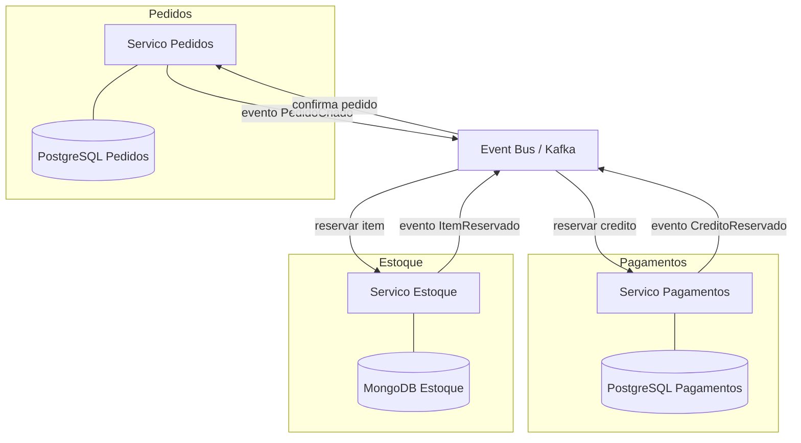

# Database per Service

> **Bloco:** Dados e persistência · **Nível:** Intermediário/Avançado · **Tempo de leitura:** ~23 min

## TL;DR

**Database per Service** estabelece que cada microsserviço é o dono exclusivo do seu banco de dados e nenhum outro serviço acessa esses dados diretamente — apenas via API. É o pilar que viabiliza o acoplamento fraco real entre serviços: sem ele, microsserviços viram um monólito distribuído amarrado por um schema compartilhado. O preço é alto: você perde transações ACID que atravessam serviços, perde joins entre dados de serviços diferentes, e ganha o desafio da **consistência distribuída**, resolvida com **Saga**, **CQRS** e **eventos**. Padrão catalogado por **Chris Richardson** em [microservices.io](https://microservices.io/patterns/data/database-per-service.html).

## O problema que resolve

Microsserviços só entregam seus benefícios — deploy independente, escalabilidade independente, autonomia de times, isolamento de falhas — se forem de fato **fracamente acoplados**. E o maior vetor de acoplamento oculto em sistemas distribuídos não é a rede: é o **banco de dados compartilhado**.

Quando vários serviços compartilham o mesmo schema relacional, surgem patologias estruturais:

- **Acoplamento de schema em tempo de desenvolvimento**: alterar uma tabela exige coordenar com todos os serviços que a leem ou escrevem. O time A não pode renomear uma coluna sem quebrar o time B. A autonomia evapora.
- **Acoplamento em tempo de execução**: um serviço com query mal otimizada ou lock prolongado degrada todos os outros que compartilham o banco. Uma migration pesada de um serviço trava o sistema inteiro.
- **Falta de isolamento de falhas**: o banco compartilhado vira ponto único de falha e gargalo único de escala.
- **Modelo de dados de menor denominador comum**: o schema precisa servir a todos, o que impede que cada serviço modele seus dados da forma ideal e escolha tecnologias adequadas (impede polyglot persistence).

**Chris Richardson**, no microservices.io, classifica o *Shared Database* como um anti-padrão justamente por isso: ele preserva o acoplamento que os microsserviços deveriam eliminar. Database per Service é a resposta — cada serviço dono do seu dado, encapsulado atrás de uma API. A consequência é dura: você troca a simplicidade das transações ACID locais pelos desafios da consistência distribuída.

## O que é (definição aprofundada)

Database per Service é o padrão no qual **cada microsserviço possui e controla seus próprios dados de forma privada**, acessíveis a outros serviços somente através da API pública do serviço dono — nunca por acesso direto ao banco. Termos-chave:

- **Loose coupling / acoplamento fraco**: serviços não dependem do schema interno uns dos outros. O serviço dono pode evoluir seu modelo livremente, desde que mantenha o contrato da API.
- **Bounded Context (DDD)**: cada banco de serviço materializa o limite de um contexto delimitado. O modelo de dados é interno e específico ao domínio do serviço.
- **System of record por serviço**: cada dado tem um único dono autoritativo. Não há ambiguidade sobre quem manda no dado.
- **Encapsulamento de dados**: o banco é detalhe de implementação interno. Outros serviços não sabem (nem devem saber) se você usa PostgreSQL ou MongoDB.

Há gradações de isolamento físico, do mais fraco ao mais forte:

1. **Private tables per service** — mesmo servidor de banco, mesmo database, tabelas separadas com permissões que impedem acesso cruzado. Isolamento lógico mínimo.
2. **Schema per service** — mesmo servidor, schemas/databases lógicos separados, credenciais que só dão acesso ao próprio schema.
3. **Database server per service** — servidor de banco dedicado por serviço. Isolamento máximo, custo operacional máximo.

O essencial não é o isolamento físico, e sim a **regra de acesso**: nenhum serviço toca diretamente os dados de outro. Richardson observa que múltiplos serviços podem até compartilhar o mesmo servidor de banco, desde que cada um tenha credenciais que só lhe dão acesso ao próprio banco lógico.

## Como funciona

Com os dados particionados por serviço, surge o problema fundamental: **muitas operações de negócio atravessam mais de um serviço**, e você não pode mais envolvê-las numa única transação ACID local.

Os mecanismos que substituem a transação distribuída clássica (2PC, que é frágil, lento e pouco cloud-friendly):

- **Saga**: uma transação de negócio que abrange múltiplos serviços é quebrada em uma sequência de **transações locais**, cada uma confirmada (commit) no banco do seu serviço. Cada passo publica um evento ou comando que dispara o próximo. Se um passo falha, executam-se **transações compensatórias** que desfazem semanticamente os passos anteriores. A Saga garante consistência *eventual*, não atomicidade.
- **CQRS + Materialized Views**: como você não pode fazer join entre os bancos de dois serviços, queries que precisam de dados de múltiplos serviços são servidas por uma **view database** — uma réplica de leitura que assina eventos de domínio dos serviços donos e mantém uma projeção desnormalizada pronta para a query.
- **API Composition**: queries simples podem ser resolvidas chamando as APIs dos serviços e juntando os resultados em memória no orquestrador. Funciona para volumes pequenos; não escala para joins grandes.
- **Eventos de domínio + Outbox**: cada serviço publica eventos ao mudar de estado, e outros serviços reagem mantendo cópias locais ou réplicas read-only dos dados de que precisam. O padrão **Transactional Outbox** garante que o evento seja publicado de forma confiável junto com a transação local (evita o problema da dual-write).

A consistência entre serviços passa a ser **eventual** por definição. Isso precisa ser desenhado no domínio: estados intermediários ("pedido pendente de aprovação de crédito") tornam-se explícitos e modelados, não erros.

## Diagrama de fluxo



## Exemplo prático / caso real

Considere uma **fintech brasileira** com microsserviços para `Contas`, `Transferências (PIX)` e `Antifraude`, cada um com seu banco.

- **Contas** — PostgreSQL, system of record dos saldos. ACID local crítico: debitar e creditar dentro da mesma conta é transacional.
- **Transferências** — PostgreSQL próprio, orquestra o fluxo de um PIX.
- **Antifraude** — store próprio (talvez Cassandra para histórico de eventos + features), avalia risco.

Um PIX de R$ 500 entre dois clientes envolve os três serviços e **não cabe numa transação ACID única**. Implementa-se como Saga:

```text
1. Transferencias cria registro "PIX_PENDENTE" (commit local)
   -> publica evento TransferenciaIniciada
2. Antifraude avalia risco -> publica AprovadoFraude (ou RejeitadoFraude)
3. Contas debita origem (commit local) -> publica ContaDebitada
4. Contas credita destino (commit local) -> publica ContaCreditada
5. Transferencias marca "PIX_CONCLUIDO"

Falha no passo 3 (saldo insuficiente):
   -> compensacao: Antifraude libera reserva, Transferencias marca "PIX_FALHOU"
   -> notifica cliente
```

Repare que entre o passo 1 e o 5 existe uma janela de inconsistência *visível ao negócio*: o PIX está "pendente". Isso é modelado como estado de domínio legítimo, não ocultado. E uma tela de "extrato consolidado" que precise juntar saldo (Contas) + histórico de transferências (Transferências) não faz join entre os bancos — consome uma **projeção CQRS** alimentada por eventos, ou compõe via API.

## Quando usar / Quando evitar

**Quando usar:**

- Em arquiteturas de microsserviços genuínas, onde autonomia de time, deploy independente e isolamento de falhas são objetivos reais e mensuráveis.
- Quando os bounded contexts já estão razoavelmente claros e estáveis — as fronteiras de dados seguem as fronteiras de domínio.
- Quando o time tem maturidade para lidar com consistência eventual, Saga, idempotência e mensageria.

**Quando evitar:**

- Em monólitos ou sistemas pequenos: a sobrecarga de consistência distribuída não se paga. Um schema único bem modelado é mais simples e correto.
- Quando as fronteiras de domínio ainda são incertas. Particionar dados cedo demais cristaliza fronteiras erradas, e mover dados entre serviços depois é caríssimo. Prefira começar com um monólito modular bem fatiado.
- Quando o negócio exige consistência forte e imediata em operações que atravessam muitos serviços, e a complexidade da Saga supera o benefício do isolamento. Às vezes, juntar esses dados num único serviço é a decisão certa.

## Anti-padrões e armadilhas comuns

- **Shared database entre serviços**: o anti-padrão clássico. Vários serviços lendo/escrevendo nas mesmas tabelas reintroduz todo o acoplamento que os microsserviços deveriam eliminar. Resultado: monólito distribuído — o pior dos dois mundos.
- **Acesso direto ao banco de outro serviço**: "só uma queryzinha de leitura no banco do outro time". Isso quebra o encapsulamento e acopla seu serviço ao schema interno alheio. Se precisa do dado, peça via API ou consuma eventos.
- **Tentar usar 2PC/transações distribuídas como solução padrão**: lento, frágil, não cloud-friendly e amplia o blast radius de falhas. Use Saga.
- **Dual write para sincronizar dados entre serviços**: escrever no próprio banco e publicar evento separadamente sem atomicidade leva a eventos perdidos ou fantasmas. Use o padrão Outbox.
- **Ignorar idempotência**: em sistemas de eventos, mensagens são reentregues. Consumidores não idempotentes corrompem dados (crédito duplicado, p.ex.).
- **Particionamento prematuro de dados**: fatiar antes de entender o domínio gera fronteiras erradas e custo de refatoração brutal.

## Relação com outros conceitos

- **Microservices / Bounded Context (DDD)**: Database per Service é a materialização do bounded context na camada de dados. Sem ele, microsserviços não são autônomos.
- **Saga**: o padrão de transação distribuída que substitui o ACID cross-service. Ver bloco de Sistemas Distribuídos.
- **CQRS e Materialized Views**: a resposta para queries que precisariam de joins entre bancos de serviços diferentes. Ver `04-materialized-views-e-projecoes.md`.
- **CDC e Outbox / EDA**: mecanismos confiáveis de publicação de eventos e sincronização de dados derivados entre serviços. Ver `05-cdc-change-data-capture-debezium.md`.
- **Polyglot Persistence**: cada serviço dono do seu dado pode escolher a melhor tecnologia. Ver `01-polyglot-persistence.md`.
- **ACID vs BASE / CAP**: a partição de dados torna a consistência eventual (BASE) a norma entre serviços. Ver `09-acid-vs-base.md`.

## Referências

- [Pattern: Database per service — microservices.io (Chris Richardson)](https://microservices.io/patterns/data/database-per-service.html)
- [The FTGO application and the Database per service pattern — microservices.io](https://microservices.io/post/microservices/patterns/data/2019/07/15/ftgo-database-per-service.html)
- [Pattern: Saga — microservices.io](https://microservices.io/patterns/data/saga.html)
- [Pattern: Command Query Responsibility Segregation (CQRS) — microservices.io](https://microservices.io/patterns/data/cqrs.html)
- [Pattern: Transactional outbox — microservices.io](https://microservices.io/patterns/data/transactional-outbox.html)
- [Pattern: Event-driven architecture — microservices.io](https://microservices.io/patterns/data/event-driven-architecture.html)
- [Designing Data-Intensive Applications — Martin Kleppmann (site oficial)](https://dataintensive.net/)
