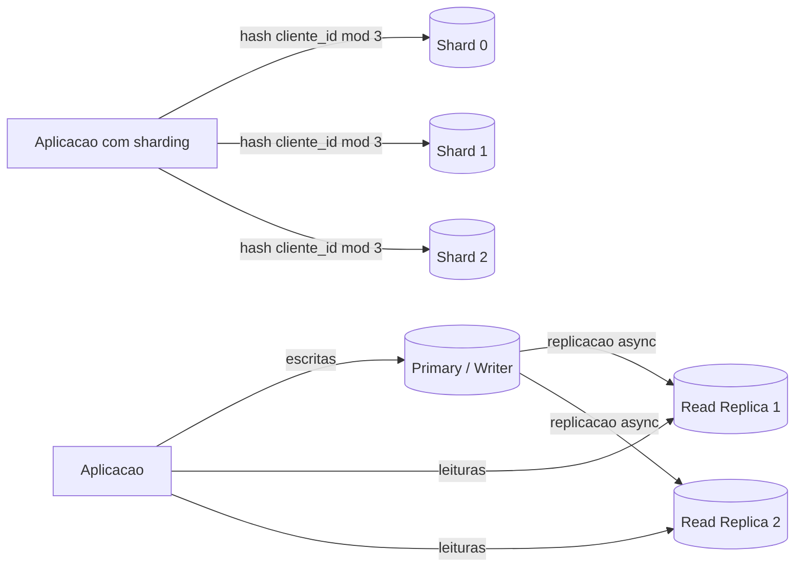

# Read Replicas, Sharding e Particionamento

> **Bloco:** Dados e persistência · **Nível:** Intermediário/Avançado · **Tempo de leitura:** ~24 min

## TL;DR

Três alavancas distintas para escalar um banco de dados, frequentemente confundidas. **Read Replicas** replicam o dado inteiro para escalar *leituras* (e dar alta disponibilidade), mas não escalam escrita e introduzem replication lag. **Particionamento** divide uma tabela lógica em pedaços físicos menores: **vertical** (separa colunas/grupos de tabelas) ou **horizontal** (separa linhas por uma chave). **Sharding** é particionamento horizontal levado ao extremo: as partições vivem em *servidores diferentes*, permitindo escalar *escrita* e armazenamento além do limite de uma única máquina — ao custo de complexidade brutal (queries cross-shard, rebalanceamento, hotspots). Regra de ouro: replica primeiro, particiona depois, e só faça sharding quando realmente esgotar o vertical scaling e as replicas. **Sharding prematuro** é um dos erros mais caros de arquitetura de dados.

## O problema que resolve

Um único servidor de banco de dados tem limites físicos: CPU, memória, IOPS de disco, throughput de rede e capacidade de armazenamento. A primeira resposta para escalar é **vertical scaling** (scale up): comprar uma máquina maior. É a opção mais simples e deve ser sempre a primeira — máquinas modernas suportam TB de RAM e centenas de cores. Mas o vertical scaling tem teto físico, fica exponencialmente caro no topo, e não resolve disponibilidade (uma máquina, um ponto de falha).

Esgotado (ou antes de esgotar) o scale up, você precisa de **horizontal scaling** (scale out): distribuir a carga por múltiplas máquinas. Mas distribuir um banco de dados é fundamentalmente difícil por causa do **estado**: diferente de servidores web stateless, dados precisam estar *em algum lugar consistente*. As três técnicas atacam dimensões diferentes do problema:

- Cargas **read-heavy** (e a maioria das aplicações OLTP lê muito mais do que escreve, frequentemente 90/10 ou mais): **read replicas** distribuem as leituras.
- Tabelas **grandes demais** ou com colunas de acesso muito distinto: **particionamento** (vertical ou horizontal) torna cada pedaço gerenciável.
- Carga de **escrita** e **volume de dados** que excedem uma máquina: **sharding** distribui também a escrita.

A documentação da AWS resume bem a distinção fundamental: *particionamento* divide uma tabela lógica em pedaços físicos menores dentro do mesmo banco; *sharding* divide os dados entre múltiplos bancos (e frequentemente múltiplas instâncias), com a aplicação decidindo onde cada dado vive.

## O que é (definição aprofundada)

### Read Replicas

**Réplicas de leitura** são cópias completas e (quase) sincronizadas do banco primário, mantidas atualizadas por **replicação** a partir do primário (writer). O fluxo: escritas vão sempre para o **primary/writer**; leituras podem ser distribuídas entre uma ou mais **réplicas read-only**. A replicação pode ser:

- **Assíncrona**: o primário confirma o commit sem esperar as réplicas. Maior performance de escrita, mas gera **replication lag** — a réplica pode estar atrás do primário por milissegundos a segundos. É o padrão (ex.: Amazon RDS suporta até 15 réplicas de leitura por instância).
- **Síncrona/semi-síncrona**: o primário espera ao menos uma réplica confirmar. Menos lag, mas penaliza a latência de escrita.

Réplicas servem a dois propósitos: **escalar leitura** e **alta disponibilidade** (uma réplica pode ser promovida a primário em failover). Importante: **réplicas NÃO escalam escrita** — toda escrita ainda passa pelo único primário.

### Particionamento

**Particionamento** é dividir uma tabela lógica em múltiplas estruturas físicas menores. Duas dimensões:

- **Particionamento vertical**: divide por **colunas** ou agrupa tabelas relacionadas. Você separa colunas raramente acessadas ou pesadas (BLOBs, texto longo) das colunas "quentes" acessadas em toda query. Reduz o tamanho da linha lida no caminho crítico. Em sentido mais amplo, mover grupos de tabelas para bancos diferentes por domínio também é particionamento vertical (o que, em microsserviços, vira Database per Service).
- **Particionamento horizontal**: divide por **linhas**, segundo uma **partition key**. Cada partição contém um subconjunto das linhas. Em um único banco, isso é o `PARTITION BY` do PostgreSQL/MySQL (por range de data, por hash, por lista). A tabela continua lógica e única para a aplicação; o engine roteia para a partição certa e faz **partition pruning** (varre só as partições relevantes).

### Sharding

**Sharding** é particionamento horizontal cujas partições (**shards**) residem em **servidores/instâncias diferentes**. A aplicação (ou uma camada de roteamento) decide em qual shard cada dado vive, baseado na **shard key**. Diferente de réplicas (cópias do todo), cada shard guarda um **subconjunto disjunto** dos dados. Estratégias de distribuição:

- **Range-based**: shards por faixa da chave (clientes A–F no shard 1, G–M no shard 2...). Simples, bom para range queries, mas propenso a **hotspots** se a distribuição for desigual.
- **Hash-based**: aplica hash na chave e distribui uniformemente. Evita hotspots, mas range queries ficam impossíveis (dados adjacentes vão para shards diferentes).
- **Consistent hashing**: hash em um anel que minimiza o remanejamento de dados ao adicionar/remover shards. Usado por Cassandra, DynamoDB.
- **Directory-based / lookup**: uma tabela de mapeamento (chave → shard) flexível, ao custo de uma indireção e de o lookup virar gargalo.

Sharding é a única técnica que escala **escrita e armazenamento** além de uma máquina — e a mais complexa de todas.

## Como funciona

**Leitura com réplicas**: a aplicação (ou um proxy como PgBouncer/ProxySQL/RDS Proxy) roteia `SELECT` para réplicas e `INSERT/UPDATE/DELETE` para o primário. O desafio operacional é o **read-after-write**: se o usuário escreve e imediatamente lê de uma réplica defasada, vê o dado antigo. Mitigações: ler do primário logo após escrita (read-your-writes), sticky session por usuário ao primário por alguns segundos, ou tolerar a inconsistência onde aceitável.

**Sharding por hash** (mecânica detalhada): para localizar a linha de um pedido com `pedido_id`, calcula-se `shard = hash(pedido_id) % N`, onde N é o número de shards. A query vai direto ao shard certo. O problema aparece quando você precisa adicionar shards: mudar N reembaralha quase tudo (por isso usa-se consistent hashing, que move só ~1/N dos dados). E qualquer query que **não** filtra pela shard key vira um **scatter-gather**: precisa consultar *todos* os shards e agregar os resultados — caro e lento. Joins entre shards são, na prática, inviáveis no banco; resolvem-se na aplicação ou desnormalizando.

## Diagrama de fluxo

## Exemplo prático / caso real

**Marketplace brasileiro** com PostgreSQL no Amazon RDS, escalando em etapas conforme cresce:

1. **Início**: instância única. Vertical scaling até `db.r6g.4xlarge`. Resolve por um bom tempo.
2. **Carga de leitura cresce** (busca de catálogo, listagem de produtos, páginas de vendedor): adiciona **read replicas**. Leituras de catálogo e relatórios vão para réplicas; checkout e escrita de pedido vão para o primário. Toleram-se ~1s de lag na listagem de produtos, mas o saldo de estoque no checkout lê do primário (read-your-writes).
3. **Tabela de eventos de navegação fica gigante** (bilhões de linhas): aplica **particionamento horizontal por range de data** (`PARTITION BY RANGE (data_evento)`), uma partição por mês. Queries por período fazem partition pruning; partições antigas são arquivadas/dropadas barato (retenção).
4. **Escrita de pedidos atinge o teto do primário** na Black Friday: aqui entra **sharding**. Sharda-se a tabela de pedidos por `cliente_id` (hash-based), distribuindo escrita por N instâncias RDS. A AWS documenta exatamente esse caminho: réplicas escalam leitura até o limite suportado; para escala maior de escrita, o sharding distribui o dataset. Réplicas de leitura, aliás, podem ser **promovidas** como parte da implementação de sharding (split de shard).

Trade-off prático do passo 4: o relatório "todos os pedidos do mês" agora é um scatter-gather entre todos os shards. Por isso o time mantém esse tipo de consulta num store analítico separado (CQRS/OLAP), não nos shards transacionais.

## Quando usar / Quando evitar

**Read Replicas — usar quando:** carga read-heavy, necessidade de HA/failover, relatórios que não podem competir com o OLTP. **Evitar/cuidado:** quando a aplicação não tolera replication lag em nenhum lugar; não adianta nada se o gargalo for escrita.

**Particionamento — usar quando:** tabelas muito grandes onde a maioria das queries filtra por uma dimensão clara (data, tenant), ou para facilitar retenção/arquivamento. **Evitar:** quando a chave de partição não bate com os padrões de query (gera varredura de todas as partições).

**Sharding — usar quando:** você genuinamente esgotou vertical scaling + réplicas, e o limite é escrita ou volume além de uma máquina. **Evitar:** praticamente sempre que possível adiar. É a técnica de último recurso. Antes de shardar, esgote: scale up, read replicas, caching, otimização de queries, arquivamento de dados frios, e separação OLTP/OLAP.

## Anti-padrões e armadilhas comuns

- **Sharding prematuro**: a armadilha mais cara. Introduzir sharding antes da escala que o justifique adiciona complexidade enorme (roteamento, cross-shard queries, rebalanceamento, deploy) que freia o desenvolvimento por anos sem benefício. "Você provavelmente não precisa de sharding ainda."
- **Escolher mal a shard key**: chave com baixa cardinalidade ou distribuição desigual cria **hotspots** — um shard recebe a maioria da carga (ex.: shardar por `pais` num app majoritariamente brasileiro). Escolha uma chave de alta cardinalidade e distribuição uniforme.
- **Ler de réplica esperando consistência forte**: read-after-write quebra silenciosamente por causa do lag. Decida explicitamente o que pode ler de réplica.
- **Saturar o primário com leituras que poderiam ir para réplica** (ou o oposto: esquecer que réplica não escala escrita).
- **Cross-shard joins e scatter-gather em larga escala**: matam a performance. Modele para que as queries quentes filtrem pela shard key; jogue analytics para OLAP.
- **Ignorar o custo operacional do rebalanceamento**: adicionar shards e mover dados sem downtime é um projeto em si.

## Relação com outros conceitos

- **OLTP vs OLAP**: separar carga analítica (relatórios cross-shard) de transacional evita scatter-gather nos shards. Ver `07-oltp-vs-olap-lambda-kappa.md`.
- **CQRS / Materialized Views**: queries que não casam com a shard key são melhor servidas por projeções de leitura dedicadas. Ver `04-materialized-views-e-projecoes.md`.
- **Cache patterns**: caching reduz a pressão de leitura, frequentemente adiando a necessidade de réplicas/sharding. Ver `08-cache-patterns.md`.
- **CAP / consistência**: replication lag e sharding são manifestações concretas dos trade-offs de consistência em sistemas distribuídos. Ver `09-acid-vs-base.md`.
- **Database per Service**: o particionamento vertical por domínio é, em microsserviços, a separação de bancos por serviço. Ver `02-database-per-service.md`.

## Referências

- [Amazon RDS Read Replicas — AWS](https://aws.amazon.com/rds/features/read-replicas/)
- [Sharding with Amazon Relational Database Service — AWS Database Blog](https://aws.amazon.com/blogs/database/sharding-with-amazon-relational-database-service/)
- [Scale your relational database for SaaS, Part 1: Common scaling patterns — AWS Database Blog](https://aws.amazon.com/blogs/database/scale-your-relational-database-for-saas-part-1-common-scaling-patterns/)
- [Scale your relational database for SaaS, Part 2: Sharding and routing — AWS Database Blog](https://aws.amazon.com/blogs/database/scale-your-relational-database-for-saas-part-2-sharding-and-routing/)
- [Designing Data-Intensive Applications — Martin Kleppmann (site oficial)](https://dataintensive.net/)
