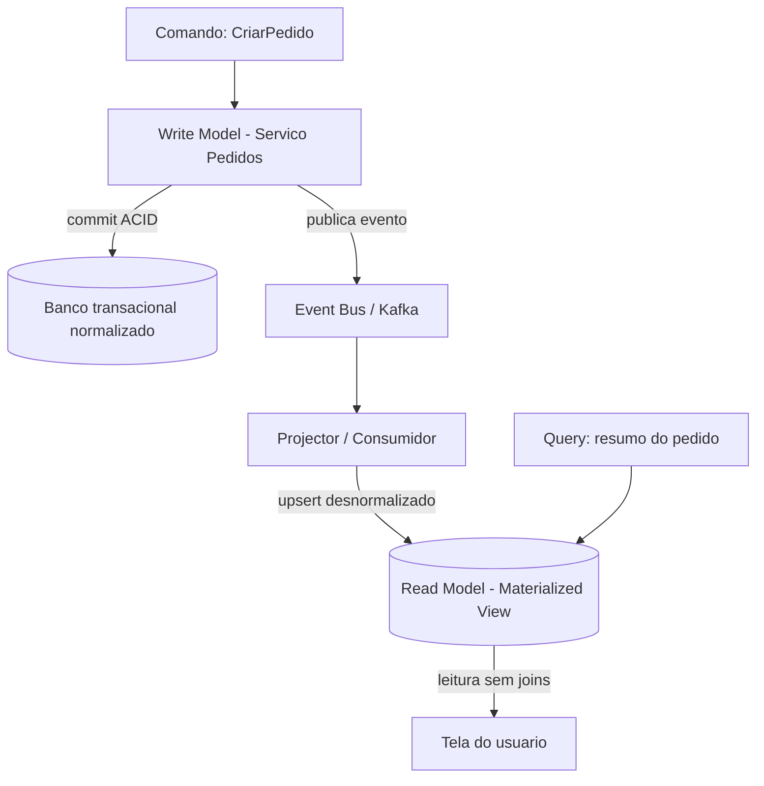

# Materialized Views e Projeções para CQRS

> **Bloco:** Dados e persistência · **Nível:** Intermediário/Avançado · **Tempo de leitura:** ~22 min

## TL;DR

Uma **materialized view** é o resultado de uma query *pré-computado e persistido*, em vez de calculado a cada leitura. Em **CQRS** (Command Query Responsibility Segregation), as views materializadas tornam-se **projeções**: modelos de leitura desnormalizados, mantidos atualizados pela assinatura de eventos de domínio, projetados especificamente para responder a uma query ou grupo de queries sem joins caros. A ideia: pague o custo do join/agregação **na escrita** (quando o evento chega), uma vez, em vez de a cada leitura. Resolve diretamente o problema de queries que precisariam atravessar múltiplos serviços/bancos em arquiteturas Database per Service. O preço é a **consistência eventual** (a projeção fica atrás da escrita) e a complexidade de manter e reconstruir projeções.

## O problema que resolve

Há duas versões do mesmo problema, em escalas diferentes.

**No banco relacional clássico**: certas queries são caras — joins de muitas tabelas, agregações sobre milhões de linhas, cálculos analíticos. Se essa query roda a cada request (ex.: dashboard de vendas), o banco sofre. A view comum (`CREATE VIEW`) não ajuda: ela é só uma query salva, recalculada toda vez. A **materialized view** persiste o resultado, transformando uma leitura cara em uma leitura barata de uma tabela pré-computada.

**Em microsserviços com Database per Service**: aqui o problema é estrutural, como aponta Chris Richardson no [microservices.io](https://microservices.io/patterns/data/cqrs.html). Com cada serviço dono do seu banco, **fica impossível fazer join entre dados de serviços diferentes**. Uma tela que mostra o pedido (serviço Pedidos) + nome e endereço do cliente (serviço Clientes) + status de entrega (serviço Logística) não pode ser uma query SQL única — os dados estão em três bancos isolados. As opções são API Composition (chamar as três APIs e juntar em memória — não escala para listas/filtros) ou **CQRS com uma view database**.

O CQRS, formalizado a partir das ideias de Greg Young e Udi Dahan sobre separar o modelo de escrita do modelo de leitura, propõe exatamente isso: um **modelo de leitura** separado, que pode ser uma view materializada contendo dados de múltiplos serviços, mantida atualizada por eventos. Richardson resume: em vez de fazer join de cinco tabelas no momento da query, o lado de leitura já fez esse trabalho quando o evento chegou.

## O que é (definição aprofundada)

- **Materialized view**: tabela física cujo conteúdo é o resultado *pré-computado* de uma query (joins, agregações, filtros). Diferente da view virtual, ocupa espaço e precisa ser **atualizada** quando os dados-fonte mudam. PostgreSQL tem `CREATE MATERIALIZED VIEW ... REFRESH`. Oracle, SQL Server (indexed views), Snowflake e BigQuery têm variantes.
- **Read model / view model (CQRS)**: o modelo de dados otimizado para leitura, separado do **write model** (que aplica regras de negócio e garante invariantes). O write model é normalizado e transacional; o read model é desnormalizado e moldado à query.
- **Projeção (projection)**: a função/processo que consome **eventos de domínio** e os transforma incrementalmente em um read model. "Projetar" eventos em um estado de leitura. Em Event Sourcing, projeções são a forma canônica de derivar views a partir do log de eventos.
- **View database**: o store que hospeda o read model. Pode ser qualquer tecnologia adequada à query: PostgreSQL desnormalizado, MongoDB (documento agregado), Elasticsearch (busca), Redis (acesso por chave). Persistência poliglota aplicada.

A distinção CQRS importante: a **separação de responsabilidades** entre comandos (mudam estado) e queries (leem estado). A materialized view/projeção é a peça que materializa o lado *query*. CQRS não exige Event Sourcing nem bancos separados — mas combina muito bem com ambos.

## Como funciona

O ciclo de vida de uma projeção em CQRS orientado a eventos:

1. **Comando** chega ao serviço dono (write model). Ele valida invariantes, aplica a mudança no seu banco transacional (commit ACID local) e **publica um evento de domínio** (`PedidoCriado`, `ItemAdicionado`, `EnderecoAtualizado`).
2. O evento trafega por um broker (Kafka) ou é capturado via CDC/Outbox.
3. Um **projector** (consumidor) recebe o evento e atualiza incrementalmente o read model: faz upsert na materialized view/projeção, juntando o novo dado ao que já existe. Não recalcula tudo — aplica o delta.
4. As **queries** leem diretamente do read model, já desnormalizado e pronto. Sem joins, sem agregação em tempo de leitura.

Estratégias de atualização da view materializada:

- **Incremental por evento (event-driven)**: cada evento atualiza só o que mudou. Eficiente, baixa latência, mas exige idempotência (eventos podem ser reentregues).
- **Refresh completo (full refresh)**: recalcula a view inteira periodicamente (ex.: `REFRESH MATERIALIZED VIEW` do PostgreSQL, ou recompute noturno). Simples, mas custoso e com janela de defasagem maior. PostgreSQL tem `REFRESH ... CONCURRENTLY` para não travar leituras.
- **Refresh sob demanda / agendado**: trade-off entre frescor e custo.

**Rebuild de projeção**: uma vantagem poderosa do modelo orientado a eventos — se a projeção corromper, ou você quiser mudar seu schema, pode **reconstruí-la do zero** reprocessando o log de eventos (em Event Sourcing) ou re-snapshotando a fonte. O read model é descartável e derivável; a verdade está no write model / event store.

## Diagrama de fluxo



## Exemplo prático / caso real

**E-commerce brasileiro** com microsserviços. A tela "Meus Pedidos" precisa mostrar, por pedido: número, data, valor total, itens com nome e foto, status de pagamento e status de entrega. Esses dados vivem em quatro serviços: `Pedidos`, `Catálogo`, `Pagamentos`, `Logística` — bancos isolados.

Sem CQRS, montar essa lista exigiria 4+ chamadas de API por pedido e junção em memória — inviável para paginação e filtros. Com **CQRS + projeção**:

```text
Servico Pedidos -> evento PedidoCriado(pedido_id, cliente, itens[], total)
Servico Pagamentos -> evento PagamentoAprovado(pedido_id)
Servico Logistica -> evento PedidoEnviado(pedido_id, rastreio)
Servico Catalogo -> evento ProdutoRenomeado(produto_id, novo_nome)

Projector "MeusPedidos" consome todos esses topicos:
  - PedidoCriado  -> cria doc {pedido_id, cliente, itens, total, status: "aguardando_pagamento"}
  - PagamentoAprovado -> atualiza status -> "pago"
  - PedidoEnviado -> atualiza status -> "enviado", grava rastreio
  - ProdutoRenomeado -> atualiza o nome do item nos docs que o contem

Read model gravado no MongoDB (documento por pedido, pronto para a tela)
Query "Meus Pedidos do cliente X" -> 1 leitura no MongoDB, sem joins
```

Tecnologias reais nesse cenário: write models em **PostgreSQL**, eventos via **Kafka** (alimentado por **Debezium/Outbox**), read model em **MongoDB** (documento agregado) ou **Elasticsearch** (se a tela precisar de busca/filtros ricos). Note a consistência eventual: logo após aprovar o pagamento, a tela pode mostrar "aguardando pagamento" por alguns segundos até o projector processar o evento. Isso precisa ser aceitável para o caso — e geralmente é, para uma listagem.

## Quando usar / Quando evitar

**Quando usar:**

- Queries de leitura caras e frequentes (dashboards, listagens, relatórios) onde o custo de recomputar a cada request é proibitivo.
- Microsserviços com Database per Service, quando uma query precisa de dados de múltiplos serviços e API Composition não escala.
- Quando os padrões de leitura e escrita divergem fortemente em volume e forma (leitura 100x mais frequente, em formato totalmente diferente da escrita).
- Quando você quer escalar leitura independentemente da escrita, em stores diferentes (persistência poliglota).

**Quando evitar:**

- Quando a aplicação exige consistência forte e imediata na leitura — a defasagem da projeção é inaceitável.
- Em sistemas simples onde uma view comum, um índice ou uma query bem otimizada resolvem. CQRS adiciona complexidade real (infra de eventos, projectors, idempotência, monitoramento de lag).
- Quando o time não tem maturidade para operar pipelines de eventos e lidar com reprocessamento/rebuild de projeções.

## Anti-padrões e armadilhas comuns

- **Projector não idempotente**: eventos são reentregues (at-least-once). Se aplicar `PagamentoAprovado` duas vezes incrementar um contador duas vezes, a projeção corrompe. Projectors precisam ser idempotentes (rastrear offset/event id processado ou usar upsert determinístico).
- **Acoplar o write model ao read model**: deixar a projeção "vazar" para o lado de escrita ou vice-versa elimina o benefício da separação. São modelos independentes.
- **Refresh completo em view gigante a cada minuto**: `REFRESH MATERIALIZED VIEW` recalcula tudo; em tabelas grandes isso é caríssimo e trava. Use refresh incremental por evento ou `CONCURRENTLY`.
- **Esquecer o monitoramento de lag da projeção**: se o projector cai ou atrasa, a tela mostra dados velhos silenciosamente. Monitore o lag de consumo.
- **Não planejar o rebuild**: quando o schema da projeção muda ou ela corrompe, você precisa reconstruí-la. Se não há como reprocessar os eventos/fonte, você está preso.
- **Aplicar CQRS em todo lugar**: é um padrão localizado, para os casos onde leitura e escrita realmente divergem. Aplicá-lo no CRUD trivial é overengineering.

## Relação com outros conceitos

- **CQRS**: as projeções/materialized views são a implementação concreta do lado *query* do CQRS. Conceito central deste documento.
- **Event Sourcing**: projeções são a forma canônica de derivar read models a partir do log de eventos; e o log permite rebuild da projeção. Ver bloco de Sistemas Distribuídos / DDD.
- **Database per Service**: materialized views resolvem o problema de queries cross-service que não podem fazer join. Ver `02-database-per-service.md`.
- **CDC e Outbox / EDA**: os mecanismos que alimentam projeções de forma confiável. Ver `05-cdc-change-data-capture-debezium.md`.
- **Polyglot Persistence**: o read model pode estar em um store diferente e otimizado (Elasticsearch, MongoDB, Redis). Ver `01-polyglot-persistence.md`.
- **ACID vs BASE**: projeções operam sob consistência eventual (BASE). Ver `09-acid-vs-base.md`.

## Referências

- [Pattern: Command Query Responsibility Segregation (CQRS) — microservices.io (Chris Richardson)](https://microservices.io/patterns/data/cqrs.html)
- [Pattern: Database per service — microservices.io](https://microservices.io/patterns/data/database-per-service.html)
- [Command Query Responsibility Segregation (CQRS) — Confluent Developer](https://developer.confluent.io/patterns/compositional-patterns/command-query-responsibility-segregation/)
- [Cloud Design Patterns — Azure Architecture Center (Microsoft Learn)](https://learn.microsoft.com/en-us/azure/architecture/patterns/)
- [Designing Data-Intensive Applications — Martin Kleppmann (site oficial)](https://dataintensive.net/)
