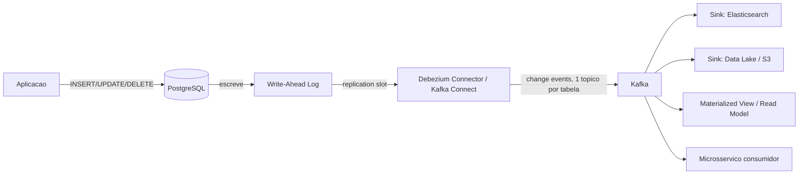

# CDC (Change Data Capture) com Debezium

> **Bloco:** Dados e persistência · **Nível:** Intermediário/Avançado · **Tempo de leitura:** ~24 min

## TL;DR

**Change Data Capture (CDC)** é a técnica de capturar, em tempo quase real, todas as mudanças de dados (INSERT, UPDATE, DELETE) que acontecem em um banco e disponibilizá-las como um **stream de eventos** para outros sistemas. O **Debezium** é a implementação open-source de referência de **CDC log-based**: ele lê o log de transações do banco (binlog do MySQL, WAL do PostgreSQL, oplog do MongoDB) e publica cada mudança em tópicos Kafka, sem impacto na aplicação e com baixo overhead na fonte. CDC resolve o **problema da dual-write** (manter dois sistemas em sincronia de forma confiável) e é a espinha dorsal de sincronização de réplicas derivadas, materialized views, data lakes, busca e o padrão Outbox. A grande sacada do log-based: captura *o que mudou e o estado anterior*, com baixíssimo impacto no banco fonte.

## O problema que resolve

O problema raiz chama-se **dual-write**: sempre que você precisa atualizar dois sistemas que não compartilham uma transação — por exemplo, gravar no banco *e* publicar um evento no Kafka, *e* indexar no Elasticsearch — não há como torná-los atômicos. Se a aplicação grava no banco e depois falha antes de publicar o evento, os sistemas divergem: o dado existe no banco mas o stream nunca soube. O inverso também: publica o evento, mas o commit do banco dá rollback — agora há um evento fantasma. Conforme descreve a Confluent, como os dois sistemas não estão ligados, não há forma de atualizá-los transacionalmente.

A tentação ingênua é fazer a aplicação escrever nos dois lados ("dual write"). É frágil e gera inconsistência sob falha parcial. CDC inverte o problema: em vez de a aplicação tentar coordenar duas escritas, ela escreve **apenas no banco** (uma operação transacional confiável), e o CDC observa o **log de transações** do banco — a fonte de verdade definitiva do que foi efetivamente commitado — e propaga cada mudança para os demais sistemas. Como o log só registra o que foi commitado, não há eventos fantasmas nem perdidos.

CDC também resolve necessidades amplas de **integração de dados em tempo real**: alimentar data warehouses/lakes sem ETL batch pesado e invasivo, sincronizar caches, manter índices de busca atualizados, replicar entre datacenters, auditoria, e materializar o padrão **Outbox** para microsserviços. O **Debezium** (open-source, hoje sob a Red Hat) tornou-se o padrão de facto, com conectores para MySQL, PostgreSQL, MongoDB, SQL Server, Oracle, Db2, Cassandra e outros.

## O que é (definição aprofundada)

CDC pode ser implementado de três formas, em ordem crescente de qualidade:

- **Query-based (polling/timestamp)**: periodicamente faz `SELECT ... WHERE updated_at > ultimo_check`. Simples, mas: não captura **DELETEs**, gera carga de polling na fonte, perde mudanças intermediárias entre dois polls, e tem latência alta. Inadequado para a maioria dos casos sérios.
- **Trigger-based**: triggers no banco gravam mudanças em uma tabela de auditoria. Captura tudo, mas adiciona overhead a cada transação e acopla a lógica de captura ao schema. Pesado.
- **Log-based**: lê diretamente o **log de transações** que o banco já mantém para durabilidade e replicação (binlog no MySQL, **WAL** no PostgreSQL via slot de replicação lógica, oplog no MongoDB, transaction log no SQL Server). É a abordagem do Debezium. Vantagens decisivas, conforme a Confluent: captura **inserts, updates e deletes**; fornece o **estado anterior** da linha (before/after); tem **latência baixa**; e **impacto mínimo** na fonte, pois reusa um mecanismo que o banco já mantém.

Termos-chave do Debezium:

- **Connector**: monitora um servidor de banco específico, captura mudanças e as grava em tópicos Kafka (tipicamente **um tópico por tabela**).
- **Kafka Connect**: o framework distribuído, escalável e tolerante a falhas onde os connectors rodam. É **configuration-driven** — não exige escrever código.
- **Snapshot**: ao iniciar, o connector tira um snapshot do estado atual da tabela (carga inicial) e depois passa a fazer streaming das mudanças. Suporta **incremental snapshots** disparáveis em runtime.
- **Change event**: a mensagem publicada, contendo `op` (c/u/d/r = create/update/delete/read), `before`, `after`, e metadados (LSN, timestamp, fonte).
- **Offsets**: o connector rastreia até onde leu o log, para retomar de onde parou após reinício (entrega at-least-once).

## Como funciona

Debezium herda durabilidade, confiabilidade e tolerância a falhas do Kafka e do Kafka Connect (arquitetura descrita em [debezium.io/.../architecture](https://debezium.io/documentation/reference/stable/architecture.html)).

Fluxo detalhado (PostgreSQL como exemplo):

1. A aplicação faz `INSERT/UPDATE/DELETE` e dá **commit**. O PostgreSQL escreve a mudança no **WAL** (Write-Ahead Log) — sua garantia de durabilidade.
2. O Debezium PostgreSQL connector mantém um **logical replication slot** e lê o WAL decodificado (via `pgoutput`/`wal2json`). Ele vê exatamente as mudanças commitadas, em ordem.
3. Para cada mudança, o connector monta um **change event** com `before` e `after` e o publica em um **tópico Kafka** específico daquela tabela (ex.: `dbserver.public.pedidos`).
4. **Consumidores** (sink connectors ou apps) assinam os tópicos: um indexa no Elasticsearch, outro alimenta o data lake, outro atualiza uma materialized view, outro reage a eventos de negócio.
5. O connector persiste **offsets** (posição no WAL) periodicamente. Em falha/restart, retoma do último offset — daí a semântica **at-least-once** (consumidores precisam ser **idempotentes**).

Ponto crítico de operação no PostgreSQL: o replication slot **segura o WAL** enquanto não for consumido. Se o Debezium ficar parado, o WAL acumula e pode **encher o disco** do banco. Monitorar lag do slot é obrigatório.

## Diagrama de fluxo



## Exemplo prático / caso real

**Marketplace brasileiro**: o catálogo de produtos é fonte da verdade no **PostgreSQL**, mas a busca precisa estar no **Elasticsearch** e o time de dados quer os produtos no **data lake** para analytics. Em vez de a aplicação escrever nos três (dual-write triplo, frágil), usa-se Debezium:

```text
Vendedor edita produto -> PostgreSQL.produtos (UPDATE, commit)
WAL registra a mudanca
Debezium PG connector -> topico Kafka "catalogo.public.produtos"
  - Elasticsearch sink connector -> reindexa o produto
  - S3 sink connector -> grava parquet no data lake (Delta/Iceberg)
  - Servico de recomendacao -> atualiza features
```

A busca passa a refletir mudanças do catálogo com latência de segundos, sem a aplicação nem saber que o Elasticsearch existe — total desacoplamento.

**Padrão Outbox com Debezium (fintech)**: para publicar eventos de domínio de forma confiável evitando dual-write, o serviço de Transferências grava, **na mesma transação local**, a mudança de negócio *e* uma linha numa tabela `outbox`. O Debezium captura inserts na tabela `outbox` (via Outbox Event Router do Debezium) e publica como eventos de domínio no Kafka. Como a escrita do estado e do outbox é uma única transação ACID, é impossível ter evento sem estado ou estado sem evento:

```text
BEGIN;
  UPDATE conta SET saldo = saldo - 500 WHERE id = origem;
  INSERT INTO outbox (aggregate, type, payload)
    VALUES ('Transferencia', 'TransferenciaIniciada', '{...}');
COMMIT;
-- Debezium le o WAL -> publica TransferenciaIniciada no Kafka
```

Tecnologias reais: **PostgreSQL/MySQL** como fonte, **Debezium** + **Kafka Connect**, **Kafka** (ou Confluent Cloud com connectors gerenciados), sinks para **Elasticsearch**, **S3/Delta Lake**, **Snowflake**.

## Quando usar / Quando evitar

**Quando usar:**

- Sincronizar réplicas derivadas (busca, cache, materialized views, data lake/warehouse) com baixa latência e sem invadir a aplicação.
- Implementar o padrão **Outbox** para publicação confiável de eventos em microsserviços (resolve dual-write).
- Migrações e replicação entre bancos/datacenters com downtime mínimo (snapshot + streaming).
- Alimentar pipelines de streaming/analytics a partir de bancos OLTP existentes sem reescrever as aplicações.

**Quando evitar:**

- Quando você controla o produtor de eventos e pode publicar eventos de domínio explícitos e bem desenhados na origem — CDC log-based expõe o schema *físico* do banco (nomes de coluna, estrutura interna), o que acopla consumidores a detalhes internos. (O Outbox mitiga isso publicando um payload de domínio, não a tabela crua.)
- Quando o ambiente não permite acesso ao log de transações ou habilitar replicação lógica (restrições de DBA/cloud gerenciado).
- Para necessidades batch simples e infrequentes, onde um ETL agendado é mais barato de operar do que toda a stack Kafka/Connect.

## Anti-padrões e armadilhas comuns

- **CDC do schema cru como contrato público**: consumir diretamente a tabela física acopla os consumidores ao schema interno do serviço dono. Renomear uma coluna quebra todo mundo. Prefira o **Outbox** (payload de domínio estável) quando o objetivo for eventos de negócio.
- **Dual-write disfarçado de CDC**: usar CDC mas ainda publicar eventos manualmente em paralelo. Escolha um caminho.
- **Ignorar idempotência nos consumidores**: a entrega é at-least-once; mensagens reentregues precisam ser tratadas (rastrear LSN/offset, upsert determinístico).
- **Não monitorar o replication slot (PostgreSQL)**: slot parado segura o WAL e enche o disco do banco fonte — pode derrubar a produção.
- **Esquecer da ordenação e de DELETEs/tombstones**: compaction de tópico, eventos de delete (`op=d`) e tombstones precisam ser tratados corretamente nos sinks.
- **Tratar o snapshot inicial como gratuito**: o snapshot de uma tabela enorme pode pesar na fonte; planeje janela e use incremental snapshots.
- **Evoluir schema sem cuidado**: mudanças de DDL na fonte precisam ser compatíveis com os consumidores; integre com um Schema Registry.

## Relação com outros conceitos

- **Outbox Pattern**: CDC é o mecanismo que lê a tabela outbox e publica os eventos de forma confiável, resolvendo o dual-write. Ver `02-database-per-service.md`.
- **Event-Driven Architecture (EDA)**: CDC é uma das principais fontes de eventos em arquiteturas orientadas a eventos. Ver bloco de Mensageria.
- **Materialized Views / CQRS**: CDC alimenta projeções e read models a partir do write model. Ver `04-materialized-views-e-projecoes.md`.
- **Polyglot Persistence**: CDC sincroniza stores heterogêneos (PostgreSQL → Elasticsearch). Ver `01-polyglot-persistence.md`.
- **Kappa Architecture**: o stream de mudanças do CDC é frequentemente o log imutável que serve de fonte única em arquiteturas Kappa. Ver `07-oltp-vs-olap-lambda-kappa.md`.
- **Data Lake / Lakehouse**: CDC alimenta o lake/lakehouse em near-real-time. Ver `06-data-lake-warehouse-mesh-lakehouse.md`.

## Referências

- [Debezium Architecture — Debezium Documentation](https://debezium.io/documentation/reference/stable/architecture.html)
- [Debezium connector for PostgreSQL — Debezium Documentation](https://debezium.io/documentation/reference/stable/connectors/postgresql.html)
- [Debezium Features — Debezium Documentation](https://debezium.io/documentation/reference/stable/features.html)
- [What Is Change Data Capture (CDC)? — Confluent](https://www.confluent.io/learn/change-data-capture/)
- [Log-Based vs. Query-Based CDC for Apache Kafka — Confluent Developer](https://developer.confluent.io/courses/data-pipelines/cdc-data-from-rdbms-into-kafka/)
- [Pattern: Transactional outbox — microservices.io (Chris Richardson)](https://microservices.io/patterns/data/transactional-outbox.html)
- [Designing Data-Intensive Applications — Martin Kleppmann (site oficial)](https://dataintensive.net/)
