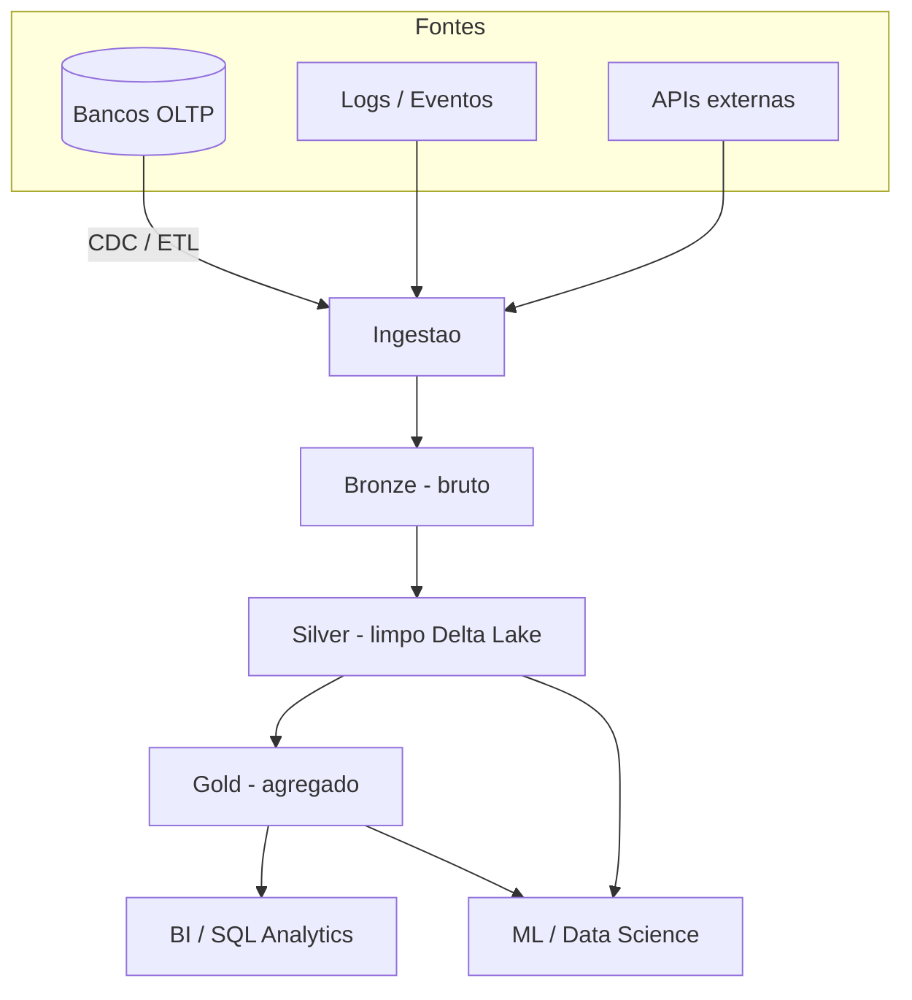

# Data Lake, Data Warehouse, Data Mesh e Lakehouse

> **Bloco:** Dados e persistência · **Nível:** Intermediário/Avançado · **Tempo de leitura:** ~25 min

## TL;DR

Quatro paradigmas de plataforma de dados analíticos, em evolução histórica e conceitual. **Data Warehouse**: store centralizado, estruturado, schema-on-write, otimizado para BI e SQL — confiável e performático, mas caro e rígido. **Data Lake**: repositório de dados brutos em qualquer formato sobre object storage barato, schema-on-read — flexível e barato, mas propenso a virar um "data swamp" sem governança. **Lakehouse**: convergência que traz garantias de warehouse (transações ACID, schema enforcement, governança) para cima do storage barato e aberto do lake, via camadas como **Delta Lake** (Databricks) — o melhor dos dois mundos na camada técnica. **Data Mesh**: uma mudança *organizacional* (não tecnológica), proposta por **Zhamak Dehghani**, que descentraliza a propriedade dos dados por domínio, tratando dados como produto. Os três primeiros são *arquiteturas técnicas*; o Mesh é um *paradigma sociotécnico* ortogonal a eles.

## O problema que resolve

Cada paradigma nasceu resolvendo as limitações do anterior.

**Data Warehouse** (anos 1980-90, Bill Inmon, Ralph Kimball): empresas precisavam consolidar dados de múltiplos sistemas operacionais para análise e relatórios (BI). A resposta foi um repositório central, integrado, estruturado e historiado, com **schema-on-write** — você define o schema e modela (star/snowflake schema) *antes* de carregar, via processos **ETL**. Performa bem para SQL analítico e garante qualidade. Limitações: caro (armazenamento e compute acoplados, proprietário), rígido (mudar schema é custoso), inadequado para dados não-estruturados (texto, imagem, log) e para ML.

**Data Lake** (anos 2010, era Hadoop/big data, depois cloud object storage): a explosão de volume, variedade e velocidade tornou inviável estruturar tudo antecipadamente. O lake propõe armazenar **tudo, bruto, no formato nativo**, em storage barato (HDFS, depois S3/ADLS/GCS), com **schema-on-read** — você interpreta o schema só na hora de ler. Barato e flexível. Mas sem disciplina, vira **data swamp**: dados sem catálogo, sem qualidade, sem governança, ninguém sabe o que tem nem confia no que tem. Sem transações ACID, sem schema enforcement, consultas analíticas confiáveis sobre o lake eram frágeis.

**Lakehouse** (2020, Databricks): a tese, publicada no paper do CIDR/VLDB 2020, é que a separação warehouse vs. lake gerava duplicação cara (dados copiados do lake para o warehouse) e silos. O lakehouse implementa **features de warehouse — transações ACID, schema enforcement, governança, performance de BI — diretamente sobre o storage barato e de formato aberto do lake**, via uma camada transacional como **Delta Lake** (também Apache Iceberg, Apache Hudi). Unifica BI e ML/data science na mesma plataforma.

**Data Mesh** (2019, **Zhamak Dehghani**, Thoughtworks): o problema aqui *não é técnico, é organizacional*. No artigo seminal [How to Move Beyond a Monolithic Data Lake to a Distributed Data Mesh](https://martinfowler.com/articles/data-monolith-to-mesh.html), Dehghani argumenta que data lakes e warehouses centralizados criam um gargalo organizacional: um único time central de dados, sem conhecimento de domínio, vira o intermediário de toda análise, e não escala. A solução é aplicar os aprendizados de microsserviços e DDD aos dados: **descentralizar a propriedade dos dados por domínio**.

## O que é (definição aprofundada)

**Data Warehouse**: repositório central, estruturado, **schema-on-write**, modelado dimensionalmente (fatos e dimensões), otimizado para SQL analítico (OLAP). Exemplos cloud-native que separam storage de compute: **Snowflake**, **Google BigQuery**, **Amazon Redshift**, **Azure Synapse**.

**Data Lake**: repositório que armazena dados estruturados, semi-estruturados e não-estruturados em formato bruto, **schema-on-read**, sobre object storage barato. Exemplos: **Amazon S3**, **Azure Data Lake Storage**, **Google Cloud Storage**, com engines de query como Athena/Presto/Trino/Spark por cima.

**Lakehouse**: arquitetura que, segundo a Databricks, "implementa features de data warehouse — como transações ACID, schema enforcement e governança — diretamente sobre o storage de baixo custo e formato aberto de um data lake". A peça-chave é a **camada de tabela transacional**:

- **Delta Lake** (Databricks, open source): estende arquivos **Parquet** com um **transaction log** baseado em arquivos, que dá ACID, time travel (versionamento), schema enforcement/evolution e metadata escalável.
- **Apache Iceberg** e **Apache Hudi**: alternativas abertas com objetivos similares.

Padrão de organização do lakehouse: arquitetura **medallion** (camadas Bronze = bruto, Silver = limpo/conformado, Gold = agregado/pronto para consumo).

**Data Mesh**: paradigma sociotécnico assente em quatro princípios (Dehghani, [Data Mesh Principles and Logical Architecture](https://martinfowler.com/articles/data-mesh-principles.html)):

1. **Domain-oriented ownership**: os dados analíticos pertencem aos times de domínio que os geram e os conhecem, não a um time central. Aplicação de bounded context aos dados.
2. **Data as a product**: cada domínio expõe seus dados como um **produto** — descobrível, endereçável, confiável, com SLAs, documentação e qualidade. Há um "data product owner".
3. **Self-serve data platform**: uma plataforma de dados self-service permite que os domínios criem e operem seus data products sem depender de especialistas de infra.
4. **Federated computational governance**: governança federada e automatizada (políticas computacionais embutidas) garante interoperabilidade e padrões globais sem centralizar a execução.

Ponto crucial: **Data Mesh é ortogonal às tecnologias de storage**. Você pode implementar um mesh onde cada domínio usa um lakehouse, ou warehouse, ou lake. Mesh é sobre *quem é dono e como se organiza*, não sobre *qual ferramenta*.

## Como funciona

- **Warehouse (ETL)**: extrai dos sistemas-fonte → transforma/conforma (limpa, modela em star schema) → carrega no warehouse. Schema definido antes. Pesado e batch.
- **Lake (ELT)**: extrai → **carrega bruto** no object storage → transforma sob demanda, no momento da query ou em pipelines downstream. O schema é aplicado na leitura. A flexibilidade vem de não decidir nada cedo demais.
- **Lakehouse**: ingere dados (batch ou streaming via CDC/Kafka) no storage aberto, escreve via Delta Lake que registra a transação no log de arquivos (garantindo ACID e atomicidade mesmo com escritas concorrentes), e organiza em Bronze→Silver→Gold. BI lê o Gold via SQL com performance de warehouse; data scientists leem o mesmo dado para ML — sem cópia entre sistemas.
- **Mesh**: cada domínio publica data products no seu próprio storage (frequentemente lakehouses), seguindo padrões globais de interoperabilidade definidos pela governança federada. Consumidores descobrem produtos via um catálogo e os consomem via interfaces padronizadas, sem passar por um time central.

## Diagrama de fluxo

## Exemplo prático / caso real

**Fintech brasileira** evoluindo sua plataforma de dados:

- **Fase 1 — Warehouse**: começou com **BigQuery** (ou Snowflake) recebendo cargas ETL noturnas dos bancos OLTP (PostgreSQL). Relatórios regulatórios (Bacen), BI de produto e dashboards de risco rodam em SQL. Funciona, mas: dados de log de app e eventos de clickstream não cabem bem; e o time de ML reclama que não tem acesso a dados brutos para feature engineering.
- **Fase 2 — adiciona Lake**: passa a despejar tudo em **S3** (logs, eventos via Kafka, snapshots brutos via CDC/Debezium). Barato e flexível, mas vira parcialmente um swamp — ninguém confia na qualidade, queries ad-hoc dão resultados inconsistentes, não há ACID.
- **Fase 3 — Lakehouse**: adota **Databricks + Delta Lake** sobre o S3. Organiza em medallion: Bronze (CDC bruto de transações), Silver (transações limpas e deduplicadas, com ACID e schema enforcement), Gold (agregados de risco, LTV, fraude). BI consome o Gold via SQL; modelos de antifraude treinam direto no Silver. Uma plataforma só, sem copiar dados para um warehouse separado.
- **Fase 4 — Data Mesh** (quando a empresa cresce e o time central de dados vira gargalo): descentraliza. O domínio "Pagamentos" passa a ser dono e a publicar o data product "transações_pix" (com SLA, schema versionado, qualidade monitorada); o domínio "Crédito" publica "score_risco"; o domínio "Marketing" consome ambos sem depender do time central. A plataforma Databricks vira o self-serve; um catálogo (Unity Catalog) e políticas federadas garantem governança.

Note que Mesh não substituiu o lakehouse — ele reorganizou *quem é dono* dos dados que vivem no lakehouse.

## Quando usar / Quando evitar

- **Data Warehouse**: use quando o foco é BI/SQL sobre dados majoritariamente estruturados, com forte necessidade de governança e performance de consulta. Evite como repositório único se você tem grande volume de dados não-estruturados ou cargas pesadas de ML.
- **Data Lake (puro)**: use para armazenar volumes massivos e heterogêneos a baixo custo, como camada de ingestão bruta. Evite usá-lo como fonte de verdade analítica sem uma camada de governança/transação — vira swamp.
- **Lakehouse**: use quando quer unificar BI e ML sem duplicar dados, sobre storage aberto e barato, mantendo garantias transacionais. Excelente default moderno para plataformas de dados greenfield de porte médio/grande.
- **Data Mesh**: use quando a organização é grande, multi-domínio, e o time central de dados virou gargalo que não escala. **Evite** em empresas pequenas/médias — o overhead organizacional (data product owners, plataforma self-serve, governança federada) não se paga, e você só adiciona complexidade. Mesh é resposta a um problema de *escala organizacional*, não técnico.

## Anti-padrões e armadilhas comuns

- **Data swamp**: lake sem catálogo, governança, qualidade nem ownership. Vira um cemitério de arquivos em que ninguém confia. A causa raiz que motivou tanto o lakehouse quanto o data mesh.
- **Tratar Data Mesh como uma tecnologia/produto**: vendors vendem "plataformas de data mesh". Mesh é um paradigma organizacional; comprar uma ferramenta sem mudar a propriedade dos dados por domínio não é mesh — é marketing.
- **Data Mesh prematuro**: aplicar descentralização em uma empresa pequena, onde um único time de dados ainda dá conta. Você importa todo o custo de coordenação sem o problema de escala que o justifica.
- **Lakehouse sem disciplina de camadas**: ignorar Bronze/Silver/Gold e jogar tudo numa camada só reproduz o swamp, agora com ACID.
- **ETL pesado e invasivo na fonte OLTP**: cargas batch que competem com a transação de produção. Prefira CDC para ingestão near-real-time e de baixo impacto.
- **Copiar dados entre lake e warehouse indefinidamente**: a duplicação cara e dessincronizada que o lakehouse veio justamente eliminar.

## Relação com outros conceitos

- **OLTP vs OLAP**: warehouse/lake/lakehouse são todos sistemas **OLAP**, alimentados a partir dos sistemas **OLTP**. Ver `07-oltp-vs-olap-lambda-kappa.md`.
- **CDC**: o mecanismo moderno de ingestão near-real-time dos bancos OLTP para o lake/lakehouse. Ver `05-cdc-change-data-capture-debezium.md`.
- **Data Mesh ↔ Database per Service / DDD**: o mesh aplica bounded context e propriedade por domínio (de microsserviços) à camada analítica. Ver `02-database-per-service.md`.
- **Lambda/Kappa**: as arquiteturas de processamento que alimentam essas plataformas com batch e/ou streaming. Ver `07-oltp-vs-olap-lambda-kappa.md`.
- **Polyglot Persistence**: a coexistência de stores OLTP e plataformas OLAP é persistência poliglota em nível de plataforma. Ver `01-polyglot-persistence.md`.

## Referências

- [How to Move Beyond a Monolithic Data Lake to a Distributed Data Mesh — Zhamak Dehghani (martinfowler.com)](https://martinfowler.com/articles/data-monolith-to-mesh.html)
- [Data Mesh Principles and Logical Architecture — Zhamak Dehghani (martinfowler.com)](https://martinfowler.com/articles/data-mesh-principles.html)
- [Data Mesh: Delivering data-driven value at scale — Thoughtworks](https://www.thoughtworks.com/insights/books/data-mesh)
- [What Is a Lakehouse? — Databricks Blog](https://www.databricks.com/blog/2020/01/30/what-is-a-data-lakehouse.html)
- [What is a data lakehouse? — Databricks on AWS (docs)](https://docs.databricks.com/aws/en/lakehouse)
- [What is Delta Lake in Databricks? — Databricks on AWS (docs)](https://docs.databricks.com/aws/en/delta/)
- [Designing Data-Intensive Applications — Martin Kleppmann (site oficial)](https://dataintensive.net/)
