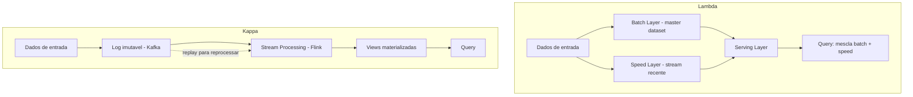

# OLTP vs OLAP e Arquiteturas de Processamento (Lambda, Kappa)

> **Bloco:** Dados e persistência · **Nível:** Intermediário/Avançado · **Tempo de leitura:** ~24 min

## TL;DR

**OLTP** (Online Transaction Processing) e **OLAP** (Online Analytical Processing) são dois mundos de workload com requisitos opostos: OLTP serve muitas transações pequenas, rápidas, de leitura/escrita por chave (o operacional — pedidos, pagamentos); OLAP serve poucas consultas grandes, de agregação sobre volumes massivos (o analítico — relatórios, BI, ML). Misturá-los no mesmo banco é receita para desastre. Para alimentar o lado analítico em tempo real surgiram duas arquiteturas de processamento: **Lambda** (Nathan Marz) combina uma **batch layer** (precisa, lenta) com uma **speed layer** (aproximada, rápida), unificadas numa **serving layer** — robusta mas com a dor de manter *dois códigos* para a mesma lógica; e **Kappa** (Jay Kreps) elimina o batch e processa **tudo como stream** sobre um log imutável e reprocessável — mais simples de manter, mas exige um log durável e capacidade de reprocessamento.

## O problema que resolve

### OLTP vs OLAP

A primeira separação fundamental em arquitetura de dados. Um sistema transacional (OLTP) e um analítico (OLAP) têm perfis de carga **antagônicos**:

| Dimensão | OLTP | OLAP |
| --- | --- | --- |
| Padrão de acesso | Muitas operações pequenas, por chave | Poucas queries grandes, varrendo muitas linhas |
| Operação típica | Ler/escrever poucos registros por transação | Agregar/sumarizar milhões de linhas |
| Latência | Milissegundos, alta concorrência | Segundos a minutos, baixa concorrência |
| Modelo de dados | Normalizado (evita anomalias de escrita) | Desnormalizado / dimensional (otimiza leitura) |
| Volume escrita | Alto (transações) | Baixo (cargas batch/stream) |
| Exemplos | PostgreSQL, MySQL, MongoDB | Snowflake, BigQuery, Redshift, Databricks |

Rodar relatórios analíticos pesados no mesmo banco que processa pedidos é um anti-padrão clássico: a query de OLAP varre tabelas inteiras, segura locks, satura I/O e degrada a latência das transações de produção (e vice-versa). A separação OLTP/OLAP é o motivo de existirem data warehouses, lakes e lakehouses — sistemas OLAP dedicados, alimentados a partir dos OLTP. Daí nasce a pergunta: **como mover e processar os dados do OLTP para o OLAP**, idealmente em tempo quase real? É o que Lambda e Kappa respondem.

### Lambda

Antes de 2011, você tinha duas opções ruins: batch (preciso mas defasado em horas) ou stream (rápido mas aproximado e frágil). **Nathan Marz**, criador do Apache Storm na época do Twitter/BackType, cunhou a **Lambda Architecture** (em seu blog, 2011; formalizada no livro *Big Data*, com James Warren, Manning) para ter as duas coisas: a precisão e completude do batch e a baixa latência do stream, no mesmo pipeline.

### Kappa

Em 2014, **Jay Kreps** (criador do Apache Kafka na LinkedIn) publicou [Questioning the Lambda Architecture](https://www.oreilly.com/radar/questioning-the-lambda-architecture/) no O'Reilly Radar. Sua crítica central: manter **duas bases de código** (uma batch, uma stream) que implementam a *mesma* lógica de negócio é uma fonte permanente de bugs, custo e divergência. Ele propôs a **Kappa Architecture** — eliminar o batch e fazer tudo via stream sobre um log durável e reprocessável. Kreps brincou que talvez fosse simples demais para merecer uma letra grega.

## O que é (definição aprofundada)

### Lambda Architecture — três camadas

- **Batch layer**: gerencia o **master dataset** (o conjunto imutável e append-only de todos os dados brutos) e pré-computa **batch views** a partir dele, usando processamento distribuído (historicamente Hadoop/MapReduce, depois Spark). É **preciso e completo**, pois processa todos os dados — mas **lento** (roda periodicamente, latência de horas).
- **Speed layer**: compensa a alta latência da batch layer processando **apenas os dados recentes** em streaming (Storm, depois Spark Streaming/Flink), produzindo **real-time views** *aproximadas/incrementais*. Baixa latência, mas só cobre a janela desde a última execução do batch.
- **Serving layer**: indexa as batch views (e expõe as real-time views) para consulta. Uma query consulta **ambas** e **mescla** o resultado: a parte histórica vem do batch (precisa), a parte recente vem do speed (rápida). Quando o batch reprocessa, ele "corrige" eventuais aproximações do speed.

### Kappa Architecture — uma camada

- Um único **log de eventos imutável e durável** (tipicamente **Kafka**) é a fonte canônica de toda a verdade — todos os dados brutos entram aqui, em ordem, e ficam retidos.
- Um único **stream processing layer** (Flink, Kafka Streams, Spark Structured Streaming) processa o log e materializa as views de saída.
- Não há batch layer separada. **Reprocessamento** (o equivalente ao "recompute" do batch da Lambda) é feito **reproduzindo o log do início** (ou de um offset) com uma nova versão do código ou um novo job, escrevendo numa nova view, e cortando o tráfego para ela quando pronta. Mesmo código, um caminho só.

Termos-chave: **master dataset / log imutável** (a verdade append-only), **view** (resultado materializado), **reprocessamento** (recomputar views a partir dos dados brutos — barato e seguro quando os dados de origem são imutáveis).

## Como funciona

A grande ideia compartilhada por ambas: **trate os dados de entrada como imutáveis e append-only**, e derive as views como funções desses dados. Se a lógica muda ou uma view corrompe, você recomputa a partir da fonte imutável. A diferença é *como* você recomputa.

- **Lambda**: dois mecanismos de recompute. O batch recomputa periodicamente do master dataset (caminho lento e completo); o speed cobre o gap recente. A query mescla os dois. Custo: a *mesma* transformação precisa existir em duas tecnologias/códigos diferentes (batch e stream), e os resultados precisam reconciliar.
- **Kappa**: um mecanismo. Para recomputar, você sobe um novo job de streaming lendo o log desde o offset desejado, ele gera a nova view, e você faz cutover. O log precisa reter dados o suficiente (ou ter um tier de cold storage) para permitir o replay.

## Diagrama de fluxo



## Exemplo prático / caso real

**Marketplace brasileiro** que quer um painel de "vendas e tendências em tempo real" e, ao mesmo tempo, relatórios financeiros precisos.

**Separação OLTP/OLAP**: os pedidos nascem no **PostgreSQL** (OLTP). Em vez de rodar os relatórios ali (degradaria o checkout), os dados fluem via **CDC/Debezium → Kafka** para a camada analítica.

**Abordagem Lambda**:

```text
Batch layer: job Spark noturno le todos os pedidos historicos (data lake)
  -> calcula GMV preciso por categoria/regiao -> batch view no BigQuery
Speed layer: Flink consome o stream de pedidos do dia
  -> incrementa GMV aproximado -> real-time view no Redis
Serving: dashboard soma "GMV historico (batch) + GMV de hoje (speed)"
```

Problema sentido na prática: a regra de "o que conta como venda válida" (excluir estornos, fraude) está implementada *duas vezes* — em Spark/SQL no batch e em Java/Flink no speed. Elas divergem, e o número do dashboard não bate com o relatório financeiro. É exatamente a dor que Kreps apontou.

**Abordagem Kappa**:

```text
Todos os eventos de pedido/estorno/fraude -> Kafka (log retido)
Um unico job Flink consome o log -> materializa GMV por categoria
  (mesma logica para historico e tempo real)
Para mudar a regra de "venda valida":
  -> nova versao do job le o log desde o inicio -> nova view -> cutover
```

Uma lógica, um código, sem reconciliação. O custo é manter o log do Kafka retido (ou tier para S3) longo o suficiente para reprocessar. Tecnologias reais: **Kafka** (log), **Flink** ou **Kafka Streams** (processamento), sink para **BigQuery/Snowflake/Databricks** (OLAP), **Redis** (views quentes de baixa latência).

## Quando usar / Quando evitar

- **Separação OLTP/OLAP**: praticamente sempre, em qualquer sistema com necessidades analíticas reais. Não rode OLAP pesado no banco transacional de produção.
- **Lambda**: faz sentido quando você *precisa* tanto de exatidão garantida em batch (ex.: fechamento contábil/regulatório que não tolera aproximação) quanto de baixa latência, e a tecnologia de streaming disponível não dá a robustez/exatidão necessária sozinha. Hoje é cada vez menos comum, mas ainda aparece em contextos legados ou de altíssima exigência de reconciliação batch.
- **Kappa**: o default moderno quando o stream processing maduro (Flink, exactly-once) atende seus requisitos de exatidão, e você quer evitar a duplicação de código. Exige um log durável e reprocessável (Kafka) e disciplina de schema/replay.
- **Evite Lambda** se a complexidade de manter dois pipelines não se justifica — na maioria dos casos atuais, Kappa ou um pipeline de streaming simples bastam. **Evite Kappa** se você não tem como reter/reproduzir o log de forma confiável, ou se há cargas genuinamente batch-only (treino de ML pesado) que não cabem num modelo de stream.

## Anti-padrões e armadilhas comuns

- **Rodar OLAP no banco OLTP**: relatórios pesados competindo com transações de produção. Saturam I/O, seguram locks, degradam latência. Separe os sistemas.
- **Lógica duplicada divergente (a dor da Lambda)**: a mesma regra de negócio implementada em batch e em stream que dão respostas diferentes. É a crítica central de Kreps.
- **Kappa sem retenção/replay adequados**: prometer reprocessamento mas não reter o log o suficiente. Sem o log, não há como recomputar — você perdeu a fonte da verdade.
- **Dados de entrada mutáveis**: ambas as arquiteturas dependem de a fonte ser imutável/append-only. Se você sobrescreve dados de entrada, o reprocessamento não reproduz o passado.
- **Stream sem garantia de exatidão onde ela importa**: usar processamento at-least-once sem deduplicação para números financeiros gera contagem dupla.
- **Adotar Lambda/Kappa por hype para volumes modestos**: um job batch simples ou um pipeline de streaming direto resolvem muitos casos sem o peso conceitual dessas arquiteturas.

## Relação com outros conceitos

- **Data Lake / Warehouse / Lakehouse**: são os destinos OLAP que Lambda/Kappa alimentam. Ver `06-data-lake-warehouse-mesh-lakehouse.md`.
- **CDC**: a forma de extrair mudanças do OLTP e alimentar o log/stream sem invadir a produção; o stream de CDC frequentemente *é* o log da Kappa. Ver `05-cdc-change-data-capture-debezium.md`.
- **Event Sourcing / log imutável**: a Kappa é, em essência, Event Sourcing em escala de plataforma de dados. Ver bloco de Sistemas Distribuídos.
- **Materialized Views / CQRS**: as "views" de Lambda/Kappa são materializações; o conceito é o mesmo de projeções de leitura. Ver `04-materialized-views-e-projecoes.md`.
- **Mensageria e streaming (Kafka)**: a infraestrutura que viabiliza a Kappa. Ver bloco de Mensageria.

## Referências

- [Questioning the Lambda Architecture — Jay Kreps (O'Reilly Radar)](https://www.oreilly.com/radar/questioning-the-lambda-architecture/)
- [Lambda architecture — Wikipedia](https://en.wikipedia.org/wiki/Lambda_architecture)
- [What is Lambda Architecture? — Dremio](https://www.dremio.com/wiki/lambda-architecture/)
- [What is a data lakehouse? — Databricks on AWS (docs)](https://docs.databricks.com/aws/en/lakehouse)
- [What Is Change Data Capture (CDC)? — Confluent](https://www.confluent.io/learn/change-data-capture/)
- [Designing Data-Intensive Applications — Martin Kleppmann (site oficial)](https://dataintensive.net/)
