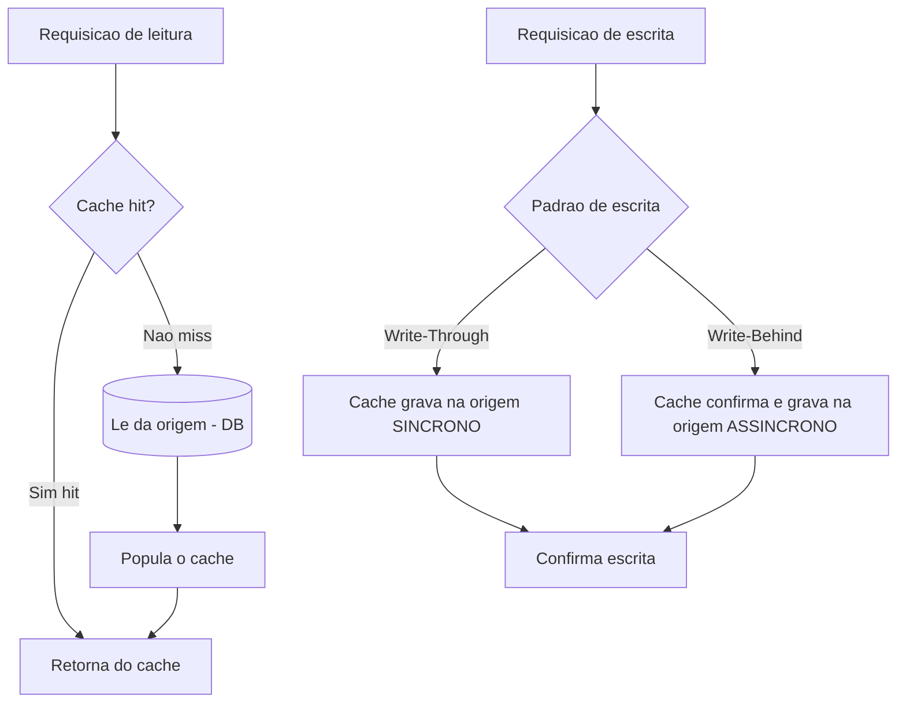

# Cache Patterns: Cache-Aside, Write-Through, Write-Behind, Refresh-Ahead

> **Bloco:** Dados e persistência · **Nível:** Intermediário/Avançado · **Tempo de leitura:** ~23 min

## TL;DR

Caching troca **consistência por latência e throughput**: você guarda uma cópia de dados caros de obter num store rápido (memória, Redis) e aceita que essa cópia pode ficar desatualizada. Os quatro padrões fundamentais diferem em *quem* lê/escreve no cache e na origem, e *quando*: **Cache-Aside** (lazy loading) — a aplicação gerencia o cache, carregando sob demanda no miss; **Write-Through** — toda escrita passa pelo cache que sincronamente grava na origem (cache sempre fresco, escrita mais lenta); **Write-Behind/Write-Back** — escreve no cache e persiste na origem de forma *assíncrona* (escrita rápida, risco de perda); **Refresh-Ahead** — recarrega proativamente entradas quentes *antes* de expirarem (esconde latência de reload, gasta recursos). A taxonomia clássica vem da documentação do Oracle Coherence. As armadilhas mais perigosas são **invalidação incorreta** e **cache stampede**.

## O problema que resolve

Acessar a fonte de verdade (banco relacional, serviço remoto) é caro: latência de disco/rede, CPU de queries complexas, carga sobre um recurso de escala limitada. Em cargas read-heavy — a maioria — o mesmo dado é lido muitas vezes. Recomputar/rebuscar tudo a cada leitura é desperdício.

**Cache** resolve guardando uma cópia em um store rápido e próximo (memória local, Redis, Memcached) para servir leituras subsequentes sem tocar a origem. Os ganhos: **latência menor** (memória vs. disco/rede), **throughput maior** e **menos carga sobre a origem** (protege o banco de saturar). A Microsoft observa que o caching funciona melhor para dados relativamente estáticos ou lidos com frequência.

O custo fundamental: o dado no cache é uma **cópia** que pode divergir da origem. Toda a engenharia de caching gira em torno de **quando e como manter cache e origem coerentes** — políticas de expiração (TTL), invalidação, e os padrões de leitura/escrita abaixo. Como diz o adágio: "há duas coisas difíceis em CS — invalidação de cache e nomear coisas".

A taxonomia canônica desses padrões aparece na documentação do **Oracle Coherence** ([Read-Through, Write-Through, Write-Behind and Refresh-Ahead Caching](https://docs.oracle.com/cd/E16459_01/coh.350/e14510/readthrough.htm)), e os mesmos conceitos estão no [Azure Architecture Center](https://learn.microsoft.com/en-us/azure/architecture/patterns/cache-aside).

## O que é (definição aprofundada)

### Cache-Aside (Lazy Loading)

A **aplicação** é responsável por gerenciar o cache; o cache não conhece a origem. Fluxo de leitura: tenta ler do cache; se **hit**, retorna; se **miss**, lê da origem, **popula o cache** e retorna. Escrita: a aplicação escreve na origem e **invalida** (ou atualiza) a entrada do cache. É o padrão mais comum e flexível. Carregamento **lazy** — só entra no cache o que é efetivamente requisitado. Resiliente: se o cache cair, a aplicação ainda funciona indo direto à origem (com mais latência).

### Read-Through

Variante onde o **cache** (e não a aplicação) sabe carregar da origem no miss, via um *cache loader*. A aplicação só fala com o cache; o cache busca na origem transparentemente. Conceptualmente parente do cache-aside, mas com a responsabilidade de load delegada ao cache.

### Write-Through

Toda **escrita** passa pelo cache, que a propaga **sincronamente** para a origem *antes* de confirmar. Cache e origem ficam sempre coerentes na escrita (o cache nunca tem dado mais novo que a origem). Custo: a latência de escrita inclui a gravação na origem — escrita mais lenta. Bom quando a consistência do cache importa e leituras logo após escrita são frequentes.

### Write-Behind (Write-Back)

Escreve no cache e confirma **imediatamente**; a persistência na origem acontece de forma **assíncrona** (em lote, com algum atraso). A documentação do Coherence destaca que write-behind pode entregar throughput consideravelmente maior e latência menor que write-through, além de **reduzir a carga no banco** (menos escritas, agrupadas/coalescidas). O preço: **risco de perda de dados** se o cache cair antes de persistir, e uma janela em que origem está desatualizada em relação ao cache.

### Refresh-Ahead

O cache **recarrega proativa e assincronamente** entradas recentemente acessadas *antes* de elas expirarem. Conforme o Coherence, é especialmente útil quando objetos são acessados por muitos usuários: o valor permanece fresco no cache e evita-se a latência (e o stampede) que ocorreria quando uma entrada quente expira e todos batem na origem ao mesmo tempo. Custo: recarrega entradas que talvez não fossem mais necessárias, gastando recursos.

## Como funciona

A diferença prática entre os padrões está no caminho de cada operação:

- **Cache-Aside (leitura)**: `valor = cache.get(k)`; se nulo → `valor = db.get(k)`; `cache.set(k, valor, ttl)`; retorna. (Lógica vive na aplicação.)
- **Write-Through (escrita)**: `cache.set(k, v)` → o cache, sincronamente, `db.write(k, v)` → confirma só depois.
- **Write-Behind (escrita)**: `cache.set(k, v)` → confirma já; uma fila/buffer agenda `db.write` em lote depois.
- **Refresh-Ahead**: ao acessar uma entrada cujo TTL está próximo de expirar (dentro de um fator configurável), o cache dispara um reload assíncrono em background, servindo o valor atual enquanto atualiza.

Read-through/write-through (e variantes) tipicamente operam com topologia de cache distribuído/particionado (no Coherence, Partitioned/Near cache). Combinações são comuns: **read-through + write-behind**, ou **cache-aside + refresh-ahead** para entradas quentes.

## Diagrama de fluxo



## Exemplo prático / caso real

**E-commerce brasileiro** usando **Redis** como cache e **PostgreSQL** como origem.

- **Cache-Aside para página de produto** (leitura intensa, muda pouco): ao abrir um produto, a aplicação tenta o Redis; no miss, busca no PostgreSQL, popula o Redis com TTL de 5 min, retorna. Quando o vendedor edita o produto, a aplicação **invalida** a chave no Redis (`DEL produto:123`). Resiliente: se o Redis cair, o site fica mais lento mas funciona.

```text
GET produto:123 no Redis
  hit  -> retorna
  miss -> SELECT no PostgreSQL -> SET produto:123 (ttl 300s) -> retorna
edicao do produto -> UPDATE no PostgreSQL -> DEL produto:123
```

- **Write-Through para o saldo de pontos de fidelidade** (precisa estar coerente no cache, lido logo após mudar): toda atualização de pontos grava no Redis *e* sincronamente no PostgreSQL. Leituras subsequentes do saldo vêm do cache já correto.

- **Write-Behind para contador de visualizações de produto** ("X pessoas viram isto"): incrementos vão para o Redis e são persistidos no PostgreSQL em lote a cada 30s. Aceita-se perder alguns incrementos num crash (não é crítico) em troca de throughput altíssimo e proteção do banco contra milhões de UPDATEs.

- **Refresh-Ahead para o catálogo da home / produtos em destaque** (entradas quentes, acessadas por todos): o cache recarrega esses itens antes do TTL expirar, evitando que, no instante da expiração, milhares de requests simultâneos batam no PostgreSQL ao mesmo tempo (stampede) na Black Friday.

## Quando usar / Quando evitar

- **Cache-Aside**: default para a maioria dos cenários de leitura. Use quando o padrão de acesso é imprevisível e você quer só cachear o que é pedido. Cuidado com a janela entre escrita na origem e invalidação do cache (leituras stale).
- **Write-Through**: use quando o cache precisa estar sempre coerente e há leituras frequentes logo após escritas. Evite quando a latência de escrita é crítica e a origem é lenta.
- **Write-Behind**: use para escrita de altíssimo volume tolerante a pequena perda/atraso (contadores, métricas, logs). **Evite** para dados que não podem ser perdidos (financeiro, pedidos) — o risco de perda num crash é real.
- **Refresh-Ahead**: use para um conjunto pequeno e identificável de entradas quentes muito acessadas. Evite aplicar a tudo — recarregar proativamente dados frios desperdiça recursos.
- **Não cacheie** dados que mudam a cada leitura, dados altamente personalizados de baixo reuso, ou onde a consistência forte é inegociável e o stale é inaceitável.

## Anti-padrões e armadilhas comuns

- **Cache stampede (thundering herd)**: uma entrada quente expira e milhares de requests sofrem miss simultâneo, todos batendo na origem ao mesmo tempo, derrubando o banco. Mitigações: **refresh-ahead**, **lock/single-flight** (só um request recarrega, os outros esperam), TTL com jitter (variar o TTL para não expirarem todos juntos), e *probabilistic early expiration*.
- **Invalidação incorreta / dados stale**: esquecer de invalidar o cache numa escrita deixa dado velho servindo indefinidamente. O bug mais comum e insidioso de caching.
- **Dual-write inconsistente (cache + DB)**: escrever no cache e no DB sem ordem/atomicidade clara leva a divergência sob falha. Em cache-aside, prefira **invalidar** (não atualizar) o cache após escrever na origem, para evitar gravar valor errado por race condition.
- **TTL eterno ou ausente**: sem expiração e sem invalidação confiável, o cache acumula lixo desatualizado.
- **Write-behind para dados críticos**: usar write-back para pedidos/pagamentos e perder dados num crash do cache. Inaceitável.
- **Cachear tudo indiscriminadamente**: cache de dados de baixo reuso só adiciona latência (miss sempre) e custo de memória.
- **Ignorar a queda do cache**: se a aplicação trava quando o Redis cai (em vez de cair para a origem), o cache virou ponto único de falha. Cache-aside é resiliente; desenhe para degradar, não falhar.
- **No-caching antipattern**: o oposto — recomputar tudo sempre, saturando a origem em cargas read-heavy onde caching seria trivial.

## Relação com outros conceitos

- **Read Replicas / Sharding**: caching reduz a pressão de leitura, frequentemente adiando a necessidade de réplicas ou sharding. Ver `03-read-replicas-sharding-particionamento.md`.
- **CQRS / Materialized Views**: read models materializados são, conceitualmente, um cache pré-computado e persistido alimentado por eventos. Ver `04-materialized-views-e-projecoes.md`.
- **ACID vs BASE**: cache introduz consistência eventual por natureza (a cópia diverge da origem). Ver `09-acid-vs-base.md`.
- **CDC**: pode invalidar/atualizar caches de forma confiável ao reagir a mudanças do banco fonte. Ver `05-cdc-change-data-capture-debezium.md`.
- **Polyglot Persistence**: Redis como store de cache/sessão é um caso clássico de persistência poliglota. Ver `01-polyglot-persistence.md`.

## Referências

- [Cache-Aside Pattern — Azure Architecture Center (Microsoft Learn)](https://learn.microsoft.com/en-us/azure/architecture/patterns/cache-aside)
- [Caching guidance — Azure Architecture Center (Microsoft Learn)](https://learn.microsoft.com/en-us/azure/architecture/best-practices/caching)
- [No-Caching antipattern — Azure Architecture Center (Microsoft Learn)](https://learn.microsoft.com/en-us/azure/architecture/antipatterns/no-caching/)
- [Read-Through, Write-Through, Write-Behind, and Refresh-Ahead Caching — Oracle Coherence Docs](https://docs.oracle.com/cd/E16459_01/coh.350/e14510/readthrough.htm)
- [Caching data sources — Developing Applications with Oracle Coherence](https://docs.oracle.com/en/middleware/standalone/coherence/14.1.1.0/develop-applications/caching-data-sources.html)
- [Designing Data-Intensive Applications — Martin Kleppmann (site oficial)](https://dataintensive.net/)
