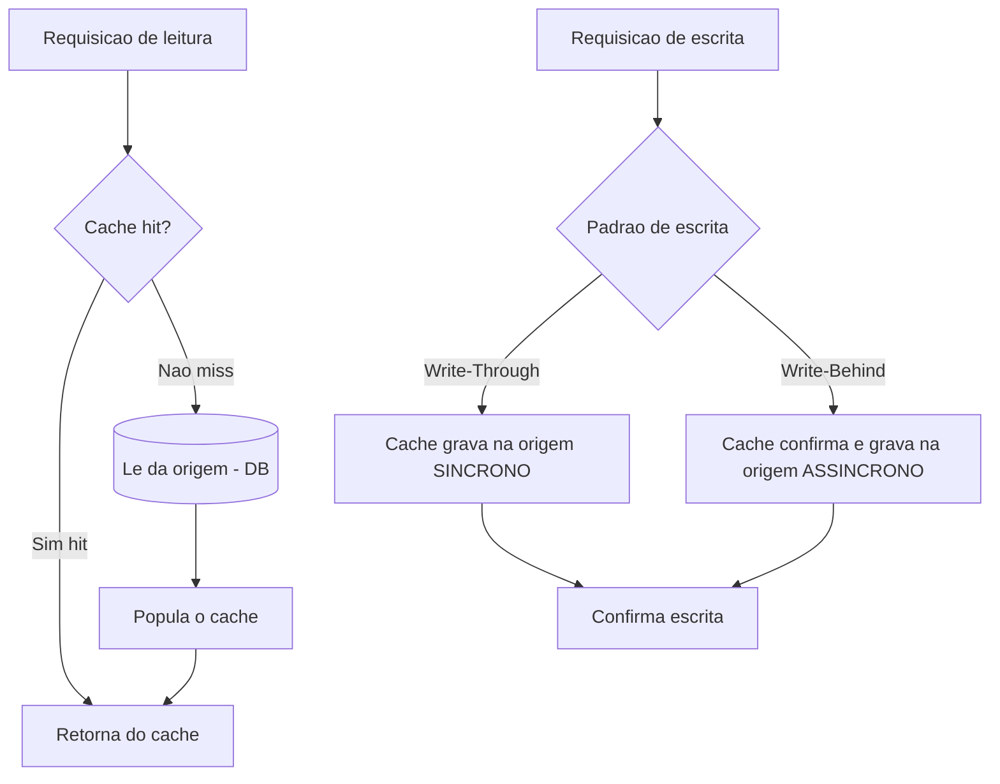
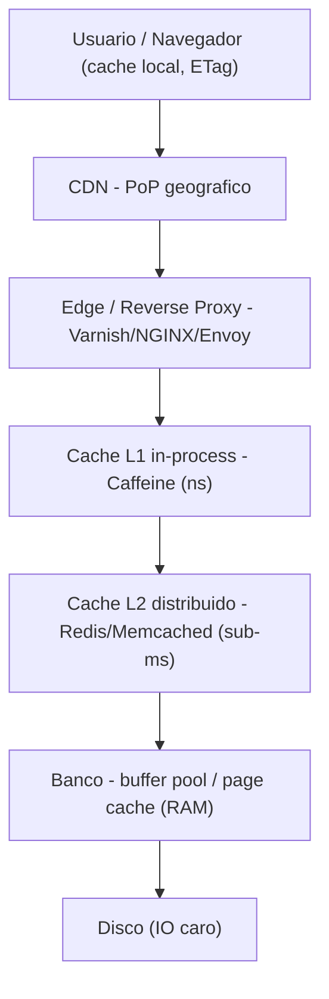
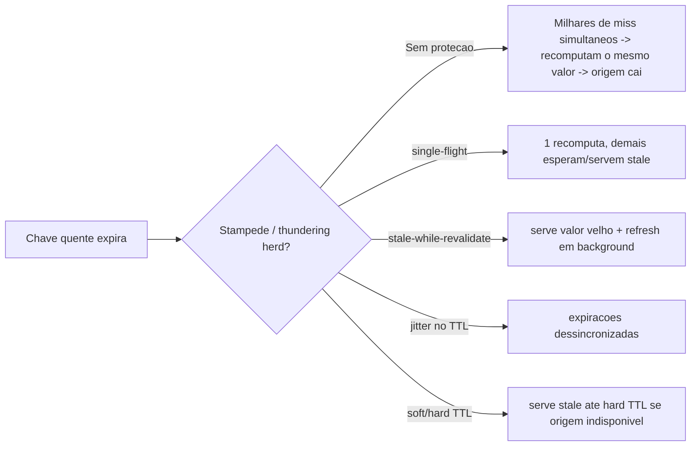

# Cache: padrões e camadas (cache-aside, write-through, write-behind, refresh-ahead, CDN→edge→app→banco)

> **Bloco:** Dados e persistência · **Nível:** Intermediário/Avançado · **Tempo de leitura:** ~30 min

## TL;DR

Caching guarda uma cópia de dados caros de obter num store rápido para reaproveitá-la, trocando **frescor (consistência) por latência, throughput e custo**. Há duas dimensões para dominar. A primeira é **quais padrões** governam leitura/escrita entre aplicação, cache e origem: **Cache-Aside** (lazy loading, a aplicação gerencia o cache), **Read-Through** (o cache carrega da origem no miss), **Write-Through** (escrita síncrona cache→origem, sempre coerente, mais lenta), **Write-Behind/Write-Back** (escrita assíncrona, rápida mas com risco de perda) e **Refresh-Ahead** (recarrega entradas quentes antes de expirarem). A segunda é que, em arquitetura web séria, cache não é uma coisa e sim uma **hierarquia de camadas**: **navegador → CDN → edge/reverse proxy → cache de aplicação (L1 in-process + L2 distribuído) → buffer pool do banco**. Quanto mais alto o hit, menor a latência e a carga nas camadas abaixo. As armadilhas que derrubam sistemas em pico são **invalidação incorreta**, **cache stampede** (thundering herd), **hot keys** e **cache penetration** — combatidas com **TTL + jitter**, **single-flight**, **stale-while-revalidate** e **soft TTL / hard TTL** (Amazon Builders' Library). Como diz o adágio de Phil Karlton: "as duas coisas difíceis em CS são invalidação de cache e nomear coisas".

## O problema que resolve

Acessar a fonte de verdade (banco relacional, serviço remoto, cálculo de preço, render de página, round-trip ao outro lado do continente) é caro: latência de disco/rede, CPU de queries complexas, carga sobre um recurso de escala limitada. Em cargas **read-heavy** — a maioria — o mesmo dado é lido muitas vezes; recomputar tudo a cada leitura é desperdício que domina tanto a latência percebida quanto o custo de infraestrutura.

**Cache** ataca os dois ao mesmo tempo: serve o resultado já pronto, mais perto de quem pede. Os ganhos: **latência menor** (memória vs. disco/rede), **throughput maior** e **menos carga sobre a origem** (protege o banco de saturar). A Microsoft observa que caching funciona melhor para dados relativamente estáticos ou lidos com frequência.

O custo fundamental: o dado no cache é uma **cópia** que pode divergir da origem. Toda a engenharia de caching gira em torno de **quando e como manter cache e origem coerentes**. A frase de **Phil Karlton**, popularizada por **Martin Fowler** ("There are only two hard things in Computer Science: cache invalidation and naming things"), não é gratuita: **invalidação** é difícil porque você precisa saber *quando* o dado em cache deixou de ser válido, e essa informação muitas vezes mora em outro sistema, em outro momento, sob concorrência. Servir dado velho vai de inofensivo (um contador de likes atrasado) a catastrófico (um saldo errado, um preço desatualizado no checkout).

A motivação para **múltiplas camadas** é que cada uma resolve um sub-problema: a CDN tira da origem o tráfego de assets e conteúdo cacheável geograficamente; o cache de aplicação evita recomputar lógica cara; o buffer pool do banco evita ir ao disco. A taxonomia canônica dos padrões aparece na documentação do **Oracle Coherence**, e os mesmos conceitos estão no **Azure Architecture Center**; os padrões operacionais de resiliência (soft/hard TTL, backpressure) estão na **Amazon Builders' Library**.

## O que é (definição aprofundada)

### Os padrões de leitura/escrita

**Cache-Aside (Lazy Loading).** A **aplicação** gerencia o cache; o cache não conhece a origem. Leitura: tenta o cache; **hit** retorna; **miss** lê da origem, **popula** o cache e retorna. Escrita: escreve na origem e **invalida** (ou atualiza) a entrada. É o padrão mais comum e flexível, e resiliente — se o cache cai, a aplicação ainda funciona indo à origem (com mais latência).

**Read-Through.** Variante onde o **cache** (não a aplicação) sabe carregar da origem no miss, via um *cache loader*. A aplicação só fala com o cache, que busca na origem transparentemente.

**Write-Through.** Toda escrita passa pelo cache, que a propaga **sincronamente** à origem antes de confirmar. Cache e origem ficam sempre coerentes; o custo é latência de escrita maior. Bom quando a consistência do cache importa e há leituras logo após escritas.

**Write-Behind (Write-Back).** Escreve no cache e confirma **imediatamente**; persiste na origem de forma **assíncrona** (em lote/coalescido). Entrega throughput muito maior e menor latência, e reduz carga no banco — ao preço de **risco de perda** num crash antes de persistir e de uma janela de origem desatualizada.

**Refresh-Ahead.** O cache **recarrega proativa e assincronamente** entradas recentemente acessadas *antes* de expirarem. Útil para itens quentes acessados por muitos usuários: o valor permanece fresco e evita-se o stampede que ocorreria quando uma entrada quente expira e todos batem na origem. Custo: recarrega itens que talvez não fossem mais necessários.

### A hierarquia de camadas

Uma **camada de cache** é definida por: o que guarda, por quanto tempo (TTL), como é invalidada e onde fica (proximidade do cliente). Da mais próxima do usuário à mais profunda:

**1. Cache de navegador (client-side).** Controlado por headers HTTP: `Cache-Control` (`max-age`, `s-maxage`, `no-store`, `private/public`), `ETag` + `If-None-Match` (validação condicional, 304), `Last-Modified`. Hit aqui = zero round-trip. Ideal para assets versionados (`app.a1b2c3.js`).

**2. CDN.** Cloudflare, Fastly, CloudFront, Akamai. Réplicas geograficamente distribuídas (PoPs) que cacheiam conteúdo perto do usuário. Invalidação por **purge** (URL ou **tag/surrogate key**), **stale-while-revalidate** e **stale-if-error**. Reduzem latência geográfica e protegem a origem.

**3. Edge / reverse proxy.** NGINX, Varnish, Envoy. Cache HTTP de página/fragmento, ESI, terminação TLS. Amortecedor entre internet e aplicação; também isola de falhas (serve stale se a origem cai).

**4. Cache de aplicação.** Dois sub-tipos, frequentemente combinados como **near-cache**: **L1 in-process** (Caffeine, Guava) — latência de nanossegundos, zero rede, mas não compartilhado e duplica memória; **L2 distribuído** (Redis, Memcached) — compartilhado entre nós, latência sub-ms a poucos ms, escala por sharding.

**5. Cache do banco.** O **buffer pool / page cache** (InnoDB buffer pool, `shared_buffers` do Postgres) mantém páginas quentes em RAM, evitando IO de disco; mais o **plan cache**. É a camada mais profunda — e dimensioná-la bem é caching.

**Métricas-chave:** **hit rate**, **miss rate**, latência por camada, taxa de evicção e efeito sobre a carga da origem.

## Como funciona

Numa pilha bem montada, a requisição desce camada a camada: o navegador checa seu cache (304/hit → fim); miss → CDN (hit → serve em dezenas de ms); miss → edge/reverse proxy; miss → L1 in-process; miss → L2 distribuído (Redis); miss → executa lógica/query, com o banco servindo do buffer pool (RAM) ou, em último caso, do disco. No caminho de volta, cada camada **popula** seu cache. Cada hit numa camada superior *absorve* carga de todas as inferiores — por isso a pilha é multiplicativa: 90% de hit na CDN + 90% nos 10% restantes no Redis significa que só ~1% chega ao banco.

Os **padrões de escrita** definem o caminho de cada operação:

- **Cache-Aside (leitura):** `v = cache.get(k)`; se nulo → `v = db.get(k)`; `cache.set(k, v, ttl)`; retorna.
- **Write-Through:** `cache.set(k, v)` → o cache grava `db.write(k, v)` síncrono → confirma depois.
- **Write-Behind:** `cache.set(k, v)` → confirma já; fila/buffer agenda `db.write` em lote.
- **Refresh-Ahead:** ao acessar entrada com TTL próximo de expirar, dispara reload assíncrono servindo o valor atual.

**Invalidação e consistência** — três estratégias coexistem: **expiração por TTL** (simples, eventual); **invalidação ativa** (no write da origem, purge/delete das chaves/tags afetadas — mais forte, mas exige rastrear *quais* chaves mudaram); **validação condicional** (ETag/Last-Modified, revalida barato com 304).

**Soft TTL / Hard TTL (Amazon Builders' Library).** Mantenha dois TTLs por item: o **soft TTL** (curto) marca quando *deveria* ser refrescado; o **hard TTL** (longo) marca quando *não pode mais* ser usado. Após o soft TTL, serve o valor atual e dispara refresh assíncrono; se a origem está indisponível ou sinaliza **backpressure**, continua servindo o cacheado até o hard TTL — o cache vira amortecedor de resiliência durante *brownouts*, em vez de despejar toda a carga na origem no instante da expiração.

## Diagrama de fluxo

Padrões de leitura/escrita:


```mermaid
flowchart TD
    Req[Requisicao de leitura] --> CK{Cache hit?}
    CK -->|Sim hit| Ret[Retorna do cache]
    CK -->|Nao miss| DB[(Le da origem - DB)]
    DB --> Pop[Popula o cache]
    Pop --> Ret

    W[Requisicao de escrita] --> WT{Padrao de escrita}
    WT -->|Write-Through| SyncDB[Cache grava na origem SINCRONO]
    WT -->|Write-Behind| AsyncDB[Cache confirma e grava na origem ASSINCRONO]
    SyncDB --> Ok[Confirma escrita]
    AsyncDB --> Ok
```

Hierarquia de camadas:


```mermaid
flowchart TB
    U["Usuario / Navegador (cache local, ETag)"] --> CDN["CDN - PoP geografico"]
    CDN --> EDGE["Edge / Reverse Proxy - Varnish/NGINX/Envoy"]
    EDGE --> L1["Cache L1 in-process - Caffeine (ns)"]
    L1 --> L2["Cache L2 distribuido - Redis/Memcached (sub-ms)"]
    L2 --> DB["Banco - buffer pool / page cache (RAM)"]
    DB --> DISK["Disco (IO caro)"]
```

Combate ao stampede:


```mermaid
flowchart LR
    EXP["Chave quente expira"] --> HERD{"Stampede / thundering herd?"}
    HERD -->|"Sem protecao"| BAD["Milhares de miss simultaneos -> recomputam o mesmo valor -> origem cai"]
    HERD -->|"single-flight"| OK1["1 recomputa, demais esperam/servem stale"]
    HERD -->|"stale-while-revalidate"| OK2["serve valor velho + refresh em background"]
    HERD -->|"jitter no TTL"| OK3["expiracoes dessincronizadas"]
    HERD -->|"soft/hard TTL"| OK4["serve stale ate hard TTL se origem indisponivel"]
```

## Exemplo prático / caso real

**Marketplace brasileiro, página de produto (PDP) na Black Friday.** Sem cache, cada visualização dispara ~12 queries (produto, preço, estoque, avaliações, recomendações, frete). Pico projetado: **40.000 page views/segundo** → 480.000 queries/s no banco, inviável. A solução é a pilha combinada com os padrões certos:

- **CDN (Fastly) — cache-aside na borda.** HTML semi-estático da PDP e assets versionados cacheados nos PoPs com `Cache-Control: s-maxage=60, stale-while-revalidate=300`. Surrogate keys por `product_id` permitem **purge cirúrgico** quando o produto muda. Hit-rate ~85% — a origem recebe ~6.000 req/s, não 40.000.
- **L2 (Redis) + L1 (Caffeine) — cache-aside com TTL curto.** Fragmentos dinâmicos (preço, estoque) ficam no Redis com **TTL curto + jitter** (5 s ± 1 s, para evitar expiração sincronizada de milhões de chaves). Dados de catálogo quase imutáveis (nome, descrição) ficam também no Caffeine in-process (TTL de minutos), eliminando ida ao Redis na maioria dos hits.
- **Write-Through para o saldo de pontos de fidelidade** (precisa coerente, lido logo após mudar) e **Write-Behind para o contador de visualizações** ("X pessoas viram isto") — incrementos vão ao Redis e são persistidos em lote a cada 30 s; aceita-se perder alguns num crash em troca de throughput e proteção do banco.
- **Refresh-Ahead + single-flight para o preço dos itens em destaque** (caro de calcular: promoção, cupom, frete). Quando uma SKU quente expira às 20h00 sob 40k views/s, sem proteção haveria stampede. Aplicam **single-flight** (lock por chave no Redis: só uma thread recalcula, as demais servem o valor anterior) + **soft TTL/hard TTL** (soft 5 s, hard 60 s): se o serviço de precificação dá brownout e sinaliza backpressure, a PDP serve o último preço válido até 60 s em vez de martelar o serviço caído.
- **Banco.** As ~1.000 queries/s que escapam batem no Postgres com `shared_buffers` dimensionado para manter o working set em RAM, mais réplicas de leitura. Hit no buffer pool > 99%.

```text
# Pseudocódigo: cache-aside com single-flight + soft/hard TTL
get(key):
  v = cache.get(key)
  if v and now < v.soft_ttl: return v.value                 # fresco
  if v and now < v.hard_ttl:                                # stale aceitável
      async refresh_with_singleflight(key)                  # refresca em background
      return v.value
  return blocking_refresh_with_singleflight(key)            # miss real, 1 recomputa
```

**Resultado:** a origem nunca passou de 7.000 req/s e o banco de ~1.100 queries/s — três ordens de grandeza abaixo dos 480k crus; p99 da PDP em 140 ms. Lição registrada num teste anterior: **sem jitter, milhões de chaves expiraram no mesmo segundo e a origem caiu** — jitter de TTL e single-flight foram o que evitaram o colapso.

## Quando usar / Quando evitar

**Use caching quando:** a leitura é cara e **read-heavy**; os dados toleram alguma **staleness** (TTL) ou há invalidação confiável; há **localidade** (mesmas chaves repetidas); você precisa proteger a origem de picos e isolar de falhas (reverse proxy + stale-if-error).

**Por padrão:** **Cache-Aside** para a maioria dos cenários. **Write-Through** quando o cache precisa estar sempre coerente com leituras logo após escrita. **Write-Behind** para escrita de altíssimo volume tolerante a perda/atraso (contadores, métricas). **Refresh-Ahead** para um conjunto pequeno e identificável de entradas quentes.

**Evite ou tenha cautela quando:** os dados exigem **consistência forte e imediata** e servir stale é caro (saldos, confirmação final de estoque — ali se valida na fonte); o **hit-rate seria baixo** (cardinalidade altíssima, chaves únicas); **escritas dominam** (invalidação constante anula o ganho); o custo de uma invalidação errada excede o ganho. **Nunca** use write-behind para dados que não podem ser perdidos (financeiro, pedidos).

## Anti-padrões e armadilhas comuns

- **Cache stampede / thundering herd.** Chave quente expira e milhares de requests recomputam o mesmo valor, derrubando a origem. Use single-flight, stale-while-revalidate, jitter no TTL e soft/hard TTL.
- **Expiração sincronizada.** Popular muitas chaves com o mesmo TTL faz todas expirarem juntas → stampede em massa. Adicione jitter.
- **Hot key.** Uma única chave (produto mais vendido) satura um shard do Redis. Replique a hot key, use L1 in-process na frente, ou shard por sufixo.
- **Cache penetration.** Requests por chaves inexistentes (IDs inválidos, ataque) sempre dão miss e batem na origem. Cacheie negativos (null) com TTL curto ou use **Bloom filter**.
- **Invalidação esquecida / dado eterno velho.** Esquecer de invalidar ao escrever → dado obsoleto servindo indefinidamente. É o bug de cache mais comum e insidioso. Mapeie escrita → chaves/tags afetadas.
- **Dual-write inconsistente (cache + DB).** Em cache-aside, prefira **invalidar** (não atualizar) o cache após escrever na origem, para evitar gravar valor errado por race condition.
- **Cachear dado sensível na camada errada.** `Cache-Control: public` num response com dados pessoais → CDN/proxy serve dado de um usuário para outro. Use `private`/`no-store` para conteúdo per-user.
- **Cache como SPOF.** Aplicação que trava se o Redis cai. Tenha fallback (servir da origem, circuit breaker); não dependa do cache para *correção*, só para *performance*.
- **Confiar em hit-rate sem olhar a cauda.** 95% de hit pode esconder que os 5% de miss são justamente as requisições caras que dominam o p99.

## Relação com outros conceitos

- **Read Replicas / Sharding:** caching reduz a pressão de leitura, adiando réplicas/sharding. Ver `03-read-replicas-sharding-particionamento.md`.
- **CQRS / Materialized Views:** read models materializados são, conceitualmente, um cache pré-computado e persistido alimentado por eventos. Ver `04-materialized-views-e-projecoes.md`.
- **ACID vs BASE:** cache introduz consistência eventual por natureza. Ver `09-acid-vs-base.md`.
- **CDC:** pode invalidar/atualizar caches de forma confiável ao reagir a mudanças do banco fonte. Ver `05-cdc-change-data-capture-debezium.md`.
- **Polyglot Persistence:** Redis como store de cache/sessão é caso clássico de persistência poliglota. Ver `01-polyglot-persistence.md`.
- **Latência e percentis:** cache derruba o p50, mas miss/stampede inflam o p99/p999 — cuidado com a cauda. Ver `../07-performance-e-escalabilidade/02-latencia-vs-throughput-percentis.md`.
- **Padrões de resiliência:** soft/hard TTL, stale-if-error e backpressure conectam cache à resiliência; retries cegos a uma origem em brownout amplificam o stampede. Ver `../04-sistemas-distribuidos/10-padroes-de-resiliencia.md`.
- **Bloom filter:** estrutura ideal para barrar cache penetration. Ver `../12-estruturas-de-dados/09-skip-list-bloom-filter-lru-lfu.md`.

## Referências

- [Cache-Aside Pattern — Azure Architecture Center (Microsoft Learn)](https://learn.microsoft.com/en-us/azure/architecture/patterns/cache-aside)
- [Caching guidance — Azure Architecture Center (Microsoft Learn)](https://learn.microsoft.com/en-us/azure/architecture/best-practices/caching)
- [No-Caching antipattern — Azure Architecture Center (Microsoft Learn)](https://learn.microsoft.com/en-us/azure/architecture/antipatterns/no-caching/)
- [Read-Through, Write-Through, Write-Behind, and Refresh-Ahead Caching — Oracle Coherence Docs](https://docs.oracle.com/cd/E16459_01/coh.350/e14510/readthrough.htm)
- [Caching challenges and strategies — Amazon Builders' Library](https://aws.amazon.com/builders-library/caching-challenges-and-strategies/)
- [Timeouts, retries, and backoff with jitter — Amazon Builders' Library](https://aws.amazon.com/builders-library/timeouts-retries-and-backoff-with-jitter/)
- [Two Hard Things — Martin Fowler (bliki)](https://www.martinfowler.com/bliki/TwoHardThings.html)
- [Designing Data-Intensive Applications — Martin Kleppmann (site oficial)](https://dataintensive.net/)
