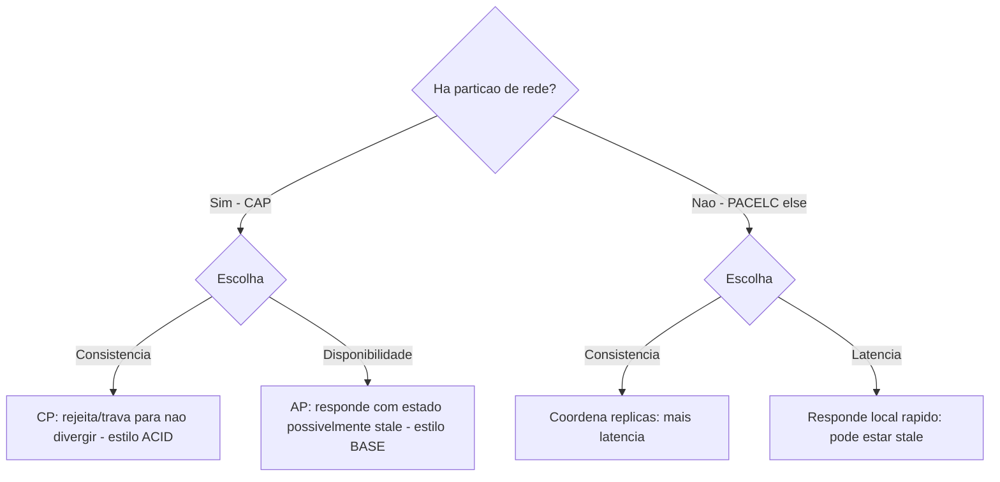

# ACID vs BASE

> **Bloco:** Dados e persistência · **Nível:** Intermediário/Avançado · **Tempo de leitura:** ~22 min

## TL;DR

**ACID** e **BASE** são dois modelos opostos de garantias para sistemas de dados, situados nas duas pontas de um espectro de consistência. **ACID** (Atomicity, Consistency, Isolation, Durability) é o contrato dos bancos relacionais transacionais: transações são tudo-ou-nada, mantêm invariantes, são isoladas entre si e duráveis após o commit — consistência forte, ao custo de coordenação e escala. **BASE** (Basically Available, Soft state, Eventually consistent) é a filosofia de muitos sistemas NoSQL distribuídos: prioriza **disponibilidade** e **escala**, aceitando que o estado é "mole" (pode estar em transição) e que a consistência é **eventual** — todas as réplicas convergem *com o tempo*, não instantaneamente. A escolha não é "qual é melhor", mas "qual garantia o negócio exige para *este* dado". O acrônimo BASE foi cunhado como um trocadilho químico com ACID (ácido vs. base) por Eric Brewer e colegas, e está intimamente ligado ao **Teorema CAP** e à sua extensão **PACELC**.

## O problema que resolve

Por décadas, ACID foi sinônimo de "banco de dados sério". E para sistemas em uma única máquina (ou poucas, fortemente acopladas), ACID é a escolha correta: dá ao desenvolvedor um modelo mental simples e seguro — ou a transação inteira acontece, ou nada acontece, e o que você lê está sempre correto.

O problema surgiu com a **escala horizontal distribuída**. Quando seus dados estão espalhados por dezenas ou centenas de nós, possivelmente em datacenters diferentes, garantir as propriedades ACID — especialmente **Consistency** (todos veem o mesmo estado) e **Isolation** entre transações concorrentes que atravessam nós — exige coordenação cara (locks distribuídos, two-phase commit). Essa coordenação:

- **Mata a latência** (esperar todos os nós concordarem);
- **Reduz a disponibilidade** (se um nó participante cai ou a rede particiona, a transação trava);
- **Limita a escala** (o overhead de coordenação cresce com o número de nós).

O **Teorema CAP** (Eric Brewer) formaliza o dilema: num sistema distribuído sujeito a **partições de rede (P)** — que são inevitáveis —, você precisa escolher entre **Consistência (C)** e **Disponibilidade (A)** quando a partição ocorre. Não dá para ter ambas durante uma partição. Sistemas que escolhem A sobre C abrem mão da consistência forte do ACID. Daí nasce **BASE**: uma filosofia de design que abraça a disponibilidade e a escala, aceitando **consistência eventual**. Como descreve a definição clássica de eventual consistency: "se nenhuma atualização nova for feita a um dado item, eventualmente todos os acessos a esse item retornarão o último valor atualizado".

A extensão **PACELC** (Daniel Abadi, 2010) refina o CAP: *se* houver partição (P), escolha entre A e C; *senão* (E, else — operação normal), escolha entre **latência (L)** e **consistência (C)**. Ou seja, mesmo sem partição, manter consistência forte custa latência — o trade-off é permanente, não só durante falhas.

## O que é (definição aprofundada)

### ACID

- **Atomicity (Atomicidade)**: a transação é indivisível — todas as suas operações são aplicadas, ou nenhuma. Se algo falha no meio, faz-se rollback completo. (Ex.: debitar uma conta e creditar outra: ou ambos, ou nenhum.)
- **Consistency (Consistência)**: a transação leva o banco de um estado válido a outro estado válido, respeitando todas as **invariantes** (constraints, chaves estrangeiras, regras). Nota: este "C" é diferente do "C" do CAP — aqui é integridade de invariantes definidas pela aplicação/schema; no CAP é consistência de leitura entre réplicas.
- **Isolation (Isolamento)**: transações concorrentes não interferem umas nas outras; o resultado é como se tivessem rodado em série. Há **níveis de isolamento** (Read Committed, Repeatable Read, Serializable) que negociam isolamento vs. concorrência.
- **Durability (Durabilidade)**: uma vez confirmada (commit), a transação sobrevive a falhas (escrita em armazenamento persistente, via WAL/redo log).

### BASE

- **Basically Available (Basicamente disponível)**: o sistema garante disponibilidade — sempre responde a requisições —, mesmo que a resposta seja um estado não totalmente consistente ou parcial. Prioriza-se *responder* a *responder com a verdade absoluta mais recente*.
- **Soft state (Estado mole)**: o estado do sistema pode mudar ao longo do tempo mesmo sem novas entradas, porque a convergência entre réplicas acontece em background. Não se assume um estado fixo e imediatamente coerente.
- **Eventually consistent (Eventualmente consistente)**: na ausência de novas escritas, todas as réplicas *convergem* para o mesmo valor — eventualmente. Há uma janela de inconsistência durante a qual leituras de réplicas diferentes podem divergir.

BASE é uma **estratégia prática** para sistemas que precisam de alta disponibilidade e tolerância a partição, ao custo da consistência imediata. Exemplos de sistemas BASE-oriented: Cassandra, DynamoDB (por padrão), Riak, muitos caches distribuídos. Exemplos ACID: PostgreSQL, MySQL/InnoDB, Oracle — e, cada vez mais, sistemas distribuídos "NewSQL" (Spanner, CockroachDB) que tentam recuperar ACID em escala global ao custo de latência.

## Como funciona

A diferença operacional concentra-se na **replicação e na visibilidade das escritas**:

- **ACID distribuído** tipicamente usa **replicação síncrona** e/ou **consenso** (Paxos/Raft) e, para transações multi-partição, **two-phase commit (2PC)**: o coordenador pergunta a todos os participantes se podem commitar (prepare), e só confirma se todos disserem sim. Garante consistência forte, mas trava se um participante falha e adiciona round-trips de latência.

- **BASE** usa **replicação assíncrona** e modelos de consistência ajustáveis. Em quóruns (estilo Dynamo), define-se **N** (réplicas), **W** (réplicas que confirmam a escrita) e **R** (réplicas lidas). Se `W + R > N`, há sobreposição garantida (strong-ish consistency); se `W + R <= N`, você ganha disponibilidade/latência ao custo de poder ler valores stale. Conflitos de escrita concorrente resolvem-se depois (last-write-wins, vector clocks, CRDTs). O sistema **sempre aceita a escrita** (basically available) e **propaga depois** (eventually consistent), passando por um estado de transição (soft state).

O ponto arquitetural: **consistência não é binária, é um espectro**. Entre ACID estrito e BASE relaxado há gradações — read-your-writes, monotonic reads, causal consistency, etc. O arquiteto escolhe o nível **por dado e por operação**, não para o sistema inteiro.

## Diagrama de fluxo



## Exemplo prático / caso real

**Fintech brasileira**, decidindo o modelo por tipo de dado:

- **Saldo de conta e transferências PIX → ACID, sempre.** Não há margem para "eventual": debitar R$ 500 e creditar do outro lado precisa ser atômico e consistente *agora*. Usa-se **PostgreSQL** com transações ACID dentro de cada serviço. Quando a operação atravessa serviços (Database per Service), recorre-se a **Saga** com transações locais ACID + compensações — recuperando atomicidade *semântica* sem 2PC distribuído. O custo de consistência forte aqui é inegociável; aceita-se a latência (PACELC: escolhe C sobre L).

- **Carrinho, sessão, feed de notificações, contador de "pessoas vendo" → BASE.** Se o feed de notificações de um usuário aparece 2 segundos defasado entre dois acessos, ninguém perde dinheiro. Usa-se **Cassandra** ou **DynamoDB** com consistência eventual, priorizando disponibilidade e latência. Na Black Friday, é melhor o carrinho responder rápido (basically available) e convergir depois do que travar esperando consistência forte.

```text
Decisao por dado:
  saldo / PIX        -> ACID (PostgreSQL + Saga)        -> C sobre A/L
  catalogo (busca)   -> BASE (Elasticsearch eventual)   -> A/L sobre C
  carrinho/sessao    -> BASE (Redis/DynamoDB)            -> A/L sobre C
  contador de views  -> BASE (eventual, write-behind)    -> A/L sobre C
```

Repare que o *mesmo sistema* (a fintech) usa ambos os modelos — a escolha é por dado, guiada por: o negócio tolera ver valor stale? Quanto custa a indisponibilidade vs. a inconsistência? É **persistência poliglota** dirigida pelo requisito de consistência.

## Quando usar / Quando evitar

- **ACID — usar quando:** o dado tem invariantes fortes que não podem ser violadas nem por um instante (dinheiro, estoque vendido, integridade referencial crítica), e a escala/latência cabem no modelo. É o default correto para dados transacionais de negócio.
- **ACID — evitar/cuidado:** quando a coordenação distribuída exigida (2PC cross-service) mata a disponibilidade e a escala, e o negócio tolera consistência eventual. Forçar ACID global onde BASE bastaria gera sistemas frágeis e que não escalam.
- **BASE — usar quando:** alta disponibilidade e escala horizontal são prioritárias, e o dado tolera uma janela de inconsistência (caches, sessões, feeds, contadores, busca, telemetria). A maioria dos dados de alto volume e baixa criticidade individual cabe aqui.
- **BASE — evitar:** para dados onde ler um valor stale causa dano real e irreversível (saldo, reserva de estoque no checkout). Consistência eventual em dinheiro gera bugs caríssimos (saldo negativo, venda dupla).

## Anti-padrões e armadilhas comuns

- **Tratar consistência como decisão global do sistema**: escolher "somos ACID" ou "somos BASE" para tudo. A decisão é **por dado/operação**. Sistemas reais misturam os dois.
- **Confundir o "C" do ACID com o "C" do CAP**: são coisas diferentes — invariantes de schema (ACID) vs. consistência de leitura entre réplicas (CAP). Misturá-los leva a raciocínio errado sobre trade-offs.
- **Assumir consistência forte de um banco BASE**: codificar como se Cassandra/DynamoDB fossem ACID gera bugs sutis de leitura stale e perda de escrita concorrente (last-write-wins silencioso).
- **Usar 2PC/transações distribuídas como solução padrão para tudo**: frágil, lento, amplia o blast radius. Para consistência cross-service, prefira **Saga** com compensações.
- **Ignorar a necessidade de read-your-writes**: usuário escreve e logo lê um valor stale de uma réplica eventual — péssima UX. Mitigue (sticky read no primário, etc.) onde importa.
- **CAP mal interpretado como "escolha 2 de 3 permanentemente"**: P (partição) não é uma escolha — é inevitável. A escolha real (C vs A) só vale *durante* a partição; e PACELC lembra que, mesmo sem partição, há trade-off C vs L.
- **BASE para dados financeiros críticos**: a armadilha mais perigosa — consistência eventual em saldo permite estados que custam dinheiro real.

## Relação com outros conceitos

- **Teorema CAP / PACELC**: o arcabouço teórico que explica *por que* o trade-off ACID vs BASE existe em sistemas distribuídos. Ver bloco de Sistemas Distribuídos.
- **Database per Service / Saga**: a partição de dados por serviço torna a consistência cross-service eventual (BASE), e a Saga recupera atomicidade semântica sem 2PC. Ver `02-database-per-service.md`.
- **Materialized Views / CQRS**: read models operam sob consistência eventual por natureza. Ver `04-materialized-views-e-projecoes.md`.
- **Cache patterns**: caching introduz inevitavelmente consistência eventual entre cache e origem. Ver `08-cache-patterns.md`.
- **Polyglot Persistence**: a escolha de stores ACID vs BASE por tipo de dado é uma dimensão central da persistência poliglota. Ver `01-polyglot-persistence.md`.
- **Read Replicas / Sharding**: replication lag é uma manifestação concreta de consistência eventual em sistemas relacionais. Ver `03-read-replicas-sharding-particionamento.md`.

## Referências

- [CAP theorem — Wikipedia](https://en.wikipedia.org/wiki/CAP_theorem)
- [CAP Theorem vs PACELC: Understanding Distributed System Trade-offs — Design Gurus](https://www.designgurus.io/blog/system-design-interview-basics-cap-vs-pacelc)
- [What is CAP Theorem? Definition & FAQs — ScyllaDB](https://www.scylladb.com/glossary/cap-theorem/)
- [Pattern: Saga — microservices.io (Chris Richardson)](https://microservices.io/patterns/data/saga.html)
- [Designing Data-Intensive Applications — Martin Kleppmann (site oficial)](https://dataintensive.net/)
- [Designing Data-Intensive Applications — Martin Kleppmann (publicação do autor)](https://martin.kleppmann.com/2017/03/27/designing-data-intensive-applications.html)
