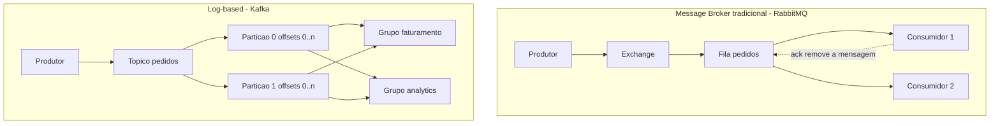

# Message Brokers vs Log-based Streaming

> **Bloco:** Mensageria e streaming · **Nível:** Intermediário/Avançado · **Tempo de leitura:** ~22 min

## TL;DR

Existem duas famílias de infraestrutura de mensageria que muita gente trata como sinônimo, mas que têm modelos mentais opostos. **Message brokers tradicionais** (RabbitMQ, ActiveMQ, AWS SQS) tratam a mensagem como um item transitório de trabalho: ela é entregue, processada, confirmada (ack) e **destruída**. O broker mantém estado por mensagem e por consumidor. **Log-based streaming** (Apache Kafka, Apache Pulsar, AWS Kinesis) trata o fluxo como um **log append-only, particionado e durável**: a mensagem permanece no log mesmo após ser lida, e o consumidor mantém um **offset** indicando até onde já leu. A diferença prática é profunda: brokers tradicionais brilham em filas de trabalho com roteamento sofisticado e baixa latência por mensagem; logs brilham em alto throughput, replay de histórico, múltiplos consumidores independentes lendo o mesmo dado e processamento de stream. Escolher errado custa caro: usar Kafka como fila de tarefas com fan-out competitivo dentro da partição é antinatural, e usar RabbitMQ para reprocessar 30 dias de eventos é impossível porque o dado já foi consumido e descartado.

## O problema que resolve

No início dos anos 2000, a integração entre sistemas corporativos era dominada por *Message-Oriented Middleware* (MOM) e pelo padrão JMS no mundo Java. O problema central era **desacoplamento temporal e de disponibilidade**: o sistema A precisa enviar trabalho para o sistema B sem que ambos estejam online ao mesmo tempo, sem perder mensagens se B cair, e idealmente distribuindo a carga entre várias instâncias de B. Brokers como ActiveMQ e, depois, RabbitMQ (implementando AMQP 0.9.1) resolveram isso com filas duráveis, acknowledgements e roteamento. O modelo mental era o de uma **fila de tarefas**: produza trabalho, consuma trabalho, confirme conclusão, descarte.

Esse modelo começou a quebrar quando empresas como o LinkedIn passaram a precisar mover **volumes massivos de dados de eventos** — cliques, page views, métricas — entre dezenas de sistemas heterogêneos, com a expectativa de que o *mesmo* fluxo de eventos alimentasse simultaneamente o data warehouse, o sistema de monitoramento, os índices de busca e os pipelines de machine learning. Brokers tradicionais não dão conta disso bem: cada consumidor que precisa do dado completo exige uma cópia da fila (fan-out), o histórico não é reproduzível porque a mensagem é apagada após o ack, e o throughput de um broker que mantém estado por mensagem na memória degrada sob bilhões de mensagens. Foi nesse vácuo que nasceu o **Kafka** (2011), reconceitualizando a mensageria como um **log de commit distribuído** — a mesma abstração que bancos de dados usam internamente para replicação e recuperação, agora exposta como infraestrutura de primeira classe.

## O que é (definição aprofundada)

Um **message broker** é um intermediário que recebe mensagens de produtores e as entrega a consumidores, com o broker assumindo a responsabilidade por roteamento, buffering, entrega confiável e, crucialmente, **rastreamento do estado de cada mensagem** (entregue? confirmada? rejeitada?). No modelo de fila de trabalho, uma mensagem é entregue a **um** consumidor entre os que competem pela fila (*competing consumers*), e após o **acknowledgement** ela é removida. RabbitMQ adiciona uma camada de roteamento rica via **exchanges** (direct, topic, fanout, headers) e *bindings*, permitindo padrões complexos de distribuição. O estado vive no broker e é por-mensagem.

Um sistema **log-based** expõe um **log particionado, ordenado e append-only**. Cada **tópico** é dividido em **partições**; dentro de cada partição as mensagens recebem um **offset** monotonicamente crescente e a ordem é estritamente garantida. A mensagem é **imutável** e permanece no log por um período de **retenção** configurável (tempo ou tamanho — ou indefinidamente com *log compaction*), independentemente de ter sido lida. O consumidor não "tira" a mensagem do log; ele mantém seu próprio **offset** — uma posição de leitura — e avança por conta própria. Como diz a documentação do Kafka, é literalmente *"a distributed, partitioned, replicated commit log service"*. Isso muda tudo: vários consumidores independentes podem ler o mesmo dado em ritmos diferentes, e qualquer um pode **rebobinar** (resetar o offset) para reprocessar o histórico.

Termos-chave: **offset** (posição de leitura no log), **partition** (unidade de paralelismo e ordenação), **retention** (quanto tempo o dado fica), **consumer group** (conjunto de consumidores que dividem partições), **ack/nack** (confirmação no broker tradicional), **prefetch / QoS** (quantas mensagens não confirmadas o broker entrega antecipadamente ao consumidor), **dumb broker / smart consumer** (filosofia do Kafka: o broker é simples e o consumidor carrega a inteligência) versus **smart broker / dumb consumer** (filosofia do RabbitMQ).

## Como funciona

**No broker tradicional (RabbitMQ como referência).** Um produtor publica em uma *exchange*; a exchange roteia para uma ou mais filas via *bindings* e *routing keys*. Consumidores se inscrevem na fila. O broker entrega mensagens respeitando o **prefetch count** (QoS) — por exemplo, prefetch 100 significa que o broker manda até 100 mensagens não confirmadas por canal antes de parar e esperar acks. Cada mensagem processada com sucesso gera um `basic.ack`; uma falha gera `basic.nack` ou `basic.reject`. Com `requeue=true`, a mensagem volta para a fila; com `requeue=false`, ela vai para a *Dead Letter Exchange* se configurada, ou é descartada. O broker mantém o estado: sabe quais mensagens estão *in-flight*, quais foram confirmadas, quais precisam de redelivery. Quando uma mensagem é confirmada, **ela some**. Não há replay nativo do histórico.

**No log (Kafka como referência).** Um produtor escolhe um tópico e (opcionalmente) uma chave; a chave determina a partição via hash, garantindo que todas as mensagens da mesma chave caiam na mesma partição e mantenham ordem entre si. O broker apenas **anexa** ao final do log da partição e replica para os brokers réplica (fator de replicação). O consumidor pertence a um **consumer group**; o **group coordinator** distribui as partições entre os membros do grupo — cada partição é consumida por **exatamente um** membro do grupo (essa é a chave do paralelismo: o número de partições limita o paralelismo de um grupo). O consumidor lê a partir do seu offset e periodicamente faz **commit** do offset no tópico interno `__consumer_offsets`. Se uma instância morre, ocorre um **rebalance** e suas partições são reatribuídas a outras instâncias do grupo, que retomam do último offset commitado. Dois consumer groups diferentes lendo o mesmo tópico recebem **cópias independentes** de todos os eventos — esse é o fan-out gratuito que o log oferece e que o broker tradicional não dá de graça.

A consequência arquitetural mais importante: no broker, o estado de progresso vive **no servidor** e é por-mensagem; no log, o estado de progresso vive **no consumidor** (o offset) e é por-partição. Isso é o que torna o replay trivial em Kafka (basta voltar o offset) e impossível em RabbitMQ (a mensagem já foi descartada).

## Diagrama de fluxo



No broker, C1 e C2 competem pela fila e a mensagem confirmada desaparece. No log, os grupos `faturamento` e `analytics` leem **o mesmo histórico** de forma independente, cada um com seus próprios offsets, e o dado permanece no log durante toda a janela de retenção.

## Exemplo prático / caso real

Considere um marketplace brasileiro processando pedidos. Há dois requisitos bem diferentes convivendo.

**Requisito 1 — fila de trabalho de envio de e-mails transacionais.** Quando um pedido é pago, é preciso disparar um e-mail de confirmação. Isso é trabalho transitório: cada e-mail deve ser enviado **uma vez**, distribuído entre N workers, com retry em caso de falha do provedor SMTP e descarte para uma DLQ se o e-mail for inválido após algumas tentativas. Aqui o **RabbitMQ** (ou **AWS SQS**) é a escolha natural. Um *direct exchange* roteia para a fila `email.confirmacao`, vários workers competem com prefetch ajustado (digamos 50), fazem ack ao enviar e nack-com-DLX em falha permanente. Não há nenhuma necessidade de guardar o "evento de e-mail enviado" para sempre.

**Requisito 2 — stream de eventos de pedido para múltiplos domínios.** O evento `PedidoPago` precisa alimentar: o serviço de faturamento (gerar nota fiscal), o serviço de antifraude, o serviço de recomendação (treinar modelo), o data warehouse e o dashboard de operação em tempo real. Cada um consome em ritmo próprio, alguns reprocessam histórico quando o modelo muda, e o time de dados às vezes precisa reprocessar os últimos 30 dias após corrigir um bug de cálculo. Aqui o **Kafka** é a escolha natural. Um tópico `pedidos.pagos` particionado por `pedido_id`, com retenção de 30 dias, e cinco consumer groups independentes. Quando o time de recomendação muda o modelo, ele simplesmente cria um novo grupo e reseta o offset para o início — replay completo sem afetar os outros consumidores.

```text
// Produtor Kafka (pseudocódigo)
producer.send(topic="pedidos.pagos", key=pedido.id, value=evento)
// chave = pedido.id garante ordem por pedido na mesma particao

// Consumidor do grupo faturamento
consumer.subscribe(["pedidos.pagos"], group="faturamento")
loop:
  records = consumer.poll()
  for r in records: gerarNotaFiscal(r)
  consumer.commitSync()   // avanca o offset so apos processar
```

Uma fintech faria escolha análoga: liquidação de transações via fila de trabalho confiável, e o stream de eventos transacionais (para conciliação, ledger, antifraude e auditoria regulatória que exige replay) via log. A auditoria regulatória é, aliás, um dos argumentos mais fortes para log-based: o histórico imutável e reproduzível é praticamente um *event store* embutido.

## Quando usar / Quando evitar

**Use message broker tradicional (RabbitMQ, ActiveMQ, SQS) quando:**

- O caso é **fila de tarefas** com *competing consumers*: cada mensagem é uma unidade de trabalho processada uma vez e descartada.
- Você precisa de **roteamento sofisticado** no servidor (topic/headers exchanges, prioridades, TTL por mensagem, RPC over messaging).
- A latência por mensagem importa mais que o throughput agregado.
- O volume é moderado e você não precisa de replay nem de fan-out massivo para múltiplos consumidores independentes.
- Você quer simplicidade operacional (SQS gerenciado é praticamente zero-ops).

**Use log-based streaming (Kafka, Pulsar, Kinesis) quando:**

- Você precisa de **alto throughput** sustentado (centenas de milhares a milhões de eventos/s).
- **Múltiplos consumidores independentes** precisam do mesmo fluxo (fan-out por design).
- **Replay / reprocessamento** do histórico é um requisito (correção de bugs, novos consumidores, modelos de ML).
- Você está construindo **stream processing** (Kafka Streams, Flink) ou um pipeline event-driven sério.
- **Ordenação por chave** e particionamento explícito fazem parte do domínio.

**Evite Kafka quando** o caso é uma fila de tarefas simples com baixo volume — o custo operacional (ZooKeeper/KRaft, partições, rebalances, monitoramento de lag) não se paga, e o modelo de competing consumers dentro de uma partição é antinatural. **Evite RabbitMQ quando** você precisa de replay, de retenção longa do histórico ou de fan-out para muitos consumidores independentes — você acabaria reinventando um log mal feito sobre filas.

## Anti-padrões e armadilhas comuns

- **Usar Kafka como fila de tarefas e esperar concorrência ilimitada.** Dentro de um consumer group, o paralelismo é limitado pelo número de partições. Se você tem 4 partições, no máximo 4 instâncias trabalham; a quinta fica ociosa. Em RabbitMQ, 50 workers competem livremente pela mesma fila. Confundir os modelos leva a sub-aproveitamento ou a re-particionar tópicos em produção (operação delicada).
- **Assumir ordem global no log.** Ordem só é garantida **dentro de uma partição**. Eventos de pedidos diferentes (chaves diferentes) podem ser processados fora de ordem entre partições. Quem precisa de ordem total ou usa partição única (matando o paralelismo) ou modela a chave corretamente.
- **`requeue=true` em poison message no RabbitMQ.** Uma mensagem que sempre falha e é re-enfileirada na frente da fila cria um loop infinito que trava o consumidor. A documentação do RabbitMQ é explícita sobre isso — use DLX com contagem de tentativas.
- **Achar que ack no broker garante exactly-once.** Ack confirma *recebimento/processamento* na visão do broker, não idempotência da sua lógica. Crashes entre processar e dar ack causam redelivery; sem idempotência no consumidor, você duplica efeitos.
- **Commit de offset antes de processar no Kafka.** Se você faz commit do offset antes de concluir o processamento e a instância morre, você **perde** a mensagem (at-most-once acidental). Commit só após processar para garantir at-least-once.
- **Esperar retenção infinita de graça.** O log apaga dados ao fim da retenção. Quem confunde Kafka com banco de dados e nunca configura retenção/compaction adequada perde histórico ou estoura disco.

## Relação com outros conceitos

Este é o conceito-base do bloco. Ele se conecta diretamente com **Pub/Sub, Queue, Topic, Partition e Consumer Groups** (a mecânica de distribuição em cada modelo), com **Backpressure** (o broker controla fluxo via prefetch/ack; o log controla via pull e lag de offset, deixando o controle no consumidor), e com **Dead Letter Queue** (nativa nos brokers via DLX/redrive policy; em Kafka é um padrão implementado com tópicos auxiliares). Em arquitetura, o log-based é o substrato preferido para **Event-Driven Architecture** e para o padrão **Event-carried State Transfer** descrito por Martin Fowler, além de ser a fundação da arquitetura **Kappa** e do **Event Sourcing**. Brokers tradicionais, por sua vez, são a espinha dorsal de padrões de integração mais clássicos (*Enterprise Integration Patterns*) e de coreografia em microsserviços de volume moderado.

## Referências

- [Apache Kafka — Documentation / Introduction](https://kafka.apache.org/documentation/) — o log de commit distribuído, tópicos, partições, produtores e consumidores.
- [Confluent — What is Kafka? Topics, Producers, Consumers, Brokers Explained](https://docs.confluent.io/kafka/introduction.html) — introdução conceitual oficial da Confluent.
- [Confluent — Kafka Consumer Design: Consumers, Consumer Groups, and Offsets](https://docs.confluent.io/kafka/design/consumer-design.html) — mecânica de offsets e grupos.
- [RabbitMQ — Consumer Acknowledgements and Publisher Confirms](https://www.rabbitmq.com/docs/confirms) — ack/nack, prefetch e QoS.
- [RabbitMQ — Consumers](https://www.rabbitmq.com/docs/consumers) — modelo de consumo e prefetch.
- [Apache Pulsar — Architecture Overview](https://pulsar.apache.org/docs/3.0.x/concepts-architecture-overview/) — arquitetura de duas camadas (broker + BookKeeper).
- [AWS — Using dead-letter queues in Amazon SQS](https://docs.aws.amazon.com/AWSSimpleQueueService/latest/SQSDeveloperGuide/sqs-dead-letter-queues.html) — broker gerenciado e redrive policy.
- *Designing Data-Intensive Applications*, Martin Kleppmann (O'Reilly, 2017) — Capítulo 11 "Stream Processing" compara message brokers e logs em profundidade.
