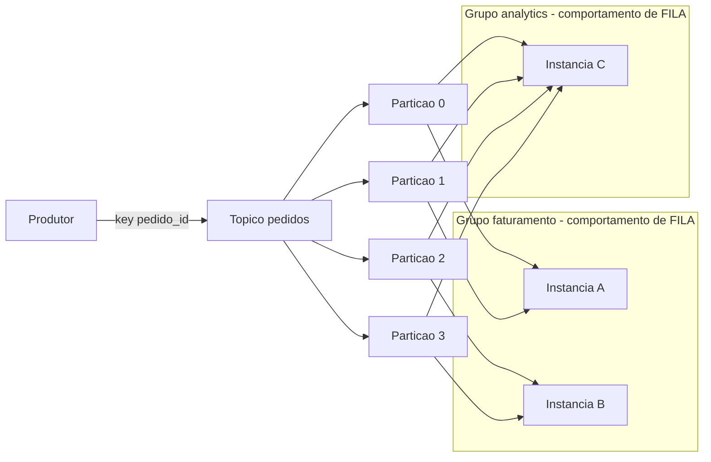

# Pub/Sub, Queue, Topic, Partition e Consumer Groups

> **Bloco:** Mensageria e streaming · **Nível:** Intermediário/Avançado · **Tempo de leitura:** ~23 min

## TL;DR

Esses cinco termos formam o vocabulário central da mensageria, e usá-los com precisão é o que separa um arquiteto de alguém que "já mexeu com fila". **Queue** (fila) e **Pub/Sub** (publish/subscribe) são os dois *modelos de entrega* fundamentais: na fila, cada mensagem vai para **um** consumidor entre vários que competem; no pub/sub, cada mensagem é entregue a **todos** os assinantes interessados. **Topic** é o canal lógico nomeado onde os eventos fluem. **Partition** é a subdivisão física de um tópico que habilita paralelismo e ordenação local — é a unidade de escala. **Consumer group** é o mecanismo (em Kafka/Pulsar) que reconcilia os dois modelos: dentro de um grupo o comportamento é de fila (cada partição vai para um membro), e entre grupos o comportamento é de pub/sub (cada grupo recebe tudo). Dominar essa matriz — fila vs pub/sub × tópico vs partição × grupo — é o que permite desenhar topologias que escalam sem quebrar ordenação nem duplicar processamento.

## O problema que resolve

A mensageria precisa resolver duas demandas que parecem contraditórias. A primeira é **distribuir trabalho**: tenho mais tarefas do que um único processo dá conta, então quero N workers dividindo a carga, cada tarefa processada exatamente por um deles. Esse é o modelo de **fila** (*point-to-point*). A segunda é **difundir informação**: aconteceu um evento e vários sistemas independentes querem saber dele — o de faturamento, o de notificação, o de analytics — cada um recebendo sua própria cópia. Esse é o modelo **pub/sub** (*publish/subscribe*).

Historicamente, JMS já distinguia `Queue` (point-to-point) de `Topic` (pub/sub) como duas APIs separadas. O problema é que esses dois modelos puros não cobrem o caso mais comum em sistemas modernos: *"quero que cada domínio receba todos os eventos (pub/sub), mas dentro de cada domínio quero N instâncias dividindo a carga (fila)"*. É exatamente para unir os dois mundos que o Kafka introduziu **partições** + **consumer groups**, e o Pulsar introduziu seus **subscription types**. A partição resolve a escala (paralelismo + ordenação local) e o consumer group resolve a coexistência dos dois modelos de entrega sobre o mesmo dado.

## O que é (definição aprofundada)

**Queue (fila).** Um canal onde mensagens são enfileiradas e entregues a consumidores em regime de *competing consumers*: a mensagem é consumida por **um** consumidor e (no broker tradicional) removida após o ack. Escala adicionando consumidores que competem pela mesma fila. RabbitMQ e AWS SQS são representantes diretos.

**Pub/Sub (publish/subscribe).** Um modelo onde produtores (*publishers*) publicam em um canal e **todos** os assinantes (*subscribers*) inscritos recebem cada mensagem. Há desacoplamento total entre quem produz e quem consome — o produtor não sabe quantos nem quais consumidores existem. AWS SNS, o `fanout exchange` do RabbitMQ e qualquer tópico Kafka lido por múltiplos grupos implementam isso.

**Topic (tópico).** O **canal lógico nomeado** que agrupa mensagens de uma mesma categoria semântica (ex.: `pedidos.criados`, `pagamentos.aprovados`). É a unidade de organização — análogo a uma tabela ou pasta. Em Kafka, o tópico é um log; em RabbitMQ, `topic` é um *tipo de exchange* que roteia por padrões de routing key (cuidado: a palavra "topic" significa coisas diferentes nos dois mundos).

**Partition (partição).** A subdivisão física de um tópico em vários logs paralelos. Cada partição é um log **ordenado e independente**; mensagens recebem **offsets** crescentes dentro da partição. A partição é a **unidade de paralelismo e de ordenação**: a ordem só é garantida dentro de uma partição, nunca entre partições. A chave da mensagem (*key*) determina, via hash, em qual partição ela cai — garantindo que toda a mesma chave preserve ordem. O número de partições é o teto do paralelismo de um consumer group.

**Consumer group (grupo de consumidores).** Um conjunto de consumidores identificado por um `group.id` que **colaboram** para consumir um tópico. O **group coordinator** distribui as partições entre os membros: cada partição é atribuída a **exatamente um** membro do grupo. Assim, dentro do grupo há comportamento de **fila** (carga dividida, sem duplicação); entre grupos diferentes há comportamento de **pub/sub** (cada grupo recebe o fluxo completo). Quando membros entram ou saem, ocorre **rebalance**.

## Como funciona

**A reconciliação fila × pub/sub no Kafka.** Suponha o tópico `pedidos` com 4 partições (P0–P3). O grupo `faturamento` tem 2 instâncias: o coordinator atribui P0,P1 à instância A e P2,P3 à instância B. Carga dividida, cada partição lida por um só membro — isso é **fila**. Agora o grupo `analytics` se inscreve no mesmo tópico: ele recebe **todas** as 4 partições, independentemente do que `faturamento` faz, com seus próprios offsets — isso é **pub/sub**. Os dois grupos avançam em ritmos diferentes; o `__consumer_offsets` guarda a posição de cada grupo por partição. Adicionar uma terceira instância em `faturamento` dispara um rebalance que redistribui as 4 partições entre 3 membros (um membro fica com 2 partições, dois ficam com 1). Adicionar uma **quinta** instância não adianta: só há 4 partições, a quinta fica ociosa. **O paralelismo de um grupo nunca excede o número de partições.**

**O papel da chave.** Quando o produtor define `key=pedido_id`, todas as mensagens daquele pedido caem na mesma partição (hash determinístico) e portanto mantêm ordem relativa e são processadas pela mesma instância. Sem chave, o produtor distribui round-robin/sticky entre partições maximizando throughput mas perdendo garantia de ordem por entidade. **A escolha da chave é uma decisão de design de domínio**, não um detalhe técnico: ela define a unidade de ordenação e a granularidade de paralelismo.

**Rebalance.** É o protocolo que reatribui partições quando a composição do grupo muda (instância nova, morta, ou metadados do tópico alterados). Durante o rebalance "clássico", há uma pausa (*stop-the-world*) em que ninguém consome — daí o esforço do Kafka 4.0 em prover o novo protocolo *consumer rebalance* (cooperativo, incremental), que reduz drasticamente essa interrupção. Rebalances frequentes (por `max.poll.interval.ms` mal configurado, GC longo etc.) são uma fonte clássica de instabilidade.

**No Pulsar, o mesmo problema, modelado de outro jeito.** O Pulsar expõe **subscription types** explícitos sobre o tópico: *Exclusive* (um único consumidor, ordem total, sem escala), *Failover* (consumidores em standby com prioridade), *Shared* (round-robin entre vários consumidores, escala mas perde ordem) e *Key_Shared* (vários consumidores, mas mensagens da mesma chave vão sempre para o mesmo consumidor, preservando ordem por chave com escala). Repare que *Key_Shared* é o análogo do consumer group + chave do Kafka, e *Shared* é o competing-consumers puro de uma fila — o Pulsar deixa você escolher o modelo de entrega por assinatura, não pela topologia de partições.

## Diagrama de fluxo



Dentro de cada grupo, cada partição vai para um único membro (fila). Entre os grupos `faturamento` e `analytics`, o mesmo fluxo é entregue a ambos (pub/sub). O grupo `analytics` com uma só instância recebe todas as 4 partições.

## Exemplo prático / caso real

Em um e-commerce brasileiro, o tópico Kafka `carrinho.eventos` recebe eventos de adição/remoção de itens, particionado por `sessao_id` com 12 partições. Três domínios consomem:

- **Grupo `checkout`** (4 instâncias): precisa processar os eventos **em ordem por sessão** para reconstruir o estado do carrinho. A chave `sessao_id` garante que todos os eventos de uma sessão caiam na mesma partição e sejam processados pela mesma instância, em ordem. Com 4 instâncias e 12 partições, cada instância cuida de 3 partições — escala saudável com folga para rebalance.
- **Grupo `recomendacao`** (2 instâncias): consome o mesmo fluxo independentemente para alimentar features de "quem viu também levou". Ordem por sessão também importa aqui, e a mesma chave entrega isso de graça.
- **Grupo `analytics`** (1 instância): joga tudo no data warehouse. Ordem entre sessões é irrelevante, mas ele recebe o fluxo completo via pub/sub sem afetar os outros grupos.

```text
// Produtor
producer.send(topic="carrinho.eventos", key=evento.sessao_id, value=evento)

// Consumidor do grupo checkout
consumer.subscribe(["carrinho.eventos"], group="checkout")
loop:
  for record in consumer.poll():
    aplicarEvento(record)        // ordem garantida por particao/sessao
  consumer.commitSync()
```

Compare com como um **AWS SQS + SNS** modelaria o pub/sub explicitamente: o SNS publica em um *topic* e faz fan-out para múltiplas filas SQS (uma por domínio), e cada fila tem seu pool de workers competindo. Aqui o pub/sub (SNS) e a fila (SQS) são componentes fisicamente separados, ao passo que no Kafka ambos os comportamentos emergem da combinação tópico-partição-grupo. Uma fintech que precisa de ordenação estrita em FIFO usaria **SQS FIFO** com *MessageGroupId* — que é, conceitualmente, a mesma ideia da chave de partição: mensagens do mesmo grupo são entregues em ordem, grupos diferentes em paralelo.

## Quando usar / Quando evitar

**Modele como fila (competing consumers) quando** o objetivo é dividir trabalho transitório entre workers intercambiáveis e cada item deve ser processado uma única vez. Não há benefício em fan-out.

**Modele como pub/sub quando** múltiplos domínios independentes precisam reagir ao mesmo evento. Em Kafka, basta um consumer group por domínio; em AWS, SNS→SQS; em RabbitMQ, um `fanout`/`topic exchange` com uma fila por consumidor.

**Sobre número de partições:** mais partições = mais paralelismo possível e mais throughput, mas também mais overhead (file handles, memória, tempo de rebalance, mais arquivos abertos por broker). **Evite over-partitioning** prematuro — repartir um tópico em produção rebalanceia chaves entre partições e pode quebrar ordenação de dados já existentes. Dimensione partições pelo pico de paralelismo esperado mais uma margem, não por "vai que precisa".

**Evite partição única para "garantir ordem global"** a não ser que o volume seja realmente baixo: você mata o paralelismo e cria um gargalo. Prefira modelar a chave de modo que a ordem necessária seja sempre *dentro* de uma entidade (sessão, conta, pedido), que é o que importa de fato no domínio.

## Anti-padrões e armadilhas comuns

- **Mais instâncias que partições no mesmo grupo.** Instâncias excedentes ficam ociosas. Gente que escala horizontal sem aumentar partições paga por máquinas que não fazem nada.
- **Assumir ordem entre partições.** Eventos de chaves diferentes não têm ordem garantida entre si. Lógica que depende de "o evento A sempre chega antes do B" quando A e B caem em partições distintas vai falhar de forma intermitente e dificílima de depurar.
- **Chave mal escolhida → partições desbalanceadas (hot partition).** Se 80% do tráfego tem a mesma chave (ex.: particionar por `pais` num marketplace só do Brasil), uma partição vira gargalo e o paralelismo evapora. A chave precisa ter boa cardinalidade e distribuição.
- **Confundir o `topic exchange` do RabbitMQ com o `topic` do Kafka.** No RabbitMQ, "topic" é um tipo de roteamento por padrões de routing key (`pedidos.*.brasil`); no Kafka, "topic" é o log particionado. São conceitos diferentes com o mesmo nome.
- **Rebalances constantes.** `max.poll.interval.ms` curto demais, processamento lento por lote, ou GC pausando o consumidor fazem o coordinator achar que a instância morreu e disparam rebalances em cascata, derrubando o throughput. Ajuste o tamanho do poll e o intervalo.
- **Reusar o mesmo `group.id` sem querer.** Dois serviços diferentes que acidentalmente compartilham `group.id` passam a *dividir* as partições em vez de cada um receber tudo — um clássico bug de "metade dos eventos sumiu".

## Relação com outros conceitos

Este conceito é a mecânica detalhada que sustenta a distinção **Message Brokers vs Log-based Streaming**. A escolha da chave de partição é a base do **Stream Processing** (Kafka Streams e Flink reparticionam por chave para fazer agregações e joins com estado). O comportamento de competing consumers dentro do grupo é o que cria a necessidade de **idempotência** (a mesma partição pode ser reprocessada após um rebalance ou crash, gerando redelivery) e de **Dead Letter Queue** para isolar mensagens venenosas. Em arquitetura, pub/sub é o substrato da **coreografia** em **Event-Driven Architecture** e habilita o **Event-carried State Transfer** descrito por Fowler, em que cada consumidor mantém sua própria réplica do estado lendo o fluxo de eventos.

## Referências

- [Apache Kafka — Documentation](https://kafka.apache.org/documentation/) — tópicos, partições, produtores, consumidores e o modelo de log.
- [Confluent — Kafka Consumer Design: Consumers, Consumer Groups, and Offsets](https://docs.confluent.io/kafka/design/consumer-design.html) — atribuição de partições, group coordinator e offsets.
- [Confluent — What is Kafka? Topics, Producers, Consumers, Brokers Explained](https://docs.confluent.io/kafka/introduction.html) — fundamentos de tópicos e partições.
- [Apache Pulsar — Messaging](https://pulsar.apache.org/docs/next/concepts-messaging/) — subscription types: Exclusive, Failover, Shared e Key_Shared.
- [RabbitMQ — Consumers](https://www.rabbitmq.com/docs/consumers) — competing consumers e modelo de fila.
- [AWS — Amazon SNS dead-letter queues / pub-sub](https://docs.aws.amazon.com/sns/latest/dg/sns-dead-letter-queues.html) — fan-out SNS→SQS como pub/sub explícito.
- *Designing Data-Intensive Applications*, Martin Kleppmann (O'Reilly, 2017) — Capítulo 11 detalha partições, logs e consumer groups.
