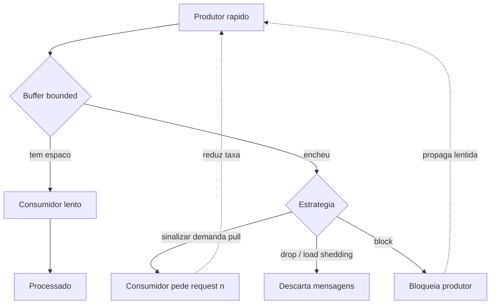

# Backpressure e estratégias de controle de fluxo

> **Bloco:** Mensageria e streaming · **Nível:** Intermediário/Avançado · **Tempo de leitura:** ~22 min

## TL;DR

**Backpressure** (contrapressão) é o mecanismo pelo qual um consumidor lento sinaliza ao produtor rápido que precisa desacelerar, evitando que o consumidor seja inundado e que filas intermediárias cresçam sem limite. É a diferença entre um sistema que degrada graciosamente sob sobrecarga e um que colapsa com `OutOfMemoryError` ou perda de dados. Existem essencialmente quatro respostas a um consumidor que não acompanha: **bufferizar** (perigoso se ilimitado), **descartar** (*drop/sampling*, aceitável só para dados perecíveis), **bloquear** (acoplar produtor ao ritmo do consumidor) ou **sinalizar demanda** (modelo *pull*, em que o consumidor pede quanto consegue processar). A especificação **Reactive Streams** padronizou o modelo pull com `Subscription.request(n)` para a JVM. Em mensageria concreta, RabbitMQ aplica backpressure via **prefetch (QoS)** e *flow control*, enquanto Kafka aplica naturalmente porque o consumidor faz **poll** no seu próprio ritmo — o "transbordamento" vira *consumer lag* (offset acumulado), que você monitora em vez de estourar memória.

## O problema que resolve

Em qualquer pipeline assíncrono — produtor → buffer/fila → consumidor — os ritmos quase nunca coincidem. Se o produtor é mais rápido que o consumidor de forma sustentada, algo tem que ceder. Sem controle de fluxo, o buffer intermediário cresce indefinidamente: a memória do broker ou do processo enche, a latência dispara (a fila fica gigante), o garbage collector entra em pânico e, no limite, o processo morre ou começa a derrubar mensagens silenciosamente. Esse é o **problema do fast producer / slow consumer**, e ele é insidioso porque não aparece em testes de carga leve — só se manifesta no pico de Black Friday, quando é tarde.

O **Reactive Manifesto** colocou backpressure no centro da definição de sistema resiliente: *"back-pressure is applied through explicit message-passing to enable load management, elasticity, and flow control by shaping and monitoring the message queues in the system"*. A ideia-chave é tornar o limite **explícito e propagado**: em vez de deixar o produtor empurrar dados cegamente (*push*), o sistema deve permitir que o consumidor controle quanto recebe. A especificação **Reactive Streams** (versão 1.0.4 para a JVM) formalizou isso: o escopo declarado é *"asynchronous streams of data with non-blocking back pressure"*, com a garantia explícita de que o lado receptor *"is not forced to buffer arbitrary amounts of data"*.

## O que é (definição aprofundada)

**Backpressure** é a propagação reversa de um sinal de capacidade: o consumidor comunica, ao longo da cadeia, quanto trabalho ainda consegue absorver, e cada estágio anterior ajusta sua taxa de emissão. O objetivo é manter os buffers **bounded** (limitados) e o sistema em equilíbrio dinâmico.

Há dois modelos opostos de transferência de dados:

- **Push** (empurra): o produtor envia assim que tem dado, sem perguntar. Simples e de baixa latência, mas perigoso — se o consumidor não acompanha, o buffer entre eles cresce. Para ser seguro, push exige um mecanismo de feedback explícito.
- **Pull** (puxa): o consumidor **requisita** dados quando está pronto, na quantidade que consegue processar. Backpressure é intrínseca: o produtor literalmente não produz além do que foi pedido. É o modelo do `request(n)` do Reactive Streams e do `poll()` do Kafka.

Quando o consumidor não acompanha, as **estratégias de controle de fluxo** são:

- **Buffering**: acumular em um buffer. Só é seguro se **limitado** (bounded) e com política definida para quando enche.
- **Dropping / load shedding**: descartar mensagens (as mais antigas, as mais novas, ou amostrar). Aceitável para telemetria, métricas e dados perecíveis; inaceitável para transações financeiras.
- **Blocking**: bloquear o produtor até o consumidor liberar espaço. Garante zero perda mas acopla os ritmos e pode propagar lentidão para cima (o que, controladamente, pode ser desejável).
- **Demand signaling (pull)**: o consumidor pede `n` itens; o produtor respeita o teto. É a forma "correta" segundo Reactive Streams — não-bloqueante e assíncrona.
- **Throttling / rate limiting**: impor um teto de taxa explícito (X msg/s), independentemente do ritmo instantâneo do consumidor.

Termos-chave: **bounded buffer**, **lag** (atraso acumulado, medido em Kafka como diferença entre o offset mais recente e o offset commitado pelo consumidor), **prefetch / QoS** (no RabbitMQ, quantas mensagens não confirmadas o broker entrega antecipadamente), **demand** (`request(n)`), **load shedding**.

## Como funciona

**RabbitMQ (push com prefetch).** O RabbitMQ entrega mensagens via push, mas o **prefetch count** (QoS por canal) impõe backpressure: o broker entrega no máximo `prefetch` mensagens não confirmadas; ao atingir esse teto, **para de entregar** naquele canal até que pelo menos um ack chegue. Prefetch baixo (ex.: 1–10) acopla fortemente o broker ao ritmo do consumidor e evita inundá-lo, ao custo de throughput; prefetch alto (a doc sugere 100–300 como faixa de bom throughput) aumenta a vazão mas arrisca sobrecarregar consumidores lentos. Prefetch 0 ("ilimitado") **desliga** o backpressure e é uma armadilha. Além disso, o RabbitMQ tem *internal flow control*: quando filas/conexões internas ficam sobrecarregadas ou os *memory/disk alarms* disparam, o broker **bloqueia publishers** — backpressure propagada do broker de volta para o produtor.

**Kafka (pull nativo).** O consumidor controla o ritmo: ele chama `poll()` e busca um lote (`max.poll.records`), processa e só então faz o próximo poll. O broker nunca empurra; ele apenas serve o que foi pedido. Logo, um consumidor lento **não** infla memória do broker — o dado já está no log persistido. O que acontece é o **consumer lag**: o offset do consumidor fica cada vez mais atrás do final do log. Isso transforma backpressure num **problema de observabilidade e capacidade**: você monitora o lag, e se ele cresce de forma sustentada, escala consumidores (até o limite de partições) ou otimiza o processamento. A retenção do log é o seu "buffer" — desde que o consumidor recupere o atraso antes de a retenção apagar o dado, nada se perde.

**Reactive Streams (demanda explícita na JVM).** A interface é minimalista: o `Subscriber` chama `Subscription.request(n)` para sinalizar que consegue receber `n` elementos; o `Publisher` só emite `onNext` até esse limite. A spec é taxativa: *"A Subscriber MUST signal demand via Subscription.request(long n) to receive onNext signals"*, e *"it is the responsibility of the Subscriber to decide when and how many elements it is able and willing to receive"*. Bibliotecas como Project Reactor, RxJava e Akka Streams implementam essa spec; operadores como `onBackpressureBuffer`, `onBackpressureDrop` e `onBackpressureLatest` materializam as estratégias acima de forma declarativa.

## Diagrama de fluxo



O ponto crítico é o nó "encheu": um sistema sem backpressure não tem esse ramo — o buffer apenas cresce até estourar. Um sistema com backpressure escolhe conscientemente entre sinalizar demanda (preferível), descartar (dados perecíveis) ou bloquear (zero perda, ao custo de propagar a lentidão).

## Exemplo prático / caso real

Em um marketplace, o serviço de **busca** consome um stream Kafka de atualizações de produtos (`produtos.atualizados`) para reindexar no Elasticsearch. Durante uma migração de catálogo, o time de cadastro despeja **10 milhões** de atualizações em poucos minutos — produtor rapidíssimo. O consumidor de indexação processa ~5 mil docs/s.

Por ser Kafka (pull), nada estoura: o broker apenas armazena os eventos no log, e o **consumer lag** do grupo `indexador` cresce para milhões. O time observa o lag no monitoramento (Burrow / métricas do Kafka), confirma que a retenção (7 dias) é folgada o suficiente, e simplesmente **escala o número de partições + instâncias** do indexador para drenar o backlog em algumas horas. Backpressure aqui é capacidade + observabilidade, não bloqueio.

Compare com a fila **RabbitMQ** do mesmo marketplace que processa **chamadas a um gateway de pagamento externo** com rate limit de 100 req/s. Aqui um lag silencioso não basta — o gateway rejeita acima do limite. O consumidor usa **prefetch baixo** (ex.: 10) combinado com um *rate limiter* (token bucket) de 100/s; ao atingir o teto, ele **para de fazer ack**, o broker para de entregar (backpressure por prefetch), e o produtor que publica acima da capacidade eventualmente vê os *publisher confirms* atrasarem — propagando a contrapressão para cima. Em uma fintech, esse acoplamento controlado é desejável: melhor desacelerar o pipeline inteiro do que estourar o rate limit e tomar bloqueio do parceiro.

```text
// Consumidor RabbitMQ com prefetch + rate limit
channel.basicQos(10)               // prefetch: no maximo 10 nao confirmadas
on message(msg):
  rateLimiter.acquire()            // bloqueia se passar de 100/s
  chamarGateway(msg)
  channel.basicAck(msg)            // libera espaco no prefetch -> broker entrega mais
```

Para um pipeline de **telemetria/cliques** (dados perecíveis e de altíssimo volume), a estratégia certa muda: *load shedding*. Um agente local com buffer bounded e `onBackpressureDrop` (ou amostragem) descarta o excedente — perder 0,1% dos cliques em pico é aceitável; estourar a memória do agente e perder *tudo* não é.

## Quando usar / Quando evitar

**Prefira pull / demand signaling** sempre que possível: é o modelo seguro por construção. Kafka (poll), SQS (long polling/receive) e Reactive Streams na JVM já operam assim.

**Use buffering bounded + sinalização** para a maioria dos casos transacionais: você quer absorver picos curtos sem perder dados, mas com um teto que dispara backpressure quando excedido.

**Use load shedding (drop)** apenas para dados perecíveis e de alto volume — métricas, logs amostráveis, telemetria — onde a perda parcial é aceitável e a completude não é requisito.

**Use blocking** quando a integridade é inegociável e você prefere propagar a lentidão a montante (ex.: pipeline financeiro contra um parceiro com rate limit). Aceite que isso acopla os ritmos.

**Evite** o modelo push sem feedback. **Evite** buffers ilimitados (prefetch 0, fila sem limite, `Flux` sem operador de backpressure) — é a receita do `OutOfMemoryError` no pior momento possível. **Evite** prefetch alto demais em consumidores cujo processamento é pesado e variável.

## Anti-padrões e armadilhas comuns

- **Buffer ilimitado.** Prefetch 0 no RabbitMQ, `LinkedBlockingQueue` sem capacidade, ou um `Flux`/observable sem estratégia de backpressure. O sistema "funciona" em carga leve e explode em produção sob pico. Sempre bounded.
- **Ignorar consumer lag no Kafka.** Como o broker não estoura, é fácil esquecer de monitorar o lag. Quando alguém percebe, a retenção já apagou eventos não consumidos e houve **perda silenciosa de dados**. Lag crescente sustentado é um alarme de capacidade, não um detalhe.
- **Backpressure só na borda.** Aplicar contrapressão no consumidor final mas não propagá-la para os estágios intermediários — o gargalo apenas se desloca para um buffer interno que ninguém monitora.
- **Confundir backpressure com retry.** Retry reenvia o que falhou; backpressure regula a *taxa* do que está chegando. Adicionar retry agressivo sob sobrecarga **piora** o problema — você multiplica a carga em cima de um consumidor que já não dá conta (*retry storm*).
- **Drop em dados que não podem ser perdidos.** Aplicar `onBackpressureDrop` num stream de transações financeiras. A estratégia tem que casar com a criticidade do dado.
- **Prefetch alto com processamento lento.** O broker empurra 300 mensagens para um consumidor que leva segundos por mensagem; em um rebalance/crash, todas voltam para a fila e são reprocessadas, amplificando o problema.

## Relação com outros conceitos

Backpressure é a face de controle de fluxo do contraste **Message Brokers vs Log-based Streaming**: brokers tradicionais a implementam via prefetch/ack e flow control no servidor, enquanto logs a transformam em lag observável pelo modelo pull. Conecta-se a **Pub/Sub e Consumer Groups** (escalar partições/consumidores é a resposta de capacidade à contrapressão) e a **Stream Processing** (Flink tem backpressure interna entre operadores; Kafka Streams herda o pull do consumer). É um dos quatro pilares do **Reactive Manifesto** (junto a responsivo, resiliente e elástico) e o motivo de existir da especificação **Reactive Streams**. Por fim, complementa **Dead Letter Queue**: backpressure regula *volume*, DLQ isola *mensagens problemáticas* — problemas distintos que juntos compõem o controle de robustez de um pipeline.

## Referências

- [The Reactive Manifesto](https://www.reactivemanifesto.org/) — backpressure como pilar de sistemas resilientes e elásticos.
- [Reactive Streams](https://www.reactive-streams.org/) — especificação de streams assíncronos com non-blocking backpressure e o modelo `request(n)`.
- [Reactive Streams Specification for the JVM (GitHub)](https://github.com/reactive-streams/reactive-streams-jvm) — interfaces, regras e TCK.
- [RabbitMQ — Consumer Acknowledgements and Publisher Confirms](https://www.rabbitmq.com/docs/confirms) — prefetch (QoS) e controle de fluxo via ack.
- [RabbitMQ — Consumers](https://www.rabbitmq.com/docs/consumers) — recomendações de prefetch e impacto no throughput.
- [Apache Kafka — Documentation](https://kafka.apache.org/documentation/) — modelo pull (`poll`), `max.poll.records` e consumer lag.
- *Designing Data-Intensive Applications*, Martin Kleppmann (O'Reilly, 2017) — discussão de buffers, perda de mensagens e fluxo em sistemas de mensageria (Cap. 11).
